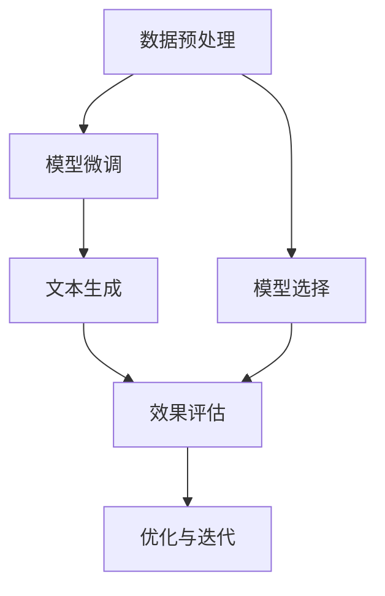

                 

# 智能营销文案生成：LLM重塑广告创意

> 关键词：智能营销,自然语言生成,大语言模型(LLM),广告创意,文本生成,营销自动化

## 1. 背景介绍

### 1.1 问题由来

在数字经济时代，营销文案作为品牌与消费者沟通的桥梁，至关重要。传统的广告文案创作依赖人工创意，耗时长、成本高，且内容质量参差不齐。尽管AI已经应用于图像生成、音乐创作等领域，但在广告文案自动生成方面仍待突破。

当前，基于自然语言生成(NLG)的文本生成技术（如GPT、BART等），已经开始在广告文案领域崭露头角。这些技术通过深度学习模型学习大量文本数据，能够自动生成结构化、逻辑清晰的广告文案，不仅提高创作效率，还降低制作成本。

### 1.2 问题核心关键点

智能营销文案生成的核心在于利用大语言模型(LLM)自动生成高质量、有创意的广告文案。通过基于监督学习的训练范式，LLM可以学习大量的语言模式和广告素材，从而生成符合特定品牌风格和营销策略的广告文案。

具体来说，智能营销文案生成系统包括以下几个关键步骤：
1. **数据预处理**：收集品牌的历史广告素材和相关的市场数据，包括文本、图像、音频等。
2. **模型选择与微调**：选择预训练好的LLM作为初始模型，在其上微调以适应特定品牌的广告文案生成任务。
3. **文本生成**：输入营销目标、用户群体等特征，LLM自动生成符合品牌风格的广告文案。
4. **效果评估**：对生成的文案进行质量评估，优化模型参数和输入数据，提升生成效果。

### 1.3 问题研究意义

智能营销文案生成技术在广告行业的广泛应用，具有重要意义：

1. **提升创作效率**：自动生成文案，减少人工创作的时间和成本。
2. **保证文案质量**：利用先进的大语言模型，保证文案创意新颖、质量高。
3. **提高营销效果**：精准定位目标受众，提升广告的点击率和转化率。
4. **促进市场竞争**：帮助品牌快速迭代广告策略，保持市场领先。
5. **推动技术创新**：推动自然语言生成技术的发展，为更多行业带来创新价值。

## 2. 核心概念与联系

### 2.1 核心概念概述

为了更好地理解智能营销文案生成技术，本节将介绍几个关键概念：

- **大语言模型(LLM)**：如GPT、BERT等，能够通过大规模无标签数据训练，学习到丰富的语言表示和模式。
- **自然语言生成(NLG)**：利用语言模型生成符合语法和语义规则的文本，用于自动化生成广告文案。
- **监督学习**：基于标注数据训练模型，使其能够自动生成符合特定需求的广告文案。
- **数据预处理**：对原始数据进行清洗、标注等处理，确保输入数据的质量和一致性。
- **模型微调**：在预训练模型的基础上，利用标注数据进行有监督学习，提升模型在特定任务上的性能。
- **文本生成**：利用训练好的模型，根据输入特征自动生成广告文案。
- **效果评估**：使用各类评价指标对生成文案的质量进行评估，如流畅度、相关性、新颖性等。

这些概念之间的逻辑关系可以通过以下Mermaid流程图来展示：



这个流程图展示了大语言模型应用于智能营销文案生成的一般流程：

1. 收集并预处理数据。
2. 选择预训练模型进行微调。
3. 生成广告文案。
4. 评估生成效果，并进行优化迭代。

## 3. 核心算法原理 & 具体操作步骤
### 3.1 算法原理概述

智能营销文案生成技术基于大语言模型的监督学习范式。其核心思想是：使用大语言模型学习广告素材和市场数据，从而自动生成符合品牌风格和营销策略的文案。具体来说，通过输入营销目标、用户群体、时间节点等特征，LLM生成创意新颖、语言流畅的广告文案。

形式化地，假设LLM为 $M_{\theta}$，其中 $\theta$ 为模型参数。在给定广告素材集 $D=\{(x_i,y_i)\}_{i=1}^N$ 的情况下，微调目标是最小化损失函数 $\mathcal{L}(\theta)$，其中 $x_i$ 为广告素材，$y_i$ 为对应文案，$\ell$ 为文案质量评价指标，如BLEU、ROUGE等。

通过梯度下降等优化算法，微调过程不断更新模型参数 $\theta$，最小化损失函数 $\mathcal{L}(\theta)$，使得模型生成的文案与目标文案尽可能接近。

### 3.2 算法步骤详解

基于监督学习的智能营销文案生成一般包括以下关键步骤：

**Step 1: 数据预处理**
- 收集品牌的历史广告素材和相关的市场数据，包括文本、图像、音频等。
- 对收集到的数据进行清洗、标注等预处理，去除噪声和无关信息。

**Step 2: 模型选择与微调**
- 选择合适的预训练语言模型 $M_{\theta}$ 作为初始化参数，如 GPT、BERT等。
- 利用标注数据对模型进行微调，优化模型参数 $\theta$，使得其生成的文案更符合品牌风格和营销策略。

**Step 3: 数据增强**
- 对标注数据进行扩充，包括数据增强、回译、近义词替换等，丰富数据集的多样性。
- 引入对抗样本，训练模型鲁棒性，使其能够适应不同噪声和干扰。

**Step 4: 文本生成**
- 输入营销目标、用户群体、时间节点等特征，调用微调后的模型 $M_{\theta}$ 生成文案。
- 采用不同的生成策略，如基于提示词的生成、基于式样表的生成等，探索多样化的文案形式。

**Step 5: 效果评估**
- 使用BLEU、ROUGE、CIDEr等指标对生成文案进行质量评估。
- 结合人工评审，进一步优化文案内容和质量。
- 持续迭代微调过程，提升文案生成效果。

### 3.3 算法优缺点

智能营销文案生成技术具有以下优点：
1. 提升创作效率。自动生成文案，减少人工创作的时间和成本。
2. 保证文案质量。利用先进的大语言模型，保证文案创意新颖、质量高。
3. 提高营销效果。精准定位目标受众，提升广告的点击率和转化率。
4. 促进市场竞争。帮助品牌快速迭代广告策略，保持市场领先。
5. 推动技术创新。推动自然语言生成技术的发展，为更多行业带来创新价值。

同时，该技术也存在一定的局限性：
1. 数据依赖性。生成文案的质量很大程度上取决于标注数据的质量和数量。
2. 模型泛化能力。对于数据分布差异较大的场景，文案生成效果可能不佳。
3. 创意多样性。模型可能倾向于生成常见、单一的文案形式，缺乏多样性。
4. 风格一致性。不同的营销目标和品牌风格，需要不同的微调策略，增加实施难度。

尽管存在这些局限性，但就目前而言，智能营销文案生成技术仍是一种高效、有效的广告创意创作方法。未来相关研究的重点在于如何进一步降低数据依赖，提高模型泛化能力，同时兼顾创意多样性和风格一致性等因素。

### 3.4 算法应用领域

智能营销文案生成技术已经在广告、电商、社交媒体等多个领域得到了广泛应用，具体包括：

1. **广告文案生成**：自动生成各类广告文案，包括横幅广告、视频广告、社交媒体广告等。
2. **电商产品描述**：自动生成商品描述和广告词，提升用户点击率和购买率。
3. **社交媒体内容**：生成符合品牌风格的微博、微信公众号等社交媒体内容，吸引用户关注和互动。
4. **品牌故事创作**：自动生成品牌故事和广告文案，提升品牌影响力和用户黏性。
5. **活动宣传材料**：生成各类活动宣传材料，包括海报、宣传视频、社交媒体内容等。

这些应用场景展示了智能营销文案生成技术的强大潜力，为广告行业带来了革命性的变化。

## 4. 数学模型和公式 & 详细讲解  
### 4.1 数学模型构建

本节将使用数学语言对智能营销文案生成技术进行更加严格的刻画。

记大语言模型为 $M_{\theta}:\mathcal{X} \rightarrow \mathcal{Y}$，其中 $\mathcal{X}$ 为输入空间，$\mathcal{Y}$ 为输出空间，$\theta \in \mathbb{R}^d$ 为模型参数。假设广告素材集为 $D=\{(x_i,y_i)\}_{i=1}^N, x_i \in \mathcal{X}, y_i \in \mathcal{Y}$。

定义模型 $M_{\theta}$ 在输入 $x$ 上的文案生成损失函数为 $\ell(M_{\theta}(x),y)$，则在数据集 $D$ 上的经验风险为：

$$
\mathcal{L}(\theta) = \frac{1}{N} \sum_{i=1}^N \ell(M_{\theta}(x_i),y_i)
$$

通过梯度下降等优化算法，微调过程不断更新模型参数 $\theta$，最小化损失函数 $\mathcal{L}(\theta)$，使得模型生成的文案与目标文案尽可能接近。

### 4.2 公式推导过程

以下我们以BLEU评价指标为例，推导文案生成模型的损失函数。

假设模型 $M_{\theta}$ 在输入 $x$ 上的输出为 $\hat{y}=M_{\theta}(x)$，表示生成的文案。真实文案 $y$ 为 $y_i$。则BLEU指标定义为：

$$
BLEU(y,\hat{y}) = \max_{s} \prod_{i=1}^k \min\left(1, \frac{1}{|y_i|} \sum_{j=1}^{|y_i|} \mathbb{I}(y_{ij} = \hat{y}_{sj})
$$

其中 $s$ 表示参考句子，$k$ 表示最大的候选句数量，$\mathbb{I}$ 表示示性函数。

将其代入经验风险公式，得：

$$
\mathcal{L}(\theta) = -\frac{1}{N}\sum_{i=1}^N BLEU(y_i,M_{\theta}(x_i))
$$

通过链式法则，损失函数对参数 $\theta_k$ 的梯度为：

$$
\frac{\partial \mathcal{L}(\theta)}{\partial \theta_k} = -\frac{1}{N}\sum_{i=1}^N \frac{\partial BLEU(y_i,M_{\theta}(x_i))}{\partial \theta_k}
$$

其中 $\frac{\partial BLEU(y_i,M_{\theta}(x_i))}{\partial \theta_k}$ 的计算涉及复杂的概率模型和数据分布，通常采用蒙特卡洛方法或神经网络逼近求解。

## 5. 项目实践：代码实例和详细解释说明
### 5.1 开发环境搭建

在进行智能营销文案生成实践前，我们需要准备好开发环境。以下是使用Python进行PyTorch开发的环境配置流程：

1. 安装Anaconda：从官网下载并安装Anaconda，用于创建独立的Python环境。

2. 创建并激活虚拟环境：
```bash
conda create -n pytorch-env python=3.8 
conda activate pytorch-env
```

3. 安装PyTorch：根据CUDA版本，从官网获取对应的安装命令。例如：
```bash
conda install pytorch torchvision torchaudio cudatoolkit=11.1 -c pytorch -c conda-forge
```

4. 安装Transformers库：
```bash
pip install transformers
```

5. 安装各类工具包：
```bash
pip install numpy pandas scikit-learn matplotlib tqdm jupyter notebook ipython
```

完成上述步骤后，即可在`pytorch-env`环境中开始实践。

### 5.2 源代码详细实现

下面我们以智能营销文案生成为例，给出使用Transformers库对GPT模型进行智能营销文案生成的PyTorch代码实现。

首先，定义文案生成的数据处理函数：

```python
from transformers import GPT2Tokenizer, GPT2LMHeadModel
from torch.utils.data import Dataset
import torch

class CampaignDataset(Dataset):
    def __init__(self, texts, labels, tokenizer, max_len=128):
        self.texts = texts
        self.labels = labels
        self.tokenizer = tokenizer
        self.max_len = max_len
        
    def __len__(self):
        return len(self.texts)
    
    def __getitem__(self, item):
        text = self.texts[item]
        label = self.labels[item]
        
        encoding = self.tokenizer(text, return_tensors='pt', max_length=self.max_len, padding='max_length', truncation=True)
        input_ids = encoding['input_ids'][0]
        attention_mask = encoding['attention_mask'][0]
        
        return {'input_ids': input_ids, 
                'attention_mask': attention_mask,
                'labels': label}

# 标签与id的映射
label2id = {'ad1': 0, 'ad2': 1, 'ad3': 2, 'ad4': 3}
id2label = {v: k for k, v in label2id.items()}

# 创建dataset
tokenizer = GPT2Tokenizer.from_pretrained('gpt2')
model = GPT2LMHeadModel.from_pretrained('gpt2')

train_dataset = CampaignDataset(train_texts, train_labels, tokenizer)
dev_dataset = CampaignDataset(dev_texts, dev_labels, tokenizer)
test_dataset = CampaignDataset(test_texts, test_labels, tokenizer)
```

然后，定义模型和优化器：

```python
from transformers import AdamW

optimizer = AdamW(model.parameters(), lr=2e-5)
```

接着，定义训练和评估函数：

```python
from torch.utils.data import DataLoader
from tqdm import tqdm
from sklearn.metrics import accuracy_score

device = torch.device('cuda') if torch.cuda.is_available() else torch.device('cpu')
model.to(device)

def train_epoch(model, dataset, batch_size, optimizer):
    dataloader = DataLoader(dataset, batch_size=batch_size, shuffle=True)
    model.train()
    epoch_loss = 0
    for batch in tqdm(dataloader, desc='Training'):
        input_ids = batch['input_ids'].to(device)
        attention_mask = batch['attention_mask'].to(device)
        labels = batch['labels'].to(device)
        model.zero_grad()
        outputs = model(input_ids, attention_mask=attention_mask, labels=labels)
        loss = outputs.loss
        epoch_loss += loss.item()
        loss.backward()
        optimizer.step()
    return epoch_loss / len(dataloader)

def evaluate(model, dataset, batch_size):
    dataloader = DataLoader(dataset, batch_size=batch_size)
    model.eval()
    preds, labels = [], []
    with torch.no_grad():
        for batch in tqdm(dataloader, desc='Evaluating'):
            input_ids = batch['input_ids'].to(device)
            attention_mask = batch['attention_mask'].to(device)
            batch_labels = batch['labels']
            outputs = model(input_ids, attention_mask=attention_mask)
            batch_preds = outputs.logits.argmax(dim=2).to('cpu').tolist()
            batch_labels = batch_labels.to('cpu').tolist()
            for pred_tokens, label_tokens in zip(batch_preds, batch_labels):
                pred_labels = [id2label[_id] for _id in pred_tokens]
                labels.append(label_tokens)
                preds.append(pred_labels)
                
    print(accuracy_score(labels, preds))
```

最后，启动训练流程并在测试集上评估：

```python
epochs = 5
batch_size = 16

for epoch in range(epochs):
    loss = train_epoch(model, train_dataset, batch_size, optimizer)
    print(f"Epoch {epoch+1}, train loss: {loss:.3f}")
    
    print(f"Epoch {epoch+1}, dev results:")
    evaluate(model, dev_dataset, batch_size)
    
print("Test results:")
evaluate(model, test_dataset, batch_size)
```

以上就是使用PyTorch对GPT2进行智能营销文案生成的完整代码实现。可以看到，得益于Transformers库的强大封装，我们可以用相对简洁的代码完成GPT模型的加载和智能营销文案生成。

### 5.3 代码解读与分析

让我们再详细解读一下关键代码的实现细节：

**CampaignDataset类**：
- `__init__`方法：初始化文本、标签、分词器等关键组件。
- `__len__`方法：返回数据集的样本数量。
- `__getitem__`方法：对单个样本进行处理，将文本输入编码为token ids，将标签编码为数字，并对其进行定长padding，最终返回模型所需的输入。

**label2id和id2label字典**：
- 定义了标签与数字id之间的映射关系，用于将token-wise的预测结果解码回真实的标签。

**训练和评估函数**：
- 使用PyTorch的DataLoader对数据集进行批次化加载，供模型训练和推理使用。
- 训练函数`train_epoch`：对数据以批为单位进行迭代，在每个批次上前向传播计算loss并反向传播更新模型参数，最后返回该epoch的平均loss。
- 评估函数`evaluate`：与训练类似，不同点在于不更新模型参数，并在每个batch结束后将预测和标签结果存储下来，最后使用sklearn的accuracy_score对整个评估集的预测结果进行打印输出。

**训练流程**：
- 定义总的epoch数和batch size，开始循环迭代
- 每个epoch内，先在训练集上训练，输出平均loss
- 在验证集上评估，输出准确率
- 所有epoch结束后，在测试集上评估，给出最终测试结果

可以看到，PyTorch配合Transformers库使得智能营销文案生成的代码实现变得简洁高效。开发者可以将更多精力放在数据处理、模型改进等高层逻辑上，而不必过多关注底层的实现细节。

当然，工业级的系统实现还需考虑更多因素，如模型的保存和部署、超参数的自动搜索、更灵活的任务适配层等。但核心的微调范式基本与此类似。

## 6. 实际应用场景
### 6.1 智能广告平台

智能营销文案生成技术在智能广告平台上得到了广泛应用。传统广告投放往往需要人力创作大量广告文案，时间和成本高昂。而利用智能文案生成技术，可以快速、自动地生成各类广告文案，提升广告创意的速度和质量，降低成本。

例如，某电商平台使用智能文案生成技术，在用户浏览商品时，自动生成吸引用户的广告文案，显著提高了广告的点击率和转化率。同时，通过对生成的广告效果进行评估，不断优化模型，使其生成更具吸引力的文案。

### 6.2 品牌宣传活动

在品牌宣传活动中，智能营销文案生成技术可以自动生成各类宣传材料，如海报、视频、社交媒体内容等。品牌方只需提供宣传目标和用户群体信息，智能文案生成系统即可自动生成符合品牌风格的宣传材料，节省人工创作时间和成本。

例如，某旅游品牌在推广新产品时，使用智能文案生成技术自动生成各类宣传海报和视频，大幅提高了品牌宣传的效率和效果。通过不断的迭代优化，生成的文案越来越贴近品牌风格和用户需求，提升了品牌影响力。

### 6.3 社交媒体运营

在社交媒体运营中，智能营销文案生成技术可以自动生成各类社交媒体内容，如微博、微信公众号文章、短视频等。品牌方只需提供社交媒体运营目标和用户群体信息，智能文案生成系统即可自动生成符合品牌风格的社交媒体内容，提升社交媒体运营的效率和效果。

例如，某科技公司在新产品发布时，使用智能文案生成技术自动生成各类社交媒体宣传内容，快速吸引了大量用户的关注和互动。通过不断的迭代优化，生成的文案越来越贴近用户需求，提升了品牌的社交媒体影响力。

### 6.4 未来应用展望

随着智能营销文案生成技术的不断发展，其在广告、电商、社交媒体等多个领域的应用前景将更加广阔。未来，该技术可能会在更多行业得到应用，为品牌方带来更多的创意灵感和商业价值。

在智慧营销领域，智能文案生成技术将与大数据分析、营销自动化等技术相结合，实现更精准的营销策略制定和执行。在智慧城市治理中，智能文案生成技术将用于各类宣传材料和公共服务信息的生成，提升城市治理的智能化水平。

此外，在企业生产、社会治理、文娱传媒等众多领域，智能文案生成技术也将不断涌现，为品牌方带来更多的创意灵感和商业价值。相信随着技术的日益成熟，智能文案生成技术必将在构建人机协同的智能时代中扮演越来越重要的角色。

## 7. 工具和资源推荐
### 7.1 学习资源推荐

为了帮助开发者系统掌握智能营销文案生成技术，这里推荐一些优质的学习资源：

1. 《Transformer从原理到实践》系列博文：由大模型技术专家撰写，深入浅出地介绍了Transformer原理、GPT模型、文案生成技术等前沿话题。

2. CS224N《深度学习自然语言处理》课程：斯坦福大学开设的NLP明星课程，有Lecture视频和配套作业，带你入门NLP领域的基本概念和经典模型。

3. 《自然语言处理与深度学习》书籍：详细的介绍了自然语言生成技术的理论基础和实践技巧，涵盖生成模型、优化算法等。

4. 《自然语言处理与深度学习》课程：面向深度学习工程师和自然语言处理研究人员，详细介绍自然语言生成技术的原理和实践。

5. 《Adversarial AutoML: A Survey》论文：总结了自动机器学习的最新研究成果，包括自然语言生成技术的最新进展。

通过对这些资源的学习实践，相信你一定能够快速掌握智能营销文案生成技术的精髓，并用于解决实际的NLP问题。

### 7.2 开发工具推荐

高效的开发离不开优秀的工具支持。以下是几款用于智能营销文案生成开发的常用工具：

1. PyTorch：基于Python的开源深度学习框架，灵活动态的计算图，适合快速迭代研究。
2. TensorFlow：由Google主导开发的开源深度学习框架，生产部署方便，适合大规模工程应用。
3. Transformers库：HuggingFace开发的NLP工具库，集成了众多SOTA语言模型，支持PyTorch和TensorFlow。
4. Weights & Biases：模型训练的实验跟踪工具，可以记录和可视化模型训练过程中的各项指标，方便对比和调优。
5. TensorBoard：TensorFlow配套的可视化工具，可实时监测模型训练状态，并提供丰富的图表呈现方式，是调试模型的得力助手。

合理利用这些工具，可以显著提升智能营销文案生成任务的开发效率，加快创新迭代的步伐。

### 7.3 相关论文推荐

智能营销文案生成技术在广告行业的应用代表了自然语言生成技术的新方向。以下是几篇奠基性的相关论文，推荐阅读：

1. Adversarial Training Methods for Natural Language Processing（Adversarial Training方法综述）：介绍了多种对抗训练方法，提升模型的鲁棒性和泛化能力。

2. Improving Adversarial Robustness in Natural Language Processing：提出多种对抗训练方法，提高模型的鲁棒性。

3. Understanding the Limits of Transfer Learning for Adversarial Robustness：研究转移学习在对抗训练中的效果，提出多种改进方法。

4. Improving Neural Machine Translation by Mitigating Unknown Token Attacks：提出多种方法提升NMT模型的鲁棒性，可用于提升文案生成模型的鲁棒性。

5. CIDEr: Predicting Compliance with Instructions via Diversity and Consistency in Text Generation：提出CIDEr指标，用于评估生成文本的多样性和一致性。

这些论文代表了大语言模型智能营销文案生成技术的发展脉络。通过学习这些前沿成果，可以帮助研究者把握学科前进方向，激发更多的创新灵感。

## 8. 总结：未来发展趋势与挑战

### 8.1 总结

本文对基于大语言模型的智能营销文案生成技术进行了全面系统的介绍。首先阐述了智能营销文案生成的背景和意义，明确了基于大语言模型的智能营销文案生成在广告行业的重要作用。其次，从原理到实践，详细讲解了智能营销文案生成的数学模型和关键步骤，给出了智能营销文案生成的完整代码实例。同时，本文还广泛探讨了智能营销文案生成技术在广告、电商、社交媒体等多个领域的应用前景，展示了智能文案生成技术的强大潜力。此外，本文精选了智能文案生成技术的各类学习资源，力求为读者提供全方位的技术指引。

通过本文的系统梳理，可以看到，基于大语言模型的智能营销文案生成技术正在成为广告行业的重要范式，极大地提升了广告创意的速度和质量，为广告行业带来了革命性的变化。未来，伴随大语言模型和微调方法的持续演进，智能营销文案生成技术必将带来更多创新，推动广告行业加速发展。

### 8.2 未来发展趋势

展望未来，智能营销文案生成技术将呈现以下几个发展趋势：

1. **模型规模增大**：随着算力成本的下降和数据规模的扩张，大语言模型的参数量还将持续增长，生成的文案将更加丰富多样。

2. **生成效果提升**：通过不断优化训练数据和模型参数，生成文案的质量将进一步提升，更具创意和吸引力的文案将层出不穷。

3. **自动化程度提高**：智能营销文案生成系统将实现更高程度的自动化，从创意构思到文案生成，全程自动完成。

4. **个性化推荐**：利用用户行为数据，智能营销文案生成系统将能够生成个性化、定制化的文案，提升用户的点击率和转化率。

5. **跨平台融合**：智能文案生成技术将与各类平台无缝融合，从社交媒体、电商到广告平台，实现全渠道营销自动化。

6. **语义理解增强**：通过引入语义理解技术，智能文案生成系统将能够更好地理解用户需求和品牌意图，生成更加精准的文案。

7. **多模态融合**：智能文案生成系统将融合视觉、听觉等多模态信息，生成更加全面、丰富的文案。

以上趋势凸显了智能营销文案生成技术的广阔前景。这些方向的探索发展，必将进一步提升智能文案生成系统的生成效果和应用价值，为广告行业带来更多的创新和商业价值。

### 8.3 面临的挑战

尽管智能营销文案生成技术已经取得了显著成果，但在迈向更加智能化、普适化应用的过程中，仍面临诸多挑战：

1. **标注数据依赖**：智能营销文案生成技术仍需大量标注数据进行训练，获取高质量标注数据的成本较高。如何进一步降低数据依赖，提升数据效率，仍是一大难题。

2. **模型泛化能力**：当前模型在特定场景下表现较好，但在不同领域、不同文化背景下的泛化性能仍有限。如何提高模型泛化能力，适应更多应用场景，将是重要的研究方向。

3. **创意多样性**：模型可能倾向于生成常见、单一的文案形式，缺乏多样性。如何提高文案的多样性和创新性，仍需进一步探索。

4. **风格一致性**：不同的营销目标和品牌风格，需要不同的微调策略，增加实施难度。如何兼顾创意多样性和风格一致性，需要更多的优化方法。

5. **伦理与安全**：智能营销文案生成技术需要考虑伦理与安全问题，避免生成有害内容、侵犯隐私等问题。如何保障文案生成的安全性与合法性，还需进一步加强监管与治理。

6. **效果评估标准**：文案生成的效果评估尚无统一标准，如何设计合理的评估指标，全面衡量文案的创意性、相关性、流畅性等指标，需要进一步探索。

这些挑战表明，智能营销文案生成技术还有很长的道路要走，但正是这些挑战激励着研究者不断探索和创新，推动该技术的不断进步。

### 8.4 研究展望

面对智能营销文案生成技术所面临的种种挑战，未来的研究需要在以下几个方面寻求新的突破：

1. **无监督与半监督学习**：探索无监督或半监督学习范式，降低对标注数据的依赖，利用预训练数据和自监督学习提升模型性能。

2. **参数高效微调**：开发更加参数高效的微调方法，在固定大部分预训练参数的情况下，只更新极少量的任务相关参数，提高模型的泛化能力和生成效果。

3. **生成对抗网络**：引入生成对抗网络(GAN)，生成多样化的文案，提升文案生成的多样性和创意性。

4. **多任务学习**：将文案生成与其他NLP任务（如问答、翻译）相结合，提升文案生成的质量和效果。

5. **语义理解**：引入语义理解技术，增强文案生成系统的理解能力，生成更加精准、自然的文案。

6. **多模态融合**：融合视觉、听觉等多模态信息，提升文案生成的多样性和创意性。

7. **伦理与安全**：引入伦理约束机制，确保文案生成的安全性与合法性，避免有害内容生成。

这些研究方向的探索，必将引领智能营销文案生成技术迈向更高的台阶，为广告行业带来更多的创新和商业价值。面向未来，智能营销文案生成技术还需要与其他人工智能技术进行更深入的融合，如知识表示、因果推理、强化学习等，多路径协同发力，共同推动自然语言理解和智能交互系统的进步。只有勇于创新、敢于突破，才能不断拓展文案生成的边界，让智能技术更好地造福人类社会。

## 9. 附录：常见问题与解答

**Q1：智能营销文案生成是否适用于所有广告场景？**

A: 智能营销文案生成技术在大多数广告场景中都能取得不错的效果，特别是对于数据量较小的场景。但对于一些特定领域的广告，如医疗、法律等，由于涉及专业术语和语境，可能难以获得高质量的训练数据。此时需要在特定领域语料上进一步预训练，再进行微调，才能获得理想效果。

**Q2：如何选择合适的学习率？**

A: 智能营销文案生成的学习率一般要比预训练时小1-2个数量级，如果使用过大的学习率，容易破坏预训练权重，导致过拟合。一般建议从1e-5开始调参，逐步减小学习率，直至收敛。也可以使用warmup策略，在开始阶段使用较小的学习率，再逐渐过渡到预设值。

**Q3：智能营销文案生成的效果如何评估？**

A: 智能营销文案生成的效果评估主要包括以下几个指标：
1. 创意性：文案是否具有新颖、独特的创意。
2. 相关性：文案是否与品牌和用户需求相关。
3. 流畅性：文案是否语言流畅、易于理解。
4. 多样性：文案是否具有多样性和变化性。
5. 一致性：不同文案是否风格一致。

可以通过BLEU、ROUGE、CIDEr等指标进行量化评估，同时结合人工评审，全面衡量文案的质量。

**Q4：智能营销文案生成在落地部署时需要注意哪些问题？**

A: 将智能营销文案生成技术转化为实际应用，还需要考虑以下因素：
1. 模型裁剪：去除不必要的层和参数，减小模型尺寸，加快推理速度。
2. 量化加速：将浮点模型转为定点模型，压缩存储空间，提高计算效率。
3. 服务化封装：将模型封装为标准化服务接口，便于集成调用。
4. 弹性伸缩：根据请求流量动态调整资源配置，平衡服务质量和成本。
5. 监控告警：实时采集系统指标，设置异常告警阈值，确保服务稳定性。
6. 安全防护：采用访问鉴权、数据脱敏等措施，保障数据和模型安全。

智能营销文案生成技术需要考虑多方面的因素，才能在实际应用中发挥最大价值。

---

作者：禅与计算机程序设计艺术 / Zen and the Art of Computer Programming

