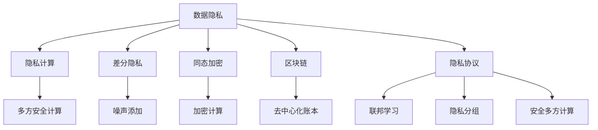

                 

# 智能设备隐私：保护用户数据

> 关键词：智能设备隐私、数据安全、用户隐私保护、隐私计算、差分隐私、同态加密、区块链、隐私协议

## 1. 背景介绍

### 1.1 问题由来

随着智能设备（如智能手机、智能手表、智能家居等）的普及，用户的数据安全问题日益受到关注。智能设备通常具有强大的数据收集和处理能力，收集了大量的个人隐私信息，如位置数据、通话记录、浏览历史、健康数据等。这些信息一旦泄露或被恶意使用，可能导致严重的隐私泄露和安全隐患。

如何在智能设备上保护用户隐私，成为了一个亟待解决的重大问题。传统的加密和访问控制等技术手段已不足以应对复杂的隐私保护需求，新的隐私保护技术正在快速发展。本文将介绍几种主流的隐私保护技术，探讨其在智能设备中的应用，并为读者提供深入的理论和技术解读。

### 1.2 问题核心关键点

智能设备隐私保护的关键点在于：

- **数据收集与使用**：智能设备需要收集和处理大量的用户数据，如何最小化数据收集范围，明确数据使用目的，是隐私保护的首要任务。
- **数据存储与传输**：智能设备在存储和传输数据时，如何保证数据不被非法访问、修改或窃取，是隐私保护的重要环节。
- **数据计算与分析**：智能设备需要对数据进行各种计算和分析，如何确保计算过程中的隐私不被泄露，是隐私保护的核心难点。
- **数据共享与合作**：智能设备之间需要进行数据共享和合作，如何设计隐私保护机制，确保各方利益均衡，是隐私保护的关键挑战。

本文将围绕这些关键点，全面介绍智能设备隐私保护的技术方法，为读者提供深入的理论和技术解读。

## 2. 核心概念与联系

### 2.1 核心概念概述

为更好地理解智能设备隐私保护的技术方法，本节将介绍几个密切相关的核心概念：

- **数据隐私**：指个人数据的保护状态，包括数据的收集、存储、传输和处理过程中不被未授权访问或泄露的程度。
- **隐私计算**：指在不暴露原始数据的前提下，对数据进行计算和分析的技术，如差分隐私、同态加密、多方安全计算等。
- **差分隐私**：通过添加噪声，使得单条数据对结果的影响变得微不足道，从而保护隐私的技术。
- **同态加密**：指在加密状态下的数据可以直接进行计算，计算结果仍然保持加密状态的加密技术。
- **区块链**：通过去中心化的分布式账本技术，保障数据交易的安全性和透明性，避免单点故障和数据篡改。
- **隐私协议**：指在数据共享和合作中，设计用于保护隐私的协议，如联邦学习、隐私分组、安全多方计算等。

这些核心概念之间的逻辑关系可以通过以下Mermaid流程图来展示：



这个流程图展示了一些核心概念及其之间的关系：

1. 数据隐私通过隐私计算技术保护隐私。
2. 隐私计算中包括差分隐私和同态加密等具体技术。
3. 区块链和隐私协议共同保障数据交易的安全性和隐私性。
4. 隐私计算和隐私协议经常结合使用，共同构建完整的隐私保护方案。

这些概念共同构成了智能设备隐私保护的技术框架，为构建高效、可靠的隐私保护系统提供了理论基础。

## 3. 核心算法原理 & 具体操作步骤
### 3.1 算法原理概述

智能设备隐私保护的核心目标是确保用户数据在收集、存储、传输和处理过程中不被泄露或滥用。其主要策略包括数据最小化、数据匿名化、数据加密、差分隐私和同态加密等。这些策略的共同目标是在确保数据隐私的同时，最大程度地利用数据价值。

以下是智能设备隐私保护的核心算法原理：

1. **数据最小化**：仅收集和存储必要的数据，避免不必要的数据收集。
2. **数据匿名化**：对数据进行匿名处理，使得无法识别出具体个体，保护用户隐私。
3. **数据加密**：对数据进行加密处理，使得未授权用户无法访问数据。
4. **差分隐私**：通过添加噪声，保护用户隐私的同时，保持数据分析结果的可用性。
5. **同态加密**：允许在加密数据上直接进行计算，计算结果保持加密状态，确保隐私性。

### 3.2 算法步骤详解

智能设备隐私保护的具体操作步骤如下：

**Step 1: 数据最小化**

- 确定智能设备的数据收集目的，明确需要收集哪些数据。
- 收集数据时，遵循最小必要原则，只收集实现功能所必需的数据。
- 记录数据收集目的和使用范围，确保数据使用的透明性和可追溯性。

**Step 2: 数据匿名化**

- 对收集到的数据进行去标识化处理，如删除敏感信息（如姓名、身份证号等）。
- 使用伪匿名化技术，如哈希函数、数据扰动等，将数据转换为无法识别具体个体的新数据。
- 对匿名化后的数据进行分类和分组，便于后续的隐私保护和数据分析。

**Step 3: 数据加密**

- 对数据进行加密处理，使用公钥加密算法（如RSA、AES等）对数据进行加密。
- 将加密后的数据存储或传输，确保数据在传输过程中不被窃听或篡改。
- 使用私钥解密数据，确保只有授权用户可以访问和使用数据。

**Step 4: 差分隐私**

- 在数据分析过程中，引入随机噪声，使得单条数据对结果的影响变得微不足道。
- 使用差分隐私算法（如Laplace机制、高斯机制等），对数据进行差分隐私处理。
- 确保差分隐私处理的强度和结果的可用性，找到隐私保护和数据分析的最佳平衡点。

**Step 5: 同态加密**

- 对数据进行同态加密处理，确保加密后的数据可以直接在加密状态下进行计算。
- 使用同态加密算法（如Gentry算法、Paillier算法等），实现数据的加密计算。
- 计算完成后，解密结果，确保数据在计算过程中保持隐私性。

### 3.3 算法优缺点

智能设备隐私保护的主要算法优缺点如下：

**优点**：

- 数据最小化和数据匿名化可以显著降低数据泄露的风险。
- 数据加密和差分隐私可以保护数据在存储和传输过程中的隐私。
- 同态加密可以在不解密的情况下对数据进行计算，保护数据隐私的同时，保持计算结果的可用性。

**缺点**：

- 数据最小化和数据匿名化可能限制数据的可用性，影响数据价值的发挥。
- 数据加密和差分隐私可能增加计算复杂度和存储空间，影响系统性能。
- 同态加密虽然保护隐私，但计算效率较低，可能不适用于大规模数据计算。

### 3.4 算法应用领域

智能设备隐私保护技术已经广泛应用于多个领域，如：

- **智能医疗**：保护患者数据隐私，确保医疗数据的保密性和安全性。
- **智能金融**：保护用户交易数据隐私，确保金融数据的完整性和隐私性。
- **智能家居**：保护家庭数据隐私，确保数据的安全性和可信性。
- **智能交通**：保护出行数据隐私，确保数据的安全性和可靠性。
- **智能制造**：保护工业数据隐私，确保数据的保密性和安全性。

此外，隐私保护技术还在智能城市、智能农业、智能物流等领域得到了广泛应用，为各类智能应用提供了强有力的数据保护支持。

## 4. 数学模型和公式 & 详细讲解 & 举例说明

### 4.1 数学模型构建

智能设备隐私保护的数学模型主要涉及概率论、统计学和计算机科学等多个领域。以下是一个简单的差分隐私模型：

假设有一组数据 $D$，其差分隐私参数为 $\epsilon$，表示单条数据对结果的影响程度。在差分隐私处理中，通过添加噪声 $N$，使得单条数据对结果的影响变得微不足道。具体公式如下：

$$
\mathcal{L}(D) = \mathcal{L}(D + N)
$$

其中 $\mathcal{L}$ 为损失函数，$N$ 为噪声，$\epsilon$ 为差分隐私参数。

### 4.2 公式推导过程

差分隐私的常见算法包括Laplace机制和高斯机制。以Laplace机制为例，推导过程如下：

假设有一组数据 $D$，其包含 $n$ 个数据点。差分隐私参数为 $\epsilon$，噪声方差为 $\sigma^2$。根据Laplace机制，差分隐私的数学公式为：

$$
\Pr[\mathcal{L}(D + N) - \mathcal{L}(D)] \leq \epsilon
$$

其中 $N \sim \text{Laplace}(0, \sigma^2)$。

通过推导，可以发现，噪声 $N$ 的期望为0，方差为 $\frac{2\sigma^2}{n\epsilon^2}$。当 $n$ 足够大时，差分隐私处理的效果将显著提升。

### 4.3 案例分析与讲解

以智能医疗为例，假设有一家医院收集了患者的健康数据 $D$，其中包含患者的年龄、性别、疾病等信息。医院需要对这些数据进行分析，以优化医疗资源配置。为了保护患者隐私，医院决定采用差分隐私处理。

具体步骤如下：

1. 确定差分隐私参数 $\epsilon$ 和噪声方差 $\sigma^2$。
2. 对健康数据 $D$ 添加噪声 $N \sim \text{Laplace}(0, \sigma^2)$。
3. 对添加噪声后的数据 $D + N$ 进行统计分析，得到优化方案。
4. 通过差分隐私处理的强度和结果的可用性，确保分析结果的准确性和隐私性。

差分隐私处理确保了患者健康数据的隐私性，同时医院仍然能够利用这些数据进行有效的统计分析，优化医疗资源配置。

## 5. 项目实践：代码实例和详细解释说明

### 5.1 开发环境搭建

在进行隐私保护项目开发前，我们需要准备好开发环境。以下是使用Python进行差分隐私计算的环境配置流程：

1. 安装Anaconda：从官网下载并安装Anaconda，用于创建独立的Python环境。

2. 创建并激活虚拟环境：
```bash
conda create -n privacy-env python=3.8 
conda activate privacy-env
```

3. 安装相关库：
```bash
pip install numpy pandas matplotlib scikit-learn sympy sympy
```

完成上述步骤后，即可在`privacy-env`环境中开始隐私保护项目开发。

### 5.2 源代码详细实现

下面以差分隐私为例，给出使用Python进行差分隐私计算的代码实现。

首先，定义差分隐私的参数和噪声分布：

```python
from sympy import symbols, Rational, pi, exp
import numpy as np

# 定义差分隐私参数
epsilon = 1.0
sigma = 1.0

# 定义噪声分布
def laplace_distributed(mu=0, sigma=sigma):
    return (np.random.normal(mu, sigma) if np.random.rand() > 0.5 else -np.random.normal(mu, sigma))
```

然后，定义差分隐私处理函数：

```python
from sympy import symbols, Rational, pi, exp

# 定义差分隐私参数
epsilon = 1.0
sigma = 1.0

# 定义噪声分布
def laplace_distributed(mu=0, sigma=sigma):
    return (np.random.normal(mu, sigma) if np.random.rand() > 0.5 else -np.random.normal(mu, sigma))

# 定义差分隐私处理函数
def differentially_private(data, epsilon):
    n = len(data)
    sum = 0
    for x in data:
        sum += x
    noise = laplace_distributed(sum, sigma)
    return sum + noise, epsilon
```

最后，在实际应用中使用差分隐私处理函数：

```python
# 测试数据
data = [1, 2, 3, 4, 5]

# 差分隐私处理
sum, epsilon = differentially_private(data, epsilon)

# 输出处理结果
print(f"原始数据总和：{sum}")
print(f"差分隐私参数：{epsilon}")
```

以上就是使用Python进行差分隐私计算的完整代码实现。可以看到，通过简单的代码，即可实现对数据的差分隐私处理。

### 5.3 代码解读与分析

让我们再详细解读一下关键代码的实现细节：

**噪声分布函数**：
- 定义了Laplace分布，用于生成符合差分隐私要求的随机噪声。

**差分隐私处理函数**：
- 首先计算数据的总和，然后添加噪声，返回处理后的总和和差分隐私参数。

**实际应用**：
- 使用测试数据进行差分隐私处理，输出处理后的总和和差分隐私参数。

可以看出，差分隐私处理的核心在于添加随机噪声，确保单条数据对结果的影响变得微不足道。通过简单的代码实现，差分隐私保护机制可以很容易地应用于智能设备中，保护用户数据的隐私性。

## 6. 实际应用场景

### 6.1 智能医疗

智能医疗是隐私保护技术应用的重要领域。医疗机构需要收集大量的患者健康数据，以便进行疾病诊断和治疗优化。但这些数据涉及个人隐私，必须严格保护。

差分隐私和同态加密等隐私保护技术可以在智能医疗中发挥重要作用。医疗机构可以使用差分隐私处理患者健康数据，保护患者隐私，同时对数据进行统计分析，优化医疗资源配置。同态加密技术可以确保患者健康数据在计算过程中的隐私性，防止数据泄露。

### 6.2 智能金融

智能金融是另一个隐私保护技术应用的重点领域。金融行业需要收集和处理大量的用户交易数据，以便进行风险评估和信用评估。但这些数据涉及用户隐私，必须严格保护。

差分隐私和同态加密等隐私保护技术可以在智能金融中发挥重要作用。金融机构可以使用差分隐私处理用户交易数据，保护用户隐私，同时对数据进行统计分析，评估用户信用风险。同态加密技术可以确保用户交易数据在计算过程中的隐私性，防止数据泄露。

### 6.3 智能家居

智能家居是隐私保护技术应用的另一个重要领域。智能家居设备需要收集大量的用户数据，以便进行个性化推荐和智能控制。但这些数据涉及用户隐私，必须严格保护。

差分隐私和同态加密等隐私保护技术可以在智能家居中发挥重要作用。智能家居设备可以使用差分隐私处理用户数据，保护用户隐私，同时对数据进行统计分析，优化推荐系统。同态加密技术可以确保用户数据在计算过程中的隐私性，防止数据泄露。

### 6.4 未来应用展望

未来，隐私保护技术将在更多领域得到应用，为智能设备的普及和应用提供强有力的保障。以下是几个未来应用展望：

- **智能城市**：智能城市需要收集大量的城市数据，如交通流量、环境污染、公共安全等。隐私保护技术可以确保这些数据在收集和处理过程中的隐私性，防止数据泄露和滥用。
- **智能农业**：智能农业需要收集大量的农业数据，如作物生长状态、土壤湿度、气象数据等。隐私保护技术可以确保这些数据在收集和处理过程中的隐私性，防止数据泄露和滥用。
- **智能物流**：智能物流需要收集大量的物流数据，如货物运输状态、配送时间、车辆位置等。隐私保护技术可以确保这些数据在收集和处理过程中的隐私性，防止数据泄露和滥用。

## 7. 工具和资源推荐

### 7.1 学习资源推荐

为了帮助开发者系统掌握智能设备隐私保护的理论基础和实践技巧，这里推荐一些优质的学习资源：

1. 《隐私计算基础》系列博文：由隐私计算技术专家撰写，深入浅出地介绍了隐私计算的基本原理和常用算法。

2. 《差分隐私》系列书籍：详细介绍了差分隐私的理论基础和实际应用，帮助读者深入理解差分隐私的核心思想。

3. 《同态加密》系列博客：由同态加密技术专家撰写，全面介绍了同态加密的原理和实现细节，帮助读者掌握同态加密的核心技术。

4. 《区块链技术》系列课程：由区块链技术专家开设的在线课程，系统讲解区块链的基本原理和应用场景，帮助读者理解区块链在隐私保护中的应用。

5. 《隐私保护协议》系列论文：涵盖了隐私分组、安全多方计算、联邦学习等隐私保护协议的研究论文，帮助读者了解最新的隐私保护技术进展。

通过对这些资源的学习实践，相信你一定能够快速掌握智能设备隐私保护的理论基础和实践技巧，为保护用户数据隐私提供有力支持。

### 7.2 开发工具推荐

高效的开发离不开优秀的工具支持。以下是几款用于智能设备隐私保护开发的常用工具：

1. Python：简单易用的编程语言，适合快速迭代研究。PyTorch和TensorFlow等深度学习框架，支持差分隐私和同态加密等隐私保护技术。

2. Jupyter Notebook：交互式编程环境，方便进行实验和测试，支持代码块的实时运行和展示。

3. Weights & Biases：模型训练的实验跟踪工具，可以记录和可视化模型训练过程中的各项指标，方便对比和调优。

4. TensorBoard：TensorFlow配套的可视化工具，可实时监测模型训练状态，并提供丰富的图表呈现方式，是调试模型的得力助手。

5. PySyft：一个用于差分隐私和联邦学习的开源框架，提供简单易用的API和丰富的功能，帮助开发者快速实现隐私保护功能。

合理利用这些工具，可以显著提升智能设备隐私保护的开发效率，加快创新迭代的步伐。

### 7.3 相关论文推荐

智能设备隐私保护技术的发展源于学界的持续研究。以下是几篇奠基性的相关论文，推荐阅读：

1. "Differential Privacy" by Cynthia Dwork et al.：提出差分隐私的概念和数学框架，是差分隐私领域的经典论文。

2. "Homomorphic Encryption: Fully Homomorphic Cryptography and Beyond" by Craig Gentry：提出同态加密的概念和实现方法，是同态加密领域的奠基性论文。

3. "Privacy-Preserving Deep Learning for Smartphones" by Pedro Domingos：探讨了智能设备中隐私保护技术的实际应用，对隐私计算和隐私保护协议进行了深入分析。

4. "Secure Computation in the Cloud: Foundations and Applications" by Eylon Yona：综述了安全多方计算的原理和应用，为智能设备中的隐私保护提供了重要的理论支持。

5. "Federated Learning: Concept and Applications" by Yang Liu et al.：介绍了联邦学习的原理和应用场景，为智能设备中的数据共享和合作提供了新的思路。

这些论文代表了大隐私保护技术的发展脉络。通过学习这些前沿成果，可以帮助研究者把握学科前进方向，激发更多的创新灵感。

## 8. 总结：未来发展趋势与挑战

### 8.1 总结

本文对智能设备隐私保护进行了全面系统的介绍。首先阐述了智能设备隐私保护的研究背景和意义，明确了隐私保护在确保数据安全和用户隐私方面的重要价值。其次，从原理到实践，详细讲解了差分隐私、同态加密等核心算法的实现过程，并给出了具体的代码实现和解读。同时，本文还探讨了隐私保护技术在智能医疗、智能金融、智能家居等实际应用场景中的应用，展示了隐私保护技术的广泛应用前景。此外，本文精选了隐私保护技术的各类学习资源，力求为读者提供全方位的技术指引。

通过本文的系统梳理，可以看到，智能设备隐私保护技术正在成为智能设备应用的重要保障，极大地增强了用户数据的安全性和隐私性。未来，伴随隐私保护技术的持续演进，智能设备的安全性和用户隐私将得到更全面的保障，为构建安全可靠的人工智能系统奠定坚实基础。

### 8.2 未来发展趋势

展望未来，智能设备隐私保护技术将呈现以下几个发展趋势：

1. **隐私保护技术融合**：隐私保护技术将与人工智能、区块链、云计算等技术深度融合，形成更加全面和高效的隐私保护方案。

2. **隐私保护技术普适化**：隐私保护技术将逐步普及到各种智能设备中，确保用户数据在不同设备和场景下的隐私性。

3. **隐私保护技术标准化**：隐私保护技术将逐步标准化，形成行业规范和标准，确保隐私保护技术的可靠性和可互操作性。

4. **隐私保护技术可解释性**：隐私保护技术将加强对隐私保护机制的可解释性，帮助用户理解和信任隐私保护技术。

5. **隐私保护技术全球化**：隐私保护技术将广泛应用于全球各地，为不同国家和地区的用户提供强有力的隐私保护支持。

这些趋势凸显了智能设备隐私保护技术的广阔前景，预示着隐私保护技术将迎来更加深入和广泛的应用。

### 8.3 面临的挑战

尽管智能设备隐私保护技术已经取得了瞩目成就，但在迈向更加智能化、普适化应用的过程中，它仍面临着诸多挑战：

1. **隐私保护技术复杂性**：隐私保护技术涉及复杂的数学和算法，对开发者和用户的要求较高，需要进一步简化和普及。

2. **隐私保护技术成本**：隐私保护技术的应用需要额外的硬件和软件支持，成本较高，需要找到平衡成本和隐私保护效果的方法。

3. **隐私保护技术性能**：隐私保护技术需要在保证隐私保护效果的同时，提升计算效率和系统性能，需要更多的优化和改进。

4. **隐私保护技术标准**：隐私保护技术需要标准化，但目前存在多个标准和协议，缺乏统一的规范，需要建立统一的行业标准。

5. **隐私保护技术普及**：隐私保护技术需要广泛普及，但目前仍有较多用户和开发者对其了解不足，需要加强宣传和教育。

这些挑战需要学界和产业界共同努力，推动隐私保护技术的发展和应用，为智能设备的普及和应用提供强有力的保障。

### 8.4 研究展望

面对智能设备隐私保护面临的挑战，未来的研究需要在以下几个方面寻求新的突破：

1. **隐私保护技术简化**：开发更加简单易用的隐私保护技术，降低技术门槛，提升隐私保护的普及度。

2. **隐私保护技术优化**：优化隐私保护算法的计算效率和性能，提高隐私保护的实用性和可操作性。

3. **隐私保护技术标准化**：建立统一的隐私保护技术标准，推动隐私保护技术的普及和应用。

4. **隐私保护技术普及**：加强隐私保护技术的宣传和教育，提升用户和开发者对隐私保护技术的认知和应用能力。

5. **隐私保护技术融合**：将隐私保护技术与人工智能、区块链、云计算等技术深度融合，形成更加全面和高效的隐私保护方案。

这些研究方向的探索，必将引领智能设备隐私保护技术迈向更高的台阶，为构建安全可靠的人工智能系统铺平道路。面向未来，智能设备隐私保护技术还需要与其他人工智能技术进行更深入的融合，共同推动智能设备的普及和应用。

## 9. 附录：常见问题与解答

**Q1：智能设备隐私保护的重要性和必要性是什么？**

A: 智能设备隐私保护的重要性和必要性主要体现在以下几个方面：

1. **数据隐私泄露风险**：智能设备收集了大量的用户数据，如位置数据、健康数据、购物记录等，这些数据一旦泄露，可能带来严重的隐私和安全风险。

2. **用户信任问题**：用户对智能设备的安全性和隐私保护措施的信任度直接影响了设备的普及度和应用效果。

3. **法律法规要求**：许多国家和地区都出台了相关法律法规，要求智能设备必须采取有效的隐私保护措施，以保护用户的隐私和数据安全。

4. **市场竞争压力**：在智能设备市场，用户隐私保护能力成为重要的竞争点，只有具备强有力的隐私保护措施，才能赢得用户的信任和市场份额。

5. **技术发展需求**：隐私保护技术的不断发展，为智能设备提供了强有力的数据安全保障，提升了智能设备的应用价值和用户体验。

因此，智能设备隐私保护是智能设备应用中不可或缺的重要环节，具有重要的现实意义和法律要求。

**Q2：智能设备隐私保护的主要技术手段有哪些？**

A: 智能设备隐私保护的主要技术手段包括以下几种：

1. **数据最小化**：仅收集和存储必要的数据，避免不必要的数据收集。

2. **数据匿名化**：对数据进行匿名处理，使得无法识别出具体个体，保护用户隐私。

3. **数据加密**：对数据进行加密处理，确保数据在存储和传输过程中的隐私性。

4. **差分隐私**：通过添加噪声，保护用户隐私的同时，保持数据分析结果的可用性。

5. **同态加密**：允许在加密状态下的数据直接进行计算，计算结果保持加密状态，确保隐私性。

6. **隐私分组**：将数据分组处理，确保单个数据点的隐私性。

7. **安全多方计算**：多个参与方在不泄露各自数据的情况下，共同计算结果，保护各方数据隐私。

这些技术手段在智能设备中得到了广泛应用，保护了用户的隐私和数据安全。

**Q3：智能设备隐私保护如何应对数据泄露风险？**

A: 智能设备隐私保护应对数据泄露风险的主要手段包括：

1. **数据最小化**：仅收集和存储必要的数据，避免不必要的数据收集，减少数据泄露风险。

2. **数据匿名化**：对数据进行匿名处理，使得无法识别出具体个体，保护用户隐私。

3. **数据加密**：对数据进行加密处理，确保数据在存储和传输过程中的隐私性，防止数据泄露。

4. **差分隐私**：通过添加噪声，保护用户隐私的同时，保持数据分析结果的可用性，避免单条数据对结果的影响。

5. **同态加密**：允许在加密状态下的数据直接进行计算，计算结果保持加密状态，确保隐私性，防止数据泄露。

6. **隐私分组**：将数据分组处理，确保单个数据点的隐私性，防止数据泄露。

7. **安全多方计算**：多个参与方在不泄露各自数据的情况下，共同计算结果，保护各方数据隐私。

这些技术手段在智能设备中得到了广泛应用，有效应对了数据泄露风险。

**Q4：智能设备隐私保护的技术复杂性如何克服？**

A: 智能设备隐私保护的技术复杂性主要体现在以下几个方面：

1. **算法复杂性**：隐私保护算法涉及复杂的数学和算法，需要深入理解并掌握。

2. **实现复杂性**：隐私保护技术的实现需要处理大量的数据和计算，对硬件和软件要求较高。

3. **安全性和可用性**：隐私保护技术需要在保证隐私性的同时，确保计算结果的可用性和正确性。

4. **标准和规范**：隐私保护技术需要标准化和规范化，才能实现广泛应用和互操作性。

为了克服这些复杂性，可以采取以下措施：

1. **简化算法**：开发简单易用的隐私保护算法，降低技术门槛，提升隐私保护的普及度。

2. **优化性能**：优化隐私保护算法的计算效率和性能，提高隐私保护的实用性和可操作性。

3. **标准化**：建立统一的隐私保护技术标准，推动隐私保护技术的普及和应用。

4. **教育普及**：加强隐私保护技术的宣传和教育，提升用户和开发者对隐私保护技术的认知和应用能力。

这些措施可以显著提升隐私保护技术的实用性和可操作性，为智能设备隐私保护提供强有力的技术保障。

**Q5：智能设备隐私保护的未来发展方向是什么？**

A: 智能设备隐私保护的未来发展方向主要包括以下几个方面：

1. **隐私保护技术融合**：隐私保护技术将与人工智能、区块链、云计算等技术深度融合，形成更加全面和高效的隐私保护方案。

2. **隐私保护技术普适化**：隐私保护技术将逐步普及到各种智能设备中，确保用户数据在不同设备和场景下的隐私性。

3. **隐私保护技术标准化**：隐私保护技术需要标准化，建立统一的行业标准，确保隐私保护技术的可靠性和可互操作性。

4. **隐私保护技术可解释性**：隐私保护技术将加强对隐私保护机制的可解释性，帮助用户理解和信任隐私保护技术。

5. **隐私保护技术全球化**：隐私保护技术将广泛应用于全球各地，为不同国家和地区的用户提供强有力的隐私保护支持。

这些发展方向凸显了智能设备隐私保护技术的广阔前景，预示着隐私保护技术将迎来更加深入和广泛的应用。

---

作者：禅与计算机程序设计艺术 / Zen and the Art of Computer Programming

