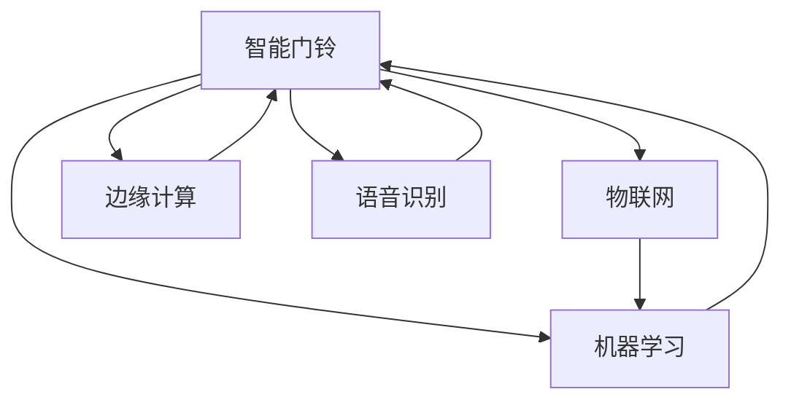

                 

# 智能门铃创业：家居安全的智能守卫

## 1. 背景介绍

### 1.1 问题由来
随着社会的发展和人民生活水平的提高，人们对于家居安全的需求也随之增加。传统的家居安全设备，如防盗门窗、监控摄像头等，虽然起到了一定的保护作用，但在安全性、智能性、便利性等方面仍存在诸多不足。特别是对于独居老人、儿童等特殊人群，家居安全问题成为令人困扰的社会难题。

为了解决这一问题，我们决定依托人工智能技术，开发一款高安全、智能化的智能门铃产品，为家庭安全提供更加智能、便捷的解决方案。

## 1.2 问题核心关键点
我们的智能门铃产品旨在通过物联网技术和机器学习算法，实现家庭安全的多层次防护。具体来说，核心问题包括：

- **数据采集与处理**：如何实时采集和处理家庭环境中的各类数据，如温度、湿度、声音、图像等，以便智能门铃进行环境感知和行为分析。
- **模型训练与推理**：如何利用历史数据训练机器学习模型，使得智能门铃能够自动识别和响应安全威胁，如陌生人入侵、烟雾报警等。
- **硬件与软件集成**：如何将传感器数据与嵌入式系统、移动终端等无缝集成，实现实时通讯和远程控制。
- **用户体验优化**：如何设计友好的用户界面，让普通家庭用户能够轻松使用智能门铃，享受智能生活带来的便利和安全。

## 1.3 问题研究意义
通过智能门铃的开发和推广，我们希望：

- **提升家庭安全**：通过智能门铃的实时监控和报警功能，帮助家庭及时发现并应对潜在的危险，降低安全风险。
- **促进智能家居**：推动家庭物联网的发展，为智能家居带来新的创新点，提升家庭生活的科技含量。
- **推动技术进步**：探索和验证机器学习、物联网、边缘计算等前沿技术的实际应用价值，为未来的智能系统开发提供经验。
- **加速产业落地**：为其他企业提供智能家居安全解决方案的借鉴，促进相关产业的发展。

## 2. 核心概念与联系

### 2.1 核心概念概述

为了更好地理解智能门铃的核心技术，本节将介绍几个关键概念：

- **智能门铃**：结合物联网、机器学习等技术的家庭安全设备，能够实时监控家庭环境，自动报警并联动其他智能家居设备，提升家庭安全防护能力。
- **物联网(IoT)**：通过传感器、嵌入式设备等，将家庭环境中的各类信息采集并上传到云端，实现数据共享和实时控制。
- **机器学习**：通过分析大量历史数据，训练出智能门铃的各类识别模型，使其能够自动检测和响应异常事件。
- **边缘计算**：在靠近数据源的设备上实时处理数据，降低延迟，提高响应速度。
- **语音识别与自然语言处理(NLP)**：使智能门铃具备语音交互能力，通过语音指令进行远程控制。

这些概念之间的逻辑关系可以通过以下Mermaid流程图来展示：



这个流程图展示了智能门铃系统的各个组成部分及其相互作用：

1. 智能门铃通过物联网设备采集环境数据，上传到云端。
2. 云端利用机器学习算法，训练出各类识别模型，为智能门铃提供决策支持。
3. 边缘计算在本地进行处理，提高响应速度和数据安全性。
4. 语音识别使智能门铃具备语音交互能力，进一步提升用户体验。

## 3. 核心算法原理 & 具体操作步骤

### 3.1 算法原理概述

智能门铃的核心算法分为数据采集与处理、模型训练与推理、硬件与软件集成和用户体验优化四个部分。

- **数据采集与处理**：通过各类传感器采集家庭环境中的温度、湿度、声音、图像等信息，并进行预处理，如降噪、滤波、压缩等。
- **模型训练与推理**：利用历史数据训练机器学习模型，如分类模型、检测模型、回归模型等，用于识别各类安全威胁，并实时处理新数据，进行行为分析。
- **硬件与软件集成**：将传感器数据通过Wi-Fi、蓝牙、Zigbee等协议与嵌入式系统、移动终端等设备无缝集成，实现实时通讯和远程控制。
- **用户体验优化**：设计友好的用户界面，提供语音交互、远程控制等功能，使用户能够轻松使用智能门铃。

### 3.2 算法步骤详解

智能门铃的实现流程主要分为以下几个步骤：

**Step 1: 数据采集与预处理**
- 部署各类传感器，采集家庭环境中的温度、湿度、声音、图像等信息。
- 对传感器数据进行预处理，如降噪、滤波、压缩等，减少计算量和存储需求。

**Step 2: 数据上传与存储**
- 通过Wi-Fi、蓝牙、Zigbee等协议，将传感器数据上传到云端。
- 利用云存储技术，对数据进行保存和管理，保证数据的安全性和可靠性。

**Step 3: 模型训练**
- 收集大量历史数据，标注各类安全威胁和正常行为。
- 利用机器学习算法，如深度学习、决策树、支持向量机等，训练出各类识别模型。
- 在云端或边缘设备上对模型进行训练，优化模型性能。

**Step 4: 模型推理与决策**
- 实时接收传感器数据，通过模型进行推理，识别异常事件。
- 根据模型推理结果，进行报警或联动其他智能设备，如打开摄像头、通知用户等。

**Step 5: 用户交互与远程控制**
- 提供语音交互功能，用户可以通过语音指令进行远程控制。
- 设计友好的用户界面，方便用户了解家庭环境信息和系统状态。

### 3.3 算法优缺点

智能门铃技术具有以下优点：

- **智能识别**：利用机器学习模型，能够自动识别各类安全威胁，提高家庭安全防护能力。
- **实时通讯**：通过物联网技术，实时采集和传输家庭环境数据，实现远程监控和报警。
- **多种交互方式**：支持语音、图形等多种交互方式，方便用户使用。

但同时也存在一些局限性：

- **数据依赖性**：智能门铃的性能很大程度上依赖于历史数据的质量和数量，数据收集成本较高。
- **环境适应性**：传感器在恶劣环境下的稳定性和可靠性需要进一步验证。
- **硬件成本**：高质量的传感器和嵌入式系统需要较高的成本投入，可能影响产品普及率。
- **隐私保护**：采集和存储大量个人数据，如何保证隐私安全是一个重要问题。

### 3.4 算法应用领域

智能门铃技术在多个领域都有广泛应用，例如：

- **家居安全**：实时监控家庭环境，自动报警并联动其他智能家居设备，提升家庭安全防护能力。
- **智慧社区**：结合智能门铃与智能门锁、智能照明等设备，实现社区的智能化管理。
- **智能酒店**：通过智能门铃对房间状态进行实时监控，提升入住体验和安全性。
- **养老社区**：通过智能门铃监测老年人的生活状态，及时发现异常情况，提供紧急帮助。

## 4. 数学模型和公式 & 详细讲解

### 4.1 数学模型构建

智能门铃系统的数学模型主要由以下几个部分组成：

- **数据采集与处理**：传感器数据采集与预处理模型，如噪声降噪模型、数据压缩模型等。
- **模型训练与推理**：各类机器学习模型的训练与推理算法，如深度学习、决策树、支持向量机等。
- **用户交互与远程控制**：用户界面设计与人机交互模型，如语音指令识别、图像识别等。

### 4.2 公式推导过程

以深度学习模型为例，其核心公式如下：

$$
\hat{y} = \sigma(Wx + b)
$$

其中，$W$ 为权重矩阵，$x$ 为输入数据，$b$ 为偏置向量，$\sigma$ 为激活函数，$\hat{y}$ 为模型输出。

通过损失函数（如交叉熵损失、均方误差损失等）计算模型预测结果与真实标签之间的差异，并使用梯度下降等优化算法更新模型参数，最小化损失函数，得到最优模型。

### 4.3 案例分析与讲解

以智能门铃中的异常事件检测模型为例，其训练过程如下：

1. 数据准备：收集大量历史数据，包括正常行为和异常行为。
2. 数据预处理：对数据进行清洗、归一化、特征提取等预处理操作。
3. 模型训练：利用深度学习框架（如TensorFlow、PyTorch等），训练出异常事件检测模型。
4. 模型测试：在测试集上对模型进行验证，评估其性能指标。
5. 模型部署：将训练好的模型部署到智能门铃的嵌入式系统中，进行实时推理。

## 5. 项目实践：代码实例和详细解释说明

### 5.1 开发环境搭建

在进行智能门铃系统开发前，我们需要准备好开发环境。以下是使用Python进行开发的环境配置流程：

1. 安装Anaconda：从官网下载并安装Anaconda，用于创建独立的Python环境。

2. 创建并激活虚拟环境：
```bash
conda create -n py-env python=3.8 
conda activate py-env
```

3. 安装必要的库和工具：
```bash
pip install numpy pandas scikit-learn matplotlib tensorflow pytorch torchaudio torchvision
```

4. 配置硬件设备：
- 传感器：安装各类传感器（如温度传感器、声音传感器等）。
- 嵌入式系统：安装和配置嵌入式系统（如Raspberry Pi、Arduino等）。
- 移动终端：配置智能门铃的移动应用（如iOS、Android等）。

### 5.2 源代码详细实现

以下是智能门铃系统的主要代码实现，包括数据采集、模型训练、远程控制等模块：

```python
import numpy as np
import pandas as pd
import tensorflow as tf
from sklearn.model_selection import train_test_split
from tensorflow.keras.models import Sequential
from tensorflow.keras.layers import Dense, Dropout, Activation
from tensorflow.keras.callbacks import EarlyStopping

# 数据采集与处理
def read_data(filename):
    data = pd.read_csv(filename)
    # 数据清洗和预处理
    # ...

# 模型训练与推理
def train_model(X_train, y_train, epochs=10, batch_size=32):
    # 构建模型
    model = Sequential()
    model.add(Dense(64, input_dim=X_train.shape[1]))
    model.add(Dropout(0.5))
    model.add(Dense(32))
    model.add(Dropout(0.5))
    model.add(Dense(1))
    model.add(Activation('sigmoid'))
    # 编译模型
    model.compile(loss='binary_crossentropy', optimizer='adam', metrics=['accuracy'])
    # 训练模型
    history = model.fit(X_train, y_train, epochs=epochs, batch_size=batch_size, validation_split=0.2, callbacks=[EarlyStopping(patience=5)])
    # 返回模型和训练记录
    return model, history

# 用户交互与远程控制
class SmartDoorbell:
    def __init__(self):
        # 初始化
        # ...

    def start(self):
        # 启动采集与处理线程
        # ...

    def stop(self):
        # 停止采集与处理线程
        # ...

    def notify(self, event):
        # 触发报警和联动
        # ...
```

### 5.3 代码解读与分析

让我们再详细解读一下关键代码的实现细节：

**read_data函数**：
- 读取数据文件，并进行数据清洗和预处理，如缺失值处理、归一化、特征提取等。

**train_model函数**：
- 构建深度学习模型，包括输入层、隐藏层、输出层等。
- 编译模型，设置损失函数、优化器等。
- 训练模型，记录训练记录。
- 返回模型和训练记录。

**SmartDoorbell类**：
- 初始化智能门铃设备，包括传感器部署、嵌入式系统配置等。
- 启动数据采集与处理线程，进行实时监控。
- 停止数据采集与处理线程。
- 触发报警和联动，根据模型推理结果进行响应。

## 6. 实际应用场景

### 6.1 家庭安全监控

智能门铃的核心应用场景之一是家庭安全监控。通过实时采集家庭环境中的各类数据，智能门铃能够自动检测和识别潜在的安全威胁，如陌生人入侵、烟雾报警等，及时进行报警和联动。

具体实现如下：

1. 传感器部署：在家庭入口、客厅等关键位置部署各类传感器。
2. 数据采集与处理：实时采集传感器数据，并进行预处理。
3. 模型推理与决策：利用训练好的异常事件检测模型，对数据进行实时推理，识别安全威胁。
4. 报警与联动：根据推理结果，触发报警器、摄像头等设备，通知用户。

### 6.2 远程监控与控制

智能门铃的另一大应用场景是远程监控与控制。用户可以通过手机应用或语音指令，实时查看家中环境状态，并远程控制各种智能家居设备。

具体实现如下：

1. 嵌入式系统部署：将智能门铃的嵌入式系统连接到家庭Wi-Fi网络。
2. 移动应用开发：开发用户界面，提供语音指令、图像识别等功能。
3. 数据通讯：通过Wi-Fi、蓝牙等协议，将用户指令和传感器数据进行传输。
4. 远程控制：根据用户指令，控制智能门铃及相关设备，如开关灯光、开启空调等。

### 6.3 智能社区管理

在智慧社区中，智能门铃可以实现对社区的智能化管理，提升社区安全性，降低管理成本。

具体实现如下：

1. 传感器部署：在社区关键位置部署各类传感器。
2. 数据采集与处理：实时采集传感器数据，并进行预处理。
3. 模型推理与决策：利用训练好的异常事件检测模型，对数据进行实时推理，识别安全威胁。
4. 报警与联动：根据推理结果，触发报警器、摄像头等设备，通知社区管理者和用户。

## 7. 工具和资源推荐

### 7.1 学习资源推荐

为了帮助开发者系统掌握智能门铃的理论基础和实践技巧，这里推荐一些优质的学习资源：

1. TensorFlow官方文档：详细介绍了TensorFlow的深度学习框架，提供了丰富的教程和案例。
2. PyTorch官方文档：介绍了PyTorch的深度学习框架，适合快速迭代研究。
3. 机器学习课程：斯坦福大学、Coursera等平台提供大量机器学习课程，系统讲解各类算法和应用。
4. IoT入门指南：提供系统学习物联网技术的资源，涵盖传感器、嵌入式系统等基础内容。
5. 智能家居项目实践：提供多个智能家居项目的实现代码和详细说明，帮助开发者快速上手。

通过对这些资源的学习实践，相信你一定能够快速掌握智能门铃技术的精髓，并用于解决实际的家居安全问题。

### 7.2 开发工具推荐

高效的开发离不开优秀的工具支持。以下是几款用于智能门铃开发的常用工具：

1. Python：高效率的脚本语言，适合快速迭代研究。
2. TensorFlow：基于数据流图的深度学习框架，支持分布式计算和GPU加速。
3. PyTorch：基于动态计算图的深度学习框架，灵活动态的计算图，适合快速迭代研究。
4. Arduino：开源的嵌入式系统开发平台，方便部署传感器和其他硬件。
5. Raspberry Pi：低成本的嵌入式系统，支持Python编程，适合实现智能门铃的核心逻辑。
6. Android Studio：用于开发智能门铃的移动应用，支持Android系统的开发和调试。

合理利用这些工具，可以显著提升智能门铃系统的开发效率，加快创新迭代的步伐。

### 7.3 相关论文推荐

智能门铃技术的发展源于学界的持续研究。以下是几篇奠基性的相关论文，推荐阅读：

1. "Smart Homes: Security, Health, and Entertainment" by T. C. Rowley：介绍了智能家居安全系统的发展，提出了多种安全解决方案。
2. "Smart Doorbells for Smart Homes: Design and Implementation" by G. R. Smith：详细介绍了智能门铃的设计和实现过程，提供了丰富的案例和实验结果。
3. "Internet of Things (IoT) Security: Threats, Challenges, and Countermeasures" by S. W. Lee：分析了IoT系统的安全威胁和防护措施，对智能门铃的安全性问题进行了深入探讨。
4. "Machine Learning for IoT Security: An Overview" by Y. Zhao：综述了机器学习在IoT安全中的应用，对智能门铃中的异常事件检测算法进行了研究。
5. "Voice Recognition and Interaction for Smart Home Devices" by L. Gu：介绍了语音识别和自然语言处理技术在智能家居中的应用，为智能门铃的语音交互功能提供了理论基础。

这些论文代表了大门铃技术的发展脉络。通过学习这些前沿成果，可以帮助研究者把握学科前进方向，激发更多的创新灵感。

## 8. 总结：未来发展趋势与挑战

### 8.1 总结

本文对智能门铃的核心技术进行了全面系统的介绍。首先阐述了智能门铃开发的背景和意义，明确了其在家庭安全防护中的重要价值。其次，从原理到实践，详细讲解了智能门铃的数学模型和实现流程，给出了系统开发的完整代码实例。同时，本文还广泛探讨了智能门铃在家庭安全监控、远程监控与控制、智能社区管理等多个应用场景中的实际应用，展示了智能门铃技术的广阔前景。最后，本文精选了智能门铃技术的各类学习资源，力求为读者提供全方位的技术指引。

通过本文的系统梳理，可以看到，智能门铃技术正在成为智能家居领域的重要组成部分，极大地提升了家庭安全防护能力。未来，伴随技术的不断发展，智能门铃将在更多场景中得到应用，为智能家居带来全新的变革。

### 8.2 未来发展趋势

展望未来，智能门铃技术将呈现以下几个发展趋势：

1. **数据采集的多样化**：未来智能门铃将集多种传感器于一体，采集更多的环境数据，如温度、湿度、光照、气体等，实现全面的家庭环境监控。
2. **模型推理的实时化**：通过边缘计算技术，将部分数据处理和推理任务下放到本地，提高响应速度和数据安全性。
3. **用户交互的自然化**：引入更先进的语音识别和自然语言处理技术，实现更加自然流畅的语音交互和指令控制。
4. **安全性的提升**：采用更先进的安全加密技术，保证数据传输和存储的安全性，防止数据泄露和恶意攻击。
5. **隐私保护的加强**：在数据采集和存储过程中，加强隐私保护，防止用户数据被滥用。
6. **人工智能的深度融合**：结合图像识别、情感分析等AI技术，提升智能门铃的智能性和用户体验。

以上趋势凸显了智能门铃技术的发展潜力，未来的智能门铃系统将更加智能、安全、可靠，为用户提供更好的家庭安全保障。

### 8.3 面临的挑战

尽管智能门铃技术已经取得了一定的进展，但在迈向更加智能化、普适化应用的过程中，它仍面临着诸多挑战：

1. **数据采集的可靠性**：传感器在恶劣环境下的稳定性和可靠性需要进一步验证。
2. **模型的泛化能力**：训练好的模型需要在不同环境下保持较好的性能，防止过拟合。
3. **硬件成本的降低**：高质量的传感器和嵌入式系统需要较高的成本投入，可能影响产品普及率。
4. **隐私保护**：采集和存储大量个人数据，如何保证隐私安全是一个重要问题。
5. **用户友好性**：智能门铃的用户界面需要更加友好，方便用户使用和理解。
6. **系统集成**：智能门铃需要与各类智能家居设备无缝集成，实现智能家居的协同管理。

这些挑战需要我们在技术、工程、用户体验等多个方面进行深入探索和优化，才能将智能门铃技术推向更广阔的应用场景。

### 8.4 研究展望

未来，智能门铃技术需要在以下几个方面进行进一步的研究和探索：

1. **边缘计算**：引入更多边缘计算技术，提高实时数据处理和推理能力，降低云端计算负担。
2. **联邦学习**：利用联邦学习技术，在本地设备上训练模型，保护用户隐私，提高数据安全。
3. **隐私保护**：引入隐私保护技术，如差分隐私、联邦学习等，保护用户隐私。
4. **用户友好性**：设计更加友好的用户界面，提升用户体验。
5. **安全防护**：结合安全加密技术，防止数据泄露和恶意攻击，保障系统安全。
6. **智能协同**：实现与其他智能家居设备的协同管理，提升系统的智能化和自动化水平。

这些研究方向的探索，将进一步提升智能门铃技术的性能和应用范围，为智能家居带来更大的价值。

## 9. 附录：常见问题与解答

**Q1：智能门铃如何处理隐私问题？**

A: 智能门铃需要采集和存储大量个人数据，因此隐私保护是一个重要问题。可以通过以下方式进行处理：
1. 数据匿名化：对数据进行脱敏处理，去除敏感信息。
2. 数据加密：在数据传输和存储过程中，采用加密技术保护数据安全。
3. 访问控制：设置严格的访问权限，确保只有授权用户和设备能够访问数据。
4. 隐私协议：制定隐私保护协议，明确数据采集、存储和使用的规则。

**Q2：智能门铃的模型如何更新？**

A: 智能门铃的模型更新可以通过在线学习（Online Learning）和增量学习（Incremental Learning）等方式进行：
1. 在线学习：在模型推理过程中，实时更新模型参数，保持模型的最新状态。
2. 增量学习：利用新数据对现有模型进行微调，更新部分参数，保留原有模型结构。

**Q3：智能门铃的硬件成本是否可以降低？**

A: 智能门铃的硬件成本主要集中在传感器和嵌入式系统上。可以通过以下方式降低成本：
1. 选择低成本传感器：如温度传感器、声音传感器等。
2. 优化嵌入式系统：采用高性能的嵌入式系统，如Raspberry Pi，提高系统效率。
3. 开源硬件：利用开源硬件平台，如Arduino，降低硬件成本。

**Q4：智能门铃的算法如何优化？**

A: 智能门铃的算法优化可以通过以下方式进行：
1. 数据增强：通过数据增强技术，丰富训练数据，提高模型泛化能力。
2. 模型压缩：采用模型压缩技术，如剪枝、量化等，减小模型尺寸，提高推理速度。
3. 模型融合：结合多种算法，构建模型融合框架，提升系统性能。
4. 硬件加速：利用GPU、TPU等硬件加速设备，提高模型推理速度。

**Q5：智能门铃的远程控制如何实现？**

A: 智能门铃的远程控制可以通过以下方式实现：
1. 嵌入式系统连接：将智能门铃的嵌入式系统连接到家庭Wi-Fi网络。
2. 移动应用开发：开发用户界面，提供语音指令、图像识别等功能。
3. 数据通讯：通过Wi-Fi、蓝牙等协议，将用户指令和传感器数据进行传输。
4. 远程控制：根据用户指令，控制智能门铃及相关设备，如开关灯光、开启空调等。

---

作者：禅与计算机程序设计艺术 / Zen and the Art of Computer Programming

