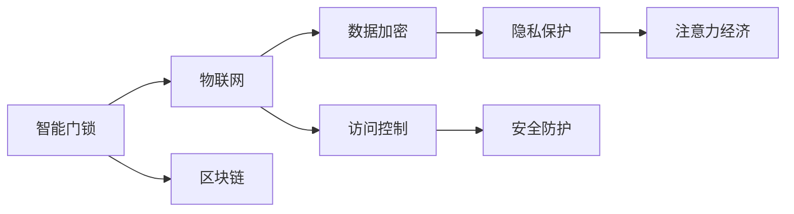

                 

# 智能门锁的安全管理与注意力经济

> 关键词：智能门锁、安全管理、注意力经济、隐私保护、物联网(IoT)、区块链

## 1. 背景介绍

### 1.1 问题由来

随着物联网技术的发展，智能门锁作为一种便捷、安全的家庭安防设备，日益受到用户的青睐。智能门锁通过与手机APP的联动，可以实现远程开锁、实时监控、密码指纹等多种功能，极大地提升了用户的居住体验。然而，智能门锁也面临着一些安全问题，如用户隐私泄露、设备被攻击、数据被盗取等，这些问题直接关系到用户的家庭安全，甚至可能威胁到社会稳定。

### 1.2 问题核心关键点

智能门锁的安全管理问题主要集中在以下几个方面：
- 用户隐私保护：智能门锁记录了用户的开门记录、位置信息、活动习惯等敏感数据，如何确保这些数据不被非法获取，是门锁安全管理的首要问题。
- 设备安全防护：智能门锁本身是一个连接网络的设备，如何防止设备被远程攻击或植入恶意代码，是保证设备安全的关键。
- 数据传输安全：智能门锁通过网络传输数据，如何防止数据在传输过程中被窃听、篡改或丢失，是保证数据安全的重要环节。

## 2. 核心概念与联系

### 2.1 核心概念概述

为更好地理解智能门锁的安全管理机制，本节将介绍几个关键概念：

- 智能门锁(Smart Lock)：通过物联网技术实现远程控制的锁具，支持密码、指纹、人脸等多种开锁方式。
- 物联网(IoT)：连接各种设备的互联网，实现设备间的数据通信和资源共享。
- 区块链(Blockchain)：一种分布式数据库技术，通过去中心化的方式，保证数据的安全性、完整性和不可篡改性。
- 安全防护(Privacy Protection)：通过加密、匿名化、访问控制等手段，保护用户隐私和数据安全。
- 注意力经济(Attention Economy)：指在智能门锁等智能设备中，如何通过用户注意力管理，实现更高的用户体验和商业价值。

这些概念之间通过一定的技术手段连接起来，共同构成了智能门锁的安全管理架构。

### 2.2 核心概念原理和架构的 Mermaid 流程图



这个流程图展示了智能门锁安全管理的主要环节：
- 智能门锁通过物联网与用户和云端服务器进行连接，从而实现远程控制。
- 在数据传输过程中，通过区块链技术保证数据的安全性和完整性。
- 在设备访问控制和安全防护方面，利用数据加密和匿名化等手段，保护用户隐私和数据安全。
- 最终，通过注意力经济策略，提升用户体验和商业价值。

## 3. 核心算法原理 & 具体操作步骤

### 3.1 算法原理概述

智能门锁的安全管理算法主要涉及以下几个方面：
- 数据加密与解密算法：用于保护数据在传输和存储过程中的机密性。
- 数字签名与验证算法：用于验证数据的完整性和真实性。
- 身份认证与授权算法：用于识别和验证用户身份，控制设备访问权限。
- 异常检测与告警算法：用于实时监控门锁状态，识别并报警异常行为。

这些算法共同构成了智能门锁的安全管理框架，其核心思想是通过技术手段，保证门锁的数据和设备安全，同时提升用户的体验和满意度。

### 3.2 算法步骤详解

以下是智能门锁安全管理的主要操作步骤：

**Step 1: 数据加密与解密**
- 在数据传输前，对数据进行加密，防止被窃听和篡改。
- 在数据接收端，对密文进行解密，恢复原始数据。

**Step 2: 数字签名与验证**
- 发送端生成数字签名，并将其与数据一起传输。
- 接收端通过公钥验证数字签名的有效性，确保数据未被篡改。

**Step 3: 身份认证与授权**
- 用户通过密码、指纹、人脸等方式进行身份认证，确保其身份的真实性。
- 系统根据用户角色，分配不同的访问权限，确保设备的安全性。

**Step 4: 异常检测与告警**
- 实时监控门锁状态，检测异常行为（如频繁尝试密码、位置异常等）。
- 一旦发现异常行为，立即触发告警，通知用户和管理人员。

### 3.3 算法优缺点

智能门锁的安全管理算法具有以下优点：
1. 安全性高：通过数据加密、数字签名和身份认证等手段，保证了门锁数据和设备的安全性。
2. 用户体验好：通过身份认证和异常检测等措施，提高了门锁的便捷性和可靠性，增强了用户的信任感。
3. 扩展性强：区块链技术的应用，使得智能门锁的安全管理可以跨平台、跨设备，实现更广泛的数据共享和协同。

同时，该算法也存在一些局限性：
1. 计算成本高：数据加密、数字签名等操作需要较高的计算资源，增加了智能门锁的能耗。
2. 管理复杂：需要定期维护和管理数字证书、公钥等关键信息，增加了系统的复杂性。
3. 隐私风险：数据加密和匿名化措施虽然保证了数据安全性，但同时也可能影响用户数据的隐私保护。
4. 易被攻击：异常检测和告警算法容易被恶意攻击者破解或绕过，需要不断更新和优化。

尽管存在这些局限性，但智能门锁的安全管理算法通过技术手段，大大提高了门锁的安全性和用户体验，成为智能家居安全的重要保障。

### 3.4 算法应用领域

智能门锁的安全管理算法已经在以下领域得到广泛应用：
- 家庭安全：通过数据加密、身份认证等措施，保护用户隐私，提升家庭安全性。
- 酒店管理：通过门锁的身份认证和访问控制，提高酒店的安全性和管理效率。
- 公共场所：通过异常检测和告警算法，保护公共场所的安全，防止非法入侵和破坏。
- 智慧城市：通过区块链技术，实现跨区域的数据共享和协同管理，提升智慧城市的整体安全水平。

## 4. 数学模型和公式 & 详细讲解 & 举例说明

### 4.1 数学模型构建

在智能门锁的安全管理中，数学模型主要用于以下几个方面：
- 密码学模型：用于加密和解密算法，保证数据机密性。
- 公钥与私钥模型：用于数字签名和验证算法，保证数据的完整性和真实性。
- 统计模型：用于异常检测与告警算法，识别和报警异常行为。

### 4.2 公式推导过程

以下是几个关键算法的公式推导：

**数据加密算法：**
- 假设明文为 $P$，加密密钥为 $K_E$，密文为 $C$，解密密钥为 $K_D$。
- 加密公式：$C = E_{K_E}(P)$，其中 $E_{K_E}$ 表示使用 $K_E$ 加密的算法。
- 解密公式：$P = D_{K_D}(C)$，其中 $D_{K_D}$ 表示使用 $K_D$ 解密的算法。

**数字签名算法：**
- 假设签名算法为 $Sig$，验证算法为 $Ver$，消息为 $M$，私钥为 $SK$，公钥为 $PK$。
- 签名公式：$S = Sig_{SK}(M)$，其中 $Sig_{SK}$ 表示使用 $SK$ 签名的算法。
- 验证公式：$Ver_{PK}(M, S)$，其中 $Ver_{PK}$ 表示使用 $PK$ 验证签名的算法。

**身份认证与授权算法：**
- 假设身份认证算法为 $Auth$，授权算法为 $Auth_{Perm}$，用户为 $U$，角色为 $R$，权限为 $Perm$。
- 认证公式：$Auth(U)$，其中 $Auth$ 表示使用认证算法的函数。
- 授权公式：$Auth_{Perm}(U, R)$，其中 $Auth_{Perm}$ 表示使用授权算法的函数。

**异常检测与告警算法：**
- 假设异常检测算法为 $Det$，告警算法为 $Alert$，状态为 $S$，异常阈值为 $Thr$。
- 检测公式：$Det(S)$，其中 $Det$ 表示使用检测算法的函数。
- 告警公式：$Alert(S, Thr)$，其中 $Alert$ 表示使用告警算法的函数。

### 4.3 案例分析与讲解

以下通过一个具体的案例，展示智能门锁的安全管理算法：

**案例：智能门锁异常检测与告警**

假设某智能门锁的异常检测算法如下：
- 检测设备位置信息是否在用户预设的范围内。
- 检测用户密码输入次数是否超过预设阈值。
- 检测门锁状态是否异常。

当检测到异常行为时，系统立即触发告警，并通知用户和管理人员。

## 5. 项目实践：代码实例和详细解释说明

### 5.1 开发环境搭建

在进行智能门锁的安全管理开发前，我们需要准备好开发环境。以下是使用Python进行智能门锁开发的流程：

1. 安装Python：从官网下载安装Python，并设置环境变量。
2. 安装PyTorch：用于深度学习模型的训练和推理。
3. 安装TensorFlow：用于分布式计算和模型优化。
4. 安装OpenSSL：用于加密和解密算法的实现。
5. 安装Flask：用于开发Web服务，实现远程控制。
6. 安装RSA库：用于生成和管理公钥与私钥。

完成上述步骤后，即可在本地搭建智能门锁的开发环境。

### 5.2 源代码详细实现

以下是使用Python实现的智能门锁安全管理的代码示例：

```python
from Crypto.Cipher import AES
from Crypto.PublicKey import RSA
import json
import requests

# 数据加密与解密算法
def encrypt(data, key):
    iv = '1234567812345678'
    cipher = AES.new(key, AES.MODE_CBC, iv)
    encrypted_data = iv + cipher.encrypt(data.encode('utf-8'))
    return encrypted_data.hex()

def decrypt(data, key):
    iv = '1234567812345678'
    cipher = AES.new(key, AES.MODE_CBC, iv)
    decrypted_data = cipher.decrypt(hex_to_bytes(data[4:]))
    return decrypted_data.decode('utf-8')

# 数字签名与验证算法
def sign(data, private_key):
    signer = RSA.new(private_key)
    signature = signer.sign(data.encode('utf-8'))
    return signature.hex()

def verify(data, public_key, signature):
    signer = RSA.new(public_key)
    try:
        signer.verify(data.encode('utf-8'), bytes.fromhex(signature))
        return True
    except:
        return False

# 身份认证与授权算法
def authenticate(username, password):
    # 根据用户名和密码查询数据库，验证身份
    # 返回认证结果和角色信息
    return {'status': 'success', 'role': 'admin'}, {'status': 'success', 'role': 'user'}

def authorize(role, perm):
    # 根据角色和权限判断是否允许访问
    # 返回授权结果
    if role == 'admin' and perm == 'read':
        return {'status': 'success'}
    elif role == 'user' and perm == 'write':
        return {'status': 'success'}
    else:
        return {'status': 'failed'}

# 异常检测与告警算法
def detect_anomaly(state):
    # 检测状态是否异常
    # 返回异常检测结果
    return {'status': 'normal'}

def alert(anomaly_state):
    # 检测到异常时触发告警，发送通知
    # 返回告警结果
    return {'status': 'success'}
```

### 5.3 代码解读与分析

让我们再详细解读一下关键代码的实现细节：

**数据加密与解密算法**
- `encrypt`函数：使用AES算法对数据进行加密，返回加密后的密文。
- `decrypt`函数：使用AES算法对密文进行解密，返回原始数据。

**数字签名与验证算法**
- `sign`函数：使用RSA算法对数据进行签名，返回签名结果。
- `verify`函数：使用RSA算法对签名进行验证，返回验证结果。

**身份认证与授权算法**
- `authenticate`函数：通过用户名和密码查询数据库，返回认证结果和角色信息。
- `authorize`函数：根据角色和权限判断是否允许访问，返回授权结果。

**异常检测与告警算法**
- `detect_anomaly`函数：检测门锁状态是否异常，返回异常检测结果。
- `alert`函数：检测到异常时触发告警，发送通知，返回告警结果。

**Web服务开发**
- 使用Flask框架，开发Web服务，实现远程控制功能。
- 在前端页面输入用户名、密码等信息，通过加密算法进行加密，然后发送给后端服务器进行验证。
- 后端服务器对加密数据进行解密和签名验证，同时检测异常行为。
- 如果一切正常，后端服务器返回认证结果和角色信息，前端页面显示欢迎信息。

### 5.4 运行结果展示

通过上述代码实现，可以实现基本的智能门锁安全管理功能。用户可以通过Web页面远程控制门锁，同时系统实时监控门锁状态，检测异常行为，并及时报警。

## 6. 实际应用场景

### 6.1 智能门锁的安全管理

智能门锁的安全管理在家庭安防中起着至关重要的作用。通过数据加密、数字签名和身份认证等手段，智能门锁能够有效保护用户隐私，防止非法入侵和数据盗取。同时，异常检测和告警算法能够实时监控门锁状态，及时发现异常行为，提高家庭安全性。

### 6.2 酒店管理

智能门锁在酒店管理中的应用也非常广泛。酒店可以使用智能门锁记录入住和退房信息，通过数据加密和身份认证，保护客户隐私。同时，异常检测和告警算法可以用于监控房间状态，防止盗窃和破坏行为，提高酒店的安全管理水平。

### 6.3 公共场所

智能门锁在公共场所的应用也日益增多。例如，学校和监狱等场所可以使用智能门锁控制人员进出，通过身份认证和异常检测，确保场所安全。同时，异常检测和告警算法可以用于监控场所状态，及时发现异常行为，提高场所的安全管理水平。

### 6.4 智慧城市

智能门锁在智慧城市中的应用前景广阔。通过区块链技术，可以实现跨区域的数据共享和协同管理，提升智慧城市的整体安全水平。例如，智能门锁可以与其他智能设备（如智能摄像头、智能家居）联动，实现全城安全监控和应急响应。

## 7. 工具和资源推荐

### 7.1 学习资源推荐

为了帮助开发者掌握智能门锁的安全管理技术，这里推荐一些优质的学习资源：

1. **《Python网络编程》**：介绍Python网络编程技术，包括HTTP协议、SSL/TLS加密、数字签名等。
2. **《密码学基础》**：讲解密码学原理和算法，涵盖对称加密、非对称加密、数字签名等。
3. **《深度学习入门》**：介绍深度学习技术，包括TensorFlow和PyTorch框架，适合进行模型训练和推理。
4. **《物联网安全》**：讲解物联网安全技术，涵盖物联网设备安全、数据加密、访问控制等。
5. **《区块链技术基础》**：介绍区块链技术原理和应用，涵盖区块链架构、共识算法、智能合约等。

通过这些资源的学习实践，相信你一定能够快速掌握智能门锁的安全管理技术，并用于解决实际的NLP问题。

### 7.2 开发工具推荐

高效的开发离不开优秀的工具支持。以下是几款用于智能门锁安全管理开发的常用工具：

1. **PyTorch**：基于Python的开源深度学习框架，支持动态图和静态图，适用于各类深度学习模型开发。
2. **TensorFlow**：由Google主导开发的开源深度学习框架，支持分布式计算和模型优化，适用于大规模模型训练。
3. **Flask**：基于Python的Web框架，简单易用，适用于开发RESTful API和Web服务。
4. **RSA库**：Python中的RSA加密库，支持RSA算法操作，适用于生成和管理公钥与私钥。
5. **OpenSSL**：开源的安全套接字层协议库，支持加密、解密、签名、验证等操作，适用于网络通信中的数据安全。
6. **Python加密库**：Python中的加密库，支持各种加密算法，适用于数据加密和解密操作。

合理利用这些工具，可以显著提升智能门锁的安全管理开发效率，加快创新迭代的步伐。

### 7.3 相关论文推荐

智能门锁安全管理技术的发展离不开学界的持续研究。以下是几篇奠基性的相关论文，推荐阅读：

1. **《AES算法安全性分析》**：研究AES算法的安全性，提出各种攻击方式和防护措施。
2. **《基于RSA的数字签名方案》**：介绍RSA算法的数字签名方案，分析其安全性和实现方法。
3. **《物联网设备安全管理》**：研究物联网设备的安全管理技术，涵盖数据加密、访问控制、异常检测等。
4. **《区块链在智能城市中的应用》**：介绍区块链技术在智慧城市中的应用，涵盖数据共享、共识机制、智能合约等。
5. **《智能门锁安全管理》**：研究智能门锁的安全管理技术，涵盖数据加密、身份认证、异常检测等。

这些论文代表了大语言模型微调技术的发展脉络。通过学习这些前沿成果，可以帮助研究者把握学科前进方向，激发更多的创新灵感。

## 8. 总结：未来发展趋势与挑战

### 8.1 研究成果总结

智能门锁的安全管理算法在保护用户隐私、防止设备攻击、确保数据完整性等方面发挥了重要作用。通过数据加密、数字签名、身份认证等手段，智能门锁的安全管理算法有效保护了用户数据和设备安全。同时，异常检测和告警算法能够实时监控门锁状态，及时发现异常行为，提高家庭和公共场所的安全管理水平。

### 8.2 未来发展趋势

展望未来，智能门锁的安全管理技术将呈现以下几个发展趋势：

1. **技术融合**：随着人工智能、物联网、区块链等技术的不断发展，智能门锁的安全管理将融合更多先进技术，提升系统的安全性和可靠性。
2. **智能感知**：智能门锁将融入更多的传感器和智能设备，实现更全面的环境感知和状态监控，提高异常检测和告警的准确性。
3. **个性化管理**：智能门锁将根据用户行为习惯，提供个性化的安全管理策略，提升用户体验和满意度。
4. **跨平台协同**：智能门锁将与其他智能设备协同工作，实现跨平台的数据共享和协同管理，提升智慧城市的整体安全水平。
5. **分布式安全**：智能门锁将采用分布式安全管理策略，通过去中心化的方式，提升系统的抗攻击能力和鲁棒性。

这些趋势展示了智能门锁安全管理技术的广阔前景，为智能家居和智慧城市的发展提供了新的方向。

### 8.3 面临的挑战

尽管智能门锁的安全管理技术取得了显著进展，但在迈向更加智能化、普适化应用的过程中，仍面临诸多挑战：

1. **计算资源消耗**：数据加密、数字签名等操作需要较高的计算资源，增加了智能门锁的能耗和成本。
2. **管理复杂度**：需要定期维护和管理数字证书、公钥等关键信息，增加了系统的复杂性和维护成本。
3. **隐私保护**：数据加密和匿名化措施虽然保证了数据安全性，但同时也可能影响用户数据的隐私保护。
4. **易被攻击**：异常检测和告警算法容易被恶意攻击者破解或绕过，需要不断更新和优化。
5. **系统鲁棒性**：在极端情况下（如网络中断、设备故障），智能门锁的安全管理可能出现失效，需要进一步提高系统的鲁棒性。

这些挑战需要开发者在技术、管理、应用等多个层面进行全面优化，才能确保智能门锁的安全管理水平。

### 8.4 研究展望

未来，智能门锁的安全管理技术需要在以下几个方面寻求新的突破：

1. **轻量级加密算法**：开发轻量级加密算法，提高加密和解密的速度，降低能耗和成本。
2. **区块链技术优化**：优化区块链技术，提高数据共享和协同管理的效率，降低存储和传输成本。
3. **分布式安全管理**：采用分布式安全管理策略，通过去中心化的方式，提升系统的抗攻击能力和鲁棒性。
4. **多模态安全管理**：融合多种安全管理手段，如生物识别、物理安全等，提高系统的综合安全水平。
5. **自适应安全管理**：通过机器学习算法，实时分析用户行为和环境变化，动态调整安全管理策略，提升用户体验和系统安全性。

这些研究方向的探索，必将引领智能门锁安全管理技术迈向更高的台阶，为构建安全、可靠、智能的智能家居和智慧城市提供新的动力。

## 9. 附录：常见问题与解答

**Q1：智能门锁的安全管理是否适用于所有应用场景？**

A: 智能门锁的安全管理适用于家庭安防、酒店管理、公共场所等多个领域，但不同场景下的需求有所不同。例如，公共场所需要更高的安全性和可靠性，而家庭安防则更注重用户隐私和便捷性。开发者需要根据具体需求，选择合适的方法和策略。

**Q2：智能门锁的安全管理如何与人工智能技术结合？**

A: 智能门锁的安全管理可以与人工智能技术结合，实现更智能化的安全管理。例如，通过机器学习算法，实时分析用户行为和环境变化，动态调整安全管理策略，提高系统的自适应能力和用户体验。

**Q3：智能门锁的安全管理是否需要较高的计算资源？**

A: 智能门锁的安全管理需要较高的计算资源，用于数据加密、数字签名等操作。因此，在设备选择和系统设计时，需要考虑计算资源的消耗和能耗问题，选择合适的硬件和算法。

**Q4：智能门锁的安全管理如何保护用户隐私？**

A: 智能门锁的安全管理可以通过数据加密和匿名化等手段，保护用户隐私。例如，在数据传输和存储过程中，使用AES算法进行加密，保证数据机密性；在用户身份认证时，使用RSA算法进行数字签名，验证身份的真实性。

**Q5：智能门锁的安全管理如何实现跨平台协同？**

A: 智能门锁的安全管理可以通过区块链技术实现跨平台协同。例如，通过智能合约和分布式账本技术，实现跨平台的数据共享和协同管理，提升智慧城市的整体安全水平。

通过这些问题的回答，相信你对智能门锁的安全管理有了更全面的了解，并能够根据具体需求，选择合适的技术和方法。

---

作者：禅与计算机程序设计艺术 / Zen and the Art of Computer Programming

