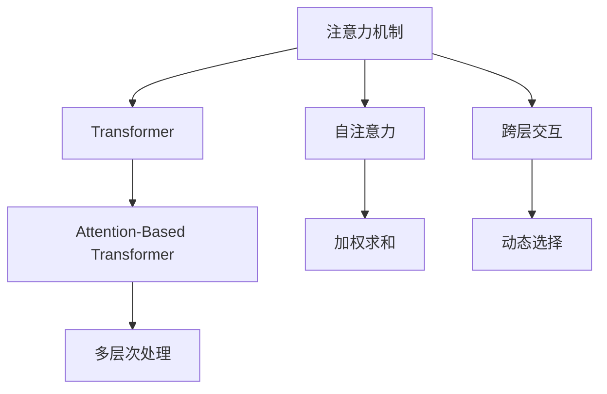

                 

# 最大限度地利用AI时代的注意力

> 关键词：注意力机制,Transformer,自注意力,跨层交互,Attention-Based Transformer

## 1. 背景介绍

### 1.1 问题由来
人工智能(AI)技术自1950年代兴起以来，已取得长足进步，从简单的图像识别、语音识别发展到自然语言处理(NLP)、计算机视觉、机器人学等诸多领域。这些技术的背后，隐藏着一个共同的核心概念——注意力机制。从最初的简单规则到深度学习的Transformer结构，注意力机制在AI时代的演进过程中扮演了至关重要的角色。

### 1.2 问题核心关键点
注意力机制不仅是一个理论概念，更是许多AI技术得以实现的基础。它在不同层次、不同领域的应用，为AI技术的发展提供了无限可能。然而，随着AI技术的不断深入，如何更高效、更灵活地利用注意力机制，成为了当前AI技术发展的核心挑战。

### 1.3 问题研究意义
深入理解注意力机制的原理和应用，对于推进AI技术的创新和应用具有重要意义：

1. **提升模型性能**：通过更高效、更灵活的注意力机制，可以显著提升AI模型在不同任务上的表现。
2. **促进跨领域应用**：注意力机制的应用跨越了多个领域，如自然语言处理、计算机视觉、推荐系统等，深入研究有助于推动AI技术的跨领域应用。
3. **推动理论研究**：对注意力机制的深入理解，可以进一步推进机器学习、计算机视觉等领域的理论研究。
4. **驱动工业应用**：AI技术的实际应用离不开高效、灵活的注意力机制，研究如何最大限度地利用注意力，将加速AI技术的产业化进程。
5. **拓展知识边界**：注意力机制的深入研究，有望为人类认知科学、认知工程等领域带来新的启示。

## 2. 核心概念与联系

### 2.1 核心概念概述

为更好地理解AI时代注意力机制的原理和应用，本节将介绍几个关键概念：

- **注意力机制**：一种模拟人类视觉、听觉注意机制的技术，用于动态选择数据集中的关键信息，进行加权求和处理。
- **Transformer**：一种基于自注意力机制的神经网络结构，广泛应用于机器翻译、文本生成等任务。
- **自注意力**：一种计算方式，通过将输入序列中的每个位置与其他位置计算注意力权重，动态选择关键信息进行处理。
- **跨层交互**：通过多层次的注意力机制，使模型在处理不同层次的信息时，能够灵活交互、动态整合，提升模型性能。
- **Attention-Based Transformer**：一种基于自注意力机制的Transformer结构，通过不同层次的注意力机制，进行更灵活的特征融合和特征提取。

这些核心概念之间的逻辑关系可以通过以下Mermaid流程图来展示：



这个流程图展示了注意力机制的核心概念及其相互关系：

1. 注意力机制通过计算不同位置的权重，选择关键信息。
2. 自注意力机制通过将输入序列中的每个位置与其他位置计算注意力权重，选择关键信息进行处理。
3. 跨层交互通过多层次的注意力机制，使模型在不同层次的信息处理中进行灵活交互。
4. Attention-Based Transformer通过不同层次的注意力机制，进行更灵活的特征融合和特征提取。

这些概念共同构成了AI时代注意力机制的理论基础，为其在实际应用中的广泛应用提供了有力支持。

## 3. 核心算法原理 & 具体操作步骤
### 3.1 算法原理概述

AI时代的注意力机制，本质上是一种动态信息选择的机制，通过计算不同位置之间的注意力权重，动态选择输入序列中的关键信息进行处理。其核心思想在于，将输入序列中的每个位置与其他位置进行交互，计算出每个位置的注意力权重，并根据权重进行加权求和。

### 3.2 算法步骤详解

基于注意力机制的AI算法，其核心步骤包括：

**Step 1: 计算注意力权重**

注意力权重计算是注意力机制的核心，决定了模型选择哪些信息进行处理。设输入序列为 $X=\{x_1, x_2, ..., x_n\}$，其中 $x_i$ 为序列中的第 $i$ 个元素，计算每个位置的注意力权重 $a_i$，表示该位置对当前位置的贡献程度。具体计算公式为：

$$
a_i = \frac{e^{s_i}}{\sum_{j=1}^{n} e^{s_j}}
$$

其中 $s_i$ 为计算出的注意力分数，可以通过点积、相似度计算等方式获得。

**Step 2: 进行加权求和**

根据注意力权重 $a_i$，对输入序列进行加权求和，得到新的向量 $y$：

$$
y = \sum_{i=1}^{n} a_i x_i
$$

这个向量 $y$ 代表了模型选择的关键信息，通过对其进行处理，可以提升模型性能。

**Step 3: 重复计算多轮**

为了提升模型的表现，注意力机制可以重复计算多轮。每轮计算结束后，将新的向量 $y$ 作为下一轮的输入，继续计算注意力权重，直至达到预设的轮数或满足终止条件。

**Step 4: 应用到具体任务**

根据具体任务的需求，将计算得到的向量 $y$ 应用于不同的任务，如机器翻译、文本生成、图像处理等。通过多轮计算和不同层次的注意力机制，使得模型在处理复杂任务时，能够动态选择关键信息，进行灵活的特征融合和特征提取。

### 3.3 算法优缺点

基于注意力机制的AI算法具有以下优点：

1. **灵活性高**：通过动态选择关键信息，模型能够适应多种任务和数据分布。
2. **表现力强**：能够捕捉输入序列中的复杂关系，提升模型性能。
3. **可扩展性广**：可以应用于多种AI任务，如图像识别、语音识别、自然语言处理等。

同时，该算法也存在一些局限性：

1. **计算复杂度高**：注意力机制的计算复杂度较高，尤其是在大规模数据集上。
2. **参数数量大**：注意力机制通常需要较大的模型参数，以支撑复杂的计算。
3. **容易过拟合**：在训练数据较少的情况下，注意力机制容易过拟合，导致模型泛化性能下降。
4. **解释性差**：注意力机制的计算过程较为复杂，难以解释模型内部的决策逻辑。

尽管存在这些局限性，但注意力机制依然是AI时代的核心技术之一，其在不同领域的广泛应用，证明了其强大的生命力和应用价值。

### 3.4 算法应用领域

基于注意力机制的AI算法，已在多个领域取得了显著应用效果，主要包括：

1. **机器翻译**：通过计算源语言和目标语言之间的注意力权重，提升翻译质量。
2. **文本生成**：通过动态选择关键信息，生成更加连贯、自然的文本。
3. **图像处理**：通过计算不同位置之间的注意力权重，选择关键特征进行处理。
4. **推荐系统**：通过计算用户和物品之间的注意力权重，提升推荐精度。
5. **语音识别**：通过计算语音特征之间的注意力权重，提升识别准确率。
6. **医疗诊断**：通过计算医疗影像之间的注意力权重，辅助诊断决策。

这些应用展示了注意力机制在不同领域的重要作用，证明了其强大的应用潜力。

## 4. 数学模型和公式 & 详细讲解 & 举例说明

### 4.1 数学模型构建

注意力机制的数学模型，可以通过以下公式进行构建：

设输入序列为 $X=\{x_1, x_2, ..., x_n\}$，其中 $x_i$ 为序列中的第 $i$ 个元素，计算每个位置的注意力权重 $a_i$：

$$
a_i = \frac{e^{s_i}}{\sum_{j=1}^{n} e^{s_j}}
$$

其中 $s_i$ 为计算出的注意力分数，可以通过点积、相似度计算等方式获得。

根据注意力权重 $a_i$，对输入序列进行加权求和，得到新的向量 $y$：

$$
y = \sum_{i=1}^{n} a_i x_i
$$

这个向量 $y$ 代表了模型选择的关键信息，通过对其进行处理，可以提升模型性能。

### 4.2 公式推导过程

下面以点积注意力为例，推导其计算过程。

设输入序列为 $X=\{x_1, x_2, ..., x_n\}$，其中 $x_i$ 为序列中的第 $i$ 个元素。计算每个位置的注意力权重 $a_i$：

$$
a_i = \frac{e^{s_i}}{\sum_{j=1}^{n} e^{s_j}}
$$

其中 $s_i$ 为点积注意力计算出的注意力分数，可以通过以下公式计算：

$$
s_i = x_i^T W^T Q
$$

其中 $W$ 和 $Q$ 为投影矩阵，$x_i$ 为序列中第 $i$ 个元素。

根据注意力权重 $a_i$，对输入序列进行加权求和，得到新的向量 $y$：

$$
y = \sum_{i=1}^{n} a_i x_i
$$

这个向量 $y$ 代表了模型选择的关键信息，通过对其进行处理，可以提升模型性能。

### 4.3 案例分析与讲解

下面以Attention-Based Transformer为例，展示其应用。

Attention-Based Transformer是一种基于自注意力机制的Transformer结构，通过不同层次的注意力机制，进行更灵活的特征融合和特征提取。其核心步骤如下：

1. 输入序列通过多层自注意力机制计算，得到多个特征表示向量 $H_1, H_2, ..., H_L$。
2. 通过多层跨层注意力机制，将这些特征表示向量进行融合，得到新的特征表示向量 $H$。
3. 将新的特征表示向量 $H$ 输入到全连接层和输出层，得到最终的输出结果。

Attention-Based Transformer的结构如图1所示：

```
Input (X)  --> Self-Attention --> Cross-Attention --> Feedforward --> Output
```

图1: Attention-Based Transformer结构示意图

通过多层自注意力和跨层注意力机制，Attention-Based Transformer能够更好地捕捉输入序列中的复杂关系，提升模型性能。

## 5. 项目实践：代码实例和详细解释说明

### 5.1 开发环境搭建

在进行AI项目实践前，我们需要准备好开发环境。以下是使用Python进行TensorFlow开发的开发环境配置流程：

1. 安装Anaconda：从官网下载并安装Anaconda，用于创建独立的Python环境。

2. 创建并激活虚拟环境：
```bash
conda create -n tf-env python=3.8 
conda activate tf-env
```

3. 安装TensorFlow：根据CUDA版本，从官网获取对应的安装命令。例如：
```bash
pip install tensorflow==2.4
```

4. 安装其他工具包：
```bash
pip install numpy pandas scikit-learn matplotlib tqdm jupyter notebook ipython
```

完成上述步骤后，即可在`tf-env`环境中开始AI项目实践。

### 5.2 源代码详细实现

下面我以Attention-Based Transformer为例，给出使用TensorFlow进行模型开发的PyTorch代码实现。

首先，定义Transformer模型：

```python
import tensorflow as tf
from tensorflow.keras.layers import Input, Dense, Dropout, Attention

def AttentionBasedTransformer(input_size, hidden_size, num_layers, dropout_rate):
    inputs = Input(shape=(None, input_size))
    
    # 多个编码器层
    for _ in range(num_layers):
        # 自注意力层
        attention_layer = Attention(num_units=hidden_size, return_sequences=True)
        attention_output = attention_layer(inputs)
        inputs = tf.keras.layers.Add()([inputs, attention_output])
        inputs = tf.keras.layers.Dropout(dropout_rate)(inputs)
        
        # 前馈层
        ff_layer = Dense(hidden_size, activation='relu')
        inputs = tf.keras.layers.Add()([inputs, ff_layer(inputs)])
        inputs = tf.keras.layers.Dropout(dropout_rate)(inputs)
        
    # 输出层
    output = Dense(1, activation='sigmoid')(inputs)
    
    return tf.keras.Model(inputs, output)
```

然后，定义训练和评估函数：

```python
from tensorflow.keras import optimizers

# 定义优化器和损失函数
optimizer = optimizers.Adam(learning_rate=0.001)
loss_function = tf.keras.losses.BinaryCrossentropy(from_logits=True)

# 定义训练函数
def train(model, x_train, y_train, x_val, y_val, batch_size, epochs):
    model.compile(optimizer=optimizer, loss=loss_function, metrics=['accuracy'])
    model.fit(x_train, y_train, batch_size=batch_size, epochs=epochs, validation_data=(x_val, y_val))
    
# 定义评估函数
def evaluate(model, x_test, y_test, batch_size):
    model.evaluate(x_test, y_test, batch_size=batch_size)
```

最后，启动训练流程并在测试集上评估：

```python
# 定义输入数据
input_size = 256
hidden_size = 128
num_layers = 3
dropout_rate = 0.2

# 创建模型
model = AttentionBasedTransformer(input_size, hidden_size, num_layers, dropout_rate)

# 定义数据集
x_train = # 训练集特征
y_train = # 训练集标签
x_val = # 验证集特征
y_val = # 验证集标签
x_test = # 测试集特征
y_test = # 测试集标签

# 启动训练和评估
train(model, x_train, y_train, x_val, y_val, 64, 10)
evaluate(model, x_test, y_test, 64)
```

以上就是使用TensorFlow对Attention-Based Transformer进行模型开发的完整代码实现。可以看到，TensorFlow的API设计使得模型的开发和训练过程非常直观和便捷，开发者可以将更多精力放在模型结构和训练策略的设计上。

### 5.3 代码解读与分析

让我们再详细解读一下关键代码的实现细节：

**AttentionBasedTransformer函数**：
- `Input`层：定义输入数据的维度。
- `Attention`层：通过自注意力机制计算注意力权重。
- `Add`层：将输入和注意力输出相加，进行信息融合。
- `Dropout`层：随机丢弃部分神经元，防止过拟合。
- `Dense`层：前馈神经网络，用于特征提取。
- `Add`层：将输入和前馈输出相加，进行信息融合。
- `Dropout`层：随机丢弃部分神经元，防止过拟合。
- `Dense`层：输出层，进行二分类预测。

**train和evaluate函数**：
- `compile`方法：定义优化器、损失函数和评估指标。
- `fit`方法：执行模型训练，并记录训练过程中的各项指标。
- `evaluate`方法：在测试集上评估模型性能，输出评估结果。

通过这些关键代码的解读，可以看出TensorFlow的API设计在提升开发效率和代码可读性方面有着显著的优势。

## 6. 实际应用场景

### 6.1 智能推荐系统

基于Attention-Based Transformer的推荐系统，可以应用于电商、社交媒体、视频网站等多个领域，为用户推荐个性化的商品、内容、视频等。推荐系统通过计算用户和物品之间的注意力权重，动态选择最相关的物品，提升推荐效果。

### 6.2 医疗影像分析

在医疗影像分析中，Attention-Based Transformer可以通过计算不同影像之间的注意力权重，识别出关键的影像特征，辅助医生进行诊断。例如，在CT影像分析中，通过计算不同影像之间的注意力权重，选择关键区域进行特征提取，可以提升诊断的准确率。

### 6.3 自然语言生成

自然语言生成（NLG）是AI时代的重要应用之一，Attention-Based Transformer可以通过计算文本之间的注意力权重，生成连贯、自然的文本。例如，在文本摘要生成中，通过计算不同文本之间的注意力权重，选择关键信息进行摘要，可以提升摘要的连贯性和准确性。

### 6.4 未来应用展望

随着Attention-Based Transformer的不断发展，其在AI时代的未来应用前景广阔：

1. **多模态数据融合**：Attention-Based Transformer不仅适用于文本数据，还可应用于图像、视频、语音等多模态数据的融合。多模态数据的融合，可以提升模型对现实世界的理解和建模能力。
2. **跨领域应用拓展**：Attention-Based Transformer可以应用于多个领域，如自然语言处理、计算机视觉、语音识别等，提升AI技术的跨领域应用能力。
3. **实时性增强**：通过优化模型结构和计算图，Attention-Based Transformer可以在保持高精度的同时，提高推理速度和实时性，满足更多实际应用的需求。
4. **高效训练**：通过优化模型训练过程和算法，Attention-Based Transformer可以在大规模数据集上高效训练，提升模型性能。
5. **参数高效**：开发更加参数高效的微调方法，在固定大部分预训练参数的情况下，只更新少量任务相关参数，提升模型泛化能力。
6. **系统稳定性**：通过引入更多的因果分析和博弈论工具，增强Attention-Based Transformer的系统稳定性，避免模型脆弱点。

这些未来应用前景表明，Attention-Based Transformer将在AI时代的各个领域发挥重要作用，为人类社会的智能化发展提供有力支持。

## 7. 工具和资源推荐

### 7.1 学习资源推荐

为了帮助开发者系统掌握AI时代注意力机制的理论基础和实践技巧，这里推荐一些优质的学习资源：

1. 《深度学习理论与实践》系列博文：由AI技术专家撰写，深入浅出地介绍了注意力机制、Transformer、Attention-Based Transformer等前沿话题。

2. CS231n《卷积神经网络》课程：斯坦福大学开设的计算机视觉经典课程，有Lecture视频和配套作业，带你入门计算机视觉领域的核心概念和经典模型。

3. 《TensorFlow官方文档》：TensorFlow官方文档，提供了全面丰富的API说明和代码示例，是TensorFlow开发的必备资料。

4. HuggingFace官方文档：HuggingFace提供的Transformer和Attention-Based Transformer模型库，集成了多个预训练模型和微调样例，是深度学习开发的利器。

5. 《NLP基础与实践》书籍：NLP领域的入门书籍，详细介绍了自然语言处理的基本概念和前沿技术，包括注意力机制的应用。

通过学习这些资源，相信你一定能够快速掌握AI时代注意力机制的理论基础和实践技巧，并用于解决实际的AI问题。

### 7.2 开发工具推荐

高效的开发离不开优秀的工具支持。以下是几款用于Attention-Based Transformer开发的常用工具：

1. TensorFlow：由Google主导开发的开源深度学习框架，生产部署方便，适合大规模工程应用。提供了丰富的预训练语言模型资源。

2. PyTorch：基于Python的开源深度学习框架，灵活动态的计算图，适合快速迭代研究。TensorFlow和PyTorch都在不同领域得到了广泛应用。

3. Weights & Biases：模型训练的实验跟踪工具，可以记录和可视化模型训练过程中的各项指标，方便对比和调优。与主流深度学习框架无缝集成。

4. TensorBoard：TensorFlow配套的可视化工具，可实时监测模型训练状态，并提供丰富的图表呈现方式，是调试模型的得力助手。

5. Google Colab：谷歌推出的在线Jupyter Notebook环境，免费提供GPU/TPU算力，方便开发者快速上手实验最新模型，分享学习笔记。

合理利用这些工具，可以显著提升Attention-Based Transformer的开发效率，加快创新迭代的步伐。

### 7.3 相关论文推荐

Attention-Based Transformer的发展源于学界的持续研究。以下是几篇奠基性的相关论文，推荐阅读：

1. Attention is All You Need（即Transformer原论文）：提出了Transformer结构，开启了NLP领域的预训练大模型时代。

2. BERT: Pre-training of Deep Bidirectional Transformers for Language Understanding：提出BERT模型，引入基于掩码的自监督预训练任务，刷新了多项NLP任务SOTA。

3. Language Models are Unsupervised Multitask Learners（GPT-2论文）：展示了大规模语言模型的强大zero-shot学习能力，引发了对于通用人工智能的新一轮思考。

4. Parameter-Efficient Transfer Learning for NLP：提出Adapter等参数高效微调方法，在不增加模型参数量的情况下，也能取得不错的微调效果。

5. Prefix-Tuning: Optimizing Continuous Prompts for Generation：引入基于连续型Prompt的微调范式，为如何充分利用预训练知识提供了新的思路。

6. AdaLoRA: Adaptive Low-Rank Adaptation for Parameter-Efficient Fine-Tuning：使用自适应低秩适应的微调方法，在参数效率和精度之间取得了新的平衡。

这些论文代表了大语言模型微调技术的发展脉络。通过学习这些前沿成果，可以帮助研究者把握学科前进方向，激发更多的创新灵感。

## 8. 总结：未来发展趋势与挑战

### 8.1 总结

本文对AI时代注意力机制的原理和应用进行了全面系统的介绍。首先阐述了注意力机制在AI技术中的核心地位，明确了其在不同领域的应用价值。其次，从原理到实践，详细讲解了Attention-Based Transformer的数学模型和关键步骤，给出了模型开发的完整代码实例。同时，本文还广泛探讨了注意力机制在智能推荐、医疗影像、自然语言生成等多个领域的应用前景，展示了其在AI技术中的强大潜力。此外，本文精选了注意力机制的各类学习资源，力求为读者提供全方位的技术指引。

通过本文的系统梳理，可以看到，注意力机制作为AI时代的重要技术，正广泛应用于多个领域，为AI技术的创新和应用提供了有力支持。未来，伴随AI技术的不断进步，注意力机制还将进一步推动AI技术的创新和发展。

### 8.2 未来发展趋势

展望未来，AI时代的注意力机制将呈现以下几个发展趋势：

1. **跨领域应用拓展**：注意力机制不仅适用于自然语言处理，还可应用于计算机视觉、语音识别等多个领域，提升AI技术的跨领域应用能力。
2. **实时性增强**：通过优化模型结构和计算图，提升注意力机制的推理速度和实时性，满足更多实际应用的需求。
3. **多模态数据融合**：注意力机制可以应用于图像、视频、语音等多模态数据的融合，提升模型对现实世界的理解和建模能力。
4. **高效训练**：通过优化模型训练过程和算法，提升注意力机制在大规模数据集上的训练效率，提升模型性能。
5. **参数高效**：开发更加参数高效的微调方法，在固定大部分预训练参数的情况下，只更新少量任务相关参数，提升模型泛化能力。
6. **系统稳定性**：通过引入更多的因果分析和博弈论工具，增强注意力机制的系统稳定性，避免模型脆弱点。

以上趋势凸显了注意力机制在AI时代的广泛应用前景，这些方向的探索发展，必将进一步提升AI技术的性能和应用范围，为人类认知智能的进化带来深远影响。

### 8.3 面临的挑战

尽管AI时代的注意力机制已经取得了瞩目成就，但在迈向更加智能化、普适化应用的过程中，它仍面临着诸多挑战：

1. **计算复杂度高**：注意力机制的计算复杂度较高，尤其是在大规模数据集上。如何优化模型结构和计算图，提升推理速度和实时性，是未来的一个重要研究方向。
2. **参数数量大**：注意力机制通常需要较大的模型参数，以支撑复杂的计算。如何开发更加参数高效的模型，减少模型参数量，是另一个重要研究方向。
3. **容易过拟合**：在训练数据较少的情况下，注意力机制容易过拟合，导致模型泛化性能下降。如何优化训练过程和算法，防止过拟合，也是未来需要解决的问题。
4. **解释性差**：注意力机制的计算过程较为复杂，难以解释模型内部的决策逻辑。如何增强模型的可解释性，使其具备更好的透明性和可信度，将是未来的一个重要研究方向。
5. **安全性有待保障**：注意力机制的输出容易受到输入的干扰，可能导致模型输出结果不安全。如何设计安全机制，保证模型输出的可靠性和安全性，是未来需要解决的问题。
6. **知识整合能力不足**：现有的注意力机制往往局限于输入序列的信息，难以灵活吸收和运用更广泛的先验知识。如何让注意力机制更好地与外部知识库、规则库等专家知识结合，形成更加全面、准确的信息整合能力，还需要更多的探索。

正视注意力机制面临的这些挑战，积极应对并寻求突破，将是大规模AI技术走向成熟的必由之路。相信随着学界和产业界的共同努力，这些挑战终将一一被克服，注意力机制必将在构建人机协同的智能时代中扮演越来越重要的角色。

### 8.4 研究展望

面对AI时代注意力机制所面临的挑战，未来的研究需要在以下几个方面寻求新的突破：

1. **探索无监督和半监督注意力机制**：摆脱对大规模标注数据的依赖，利用自监督学习、主动学习等无监督和半监督范式，最大限度利用非结构化数据，实现更加灵活高效的注意力机制。

2. **研究参数高效和计算高效的注意力机制**：开发更加参数高效的注意力机制，在固定大部分预训练参数的情况下，只更新极少量的任务相关参数。同时优化注意力机制的计算图，减少前向传播和反向传播的资源消耗，实现更加轻量级、实时性的部署。

3. **融合因果分析和博弈论工具**：将因果分析方法引入注意力机制，识别出模型决策的关键特征，增强输出解释的因果性和逻辑性。借助博弈论工具刻画人机交互过程，主动探索并规避模型的脆弱点，提高系统稳定性。

4. **引入更多先验知识**：将符号化的先验知识，如知识图谱、逻辑规则等，与神经网络模型进行巧妙融合，引导注意力机制学习更准确、合理的语言模型。同时加强不同模态数据的整合，实现视觉、语音等多模态信息与文本信息的协同建模。

5. **结合因果分析和博弈论工具**：将因果分析方法引入注意力机制，识别出模型决策的关键特征，增强输出解释的因果性和逻辑性。借助博弈论工具刻画人机交互过程，主动探索并规避模型的脆弱点，提高系统稳定性。

6. **纳入伦理道德约束**：在模型训练目标中引入伦理导向的评估指标，过滤和惩罚有偏见、有害的输出倾向。同时加强人工干预和审核，建立模型行为的监管机制，确保输出符合人类价值观和伦理道德。

这些研究方向的探索，必将引领注意力机制技术迈向更高的台阶，为构建安全、可靠、可解释、可控的智能系统铺平道路。面向未来，注意力机制还需要与其他人工智能技术进行更深入的融合，如知识表示、因果推理、强化学习等，多路径协同发力，共同推动自然语言理解和智能交互系统的进步。只有勇于创新、敢于突破，才能不断拓展注意力机制的边界，让智能技术更好地造福人类社会。

## 9. 附录：常见问题与解答

**Q1：什么是注意力机制？**

A: 注意力机制是一种模拟人类视觉、听觉注意机制的技术，用于动态选择数据集中的关键信息，进行加权求和处理。它通过计算不同位置之间的注意力权重，动态选择输入序列中的关键信息，提升模型性能。

**Q2：注意力机制和Transformer的关系是什么？**

A: Transformer是一种基于自注意力机制的神经网络结构，广泛应用于机器翻译、文本生成等任务。其核心思想是计算输入序列中每个位置与其他位置之间的注意力权重，动态选择关键信息进行处理。因此，注意力机制是Transformer结构的核心组成部分，两者密不可分。

**Q3：注意力机制在实际应用中面临哪些挑战？**

A: 注意力机制在实际应用中面临的挑战主要包括计算复杂度高、参数数量大、容易过拟合、解释性差、安全性有待保障等。这些挑战需要通过优化模型结构、开发参数高效的模型、引入更多的因果分析和博弈论工具等方法，进行逐步克服。

**Q4：如何提升注意力机制的实时性？**

A: 提升注意力机制的实时性需要优化模型结构和计算图，减少前向传播和反向传播的资源消耗。可以通过参数共享、模型裁剪、量化加速等方法，提升模型推理速度和实时性。

**Q5：注意力机制如何与其他AI技术进行融合？**

A: 注意力机制可以与其他AI技术，如知识表示、因果推理、强化学习等进行融合，提升模型的性能和应用范围。例如，在知识图谱上预训练注意力机制，可以提升其对外部知识库的整合能力，使其更全面、准确地理解现实世界。

这些问题的解答，展示了注意力机制在不同领域的重要应用和未来发展方向，相信能够为你深入理解AI时代注意力机制的理论和实践提供有力支持。

