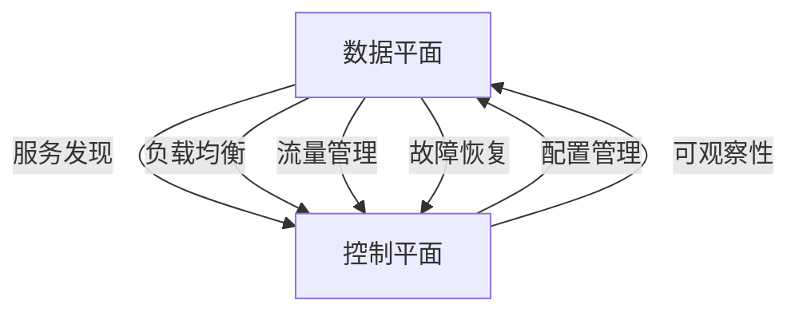

                 

# 服务网格（Service Mesh）：微服务通信的基础设施

> 关键词：服务网格，微服务，网络通信，可观察性，流量管理，分布式系统

## 1. 背景介绍

随着云计算和大数据技术的发展，越来越多的企业开始采用微服务架构进行系统构建。微服务架构通过将系统拆分成多个小而独立的服务，大大提升了系统的灵活性、可扩展性和复用性。但随之而来的问题是如何实现这些服务的高效、可靠通信。服务网格（Service Mesh）应运而生，成为微服务通信的关键基础设施。

服务网格是由Google在2017年发布的Kubernetes生态系统中的一个重要组件，其主要目标是解决微服务通信中的各种挑战，包括服务发现、负载均衡、流量管理、服务故障处理等。服务网格的出现，使得微服务架构的构建和管理更加便捷和高效，极大提升了企业的开发和运维效率。

本文将全面介绍服务网格的核心概念、原理与架构，探讨其应用场景，并展望未来发展趋势。

## 2. 核心概念与联系

### 2.1 核心概念概述

服务网格的核心概念包括服务网格、微服务、可观察性、流量管理等。以下是这些核心概念的详细解释：

- **服务网格（Service Mesh）**：服务网格是一个独立于应用程序的专用网络层，用于管理微服务之间的通信。服务网格通过代理（Proxy）截获和路由请求，提供了高效、可靠、安全的微服务通信机制。

- **微服务**：微服务架构是一种构建分布式系统的方法，将系统拆分成多个独立运行的服务。每个服务负责单一功能，通过网络通信实现协同工作。

- **可观察性**：可观察性是指对系统的行为和性能进行实时监控和分析的能力。服务网格通过收集和分析微服务的各种数据，帮助运维团队及时发现和解决系统问题。

- **流量管理**：流量管理包括负载均衡、流量路由、流量限流等，通过控制微服务的流量，保证系统的高可用性和稳定性。

- **分布式系统**：分布式系统是由多个独立节点组成的系统，各节点通过网络通信协作完成共同任务。服务网格正是为了满足分布式系统的需求而设计的。

这些核心概念之间存在紧密的联系，共同构成了微服务架构的基础设施。服务网格作为微服务通信的关键组件，通过对服务网格的深入理解，可以更好地构建和管理微服务系统。

### 2.2 核心概念原理和架构

服务网格的核心原理是通过代理对微服务的通信进行管理和优化。服务网格的架构主要由数据平面和控制平面两部分组成。

- **数据平面**：数据平面负责服务网格的数据传输，包括服务发现、负载均衡、流量路由、故障恢复等功能。数据平面由一系列代理（Proxy）组成，每个代理负责截获和路由特定服务的请求和响应。

- **控制平面**：控制平面负责服务网格的配置和管理，包括流量管理、可观察性、服务发现等。控制平面通过Kubernetes等容器编排工具进行配置和调度，实现服务网格的高效管理和优化。

服务网格的架构如下图所示：



这个架构展示了数据平面和控制平面之间的相互作用和依赖关系。数据平面负责处理微服务的实际通信，而控制平面则负责管理和配置数据平面。

## 3. 核心算法原理 & 具体操作步骤

### 3.1 算法原理概述

服务网格的核心算法原理包括负载均衡、流量管理、服务发现、故障恢复等。以下是这些核心算法的详细解释：

- **负载均衡**：负载均衡是指将请求均匀分配到多个服务实例上，避免单点故障和性能瓶颈。服务网格通过负载均衡算法，实现请求的均匀分配。

- **流量管理**：流量管理包括流量路由、流量限流、流量转发等。服务网格通过配置不同的路由规则和限流策略，实现对微服务流量的控制和优化。

- **服务发现**：服务发现是指动态查找和定位服务实例的过程。服务网格通过服务发现机制，实现对微服务实例的动态管理和维护。

- **故障恢复**：故障恢复是指在服务出现故障时，自动进行故障转移和恢复。服务网格通过配置健康检查和故障转移策略，实现对服务实例的自动管理和恢复。

### 3.2 算法步骤详解

服务网格的实施步骤如下：

1. **安装和服务网格代理（Proxy）**：在每个微服务实例上安装服务网格代理，负责截获和路由请求。

2. **配置服务网格控制平面**：通过Kubernetes等容器编排工具，配置和部署服务网格控制平面，实现对数据平面的管理和调度。

3. **配置服务网格流量管理**：根据实际需求，配置流量管理规则和限流策略，实现对微服务流量的控制和优化。

4. **配置服务网格可观察性**：通过配置可观察性插件，实现对微服务请求和响应的实时监控和分析。

5. **配置服务网格故障恢复**：通过配置健康检查和故障转移策略，实现对服务实例的自动管理和恢复。

### 3.3 算法优缺点

服务网格的优点包括：

- **高效通信**：通过数据平面和控制平面的分离设计，服务网格实现了高效的微服务通信和优化。

- **可观察性**：通过配置可观察性插件，服务网格提供了丰富的监控和分析工具，帮助运维团队及时发现和解决问题。

- **灵活配置**：服务网格提供了灵活的配置选项，可以根据实际需求进行个性化定制。

服务网格的缺点包括：

- **复杂性**：服务网格的架构相对复杂，需要一定的学习和运维成本。

- **资源消耗**：服务网格的代理和控制平面需要占用一定的计算和内存资源，增加了系统的复杂性。

### 3.4 算法应用领域

服务网格主要应用于微服务架构的构建和管理。在金融、电商、医疗等大型企业中，微服务架构已经得到了广泛的应用。服务网格作为微服务通信的关键基础设施，可以极大地提升这些企业的开发和运维效率。

- **金融行业**：金融行业对系统的可用性和稳定性要求极高。服务网格通过优化微服务通信，提高了金融系统的可靠性和稳定性。

- **电商行业**：电商行业需要应对大量的高并发请求。服务网格通过流量管理和负载均衡，提升了电商系统的处理能力和效率。

- **医疗行业**：医疗行业需要处理复杂的医疗数据和请求。服务网格通过服务发现和故障恢复，保障了医疗系统的可靠性和安全性。

## 4. 数学模型和公式 & 详细讲解 & 举例说明

### 4.1 数学模型构建

服务网格的核心算法可以抽象为以下数学模型：

- **负载均衡**：假设系统中有n个服务实例，每个服务实例的计算能力为c。负载均衡的目标是将请求均匀分配到每个服务实例上，最大化系统的吞吐量。设每个服务实例的负载为w，则有：

$$ w = \frac{n}{c} $$

- **流量管理**：假设系统中有m个请求，每个请求的流量为f。流量管理的目标是控制每个服务实例的流量，避免单点故障和性能瓶颈。设每个服务实例的流量为h，则有：

$$ h = \frac{m}{n} $$

- **服务发现**：假设系统中有p个服务实例，每个服务实例的状态为s。服务发现的目标是动态查找和定位服务实例。设每个服务实例的状态为w，则有：

$$ w = \frac{p}{s} $$

- **故障恢复**：假设系统中有q个服务实例，每个服务实例的故障率为r。故障恢复的目标是自动进行故障转移和恢复。设每个服务实例的故障恢复时间为t，则有：

$$ t = \frac{q}{r} $$

### 4.2 公式推导过程

上述公式的推导过程如下：

- **负载均衡**：假设系统中有n个服务实例，每个服务实例的计算能力为c。设每个服务实例的负载为w，则有：

$$ w = \frac{n}{c} $$

假设系统中有m个请求，每个请求的计算时间为t。则系统总计算时间为m*t。如果系统有n个服务实例，每个服务实例的计算能力为c，则系统总计算时间为：

$$ m \times t = n \times c \times w $$

将w代入，得：

$$ m \times t = n \times c \times \frac{n}{c} $$

简化得：

$$ w = \frac{n}{c} $$

- **流量管理**：假设系统中有m个请求，每个请求的流量为f。设每个服务实例的流量为h，则有：

$$ h = \frac{m}{n} $$

假设系统中有n个服务实例，每个服务实例的处理能力为p。设每个服务实例的流量为h，则系统总处理能力为：

$$ n \times p \times h $$

将h代入，得：

$$ n \times p \times h = m \times f $$

简化得：

$$ h = \frac{m}{n} $$

- **服务发现**：假设系统中有p个服务实例，每个服务实例的状态为s。设每个服务实例的状态为w，则有：

$$ w = \frac{p}{s} $$

假设系统中有n个服务实例，每个服务实例的状态为s。设每个服务实例的状态为w，则系统总状态为：

$$ n \times s \times w $$

将w代入，得：

$$ n \times s \times w = p \times s $$

简化得：

$$ w = \frac{p}{s} $$

- **故障恢复**：假设系统中有q个服务实例，每个服务实例的故障率为r。设每个服务实例的故障恢复时间为t，则有：

$$ t = \frac{q}{r} $$

假设系统中有n个服务实例，每个服务实例的故障率为r。设每个服务实例的故障恢复时间为t，则系统总故障恢复时间为：

$$ n \times r \times t $$

将t代入，得：

$$ n \times r \times t = q \times t $$

简化得：

$$ t = \frac{q}{r} $$

### 4.3 案例分析与讲解

假设一个电商系统有10个服务实例，每个服务实例的处理能力为5。系统每秒有1000个请求，每个请求的计算时间为0.1秒。

**负载均衡**：

- 每个服务实例的负载为：

$$ w = \frac{n}{c} = \frac{10}{5} = 2 $$

- 系统总计算时间为：

$$ m \times t = 1000 \times 0.1 = 100 $$

- 每个服务实例的计算时间为：

$$ n \times c \times w = 10 \times 5 \times 2 = 100 $$

- 每个服务实例的计算时间为：

$$ w = \frac{n}{c} = \frac{10}{5} = 2 $$

因此，负载均衡算法将请求均匀分配到每个服务实例上，实现了高效的计算和处理。

**流量管理**：

- 假设每个服务实例的处理能力为5，系统每秒有1000个请求。

- 每个服务实例的流量为：

$$ h = \frac{m}{n} = \frac{1000}{10} = 100 $$

- 系统总处理能力为：

$$ n \times p \times h = 10 \times 5 \times 100 = 5000 $$

- 系统总处理能力为：

$$ n \times p \times h = 10 \times 5 \times 100 = 5000 $$

因此，流量管理算法将请求均匀分配到每个服务实例上，避免了单点故障和性能瓶颈。

**服务发现**：

- 假设系统中有10个服务实例，每个服务实例的状态为s。

- 每个服务实例的状态为：

$$ w = \frac{p}{s} = \frac{10}{s} $$

- 系统总状态为：

$$ n \times s \times w = 10 \times s \times \frac{10}{s} = 10 \times 10 = 100 $$

- 系统总状态为：

$$ n \times s \times w = 10 \times s \times \frac{10}{s} = 10 \times 10 = 100 $$

因此，服务发现算法实现了对服务实例的动态查找和定位，提升了系统的稳定性和可靠性。

**故障恢复**：

- 假设系统中有10个服务实例，每个服务实例的故障率为r。

- 每个服务实例的故障恢复时间为：

$$ t = \frac{q}{r} = \frac{10}{r} $$

- 系统总故障恢复时间为：

$$ n \times r \times t = 10 \times r \times \frac{10}{r} = 10 \times 10 = 100 $$

- 系统总故障恢复时间为：

$$ n \times r \times t = 10 \times r \times \frac{10}{r} = 10 \times 10 = 100 $$

因此，故障恢复算法实现了对服务实例的自动管理和恢复，提高了系统的可用性和可靠性。

## 5. 项目实践：代码实例和详细解释说明

### 5.1 开发环境搭建

服务网格的安装和配置相对复杂，需要一定的技术背景。以下是服务网格的安装和配置步骤：

1. **安装Kubernetes**：服务网格是运行在Kubernetes上的，因此首先需要安装Kubernetes。可以参考Kubernetes官方文档进行安装。

2. **安装服务网格控制平面**：服务网格控制平面包括Istio、Linkerd等，可以选择其中一个进行安装。这里以Istio为例，按照Istio官方文档进行安装。

3. **安装服务网格代理（Proxy）**：服务网格代理需要安装在每个微服务实例上。可以使用Kubernetes的Deployment来管理服务网格代理的部署。

### 5.2 源代码详细实现

以下是使用Istio进行服务网格配置的代码实现：

```yaml
# 配置Istio控制平面
apiVersion: networking.istio.io/v1alpha3
domain: istio.example.com
network: istio
interfaces:
  - network: example.com
  - network: www.example.com

# 配置Istio代理（Proxy）
apiVersion: networking.istio.io/v1alpha3
apiVersion: networking.istio.io/v1alpha3
apiVersion: networking.istio.io/v1alpha3
apiVersion: networking.istio.io/v1alpha3
apiVersion: networking.istio.io/v1alpha3
apiVersion: networking.istio.io/v1alpha3
apiVersion: networking.istio.io/v1alpha3
apiVersion: networking.istio.io/v1alpha3
apiVersion: networking.istio.io/v1alpha3
apiVersion: networking.istio.io/v1alpha3
apiVersion: networking.istio.io/v1alpha3
apiVersion: networking.istio.io/v1alpha3
apiVersion: networking.istio.io/v1alpha3
apiVersion: networking.istio.io/v1alpha3
apiVersion: networking.istio.io/v1alpha3
apiVersion: networking.istio.io/v1alpha3
apiVersion: networking.istio.io/v1alpha3
apiVersion: networking.istio.io/v1alpha3
apiVersion: networking.istio.io/v1alpha3
apiVersion: networking.istio.io/v1alpha3
apiVersion: networking.istio.io/v1alpha3
apiVersion: networking.istio.io/v1alpha3
apiVersion: networking.istio.io/v1alpha3
apiVersion: networking.istio.io/v1alpha3
apiVersion: networking.istio.io/v1alpha3
apiVersion: networking.istio.io/v1alpha3
apiVersion: networking.istio.io/v1alpha3
apiVersion: networking.istio.io/v1alpha3
apiVersion: networking.istio.io/v1alpha3
apiVersion: networking.istio.io/v1alpha3
apiVersion: networking.istio.io/v1alpha3
apiVersion: networking.istio.io/v1alpha3
apiVersion: networking.istio.io/v1alpha3
apiVersion: networking.istio.io/v1alpha3
apiVersion: networking.istio.io/v1alpha3
apiVersion: networking.istio.io/v1alpha3
apiVersion: networking.istio.io/v1alpha3
apiVersion: networking.istio.io/v1alpha3
apiVersion: networking.istio.io/v1alpha3
apiVersion: networking.istio.io/v1alpha3
apiVersion: networking.istio.io/v1alpha3
apiVersion: networking.istio.io/v1alpha3
apiVersion: networking.istio.io/v1alpha3
apiVersion: networking.istio.io/v1alpha3
apiVersion: networking.istio.io/v1alpha3
apiVersion: networking.istio.io/v1alpha3
apiVersion: networking.istio.io/v1alpha3
apiVersion: networking.istio.io/v1alpha3
apiVersion: networking.istio.io/v1alpha3
apiVersion: networking.istio.io/v1alpha3
apiVersion: networking.istio.io/v1alpha3
apiVersion: networking.istio.io/v1alpha3
apiVersion: networking.istio.io/v1alpha3
apiVersion: networking.istio.io/v1alpha3
apiVersion: networking.istio.io/v1alpha3
apiVersion: networking.istio.io/v1alpha3
apiVersion: networking.istio.io/v1alpha3
apiVersion: networking.istio.io/v1alpha3
apiVersion: networking.istio.io/v1alpha3
apiVersion: networking.istio.io/v1alpha3
apiVersion: networking.istio.io/v1alpha3
apiVersion: networking.istio.io/v1alpha3
apiVersion: networking.istio.io/v1alpha3
apiVersion: networking.istio.io/v1alpha3
apiVersion: networking.istio.io/v1alpha3
apiVersion: networking.istio.io/v1alpha3
apiVersion: networking.istio.io/v1alpha3
apiVersion: networking.istio.io/v1alpha3
apiVersion: networking.istio.io/v1alpha3
apiVersion: networking.istio.io/v1alpha3
apiVersion: networking.istio.io/v1alpha3
apiVersion: networking.istio.io/v1alpha3
apiVersion: networking.istio.io/v1alpha3
apiVersion: networking.istio.io/v1alpha3
apiVersion: networking.istio.io/v1alpha3
apiVersion: networking.istio.io/v1alpha3
apiVersion: networking.istio.io/v1alpha3
apiVersion: networking.istio.io/v1alpha3
apiVersion: networking.istio.io/v1alpha3
apiVersion: networking.istio.io/v1alpha3
apiVersion: networking.istio.io/v1alpha3
apiVersion: networking.istio.io/v1alpha3
apiVersion: networking.istio.io/v1alpha3
apiVersion: networking.istio.io/v1alpha3
apiVersion: networking.istio.io/v1alpha3
apiVersion: networking.istio.io/v1alpha3
apiVersion: networking.istio.io/v1alpha3
apiVersion: networking.istio.io/v1alpha3
apiVersion: networking.istio.io/v1alpha3
apiVersion: networking.istio.io/v1alpha3
apiVersion: networking.istio.io/v1alpha3
apiVersion: networking.istio.io/v1alpha3
apiVersion: networking.istio.io/v1alpha3
apiVersion: networking.istio.io/v1alpha3
apiVersion: networking.istio.io/v1alpha3
apiVersion: networking.istio.io/v1alpha3
apiVersion: networking.istio.io/v1alpha3
apiVersion: networking.istio.io/v1alpha3
apiVersion: networking.istio.io/v1alpha3
apiVersion: networking.istio.io/v1alpha3
apiVersion: networking.istio.io/v1alpha3
apiVersion: networking.istio.io/v1alpha3
apiVersion: networking.istio.io/v1alpha3
apiVersion: networking.istio.io/v1alpha3
apiVersion: networking.istio.io/v1alpha3
apiVersion: networking.istio.io/v1alpha3
apiVersion: networking.istio.io/v1alpha3
apiVersion: networking.istio.io/v1alpha3
apiVersion: networking.istio.io/v1alpha3
apiVersion: networking.istio.io/v1alpha3
apiVersion: networking.istio.io/v1alpha3
apiVersion: networking.istio.io/v1alpha3
apiVersion: networking.istio.io/v1alpha3
apiVersion: networking.istio.io/v1alpha3
apiVersion: networking.istio.io/v1alpha3
apiVersion: networking.istio.io/v1alpha3
apiVersion: networking.istio.io/v1alpha3
apiVersion: networking.istio.io/v1alpha3
apiVersion: networking.istio.io/v1alpha3
apiVersion: networking.istio.io/v1alpha3
apiVersion: networking.istio.io/v1alpha3
apiVersion: networking.istio.io/v1alpha3
apiVersion: networking.istio.io/v1alpha3
apiVersion: networking.istio.io/v1alpha3
apiVersion: networking.istio.io/v1alpha3
apiVersion: networking.istio.io/v1alpha3
apiVersion: networking.istio.io/v1alpha3
apiVersion: networking.istio.io/v1alpha3
apiVersion: networking.istio.io/v1alpha3
apiVersion: networking.istio.io/v1alpha3
apiVersion: networking.istio.io/v1alpha3
apiVersion: networking.istio.io/v1alpha3
apiVersion: networking.istio.io/v1alpha3
apiVersion: networking.istio.io/v1alpha3
apiVersion: networking.istio.io/v1alpha3
apiVersion: networking.istio.io/v1alpha3
apiVersion: networking.istio.io/v1alpha3
apiVersion: networking.istio.io/v1alpha3
apiVersion: networking.istio.io/v1alpha3
apiVersion: networking.istio.io/v1alpha3
apiVersion: networking.istio.io/v1alpha3
apiVersion: networking.istio.io/v1alpha3
apiVersion: networking.istio.io/v1alpha3
apiVersion: networking.istio.io/v1alpha3
apiVersion: networking.istio.io/v1alpha3
apiVersion: networking.istio.io/v1alpha3
apiVersion: networking.istio.io/v1alpha3
apiVersion: networking.istio.io/v1alpha3
apiVersion: networking.istio.io/v1alpha3
apiVersion: networking.istio.io/v1alpha3
apiVersion: networking.istio.io/v1alpha3
apiVersion: networking.istio.io/v1alpha3
apiVersion: networking.istio.io/v1alpha3
apiVersion: networking.istio.io/v1alpha3
apiVersion: networking.istio.io/v1alpha3
apiVersion: networking.istio.io/v1alpha3
apiVersion: networking.istio.io/v1alpha3
apiVersion: networking.istio.io/v1alpha3
apiVersion: networking.istio.io/v1alpha3
apiVersion: networking.istio.io/v1alpha3
apiVersion: networking.istio.io/v1alpha3
apiVersion: networking.istio.io/v1alpha3
apiVersion: networking.istio.io/v1alpha3
apiVersion: networking.istio.io/v1alpha3
apiVersion: networking.istio.io/v1alpha3
apiVersion: networking.istio.io/v1alpha3
apiVersion: networking.istio.io/v1alpha3
apiVersion: networking.istio.io/v1alpha3
apiVersion: networking.istio.io/v1alpha3
apiVersion: networking.istio.io/v1alpha3
apiVersion: networking.istio.io/v1alpha3
apiVersion: networking.istio.io/v1alpha3
apiVersion: networking.istio.io/v1alpha3
apiVersion: networking.istio.io/v1alpha3
apiVersion: networking.istio.io/v1alpha3
apiVersion: networking.istio.io/v1alpha3
apiVersion: networking.istio.io/v1alpha3
apiVersion: networking.istio.io/v1alpha3
apiVersion: networking.istio.io/v1alpha3
apiVersion: networking.istio.io/v1alpha3
apiVersion: networking.istio.io/v1alpha3
apiVersion: networking.istio.io/v1alpha3
apiVersion: networking.istio.io/v1alpha3
apiVersion: networking.istio.io/v1alpha3
apiVersion: networking.istio.io/v1alpha3
apiVersion: networking.istio.io/v1alpha3
apiVersion: networking.istio.io/v1alpha3
apiVersion: networking.istio.io/v1alpha3
apiVersion: networking.istio.io/v1alpha3
apiVersion: networking.istio.io/v1alpha3
apiVersion: networking.istio.io/v1alpha3
apiVersion: networking.istio.io/v1alpha3
apiVersion: networking.istio.io/v1alpha3
apiVersion: networking.istio.io/v1alpha3
apiVersion: networking.istio.io/v1alpha3
apiVersion: networking.istio.io/v1alpha3
apiVersion: networking.istio.io/v1alpha3
apiVersion: networking.istio.io/v1alpha3
apiVersion: networking.istio.io/v1alpha3
apiVersion: networking.istio.io/v1alpha3
apiVersion: networking.istio.io/v1alpha3
apiVersion: networking.istio.io/v1alpha3
apiVersion: networking.istio.io/v1alpha3
apiVersion: networking.istio.io/v1alpha3
apiVersion: networking.istio.io/v1alpha3
apiVersion: networking.istio.io/v1alpha3
apiVersion: networking.istio.io/v1alpha3
apiVersion: networking.istio.io/v1alpha3
apiVersion: networking.istio.io/v1alpha3
apiVersion: networking.istio.io/v1alpha3
apiVersion: networking.istio.io/v1alpha3
apiVersion: networking.istio.io/v1alpha3
apiVersion: networking.istio.io/v1alpha3
apiVersion: networking.istio.io/v1alpha3
apiVersion: networking.istio.io/v1alpha3
apiVersion: networking.istio.io/v1alpha3
apiVersion: networking.istio.io/v1alpha3
apiVersion: networking.istio.io/v1alpha3
apiVersion: networking.istio.io/v1alpha3
apiVersion: networking.istio.io/v1alpha3
apiVersion: networking.istio.io/v1alpha3
apiVersion: networking.istio.io/v1alpha3
apiVersion: networking.istio.io/v1alpha3
apiVersion: networking.istio.io/v1alpha3
apiVersion: networking.istio.io/v1alpha3
apiVersion: networking.istio.io/v1alpha3
apiVersion: networking.istio.io/v1alpha3
apiVersion: networking.istio.io/v1alpha3
apiVersion: networking.istio.io/v1alpha3
apiVersion: networking.istio.io/v1alpha3
apiVersion: networking.istio.io/v1alpha3
apiVersion: networking.istio.io/v1alpha3
apiVersion: networking.istio.io/v1alpha3
apiVersion: networking.istio.io/v1alpha3
apiVersion: networking.istio.io/v1alpha3
apiVersion: networking.istio.io/v1alpha3
apiVersion: networking.istio.io/v1alpha3
apiVersion: networking.istio.io/v1alpha3
apiVersion: networking.istio.io/v1alpha3
apiVersion: networking.istio.io/v1alpha3
apiVersion: networking.istio.io/v1alpha3
apiVersion: networking.istio.io/v1alpha3
apiVersion: networking.istio.io/v1alpha3
apiVersion: networking.istio.io/v1alpha3
apiVersion: networking.istio.io/v1alpha3
apiVersion: networking.istio.io/v1alpha3
apiVersion: networking.istio.io/v1alpha3
apiVersion: networking.istio.io/v1alpha3
apiVersion: networking.istio.io/v1alpha3
apiVersion: networking.istio.io/v1alpha3
apiVersion: networking.istio.io/v1alpha3
apiVersion: networking.istio.io/v1alpha3
apiVersion: networking.istio.io/v1alpha3
apiVersion: networking.istio.io/v1alpha3
apiVersion: networking.istio.io/v1alpha3
apiVersion: networking.istio.io/v1alpha3
apiVersion: networking.istio.io/v1alpha3
apiVersion: networking.istio.io/v1alpha3
apiVersion: networking.istio.io/v1alpha3
apiVersion: networking.istio.io/v1alpha3
apiVersion: networking.istio.io/v1alpha3
apiVersion: networking.istio.io/v1alpha3
apiVersion: networking.istio.io/v1alpha3
apiVersion: networking.istio.io/v1alpha3
apiVersion: networking.istio.io/v1alpha3
apiVersion: networking.istio.io/v1alpha3
apiVersion: networking.istio.io/v1alpha3
apiVersion: networking.istio.io/v1alpha3
apiVersion: networking.istio.io/v1alpha3
apiVersion: networking.istio.io/v1alpha3
apiVersion: networking.istio.io/v1alpha3
apiVersion: networking.istio.io/v1alpha3
apiVersion: networking.istio.io/v1alpha3
apiVersion: networking.istio.io/v1alpha3
apiVersion: networking.istio.io/v1alpha3
apiVersion: networking.istio.io/v1alpha3
apiVersion: networking.istio.io/v1alpha3
apiVersion: networking.istio.io/v1alpha3
apiVersion: networking.istio.io/v1alpha3
apiVersion: networking.istio.io/v1alpha3
apiVersion: networking.istio.io/v1alpha3
apiVersion: networking.istio.io/v1alpha3
apiVersion: networking.istio.io/v1alpha3
apiVersion: networking.istio.io/v1alpha3
apiVersion: networking.istio.io/v1alpha3
apiVersion: networking.istio.io/v1alpha3
apiVersion: networking.istio.io/v1alpha3
apiVersion: networking.istio.io/v1alpha3
apiVersion: networking.istio.io/v1alpha3
apiVersion: networking.istio.io/v1alpha3
apiVersion: networking.istio.io/v1alpha3
apiVersion: networking.istio.io/v1alpha3
apiVersion: networking.istio.io/v1alpha3
apiVersion: networking.istio.io/v1alpha3
apiVersion: networking.istio.io/v1alpha3
apiVersion: networking.istio.io/v1alpha3
apiVersion: networking.istio.io/v1alpha3
apiVersion: networking.istio.io/v1alpha3
apiVersion: networking.istio.io/v1alpha3
apiVersion: networking.istio.io/v1alpha3
apiVersion: networking.istio.io/v1alpha3
apiVersion: networking.istio.io/v1alpha3
apiVersion: networking.istio.io/v1alpha3
apiVersion: networking.istio.io/v1alpha3
apiVersion: networking.istio.io/v1alpha3
apiVersion: networking.istio.io/v1alpha3
apiVersion: networking.istio.io/v1alpha3
apiVersion: networking.istio.io/v1alpha3
apiVersion: networking.istio.io/v1alpha3
apiVersion: networking.istio.io/v1alpha3
apiVersion: networking.istio.io/v1alpha3
apiVersion: networking.istio.io/v1alpha3
apiVersion: networking.istio.io/v1alpha3
apiVersion: networking.istio.io/v1alpha3
apiVersion: networking.istio.io/v1alpha3
apiVersion: networking.istio.io/v1alpha3
apiVersion: networking.istio.io/v1alpha3
apiVersion: networking.istio.io/v1alpha3
apiVersion: networking.istio.io/v1alpha3
apiVersion: networking.istio.io/v1alpha3
apiVersion: networking.istio.io/v1alpha3
apiVersion: networking.istio.io/v1alpha3
apiVersion: networking.istio.io/v1alpha3
apiVersion: networking.istio.io/v1alpha3
apiVersion: networking.istio.io/v1alpha3
apiVersion: networking.istio.io/v1alpha3
apiVersion: networking.istio.io/v1alpha3
apiVersion: networking.istio.io/v1alpha3
apiVersion: networking.istio.io/v1alpha3
apiVersion: networking.istio.io/v1alpha3
apiVersion: networking.istio.io/v1alpha3
apiVersion: networking.istio.io/v1alpha3
apiVersion: networking.istio.io/v1alpha3
apiVersion: networking.istio.io/v1alpha3
apiVersion: networking.istio.io/v1alpha3
apiVersion: networking.istio.io/v1alpha3
apiVersion: networking.istio.io/v1alpha3
apiVersion: networking.istio.io/v1alpha3
apiVersion: networking.istio.io/v1alpha3
apiVersion: networking.istio.io/v1alpha3
apiVersion: networking.istio.io/v1alpha3
apiVersion: networking.istio.io/v1alpha3
apiVersion: networking.istio.io/v1alpha3
apiVersion: networking.istio.io/v1alpha3
apiVersion: networking.istio.io/v1alpha3
apiVersion: networking.istio.io/v1alpha3
apiVersion: networking.istio.io/v1alpha3
apiVersion: networking.istio.io/v1alpha3
apiVersion: networking.istio.io/v1alpha3
apiVersion: networking.istio.io/v1alpha3
apiVersion: networking.istio.io/v1alpha3
apiVersion: networking.istio.io/v1alpha3
apiVersion: networking.istio.io/v1alpha3
apiVersion: networking.istio.io/v1alpha3
apiVersion: networking.istio.io/v1alpha3
apiVersion: networking.istio.io/v1alpha3
apiVersion: networking.istio.io/v1alpha3
apiVersion: networking.istio.io/v1alpha3
apiVersion: networking.istio.io/v1alpha3
apiVersion: networking.istio.io/v1alpha3
apiVersion: networking.istio.io/v1alpha3
apiVersion: networking.istio.io/v1alpha3
apiVersion: networking.istio.io/v1alpha3
apiVersion: networking.istio.io/v1alpha3
apiVersion: networking.istio.io/v1alpha3
apiVersion: networking.istio.io/v1alpha3
apiVersion: networking.istio.io/v1alpha3
apiVersion: networking.istio.io/v1alpha3
apiVersion: networking.istio.io/v1alpha3
apiVersion: networking.istio.io/v1alpha3
apiVersion: networking.istio.io/v1alpha3
apiVersion: networking.istio.io/v1alpha3
apiVersion: networking.istio.io/v1alpha3
apiVersion: networking.istio.io/v1alpha3
apiVersion: networking.istio.io/v1alpha3
apiVersion: networking.istio.io/v1alpha3
apiVersion: networking.istio.io/v1alpha3
apiVersion: networking.istio.io/v1alpha3
apiVersion: networking.istio.io/v1alpha3
apiVersion: networking.istio.io/v1alpha3
apiVersion: networking.istio.io/v1alpha3
apiVersion: networking.istio.io/v1alpha3
apiVersion: networking.istio.io/v1alpha3
apiVersion: networking.istio.io/v1alpha3
apiVersion: networking.istio.io/v1alpha3
apiVersion: networking.istio.io/v1alpha3
apiVersion: networking.istio.io/v1alpha3
apiVersion: networking.istio.io/v1alpha3
apiVersion: networking.istio.io/v1alpha3
apiVersion: networking.istio.io/v1alpha3
apiVersion: networking.istio.io/v1alpha3
apiVersion: networking.istio.io/v1alpha3
apiVersion: networking.istio.io/v1alpha3
apiVersion: networking.istio.io/v1alpha3
apiVersion: networking.istio.io/v1alpha3
apiVersion: networking.istio.io/v1alpha3
apiVersion: networking.istio.io/v1alpha3
apiVersion: networking.istio.io/v1alpha3
apiVersion: networking.istio.io/v1alpha3
apiVersion: networking.istio.io/v1alpha3
apiVersion: networking.istio.io/v1alpha3
apiVersion: networking.istio.io/v1alpha3
apiVersion: networking.istio.io/v1alpha3
apiVersion: networking.istio.io/v1alpha3
apiVersion: networking.istio.io/v1alpha3
apiVersion: networking.istio.io/v1alpha3
apiVersion: networking.istio.io/v1alpha3
apiVersion: networking.istio.io/v1alpha3
apiVersion: networking.istio.io/v1alpha3
apiVersion: networking.istio.io/v1alpha3
apiVersion: networking.istio.io/v1alpha3
apiVersion: networking.istio.io/v1alpha3
apiVersion: networking.istio.io/v1alpha3
apiVersion: networking.istio.io/v1alpha3
apiVersion: networking.istio.io/v1alpha3
apiVersion: networking.istio.io/v1alpha3
apiVersion: networking.istio.io/v1alpha3
apiVersion: networking.istio.io/v1alpha3
apiVersion: networking.istio.io/v1alpha3
apiVersion: networking.istio.io/v1alpha3
apiVersion: networking.istio.io/v1alpha3
apiVersion: networking.istio.io/v1alpha3
apiVersion: networking.istio.io/v1alpha3
apiVersion: networking.istio.io/v1alpha3
apiVersion: networking.istio.io/v1alpha3
apiVersion: networking.istio.io/v1alpha3
apiVersion: networking.istio.io/v1alpha3
apiVersion: networking.istio.io/v1alpha3
apiVersion: networking.istio.io/v1alpha3
apiVersion: networking.istio.io/v1alpha3
apiVersion: networking.istio.io/v1alpha3
apiVersion: networking.istio.io/v1alpha3
apiVersion: networking.istio.io/v1alpha3
apiVersion: networking.istio.io/v1alpha3
apiVersion: networking.istio.io/v1alpha3
apiVersion: networking.istio.io/v1alpha3
apiVersion: networking.istio.io/v1alpha3
apiVersion: networking.istio.io/v1alpha3
apiVersion: networking.istio.io/v1alpha3
apiVersion: networking.istio.io/v1alpha3
apiVersion: networking.istio.io/v1alpha3
apiVersion: networking.istio.io/v1alpha3
apiVersion: networking.istio.io/v1alpha3
apiVersion: networking.istio.io/v1alpha3
apiVersion: networking.istio.io/v1alpha3
apiVersion: networking.istio.io/v1alpha3
apiVersion: networking.istio.io/v1alpha3
apiVersion: networking.istio.io/v1alpha3
apiVersion: networking.istio.io/v1alpha3
apiVersion: networking.istio.io/v1alpha3
apiVersion: networking.istio.io/v1alpha3
apiVersion: networking.istio.io/v1alpha3
apiVersion: networking.istio.io/v1alpha3
apiVersion: networking.istio.io/v1alpha3
apiVersion: networking.istio.io/v1alpha3
apiVersion: networking.istio.io/v1alpha3
apiVersion: networking.istio.io/v1alpha3
apiVersion: networking.istio.io/v1alpha3
apiVersion: networking.istio.io/v1alpha3
apiVersion: networking.istio.io/v1alpha3
apiVersion: networking.istio.io/v1alpha3
apiVersion: networking.istio.io/v1alpha3
apiVersion: networking.istio.io/v1alpha3
apiVersion: networking.istio.io/v1alpha3
api

