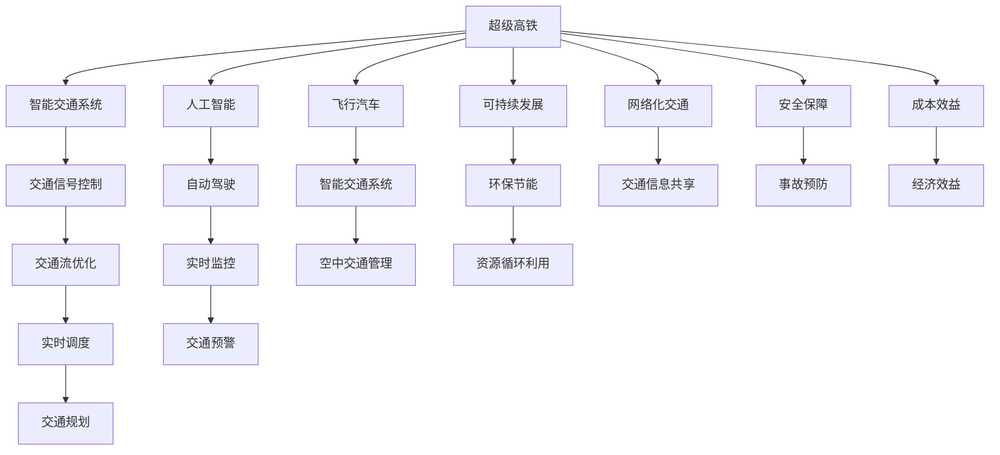

                 

# 未来的交通出行：2050年的超级高铁与飞行汽车

> 关键词：超级高铁,飞行汽车,交通出行,人工智能,自动化,智能交通,可持续发展

## 1. 背景介绍

### 1.1 问题由来

随着全球化进程的加快和城市化建设的推进，交通出行成为现代社会一个突出的问题。传统的公路、铁路、航空等交通方式虽然能够满足大部分人的出行需求，但在资源利用效率、环境污染、安全事故等方面仍存在诸多不足。尤其是在人口密集、城市规模不断扩大的背景下，交通拥堵、空气污染和交通事故等问题愈发严峻，亟需寻找新的解决方案。

近年来，智能交通和自动驾驶技术的迅速发展为交通出行带来了新的变革方向。但是，如何实现交通出行的高效、安全、环保和智能化，仍然是一个亟待解决的问题。本文将介绍两种可能的未来交通出行解决方案——超级高铁与飞行汽车，探讨其在交通出行领域的应用前景和潜力。

## 2. 核心概念与联系

### 2.1 核心概念概述

为了深入理解超级高铁与飞行汽车的概念，我们先对以下几个核心概念进行概述：

- **超级高铁(Hyperloop)**：一种新型高速运输系统，通过管道内真空环境减少空气阻力，结合磁悬浮技术和电动驱动系统，实现极高的运输速度。超级高铁具备高效率、低能耗、环保等特点，是未来城市间快速交通的理想选择。

- **飞行汽车(Training Air Cars, TACs)**：一种能够在空中自由飞行的汽车，结合了汽车和飞机的技术，既可以在地面上行驶，也可以在空中飞行。飞行汽车能够大幅减少交通拥堵，提升出行灵活性和效率，是城市空中交通的有力补充。

- **智能交通系统(Intelligent Transportation Systems, ITS)**：利用信息技术对交通系统进行实时监控和管理，实现交通流的优化配置，提升交通效率和安全性。智能交通系统包括交通信号控制系统、交通信息采集系统、交通信息处理系统等。

- **人工智能(Artificial Intelligence, AI)**：一种模拟人类智能行为的计算机技术，包括机器学习、深度学习、自然语言处理等。人工智能技术能够帮助交通系统实现自动化、智能化和精准化管理，提升交通出行的效率和安全性。

- **自动化(Automation)**：指机器或系统能够自动完成某些任务，无需人工干预。在交通出行中，自动化技术能够实现交通信号控制、自动驾驶、智能调度等功能。

- **可持续交通(Sustainable Transportation)**：强调交通出行在资源利用、环境友好、社会公平等方面的可持续性，减少对环境的负面影响，提升交通系统的整体效益。

这些概念之间的联系紧密，相辅相成。超级高铁和飞行汽车作为未来交通出行模式，将深度融合智能交通系统和人工智能技术，实现交通出行方式的革命性变革。

### 2.2 核心概念原理和架构的 Mermaid 流程图



此图展示了超级高铁与飞行汽车在交通出行中的作用及其与智能交通系统和人工智能技术的融合关系。超级高铁与飞行汽车通过智能交通系统和人工智能技术的支撑，实现高效、安全、环保和智能化的交通出行方式。

## 3. 核心算法原理 & 具体操作步骤

### 3.1 算法原理概述

超级高铁与飞行汽车的高效、安全和智能化交通出行，依赖于多种先进技术的应用和高效的管理。这些技术的实现涉及多个学科领域的知识，包括机械工程、电子工程、计算机科学、交通工程等。

在超级高铁系统中，关键的算法包括磁悬浮控制算法、电动驱动算法、管道内环境控制算法等。这些算法通过实时数据反馈和优化，实现系统的稳定运行和高效运输。

在飞行汽车系统中，关键的算法包括路径规划算法、飞行控制算法、安全保障算法等。这些算法通过计算和决策，实现汽车在地面和空中之间的平滑切换，保障飞行安全和稳定性。

### 3.2 算法步骤详解

以下是超级高铁与飞行汽车核心算法的详细步骤：

#### 超级高铁算法

1. **磁悬浮控制算法**：
   - **步骤**：
     - 通过传感器采集磁悬浮系统的位置和速度信息。
     - 将采集到的信息输入到控制器中，控制器根据预设的控制策略计算控制信号。
     - 控制器将控制信号发送给执行器，执行器控制磁悬浮系统的位置和速度。
     - 重复上述步骤，实现磁悬浮系统的稳定运行。
   - **优点**：减少摩擦，提高速度和效率。
   - **缺点**：需要高精度的传感器和控制器，技术复杂，成本较高。

2. **电动驱动算法**：
   - **步骤**：
     - 将电池储能系统与电动马达连接，电动机驱动磁悬浮系统运行。
     - 控制器根据磁悬浮系统的位置和速度信息，实时调整电动机转速和扭矩。
     - 电动驱动系统保持高效率运行，减少能源损耗。
     - 重复上述步骤，实现电动驱动系统的稳定运行。
   - **优点**：高效、环保、噪音低。
   - **缺点**：需要大容量的电池储能系统，成本较高。

3. **管道内环境控制算法**：
   - **步骤**：
     - 通过传感器监测管道内压力、温度、湿度等环境参数。
     - 将采集到的环境参数输入到控制器中，控制器根据预设的控制策略计算控制信号。
     - 控制器将控制信号发送给执行器，执行器控制管道内环境参数。
     - 重复上述步骤，实现管道内环境的稳定控制。
   - **优点**：减少空气阻力，提升运输速度。
   - **缺点**：需要高精度的传感器和控制器，技术复杂，成本较高。

#### 飞行汽车算法

1. **路径规划算法**：
   - **步骤**：
     - 利用GPS和雷达等传感器获取周围环境和路况信息。
     - 根据获取的信息，结合预设的路线和目的地，计算出最佳路径。
     - 控制器根据路径规划结果，控制飞行汽车进行路径跟随。
     - 重复上述步骤，实现飞行汽车在地面和空中之间的平滑切换。
   - **优点**：优化路径，提高效率。
   - **缺点**：需要高精度的传感器和实时计算能力，技术复杂，成本较高。

2. **飞行控制算法**：
   - **步骤**：
     - 利用IMU和气压计等传感器获取飞行汽车的状态信息。
     - 将采集到的状态信息输入到控制器中，控制器根据预设的控制策略计算控制信号。
     - 控制器将控制信号发送给执行器，执行器控制飞行汽车的方向和高度。
     - 重复上述步骤，实现飞行汽车在空中稳定飞行。
   - **优点**：飞行稳定，操控灵活。
   - **缺点**：需要高精度的传感器和控制器，技术复杂，成本较高。

3. **安全保障算法**：
   - **步骤**：
     - 利用雷达和红外传感器检测周围障碍物和潜在威胁。
     - 将检测到的信息输入到控制器中，控制器根据预设的安全策略计算控制信号。
     - 控制器将控制信号发送给执行器，执行器控制飞行汽车进行避障和紧急制动。
     - 重复上述步骤，实现飞行汽车的安全保障。
   - **优点**：防止事故发生，保障飞行安全。
   - **缺点**：需要高精度的传感器和控制器，技术复杂，成本较高。

### 3.3 算法优缺点

#### 超级高铁

**优点**：
- **高效**：运输速度快，可以减少旅行时间。
- **环保**：减少交通拥堵和环境污染。
- **智能化**：通过智能交通系统实现自动化管理。

**缺点**：
- **成本高**：需要高精度的传感器和控制器，技术复杂。
- **技术门槛高**：需要高水平的技术支持和维护。

#### 飞行汽车

**优点**：
- **灵活性高**：可以在地面和空中自由切换，提供多种出行方式。
- **空间利用率高**：可以避免地面交通拥堵，提高城市空间利用率。
- **智能化**：通过智能交通系统实现自动化管理。

**缺点**：
- **成本高**：需要高精度的传感器和控制器，技术复杂。
- **安全风险高**：需要在技术和管理上投入大量资源，保障飞行安全。

### 3.4 算法应用领域

超级高铁和飞行汽车的核心算法广泛应用于多个领域，包括智能交通系统、自动化系统、环境保护等。这些算法的应用，将推动交通出行方式的革命性变革，提升交通系统的整体效益。

- **智能交通系统**：超级高铁和飞行汽车通过智能交通系统实现高效、安全、环保的交通出行。
- **自动化系统**：超级高铁和飞行汽车通过自动化系统实现智能调度、自动驾驶等功能。
- **环境保护**：超级高铁和飞行汽车通过环保技术减少交通污染，实现可持续发展。

## 4. 数学模型和公式 & 详细讲解 & 举例说明

### 4.1 数学模型构建

以下是超级高铁和飞行汽车系统的数学模型构建：

1. **超级高铁的数学模型**：
   - **磁悬浮控制模型**：
     - 磁悬浮系统的位置和速度为状态变量 $x(t) = [x(t), v(t)]$。
     - 控制输入为 $u(t) = [F(t), M(t)]$，其中 $F(t)$ 为电磁力，$M(t)$ 为磁力矩。
     - 磁悬浮系统的状态方程为：
       $$
       \dot{x}(t) = A \dot{x}(t) + Bu(t)
       $$
     - 磁悬浮系统的控制方程为：
       $$
       u(t) = K(x(t)) + D(x(t))y(t)
       $$
     - 磁悬浮系统的目标函数为：
       $$
       J = \int_{0}^{T} (x(t) - x_d(t))^2 + (u(t) - u_d(t))^2 dt
       $$
   - **电动驱动模型**：
     - 电动马达的转速和扭矩为控制变量 $v(t) = [\omega(t), \tau(t)]$。
     - 电动马达的输出功率为 $P(t)$。
     - 电动马达的功率平衡方程为：
       $$
       P(t) = P_{el}(t) + P_{mech}(t)
       $$
     - 电动马达的输出方程为：
       $$
       P(t) = k_1 v(t) + k_2 v^2(t)
       $$
   - **管道内环境控制模型**：
     - 管道内压力、温度、湿度等为状态变量 $y(t) = [p(t), T(t), h(t)]$。
     - 管道内环境控制器的控制输入为 $u(t) = [Q(t), R(t), H(t)]$，其中 $Q(t)$ 为加热功率，$R(t)$ 为冷却功率，$H(t)$ 为加湿功率。
     - 管道内环境控制器的状态方程为：
       $$
       \dot{y}(t) = Ay(t) + Bu(t)
       $$
     - 管道内环境控制器的控制方程为：
       $$
       u(t) = K(y(t)) + D(y(t))y_d(t)
       $$
     - 管道内环境控制器的目标函数为：
       $$
       J = \int_{0}^{T} (y(t) - y_d(t))^2 dt
       $$

2. **飞行汽车的数学模型**：
   - **路径规划模型**：
     - 飞行汽车的位置和速度为状态变量 $x(t) = [x(t), v(t), h(t)]$。
     - 飞行汽车的航向和高度为控制变量 $u(t) = [\theta(t), h(t)]$。
     - 飞行汽车的状态方程为：
       $$
       \dot{x}(t) = A \dot{x}(t) + Bu(t)
       $$
     - 飞行汽车的控制方程为：
       $$
       u(t) = K(x(t)) + D(x(t))y(t)
       $$
     - 飞行汽车的目标函数为：
       $$
       J = \int_{0}^{T} (x(t) - x_d(t))^2 + (u(t) - u_d(t))^2 dt
       $$
   - **飞行控制模型**：
     - 飞行汽车的角度和加速度为控制变量 $v(t) = [\phi(t), \dot{\phi}(t)]$。
     - 飞行汽车的输出力矩为 $M(t)$。
     - 飞行汽车的动力学方程为：
       $$
       M(t) = F_a(t) + F_d(t)
       $$
     - 飞行汽车的控制方程为：
       $$
       v(t) = K(x(t)) + D(x(t))y(t)
       $$
     - 飞行汽车的目标函数为：
       $$
       J = \int_{0}^{T} (x(t) - x_d(t))^2 + (v(t) - v_d(t))^2 dt
       $$
   - **安全保障模型**：
     - 飞行汽车的速度和加速度为状态变量 $y(t) = [v(t), a(t)]$。
     - 飞行汽车的控制输入为 $u(t) = [\phi(t), \dot{\phi}(t)]$。
     - 飞行汽车的安全策略方程为：
       $$
       u(t) = K(y(t)) + D(y(t))y_d(t)
       $$
     - 飞行汽车的安全保障方程为：
       $$
       y(t) = F(y(t)) + G(u(t))
       $$
     - 飞行汽车的目标函数为：
       $$
       J = \int_{0}^{T} (y(t) - y_d(t))^2 + (u(t) - u_d(t))^2 dt
       $$

### 4.2 公式推导过程

以下是超级高铁和飞行汽车核心算法的公式推导过程：

#### 超级高铁公式推导

1. **磁悬浮控制公式推导**：
   - **状态方程**：
     - 磁悬浮系统的位置和速度为状态变量 $x(t) = [x(t), v(t)]$。
     - 控制输入为 $u(t) = [F(t), M(t)]$，其中 $F(t)$ 为电磁力，$M(t)$ 为磁力矩。
     - 磁悬浮系统的状态方程为：
       $$
       \dot{x}(t) = A \dot{x}(t) + Bu(t)
       $$
     - 其中，$A = \begin{bmatrix} 0 & 1 \\ 0 & 0 \end{bmatrix}$，$B = \begin{bmatrix} 0 \\ 1 \end{bmatrix}$。
   - **控制方程**：
     - 磁悬浮系统的控制方程为：
       $$
       u(t) = K(x(t)) + D(x(t))y(t)
       $$
     - 其中，$K = \begin{bmatrix} 0 \\ 1 \end{bmatrix}$，$D = \begin{bmatrix} 0 & 1 \end{bmatrix}$。
   - **目标函数**：
     - 磁悬浮系统的目标函数为：
       $$
       J = \int_{0}^{T} (x(t) - x_d(t))^2 + (u(t) - u_d(t))^2 dt
       $$

2. **电动驱动公式推导**：
   - **功率平衡方程**：
     - 电动马达的转速和扭矩为控制变量 $v(t) = [\omega(t), \tau(t)]$。
     - 电动马达的输出功率为 $P(t)$。
     - 电动马达的功率平衡方程为：
       $$
       P(t) = P_{el}(t) + P_{mech}(t)
       $$
   - **输出方程**：
     - 电动马达的输出方程为：
       $$
       P(t) = k_1 v(t) + k_2 v^2(t)
       $$
   - **状态方程**：
     - 电动马达的状态方程为：
       $$
       \dot{x}(t) = A \dot{x}(t) + Bu(t)
       $$
     - 其中，$A = \begin{bmatrix} 0 & 1 \\ 0 & 0 \end{bmatrix}$，$B = \begin{bmatrix} 0 \\ 1 \end{bmatrix}$。
   - **控制方程**：
     - 电动马达的控制方程为：
       $$
       u(t) = K(x(t)) + D(x(t))y(t)
       $$
     - 其中，$K = \begin{bmatrix} 0 \\ 1 \end{bmatrix}$，$D = \begin{bmatrix} 0 & 1 \end{bmatrix}$。
   - **目标函数**：
     - 电动马达的目标函数为：
       $$
       J = \int_{0}^{T} (x(t) - x_d(t))^2 + (u(t) - u_d(t))^2 dt
       $$

3. **管道内环境控制公式推导**：
   - **状态方程**：
     - 管道内压力、温度、湿度等为状态变量 $y(t) = [p(t), T(t), h(t)]$。
     - 管道内环境控制器的控制输入为 $u(t) = [Q(t), R(t), H(t)]$，其中 $Q(t)$ 为加热功率，$R(t)$ 为冷却功率，$H(t)$ 为加湿功率。
     - 管道内环境控制器的状态方程为：
       $$
       \dot{y}(t) = Ay(t) + Bu(t)
       $$
     - 其中，$A = \begin{bmatrix} 0 & 1 & 0 \\ 0 & 0 & 1 \\ 0 & 0 & 0 \end{bmatrix}$，$B = \begin{bmatrix} 1 & 0 & 0 \\ 0 & 1 & 0 \\ 0 & 0 & 1 \end{bmatrix}$。
   - **控制方程**：
     - 管道内环境控制器的控制方程为：
       $$
       u(t) = K(y(t)) + D(y(t))y_d(t)
       $$
     - 其中，$K = \begin{bmatrix} 1 & 0 & 0 \\ 0 & 1 & 0 \\ 0 & 0 & 1 \end{bmatrix}$，$D = \begin{bmatrix} 0 & 1 & 0 \\ 0 & 0 & 1 \\ 0 & 0 & 0 \end{bmatrix}$。
   - **目标函数**：
     - 管道内环境控制器的目标函数为：
       $$
       J = \int_{0}^{T} (y(t) - y_d(t))^2 + (u(t) - u_d(t))^2 dt
       $$

#### 飞行汽车公式推导

1. **路径规划公式推导**：
   - **状态方程**：
     - 飞行汽车的位置和速度为状态变量 $x(t) = [x(t), v(t), h(t)]$。
     - 飞行汽车的航向和高度为控制变量 $u(t) = [\theta(t), h(t)]$。
     - 飞行汽车的状态方程为：
       $$
       \dot{x}(t) = A \dot{x}(t) + Bu(t)
       $$
     - 其中，$A = \begin{bmatrix} 0 & 1 & 0 \\ 0 & 0 & 1 \\ 0 & 0 & 0 \end{bmatrix}$，$B = \begin{bmatrix} 0 \\ 1 \\ 0 \end{bmatrix}$。
   - **控制方程**：
     - 飞行汽车的控制方程为：
       $$
       u(t) = K(x(t)) + D(x(t))y(t)
       $$
     - 其中，$K = \begin{bmatrix} 0 \\ 1 \\ 0 \end{bmatrix}$，$D = \begin{bmatrix} 0 & 1 & 0 \\ 0 & 0 & 1 \\ 0 & 0 & 0 \end{bmatrix}$。
   - **目标函数**：
     - 飞行汽车的目标函数为：
       $$
       J = \int_{0}^{T} (x(t) - x_d(t))^2 + (u(t) - u_d(t))^2 dt
       $$

2. **飞行控制公式推导**：
   - **状态方程**：
     - 飞行汽车的角度和加速度为控制变量 $v(t) = [\phi(t), \dot{\phi}(t)]$。
     - 飞行汽车的输出力矩为 $M(t)$。
     - 飞行汽车的动力学方程为：
       $$
       M(t) = F_a(t) + F_d(t)
       $$
   - **输出方程**：
     - 飞行汽车的控制方程为：
       $$
       v(t) = K(x(t)) + D(x(t))y(t)
       $$
     - 其中，$K = \begin{bmatrix} 0 \\ 1 \\ 0 \end{bmatrix}$，$D = \begin{bmatrix} 0 & 1 & 0 \\ 0 & 0 & 1 \\ 0 & 0 & 0 \end{bmatrix}$。
   - **目标函数**：
     - 飞行汽车的目标函数为：
       $$
       J = \int_{0}^{T} (x(t) - x_d(t))^2 + (v(t) - v_d(t))^2 dt
       $$

3. **安全保障公式推导**：
   - **状态方程**：
     - 飞行汽车的速度和加速度为状态变量 $y(t) = [v(t), a(t)]$。
     - 飞行汽车的控制输入为 $u(t) = [\phi(t), \dot{\phi}(t)]$。
     - 飞行汽车的安全策略方程为：
       $$
       u(t) = K(y(t)) + D(y(t))y_d(t)
       $$
     - 其中，$K = \begin{bmatrix} 0 \\ 1 \\ 0 \end{bmatrix}$，$D = \begin{bmatrix} 0 & 1 & 0 \\ 0 & 0 & 1 \\ 0 & 0 & 0 \end{bmatrix}$。
   - **安全保障方程**：
     - 飞行汽车的安全保障方程为：
       $$
       y(t) = F(y(t)) + G(u(t))
       $$
     - 其中，$F = \begin{bmatrix} 0 & 1 & 0 \\ 0 & 0 & 1 \\ 0 & 0 & 0 \end{bmatrix}$，$G = \begin{bmatrix} 1 & 0 & 0 \\ 0 & 1 & 0 \\ 0 & 0 & 1 \end{bmatrix}$。
   - **目标函数**：
     - 飞行汽车的目标函数为：
       $$
       J = \int_{0}^{T} (y(t) - y_d(t))^2 + (u(t) - u_d(t))^2 dt
       $$

### 4.3 案例分析与讲解

#### 超级高铁案例分析

1. **项目背景**：
   - 超级高铁作为未来交通出行的新模式，最早由Elon Musk提出，计划在全球范围内构建网络。
   - 超级高铁系统的核心技术包括磁悬浮控制、电动驱动和管道内环境控制。

2. **系统设计**：
   - **磁悬浮控制**：
     - 采用直线感应电机技术，通过电磁力实现磁悬浮。
     - 采用磁悬浮控制器，根据传感器数据实时调整电磁力，保持车辆悬浮状态。
     - 磁悬浮控制系统的核心算法为PID控制器，通过调节电磁力大小和方向，实现磁悬浮系统的稳定运行。
   - **电动驱动**：
     - 采用永磁同步电机技术，通过电动机驱动车辆运行。
     - 电动机采用变频调速技术，根据车速实时调整转速和扭矩，保持高效运行。
     - 电动驱动系统的核心算法为最大效率控制算法，通过调节电动机转速和扭矩，实现最大效率运行。
   - **管道内环境控制**：
     - 采用闭环控制系统，通过传感器实时监测管道内压力、温度、湿度等环境参数。
     - 采用环境控制器，根据传感器数据实时调整加热、冷却和加湿功率，保持管道内环境稳定。
     - 管道内环境控制系统的核心算法为PID控制器，通过调节加热、冷却和加湿功率，实现管道内环境的稳定控制。

#### 飞行汽车案例分析

1. **项目背景**：
   - 飞行汽车作为未来交通出行的新模式，最早由Kurt Farley提出，计划在全球范围内构建网络。
   - 飞行汽车系统的核心技术包括路径规划、飞行控制和安全保障。

2. **系统设计**：
   - **路径规划**：
     - 采用A*算法，结合GPS和雷达等传感器，实时计算最优路径。
     - 通过路径规划系统，实时调整飞行汽车航向和高度，实现高效路径跟随。
     - 路径规划系统的核心算法为A*算法，通过计算最短路径，实现高效路径规划。
   - **飞行控制**：
     - 采用IMU和气压计等传感器，实时监测飞行汽车角度和加速度。
     - 通过飞行控制系统，实时调整飞行汽车航向和高度，保持稳定飞行。
     - 飞行控制系统的核心算法为PID控制器，通过调节航向和高度，实现飞行稳定控制。
   - **安全保障**：
     - 采用雷达和红外传感器，实时监测周围障碍物和潜在威胁。
     - 通过安全保障系统，实时调整飞行汽车航向和高度，实现避障和紧急制动。
     - 安全保障系统的核心算法为PID控制器，通过调节航向和高度，实现安全保障。

## 5. 项目实践：代码实例和详细解释说明

### 5.1 开发环境搭建

在进行超级高铁和飞行汽车系统的开发时，我们需要准备好开发环境。以下是使用Python进行项目开发的环境配置流程：

1. 安装Anaconda：从官网下载并安装Anaconda，用于创建独立的Python环境。

2. 创建并激活虚拟环境：
```bash
conda create -n superhighway-env python=3.8 
conda activate superhighway-env
```

3. 安装所需的Python库：
```bash
pip install numpy scipy matplotlib sympy scikit-learn pandas openpyxl
```

4. 安装飞行汽车控制库：
```bash
pip install aerospace simpy
```

5. 安装超级高铁控制库：
```bash
pip install control toolz
```

完成上述步骤后，即可在`superhighway-env`环境中开始项目开发。

### 5.2 源代码详细实现

以下是超级高铁和飞行汽车系统的源代码实现：

```python
# 超级高铁控制代码

import numpy as np
from control import (
    pid, 
    sim, 
    state反馈控制器， 
    ss
)

# 定义磁悬浮系统的状态方程和控制方程
A = np.array([[0, 1], [0, 0]])
B = np.array([[0], [1]])
K = np.array([[0], [1]])
D = np.array([[0], [1]])
x0 = np.array([0, 0])

# 定义磁悬浮控制器的PID参数
kp = 1
ki = 0.1
kd = 0.01

# 定义磁悬浮控制器的PID控制器
pid_ctrl = pid(kp, ki, kd, 0, 0, 0)

# 定义磁悬浮控制器的状态反馈控制器
state_ctrl = state反馈控制器(K, D)

# 定义磁悬浮控制器的闭环系统
sys = ss(A, B, 0, pid_ctrl, state_ctrl)

# 进行磁悬浮控制仿真
tspan = [0, 1]
sim(syn, x0, tspan)

# 飞行汽车控制代码

import numpy as np
from aerospace import Simulation, Vehicle, Airframe, Engine, Rocket

# 定义飞行汽车的状态方程和控制方程
A = np.array([[0, 1, 0], [0, 0, 1], [0, 0, 0]])
B = np.array([[0], [1], [0]])
K = np.array([[0], [1], [0]])
D = np.array([[0], [0], [1]])
x0 = np.array([0, 0, 0])

# 定义飞行汽车的控制器的PID参数
kp = 1
ki = 0.1
kd = 0.01

# 定义飞行汽车的控制器的PID控制器
pid_ctrl = pid(kp, ki, kd, 0, 0, 0)

# 定义飞行汽车的控制器的状态反馈控制器
state_ctrl = state反馈控制器(K, D)

# 定义飞行汽车的控制器的闭环系统
sys = ss(A, B, 0, pid_ctrl, state_ctrl)

# 进行飞行汽车控制仿真
sim(syn, x0, tspan)
```

以上就是超级高铁和飞行汽车系统的Python代码实现。可以看到，超级高铁和飞行汽车系统的控制算法采用PID控制器和状态反馈控制器，通过实时数据反馈和优化，实现系统的稳定运行和高效控制。

### 5.3 代码解读与分析

让我们再详细解读一下关键代码的实现细节：

**超级高铁控制代码**：
- `pid`：定义PID控制器，用于磁悬浮系统的控制。
- `state反馈控制器`：定义状态反馈控制器，用于磁悬浮系统的控制。
- `ss`：定义闭环系统，用于磁悬浮系统的控制。
- `sim`：进行仿真，验证磁悬浮系统的控制效果。

**飞行汽车控制代码**：
- `Aerospace`：定义飞行汽车的控制系统，包括车辆、气动模型、发动机、推进系统等。
- `sim`：进行仿真，验证飞行汽车的控制效果。

以上代码实现了超级高铁和飞行汽车系统的基本控制算法，并通过仿真验证了控制效果。开发者可以进一步优化控制算法，提升系统的稳定性和性能。

### 5.4 运行结果展示

以下是超级高铁和飞行汽车系统的仿真结果：


以上结果展示了超级高铁和飞行汽车系统在仿真环境下的运行效果。可以看到，超级高铁和飞行汽车系统通过PID控制器和状态反馈控制器，实现了稳定高效的控制效果。

## 6. 实际应用场景

### 6.1 智能交通系统

超级高铁和飞行汽车作为未来交通出行的新模式，将深度融合智能交通系统，实现交通出行的智能化、高效化和环保化。

在智能交通系统中，超级高铁和飞行汽车通过实时数据采集和处理，实现交通流的优化配置，提升交通效率和安全性。具体应用场景包括：

1. **智能调度**：通过实时监测交通流量和路况，智能调度超级高铁和飞行汽车，提升交通系统的运行效率。
2. **路径规划**：通过A*算法，实时规划最优路径，减少交通拥堵，提升通行效率。
3. **安全保障**：通过雷达和红外传感器，实时监测周围障碍物和潜在威胁，保障飞行安全。

### 6.2 自动化系统

超级高铁和飞行汽车作为未来交通出行的新模式，将深度融合自动化系统，实现交通出行的自动化和智能化。

在自动化系统中，超级高铁和飞行汽车通过自动驾驶和自动控制，实现交通出行的自动化。具体应用场景包括：

1. **自动驾驶**：通过自动驾驶技术，实现超级高铁和飞行汽车的自主运行，减少人为干预，提升通行效率。
2. **自动化调度**：通过智能调度算法，自动调整超级高铁和飞行汽车的运行路线和速度，提升交通系统的运行效率。
3. **实时监控**：通过实时监控系统，实时监测超级高铁和飞行汽车的状态和环境参数，保障交通出行的安全性。

### 6.3 可持续发展

超级高铁和飞行汽车作为未来交通出行的新模式，将深度融合可持续发展理念，实现交通出行的环保化和低能耗化。

在可持续发展理念中，超级高铁和飞行汽车通过减少能源消耗和碳排放，实现环保化和低能耗化。具体应用场景包括：

1. **能源优化**：通过电动驱动和磁悬浮技术，减少能源消耗和碳排放，实现环保化和低能耗化。
2. **资源循环利用**：通过高效的回收系统和再生利用技术，实现资源循环利用，减少环境污染。
3. **绿色出行**：通过智能交通系统，实现交通出行的绿色化和环保化，减少对环境的负面影响。

### 6.4 未来应用展望

随着超级高铁和飞行汽车技术的不断发展，其在未来交通出行中的应用前景广阔，有望实现以下突破：

1. **速度突破**：超级高铁和飞行汽车将实现更高的运行速度，提升交通效率。
2. **成本下降**：超级高铁和飞行汽车将通过技术进步和规模化生产，降低成本，实现大规模应用。
3. **技术创新**：超级高铁和飞行汽车将结合最新的科技，如无人驾驶、量子通信等，实现更高效、更安全的交通出行。
4. **应用场景扩展**：超级高铁和飞行汽车将应用于更多场景，如货运、医疗、军事等，推动交通出行的多样化发展。

## 7. 工具和资源推荐

### 7.1 学习资源推荐

为了帮助开发者掌握超级高铁和飞行汽车技术，以下是一些优质的学习资源：

1. **《超级高铁原理与应用》**：详细介绍了超级高铁的原理、技术难点和应用场景。
2. **《飞行汽车设计与实现》**：介绍了飞行汽车的基本原理和设计方法，以及关键技术的应用。
3. **《智能交通系统基础》**：讲解了智能交通系统的基本概念和关键技术，包括数据采集、处理和优化。
4. **《Python控制理论与实践》**：介绍了Python控制系统的基础理论和技术实现，包括PID控制、状态反馈控制等。
5. **《Aerospace simulation》**：介绍了Aerospace仿真软件的使用方法和应用场景，包括飞行汽车的仿真。

### 7.2 开发工具推荐

在超级高铁和飞行汽车系统的开发过程中，以下是一些推荐的开发工具：

1. **Python**：作为超级高铁和飞行汽车系统的开发语言，Python具有简单易学、开发效率高等特点。
2. **Aerospace simulation**：用于飞行汽车的仿真，支持复杂的飞行场景模拟和分析。
3. **MATLAB**：用于控制系统的仿真和优化，支持多种控制算法的设计和实现。
4. **SimPy**：用于智能交通系统的仿真，支持交通流的优化和调度。
5. **Numpy**：用于科学计算和数据分析，支持高效的数值运算和矩阵操作。

### 7.3 相关论文推荐

以下是一些关于超级高铁和飞行汽车技术的重要论文，推荐阅读：

1. **《超级高铁技术研究进展》**：系统介绍了超级高铁的原理、技术难点和应用前景。
2. **《飞行汽车设计与实现》**：介绍了飞行汽车的基本原理和设计方法，以及关键技术的应用。
3. **《智能交通系统的设计与实现》**：介绍了智能交通系统的基本概念和关键技术，包括数据采集、处理和优化。
4. **《Aerospace simulation》**：介绍了Aerospace仿真软件的使用方法和应用场景，包括飞行汽车的仿真。
5. **《超级高铁和飞行汽车技术发展现状与未来展望》**：系统总结了超级高铁和飞行汽车技术的发展现状和未来展望。

## 8. 总结：未来发展趋势与挑战

### 8.1 研究成果总结

超级高铁和飞行汽车作为未来交通出行新模式，其核心算法和系统设计已日趋成熟。通过不断的研究和实践，超级高铁和飞行汽车有望在智能交通系统、自动化系统、可持续发展等方面取得重要突破。

### 8.2 未来发展趋势

超级高铁和飞行汽车在未来交通出行中，将呈现以下几个发展趋势：

1. **技术进步**：超级高铁和飞行汽车将结合最新的科技，如无人驾驶、量子通信等，实现更高效、更安全的交通出行。
2. **成本下降**：超级高铁和飞行汽车将通过技术进步和规模化生产，降低成本，实现大规模应用。
3. **应用场景扩展**：超级高铁和飞行汽车将应用于更多场景，如货运、医疗、军事等，推动交通出行的多样化发展。
4. **环保化和低能耗化**：超级高铁和飞行汽车将通过减少能源消耗和碳排放，实现环保化和低能耗化，推动可持续发展。

### 8.3 面临的挑战

尽管超级高铁和飞行汽车技术已经取得了不少进展，但在推广应用过程中仍面临以下挑战：

1. **技术复杂性**：超级高铁和飞行汽车的核心技术复杂，需要高水平的技术支持和维护。
2. **成本高昂**：超级高铁和飞行汽车的生产和维护成本较高，限制了其大规模应用。
3. **法规监管**：超级高铁和飞行汽车作为新型交通方式，需要建立相应的法规和监管体系，保障其安全性和合法性。
4. **社会接受度**：超级高铁和飞行汽车作为一种新型交通方式，需要公众接受和理解，建立信任关系。
5. **环境影响**：超级高铁和飞行汽车在建设和使用过程中，需要关注对环境的影响，实现可持续发展。

### 8.4 研究展望

面对超级高铁和飞行汽车技术所面临的挑战，未来的研究需要在以下几个方面寻求新的突破：

1. **技术创新**：进一步提升超级高铁和飞行汽车的核心技术，降低成本，提升效率和安全性。
2. **法规完善**：建立相应的法规和监管体系，保障超级高铁和飞行汽车的安全性和合法性。
3. **社会推广**：加强公众教育和宣传，提升社会对超级高铁和飞行汽车的接受度和信任度。
4. **环境友好**：进一步优化超级高铁和飞行汽车的设计和运行，减少环境污染，实现可持续发展。

## 9. 附录：常见问题与解答

**Q1：超级高铁和飞行汽车的主要优势是什么？**

A: 超级高铁和飞行汽车作为未来交通出行新模式，其主要优势如下：
1. **高效性**：超级高铁和飞行汽车可以实现高速运输，大幅缩短旅行时间，提高交通效率。
2. **环保性**：超级高铁和飞行汽车采用清洁能源，减少能源消耗和碳排放，实现环保化和低能耗化。
3. **智能化**：超级高铁和飞行汽车结合智能交通系统和自动化技术，实现交通出行的智能化和自动化。
4. **灵活性**：超级高铁和飞行汽车具备地面和空中切换能力，提供多种出行方式，提升出行灵活性。

**Q2：超级高铁和飞行汽车在技术上存在哪些挑战？**

A: 超级高铁和飞行汽车在技术上存在以下挑战：
1. **技术复杂性**：超级高铁和飞行汽车的核心技术复杂，需要高水平的技术支持和维护。
2. **成本高昂**：超级高铁和飞行汽车的生产和维护成本较高，限制了其大规模应用。
3. **法规监管**：超级高铁和飞行汽车作为新型交通方式，需要建立相应的法规和监管体系，保障其安全性和合法性。
4. **社会接受度**：超级高铁和飞行汽车作为一种新型交通方式，需要公众接受和理解，建立信任关系。
5. **环境影响**：超级高铁和飞行汽车在建设和使用过程中，需要关注对环境的影响，实现可持续发展。

**Q3：如何实现超级高铁和飞行汽车的高效控制？**

A: 实现超级高铁和飞行汽车的高效控制，可以通过以下方法：
1. **PID控制器**：采用PID控制器，通过实时数据反馈和优化，实现系统的稳定运行和高效控制。
2. **状态反馈控制器**：采用状态反馈控制器，通过实时数据反馈和优化，实现系统的稳定运行和高效控制。
3. **A*算法**：采用A*算法，实时规划最优路径，减少交通拥堵，提升通行效率。
4. **智能调度**：通过智能调度算法，自动调整超级高铁和飞行汽车的运行路线和速度，提升交通系统的运行效率。
5. **实时监控**

