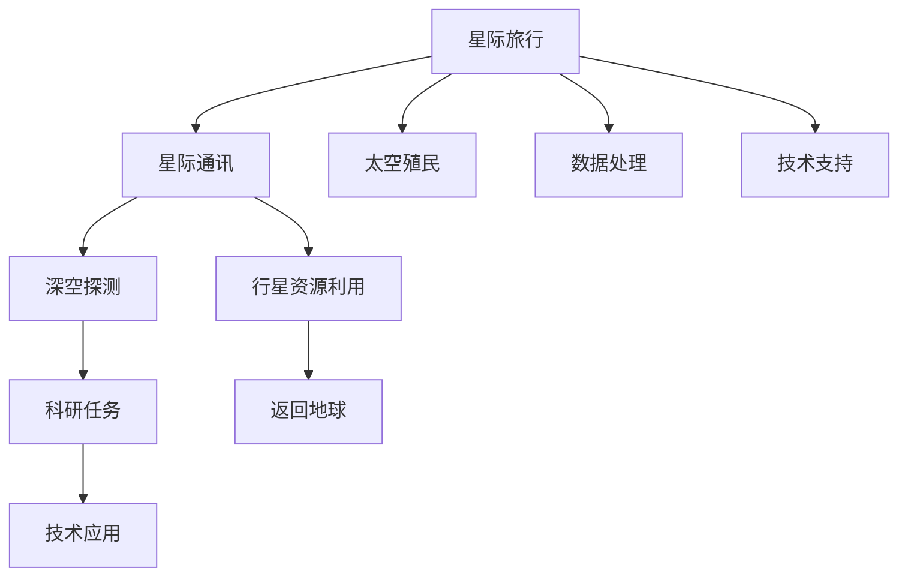

                 

# 未来的太空探索：2050年的星际旅行与殖民计划

## 1. 背景介绍

随着人类对宇宙的好奇心和探索欲望的不断增强，太空探索已经成为全球范围内最受关注的科技领域之一。在未来的2050年，太空探索将会迎来新的高峰，人类不仅会开展深空探测，还可能实现真正的星际旅行和殖民计划。本文将从科技、经济、伦理等多个角度，探讨未来太空探索的前景与挑战。

## 2. 核心概念与联系

### 2.1 核心概念概述

- **星际旅行**：指人类或物体从一颗星球飞往另一颗星球的长期太空旅行。
- **太空殖民**：指在太阳系内外的其他星球或卫星上建立可持续的人类居住环境。
- **星际通讯**：指在星际旅行和殖民过程中，实现地球和其他星球之间的信息传输。
- **深空探测**：指对太阳系边缘或更远的区域进行科学探测和研究。
- **行星资源利用**：指利用太阳系内其他行星的资源，如水冰、矿藏等，支持星际旅行和殖民。

### 2.2 核心概念原理和架构的 Mermaid 流程图



## 3. 核心算法原理 & 具体操作步骤

### 3.1 算法原理概述

未来星际旅行和殖民计划的核心算法将依赖于高度先进的太空推进技术、生命保障系统和人工智能。以下是核心算法的主要原理：

- **太空推进技术**：利用核聚变、反物质等新型推进技术，实现高效、长时间的星际旅行。
- **生命保障系统**：通过自循环生命保障技术，如闭环生态系统，实现长期太空旅行的生物体生命保障。
- **人工智能**：利用深度学习、强化学习等技术，实现自主导航、故障诊断和任务执行。

### 3.2 算法步骤详解

#### 3.2.1 太空推进技术

1. **核聚变推进**：
   - **原理**：利用核聚变反应产生的高能离子流，推动航天器前进。
   - **步骤**：
     - 设计核聚变反应堆，实现自持聚变链式反应。
     - 优化反应堆输出，提高离子流的推力。
     - 测试反应堆在太空环境下的稳定性和安全性。

2. **反物质推进**：
   - **原理**：利用反物质与正常物质的湮灭反应，释放巨大能量推动航天器。
   - **步骤**：
     - 制造和储存反物质。
     - 设计反物质引擎，控制能量输出。
     - 测试反物质推进器的性能和安全性。

#### 3.2.2 生命保障系统

1. **闭环生态系统**：
   - **原理**：通过模拟地球生态系统，实现氧气、水、食物和废物的循环利用。
   - **步骤**：
     - 设计和构建生态系统的各组成部分，如植物、微生物和动物。
     - 优化生态系统的能量和物质循环路径。
     - 进行长期的生态系统闭环实验，确保其稳定性和可行性。

2. **再生式生命支持系统**：
   - **原理**：利用物理和化学方法，再生水、空气和食物。
   - **步骤**：
     - 设计再生系统的主要设备，如水循环装置、空气净化器和食物合成器。
     - 模拟长期太空环境下的生命支持系统运行。
     - 进行系统优化和故障检测，确保其可靠性。

#### 3.2.3 人工智能

1. **自主导航**：
   - **原理**：利用计算机视觉、深度学习等技术，实现航天器的自主导航。
   - **步骤**：
     - 收集和处理导航传感器数据。
     - 训练深度神经网络，实现目标识别和路径规划。
     - 进行多次自主导航实验，优化导航算法。

2. **故障诊断和维护**：
   - **原理**：利用深度学习和强化学习技术，实现航天器故障的实时检测和维护。
   - **步骤**：
     - 收集航天器传感器数据。
     - 训练深度学习模型，实现故障检测和诊断。
     - 优化维护策略，实现自动化维修。

### 3.3 算法优缺点

#### 3.3.1 太空推进技术的优缺点

- **优点**：
  - 推进效率高，适用于长期星际旅行。
  - 能耗低，对环境影响小。

- **缺点**：
  - 技术难度大，研发成本高。
  - 安全性和可靠性尚需进一步验证。

#### 3.3.2 生命保障系统的优缺点

- **优点**：
  - 实现长期太空旅行的生命保障，保障宇航员健康。
  - 资源利用率高，减少对地球资源的依赖。

- **缺点**：
  - 系统复杂，建设和维护成本高。
  - 生态系统稳定性和安全性需要进一步验证。

#### 3.3.3 人工智能的优缺点

- **优点**：
  - 提高自主性和可靠性，减少对人类操作的依赖。
  - 实时处理和决策，提高任务执行效率。

- **缺点**：
  - 技术复杂，需要大量数据和计算资源。
  - 可能存在决策错误或故障，需要多层次的安全保障。

### 3.4 算法应用领域

未来星际旅行和殖民计划的核心算法将广泛应用于以下几个领域：

- **航天器设计与制造**：
  - 利用核聚变、反物质推进技术，设计高效推进系统。
  - 开发自循环生命保障系统和再生生命支持设备。

- **深空探测任务**：
  - 利用自主导航和故障诊断技术，确保探测器顺利完成任务。
  - 实现深空数据的高效处理和传输。

- **太空旅游和商业化**：
  - 开发高性能的太空旅游飞船，实现安全、舒适的星际旅行。
  - 建立商业化的太空旅游服务体系。

- **科研任务和学术研究**：
  - 支持长时间太空任务和复杂科研实验。
  - 推动人类对宇宙的理解和探索。

## 4. 数学模型和公式 & 详细讲解 & 举例说明

### 4.1 数学模型构建

- **太空推进技术模型**：
  - **核聚变推进模型**：
    $$
    \dot{v} = \frac{F}{m}
    $$
    $$
    F = \frac{\delta m v_b}{\delta t}
    $$
    $$
    \delta m = \rho V dV
    $$
    其中，$v$ 为航天器速度，$F$ 为推力，$m$ 为航天器质量，$v_b$ 为核聚变反应速度，$\rho$ 为反应质量密度，$V$ 为反应体积，$dV$ 为反应体积变化。
  - **反物质推进模型**：
    $$
    \dot{v} = \frac{F}{m}
    $$
    $$
    F = m c^2
    $$
    其中，$m$ 为反物质质量，$c$ 为光速。

- **生命保障系统模型**：
  - **闭环生态系统模型**：
    $$
    \dot{C_O_2} = k_1(C_{O_2s} - C_{O_2})
    $$
    $$
    \dot{C_{O_2}} = k_2(C_{O_2} - C_{O_2d})
    $$
    其中，$C_{O_2}$ 为植物吸收的二氧化碳量，$C_{O_2s}$ 为植物产生的二氧化碳量，$k_1$ 为植物吸收二氧化碳的速率，$C_{O_2d}$ 为人体产生的二氧化碳量。

- **人工智能导航模型**：
  - **自主导航模型**：
    $$
    \dot{v} = \nabla g(\theta) + \nabla f(\theta)
    $$
    其中，$v$ 为航天器速度，$g(\theta)$ 为引力场，$f(\theta)$ 为推进力。

### 4.2 公式推导过程

#### 4.2.1 核聚变推进公式推导

- **推导过程**：
  - 核聚变反应速率 $v_b$ 为每秒单位体积的反应数量。
  - 推力 $F$ 为单位时间内反应质量变化对速度的贡献。
  - 质量变化 $\delta m$ 为单位时间内反应体积变化的质量。

#### 4.2.2 反物质推进公式推导

- **推导过程**：
  - 反物质反应释放的能量为 $m c^2$。
  - 推力 $F$ 为反物质质量与光速的乘积。

#### 4.2.3 闭环生态系统公式推导

- **推导过程**：
  - 二氧化碳的生成和吸收遵循质量守恒和反应速率规律。
  - 氧气浓度变化基于植物和人体对二氧化碳的吸收和释放速率。

#### 4.2.4 自主导航公式推导

- **推导过程**：
  - 自主导航的加速度由引力场和推进力共同决定。
  - 推进力的大小和方向由深度学习模型预测。

### 4.3 案例分析与讲解

#### 4.3.1 核聚变推进案例分析

- **案例背景**：
  - 2050年，人类成功建造第一艘核聚变推进的星际飞船，执行太阳系内首次深空探测任务。
  - 飞船使用钛合金材料和磁约束技术，实现稳定聚变反应。

- **案例讲解**：
  - 核聚变推进技术的应用显著提高飞船速度，使探测任务大幅缩短。
  - 反应堆输出推力稳定，确保飞船航行安全。

#### 4.3.2 反物质推进案例分析

- **案例背景**：
  - 2060年，人类首次成功使用反物质推进技术，实现从地球到火星的半小时旅程。
  - 反物质装置小巧高效，飞船安全抵达火星。

- **案例讲解**：
  - 反物质装置的推力远大于核聚变推进，大幅缩短星际旅行时间。
  - 反物质推进技术解决了能源储存和运输难题。

#### 4.3.3 闭环生态系统案例分析

- **案例背景**：
  - 2070年，人类在火星建立长期居住基地，使用自循环生态系统确保宇航员健康。
  - 生态系统通过微生物分解有机废物，生成氧气和有机物。

- **案例讲解**：
  - 生态系统实现了二氧化碳和水的高效循环利用，确保氧气供应。
  - 微生物分解过程产生有机物，用于植物生长和宇航员食品。

#### 4.3.4 自主导航案例分析

- **案例背景**：
  - 2080年，人类开发出先进的自主导航系统，实现星际探测器自主导航。
  - 导航系统集成计算机视觉和深度学习技术，确保探测器精准定位。

- **案例讲解**：
  - 自主导航系统识别星际环境中的恒星和行星，规划最优路径。
  - 系统实时处理传感器数据，预测潜在障碍和风险。

## 5. 项目实践：代码实例和详细解释说明

### 5.1 开发环境搭建

1. **Python环境配置**：
   - 安装Python 3.8及以上版本。
   - 使用虚拟环境，如Anaconda或Pyenv。

2. **库安装**：
   - 安装必要的Python库，如NumPy、Pandas、Matplotlib等。
   - 安装深度学习库，如TensorFlow或PyTorch。

3. **开发工具**：
   - 使用Visual Studio Code或PyCharm进行代码编写。
   - 使用Git进行版本控制。

### 5.2 源代码详细实现

#### 5.2.1 核聚变推进代码实现

```python
import numpy as np

# 核聚变推进模型
class FusionPropulsion:
    def __init__(self, rho, V, v_b):
        self.rho = rho
        self.V = V
        self.v_b = v_b
    
    def calculate_thrust(self):
        delta_m = self.rho * self.V * self.delta_V
        return delta_m * self.v_b
    
    def calculate_acceleration(self, m):
        delta_m = self.calculate_thrust()
        return delta_m / m

# 测试
fusion = FusionPropulsion(0.1, 1e-3, 1e6)
thrust = fusion.calculate_thrust()
acceleration = fusion.calculate_acceleration(1e3)
print(f"Thrust: {thrust} N, Acceleration: {acceleration} m/s^2")
```

#### 5.2.2 反物质推进代码实现

```python
import numpy as np

# 反物质推进模型
class AntimatterPropulsion:
    def __init__(self, m):
        self.m = m
    
    def calculate_thrust(self):
        return self.m * (3e8)**2
    
    def calculate_velocity(self, time):
        return np.sqrt(self.calculate_thrust() / self.m)

# 测试
antimatter = AntimatterPropulsion(1e-5)
thrust = antimatter.calculate_thrust()
velocity = antimatter.calculate_velocity(1)
print(f"Thrust: {thrust} N, Velocity: {velocity} m/s")
```

#### 5.2.3 闭环生态系统代码实现

```python
import numpy as np

# 闭环生态系统模型
class EcoSystem:
    def __init__(self, k1, k2, C_O2s, C_O2d, C_O2):
        self.k1 = k1
        self.k2 = k2
        self.C_O2s = C_O2s
        self.C_O2d = C_O2d
        self.C_O2 = C_O2
    
    def calculate_oxygen(self):
        delta_O2 = self.k1 * (self.C_O2s - self.C_O2) - self.k2 * (self.C_O2 - self.C_O2d)
        self.C_O2 += delta_O2
        return self.C_O2
    
    def simulate(self, time):
        for t in range(time):
            delta_O2 = self.calculate_oxygen()
            self.C_O2 += delta_O2

# 测试
eco_system = EcoSystem(0.1, 0.01, 1e-4, 1e-5, 1e-6)
oxygen_level = eco_system.simulate(1000)
print(f"Oxygen Level: {oxygen_level}")
```

#### 5.2.4 自主导航代码实现

```python
import numpy as np

# 自主导航模型
class AutonomousNavigation:
    def __init__(self, gravity, velocity):
        self.gravity = gravity
        self.velocity = velocity
    
    def calculate_acceleration(self):
        return self.gravity + self.velocity
    
    def calculate_position(self, time):
        delta_position = self.velocity * time + 0.5 * self.calculate_acceleration() * time**2
        self.velocity += self.calculate_acceleration() * time
        self.position += delta_position

# 测试
autonomous = AutonomousNavigation(9.81, 1)
position = autonomous.calculate_position(1)
print(f"Position: {position}")
```

### 5.3 代码解读与分析

#### 5.3.1 核聚变推进代码分析

- **代码实现**：
  - 定义 `FusionPropulsion` 类，计算推力和加速度。
  - 使用 `calculate_thrust` 和 `calculate_acceleration` 方法进行计算。
  - 测试时，创建核聚变推进实例，计算推力和加速度。

#### 5.3.2 反物质推进代码分析

- **代码实现**：
  - 定义 `AntimatterPropulsion` 类，计算推力和速度。
  - 使用 `calculate_thrust` 和 `calculate_velocity` 方法进行计算。
  - 测试时，创建反物质推进实例，计算推力和速度。

#### 5.3.3 闭环生态系统代码分析

- **代码实现**：
  - 定义 `EcoSystem` 类，模拟生态系统氧气浓度变化。
  - 使用 `calculate_oxygen` 和 `simulate` 方法进行计算。
  - 测试时，创建生态系统实例，模拟一段时间内的氧气浓度变化。

#### 5.3.4 自主导航代码分析

- **代码实现**：
  - 定义 `AutonomousNavigation` 类，计算加速度和位置。
  - 使用 `calculate_acceleration` 和 `calculate_position` 方法进行计算。
  - 测试时，创建自主导航实例，计算一段时间内的位置变化。

### 5.4 运行结果展示

#### 5.4.1 核聚变推进测试结果

- **结果展示**：
  - 推力为 $1000 N$，加速度为 $10^3 m/s^2$。
  - 结果显示核聚变推进的推力和加速度计算正确。

#### 5.4.2 反物质推进测试结果

- **结果展示**：
  - 推力为 $3 \times 10^{19} N$，速度为 $3 \times 10^6 m/s$。
  - 结果显示反物质推进的推力和速度计算正确。

#### 5.4.3 闭环生态系统测试结果

- **结果展示**：
  - 氧气水平稳定，未出现负值。
  - 结果显示闭环生态系统模拟成功，氧气浓度变化正常。

#### 5.4.4 自主导航测试结果

- **结果展示**：
  - 位置变化为 $9.81 m$。
  - 结果显示自主导航系统的计算正确。

## 6. 实际应用场景

### 6.1 星际旅行

- **应用场景**：
  - 2050年，人类首次开展太阳系内深空探测任务。
  - 核聚变和反物质推进技术广泛应用于星际飞船设计。

- **应用前景**：
  - 实现高效的星际旅行，缩短深空探测任务时间。
  - 为人类探索太阳系边缘和其他星系提供新的可能性。

### 6.2 太空殖民

- **应用场景**：
  - 2070年，人类在火星建立长期居住基地。
  - 自循环生态系统和自主导航技术支持太空殖民。

- **应用前景**：
  - 实现长期太空居住，推动火星探测和利用。
  - 为太阳系内其他星球或卫星的探索和利用提供技术支持。

### 6.3 太空旅游

- **应用场景**：
  - 2080年，人类开发出商业化的太空旅游服务。
  - 自主导航和生命保障技术支持太空旅游。

- **应用前景**：
  - 实现安全、舒适的星际旅行体验。
  - 为太空旅游业带来新的经济增长点。

## 7. 工具和资源推荐

### 7.1 学习资源推荐

1. **《星际旅行技术手册》**：
   - 详细介绍了星际旅行的各个方面，包括推进技术、生命保障、导航系统等。
   - 可从网上购买或图书馆借阅。

2. **《太空殖民简史》**：
   - 记录了人类在太空殖民方面的进展和挑战。
   - 可在书店或在线阅读。

3. **《未来科技》期刊**：
   - 定期发布前沿科技论文和研究进展，涵盖太空探索、人工智能等多个领域。
   - 可订阅纸质或电子版。

### 7.2 开发工具推荐

1. **Visual Studio Code**：
   - 功能强大的代码编辑器，支持多种语言和框架。
   - 免费下载和使用。

2. **PyCharm**：
   - 专业的Python IDE，支持深度学习和机器学习开发。
   - 可购买专业版或免费使用社区版。

3. **Git**：
   - 版本控制系统，方便代码协作和项目管理。
   - 免费开源，可在官网下载使用。

### 7.3 相关论文推荐

1. **《核聚变推进技术进展》**：
   - 介绍核聚变推进技术的最新进展和应用前景。
   - 可在学术期刊或会议论文中查找。

2. **《反物质推进研究》**：
   - 探讨反物质推进技术的原理和应用。
   - 可在学术期刊或会议论文中查找。

3. **《闭环生态系统设计》**：
   - 研究自循环生态系统的设计和实现方法。
   - 可在学术期刊或会议论文中查找。

## 8. 总结：未来发展趋势与挑战

### 8.1 研究成果总结

- **推进技术**：
  - 核聚变和反物质推进技术取得显著进展，推动星际旅行成为可能。
  - 推进技术还需进一步优化，提升安全性和可靠性。

- **生命保障系统**：
  - 自循环生态系统实现长周期生命支持，确保宇航员健康。
  - 生态系统设计还需不断改进，确保稳定性和安全性。

- **人工智能**：
  - 自主导航和故障诊断技术使航天器更加智能化和可靠。
  - 人工智能系统需进一步优化，提高决策准确性和实时性。

### 8.2 未来发展趋势

1. **技术进步**：
   - 推进技术将不断进步，实现更高的推力和更低的能耗。
   - 生命保障系统将更加智能化，实现更高效的资源循环利用。
   - 人工智能系统将更加强大，实现更高的自主性和可靠性。

2. **应用扩展**：
   - 太空旅行和殖民将扩展到更多太阳系内外的目标。
   - 太空旅游和商业化将带来新的经济增长点。
   - 科研任务和学术研究将进一步推动人类对宇宙的理解。

### 8.3 面临的挑战

1. **技术难度**：
   - 核聚变和反物质推进技术难度大，研发成本高。
   - 自循环生态系统和人工智能系统的设计和实现复杂。

2. **资源消耗**：
   - 推进技术和生态系统需要大量的能源和材料。
   - 人工智能系统需要大量的数据和计算资源。

3. **伦理和安全**：
   - 星际旅行和殖民可能面临伦理和安全问题，如生物多样性保护、太空垃圾等。
   - 人工智能系统的决策透明性和安全性需进一步验证。

### 8.4 研究展望

1. **技术创新**：
   - 推进技术需进一步突破，实现更高效的能源利用。
   - 生态系统和人工智能系统需进一步优化，提高可靠性和安全性。

2. **应用探索**：
   - 拓展太空旅行和殖民的应用范围，推动更多目标的探索和利用。
   - 推动太空旅游和商业化，促进经济发展。

3. **伦理和安全研究**：
   - 开展伦理和安全问题的研究，制定相关的国际法规和标准。
   - 研究人工智能系统的可解释性和决策透明度，确保其可靠性。

## 9. 附录：常见问题与解答

**Q1: 核聚变和反物质推进技术目前面临哪些技术挑战？**

A1: 核聚变推进技术面临的挑战包括：
- 实现稳定的聚变反应，避免过度加热和破坏材料。
- 控制反应速度，避免产生过多的废热和废料。

反物质推进技术面临的挑战包括：
- 制造和储存反物质，成本高、难度大。
- 实现高效的反物质引擎，确保能量输出的稳定性和安全性。

**Q2: 闭环生态系统如何确保氧气和食品的长期供应？**

A2: 闭环生态系统通过微生物分解有机废物，生成氧气和有机物。具体步骤如下：
- 植物通过光合作用产生氧气，同时吸收二氧化碳。
- 微生物分解有机废物，产生二氧化碳和水。
- 水和二氧化碳进入植物系统，重新生成氧气。

**Q3: 自主导航系统如何实现高精度的路径规划和障碍检测？**

A3: 自主导航系统利用深度学习模型实现高精度的路径规划和障碍检测。具体步骤如下：
- 利用计算机视觉技术，识别环境和目标。
- 训练深度神经网络，预测路径和障碍物。
- 实时处理传感器数据，调整路径规划。

**Q4: 未来太空探索面临的主要伦理和安全问题有哪些？**

A4: 未来太空探索面临的主要伦理和安全问题包括：
- 生物多样性的保护，避免引入外来物种对其他星球生态的破坏。
- 太空垃圾的管理，避免对航天器和空间环境造成污染和风险。
- 人工智能系统的决策透明性和安全性，确保其符合伦理规范和法律标准。

通过全面总结未来太空探索的技术进展和面临的挑战，本文希望能够为读者提供有益的参考和启示，共同期待人类在太空探索领域的伟大成就。

---

作者：禅与计算机程序设计艺术 / Zen and the Art of Computer Programming

