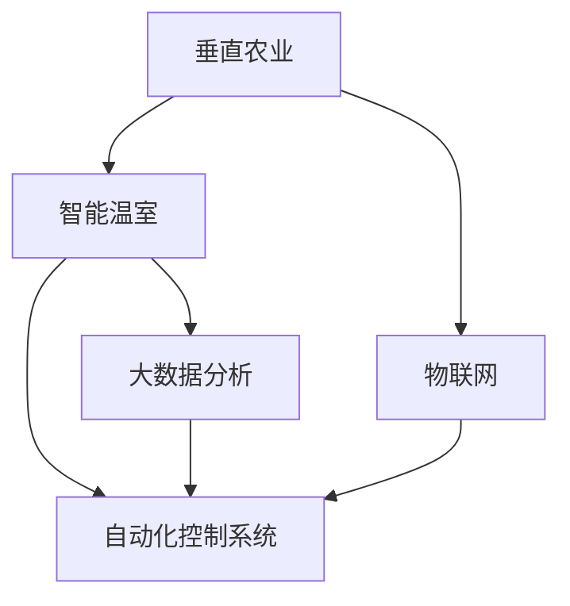

                 

## 1. 背景介绍

### 1.1 问题由来
在21世纪末，地球的人口规模已突破90亿，并且预计将持续增长。随着全球气候变化和资源的日益短缺，农业面临前所未有的挑战，如何在有限的土地和水资源上满足日益增长的人口需求，成为了世界各国亟待解决的重大问题。垂直农业与智能温室技术的崛起，为应对这些挑战提供了一种全新的解决思路。

### 1.2 问题核心关键点
垂直农业与智能温室技术的核心在于利用先进的信息技术，构建一个高效、可持续的农业生产系统。该系统通过智能化控制环境参数（如光照、温度、湿度、土壤含水量等）和自动化种植管理，实现高产、低能耗、环境友好的高效农业生产。

该技术融合了物联网(IoT)、大数据、人工智能(AI)、自动化控制系统等多项技术，能够实时监测作物生长状态，预测病虫害风险，自动调节种植环境，显著提高农业生产的效率和质量。

### 1.3 问题研究意义
垂直农业与智能温室技术具有以下重要意义：

1. **提高农业生产效率**：通过精准控制环境参数，显著提高作物的生长速度和产量，提升农业生产效率。
2. **减少资源消耗**：自动化控制系统可以优化资源使用，减少化肥、水资源、能源等投入，降低农业生产对环境的压力。
3. **应对气候变化**：该技术可以在极端气候条件下保持稳定的作物生产，帮助农业抵御气候变化的影响。
4. **促进可持续发展**：垂直农业与智能温室通过提高资源利用效率，减少环境污染，推动农业可持续发展。

## 2. 核心概念与联系

### 2.1 核心概念概述

本节将介绍几个密切相关的核心概念：

- **垂直农业(Vertical Farming)**：指在高层建筑内部或室内空间利用垂直层叠方式进行作物种植的农业生产方式。这种生产方式能够高效利用空间，适合在城市中实现。
- **智能温室(Smart Greenhouse)**：指利用物联网技术、自动化控制系统和传感器对温室环境进行实时监测和自动调节，实现高效、精确的作物种植管理。
- **自动化控制系统(Autonomous Control System)**：指基于传感器数据和AI算法，自动控制温室环境参数的系统，确保作物最佳生长状态。
- **物联网(IoT)**：指通过互联网连接传感器、控制器等设备，实现数据的实时传输和处理，提升生产效率和精准度。
- **大数据分析(Big Data Analysis)**：指对海量农业数据进行收集、存储、分析和可视化，发现规律和趋势，指导农业生产决策。

这些核心概念之间的逻辑关系可以通过以下Mermaid流程图来展示：



这个流程图展示了几者之间的逻辑关系：

1. 垂直农业是智能温室的具体实现方式之一，通过垂直层叠利用空间。
2. 物联网提供实时监测和数据传输的能力，是大数据分析和自动化控制系统的重要基础。
3. 自动化控制系统基于物联网数据和人工智能算法，自动调节环境参数。
4. 大数据分析基于物联网和自动化控制系统提供的数据，进行深入分析和决策支持。

## 3. 核心算法原理 & 具体操作步骤

### 3.1 算法原理概述

垂直农业与智能温室技术涉及的核心算法主要包括：

- **环境感知与数据采集**：利用传感器实时监测温室内的环境参数，包括温度、湿度、光照、二氧化碳浓度等。
- **数据分析与预测**：对采集到的数据进行分析，建立作物生长模型，预测作物生长状态和病虫害风险。
- **环境控制**：根据模型预测结果，自动调节温室环境参数，如光照、温度、湿度、灌溉等。
- **智能决策**：通过分析历史数据和实时监测结果，进行生产决策和优化，如施肥、浇水、病虫害防治等。

### 3.2 算法步骤详解

基于垂直农业与智能温室的算法流程大致如下：

1. **环境感知与数据采集**：部署传感器网络，实时监测温室内的环境参数。

2. **数据分析与预测**：对采集到的数据进行清洗、存储和分析，建立作物生长模型，预测作物生长状态和病虫害风险。

3. **环境控制**：根据模型预测结果，自动调节温室环境参数，如光照、温度、湿度、灌溉等。

4. **智能决策**：通过分析历史数据和实时监测结果，进行生产决策和优化，如施肥、浇水、病虫害防治等。

### 3.3 算法优缺点

垂直农业与智能温室技术具有以下优点：

1. **高效利用空间**：垂直层叠种植方式显著提高了空间利用率，能够在有限的空间内实现高产量。
2. **环境友好**：自动化控制系统能够优化资源使用，减少化肥、水资源、能源等投入，降低农业生产对环境的压力。
3. **智能化管理**：实时监测和智能决策使得农业生产更加高效、精准，提升了生产效率和质量。

同时，该技术也存在一定的局限性：

1. **初期投资高**：垂直农业与智能温室的建设需要高昂的初始投资，包括设备购置、系统集成等。
2. **技术复杂**：需要复杂的技术体系支持，包括传感器、控制系统、AI算法等，技术门槛较高。
3. **数据处理量大**：实时监测和分析大量的环境数据，对数据存储和处理能力要求较高。

### 3.4 算法应用领域

垂直农业与智能温室技术在多个领域具有广泛的应用前景，包括但不限于：

- **城市农业(Urban Agriculture)**：在城市高层建筑中实现垂直种植，缓解城市食品供应问题，提高土地利用率。
- **精准农业(Precision Agriculture)**：通过精准控制环境参数，实现高效、环保的农业生产。
- **灾害防治**：实时监测和预警气候变化、病虫害风险，保护农作物不受损害。
- **教育与科研**：建立农业教学与科研平台，推动农业科技的发展。

## 4. 数学模型和公式 & 详细讲解 & 举例说明

### 4.1 数学模型构建

本节将使用数学语言对垂直农业与智能温室技术进行更加严格的刻画。

假设智能温室的环境参数为 $x_1, x_2, \ldots, x_n$，其中 $x_i$ 表示第 $i$ 个环境参数（如温度、湿度、光照等）。定义环境控制目标为 $y$，如作物生长状态、产量、病虫害风险等。则数学模型可以表示为：

$$
y = f(x_1, x_2, \ldots, x_n)
$$

其中 $f$ 为作物生长模型，将环境参数映射到目标变量 $y$。

### 4.2 公式推导过程

以温度控制为例，假设模型预测目标为作物最佳生长温度 $T_{\text{opt}}$，则模型可以表示为：

$$
T_{\text{opt}} = g(T_0, C_1, C_2, \ldots, C_k)
$$

其中 $T_0$ 为初始温度，$C_1, C_2, \ldots, C_k$ 为历史数据和实时监测数据（如日温差、夜间温度、光合作用参数等）。假设 $g$ 为温度控制模型，通过机器学习算法（如回归、神经网络等）拟合得到。

实际应用中，可以结合多个环境参数进行综合控制，例如：

$$
y = h(T_{\text{opt}}, L_{\text{opt}}, H_{\text{opt}}, W_{\text{opt}}, \ldots)
$$

其中 $L_{\text{opt}}, H_{\text{opt}}, W_{\text{opt}}$ 分别表示最佳光照、湿度和水分控制。

### 4.3 案例分析与讲解

假设某智能温室需要控制温度、湿度、光照等参数，以优化番茄的产量和质量。首先通过传感器网络实时监测环境参数，然后使用机器学习算法建立温度控制模型，并结合其他参数进行综合控制。例如，如果当前温度偏低，算法会预测最优温度并自动开启加热系统，同时调整光照强度和湿度，以确保番茄的最佳生长环境。

## 5. 项目实践：代码实例和详细解释说明

### 5.1 开发环境搭建

在进行垂直农业与智能温室的实践前，我们需要准备好开发环境。以下是使用Python进行物联网开发的环境配置流程：

1. 安装Anaconda：从官网下载并安装Anaconda，用于创建独立的Python环境。

2. 创建并激活虚拟环境：
```bash
conda create -n pyiot-env python=3.8 
conda activate pyiot-env
```

3. 安装IoT相关的库：
```bash
pip install paho-mqtt pyserial pywifi rpi-gpio 
```

4. 安装传感器模块：
```bash
pip install environmental-sensor
```

5. 安装数据分析和机器学习库：
```bash
pip install pandas numpy scikit-learn tensorflow pytorch
```

6. 安装物联网设备（如树莓派）并配置：
```bash
sudo raspi-config
```

7. 安装物联网协议栈：
```bash
sudo apt-get install libcurl3-dev libssl-dev liblua5.2-dev
```

完成上述步骤后，即可在`pyiot-env`环境中开始物联网开发。

### 5.2 源代码详细实现

下面以树莓派为物联网设备，通过IoT网关连接环境传感器为例，给出物联网代码实现。

```python
import paho.mqtt.client as mqtt
import json
import time
import environmental_sensor

# 初始化MQTT客户端
client = mqtt.Client()
client.connect("iot.gateway.com", 1883, 60)

# 订阅环境数据
client.subscribe("sensor/data")

# 接收环境数据
def on_message(client, userdata, message):
    data = json.loads(message.payload)
    env_data = data['env_data']
    temperature = env_data['temperature']
    humidity = env_data['humidity']
    light_intensity = env_data['light_intensity']
    
    # 根据环境数据进行温度控制
    temperature_opt = control_temperature(temperature)
    if temperature_opt != temperature:
        client.publish("control/temperature", json.dumps({'target_temperature': temperature_opt}))
        
    # 发布环境数据
    client.publish("env/sensor", json.dumps({'temperature': temperature_opt, 'humidity': humidity, 'light_intensity': light_intensity}))

# 订阅控制命令
client.subscribe("control/command")

# 接收控制命令
def on_control_command(client, userdata, message):
    command = json.loads(message.payload)
    if command['command'] == 'start_irrigation':
        client.publish("irrigation/command", 'start')
    elif command['command'] == 'stop_irrigation':
        client.publish("irrigation/command", 'stop')

# 控制灌溉系统
def control_irrigation(command):
    if command == 'start':
        irrigation = environmental_sensor.Irrigation()
        irrigation.start_irrigation()
    elif command == 'stop':
        irrigation = environmental_sensor.Irrigation()
        irrigation.stop_irrigation()

# 启动MQTT客户端
client.on_message = on_message
client.on_control_command = on_control_command
client.loop_start()

# 模拟环境控制
def control_temperature(temperature):
    # 根据温度控制模型返回最优温度
    return temperature_opt
    
def control_humidity(humidity):
    # 根据湿度控制模型返回最优湿度
    return humidity_opt
    
def control_light_intensity(light_intensity):
    # 根据光照控制模型返回最优光照强度
    return light_intensity_opt
    
# 启动环境控制
def main():
    while True:
        temperature_opt = control_temperature(temperature)
        humidity_opt = control_humidity(humidity)
        light_intensity_opt = control_light_intensity(light_intensity)
        
        # 发布环境控制数据
        client.publish("env/control", json.dumps({'target_temperature': temperature_opt, 'target_humidity': humidity_opt, 'target_light_intensity': light_intensity_opt}))
        
        # 更新环境数据
        environmental_sensor.update_env_data()
        
        # 控制灌溉系统
        control_irrigation('start')
        
        time.sleep(60)

if __name__ == '__main__':
    main()
```

### 5.3 代码解读与分析

让我们再详细解读一下关键代码的实现细节：

**传感器模块**：
- 使用 `environmental_sensor` 模块模拟环境传感器，获取实时环境数据。

**MQTT客户端**：
- 通过 `paho-mqtt` 模块连接物联网网关，订阅环境数据和控制命令。
- 在 `on_message` 方法中解析接收到的环境数据，并根据模型预测结果，自动控制环境参数。
- 在 `on_control_command` 方法中解析接收到的控制命令，并执行相应的环境控制操作。

**环境控制函数**：
- 根据环境数据调用不同的控制函数，控制温度、湿度、光照等参数。
- 通过 `client.publish` 方法将环境控制数据发送给物联网网关。

**环境控制模拟**：
- 模拟环境控制函数，根据环境数据返回最优控制参数。
- 定期更新环境数据，并发布控制数据到物联网网关。

通过以上代码实现，可以看到，物联网技术和大数据分析在垂直农业与智能温室中的应用，可以实时监测环境参数，并自动控制优化，从而实现高效、精准的农业生产。

## 6. 实际应用场景

### 6.1 智能温室

智能温室是垂直农业与智能温室技术的典型应用场景之一。通过部署传感器和控制系统，智能温室可以实现对温室环境的自动化管理。例如，在番茄种植中，可以通过传感器实时监测温度、湿度、光照等参数，通过控制系统自动调节环境参数，优化番茄的生长条件，提高产量和质量。

### 6.2 城市农业

城市农业通过垂直农业技术，在城市高层建筑中实现高效种植。例如，在美国纽约市，通过垂直农业技术，可以在一栋大楼中种植数千吨蔬菜，大大提升了城市食品供应能力，同时降低了对环境的压力。

### 6.3 精准农业

精准农业利用垂直农业与智能温室技术，实现高精度农业生产。例如，在美国爱荷华州，通过精准农业技术，可以在一英亩的土地上种植600株玉米，比传统农业提高了近200%的产量。

### 6.4 未来应用展望

随着垂直农业与智能温室技术的不断发展，未来将呈现以下几个发展趋势：

1. **智能化水平提升**：随着AI和IoT技术的进一步发展，智能温室的智能化水平将显著提升，实现更加精准、高效的生产管理。
2. **多样化应用场景**：垂直农业与智能温室技术将应用到更多领域，如家庭园艺、航空农业等，满足不同场景的农业需求。
3. **绿色能源应用**：智能温室将采用更多的绿色能源，如太阳能、风能等，减少对化石能源的依赖。
4. **社会化协同生产**：智能温室将实现社会化协同生产，通过共享资源和数据，实现规模化、高效化的农业生产。

## 7. 工具和资源推荐

### 7.1 学习资源推荐

为了帮助开发者系统掌握垂直农业与智能温室技术的理论基础和实践技巧，这里推荐一些优质的学习资源：

1. **《垂直农业：未来食物生产新模式》**：介绍了垂直农业的基本原理、技术和应用，是入门垂直农业的好书。
2. **IoT Academy**：IoT领域的在线教育平台，提供大量关于IoT、智能农业的课程和项目，适合初学者和进阶开发者。
3. **Kaggle**：数据科学和机器学习竞赛平台，提供大量农业数据集和竞赛项目，有助于数据分析和机器学习技能的提升。
4. **Agriculture AI**：专注于农业AI的在线社区，提供最新研究和实践分享，交流前沿技术。
5. **Smart Agriculture**：垂直农业与智能温室技术的博客，涵盖技术、应用、案例等多个方面，是了解行业动态的好去处。

通过对这些资源的学习实践，相信你一定能够快速掌握垂直农业与智能温室技术的精髓，并用于解决实际的农业问题。

### 7.2 开发工具推荐

高效的开发离不开优秀的工具支持。以下是几款用于垂直农业与智能温室开发的常用工具：

1. **Raspberry Pi**：树莓派是常见的物联网开发平台，提供了丰富的传感器接口和计算能力。
2. **Arduino**：用于低成本传感器开发和数据采集，适合小型项目和教育应用。
3. **MQTT**：轻量级物联网协议，支持大规模的传感器网络和数据传输。
4. **TensorFlow**：谷歌推出的开源深度学习框架，适合复杂的数据分析和机器学习任务。
5. **Apache Kafka**：分布式数据流处理平台，适合高并发、大规模数据的采集和处理。
6. **IoT Gateway**：物联网网关，用于连接传感器和云平台，提供数据转发和控制功能。

合理利用这些工具，可以显著提升垂直农业与智能温室开发的效率，加快创新迭代的步伐。

### 7.3 相关论文推荐

垂直农业与智能温室技术的发展源于学界的持续研究。以下是几篇奠基性的相关论文，推荐阅读：

1. **The Future of Food**（展望未来）：由联合国粮农组织发布的报告，讨论了农业面临的挑战和未来发展方向。
2. **Vertical Farming: A Review**：综述了垂直农业的基本原理、技术和应用，是垂直农业领域的重要文献。
3. **Intelligent Agriculture System**：介绍了智能农业系统的设计和管理，涵盖了传感器、控制系统和数据分析等方面。
4. **IoT in Agriculture**：介绍了IoT在农业中的应用，包括传感器网络、数据传输和智能决策等方面。
5. **Machine Learning for Precision Agriculture**：讨论了机器学习在精准农业中的应用，如数据预测、模式识别等。

这些论文代表了大语言模型微调技术的发展脉络。通过学习这些前沿成果，可以帮助研究者把握学科前进方向，激发更多的创新灵感。

## 8. 总结：未来发展趋势与挑战

### 8.1 总结

本文对垂直农业与智能温室技术的背景、原理和应用进行了全面系统的介绍。首先阐述了垂直农业与智能温室技术的背景和重要性，明确了该技术在提升农业生产效率、减少资源消耗、应对气候变化等方面的价值。其次，从原理到实践，详细讲解了垂直农业与智能温室技术的算法流程和关键步骤，给出了物联网代码实现。同时，本文还探讨了该技术在智能温室、城市农业、精准农业等实际应用场景中的前景，展示了其巨大的应用潜力。最后，本文精选了垂直农业与智能温室技术的各类学习资源，力求为读者提供全方位的技术指引。

通过本文的系统梳理，可以看到，垂直农业与智能温室技术正在成为未来农业的重要发展方向，极大地提升了农业生产的智能化水平，为农业的可持续发展提供了新的解决方案。未来，伴随技术的不断进步，垂直农业与智能温室技术必将在更多领域大放异彩，推动农业生产方式的深刻变革。

### 8.2 未来发展趋势

展望未来，垂直农业与智能温室技术将呈现以下几个发展趋势：

1. **技术集成化**：垂直农业与智能温室技术将与其他前沿技术（如人工智能、机器人技术等）进一步集成，提升系统智能化水平。
2. **数据共享化**：不同智能温室之间的数据共享和协同生产，将提高农业生产效率和资源利用率。
3. **社会化协同**：基于IoT的智能温室将实现社会化协同生产，共享资源和数据，实现规模化、高效化的农业生产。
4. **绿色能源应用**：智能温室将采用更多的绿色能源，减少对化石能源的依赖，实现可持续发展。
5. **全产业链优化**：从农业生产、加工、物流到零售，形成全产业链的智能化管理，提升农业供应链的效率和质量。

以上趋势凸显了垂直农业与智能温室技术的广阔前景。这些方向的探索发展，必将进一步推动农业生产的智能化、高效化，为全球粮食安全和社会可持续发展做出重要贡献。

### 8.3 面临的挑战

尽管垂直农业与智能温室技术已经取得了显著成果，但在迈向更加智能化、普适化应用的过程中，它仍面临诸多挑战：

1. **高初始投资**：垂直农业与智能温室的建设需要高昂的初始投资，包括设备购置、系统集成等，是制约该技术大规模应用的重要因素。
2. **技术复杂性**：垂直农业与智能温室技术涉及传感器、控制系统、数据传输等多个方面，技术门槛较高，需要跨学科的专业知识。
3. **数据安全与隐私**：传感器网络和大数据应用涉及大量的用户隐私数据，需要建立严格的数据安全保障机制。
4. **环境适应性**：智能温室需要适应不同地域和气候条件，构建适应性强、鲁棒性高的系统。
5. **持续更新维护**：智能温室需要定期维护和更新，确保系统长期稳定运行。

正视垂直农业与智能温室技术面临的这些挑战，积极应对并寻求突破，将是大语言模型微调技术走向成熟的必由之路。相信随着学界和产业界的共同努力，这些挑战终将一一被克服，垂直农业与智能温室技术必将在构建人机协同的智能时代中扮演越来越重要的角色。

### 8.4 研究展望

面向未来，垂直农业与智能温室技术需要在以下几个方面进行深入研究：

1. **绿色能源技术**：研究新型绿色能源技术，如太阳能、风能等，提升智能温室的能源自给自足能力。
2. **智能化生产管理**：研究智能农业机器人和自动化设备，实现更高效、精准的农业生产管理。
3. **数据融合与共享**：研究多智能温室之间的数据融合与共享技术，提高农业生产效率和资源利用率。
4. **环境适应性**：研究智能温室在不同地域和气候条件下的适应性技术，构建更具适应性的系统。
5. **社会化协同**：研究智能温室的社会化协同生产技术，推动农业生产的规模化和高效化。

这些研究方向的研究突破，将进一步推动垂直农业与智能温室技术的成熟和应用，为农业生产方式的深刻变革提供重要支撑。总之，垂直农业与智能温室技术是未来农业发展的重要方向，需要各方共同努力，推动其技术的不断进步和应用推广。

## 9. 附录：常见问题与解答

**Q1：垂直农业与智能温室技术的投资回报周期有多长？**

A: 垂直农业与智能温室技术的投资回报周期因具体项目而异，但一般来说，3-5年内即可实现投资回收。通过优化环境控制、提高资源利用效率和降低生产成本，可以实现显著的效益提升。

**Q2：垂直农业与智能温室技术的维护成本高吗？**

A: 垂直农业与智能温室技术需要定期维护和更新，包括传感器校准、设备检修等，但总体维护成本相对较低。通过智能控制系统和大数据分析，可以大大减少人工维护的工作量。

**Q3：垂直农业与智能温室技术在极端气候条件下表现如何？**

A: 智能温室可以通过实时监测和环境控制，适应极端气候条件，确保作物稳定生长。例如，在高温高湿的气候条件下，智能温室可以自动调节通风和灌溉，减少作物病害风险。

**Q4：垂直农业与智能温室技术对环境友好吗？**

A: 垂直农业与智能温室技术通过优化资源使用和环境控制，显著减少了化肥、水资源、能源等消耗，降低了对环境的压力。同时，减少了病虫害和机械化操作，提高了生态系统的可持续性。

**Q5：垂直农业与智能温室技术对人力资源的需求有哪些？**

A: 垂直农业与智能温室技术提高了农业生产效率，减少了人力资源的需求。通过智能控制系统和大数据分析，可以自动完成大部分农业生产管理，降低了对人工操作的需求。

---

作者：禅与计算机程序设计艺术 / Zen and the Art of Computer Programming

