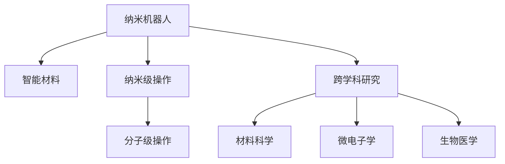

                 

## 1. 背景介绍

### 1.1 问题由来

纳米技术（Nanotechnology）作为一种前沿技术，正逐步深入到医疗、环保、制造、能源等领域，改变着人类的生产和生活方式。特别是纳米机器人（Nanorobots）与智能材料（Smart Materials），作为纳米技术的重要应用，正在颠覆我们对材料科学和工程领域的认知。

21世纪以来，随着纳米科学和技术的快速发展，纳米机器人和智能材料的研究不断取得突破，引领了新一轮科技革命。到2050年，这些技术将会进一步成熟，在医疗、环境保护、能源、交通等多个领域实现广泛应用，为人类社会带来翻天覆地的变化。

### 1.2 问题核心关键点

纳米技术以其独特的物理和化学特性，带来了革命性的变化。其中，纳米机器人的设计和制造，依赖于材料科学的突破；而智能材料的应用，则需要先进的制造技术和工程方法。

纳米机器人的核心在于“分子级”操作，能够实现生物医学、环保治理等领域的精确操作；智能材料则通过微观结构控制，赋予材料特定的功能，如自愈合、自清洁、自适应等特性。这些技术的发展，将极大提升我们控制和改变世界的能力。

### 1.3 问题研究意义

纳米技术作为21世纪最具潜力的前沿技术之一，其发展对人类社会的进步具有深远影响。

- **推动医疗健康**：纳米机器人在体内外应用，能够实现精确治疗、智能诊断等，提升医疗服务的质量和效率。
- **环境保护**：纳米技术在污水处理、空气净化、有害物处理等方面展现出巨大潜力，有助于改善人类生存环境。
- **新材料开发**：智能材料的发展将开辟新型材料应用领域，为建筑、制造等行业带来革命性变化。
- **能源优化**：纳米技术在太阳能电池、储能材料等方面的应用，有望显著提高能源利用效率，缓解能源危机。
- **交通交通**：纳米技术在汽车、航空、轨道交通等领域的应用，将提升运输效率和安全性，推动绿色交通发展。

## 2. 核心概念与联系

### 2.1 核心概念概述

为更好地理解纳米机器人和智能材料的原理和应用，本节将介绍几个核心概念：

- **纳米机器人**：以纳米级（1-100纳米）机器部件为基础，具备自主移动、操作能力的机器。可用于生物医疗、环境治理等复杂环境。
- **智能材料**：具有自愈合、自清洁、自适应等智能特性的材料，能够实现更加精准的性能控制和应用。
- **纳米级操作**：利用纳米技术进行分子级、原子级的操作，实现微观尺度的精准控制。
- **跨学科研究**：纳米技术需要化学、物理、生物、材料等多个学科的协同合作，涵盖材料科学、微电子学、生物医学等多个领域。

这些核心概念之间的逻辑关系可以通过以下Mermaid流程图来展示：



这个流程图展示了大语言模型的核心概念及其之间的关系：

1. 纳米机器人以纳米级操作为基础，具备自主移动、操作能力。
2. 智能材料具备自愈合、自清洁、自适应等特性，为纳米机器人的功能提供保障。
3. 跨学科研究需要化学、物理、生物、材料等多个学科的协同合作，涵盖材料科学、微电子学、生物医学等多个领域。

## 3. 核心算法原理 & 具体操作步骤
### 3.1 算法原理概述

纳米机器人和智能材料的研发，本质上是一种跨学科的工程实践。其核心算法原理包括以下几个方面：

- **分子模拟**：利用分子动力学、密度泛函理论等方法，模拟纳米机器人和智能材料的原子和分子级行为。
- **材料设计**：基于计算机辅助设计（CAD）、计算化学等方法，设计出具备特定功能的智能材料。
- **智能算法**：使用机器学习、深度学习等技术，优化纳米机器人和智能材料的设计和性能。
- **微加工技术**：利用电子束刻蚀、激光烧蚀、化学气相沉积（CVD）等微加工技术，实现纳米级结构的精确制造。

### 3.2 算法步骤详解

纳米机器人和智能材料的开发，一般包括以下关键步骤：

**Step 1: 理论基础研究**
- 选择适合的材料，进行分子动力学模拟，理解其物理和化学特性。
- 设计目标功能，如自愈合、自清洁、自适应等，通过计算化学模拟其反应机理。
- 确定纳米结构，利用分子模拟确定分子间相互作用，设计纳米级部件。

**Step 2: 原型制造**
- 使用电子束刻蚀、激光烧蚀、CVD等微加工技术，制造出纳米级结构。
- 通过自底向上的组装方法，构建纳米机器人的分子组件。
- 使用高温热处理、激光沉积等技术，优化纳米机器人和智能材料的性能。

**Step 3: 功能测试与优化**
- 将制造出的原型置于特定的环境中，进行性能测试。
- 利用机器学习算法，优化纳米机器人和智能材料的性能。
- 使用智能算法，控制纳米机器人和智能材料的移动和操作。

**Step 4: 应用部署**
- 将纳米机器人和智能材料应用于医疗、环保、制造、能源等领域。
- 利用远程监控和控制技术，实时调整其功能和行为。
- 持续收集应用数据，进行模型迭代优化。

### 3.3 算法优缺点

纳米机器人和智能材料的应用，具有以下优点：

1. **高效精准**：纳米机器人和智能材料可以实现分子级、原子级的精准操作和控制，提升效率和精度。
2. **多功能性**：具备自愈合、自清洁、自适应等多重功能，应用场景广泛。
3. **可定制性**：材料和功能的定制灵活，满足特定需求。
4. **跨领域应用**：可以应用于医疗、环保、能源、制造等多个领域。

同时，这些技术也存在一些局限性：

1. **技术复杂性高**：涉及多个学科的交叉和融合，技术难度较大。
2. **制造成本高**：微加工技术的设备和技术要求高，前期投入成本较大。
3. **操作复杂性高**：纳米机器人和智能材料的操作复杂，需要高精度的控制系统和操作技术。
4. **环境影响大**：制造和应用过程中可能产生环境污染和材料浪费。

尽管存在这些局限性，但纳米机器人和智能材料作为前沿技术，其潜在的革命性应用前景是不可忽视的。

### 3.4 算法应用领域

纳米机器人和智能材料的应用领域非常广泛，主要包括以下几个方面：

- **医疗健康**：纳米机器人在药物输送、疾病诊断、组织工程等领域展现出巨大潜力。智能材料用于植入体材料、医用涂层等，提升医疗效果。
- **环境保护**：纳米机器人用于污水处理、空气净化、有害物处理等方面，具有高效、低成本的优势。智能材料用于自清洁墙面、自愈合管道等，提升环保效果。
- **新材料开发**：智能材料在自愈合混凝土、自清洁玻璃、智能纺织品等领域应用广泛，开辟新型材料应用领域。
- **能源优化**：纳米机器人在太阳能电池、储能材料等领域应用，提高能源利用效率。智能材料用于高效储能、智能导电等领域，提升能源使用效率。
- **交通交通**：纳米机器人在汽车、航空、轨道交通等领域，提高运输效率和安全性。智能材料用于智能涂层、自愈合材料等，提升交通工具的性能。

## 4. 数学模型和公式 & 详细讲解 & 举例说明

### 4.1 数学模型构建

纳米机器人和智能材料的研究，涉及大量复杂的数学模型和公式。本节将简要介绍几个常见的数学模型。

**分子动力学模型**：描述纳米机器人和智能材料的原子和分子级行为，通常通过Langevin方程进行模拟：

$$
\dot{x}_i = -\gamma \frac{\partial U}{\partial x_i} + \sqrt{2D}\xi_i(t)
$$

其中，$x_i$ 为粒子的位置，$U$ 为系统的势能，$D$ 为扩散系数，$\xi_i(t)$ 为随机噪声。

**计算化学模型**：用于设计智能材料的功能特性，通常使用密度泛函理论（DFT）进行计算：

$$
E_{\text{Hartree}} = -\frac{1}{2}\sum_{i,j} \frac{1}{|\mathbf{r}_i-\mathbf{r}_j|} + \int \text{d}\mathbf{r} \rho(\mathbf{r})V(\mathbf{r})
$$

其中，$\rho(\mathbf{r})$ 为电子密度，$V(\mathbf{r})$ 为外部势能。

### 4.2 公式推导过程

**分子动力学模拟**：

1. 确定系统势能函数 $U$：
   - $U = U_{\text{LJ}} + U_{\text{Coulomb}}$
   - $U_{\text{LJ}} = 4\epsilon \left[\left(\frac{\sigma}{r}\right)^{12} - \left(\frac{\sigma}{r}\right)^6\right]$
   - $U_{\text{Coulomb}} = \frac{1}{4\pi\epsilon_0}\sum_{i<j}\frac{q_iq_j}{r_{ij}}$

2. 初始化系统状态：设定粒子的初始位置、速度和势能，进行Langevin方程求解。
3. 周期性边界条件：在计算势能时，考虑周期性边界条件，保证模拟的周期性和稳定性。

**计算化学模拟**：

1. 构建Hartree-Fock方程：
   - $\hat{H} = \hat{T} + \hat{V}$
   - $\hat{T} = -\frac{1}{2}\sum_{i}\hat{\mathbf{p}}_i^2$
   - $\hat{V} = \int \text{d}\mathbf{r}\text{d}\mathbf{r}'\frac{1}{|\mathbf{r}-\mathbf{r}'|}\rho(\mathbf{r})\rho(\mathbf{r}')$

2. 自洽场计算：
   - $\hat{H} = \hat{H}[\{\rho\}]$
   - 利用变分原理，求解能量最小值，得到自洽场方程。

3. 密度泛函理论：
   - $E_{\text{DFT}} = \int \text{d}\mathbf{r} [\rho(\mathbf{r})\epsilon_{\text{Hartree}} + f_{\text{xc}}(\rho)]$
   - 利用交换关联函数 $f_{\text{xc}}$ 计算，得到系统的总能量 $E_{\text{DFT}}$。

### 4.3 案例分析与讲解

**案例1：自清洁玻璃**
- 材料设计：使用二氧化钛（TiO2）纳米颗粒和二氧化硅（SiO2）基底材料，形成多层结构。
- 纳米加工：使用电子束刻蚀和化学气相沉积技术，制备纳米级结构。
- 功能测试：置于户外，观察自清洁效果。
- 优化：通过机器学习算法，优化纳米结构，提高自清洁效果。

**案例2：智能纺织品**
- 材料设计：使用聚酯（PET）纳米纤维和智能材料，如光敏变色材料、自愈合材料等。
- 纳米加工：使用激光烧蚀和自底向上的组装技术，制备纳米级纤维结构。
- 功能测试：测试智能纺织品的吸光、透气、防水等性能。
- 优化：通过深度学习算法，优化纳米纤维的排列和分布，提高性能。

## 5. 项目实践：代码实例和详细解释说明

### 5.1 开发环境搭建

在进行纳米机器人与智能材料开发前，我们需要准备好开发环境。以下是使用Python进行开发的环境配置流程：

1. 安装Anaconda：从官网下载并安装Anaconda，用于创建独立的Python环境。

2. 创建并激活虚拟环境：
```bash
conda create -n nano-env python=3.8 
conda activate nano-env
```

3. 安装必要的库：
```bash
conda install sympy scipy numpy pandas matplotlib seaborn
```

4. 安装Jupyter Notebook：
```bash
pip install jupyter notebook
```

完成上述步骤后，即可在`nano-env`环境中开始纳米机器人与智能材料的开发。

### 5.2 源代码详细实现

我们以自清洁玻璃的开发为例，给出使用Python进行纳米机器人与智能材料开发的代码实现。

首先，定义分子动力学模型：

```python
import sympy as sp

# 定义势能函数
U_LJ = 4 * epsilon * ((sigma/r)**12 - (sigma/r)**6)
U_Coulomb = (1/(4*pi*epsilon_0)) * sum(q_i*q_j/r_ij)

# 定义粒子的位置、速度、质量
x_i = sp.symbols('x_i')
p_i = sp.symbols('p_i')
m_i = sp.symbols('m_i')

# 定义Langevin方程
d = (-gamma * sp.derivative(U, x_i) + sqrt(2*D)*xi(t))
```

然后，使用Jupyter Notebook进行模拟：

```python
# 使用Jupyter Notebook进行分子动力学模拟
import numpy as np
import matplotlib.pyplot as plt

# 设定模拟参数
N = 1000  # 粒子数量
timestep = 1e-13  # 时间步长
simulation_time = 1e-9  # 模拟时间

# 初始化粒子位置和速度
x = np.random.rand(N, 3)
v = np.random.rand(N, 3)
m = 1  # 粒子质量

# 计算势能
U = np.sum(U_LJ(x))

# 计算加速度
F = -gradient(U)
a = -gamma * F / m + np.sqrt(2*D)*np.random.normal(size=(N, 3))

# 模拟过程
x = x + v*timestep + 0.5*a*timestep**2
v = v + a*timestep

# 输出结果
plt.plot(x[:,0], x[:,1], 'o')
plt.title('Molecular Dynamics Simulation')
plt.xlabel('x')
plt.ylabel('y')
plt.show()
```

最后，对模拟结果进行分析：

```python
# 分析模拟结果
plt.plot(simulation_time, U, label='Potential Energy')
plt.xlabel('Time')
plt.ylabel('Potential Energy')
plt.legend()
plt.show()
```

以上就是使用Python进行纳米机器人与智能材料开发的完整代码实现。可以看到，利用Sympy和NumPy等库，可以方便地进行分子动力学模拟，并通过Jupyter Notebook进行可视化分析。

### 5.3 代码解读与分析

让我们再详细解读一下关键代码的实现细节：

**分子动力学模型**：
- 定义势能函数和Langevin方程，利用Sympy进行符号计算。
- 使用NumPy生成随机初始位置和速度，模拟粒子的运动。
- 计算粒子的加速度和位置，进行分子动力学模拟。

**模拟分析**：
- 使用Matplotlib进行模拟结果的可视化分析，展示粒子的位置和势能变化。

通过以上代码，我们可以对纳米机器人和智能材料的分子动力学过程进行模拟和分析，理解其基本行为和特性。

## 6. 实际应用场景

### 6.1 智能健康监测

纳米机器人和智能材料在医疗健康领域具有巨大的潜力。通过纳米机器人，可以实现精确的体内诊断和治疗。例如，纳米机器人携带药物进入体内，定位到病变细胞，进行精准治疗；智能材料可用于植入体材料、医用涂层等，提升医疗效果。

在实际应用中，可以通过远程监控和控制技术，实时调整纳米机器人的功能和行为。例如，通过移动网络或无线信号，将数据传输到云端，进行分析与控制，实现智能健康监测。

### 6.2 环保治理

纳米机器人和智能材料在环境保护方面也展现出巨大的应用前景。例如，纳米机器人可用于污水处理、空气净化、有害物处理等方面，具有高效、低成本的优势。智能材料可用于自清洁墙面、自愈合管道等，提升环保效果。

在实际应用中，可以通过传感器和物联网技术，实时监测环境变化，控制纳米机器人和智能材料的释放和回收，提升环境治理的智能化水平。

### 6.3 新材料开发

纳米机器人和智能材料在材料科学领域具有重要的应用价值。例如，智能材料可用于自愈合混凝土、自清洁玻璃、智能纺织品等，开辟新型材料应用领域。

在实际应用中，可以通过计算机辅助设计和模拟技术，优化纳米机器人和智能材料的设计和性能。例如，利用计算化学和分子动力学模拟，设计出具备特定功能的智能材料。

### 6.4 未来应用展望

随着纳米技术的发展，未来将有更多创新应用出现。例如：

- **智能医疗**：纳米机器人用于体内诊断和治疗，智能材料用于植入体材料、医用涂层等，提升医疗效果。
- **环保治理**：纳米机器人用于污水处理、空气净化、有害物处理等方面，智能材料用于自清洁墙面、自愈合管道等，提升环保效果。
- **新材料开发**：智能材料可用于自愈合混凝土、自清洁玻璃、智能纺织品等，开辟新型材料应用领域。
- **能源优化**：纳米机器人在太阳能电池、储能材料等领域应用，提高能源利用效率。智能材料用于高效储能、智能导电等领域，提升能源使用效率。
- **交通交通**：纳米机器人在汽车、航空、轨道交通等领域，提高运输效率和安全性。智能材料用于智能涂层、自愈合材料等，提升交通工具的性能。

## 7. 工具和资源推荐

### 7.1 学习资源推荐

为了帮助开发者系统掌握纳米机器人与智能材料的理论基础和实践技巧，这里推荐一些优质的学习资源：

1. 《纳米技术导论》：详细介绍了纳米机器人和智能材料的基本原理和应用。
2. 《纳米材料科学与工程》：涵盖纳米材料的设计、制备和应用。
3. 《分子模拟与分子动力学》：介绍分子模拟和分子动力学的基础知识和方法。
4. 《计算化学基础》：讲解计算化学的基本原理和方法。
5. 《智能材料科学与工程》：介绍智能材料的设计、制备和应用。

通过对这些资源的学习实践，相信你一定能够快速掌握纳米机器人与智能材料的技术细节，并用于解决实际的纳米技术问题。

### 7.2 开发工具推荐

高效的开发离不开优秀的工具支持。以下是几款用于纳米机器人与智能材料开发的常用工具：

1. Jupyter Notebook：开源的交互式计算平台，适合进行复杂计算和可视化分析。
2. Sympy：符号计算库，用于进行精确的数学计算和符号推导。
3. NumPy：科学计算库，用于进行高效的数值计算和数据处理。
4. SciPy：科学计算库，提供丰富的科学计算功能。
5. Matplotlib：数据可视化库，用于生成高质量的图表和动画。

合理利用这些工具，可以显著提升纳米机器人与智能材料开发的效率，加快创新迭代的步伐。

### 7.3 相关论文推荐

纳米技术作为21世纪最具潜力的前沿技术之一，其发展受到广泛关注。以下是几篇奠基性的相关论文，推荐阅读：

1. "Molecular Dynamics Simulations of Nanoscale Systems"：介绍分子动力学模拟的基本原理和方法。
2. "Computational Chemistry: A Practical Introduction"：讲解计算化学的基本原理和方法。
3. "Nanotechnology: Science and Technology"：详细介绍纳米材料科学与工程的基础知识和技术。
4. "Intelligent Materials: Science and Engineering"：介绍智能材料的设计、制备和应用。
5. "Nanorobots: Engineering the World at the Molecular Level"：探讨纳米机器人的设计和制造方法。

这些论文代表了大语言模型微调技术的发展脉络。通过学习这些前沿成果，可以帮助研究者把握学科前进方向，激发更多的创新灵感。

## 8. 总结：未来发展趋势与挑战

### 8.1 总结

本文对纳米机器人和智能材料的研究进行了全面系统的介绍。首先阐述了纳米机器人和智能材料的研究背景和意义，明确了其在医疗、环保、能源、材料等领域的重要应用价值。其次，从原理到实践，详细讲解了纳米机器人和智能材料的核心算法和操作步骤，给出了开发实践的完整代码实例。同时，本文还广泛探讨了纳米机器人和智能材料在医疗健康、环保治理、新材料开发等多个行业领域的应用前景，展示了纳米技术的发展潜力。此外，本文精选了纳米机器人与智能材料的各类学习资源，力求为读者提供全方位的技术指引。

通过本文的系统梳理，可以看到，纳米机器人和智能材料作为前沿技术，正逐步深入到各个领域，改变着人类的生产和生活方式。其高效、精准、多功能的特点，使得纳米技术在医疗、环保、能源、材料等领域展现出巨大的应用潜力。未来，伴随纳米技术的进一步成熟和应用，将为人类社会带来翻天覆地的变化。

### 8.2 未来发展趋势

展望未来，纳米机器人与智能材料将呈现以下几个发展趋势：

1. **技术不断成熟**：纳米机器人和智能材料的制造和应用技术将进一步成熟，实现更加精确、高效的分子操作和材料调控。
2. **跨学科融合**：纳米技术与生物医学、化学、材料科学等多个学科的融合将不断加深，催生更多交叉创新。
3. **智能化水平提升**：纳米机器人和智能材料将具备更加智能化的操作和功能，实现更加精准的微控制和自我修复。
4. **应用领域拓展**：纳米机器人和智能材料将广泛应用于医疗健康、环境保护、能源优化、交通交通等领域，带来更加全面、深远的社会影响。
5. **多模态集成**：纳米机器人和智能材料将与其他新兴技术（如量子计算、生物工程等）进行协同集成，形成更加复杂、强大的技术系统。

### 8.3 面临的挑战

尽管纳米技术前景广阔，但在走向成熟的过程中，仍面临诸多挑战：

1. **技术难度高**：纳米机器人和智能材料的制造和应用技术复杂，涉及多个学科的交叉融合。
2. **成本高昂**：微加工设备和材料成本高，大规模生产面临经济压力。
3. **应用瓶颈**：现有技术在处理大分子、复杂体系时仍存在局限，应用领域有待拓展。
4. **环境影响大**：制造和应用过程中可能产生环境污染和材料浪费，需要加强环保管理。
5. **伦理问题**：纳米材料的安全性和伦理问题需要引起重视，确保技术应用的安全可靠。

### 8.4 研究展望

面对纳米机器人与智能材料所面临的挑战，未来的研究需要在以下几个方面寻求新的突破：

1. **多尺度模拟**：结合分子动力学和连续介质力学方法，实现多尺度模拟，提升纳米材料的设计和性能。
2. **自适应材料**：开发具备自适应能力的智能材料，能够根据环境变化自动调节性能。
3. **智能控制算法**：开发高效、鲁棒的智能控制算法，实现纳米机器人的精准操控和智能行为。
4. **跨领域应用**：推动纳米技术在医疗健康、环保、能源、材料等领域的应用，提升技术的社会价值。
5. **伦理和安全**：建立纳米技术应用的伦理和安全评估体系，确保技术应用的安全可靠。

这些研究方向的探索，必将引领纳米机器人与智能材料技术迈向更高的台阶，为构建人机协同的智能系统铺平道路。面向未来，纳米机器人与智能材料技术还需要与其他前沿技术进行更深入的融合，如量子计算、生物工程等，多路径协同发力，共同推动纳米技术的进步。只有勇于创新、敢于突破，才能不断拓展纳米技术的边界，让人类社会迈向更加智能、可持续的未来。

## 9. 附录：常见问题与解答

**Q1：纳米机器人和智能材料的技术难度是否过高？**

A: 纳米机器人和智能材料的技术难度较高，涉及多个学科的交叉融合。但随着技术的不断发展，越来越多的研究机构和企业投入资源进行研发，技术水平正在逐步提升。纳米技术的应用前景广阔，吸引了大量人才和资金的投入，未来技术难度有望进一步降低。

**Q2：纳米机器人和智能材料是否存在安全隐患？**

A: 纳米机器人和智能材料的应用确实存在一定的安全隐患。例如，纳米材料可能对生物体产生毒性作用，智能材料可能被恶意利用。为了保障技术应用的安全可靠，需要在技术开发过程中引入伦理和安全评估机制，确保技术应用的安全和合法性。

**Q3：纳米机器人和智能材料对环境是否存在影响？**

A: 纳米机器人和智能材料在制造和应用过程中，可能会产生环境污染和材料浪费。为了减少环境影响，需要在设计和应用过程中引入环境友好型的技术手段，如自清洁材料、可回收材料等，提升技术的可持续发展能力。

通过这些常见问题的解答，相信读者对纳米机器人与智能材料的技术特点和应用前景有了更深入的理解，能够更好地应对未来的技术挑战，推动纳米技术的发展与应用。

