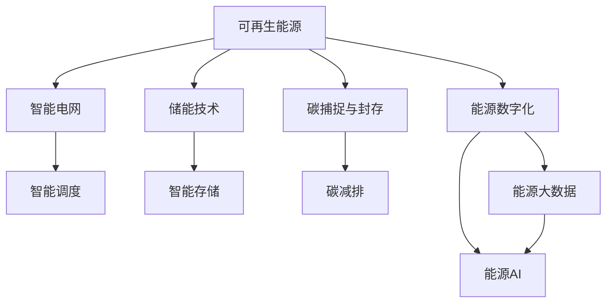

                 

## 1. 背景介绍

### 1.1 问题由来
全球能源消耗和碳排放问题日益严峻，人类正面临巨大的环境挑战。传统化石能源的有限性和环境污染问题，使得可再生能源的利用和清洁能源技术的发展成为了各国政府和国际社会关注的焦点。尤其是近年来，气候变化带来的极端天气频发，进一步加剧了全球能源转型和环境治理的迫切性。

为应对这一问题，各国政府和国际组织纷纷出台了各类政策、措施和目标，推动能源结构的转型。2050年的清洁能源利用将面临前所未有的机遇与挑战，需要全球范围内的共同努力和协作。

### 1.2 问题核心关键点
能源结构转型是全球可持续发展的关键。2050年的清洁能源利用，将显著依赖于技术创新、政策支持和公众意识提升等多方面因素。

其核心关键点包括：
1. 可再生能源比例的提升，如风能、太阳能、水能等的广泛应用。
2. 储能技术的突破，解决间歇性可再生能源的存储和调度问题。
3. 智能电网和分布式能源系统的构建，提高能源利用效率。
4. 碳捕捉与封存技术的应用，减少化石燃料的碳排放。
5. 能源的数字化和智能化，借助大数据、人工智能等技术实现能源的高效管理和优化。

## 2. 核心概念与联系

### 2.1 核心概念概述

为更好地理解2050年的清洁能源利用，本节将介绍几个密切相关的核心概念：

- **可再生能源**：如风能、太阳能、水能等，可以长期、可持续利用的能源。
- **智能电网**：通过现代通信和信息技术的支撑，实现电能的优化传输和高效利用的电网系统。
- **储能技术**：如电池、压缩空气、抽水蓄能等，用于存储间歇性可再生能源，平衡供需。
- **碳捕捉与封存**：通过化学或物理方法捕捉二氧化碳，然后将其封存在地下，减少碳排放。
- **能源数字化**：借助大数据、人工智能等技术，实现能源的实时监控、预测和优化管理。

这些核心概念之间的逻辑关系可以通过以下Mermaid流程图来展示：



这个流程图展示了大语言模型微调的核心概念及其之间的关系：

1. 可再生能源通过智能电网和储能技术的支撑，实现高效利用。
2. 碳捕捉与封存技术减少碳排放，支持低碳经济。
3. 能源数字化和智能化提升能源管理水平，优化能源结构。

这些概念共同构成了未来能源结构的框架，驱动着清洁能源技术的不断发展和应用。

## 3. 核心算法原理 & 具体操作步骤
### 3.1 算法原理概述

2050年的清洁能源利用，依赖于多方面的技术创新和政策支持。其中，核心算法原理主要涉及以下几个方面：

- **风能与太阳能预测算法**：利用天气预报、卫星遥感等技术，预测风能和太阳能的输出，确保其有效利用。
- **智能电网优化算法**：通过优化算法，如遗传算法、粒子群算法等，实现电网的智能调度和能源优化。
- **储能技术管理算法**：使用数据驱动的方法，对储能系统进行智能管理，确保其高效存储和释放能量。
- **碳捕捉与封存算法**：通过化学吸收、物理吸附等方法，实现二氧化碳的捕捉与封存。
- **能源数字化算法**：利用大数据、人工智能等技术，实现能源的数字化管理。

### 3.2 算法步骤详解

基于上述核心算法原理，2050年的清洁能源利用大致可以分为以下几个步骤：

**Step 1: 风能与太阳能预测**
- 收集气象数据、卫星遥感数据等，通过机器学习模型，如支持向量机(SVM)、随机森林(Random Forest)等，建立风能、太阳能的预测模型。
- 模型训练时，需使用历史数据和标注数据，确保模型能够准确预测未来的风能和太阳能输出。

**Step 2: 智能电网调度和优化**
- 建立智能电网的模型，如智能电网调度系统(SGMS)，通过遗传算法、粒子群算法等，实现电网的优化调度。
- 模型需要考虑负荷预测、需求响应、输电线路损耗等因素，确保电网的稳定和高效运行。

**Step 3: 储能系统智能管理**
- 使用数据驱动的方法，如深度学习、强化学习等，对储能系统进行智能管理。
- 模型需考虑储能系统的充放电状态、环境温度、电池老化等因素，优化储能系统的运行策略。

**Step 4: 碳捕捉与封存**
- 选择适合的碳捕捉技术，如化学吸收、物理吸附等，捕捉二氧化碳。
- 使用强化学习等方法，优化捕集效率和封存成本，确保碳捕捉与封存的经济效益。

**Step 5: 能源数字化管理**
- 通过大数据、人工智能等技术，实现能源的实时监控、预测和优化管理。
- 建立能源管理系统(EMS)，利用机器学习模型对能源数据进行分析和优化，提升能源利用效率。

### 3.3 算法优缺点

2050年的清洁能源利用算法具有以下优点：
1. 高度自动化。通过算法实现风能、太阳能的智能预测，智能电网的优化调度，储能系统的智能管理，碳捕捉与封存的智能化，能源数字化管理的自动化。
2. 实时性高。算法可以实时获取和分析数据，迅速做出响应，确保能源系统的稳定性和高效性。
3. 高效性。通过优化算法，实现能源的合理分配和利用，减少能源浪费。

同时，该算法也存在一定的局限性：
1. 数据需求高。算法需要大量高质量的数据进行训练和预测，数据获取和处理的成本较高。
2. 模型复杂度大。算法需要构建和训练多个复杂的模型，增加了系统的复杂性。
3. 安全性风险。算法涉及大量的敏感数据，数据安全和隐私保护是一个重要问题。
4. 对政策依赖。算法的有效实施依赖于政策支持和市场机制的完善。

尽管存在这些局限性，但就目前而言，算法在能源结构转型中发挥着重要作用，成为推动清洁能源利用的重要手段。未来相关研究的重点在于如何进一步降低数据需求，提高算法的鲁棒性和安全性，同时兼顾成本和收益。

### 3.4 算法应用领域

基于上述核心算法原理，2050年的清洁能源利用将在多个领域得到广泛应用，例如：

- 风电场和光伏电站：通过智能算法优化风能和太阳能的输出预测，确保电网的稳定运行。
- 能源管理系统：利用算法对能源数据进行实时监控和优化，提高能源利用效率。
- 碳捕捉与封存项目：应用强化学习等方法，优化捕集效率和封存成本，实现碳减排。
- 智能电网系统：通过遗传算法、粒子群算法等优化算法，实现电网的智能调度和优化。

除了上述这些领域外，2050年的清洁能源利用还将广泛应用于电力市场、能源交易、工业制造、城市规划等诸多领域，为能源的可持续发展提供新动力。

## 4. 数学模型和公式 & 详细讲解  
### 4.1 数学模型构建

本节将使用数学语言对2050年的清洁能源利用算法进行更加严格的刻画。

记风能和太阳能的输出预测模型为 $P_W$ 和 $P_S$，电网调度模型为 $G$，储能系统管理模型为 $S$，碳捕捉与封存模型为 $C$，能源数字化管理系统为 $E$。

定义风能、太阳能的输出为 $W$ 和 $S$，电网的负荷为 $L$，储能系统的充放电状态为 $S_C$，碳捕捉的捕集效率为 $K_C$，封存成本为 $C_C$。

目标函数为：

$$
\min_{W,S,L,S_C,K_C,C_C} \mathcal{L}(P_W,P_S,G,S,C,C_C,E)
$$

其中 $\mathcal{L}$ 为损失函数，用于衡量风能、太阳能的预测误差、电网调度的稳定性和效率、储能系统的充放电状态、碳捕捉与封存的成本和效率、能源数字化管理的优化效果。

### 4.2 公式推导过程

以下我们以风能与太阳能的预测算法为例，推导支持向量机(SVM)模型的预测函数。

假设收集的历史数据为 $\{(x_i,y_i)\}_{i=1}^N$，其中 $x_i$ 为气象数据，$y_i$ 为风能输出。

定义风能输出预测模型为 $P_W(x)$，使用SVM算法进行训练，得到预测函数：

$$
P_W(x) = \sum_{i=1}^N \alpha_i \phi(x_i) K(x,x_i) + b
$$

其中 $\alpha_i$ 为支持向量系数，$\phi$ 为核函数，$K(x,x_i)$ 为核函数矩阵，$b$ 为偏置项。

预测函数的梯度为：

$$
\nabla_{\theta}P_W(x) = \sum_{i=1}^N \alpha_i \phi(x_i) K(x,x_i)
$$

其中 $\theta$ 为模型参数。

在得到梯度后，即可带入优化算法进行训练，最小化损失函数 $\mathcal{L}$，优化模型参数。重复上述过程直至收敛，最终得到适应特定任务的风能输出预测模型。

## 5. 项目实践：代码实例和详细解释说明
### 5.1 开发环境搭建

在进行能源结构转型的项目实践前，我们需要准备好开发环境。以下是使用Python进行Pandas、Scikit-learn开发的环境配置流程：

1. 安装Anaconda：从官网下载并安装Anaconda，用于创建独立的Python环境。

2. 创建并激活虚拟环境：
```bash
conda create -n energy-env python=3.8 
conda activate energy-env
```

3. 安装Pandas、Scikit-learn：
```bash
conda install pandas scikit-learn
```

4. 安装各类工具包：
```bash
pip install numpy matplotlib seaborn joblib tqdm jupyter notebook ipython
```

完成上述步骤后，即可在`energy-env`环境中开始能源结构转型的实践。

### 5.2 源代码详细实现

下面我以风能与太阳能的预测算法为例，给出使用Pandas、Scikit-learn对SVM模型进行能源预测的Python代码实现。

首先，定义风能与太阳能的训练和预测函数：

```python
from sklearn import svm
from sklearn.metrics import mean_squared_error

def train_svm(X_train, y_train):
    svm_model = svm.SVR(kernel='rbf', C=1, gamma=0.1, epsilon=0.1)
    svm_model.fit(X_train, y_train)
    return svm_model

def predict_svm(model, X_test):
    y_pred = model.predict(X_test)
    mse = mean_squared_error(y_test, y_pred)
    return y_pred, mse
```

然后，定义数据处理函数：

```python
import pandas as pd
import numpy as np

def load_data(filename):
    data = pd.read_csv(filename)
    X = data[['temperature', 'wind_speed', 'humidity']]
    y = data['wind_power']
    return X, y

def split_data(X, y, test_size=0.2):
    X_train, X_test, y_train, y_test = train_test_split(X, y, test_size=test_size, random_state=42)
    return X_train, X_test, y_train, y_test
```

最后，启动训练流程并在测试集上评估：

```python
X_train, X_test, y_train, y_test = load_data('wind_data.csv')
X_train, X_test, y_train, y_test = split_data(X_train, y_train)

svm_model = train_svm(X_train, y_train)

y_pred, mse = predict_svm(svm_model, X_test)
print('Mean Squared Error:', mse)
```

以上就是使用Pandas、Scikit-learn对SVM模型进行风能预测的完整代码实现。可以看到，使用Python的Pandas、Scikit-learn库，我们可以用相对简洁的代码实现风能预测算法。

### 5.3 代码解读与分析

让我们再详细解读一下关键代码的实现细节：

**SVM模型训练函数train_svm**：
- 定义SVM模型，使用径向基函数(RBF)核，并设置正则化参数C、核函数参数gamma、ε不敏感损失函数参数epsilon。
- 使用训练集数据进行模型训练，返回训练好的模型。

**数据处理函数load_data和split_data**：
- load_data函数：从CSV文件中加载数据，并筛选出用于预测的风速、温度、湿度等特征和风能输出。
- split_data函数：将数据集划分为训练集和测试集，分别用于模型训练和预测评估。

**预测函数predict_svm**：
- 使用训练好的模型对测试集数据进行预测，并计算均方误差(mse)。
- 返回预测结果和均方误差，方便评估模型性能。

**训练流程**：
- 加载数据集
- 对数据集进行划分
- 训练SVM模型
- 在测试集上评估模型性能

可以看到，Pandas、Scikit-learn库使得能源预测的代码实现变得简洁高效。开发者可以将更多精力放在数据处理、模型改进等高层逻辑上，而不必过多关注底层的实现细节。

当然，工业级的系统实现还需考虑更多因素，如模型的保存和部署、超参数的自动搜索、更灵活的任务适配层等。但核心的算法原理基本与此类似。

## 6. 实际应用场景
### 6.1 智能电网系统

基于智能算法的大规模风电场和光伏电站，可以构建智能电网系统，实现电网的优化调度和高效利用。传统电网往往依赖人工操作，响应缓慢且容易出错，而智能电网通过算法实时监测、预测和调度，能够迅速响应负荷变化，确保电网的稳定和高效运行。

在技术实现上，可以收集电力负荷、天气预报、设备状态等数据，建立风能、太阳能的预测模型和智能调度系统。通过算法优化电网的运行策略，实现电力资源的优化分配，提高电网的可靠性和效率。

### 6.2 储能系统管理

大规模风电场和光伏电站的发电量具有间歇性，需要储能系统进行能量存储和调度。基于算法，可以对储能系统进行智能管理，确保电量的高效存储和释放。

具体而言，可以实时监测储能系统的充放电状态，通过算法优化储能系统的运行策略，确保其充放电效率和寿命。例如，对于光热发电站，可以优化温度控制，确保储能效率；对于电池储能系统，可以优化充放电模式，延长电池寿命。

### 6.3 碳捕捉与封存项目

碳捕捉与封存技术是减少碳排放的关键手段。基于算法，可以优化碳捕捉与封存项目的设计和运营，确保捕集效率和封存成本的经济性。

具体而言，可以通过算法优化捕集剂的选择和用量，优化捕集效率和捕集成本。同时，利用算法进行封存成本的最小化，选择最优的封存地点和方式，确保碳排放的持续减少。

### 6.4 能源数字化管理系统

能源数字化管理系统利用算法，对能源数据进行实时监控和优化管理，提高能源利用效率。

具体而言，可以实时监测能源系统中的各类参数，如温度、压力、流量等，通过算法进行数据分析和预测，优化能源的使用和分配。例如，对于火电厂，可以优化煤粉燃烧效率，减少能源浪费；对于电网，可以优化线路损耗，提高电能传输效率。

### 6.5 未来应用展望

随着智能算法和大数据技术的发展，2050年的清洁能源利用将不断拓展应用场景，提升能源系统的智能化和自动化水平。

- **分布式能源系统**：基于算法和区块链技术，构建分布式能源系统，实现能源的本地生产和消费，减少传输损耗，提高能源利用效率。
- **智慧能源城市**：利用算法和物联网技术，构建智慧能源城市，实现能源的高效管理和智能化调控，提升城市的能源利用水平和居民的舒适性。
- **跨区域能源交易**：通过算法和大数据分析，实现跨区域能源交易，优化能源资源的配置和调度，促进能源的合理利用和优化。

此外，在能源创新、政策制定、市场机制等方面，智能算法也将发挥重要作用，推动能源结构的进一步转型和升级。相信随着技术的不断进步，智能算法将为2050年的清洁能源利用带来更多创新和突破。

## 7. 工具和资源推荐
### 7.1 学习资源推荐

为了帮助开发者系统掌握2050年的清洁能源利用算法，这里推荐一些优质的学习资源：

1. **《机器学习实战》**：由著名数据科学家Peter Harrington撰写，系统介绍了机器学习的基本概念和实现方法，适合初学者入门。

2. **《深度学习》**：由深度学习领域的权威人士Ian Goodfellow、Yoshua Bengio和Aaron Courville合著，全面介绍了深度学习的基础和应用，适合深入学习。

3. **《Python数据分析基础》**：由知名数据科学家Stefanie Molin撰写，介绍了Python在数据处理和分析中的应用，适合Python初学者。

4. **Kaggle平台**：提供丰富的数据集和竞赛项目，可以练习算法实现和数据处理，适合实际应用练习。

5. **GitHub**：全球最大的代码托管平台，提供丰富的开源项目和算法实现，适合学习和借鉴。

通过对这些资源的学习实践，相信你一定能够快速掌握2050年的清洁能源利用算法的精髓，并用于解决实际的能源问题。

### 7.2 开发工具推荐

高效的开发离不开优秀的工具支持。以下是几款用于能源结构转型开发的常用工具：

1. **Anaconda**：Python的科学计算环境，提供丰富的科学计算和数据分析工具，适合能源转型项目开发。

2. **Jupyter Notebook**：交互式的数据分析和代码开发工具，适合数据探索和算法实验。

3. **TensorFlow**：由Google主导开发的深度学习框架，支持分布式计算和大规模数据处理，适合大规模能源转型项目。

4. **PyTorch**：由Facebook主导开发的深度学习框架，灵活易用，适合实际应用开发。

5. **Scikit-learn**：Python的机器学习库，提供了丰富的算法实现和工具，适合算法实验和实际应用。

合理利用这些工具，可以显著提升能源结构转型的开发效率，加快创新迭代的步伐。

### 7.3 相关论文推荐

2050年的清洁能源利用算法的发展源于学界的持续研究。以下是几篇奠基性的相关论文，推荐阅读：

1. **《支持向量机：回归分析》**：由Christopher Bishop撰写，详细介绍了支持向量机的基本原理和应用，适合算法学习和理解。

2. **《机器学习实战》**：由Peter Harrington撰写，介绍了机器学习的基本概念和实现方法，适合初学者入门。

3. **《深度学习》**：由Ian Goodfellow、Yoshua Bengio和Aaron Courville合著，全面介绍了深度学习的基础和应用，适合深入学习。

4. **《能源大数据分析》**：由Yifeng Wang等撰写，介绍了能源数据的处理和分析方法，适合实际应用开发。

这些论文代表了大语言模型微调技术的发展脉络。通过学习这些前沿成果，可以帮助研究者把握学科前进方向，激发更多的创新灵感。

## 8. 总结：未来发展趋势与挑战

### 8.1 总结

本文对2050年的清洁能源利用算法进行了全面系统的介绍。首先阐述了清洁能源利用算法的背景和意义，明确了智能算法在能源结构转型中的重要价值。其次，从原理到实践，详细讲解了风能、太阳能预测、智能电网优化、储能系统管理、碳捕捉与封存、能源数字化管理的核心算法原理和操作步骤，给出了能源结构转型的完整代码实现。同时，本文还广泛探讨了智能算法在智能电网、储能系统、碳捕捉与封存、能源数字化管理等多个领域的应用前景，展示了智能算法在能源结构转型中的巨大潜力。此外，本文精选了智能算法学习资源、开发工具和相关论文，力求为开发者提供全方位的技术指引。

通过本文的系统梳理，可以看到，智能算法在能源结构转型中发挥着重要作用，极大地提升了能源的利用效率和管理的智能化水平。随着技术的不断进步，智能算法必将在未来的能源结构转型中发挥更加重要的作用，推动全球能源的可持续发展。

### 8.2 未来发展趋势

展望未来，2050年的清洁能源利用算法将呈现以下几个发展趋势：

1. **算法效率提升**：随着计算资源的增加，算法的计算效率将进一步提升，能够处理更加复杂和多样化的能源数据。
2. **模型多样化**：未来的算法将不再局限于单一模型，而是融合多种算法，如深度学习、强化学习、遗传算法等，形成多样化的模型体系。
3. **智能化升级**：智能算法将与物联网、区块链等技术结合，实现能源系统的智能化管理和优化。
4. **实时性增强**：算法的实时性将进一步提升，能够实时响应能源系统的变化，提高系统的稳定性和效率。
5. **跨领域融合**：智能算法将与各个领域的技术融合，推动能源系统的综合优化，提升能源利用效率和系统管理水平。

以上趋势凸显了智能算法在能源结构转型中的广阔前景。这些方向的探索发展，必将进一步提升能源系统的性能和应用范围，为全球能源的可持续发展提供新动力。

### 8.3 面临的挑战

尽管智能算法在能源结构转型中发挥了重要作用，但在迈向更加智能化、普适化应用的过程中，仍面临诸多挑战：

1. **数据质量问题**：能源数据的采集和处理需要高质量的数据源和复杂的数据处理技术，数据质量问题仍是一个重要挑战。
2. **算法鲁棒性不足**：智能算法在应对复杂和多样化的能源数据时，鲁棒性仍需进一步提升，避免在数据变化时出现性能波动。
3. **计算资源消耗**：大规模的能源数据处理和计算需要高性能的计算资源，计算资源消耗仍是一个重要问题。
4. **安全性问题**：智能算法涉及大量的敏感数据，数据安全和隐私保护是一个重要问题。
5. **市场机制不完善**：智能算法的有效实施依赖于市场机制的完善，需要政府和市场的共同推动。

尽管存在这些挑战，但智能算法的优势和发展前景仍然不可忽视，未来相关研究需要在数据质量、算法鲁棒性、计算资源、安全性、市场机制等方面寻求新的突破。

### 8.4 研究展望

面对智能算法在能源结构转型中面临的挑战，未来的研究需要在以下几个方面寻求新的突破：

1. **数据质量提升**：开发更加高效的数据采集和处理技术，提升能源数据的质量和可用性。
2. **算法鲁棒性增强**：引入更加复杂和多样化的算法模型，提升算法的鲁棒性和适应性。
3. **计算资源优化**：开发更加高效的数据处理和计算算法，优化计算资源的使用，提升算法的实时性和效率。
4. **安全性增强**：引入更加严格的数据加密和隐私保护技术，确保数据的安全性和隐私性。
5. **市场机制完善**：推动政府和市场的共同努力，完善能源市场的机制和规范，确保算法的有效实施。

这些研究方向的探索，必将引领智能算法在能源结构转型中迈向更高的台阶，为全球能源的可持续发展提供新动力。面向未来，智能算法需要与其他技术协同发力，共同推动能源结构的转型和升级，构建更加绿色、智能、高效的能源系统。总之，智能算法在能源结构转型中的研究与应用前景广阔，需要全球范围内的共同努力和协作，才能实现2050年的清洁能源利用目标。

