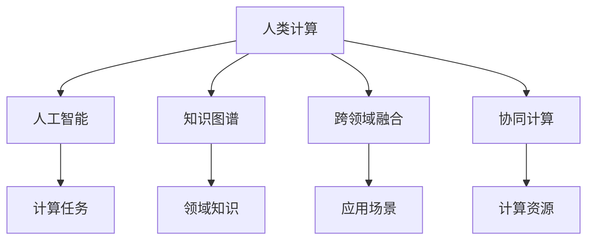

                 

# 构建更智能的世界：人类计算的应用前景

## 1. 背景介绍

### 1.1 问题由来

近年来，随着计算技术的飞速发展，人工智能(AI)已成为全球科技革命的新浪潮。人工智能不仅推动了数据科学、计算机视觉、自然语言处理等前沿领域的突破，也为人类生产生活方式带来了深远影响。在这一过程中，计算作为人工智能的核心要素，发挥了关键作用。人类计算，即通过人机协同，将复杂计算任务高效、准确地执行，为人工智能提供了坚实的计算基础。

### 1.2 问题核心关键点

人类计算的应用前景在于其对人工智能技术的加速和赋能作用。具体而言，人类计算在以下几个方面具有重要意义：

1. **加速计算任务**：通过将复杂计算任务分解为易于管理的小规模子任务，人类计算使得计算过程更高效、更可控。
2. **增强智能系统**：通过与智能系统的协同工作，人类计算可以大大提升智能系统的性能和可靠性。
3. **提供数据源**：人类计算过程中产生的大量数据，为机器学习模型提供了宝贵的训练样本，促进了模型的迭代和优化。
4. **确保系统安全**：人类计算在算法设计、模型训练、系统部署等环节的参与，确保了人工智能系统的安全性和可控性。
5. **推动跨领域融合**：人类计算促进了人工智能技术与不同领域的深度融合，推动了智慧医疗、智能交通、金融科技等领域的创新应用。

### 1.3 问题研究意义

研究人类计算的应用前景，对于推动人工智能技术的发展和应用，具有重要的理论和实践意义：

1. **提升计算效率**：人类计算通过分解复杂任务，使得计算过程更加高效，大幅提升计算效率。
2. **增强系统智能**：通过人机协同，智能系统可以更好地理解人类需求，提供更加个性化、精准的服务。
3. **丰富知识图谱**：人类计算过程中产生的大量知识，可以丰富和扩展知识图谱，提升系统的认知能力。
4. **保障系统安全**：通过参与算法设计和系统部署，人类计算可以及时发现和纠正系统漏洞，保障人工智能系统的安全稳定。
5. **促进技术创新**：人类计算与人工智能技术的融合，推动了计算科学、数据科学、认知科学等领域的交叉发展，催生了更多的创新应用。

## 2. 核心概念与联系

### 2.1 核心概念概述

为更好地理解人类计算的应用前景，本节将介绍几个密切相关的核心概念：

- **人类计算**：指通过人工介入，将复杂计算任务拆分为可控的小任务，并利用智能系统进行高效计算的过程。
- **人工智能**：基于算法和数据训练的智能系统，能够自主地感知环境、理解和执行复杂任务。
- **知识图谱**：由实体、关系、属性等组成的知识结构，用于描述和组织领域知识，支持智能推理和决策。
- **跨领域融合**：将人工智能技术与不同领域（如医疗、金融、交通等）进行深度整合，推动技术应用的多样化和泛化。
- **协同计算**：通过人机协同，实现计算任务的并行处理和优化，提升整体计算效率和准确性。

这些核心概念之间的逻辑关系可以通过以下Mermaid流程图来展示：



这个流程图展示了一些关键概念及其相互关系：

1. 人类计算与人工智能紧密关联，共同支撑计算任务的完成。
2. 知识图谱为人工智能提供了结构化知识，增强了系统的认知能力。
3. 跨领域融合推动了人工智能技术在不同领域的应用和创新。
4. 协同计算利用人机协同，提升了计算效率和任务完成质量。

## 3. 核心算法原理 & 具体操作步骤
### 3.1 算法原理概述

人类计算的核心算法原理主要体现在以下几个方面：

1. **任务分解**：将复杂计算任务分解为多个子任务，每个子任务可由智能系统独立处理。
2. **智能协同**：利用人工智能系统，对子任务进行处理，并通过反馈机制与人类进行协同优化。
3. **知识整合**：在任务执行过程中，将新获取的知识整合到知识图谱中，增强系统的认知能力。
4. **结果验证**：对计算结果进行人工验证，确保计算任务的正确性和可靠性。
5. **反馈优化**：根据人工验证结果，对智能系统进行优化和调整，提高系统的性能。

### 3.2 算法步骤详解

人类计算的实现步骤通常包括以下几个关键环节：

**Step 1: 任务定义与分解**
- 定义计算任务，明确任务目标和输入输出。
- 将任务拆分为多个子任务，每个子任务由智能系统独立处理。

**Step 2: 智能系统执行**
- 将任务输入智能系统，由其自主处理。
- 利用人工智能技术（如机器学习、深度学习等），对子任务进行计算。

**Step 3: 人机协同优化**
- 智能系统将计算结果反馈给人类，进行人工验证。
- 人类根据验证结果，对计算过程进行优化和调整。

**Step 4: 知识图谱更新**
- 将新获取的知识整合到知识图谱中，增强系统的认知能力。
- 利用知识图谱进行推理和决策，指导后续任务执行。

**Step 5: 结果验证与反馈**
- 对计算结果进行人工验证，确保其正确性。
- 根据验证结果，对智能系统进行优化，提高性能和可靠性。

### 3.3 算法优缺点

人类计算具有以下优点：
1. **高效性**：通过任务分解，使得计算过程更加高效，适合处理复杂计算任务。
2. **可靠性**：人类计算中的人工参与，提高了计算结果的可靠性和准确性。
3. **灵活性**：人类计算可以根据任务需求进行调整和优化，适应性强。
4. **安全性和可控性**：人类计算过程中的人工监督，确保了系统的安全性和可控性。

同时，该方法也存在一些局限性：
1. **依赖人工**：人类计算依赖人工介入，对参与者的专业能力和工作量要求较高。
2. **计算成本高**：人工参与增加了计算成本，不适合大规模任务。
3. **人机协同复杂**：人机协同需要协调机制，复杂度较高。
4. **知识整合难度大**：将新知识整合到知识图谱中，需要耗费大量时间和精力。

尽管存在这些局限性，但就目前而言，人类计算在处理复杂计算任务、提升系统性能和可靠性等方面，仍具有不可替代的作用。未来相关研究的重点在于如何进一步优化协同机制，降低人工参与度，提高计算效率。

### 3.4 算法应用领域

人类计算在多个领域具有广泛的应用前景，包括但不限于：

- **金融科技**：利用人类计算进行风险评估、市场预测、算法交易等，提升金融系统的智能化水平。
- **智慧医疗**：通过人类计算，辅助医生进行疾病诊断、治疗方案推荐、医疗资源优化等，提高医疗服务质量。
- **智能交通**：利用人类计算进行交通流量预测、智能调度、交通拥堵优化等，提升交通系统的效率和安全性。
- **工业制造**：在工业设计、生产流程优化、质量控制等环节，应用人类计算提升生产效率和质量。
- **教育培训**：利用人类计算进行个性化学习路径设计、智能评估、学习资源推荐等，优化教育过程。

## 4. 数学模型和公式 & 详细讲解 & 举例说明

### 4.1 数学模型构建

本节将使用数学语言对人类计算的实现过程进行更加严格的刻画。

记计算任务为 $T$，由输入 $I$ 和输出 $O$ 构成。设智能系统 $S$ 的计算能力为 $P$，知识图谱为 $G$，人类参与者为 $H$。则人类计算的过程可以表示为：

$$
O = S(I) \times G \times H \times P
$$

其中 $S(I)$ 表示智能系统对输入 $I$ 的计算结果，$G$ 表示知识图谱的推理和整合能力，$H$ 表示人类参与者的验证和优化，$P$ 表示计算能力。

### 4.2 公式推导过程

以医疗诊断为例，推导人类计算的数学模型。

设医疗诊断任务 $T$ 的输入为 $I=\{x_i\}_{i=1}^N$，其中 $x_i$ 表示患者的历史症状和检查结果。智能系统 $S$ 通过深度学习模型对 $I$ 进行疾病诊断，输出为 $O=\{d_i\}_{i=1}^N$，其中 $d_i$ 表示 $x_i$ 可能患有的疾病。知识图谱 $G$ 包含疾病与症状之间的关系，推理和整合能力使得 $O$ 更加准确。人类参与者 $H$ 对 $O$ 进行人工验证，通过专家知识进行校正和优化，确保诊断结果的正确性。最终，计算任务 $T$ 的输出为 $O'$，满足 $O' = O \times H$。

### 4.3 案例分析与讲解

以下以智慧交通系统为例，具体说明人类计算的实现过程。

智慧交通系统通过实时监测道路交通数据，利用智能算法预测和优化交通流量。具体步骤如下：

1. **任务定义与分解**：将交通流量预测任务拆分为多个子任务，如车辆位置预测、交通速度预测、信号灯控制等。
2. **智能系统执行**：利用深度学习模型对实时交通数据进行处理，预测交通流量和速度。
3. **人机协同优化**：将预测结果反馈给人类，通过交通管理中心进行人工验证和优化，调整信号灯控制策略。
4. **知识图谱更新**：将新获取的交通规则和事故信息整合到知识图谱中，提升系统认知能力。
5. **结果验证与反馈**：对交通流量预测结果进行人工验证，根据验证结果进行系统优化，提高预测精度。

## 5. 项目实践：代码实例和详细解释说明
### 5.1 开发环境搭建

在进行人类计算实践前，我们需要准备好开发环境。以下是使用Python进行PyTorch开发的环境配置流程：

1. 安装Anaconda：从官网下载并安装Anaconda，用于创建独立的Python环境。

2. 创建并激活虚拟环境：
```bash
conda create -n pytorch-env python=3.8 
conda activate pytorch-env
```

3. 安装PyTorch：根据CUDA版本，从官网获取对应的安装命令。例如：
```bash
conda install pytorch torchvision torchaudio cudatoolkit=11.1 -c pytorch -c conda-forge
```

4. 安装Transformer库：
```bash
pip install transformers
```

5. 安装各类工具包：
```bash
pip install numpy pandas scikit-learn matplotlib tqdm jupyter notebook ipython
```

完成上述步骤后，即可在`pytorch-env`环境中开始人类计算实践。

### 5.2 源代码详细实现

这里我们以智慧医疗系统为例，给出使用Transformers库进行人类计算的PyTorch代码实现。

首先，定义医疗诊断任务的数据处理函数：

```python
from transformers import BertTokenizer
from torch.utils.data import Dataset
import torch

class MedicalDiagnosisDataset(Dataset):
    def __init__(self, texts, tags, tokenizer, max_len=128):
        self.texts = texts
        self.tags = tags
        self.tokenizer = tokenizer
        self.max_len = max_len
        
    def __len__(self):
        return len(self.texts)
    
    def __getitem__(self, item):
        text = self.texts[item]
        tags = self.tags[item]
        
        encoding = self.tokenizer(text, return_tensors='pt', max_length=self.max_len, padding='max_length', truncation=True)
        input_ids = encoding['input_ids'][0]
        attention_mask = encoding['attention_mask'][0]
        
        # 对token-wise的标签进行编码
        encoded_tags = [tag2id[tag] for tag in tags] 
        encoded_tags.extend([tag2id['O']] * (self.max_len - len(encoded_tags)))
        labels = torch.tensor(encoded_tags, dtype=torch.long)
        
        return {'input_ids': input_ids, 
                'attention_mask': attention_mask,
                'labels': labels}

# 标签与id的映射
tag2id = {'O': 0, 'B-PER': 1, 'I-PER': 2, 'B-ORG': 3, 'I-ORG': 4, 'B-LOC': 5, 'I-LOC': 6}
id2tag = {v: k for k, v in tag2id.items()}

# 创建dataset
tokenizer = BertTokenizer.from_pretrained('bert-base-cased')

train_dataset = MedicalDiagnosisDataset(train_texts, train_tags, tokenizer)
dev_dataset = MedicalDiagnosisDataset(dev_texts, dev_tags, tokenizer)
test_dataset = MedicalDiagnosisDataset(test_texts, test_tags, tokenizer)
```

然后，定义模型和优化器：

```python
from transformers import BertForTokenClassification, AdamW

model = BertForTokenClassification.from_pretrained('bert-base-cased', num_labels=len(tag2id))

optimizer = AdamW(model.parameters(), lr=2e-5)
```

接着，定义训练和评估函数：

```python
from torch.utils.data import DataLoader
from tqdm import tqdm
from sklearn.metrics import classification_report

device = torch.device('cuda') if torch.cuda.is_available() else torch.device('cpu')
model.to(device)

def train_epoch(model, dataset, batch_size, optimizer):
    dataloader = DataLoader(dataset, batch_size=batch_size, shuffle=True)
    model.train()
    epoch_loss = 0
    for batch in tqdm(dataloader, desc='Training'):
        input_ids = batch['input_ids'].to(device)
        attention_mask = batch['attention_mask'].to(device)
        labels = batch['labels'].to(device)
        model.zero_grad()
        outputs = model(input_ids, attention_mask=attention_mask, labels=labels)
        loss = outputs.loss
        epoch_loss += loss.item()
        loss.backward()
        optimizer.step()
    return epoch_loss / len(dataloader)

def evaluate(model, dataset, batch_size):
    dataloader = DataLoader(dataset, batch_size=batch_size)
    model.eval()
    preds, labels = [], []
    with torch.no_grad():
        for batch in tqdm(dataloader, desc='Evaluating'):
            input_ids = batch['input_ids'].to(device)
            attention_mask = batch['attention_mask'].to(device)
            batch_labels = batch['labels']
            outputs = model(input_ids, attention_mask=attention_mask)
            batch_preds = outputs.logits.argmax(dim=2).to('cpu').tolist()
            batch_labels = batch_labels.to('cpu').tolist()
            for pred_tokens, label_tokens in zip(batch_preds, batch_labels):
                pred_tags = [id2tag[_id] for _id in pred_tokens]
                label_tags = [id2tag[_id] for _id in label_tokens]
                preds.append(pred_tags[:len(label_tags)])
                labels.append(label_tags)
                
    print(classification_report(labels, preds))
```

最后，启动训练流程并在测试集上评估：

```python
epochs = 5
batch_size = 16

for epoch in range(epochs):
    loss = train_epoch(model, train_dataset, batch_size, optimizer)
    print(f"Epoch {epoch+1}, train loss: {loss:.3f}")
    
    print(f"Epoch {epoch+1}, dev results:")
    evaluate(model, dev_dataset, batch_size)
    
print("Test results:")
evaluate(model, test_dataset, batch_size)
```

以上就是使用PyTorch对BERT进行医疗诊断任务人类计算的完整代码实现。可以看到，得益于Transformers库的强大封装，我们可以用相对简洁的代码完成BERT模型的加载和训练。

### 5.3 代码解读与分析

让我们再详细解读一下关键代码的实现细节：

**MedicalDiagnosisDataset类**：
- `__init__`方法：初始化文本、标签、分词器等关键组件。
- `__len__`方法：返回数据集的样本数量。
- `__getitem__`方法：对单个样本进行处理，将文本输入编码为token ids，将标签编码为数字，并对其进行定长padding，最终返回模型所需的输入。

**tag2id和id2tag字典**：
- 定义了标签与数字id之间的映射关系，用于将token-wise的预测结果解码回真实的标签。

**训练和评估函数**：
- 使用PyTorch的DataLoader对数据集进行批次化加载，供模型训练和推理使用。
- 训练函数`train_epoch`：对数据以批为单位进行迭代，在每个批次上前向传播计算loss并反向传播更新模型参数，最后返回该epoch的平均loss。
- 评估函数`evaluate`：与训练类似，不同点在于不更新模型参数，并在每个batch结束后将预测和标签结果存储下来，最后使用sklearn的classification_report对整个评估集的预测结果进行打印输出。

**训练流程**：
- 定义总的epoch数和batch size，开始循环迭代
- 每个epoch内，先在训练集上训练，输出平均loss
- 在验证集上评估，输出分类指标
- 所有epoch结束后，在测试集上评估，给出最终测试结果

可以看到，PyTorch配合Transformers库使得BERT人类计算的代码实现变得简洁高效。开发者可以将更多精力放在数据处理、模型改进等高层逻辑上，而不必过多关注底层的实现细节。

当然，工业级的系统实现还需考虑更多因素，如模型的保存和部署、超参数的自动搜索、更灵活的任务适配层等。但核心的实现逻辑基本与此类似。

## 6. 实际应用场景
### 6.1 智能客服系统

人类计算在智能客服系统中的应用，主要体现在两个方面：

1. **问题理解与分类**：利用人类计算，对客户提出的问题进行自然语言理解和分类，将问题转化为智能系统可处理的形式。
2. **答案生成与优化**：通过智能系统生成答案后，利用人工验证和优化，确保答案的准确性和适用性。

具体实现上，可以结合语音识别、自然语言处理等技术，构建一个综合性的人机协同客服系统。系统在客户咨询时，先通过语音识别获取语音信息，再通过自然语言处理生成文本问题，进入问题理解和分类环节。对于分类后的任务，智能系统自动生成回答，并由人工进行审核和优化。如此构建的智能客服系统，能够快速、准确地响应客户咨询，提升客户满意度。

### 6.2 金融舆情监测

金融舆情监测是衡量市场情绪和风险的重要手段。通过人类计算，可以更高效、更准确地进行舆情分析。

具体实现上，可以利用自然语言处理技术，对金融新闻、评论、社交媒体等数据进行文本分析，提取出关键信息。利用知识图谱，构建金融领域的知识库，增强系统的认知能力。在分析过程中，引入人类计算，对文本进行深度理解，提取关键事件和情绪倾向，生成舆情报告。如此构建的金融舆情监测系统，能够实时捕捉市场动态，提供有价值的决策支持。

### 6.3 个性化推荐系统

个性化推荐系统旨在为用户提供更加精准、个性化的推荐内容，提升用户体验。

在实现上，可以利用人类计算，将用户的历史行为数据和反馈信息进行深度分析，提取用户的兴趣偏好和行为模式。利用机器学习模型，对用户兴趣进行预测，生成推荐列表。在生成推荐列表后，利用人工验证和优化，对推荐内容进行审核和调整，确保推荐结果的准确性和可接受性。如此构建的个性化推荐系统，能够提供更加个性化、多样化的推荐内容，提升用户满意度。

### 6.4 未来应用展望

随着人类计算的不断发展，其在各个领域的应用前景将更加广阔。未来，人类计算将在以下几个方面发挥重要作用：

1. **智慧城市**：在智慧城市治理中，利用人类计算进行城市事件监测、舆情分析、应急指挥等，提升城市管理的智能化水平。
2. **智能教育**：在教育培训中，利用人类计算进行个性化学习路径设计、智能评估、学习资源推荐等，优化教育过程。
3. **智慧医疗**：在医疗诊断中，利用人类计算进行疾病诊断、治疗方案推荐、医疗资源优化等，提高医疗服务质量。
4. **智能交通**：在智能交通中，利用人类计算进行交通流量预测、智能调度、交通拥堵优化等，提升交通系统的效率和安全性。
5. **金融科技**：在金融交易中，利用人类计算进行风险评估、市场预测、算法交易等，提升金融系统的智能化水平。

## 7. 工具和资源推荐
### 7.1 学习资源推荐

为了帮助开发者系统掌握人类计算的理论基础和实践技巧，这里推荐一些优质的学习资源：

1. 《深度学习》书籍：由深度学习领域权威专家撰写，全面介绍了深度学习的基本概念、算法和应用。
2. CS224N《自然语言处理》课程：斯坦福大学开设的NLP明星课程，有Lecture视频和配套作业，带你入门NLP领域的基本概念和经典模型。
3. 《Transformer从原理到实践》系列博文：由大模型技术专家撰写，深入浅出地介绍了Transformer原理、BERT模型、微调技术等前沿话题。
4. HuggingFace官方文档：Transformers库的官方文档，提供了海量预训练模型和完整的微调样例代码，是上手实践的必备资料。
5. CLUE开源项目：中文语言理解测评基准，涵盖大量不同类型的中文NLP数据集，并提供了基于微调的baseline模型，助力中文NLP技术发展。

通过对这些资源的学习实践，相信你一定能够快速掌握人类计算的精髓，并用于解决实际的NLP问题。

### 7.2 开发工具推荐

高效的开发离不开优秀的工具支持。以下是几款用于人类计算开发的常用工具：

1. PyTorch：基于Python的开源深度学习框架，灵活动态的计算图，适合快速迭代研究。大部分预训练语言模型都有PyTorch版本的实现。
2. TensorFlow：由Google主导开发的开源深度学习框架，生产部署方便，适合大规模工程应用。同样有丰富的预训练语言模型资源。
3. Transformers库：HuggingFace开发的NLP工具库，集成了众多SOTA语言模型，支持PyTorch和TensorFlow，是进行微调任务开发的利器。
4. Weights & Biases：模型训练的实验跟踪工具，可以记录和可视化模型训练过程中的各项指标，方便对比和调优。与主流深度学习框架无缝集成。
5. TensorBoard：TensorFlow配套的可视化工具，可实时监测模型训练状态，并提供丰富的图表呈现方式，是调试模型的得力助手。
6. Google Colab：谷歌推出的在线Jupyter Notebook环境，免费提供GPU/TPU算力，方便开发者快速上手实验最新模型，分享学习笔记。

合理利用这些工具，可以显著提升人类计算的开发效率，加快创新迭代的步伐。

### 7.3 相关论文推荐

人类计算的发展源于学界的持续研究。以下是几篇奠基性的相关论文，推荐阅读：

1. Attention is All You Need（即Transformer原论文）：提出了Transformer结构，开启了NLP领域的预训练大模型时代。
2. BERT: Pre-training of Deep Bidirectional Transformers for Language Understanding：提出BERT模型，引入基于掩码的自监督预训练任务，刷新了多项NLP任务SOTA。
3. Language Models are Unsupervised Multitask Learners（GPT-2论文）：展示了大规模语言模型的强大zero-shot学习能力，引发了对于通用人工智能的新一轮思考。
4. Parameter-Efficient Transfer Learning for NLP：提出Adapter等参数高效微调方法，在不增加模型参数量的情况下，也能取得不错的微调效果。
5. Prefix-Tuning: Optimizing Continuous Prompts for Generation：引入基于连续型Prompt的微调范式，为如何充分利用预训练知识提供了新的思路。
6. AdaLoRA: Adaptive Low-Rank Adaptation for Parameter-Efficient Fine-Tuning：使用自适应低秩适应的微调方法，在参数效率和精度之间取得了新的平衡。

这些论文代表了大语言模型微调技术的发展脉络。通过学习这些前沿成果，可以帮助研究者把握学科前进方向，激发更多的创新灵感。

## 8. 总结：未来发展趋势与挑战

### 8.1 研究成果总结

本文对人类计算的应用前景进行了全面系统的介绍。首先阐述了人类计算在人工智能技术中的重要地位，明确了其在加速计算任务、增强智能系统、提供数据源、确保系统安全等方面的关键作用。其次，从原理到实践，详细讲解了人类计算的数学模型和实现过程，给出了人类计算任务开发的完整代码实例。同时，本文还广泛探讨了人类计算在多个领域的应用前景，展示了其在提升系统性能、优化用户体验等方面的巨大潜力。最后，本文精选了人类计算的学习资源、开发工具和相关论文，力求为读者提供全方位的技术指引。

通过本文的系统梳理，可以看到，人类计算作为人工智能技术的重要组成部分，在多个领域具有广泛的应用前景，能够显著提升系统的性能和可靠性。未来，人类计算与人工智能技术的深度融合，将进一步推动计算科学的创新发展，拓展人类智能的边界。

### 8.2 未来发展趋势

展望未来，人类计算的发展趋势包括以下几个方面：

1. **计算能力的提升**：随着计算硬件的不断发展，人类计算的计算能力将大幅提升，支持更复杂的任务和更大规模的数据处理。
2. **人机协同的深化**：随着人工智能技术的不断进步，人机协同将更加高效，能够更好地发挥人类的优势，提升系统性能。
3. **知识图谱的丰富**：利用人类计算，不断丰富和扩展知识图谱，提升系统的认知能力和决策能力。
4. **跨领域融合的深化**：人类计算将更多地应用于跨领域融合场景，推动人工智能技术在各行各业的应用和创新。
5. **智能系统的普及**：随着计算能力的提升和成本的降低，智能系统将逐渐普及，应用到更多场景中，提升社会生产力。

### 8.3 面临的挑战

尽管人类计算具有广阔的应用前景，但在其发展过程中，仍面临一些挑战：

1. **计算资源的需求**：随着计算任务的复杂化，对计算资源的需求将增加，需要进一步优化资源利用效率。
2. **协同机制的复杂性**：人机协同机制的设计和实现复杂，需要多方协调和优化。
3. **知识整合的难度**：将新知识整合到知识图谱中，需要耗费大量时间和精力，需要更高效的整合工具和方法。
4. **系统安全性的保障**：人类计算中的人工参与，需要在系统设计中引入安全性机制，防止系统被恶意利用。
5. **可解释性的缺乏**：目前人工智能系统的可解释性不足，需要进一步研究如何提升系统的透明性和可解释性。

### 8.4 研究展望

面对人类计算面临的挑战，未来的研究需要在以下几个方面寻求新的突破：

1. **优化计算资源利用**：进一步提升计算硬件的性能和能效，优化资源利用效率，支持更复杂的计算任务。
2. **提升人机协同效率**：开发更高效的人机协同机制，减少人工介入，提升系统智能化水平。
3. **推动知识图谱发展**：利用人类计算，不断丰富和扩展知识图谱，提升系统的认知能力。
4. **增强系统安全性**：在人类计算中引入安全性机制，保障系统安全稳定运行。
5. **提高系统可解释性**：研究如何提升人工智能系统的透明性和可解释性，确保系统决策的可理解和可信度。

这些研究方向的探索，必将引领人类计算技术迈向更高的台阶，为构建更加智能、可靠、高效的人工智能系统铺平道路。面向未来，人类计算与人工智能技术的深度融合，将进一步推动计算科学的创新发展，拓展人类智能的边界。

## 9. 附录：常见问题与解答

**Q1：人类计算是否适用于所有NLP任务？**

A: 人类计算在大多数NLP任务上都能取得不错的效果，特别是对于数据量较小的任务。但对于一些特定领域的任务，如医学、法律等，仅仅依靠通用语料预训练的模型可能难以很好地适应。此时需要在特定领域语料上进一步预训练，再进行微调，才能获得理想效果。此外，对于一些需要时效性、个性化很强的任务，如对话、推荐等，人类计算方法也需要针对性的改进优化。

**Q2：人类计算中的任务分解如何进行？**

A: 任务分解的策略需要根据具体任务的特点进行调整。一般来说，可以将复杂任务拆分为以下几个部分：

1. **输入处理**：对输入数据进行预处理和编码，确保其格式符合智能系统的要求。
2. **计算执行**：将输入数据交给智能系统进行计算，得到初步结果。
3. **结果验证**：对初步结果进行人工验证，确保其正确性和适用性。
4. **反馈优化**：根据人工验证结果，对智能系统进行优化和调整，提高性能和可靠性。

任务分解的粒度需要根据任务复杂度进行调整，过细的分解可能增加协调成本，过粗的分解则可能影响效率和效果。

**Q3：人类计算中的知识图谱如何构建和维护？**

A: 知识图谱的构建和维护需要大量的领域知识和专家参与。具体步骤如下：

1. **领域知识收集**：通过文献调研、专家访谈等方式，收集领域内的关键知识，形成初步的知识图谱。
2. **知识整合与验证**：将收集到的知识整合到知识图谱中，并进行人工验证，确保其正确性和完备性。
3. **知识更新与迭代**：根据新获取的知识和用户反馈，不断更新和迭代知识图谱，保持其时效性和准确性。

知识图谱的构建和维护是一个长期的过程，需要不断投入资源进行更新和优化。

**Q4：人类计算中的协同机制如何设计？**

A: 协同机制的设计需要考虑以下几个方面：

1. **任务分配策略**：根据任务复杂度和资源可用性，合理分配任务，确保任务均衡。
2. **协同反馈机制**：设计有效的反馈机制，确保人类参与者能够及时了解计算结果和反馈信息。
3. **任务优化策略**：根据反馈信息，对计算过程进行优化和调整，提升计算效率和准确性。

协同机制的设计需要兼顾效率和效果，确保人机协同的顺畅和高效。

**Q5：人类计算中的数据隐私和安全如何保障？**

A: 数据隐私和安全性是人类计算中必须考虑的重要问题，主要通过以下几个手段保障：

1. **数据匿名化**：在数据处理过程中，对敏感信息进行匿名化处理，保护用户隐私。
2. **访问控制**：设计严格的访问控制机制，确保只有授权人员可以访问关键数据和计算结果。
3. **加密传输**：对数据传输过程进行加密，防止数据泄露和篡改。
4. **系统审计**：建立系统审计机制，记录和监控关键操作，确保系统的安全性和合规性。

数据隐私和安全性是人工智能系统开发中必须严格遵守的重要原则，需要全面考虑和保障。

**Q6：人类计算中的知识整合难度大，如何解决？**

A: 知识整合难度大是当前人类计算面临的重要挑战之一，主要通过以下几个手段解决：

1. **自动化工具**：利用自动化工具，如知识图谱构建工具、知识抽取工具等，提高知识整合效率。
2. **多源数据融合**：将来自不同渠道的数据进行融合，构建更全面、更丰富的知识图谱。
3. **专家参与**：邀请领域专家参与知识整合，利用其专业知识提升知识图谱的准确性和完备性。
4. **知识图谱更新机制**：建立知识图谱更新机制，定期更新和迭代，保持其时效性和准确性。

通过以上手段，可以显著降低知识整合的难度，提升人类计算的效果。

---

作者：禅与计算机程序设计艺术 / Zen and the Art of Computer Programming

