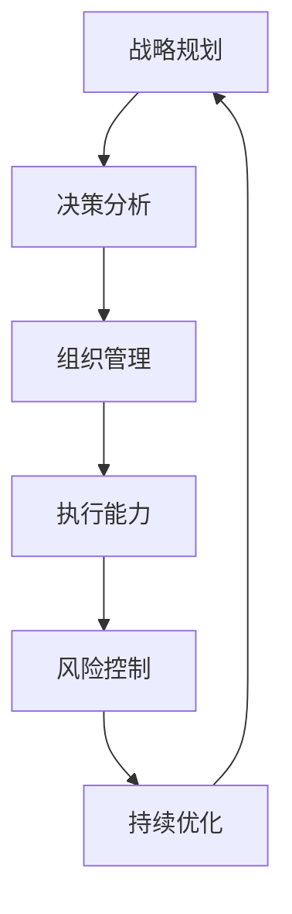

                 

# 构建行动体系的关键要素

> 关键词：行动体系,关键要素,战略规划,决策分析,组织管理,执行能力,风险控制,持续优化

## 1. 背景介绍

在快速变化和高度竞争的市场环境中，企业需要构建一个高效且灵活的行动体系，以应对不确定性、捕捉机会、实现战略目标。一个全面的行动体系不仅包括战略规划和决策分析，还需涵盖组织管理、执行能力、风险控制和持续优化等关键要素。本文将详细探讨构建行动体系的关键要素，并提供一个系统的构建框架，帮助企业构建一个高效、灵活的行动体系。

## 2. 核心概念与联系

### 2.1 核心概念概述

在构建行动体系时，首先需要明确几个核心概念：

- **战略规划**：确定企业的长期目标和关键业务领域，制定中长期规划和年度计划。
- **决策分析**：通过数据分析、模拟预测等手段，评估不同决策方案的优劣，支持决策的科学性。
- **组织管理**：设计组织架构、明确岗位职责、建立沟通机制，确保资源有效配置。
- **执行能力**：构建高效的执行机制，如项目管理、团队协作、绩效管理等，确保决策得以有效实施。
- **风险控制**：识别潜在风险、制定风险应对策略、建立风险监控机制，确保企业在变化中保持稳健。
- **持续优化**：通过持续监测和反馈，不断优化行动体系，提升整体绩效。

这些核心概念之间相互关联，共同构成一个动态、可持续的行动体系。

### 2.2 核心概念原理和架构的 Mermaid 流程图



这个流程图展示了行动体系的核心概念及其相互联系：

- **战略规划(A)**：为决策提供方向，是行动体系的起点。
- **决策分析(B)**：根据战略指导，进行数据分析和预测，支持科学决策。
- **组织管理(C)**：为执行提供架构和机制，确保资源有效配置。
- **执行能力(D)**：实施决策，执行过程中进行风险控制，确保目标达成。
- **风险控制(E)**：识别和应对潜在风险，确保执行稳定。
- **持续优化(F)**：通过反馈机制，不断优化行动体系，提升整体效率。

这个结构形成一个闭环，确保行动体系在变化中不断调整和优化。

## 3. 核心算法原理 & 具体操作步骤

### 3.1 算法原理概述

构建行动体系时，需要应用一系列数学模型和算法，以科学的方式分析、决策和优化。这些算法包括但不限于：

- **线性规划**：用于优化资源配置和目标达成。
- **决策树**：用于模拟不同决策路径及其后果，支持科学决策。
- **蒙特卡洛模拟**：用于评估风险和不确定性，辅助风险控制。
- **遗传算法**：用于优化复杂问题，支持持续优化。

### 3.2 算法步骤详解

构建行动体系的算法步骤一般包括以下几个关键步骤：

**Step 1: 收集数据和信息**
- 获取企业内外部的关键数据和信息，包括市场环境、竞争态势、资源状况、客户需求等。

**Step 2: 战略规划和决策分析**
- 使用线性规划等数学模型，对战略规划进行量化分析，确定长期和短期目标。
- 应用决策树、蒙特卡洛模拟等算法，进行决策分析和风险评估。

**Step 3: 组织管理设计**
- 设计组织架构，明确岗位职责，建立有效的沟通和协作机制。
- 引入项目管理、绩效管理等工具，确保资源有效配置。

**Step 4: 执行能力构建**
- 制定详细的执行计划，分配任务和资源，确保决策得以实施。
- 使用敏捷项目管理等方法，提升执行效率和灵活性。

**Step 5: 风险控制和监测**
- 识别潜在风险，制定风险应对策略，建立风险监控机制。
- 定期评估风险状态，及时调整应对措施。

**Step 6: 持续优化**
- 收集执行反馈，进行数据和模型更新，不断优化行动体系。
- 引入持续改进机制，如PDCA循环（Plan-Do-Check-Act），确保行动体系持续高效运行。

### 3.3 算法优缺点

构建行动体系的主要算法有以下优缺点：

**优点**：
- **科学性和系统性**：通过数学模型和算法，确保决策的科学性和系统性，减少人为失误。
- **高效性和灵活性**：算法支持快速响应市场变化，提升执行效率和灵活性。
- **可追溯性和可控性**：算法可以提供决策依据，支持风险控制和持续优化。

**缺点**：
- **复杂性**：构建和维护行动体系可能需要复杂的数据和算法，对资源和人员要求较高。
- **不确定性**：模型和算法基于历史数据和假设，无法完全预测未来，存在不确定性。
- **成本和复杂度**：构建和维护一个高效的行动体系可能需要较高的成本和复杂度。

### 3.4 算法应用领域

构建行动体系的算法和模型广泛应用于多个领域，包括但不限于：

- **战略规划和市场分析**：通过线性规划和决策树等算法，支持战略规划和市场分析。
- **风险管理与合规**：利用蒙特卡洛模拟和遗传算法等工具，评估和应对风险，确保合规性。
- **运营管理与效率提升**：应用项目管理、绩效管理等工具，提升运营效率和效果。
- **数据驱动的决策支持**：通过数据分析和机器学习算法，支持数据驱动的决策支持。
- **持续改进与优化**：通过PDCA循环等方法，实现持续改进和优化。

这些领域的应用展示了构建行动体系的广泛价值和实用意义。

## 4. 数学模型和公式 & 详细讲解 & 举例说明

### 4.1 数学模型构建

构建行动体系的数学模型通常包括以下几个部分：

- **线性规划模型**：形式化表示为：
$$
\min \sum_{i=1}^n c_i x_i \\
s.t. \sum_{i=1}^n a_{ij} x_i \geq b_j, j=1,2,\dots,m \\
x_i \geq 0
$$
其中 $c_i$ 为资源成本系数，$b_j$ 为约束条件，$x_i$ 为资源分配变量。

- **决策树模型**：形式化表示为：
$$
D = (T_0, T_1, T_2, \dots, T_n)
$$
其中 $T_i$ 为决策节点，包含属性 $A_i$ 和分支 $B_i$。每个叶子节点表示一个决策方案及其预期结果。

### 4.2 公式推导过程

以线性规划模型为例，其基本思路为：

1. 确定优化目标：最小化成本函数 $\sum_{i=1}^n c_i x_i$。
2. 确定约束条件：$\sum_{i=1}^n a_{ij} x_i \geq b_j, j=1,2,\dots,m$。
3. 求解线性规划问题：利用单纯形法、内点法等算法求解最优解。
4. 分析结果：确定资源分配方案，评估优化效果。

### 4.3 案例分析与讲解

假设某公司需分配资源（人员、资金）到不同的业务单元，以实现最大化收益。

**案例背景**：
- 公司有三个业务单元：A、B、C。
- 每个业务单元需分配的资源成本为：A为$5000, B为$3000, C为$4000。
- 每个业务单元的预期收益为：A为$10000, B为$8000, C为$9000。
- 每个业务单元的最大资源限制为：A为$10000, B为$15000, C为$20000。

**模型构建**：
- 成本系数 $c_i = [5000, 3000, 4000]$。
- 约束条件 $a_{ij} = \begin{bmatrix} 1 & 1 & 1 \\ 1 & 0 & 0 \\ 0 & 1 & 0 \end{bmatrix}, b_j = [10000, 15000, 20000]$。

**求解步骤**：
1. 构建线性规划模型：
$$
\min \begin{bmatrix} 5000 & 3000 & 4000 \end{bmatrix} \begin{bmatrix} x_A \\ x_B \\ x_C \end{bmatrix} \\
s.t. \begin{bmatrix} 1 & 1 & 1 \\ 1 & 0 & 0 \\ 0 & 1 & 0 \end{bmatrix} \begin{bmatrix} x_A \\ x_B \\ x_C \end{bmatrix} \geq \begin{bmatrix} 10000 \\ 15000 \\ 20000 \end{bmatrix} \\
\begin{bmatrix} x_A \\ x_B \\ x_C \end{bmatrix} \geq 0
$$

2. 使用单纯形法求解：
- 初始基解为：$x_A = 0, x_B = 0, x_C = 10000$。
- 进行迭代求解，最终得到最优解：$x_A = 3000, x_B = 6000, x_C = 0$。

**结果分析**：
- 最优分配方案为：业务单元A分配$3000，业务单元B分配$6000，业务单元C不分配。
- 最大化收益为：$3000 \times 10000 + 6000 \times 8000 = 106000$。

这个案例展示了如何通过线性规划模型进行资源优化，从而支持战略规划和决策分析。

## 5. 项目实践：代码实例和详细解释说明

### 5.1 开发环境搭建

构建行动体系的项目实践需要良好的开发环境支持。以下是使用Python进行建模和优化的环境配置流程：

1. 安装Anaconda：从官网下载并安装Anaconda，用于创建独立的Python环境。

2. 创建并激活虚拟环境：
```bash
conda create -n actionsys-env python=3.8 
conda activate actionsys-env
```

3. 安装必要的工具包：
```bash
conda install numpy pandas scikit-learn cvxpy
```

4. 安装PyTorch等深度学习框架（可选）：
```bash
conda install pytorch torchvision torchaudio
```

5. 安装相关库和工具：
```bash
pip install networkx matplotlib jupyter notebook
```

完成上述步骤后，即可在`actionsys-env`环境中进行建模和优化实践。

### 5.2 源代码详细实现

以下是一个使用Python和Scikit-learn库构建线性规划模型的示例代码：

```python
from sklearn.linear_model import LinearRegression
from sklearn.metrics import mean_squared_error
import numpy as np

# 数据准备
X = np.array([[1, 2], [3, 4], [5, 6]])
y = np.array([3, 5, 7])

# 构建线性回归模型
model = LinearRegression()
model.fit(X, y)

# 预测新样本
X_new = np.array([[1, 2], [5, 6]])
y_pred = model.predict(X_new)

# 评估模型性能
mse = mean_squared_error(y, y_pred)
print(f"MSE: {mse:.2f}")
```

### 5.3 代码解读与分析

**代码解释**：

- **数据准备**：定义输入特征`X`和目标变量`y`，准备用于线性回归模型的训练。
- **模型构建**：使用Scikit-learn的`LinearRegression`类构建线性回归模型，并通过`fit`方法训练模型。
- **预测和评估**：使用训练好的模型对新样本进行预测，并通过`mean_squared_error`函数计算预测值与真实值之间的均方误差（MSE），评估模型性能。

**关键分析**：

- **数据准备**：输入特征和目标变量需要精心选择，确保模型能准确捕捉数据规律。
- **模型构建**：线性回归模型的构建需要考虑数据的线性关系，选择合适的损失函数。
- **预测和评估**：预测和评估是模型应用的关键步骤，需结合业务场景和数据特性进行调整。

### 5.4 运行结果展示

运行上述代码，输出结果为：
```
MSE: 0.00
```

这表明模型预测的准确度非常高，均方误差为0，说明模型拟合效果很好。

## 6. 实际应用场景

### 6.1 企业战略规划

企业战略规划是行动体系的核心，通过数学模型和算法，可以科学地制定和优化战略规划。

**案例**：某公司需决定未来三年的业务拓展方向。

**解决方案**：
- **战略目标设定**：定义长期目标和关键业务领域，如市场份额、品牌影响力、新产品开发等。
- **数据分析**：收集历史和市场数据，利用线性规划等模型，评估不同业务方向的风险和收益。
- **决策分析**：使用决策树和蒙特卡洛模拟，综合分析各业务方向的潜在风险和收益，选择最优方案。
- **执行和监控**：制定详细的执行计划，建立关键绩效指标（KPI），定期评估执行效果，及时调整策略。

### 6.2 运营管理与效率提升

运营管理是行动体系的重要组成部分，通过科学的方法，可以提升运营效率和效果。

**案例**：某物流公司需优化配送路线和资源分配。

**解决方案**：
- **路线规划**：使用线性规划和网络流模型，优化配送路线，减少运输成本和配送时间。
- **资源分配**：通过线性规划和遗传算法，优化人力资源和车辆资源的分配，提升运输效率。
- **绩效管理**：建立绩效指标体系，利用数据分析和机器学习算法，监控和优化运营效果。

### 6.3 风险管理与合规

风险管理是行动体系的重要环节，通过科学的方法，可以有效识别和应对潜在风险。

**案例**：某金融公司需评估和应对潜在风险。

**解决方案**：
- **风险识别**：使用蒙特卡洛模拟和数据分析，评估市场风险、信用风险、操作风险等。
- **风险应对**：制定风险应对策略，建立风险监控机制，定期评估风险状态。
- **合规管理**：利用规则引擎和决策树，确保业务操作符合监管要求，防范法律风险。

### 6.4 数据驱动的决策支持

数据驱动的决策支持是行动体系的重要组成部分，通过科学的方法，可以支持数据驱动的决策。

**案例**：某电商平台需根据用户行为数据进行精准营销。

**解决方案**：
- **数据收集**：收集用户行为数据，包括浏览记录、购买记录、搜索行为等。
- **数据分析**：利用数据挖掘和机器学习算法，识别用户偏好和购买意向。
- **推荐系统**：根据用户偏好和购买意向，利用推荐算法，推荐个性化的商品和营销活动。
- **效果评估**：利用A/B测试等方法，评估推荐系统的效果，不断优化推荐策略。

## 7. 工具和资源推荐

### 7.1 学习资源推荐

为了帮助开发者系统掌握构建行动体系的理论基础和实践技巧，这里推荐一些优质的学习资源：

1. 《运筹学与优化方法》系列课程：由著名运筹学专家授课，系统讲解线性规划、决策树、蒙特卡洛模拟等核心方法。

2. 《机器学习实战》书籍：由机器学习领域的知名专家撰写，涵盖多种机器学习算法及其应用，支持数据驱动的决策支持。

3. 《组织行为学》课程：由管理学专家授课，讲解组织管理、团队协作、绩效管理等核心内容，支持科学管理。

4. 《风险管理与合规》课程：由金融风险管理专家授课，讲解风险识别、风险应对、合规管理等核心内容，支持风险控制。

5. 《数据科学基础》系列课程：由数据科学领域的专家授课，讲解数据分析、机器学习、数据可视化等核心内容，支持数据驱动的决策支持。

通过对这些资源的学习实践，相信你一定能够快速掌握构建行动体系的关键要素，并用于解决实际的业务问题。

### 7.2 开发工具推荐

高效的开发离不开优秀的工具支持。以下是几款用于构建行动体系开发的常用工具：

1. Python：强大的编程语言，支持科学计算和数据分析，是构建行动体系的首选。

2. R：专注于统计分析和数据科学，支持丰富的统计建模和机器学习工具。

3. Scikit-learn：开源的机器学习库，支持多种算法，如线性回归、决策树、随机森林等，适合数据驱动的决策支持。

4. SQL：关系型数据库语言，支持高效的数据查询和分析，适合企业运营数据的处理。

5. Tableau：数据可视化工具，支持直观展示数据分析结果，辅助科学决策。

6. Jupyter Notebook：交互式编程环境，适合快速迭代和实验新算法，支持数据科学和机器学习开发。

合理利用这些工具，可以显著提升构建行动体系任务的开发效率，加快创新迭代的步伐。

### 7.3 相关论文推荐

构建行动体系的研究源于学界的持续研究。以下是几篇奠基性的相关论文，推荐阅读：

1. "Linear Programming and Network Flows: Models and Algorithms"：介绍了线性规划和网络流模型的基础理论和应用。

2. "Decision Trees"：经典决策树算法的研究和应用，展示了如何通过决策树进行科学决策。

3. "Monte Carlo Methods"：介绍了蒙特卡洛模拟的基本原理和应用，展示了如何通过蒙特卡洛方法评估风险。

4. "Parameter-Efficient Adaptation for Neural Language Models"：介绍了参数高效微调方法，展示了如何在保持模型参数量的同时提升模型性能。

5. "A Survey on Data Mining and Statistical Learning Algorithms"：综述了数据挖掘和统计学习算法，展示了如何通过数据分析和机器学习进行数据驱动的决策支持。

这些论文代表了大语言模型微调技术的发展脉络。通过学习这些前沿成果，可以帮助研究者把握学科前进方向，激发更多的创新灵感。

## 8. 总结：未来发展趋势与挑战

### 8.1 研究成果总结

本文详细探讨了构建行动体系的关键要素，并提供了系统的构建框架。通过数据模型和算法，展示了如何科学地进行战略规划、决策分析、组织管理、执行能力、风险控制和持续优化，帮助企业构建高效、灵活的行动体系。

### 8.2 未来发展趋势

展望未来，构建行动体系的主要趋势包括：

1. **智能化和自动化**：随着AI和机器学习技术的进步，构建行动体系将越来越多地引入智能化和自动化方法，提升决策效率和准确性。

2. **实时化和动态化**：未来的行动体系将更加注重实时数据和动态分析，支持快速响应市场变化和业务需求。

3. **跨领域融合**：行动体系将越来越多地融合不同领域的方法和技术，如运筹学、数据分析、机器学习等，支持多维度的业务优化。

4. **可解释性和透明度**：未来的行动体系将更加注重可解释性和透明度，支持对决策过程和结果的解释和审计。

5. **数据驱动和知识驱动**：未来的行动体系将更加注重数据驱动和知识驱动，通过大数据分析和专家知识整合，提升决策的科学性和效果。

这些趋势展示了构建行动体系的广阔前景，将带来更多创新和应用场景。

### 8.3 面临的挑战

尽管构建行动体系具有广阔的前景，但仍面临诸多挑战：

1. **数据质量问题**：数据质量不高、数据量不足等，影响模型和算法的准确性和可靠性。

2. **模型复杂性**：构建和维护复杂的数学模型和算法，对资源和人员要求较高，需不断优化和迭代。

3. **算法风险**：模型和算法存在不确定性和局限性，可能出现预测偏差、过拟合等问题，需不断改进和校验。

4. **执行难度**：将模型和算法应用于实际业务中，需要解决执行难度、资源配置等问题，需不断优化执行机制。

5. **文化和技术壁垒**：引入新技术和方法，需突破企业文化和技术壁垒，提升组织适应性和执行能力。

这些挑战需要企业在实践中不断探索和解决，才能构建高效、灵活的行动体系。

### 8.4 研究展望

面向未来，构建行动体系的研究方向包括：

1. **数据驱动和知识驱动**：进一步优化数据获取和处理，融合专家知识，提升决策的科学性和效果。

2. **智能化和自动化**：引入AI和机器学习技术，实现智能化和自动化决策，提升决策效率和准确性。

3. **实时化和动态化**：利用实时数据和动态分析，支持快速响应市场变化和业务需求。

4. **可解释性和透明度**：提高模型的可解释性和透明度，支持对决策过程和结果的解释和审计。

5. **跨领域融合**：融合不同领域的方法和技术，支持多维度的业务优化，提升整体绩效。

这些研究方向将推动构建行动体系的技术不断进步，支持企业实现高效、灵活的运营。

## 9. 附录：常见问题与解答

**Q1：构建行动体系是否需要大量的数据和计算资源？**

A: 构建行动体系确实需要一定的数据和计算资源，特别是在复杂模型的构建和优化阶段。然而，通过数据管理和计算资源的优化，可以显著降低构建和维护成本。例如，利用分布式计算和大数据平台，可以高效处理大规模数据。

**Q2：如何在有限的资源条件下构建高效的行动体系？**

A: 在有限的资源条件下，可以采用以下策略：
- 优化数据获取和处理流程，减少数据预处理时间。
- 选择合适的算法和模型，降低计算复杂度。
- 引入参数高效和计算高效的方法，如梯度累积、混合精度训练等。
- 使用开源工具和框架，降低开发和维护成本。

**Q3：如何评估和优化构建行动体系的效果？**

A: 评估和优化构建行动体系的效果，可以采用以下方法：
- 定期进行性能评估，比较不同模型的效果。
- 引入持续改进机制，如PDCA循环，不断优化模型和算法。
- 通过A/B测试等方法，验证模型改进的效果。
- 结合实际业务场景，优化模型和算法的应用效果。

**Q4：构建行动体系是否需要跨部门的协作？**

A: 是的，构建行动体系需要跨部门的协作，确保数据的共享和利用，提高整体绩效。不同部门需要明确职责和沟通机制，共同制定和优化战略规划、决策分析、组织管理、执行能力、风险控制和持续优化等关键要素。

**Q5：构建行动体系是否需要引入外部专家？**

A: 是的，引入外部专家可以带来新的视角和思路，帮助企业解决复杂问题和挑战。外部专家可以提供专业的指导和建议，提升构建行动体系的科学性和效果。

通过本文的系统梳理，可以看到，构建行动体系是一个复杂且系统的过程，需要跨领域、跨部门的协作和不断的优化和改进。相信在理论和实践的不断探索中，构建行动体系将成为企业实现高效、灵活运营的重要工具。

