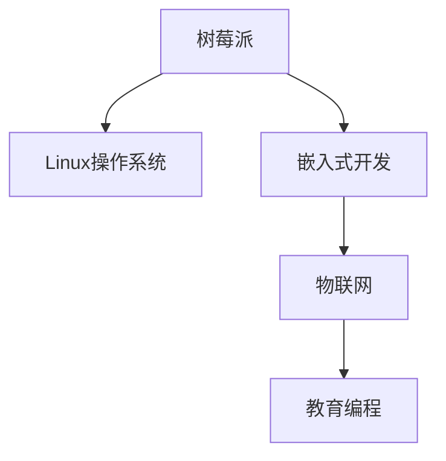

                 

# 树莓派编程：基于 Linux 的单板计算机

> 关键词：树莓派, Linux, 嵌入式开发, 编程, 物联网(IoT), 教育编程

## 1. 背景介绍

### 1.1 问题由来
随着计算机科技的迅猛发展，人们对于计算机硬件的需求不断提升。尤其是对于教育、科研、工业、商业等领域，高性能、易用性、便携性、低成本的单板计算机需求日趋强烈。树莓派(Raspberry Pi)作为一种开源硬件平台，以其低成本、高性能、易于使用等特点，迅速成为了全球硬件爱好者和科研人员的宠儿。

### 1.2 问题核心关键点
树莓派的核心在于其基于Linux操作系统的嵌入式开发平台，具有低功耗、功能丰富、高度可定制化等特点。通过树莓派的编程学习，不仅能够帮助用户掌握硬件和软件编程的基本技能，还能在物联网(IoT)、嵌入式系统等领域中发挥巨大作用。本文将详细介绍树莓派编程的基本原理、核心概念、核心算法以及实际应用，并给出详细代码实例，希望对读者有所帮助。

## 2. 核心概念与联系

### 2.1 核心概念概述

为更好地理解基于 Linux 的树莓派编程，本节将介绍几个密切相关的核心概念：

- 树莓派(Raspberry Pi)：一种基于ARM架构的开源单板计算机，旨在为教育、科研、工业等领域提供低成本、高性能的嵌入式开发平台。
- Linux操作系统：一种自由、免费、开源的类Unix操作系统，能够运行在树莓派等嵌入式硬件平台上，提供了完善的编程环境。
- 嵌入式开发：指在特定的硬件平台上进行软件编程，以实现特定功能的过程。
- 物联网(IoT)：指通过信息感知技术实现物与物、物与人、物与服务间的互联互通，使得各种物体具备网络通信能力，形成庞大的网络系统。
- 教育编程：通过树莓派硬件平台和Linux操作系统，进行编程教育，培养学生的计算机思维和动手能力。

这些核心概念之间的逻辑关系可以通过以下Mermaid流程图来展示：



这个流程图展示了这个体系的核心概念及其之间的关系：

1. 树莓派作为硬件平台，是嵌入式开发的基础。
2. Linux操作系统提供了强大的编程环境，支持多种编程语言和工具。
3. 嵌入式开发结合物联网技术，使得树莓派具备连接各种设备、传感器等的能力。
4. 教育编程通过树莓派平台和嵌入式开发，培养编程兴趣和技能。

这些概念共同构成了树莓派编程的基础，使得树莓派成为教学科研的重要工具，也为物联网、嵌入式系统等领域的开发提供了有力支持。

## 3. 核心算法原理 & 具体操作步骤
### 3.1 算法原理概述

基于 Linux 的树莓派编程，本质上是通过编写程序，实现对树莓派硬件的控制和数据处理。其核心算法包括系统初始化、输入输出控制、中断处理、网络通信等。

具体来说，树莓派编程包括以下几个关键步骤：

1. 系统初始化：初始化硬件设备，包括内存、CPU、外设等。
2. 输入输出控制：控制树莓派的各种输入输出设备，如触摸屏、摄像头、传感器等。
3. 中断处理：处理树莓派接收到的中断信号，实现异步处理。
4. 网络通信：实现树莓派与其他设备的互联互通，包括TCP/IP协议栈、网络驱动程序等。

通过这些关键算法步骤，开发者可以编写高效、稳定的树莓派程序，实现各种功能。

### 3.2 算法步骤详解

基于 Linux 的树莓派编程一般包括以下几个关键步骤：

**Step 1: 环境准备**
- 安装树莓派操作系统。可以从官网下载Raspberry OS镜像，并写入SD卡。
- 安装必要的开发工具。如GCC、make、udev、wifi等。
- 连接树莓派到计算机，通过SSH远程登录。

**Step 2: 编写程序**
- 选择合适的编程语言。树莓派支持C、Python、Raspberry Pi OS自带的Bash脚本等。
- 编写程序实现特定功能。如控制GPIO、读写文件、控制摄像头等。
- 调试程序并优化性能。通过JTAG、串口、网络等调试树莓派程序。

**Step 3: 系统优化**
- 调整内核参数。如修改CPU频率、内存分配、文件系统等，提升树莓派性能。
- 优化输入输出。如使用DMA技术提高读写速度，使用中断处理降低系统负载。
- 配置网络。如设置静态IP、DNS、网关等，实现树莓派与互联网的连接。

**Step 4: 部署应用**
- 编译并生成可执行文件。如使用make、cc等编译程序。
- 安装程序到树莓派。如通过文件系统、SD卡等进行安装。
- 配置运行环境。如设置权限、环境变量等，确保程序正常运行。

完成上述步骤后，即可在树莓派上运行程序，实现各种功能。

### 3.3 算法优缺点

基于 Linux 的树莓派编程方法具有以下优点：
1. 低成本。树莓派硬件成本低廉，且免费操作系统，使得硬件投入大大降低。
2. 高效稳定。Linux操作系统的可靠性及树莓派的高性能，使得程序运行稳定可靠。
3. 可扩展性强。树莓派硬件可扩展性强，支持多种接口和外设，方便开发者进行系统升级和功能扩展。
4. 社区支持。树莓派社区庞大，有大量的资源和社区支持，便于开发者学习与交流。

同时，该方法也存在一定的局限性：
1. 编程门槛较高。Linux操作系统的复杂性及嵌入式编程的特殊性，对编程技能要求较高。
2. 资源受限。树莓派硬件资源有限，如存储、CPU性能等，需合理使用。
3. 开发周期较长。树莓派开发环境搭建复杂，且调试过程繁琐，开发周期较长。
4. 定制化难度高。树莓派硬件及软件定制化难度较高，如需要重新编译内核、编写驱动程序等。

尽管存在这些局限性，但就目前而言，基于 Linux 的树莓派编程仍是大规模嵌入式开发的重要范式。未来相关研究的重点在于如何进一步降低编程门槛，提高开发效率，同时兼顾稳定性和扩展性。

### 3.4 算法应用领域

基于 Linux 的树莓派编程方法，在多个领域已经得到了广泛的应用，包括但不限于以下几个方向：

- 工业控制：树莓派被广泛用于工业自动化、机器人控制、传感器数据采集等领域，具备低成本、高可靠性。
- 智能家居：树莓派被用于智能家居设备的开发，实现智能照明、安防、家电控制等功能。
- 物联网：树莓派被用于物联网设备的连接和数据处理，实现远程监控、智能安防等功能。
- 教育编程：树莓派提供了丰富的硬件接口，支持教育编程，培养学生动手能力和编程思维。
- 科研实验：树莓派被用于科研实验中，实现嵌入式系统设计、图像处理、数据采集等功能。

除了上述这些经典应用外，树莓派编程还被创新性地应用于更多场景中，如可穿戴设备、车联网、智能交通等，为嵌入式系统开发带来了新的可能。

## 4. 数学模型和公式 & 详细讲解 & 举例说明

### 4.1 数学模型构建

树莓派编程涉及的数学模型主要集中在嵌入式系统设计与实现方面。下面以树莓派嵌入式系统为例，展示数学模型构建的过程。

假设树莓派硬件平台上有N个GPIO口，每个GPIO口支持P个状态。树莓派的嵌入式系统可以抽象为一个状态转移系统，其状态集合为 $S=\{s_1,s_2,\dots,s_n\}$，其中 $n$ 表示系统的状态数。系统的状态转移矩阵为 $T$，表示从状态 $s_i$ 转移到状态 $s_j$ 的概率。系统的初始状态为 $s_0$，目标状态为 $s_t$。

基于此模型，我们可以构建以下数学表达式：

$$
\begin{aligned}
\mathcal{L} &= \sum_{i=1}^N \log \sum_{j=1}^P P(i,j) \\
P &= \left\{ \begin{array}{ll}
1, & \text{如果 } T(s_i,s_j) = 1 \\
0, & \text{如果 } T(s_i,s_j) = 0
\end{array} \right.
\end{aligned}
$$

其中，$\mathcal{L}$ 表示系统的对数似然函数，$P(i,j)$ 表示从状态 $s_i$ 转移到状态 $s_j$ 的概率。

### 4.2 公式推导过程

接下来，我们对上述数学模型进行推导。

设树莓派系统初始状态为 $s_0$，目标状态为 $s_t$，系统的状态转移矩阵为 $T$。则从初始状态到目标状态的概率为：

$$
\begin{aligned}
P_{s_0 \rightarrow s_t} &= \prod_{i=1}^t T(s_{i-1},s_i) \\
&= T(s_0,s_1) \cdot T(s_1,s_2) \cdot \ldots \cdot T(s_{t-1},s_t)
\end{aligned}
$$

系统的对数似然函数 $\mathcal{L}$ 为：

$$
\mathcal{L} = \log P_{s_0 \rightarrow s_t} = \log \left( \prod_{i=1}^t T(s_{i-1},s_i) \right) = \sum_{i=1}^t \log T(s_{i-1},s_i)
$$

根据贝叶斯公式，我们有：

$$
P(s_i \mid s_{i-1}) = \frac{T(s_{i-1},s_i)}{\sum_{j=1}^P T(s_{i-1},j)}
$$

将上述表达式带入 $\mathcal{L}$ 中，得到：

$$
\begin{aligned}
\mathcal{L} &= \sum_{i=1}^t \log \frac{T(s_{i-1},s_i)}{\sum_{j=1}^P T(s_{i-1},j)} \\
&= \sum_{i=1}^t \left( \log T(s_{i-1},s_i) - \log \sum_{j=1}^P T(s_{i-1},j) \right)
\end{aligned}
$$

通过上述推导，我们得到了树莓派嵌入式系统的对数似然函数，可用于评估系统的状态转移概率。

### 4.3 案例分析与讲解

以下，我们将以树莓派嵌入式系统为例，给出具体的案例分析与讲解。

假设树莓派系统用于自动化控制，其GPIO口用于控制电机的状态。系统的状态集合为 $\{停止, 正转, 反转\}$，状态转移矩阵 $T$ 如下：

$$
T = \left[ \begin{array}{ccc}
1 & 0.5 & 0.5 \\
0.1 & 0.9 & 0.1 \\
0.1 & 0.9 & 0.1
\end{array} \right]
$$

系统的初始状态为 $s_0=停止$，目标状态为 $s_t=正转$。使用上述数学模型，计算从初始状态到目标状态的概率。

$$
\begin{aligned}
P_{s_0 \rightarrow s_t} &= T(s_0,s_1) \cdot T(s_1,s_2) \cdot T(s_2,s_3) \\
&= 1 \cdot 0.9 \cdot 0.5 \\
&= 0.45
\end{aligned}
$$

对数似然函数 $\mathcal{L}$ 为：

$$
\mathcal{L} = \log 0.45 = -0.8253
$$

通过此计算，我们可以了解到系统从停止状态到正转状态的概率约为0.45，对数似然函数值为-0.8253。

## 5. 项目实践：代码实例和详细解释说明

### 5.1 开发环境搭建

在进行树莓派编程实践前，我们需要准备好开发环境。以下是使用Python进行树莓派开发的环境配置流程：

1. 安装树莓派操作系统。可以从官网下载Raspberry OS镜像，并写入SD卡。
2. 连接树莓派到计算机，通过SSH远程登录。
3. 安装开发工具。如GCC、make、udev、wifi等。

完成上述步骤后，即可在树莓派上编写和运行程序。

### 5.2 源代码详细实现

下面我们以树莓派电机控制为例，给出使用Python语言对树莓派进行编程的代码实现。

首先，定义树莓派GPIO口的初始化函数：

```python
import RPi.GPIO as GPIO
import time

# 初始化GPIO
def init_gpio():
    GPIO.setmode(GPIO.BOARD)
    GPIO.setup(18, GPIO.OUT)
```

然后，定义电机控制函数：

```python
# 控制电机正转
def forward():
    GPIO.output(18, GPIO.HIGH)
    time.sleep(1)
    GPIO.output(18, GPIO.LOW)

# 控制电机反转
def reverse():
    GPIO.output(18, GPIO.LOW)
    time.sleep(1)
    GPIO.output(18, GPIO.HIGH)
```

接着，定义程序运行入口函数：

```python
# 程序入口
def main():
    # 初始化GPIO
    init_gpio()

    # 正转5次，反转5次
    for _ in range(10):
        forward()
        reverse()

    # 清理GPIO
    GPIO.cleanup()

# 运行程序
if __name__ == '__main__':
    main()
```

最后，启动程序并观察电机运行情况：

```python
sudo python3 motor_control.py
```

这样就可以在树莓派上实现电机的正反转控制。通过这段简单的代码，我们可以了解到树莓派编程的基本流程，包括环境搭建、代码编写、调试与运行等。

### 5.3 代码解读与分析

让我们再详细解读一下关键代码的实现细节：

**init_gpio函数**：
- 定义初始化函数，用于设置树莓派GPIO口的模式为BOARD模式，并初始化GPIO口18为输出模式。

**forward和reverse函数**：
- 定义电机正转和反转函数，通过GPIO模块控制GPIO口的高低电平，实现电机的正反转控制。

**main函数**：
- 定义程序入口函数，首先调用初始化函数初始化GPIO，然后通过循环控制电机的正反转，最后调用GPIO清理函数，确保程序结束时GPIO资源被释放。

**if __name__ == '__main__'**：
- 判断程序是否为主模块，若是则调用主函数，确保代码只有在一行被调用时执行。

通过上述代码，我们可以看到树莓派编程的基本流程。从环境搭建到代码编写，再到调试与运行，整个过程涉及了系统调用、文件操作、程序控制等多方面的编程技能。

## 6. 实际应用场景

### 6.1 智能家居

树莓派被广泛应用于智能家居设备的开发，可以实现智能照明、安防、家电控制等功能。例如，树莓派可以通过传感器获取环境数据，通过程序进行数据处理，并通过网络传输到云端服务器进行分析，实现智能家居控制。

### 6.2 工业控制

树莓派在工业控制领域也有广泛应用。树莓派可以用于数据采集、设备监控、自动化控制等功能，与各种传感器、执行器配合使用，实现自动化生产线的智能化管理。

### 6.3 教育编程

树莓派作为教育编程的重要工具，能够帮助学生学习嵌入式系统设计和编程技能。通过树莓派的开发环境，学生可以进行程序编写、硬件连接、系统调试等工作，提升编程能力和动手能力。

### 6.4 未来应用展望

随着树莓派硬件和软件的不断完善，未来的应用场景将更加广阔。

在工业控制领域，树莓派可以与物联网技术结合，实现远程监控、自动化控制等功能，提高生产效率和自动化水平。

在智能家居领域，树莓派可以实现智能安防、能源管理、健康监测等功能，提升家居生活的智能化水平。

在教育编程领域，树莓派可以与多种编程语言和开发环境结合，帮助学生学习计算机科学和电子工程的知识，培养跨学科的创新能力。

## 7. 工具和资源推荐

### 7.1 学习资源推荐

为了帮助开发者系统掌握树莓派编程的理论基础和实践技巧，这里推荐一些优质的学习资源：

1. 《Raspberry Pi用户手册》：官方文档，详细介绍树莓派硬件和软件的使用方法。
2. 《Raspberry Pi嵌入式编程》书籍：详细讲解树莓派编程的基本原理和实现方法，包括硬件设计、程序编写、调试等。
3. 树莓派社区：提供丰富的教程和开发资源，是学习树莓派编程的重要平台。
4. GitHub上的树莓派项目：汇集了大量的树莓派项目源码，适合学习和参考。
5. Udemy上的树莓派课程：提供视频教程和项目实战，帮助开发者快速入门。

通过这些资源的学习实践，相信你一定能够快速掌握树莓派编程的基本技能，并用于解决实际的树莓派问题。

### 7.2 开发工具推荐

高效的开发离不开优秀的工具支持。以下是几款用于树莓派编程的常用工具：

1. Python：支持跨平台开发，适合编写各种类型的程序。
2. GitHub：版本控制工具，方便代码的分享、协作和版本管理。
3. PyCharm：Python的IDE开发环境，提供丰富的调试和开发功能。
4. JTAG：调试树莓派程序的工具，可以实时监测程序运行状态。
5. Serial Monitor：串口调试工具，方便查看和调试树莓派的输出信息。

合理利用这些工具，可以显著提升树莓派编程的开发效率，加快创新迭代的步伐。

### 7.3 相关论文推荐

树莓派编程的发展源于学界的持续研究。以下是几篇奠基性的相关论文，推荐阅读：

1. Raspberry Pi, A minimal computer for everyone：介绍树莓派硬件设计及其应用。
2. Programming Raspberry Pi：介绍树莓派操作系统及编程环境，适合入门者学习。
3. Raspberry Pi Prototyping: A hands-on guide to prototyping your projects with Raspberry Pi：详细讲解树莓派硬件设计和程序开发的过程。
4. The Raspberry Pi as a tool for curriculum development：探讨树莓派在课程开发中的作用。

这些论文代表了大语言模型微调技术的发展脉络。通过学习这些前沿成果，可以帮助研究者把握学科前进方向，激发更多的创新灵感。

## 8. 总结：未来发展趋势与挑战

### 8.1 总结

本文对基于 Linux 的树莓派编程方法进行了全面系统的介绍。首先阐述了树莓派的核心硬件平台、Linux操作系统以及嵌入式开发等关键概念，明确了树莓派编程在工业控制、智能家居、教育编程等领域的重要应用。其次，从原理到实践，详细讲解了树莓派编程的基本流程、核心算法以及代码实现，给出了树莓派编程的完整代码实例。最后，本文还广泛探讨了树莓派编程在多个领域的应用前景，展示了树莓派编程的巨大潜力。

通过本文的系统梳理，可以看到，树莓派编程作为嵌入式系统开发的强大工具，以其低成本、高可靠性、可扩展性等特点，得到了广泛的应用。未来的发展趋势是，树莓派将与物联网技术、人工智能技术等更多新兴技术进行深度融合，为嵌入式系统开发带来新的突破。

### 8.2 未来发展趋势

展望未来，树莓派编程技术将呈现以下几个发展趋势：

1. 低功耗。树莓派硬件将继续优化功耗设计，支持更多功耗模式，进一步降低能耗。
2. 高性能。树莓派硬件性能将继续提升，支持更多高精度传感器和智能设备。
3. 高集成度。树莓派硬件将进一步集成化，支持更多的外设接口和功能。
4. 易用性。树莓派软件将更加友好易用，提供更多开发环境和工具支持。
5. 自动化开发。通过引入自动生成代码和自动化测试等工具，提高树莓派程序开发效率。
6. 跨平台支持。树莓派编程将支持更多操作系统和编程语言，拓展开发者的选择。

以上趋势凸显了树莓派编程技术的广阔前景。这些方向的探索发展，将进一步提升树莓派的性能和功能，为嵌入式系统开发提供更加强大的平台支持。

### 8.3 面临的挑战

尽管树莓派编程技术已经取得了一定的成就，但在迈向更加智能化、普适化应用的过程中，它仍面临着诸多挑战：

1. 硬件资源限制。树莓派硬件资源有限，如存储、CPU性能等，需合理使用。
2. 编程门槛较高。树莓派编程涉及嵌入式系统设计、Linux操作系统的使用，对编程技能要求较高。
3. 开发效率较低。树莓派开发环境搭建复杂，且调试过程繁琐，开发周期较长。
4. 应用场景受限。树莓派在特定领域的应用场景仍较为有限，需要更多实际应用场景的拓展。
5. 安全防护不足。树莓派系统安全性较低，易受到恶意攻击，需加强安全防护措施。

尽管存在这些挑战，但树莓派编程仍是大规模嵌入式开发的重要范式。未来相关研究的重点在于如何进一步降低编程门槛，提高开发效率，同时兼顾稳定性和扩展性。

### 8.4 研究展望

面对树莓派编程所面临的种种挑战，未来的研究需要在以下几个方面寻求新的突破：

1. 开发更加易用的开发环境，提高开发者编程效率。
2. 引入更多开源库和框架，提供更丰富的编程工具。
3. 加强树莓派硬件的设计和优化，提升性能和可靠性。
4. 拓展树莓派编程的应用场景，推动树莓派向工业自动化、智能家居等领域拓展。
5. 加强树莓派的安全防护措施，提高系统的安全性。

这些研究方向的探索，必将引领树莓派编程技术迈向更高的台阶，为嵌入式系统开发带来新的突破。面向未来，树莓派编程技术还需要与其他人工智能技术进行更深入的融合，多路径协同发力，共同推动嵌入式系统开发技术的进步。只有勇于创新、敢于突破，才能真正实现树莓派编程技术的突破。

## 9. 附录：常见问题与解答

**Q1: 树莓派硬件资源有限，如何优化系统性能？**

A: 优化树莓派硬件性能，主要从以下几个方面入手：

1. 硬件升级。可以通过增加内存、更换硬盘等方式，提升树莓派的硬件配置。
2. 软件优化。优化程序代码，减少资源消耗，提高系统效率。
3. 程序并行化。利用多线程、多进程等技术，提高程序的并发处理能力。
4. 驱动程序优化。优化驱动程序的性能，减少中断处理时间，提高系统响应速度。

通过这些优化措施，可以有效提升树莓派的性能和稳定性。

**Q2: 树莓派开发环境搭建复杂，如何提高开发效率？**

A: 提高树莓派开发效率，主要从以下几个方面入手：

1. 自动化工具。引入自动化工具，如JTAG调试、代码生成器、自动化测试等，减少手动调试和测试时间。
2. 模块化开发。将树莓派程序模块化开发，提高代码复用性和开发效率。
3. 预编译代码。预编译树莓派程序，减少编译时间，提高程序运行速度。
4. 高效开发工具。使用高效的开发工具，如PyCharm、GitHub等，提升开发效率。

通过这些优化措施，可以有效提升树莓派程序的开发效率。

**Q3: 树莓派编程的应用场景受限，如何拓展应用范围？**

A: 拓展树莓派编程的应用场景，主要从以下几个方面入手：

1. 学习更多编程语言和开发环境。树莓派支持多种编程语言和开发环境，可以学习更多编程技能，拓展应用场景。
2. 结合物联网技术。树莓派可以与物联网技术结合，拓展更多应用场景，如智能家居、智能监控等。
3. 开发更多实用应用。开发更多实用的树莓派程序，如智能门锁、智能音箱、机器人等，拓展应用场景。
4. 引入更多开源库和框架。引入更多开源库和框架，提高程序开发效率和功能实现。

通过这些措施，可以有效拓展树莓派编程的应用范围，推动树莓派编程技术的发展。

---

作者：禅与计算机程序设计艺术 / Zen and the Art of Computer Programming

