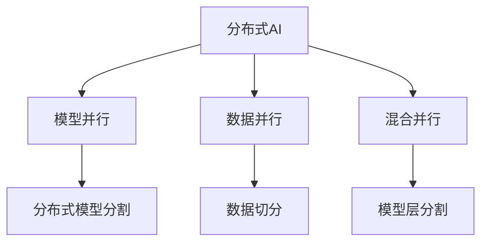

                 

# 模型并行vs数据并行：分布式AI训练策略

> 关键词：分布式AI,模型并行,数据并行,混合并行,TensorFlow,PyTorch,深度学习

## 1. 背景介绍

随着深度学习技术的快速发展，大规模模型和数据集的应用变得越来越普遍，这对分布式AI训练提出了更高的要求。传统的单节点训练已经无法满足日益增长的计算需求。在分布式训练中，模型并行（Model Parallelism）和数据并行（Data Parallelism）是两种常见的策略，每一种策略都有其适用的场景和优缺点。

### 1.1 问题由来

在深度学习模型训练过程中，计算资源和数据量的增加带来了单节点训练效率低下的问题。分布式训练应运而生，旨在通过并行化训练过程来提升训练效率。而模型并行和数据并行是两种主要的并行化策略。

- **模型并行**：指将一个大型模型分割成多个小模型，每个小模型在不同的节点上并行训练。
- **数据并行**：指将整个训练数据集分割成多个子集，每个子集在不同的节点上并行训练。

### 1.2 问题核心关键点

选择模型并行或数据并行需要根据具体任务、模型大小、数据分布等因素综合考虑。模型并行适合处理大规模模型，数据并行适合处理大规模数据集。同时，还需要考虑并行度、通信开销、同步策略等关键因素。

## 2. 核心概念与联系

### 2.1 核心概念概述

为更好地理解模型并行和数据并行的原理与区别，本节将介绍几个核心概念：

- **分布式AI（Distributed AI）**：指通过多台计算机协同工作，实现深度学习模型的分布式训练。分布式AI的目标是提高训练效率和模型性能。
- **模型并行（Model Parallelism）**：指将一个大型模型分割成多个小模型，每个小模型在不同的节点上并行训练。适用于大规模模型，但通信开销较大。
- **数据并行（Data Parallelism）**：指将整个训练数据集分割成多个子集，每个子集在不同的节点上并行训练。适用于大规模数据集，但模型加载和更新开销较大。
- **混合并行（Hybrid Parallelism）**：结合模型并行和数据并行，以发挥两者的优势。通常将模型分割成若干层，每层在不同的节点上并行训练，而数据集在各个节点之间共享。

这些概念之间的逻辑关系可以通过以下Mermaid流程图来展示：



这个流程图展示了大规模深度学习模型训练的不同并行策略：

1. 分布式AI通过多台计算机协同训练，提升效率。
2. 模型并行将大模型分割为多个小模型，各节点并行训练。
3. 数据并行将数据集分割成多个子集，各节点并行训练。
4. 混合并行结合了模型并行和数据并行，进一步提升训练效率。

## 3. 核心算法原理 & 具体操作步骤
### 3.1 算法原理概述

模型并行和数据并行都是通过并行化训练过程，来提升深度学习模型的训练效率。其主要区别在于数据和模型的分割方式以及各节点之间的通信和同步策略。

- **模型并行**：适用于大规模模型，通过将模型分割为多个子模型，每个子模型在不同的节点上并行训练，以达到并行加速的效果。
- **数据并行**：适用于大规模数据集，通过将数据集分割为多个子集，每个子集在不同的节点上并行训练，以达到并行加速的效果。

两种并行策略的具体操作方式如下：

### 3.2 算法步骤详解

#### 3.2.1 模型并行

模型并行的主要步骤如下：

1. **模型分割**：将模型分割为若干个子模型，每个子模型在不同的节点上并行训练。通常将模型的层数或深度分割为多个，以减少通信开销。

2. **数据切分**：将训练数据集分割为若干个子集，每个子集在不同的节点上并行训练。子集的大小和分布需要根据节点数量和模型大小进行合理设计。

3. **节点同步**：在每个子模型训练完成后，各节点之间进行通信，更新模型参数和梯度。通常使用异步通信或同步通信策略。

4. **合并模型**：将各节点的子模型合并为完整的模型，更新全局模型参数。

5. **优化策略**：针对模型并行引入优化策略，如梯度压缩、模型蒸馏等，进一步提升训练效率。

#### 3.2.2 数据并行

数据并行的主要步骤如下：

1. **数据切分**：将训练数据集分割为若干个子集，每个子集在不同的节点上并行训练。子集的大小和分布需要根据节点数量和数据集大小进行合理设计。

2. **模型同步**：在每个节点上，将训练数据集的不同部分输入模型，更新模型参数和梯度。通常使用异步通信或同步通信策略。

3. **模型合并**：将各节点的模型参数合并为完整的模型，更新全局模型参数。

4. **优化策略**：针对数据并行引入优化策略，如梯度压缩、模型蒸馏等，进一步提升训练效率。

### 3.3 算法优缺点

模型并行和数据并行各有优缺点，需要根据具体任务和资源情况进行选择：

#### 3.3.1 模型并行的优缺点

**优点**：

- **适用于大规模模型**：模型并行适用于处理具有大量参数的大型模型，可以有效利用计算资源。
- **通信开销小**：由于模型并行是将模型分割成多个子模型，各节点之间的通信开销较小。

**缺点**：

- **复杂度高**：模型并行需要设计复杂的模型分割策略和通信协议，增加了系统的复杂性。
- **同步开销大**：模型并行需要在子模型之间进行同步，增加了同步开销。

#### 3.3.2 数据并行的优缺点

**优点**：

- **通信开销小**：数据并行将数据集分割成多个子集，各节点之间的通信开销较小。
- **简单易用**：数据并行易于实现和调试，适用于大多数深度学习模型。

**缺点**：

- **内存开销大**：数据并行需要在每个节点上加载和存储数据集，内存开销较大。
- **同步开销大**：数据并行需要在各个节点之间进行数据同步，增加了同步开销。

### 3.4 算法应用领域

模型并行和数据并行在深度学习训练中得到了广泛应用，适用于多种不同的任务和模型。

- **计算机视觉**：在大规模图像分类、目标检测等任务中，模型并行和数据并行都有广泛应用。
- **自然语言处理**：在处理大规模文本分类、语言模型训练等任务时，模型并行和数据并行同样发挥了重要作用。
- **语音识别**：在处理大规模语音识别任务时，模型并行和数据并行也是常见的方法。
- **推荐系统**：在大规模推荐系统中，模型并行和数据并行被用于提升推荐模型的训练效率。
- **强化学习**：在训练大规模强化学习模型时，模型并行和数据并行都有广泛应用。

## 4. 数学模型和公式 & 详细讲解 & 举例说明

### 4.1 数学模型构建

在大规模深度学习模型训练中，模型并行和数据并行的数学模型可以表示如下：

- **模型并行**：将模型分割为 $M$ 个子模型，每个子模型在不同的节点上并行训练。假设模型参数为 $\theta = (\theta_1, \theta_2, ..., \theta_M)$，则每个子模型在节点上的训练过程可以表示为：
  $$
  \theta_i = \theta_i - \eta \nabla_{\theta_i} \mathcal{L}(\theta_i, \mathcal{D}_i)
  $$
  其中 $\eta$ 为学习率，$\mathcal{L}$ 为损失函数，$\mathcal{D}_i$ 为节点 $i$ 上的数据集。

- **数据并行**：将训练数据集 $\mathcal{D}$ 分割为 $N$ 个子集，每个子集在不同的节点上并行训练。假设模型参数为 $\theta$，则每个节点在数据集上的训练过程可以表示为：
  $$
  \theta = \theta - \eta \nabla_{\theta} \mathcal{L}(\theta, \mathcal{D})
  $$

### 4.2 公式推导过程

以下我们以一个简单的二分类任务为例，推导模型并行和数据并行的公式。

假设模型 $M_{\theta}$ 在输入 $x$ 上的输出为 $\hat{y}=M_{\theta}(x)$，表示样本属于正类的概率。真实标签 $y \in \{0,1\}$。则二分类交叉熵损失函数定义为：
$$
\ell(M_{\theta}(x),y) = -[y\log \hat{y} + (1-y)\log (1-\hat{y})]
$$

在模型并行中，假设模型被分割为 $M$ 个子模型 $M_{\theta_1}, M_{\theta_2}, ..., M_{\theta_M}$，每个子模型在各自节点上训练。则每个子模型的损失函数可以表示为：
$$
\mathcal{L}_i(\theta_i) = \frac{1}{N}\sum_{i=1}^N \ell(M_{\theta_i}(x_i),y_i)
$$

在数据并行中，假设训练数据集 $\mathcal{D}$ 被分割为 $N$ 个子集 $\mathcal{D}_1, \mathcal{D}_2, ..., \mathcal{D}_N$，每个子集在不同的节点上并行训练。则每个节点的损失函数可以表示为：
$$
\mathcal{L}(\theta) = \frac{1}{N}\sum_{i=1}^N \ell(M_{\theta}(x_i),y_i)
$$

通过对比可以看出，模型并行和数据并行的损失函数形式类似，但子模型的训练方式和数据切分方式有所不同。

### 4.3 案例分析与讲解

以一个简单的图像分类任务为例，来分析模型并行和数据并行的具体实现。

假设我们有一个大规模的图像分类任务，需要训练一个卷积神经网络（CNN）模型。我们将模型分为四个子模型，每个子模型在不同的节点上并行训练。同时，我们将数据集分割为四个子集，每个子集在不同的节点上并行训练。

**模型并行实现**：

1. 将卷积神经网络模型分为四个子模型，分别在四个节点上训练。
2. 将数据集分割为四个子集，每个子集在不同的节点上并行训练。
3. 在每个节点上，分别计算损失函数并更新模型参数。
4. 节点之间进行通信，更新全局模型参数。

**数据并行实现**：

1. 将训练数据集分割为四个子集，每个子集在不同的节点上并行训练。
2. 在每个节点上，将数据集的不同部分输入模型，计算损失函数并更新模型参数。
3. 节点之间进行通信，更新全局模型参数。

通过上述分析，可以看到，模型并行和数据并行在实现上有显著的区别，需要根据具体任务和资源情况进行选择。

## 5. 项目实践：代码实例和详细解释说明
### 5.1 开发环境搭建

在进行分布式AI训练前，我们需要准备好开发环境。以下是使用TensorFlow和PyTorch进行分布式训练的环境配置流程：

1. 安装Anaconda：从官网下载并安装Anaconda，用于创建独立的Python环境。

2. 创建并激活虚拟环境：
```bash
conda create -n tf-env python=3.8 
conda activate tf-env
```

3. 安装TensorFlow和PyTorch：根据CUDA版本，从官网获取对应的安装命令。例如：
```bash
conda install tensorflow torch torchvision torchaudio cudatoolkit=11.1 -c pytorch -c conda-forge
```

4. 安装分布式训练相关工具包：
```bash
pip install apex horovod tensorboard
```

5. 安装各类工具包：
```bash
pip install numpy pandas scikit-learn matplotlib tqdm jupyter notebook ipython
```

完成上述步骤后，即可在`tf-env`环境中开始分布式训练实践。

### 5.2 源代码详细实现

这里我们以使用TensorFlow进行模型并行训练为例，给出完整的代码实现。

首先，定义模型和优化器：

```python
import tensorflow as tf
from tensorflow.keras import layers

model = tf.keras.Sequential([
    layers.Conv2D(32, 3, activation='relu', input_shape=(28, 28, 1)),
    layers.MaxPooling2D(2),
    layers.Conv2D(64, 3, activation='relu'),
    layers.MaxPooling2D(2),
    layers.Flatten(),
    layers.Dense(64, activation='relu'),
    layers.Dense(10)
])

optimizer = tf.keras.optimizers.Adam(learning_rate=0.001)
```

然后，定义分布式训练的相关参数：

```python
import horovod.tensorflow as hvd

hvd.init()
rank = hvd.rank()
world_size = hvd.size()

batch_size = 32 * world_size // 2
train_dataset = tf.data.Dataset.from_tensor_slices((x_train, y_train))
train_dataset = train_dataset.batch(batch_size).shuffle(10000).repeat()
```

接着，定义模型并行的训练函数：

```python
import os

def train_epoch(model, dataset, batch_size, optimizer, num_steps):
    for i in range(num_steps):
        with tf.GradientTape() as tape:
            for batch in dataset:
                features, labels = batch
                with tf.distribute.Strategy.scope():
                    predictions = model(features, training=True)
                    loss = tf.keras.losses.SparseCategoricalCrossentropy()(labels, predictions)
                    gradients = tape.gradient(loss, model.trainable_variables)
        if rank == 0:
            print(f'Step {i}, Loss: {loss.numpy()}, Accuracy: {tf.keras.metrics.SparseCategoricalAccuracy()(labels, predictions).numpy()}')
        optimizer.apply_gradients(zip(gradients, model.trainable_variables))
```

最后，启动分布式训练并输出训练结果：

```python
train_epoch(model, train_dataset, batch_size, optimizer, num_steps=10000)
```

### 5.3 代码解读与分析

让我们再详细解读一下关键代码的实现细节：

**train_epoch函数**：
- 通过TensorFlow的分布式策略，定义模型在分布式环境下的计算图。
- 在每个节点上，依次处理数据集中的批次数据。
- 计算损失函数和梯度，并更新模型参数。
- 在每个节点上，输出当前的损失和准确率，以供监控。

**horovod库**：
- 通过HOROVOD库，实现了跨节点的异步通信和同步机制。
- 在分布式训练中，各节点之间不需要进行频繁的同步操作，提高了训练效率。

**TensorBoard**：
- 使用TensorBoard工具，对训练过程中的指标进行可视化，方便监控和调试。

可以看到，TensorFlow和HOROVOD的结合，使得模型并行的分布式训练变得简单高效。开发者可以根据具体任务，灵活调整并行度和同步策略，以达到最优的训练效果。

## 6. 实际应用场景
### 6.1 计算机视觉

模型并行和数据并行在计算机视觉领域得到了广泛应用。例如，在大规模图像分类任务中，可以使用模型并行来处理大型卷积神经网络模型，提高训练效率。在处理大规模数据集时，可以使用数据并行来加速训练过程。

### 6.2 自然语言处理

在自然语言处理领域，模型并行和数据并行同样具有重要应用。例如，在处理大规模文本分类任务时，可以使用模型并行来加速模型训练，提高分类精度。在处理大规模语料库时，可以使用数据并行来加速模型训练，提高处理速度。

### 6.3 推荐系统

在大规模推荐系统中，模型并行和数据并行被用于提升推荐模型的训练效率。例如，可以使用模型并行来处理大型深度学习模型，提高模型训练速度。在处理大规模推荐数据时，可以使用数据并行来加速训练过程。

### 6.4 未来应用展望

随着深度学习模型的不断增大和数据量的不断增加，分布式AI训练将成为常态。未来，基于模型并行和数据并行的分布式AI训练将在更多领域得到应用，为大规模模型的训练和应用提供保障。

在智慧医疗领域，分布式AI训练可以被用于加速医疗影像的诊断和分析，提高医疗服务的智能化水平。

在智能制造领域，分布式AI训练可以被用于加速生产过程的优化和预测，提高生产效率。

在智能交通领域，分布式AI训练可以被用于加速交通数据的分析和处理，提高交通管理的智能化水平。

总之，分布式AI训练将为各个领域的智能化升级提供强大的技术支持，推动人工智能技术的广泛应用。

## 7. 工具和资源推荐
### 7.1 学习资源推荐

为了帮助开发者系统掌握分布式AI训练的理论基础和实践技巧，这里推荐一些优质的学习资源：

1. 《深度学习分布式训练》系列博文：由大模型技术专家撰写，深入浅出地介绍了分布式AI训练的基本概念和实现方法。

2. 《TensorFlow分布式训练》官方文档：TensorFlow官方文档，详细介绍了分布式训练的实现方式和优化策略。

3. 《PyTorch分布式训练》官方文档：PyTorch官方文档，详细介绍了分布式训练的实现方式和优化策略。

4. 《Horovod用户手册》：Horovod官方文档，详细介绍了Horovod库的使用方法和优化策略。

5. 《PyTorch Lightning分布式训练》官方文档：PyTorch Lightning官方文档，详细介绍了PyTorch Lightning在分布式训练中的应用。

通过对这些资源的学习实践，相信你一定能够快速掌握分布式AI训练的精髓，并用于解决实际的深度学习问题。

### 7.2 开发工具推荐

高效的分布式AI训练离不开优秀的工具支持。以下是几款用于分布式AI训练开发的常用工具：

1. TensorFlow：基于Python的开源深度学习框架，支持分布式训练，适合大规模工程应用。

2. PyTorch：基于Python的开源深度学习框架，支持分布式训练，适合快速迭代研究。

3. Horovod：支持多种深度学习框架的分布式训练工具，提供了丰富的优化策略和通信机制。

4. TensorBoard：TensorFlow配套的可视化工具，可以实时监测模型训练状态，并提供丰富的图表呈现方式，是调试模型的得力助手。

5. PyTorch Lightning：基于PyTorch的分布式训练工具，提供了便捷的API接口和丰富的优化策略。

合理利用这些工具，可以显著提升分布式AI训练的开发效率，加快创新迭代的步伐。

### 7.3 相关论文推荐

分布式AI训练技术的发展源于学界的持续研究。以下是几篇奠基性的相关论文，推荐阅读：

1. Scaling Deep Neural Networks: A Comprehensive Survey of Deep Neural Network Scaling Laws（大规模深度学习训练综述）：详细介绍了深度学习训练中的分布式训练方法。

2. Large-Scale Distributed Deep Learning with Missing Features: A Comprehensive Survey（分布式深度学习缺失特征综述）：介绍了分布式深度学习中缺失特征的处理方法。

3. Model Parallelism in Distributed Deep Learning: A Survey（分布式深度学习模型并行综述）：介绍了模型并行在分布式深度学习中的应用。

4. Data Parallelism in Distributed Deep Learning: A Survey（分布式深度学习数据并行综述）：介绍了数据并行在分布式深度学习中的应用。

5. Optimizing Distributed Deep Learning（优化分布式深度学习）：介绍了分布式深度学习中的优化策略和通信机制。

这些论文代表了大规模深度学习分布式训练的发展脉络。通过学习这些前沿成果，可以帮助研究者把握学科前进方向，激发更多的创新灵感。

## 8. 总结：未来发展趋势与挑战

### 8.1 总结

本文对基于模型并行和数据并行的分布式AI训练方法进行了全面系统的介绍。首先阐述了分布式AI训练的背景和意义，明确了分布式训练在提升训练效率和模型性能方面的独特价值。其次，从原理到实践，详细讲解了模型并行和数据并行的数学模型和关键步骤，给出了分布式训练任务开发的完整代码实例。同时，本文还广泛探讨了分布式AI训练在计算机视觉、自然语言处理、推荐系统等多个领域的应用前景，展示了分布式训练范式的巨大潜力。此外，本文精选了分布式训练技术的各类学习资源，力求为读者提供全方位的技术指引。

通过本文的系统梳理，可以看到，分布式AI训练技术正在成为深度学习训练的重要范式，极大地拓展了深度学习模型的应用边界，催生了更多的落地场景。受益于分布式训练方法的持续演进，深度学习技术将在更广阔的应用领域大放异彩。未来，伴随深度学习模型的不断增大和数据量的不断增加，分布式AI训练将迎来更多的突破，为各个领域的智能化升级提供强大的技术支持。

### 8.2 未来发展趋势

展望未来，分布式AI训练技术将呈现以下几个发展趋势：

1. 大规模分布式训练：随着深度学习模型的不断增大和数据量的不断增加，分布式AI训练将变得更加普及和高效。大规模分布式训练将使深度学习模型训练效率和性能显著提升。

2. 混合并行范式：结合模型并行和数据并行的混合并行范式将逐渐成为主流，充分发挥两种并行策略的优势，提升训练效率和模型性能。

3. 异构分布式训练：未来，异构分布式训练（即不同类型硬件（如CPU、GPU、TPU等）混合部署的分布式训练）将成为重要方向，充分利用异构硬件的计算能力，提升训练效率。

4. 自动化和自适应训练：分布式AI训练将向自动化和自适应方向发展，通过自适应优化和自动化调度，提高训练效率和模型性能。

5. 多任务分布式训练：多任务分布式训练（即在一个分布式系统中同时训练多个相关任务）将成为重要方向，实现资源共享和高效协同，提升训练效率和模型性能。

6. 联邦学习：联邦学习（即分布式训练在多个本地数据集上的分布式训练）将成为重要方向，保护用户隐私的同时，提高模型的泛化能力。

以上趋势凸显了分布式AI训练技术的广阔前景。这些方向的探索发展，必将进一步提升深度学习模型的训练效率和性能，为各个领域的智能化升级提供强大的技术支持。

### 8.3 面临的挑战

尽管分布式AI训练技术已经取得了瞩目成就，但在迈向更加智能化、普适化应用的过程中，它仍面临着诸多挑战：

1. 通信开销高：在大规模分布式训练中，节点之间的通信开销成为主要瓶颈。如何降低通信开销，提高数据传输效率，是一个重要挑战。

2. 同步开销大：在分布式训练中，节点之间的同步开销较大，如何减少同步次数，提高训练效率，是一个重要挑战。

3. 异构硬件管理：异构分布式训练中，不同类型的硬件设备管理和调度是一个复杂问题，如何高效利用异构硬件资源，是一个重要挑战。

4. 模型和数据传输：在大规模分布式训练中，模型和数据的传输是一个重要瓶颈，如何优化模型和数据的传输效率，是一个重要挑战。

5. 稳定性与可靠性：在分布式训练中，系统的稳定性和可靠性是一个重要问题，如何设计高效可靠的分布式训练系统，是一个重要挑战。

6. 模型鲁棒性和泛化能力：分布式训练中的模型鲁棒性和泛化能力也是一个重要问题，如何提高模型的泛化能力和鲁棒性，是一个重要挑战。

正视分布式AI训练面临的这些挑战，积极应对并寻求突破，将是分布式AI训练技术走向成熟的必由之路。相信随着学界和产业界的共同努力，这些挑战终将一一被克服，分布式AI训练必将在构建人机协同的智能时代中扮演越来越重要的角色。

### 8.4 研究展望

面对分布式AI训练所面临的种种挑战，未来的研究需要在以下几个方面寻求新的突破：

1. 研究高效的分布式训练算法：开发高效的分布式训练算法，如异步通信、多任务分布式训练、联邦学习等，提高训练效率和模型性能。

2. 引入先进的优化策略：引入先进的优化策略，如模型蒸馏、梯度压缩等，进一步提升分布式训练的效率和效果。

3. 优化通信开销：优化通信开销，如使用深度压缩、异步通信等技术，减少通信开销，提高训练效率。

4. 引入异构硬件管理策略：引入异构硬件管理策略，如资源池调度、多核并发等，充分利用异构硬件资源。

5. 引入数据并行和模型并行混合策略：引入数据并行和模型并行的混合策略，充分发挥两种并行策略的优势，提升训练效率和模型性能。

6. 研究联邦学习：研究联邦学习技术，实现分布式训练在多个本地数据集上的协同训练，保护用户隐私的同时提高模型性能。

这些研究方向的探索，必将引领分布式AI训练技术迈向更高的台阶，为构建安全、可靠、高效、可解释的智能系统铺平道路。面向未来，分布式AI训练技术还需要与其他人工智能技术进行更深入的融合，如知识表示、因果推理、强化学习等，多路径协同发力，共同推动人工智能技术的进步。只有勇于创新、敢于突破，才能不断拓展深度学习模型的边界，让智能技术更好地造福人类社会。

## 9. 附录：常见问题与解答

**Q1：分布式AI训练中，数据并行和模型并行各有哪些优缺点？**

A: 数据并行和模型并行各有优缺点，需要根据具体任务和资源情况进行选择。

数据并行的优点包括：

- **适用于大规模数据集**：数据并行适用于处理大规模数据集，可以有效利用计算资源。
- **简单易用**：数据并行易于实现和调试，适用于大多数深度学习模型。

数据并行的缺点包括：

- **内存开销大**：数据并行需要在每个节点上加载和存储数据集，内存开销较大。
- **同步开销大**：数据并行需要在各个节点之间进行数据同步，增加了同步开销。

模型并行的优点包括：

- **适用于大规模模型**：模型并行适用于处理具有大量参数的大型模型，可以有效利用计算资源。
- **通信开销小**：模型并行是将模型分割成多个子模型，各节点之间的通信开销较小。

模型并行的缺点包括：

- **复杂度高**：模型并行需要设计复杂的模型分割策略和通信协议，增加了系统的复杂性。
- **同步开销大**：模型并行需要在子模型之间进行同步，增加了同步开销。

**Q2：在分布式训练中，如何选择数据并行和模型并行的混合策略？**

A: 在分布式训练中，通常会根据具体任务和资源情况选择数据并行和模型并行的混合策略。具体选择如下：

1. 对于数据密集型任务，如大规模图像分类、大规模文本分类等，通常选择数据并行。

2. 对于模型密集型任务，如大型卷积神经网络、大型循环神经网络等，通常选择模型并行。

3. 对于混合密集型任务，如计算机视觉中的卷积神经网络和自然语言处理中的循环神经网络等，通常选择混合并行，将模型分割成若干层，每层在不同的节点上并行训练，而数据集在各个节点之间共享。

4. 对于资源受限的分布式训练系统，可以选择数据并行和模型并行的混合策略，以平衡计算资源和通信开销。

总之，选择合适的混合策略需要综合考虑任务类型、模型大小、数据量、硬件资源等多个因素，以达到最优的训练效果。

**Q3：在分布式训练中，如何处理模型参数和数据的传输？**

A: 在分布式训练中，处理模型参数和数据的传输是一个重要问题，通常有以下几种方法：

1. 使用TensorFlow、PyTorch等深度学习框架提供的分布式训练API，可以自动处理模型参数和数据的传输。

2. 使用Horovod等分布式训练库，可以提供高效的模型参数和数据传输机制，降低通信开销。

3. 使用自定义的通信协议，如MPI、Gloo等，可以手动控制模型参数和数据的传输过程，提高传输效率。

4. 使用异步通信机制，可以在训练过程中异步传输模型参数和数据，减少通信开销。

5. 使用多级存储机制，如Hadoop、Ceph等，可以在分布式系统中实现高效的数据存储和传输。

总之，合理处理模型参数和数据的传输，是分布式训练中的重要问题，需要根据具体任务和系统情况选择合适的方法。

**Q4：在分布式训练中，如何处理节点之间的同步？**

A: 在分布式训练中，节点之间的同步是一个重要问题，通常有以下几种方法：

1. 使用同步通信机制，如Allreduce、Ringallreduce等，可以在每个节点上同步模型参数和梯度。

2. 使用异步通信机制，可以在训练过程中异步更新模型参数和梯度，减少同步开销。

3. 使用分布式深度学习框架，如TensorFlow、PyTorch等，可以自动处理节点之间的同步过程。

4. 使用Horovod等分布式训练库，可以提供高效的同步机制，降低同步开销。

5. 使用自定义的同步协议，如Paxos、Raft等，可以在分布式系统中实现高效同步。

总之，合理处理节点之间的同步，是分布式训练中的重要问题，需要根据具体任务和系统情况选择合适的方法。

**Q5：在分布式训练中，如何处理模型蒸馏和梯度压缩？**

A: 在分布式训练中，模型蒸馏和梯度压缩是两种常用的优化策略，可以提高训练效率和模型性能。

模型蒸馏是指在大规模模型和小规模模型之间进行知识蒸馏，将大规模模型的知识传递给小规模模型。模型蒸馏通常通过以下步骤实现：

1. 在大规模模型和小规模模型之间进行迁移学习，使小规模模型学习大规模模型的知识。

2. 在大规模模型和小规模模型之间进行蒸馏，将大规模模型的输出作为小规模模型的目标输出，进行训练。

3. 在大规模模型和小规模模型之间进行微调，进一步优化小规模模型的性能。

梯度压缩是指在大规模模型中使用低精度参数，降低内存消耗和通信开销。梯度压缩通常通过以下步骤实现：

1. 在大规模模型中使用低精度参数，如浮点数精度降低、整数量化等。

2. 在大规模模型中使用梯度压缩算法，如浮点数截断、梯度量化等。

3. 在大规模模型中使用混合精度训练，如FP16、FP32等。

总之，模型蒸馏和梯度压缩是分布式训练中的重要优化策略，可以提高训练效率和模型性能，需要根据具体任务和系统情况选择合适的方法。

**Q6：在分布式训练中，如何处理异构硬件管理？**

A: 在分布式训练中，异构硬件管理是一个复杂问题，通常有以下几种方法：

1. 使用异构分布式训练框架，如PyTorch Lightning、DeepSpeed等，可以自动处理异构硬件管理。

2. 使用自定义的资源池调度策略，可以在不同硬件设备之间进行资源分配和调度。

3. 使用多核并发机制，可以在同一个硬件设备上进行并行计算。

4. 使用GPU/GPU混合计算，可以在不同GPU设备之间进行数据传输和计算。

5. 使用CPU/GPU混合计算，可以在CPU和GPU设备之间进行数据传输和计算。

总之，合理处理异构硬件管理，是分布式训练中的重要问题，需要根据具体任务和系统情况选择合适的方法。

---

作者：禅与计算机程序设计艺术 / Zen and the Art of Computer Programming

