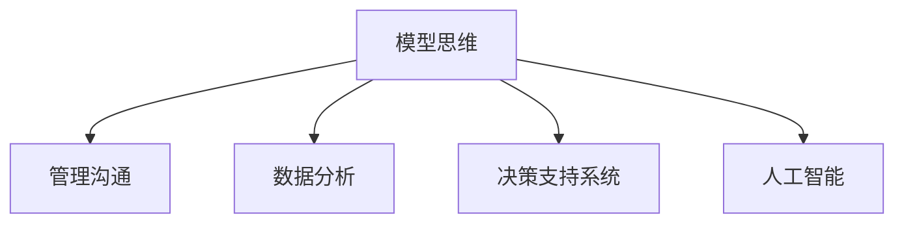

                 

# 模型思维在管理沟通中的运用

> 关键词：模型思维,管理沟通,数据分析,决策支持,人工智能

## 1. 背景介绍

### 1.1 问题由来
随着科技的不断进步，现代管理沟通已经从传统的面对面交流转向数字化、自动化沟通。在大数据和人工智能技术加持下，管理沟通的方式和效率有了质的飞跃。然而，在数字化和自动化沟通中，如何有效整合和利用海量数据，提升管理沟通的准确性和效率，成为摆在管理者面前的新挑战。

### 1.2 问题核心关键点
数据驱动的管理沟通是指利用数据分析和人工智能技术，对管理沟通中的各项要素进行量化分析，以提升决策的科学性和沟通的效率。

该问题的主要核心在于如何构建和应用模型，对管理沟通中产生的数据进行智能分析和应用。具体而言，需要解决以下几个关键问题：
- 模型构建：如何选择合适的模型架构，适配不同的沟通场景。
- 数据处理：如何高效处理和管理沟通数据，确保数据的完整性和准确性。
- 模型训练：如何在有限的标注数据下训练出高效的模型，提升模型的泛化能力。
- 模型评估：如何合理评估模型的效果，选择最合适的模型。
- 模型应用：如何将训练好的模型应用到实际管理沟通中，提升沟通效率和决策质量。

这些问题涉及到大数据处理、机器学习、模型构建和应用等诸多技术领域，需要通过跨学科的知识和技能来综合解决。

### 1.3 问题研究意义
数据驱动的管理沟通能够帮助企业从海量的沟通数据中提取有价值的信息，为管理决策提供坚实的数据支撑，从而提升企业的整体竞争力。具体而言：

1. 提升决策质量：通过数据分析，管理者可以更加客观地评估业务情况，制定更加科学的决策方案。
2. 优化沟通效率：数据分析可以辅助识别沟通障碍和改进沟通策略，提升沟通的效率和效果。
3. 降低沟通成本：通过智能化的沟通工具和模型，可以大幅减少沟通中的人力成本和时间成本。
4. 增强透明度：数据驱动的沟通方式可以提升沟通过程的透明度，减少信息不对称。
5. 增强业务洞察：通过深度分析，企业可以更好地理解客户需求、市场趋势和内部运营情况，从而制定更具前瞻性的业务策略。

数据驱动的管理沟通不仅能够提升企业内部管理水平，还能更好地服务于客户，增强企业的市场竞争力。

## 2. 核心概念与联系

### 2.1 核心概念概述

为更好地理解模型思维在管理沟通中的运用，本节将介绍几个密切相关的核心概念：

- **模型思维**：指利用数学和统计学模型，对复杂的管理沟通数据进行建模、分析，以辅助决策和沟通的过程。模型思维强调利用数据和算法，提升管理沟通的准确性和效率。
- **管理沟通**：指企业内部和外部的信息交流活动，旨在提升团队协作、决策支持和客户服务水平。管理沟通涉及沟通内容、沟通渠道、沟通对象等多个方面。
- **数据分析**：指利用统计学、数学和计算机技术，对数据进行收集、处理和分析，以提取有价值的信息。数据分析是模型思维的重要基础。
- **决策支持系统**：指利用计算机技术和数据分析方法，辅助决策者进行科学决策的信息系统。决策支持系统通常由数据仓库、OLAP、数据挖掘等技术组成。
- **人工智能**：指利用机器学习、深度学习等技术，使计算机具备模拟人类智能的能力，以实现自动化、智能化的管理沟通。

这些核心概念之间的逻辑关系可以通过以下Mermaid流程图来展示：



这个流程图展示了一系列相关概念之间的关系：

1. 模型思维通过数据分析和人工智能技术，辅助管理沟通。
2. 数据分析为模型思维提供基础数据支持。
3. 决策支持系统利用模型思维和数据分析，提升决策的科学性。
4. 人工智能为模型思维提供强大的技术支持。

这些概念共同构成了数据驱动的管理沟通框架，使管理者能够更科学地进行沟通和决策。

## 3. 核心算法原理 & 具体操作步骤

### 3.1 算法原理概述

基于模型思维的管理沟通，主要通过构建和应用数据分析模型来实现。具体而言，主要包括以下几个步骤：

1. **数据收集与预处理**：收集管理沟通中的各项数据，包括沟通内容、参与者、沟通时间、沟通效果等，并进行数据清洗和特征提取。
2. **模型选择与构建**：选择合适的模型架构，如回归模型、分类模型、聚类模型等，构建初步的沟通分析模型。
3. **模型训练与优化**：利用管理沟通中的标注数据，训练模型，并通过交叉验证等方法进行模型优化。
4. **模型评估与选择**：评估模型效果，选择最优模型进行实际应用。
5. **模型应用与迭代**：将训练好的模型应用到实际管理沟通中，并根据反馈结果进行模型迭代和优化。

### 3.2 算法步骤详解

以下是基于模型思维的管理沟通的详细步骤：

**Step 1: 数据收集与预处理**

- **数据收集**：收集企业内部和外部的管理沟通数据，包括邮件、会议记录、客服记录、市场调研数据等。可以使用爬虫、API、数据仓库等技术手段进行数据收集。
- **数据预处理**：对收集到的数据进行清洗和处理，去除噪声和异常值，处理缺失值，进行特征提取和标准化等操作。

**Step 2: 模型选择与构建**

- **模型选择**：根据管理沟通的具体场景和需求，选择合适的模型架构，如回归模型、分类模型、聚类模型等。
- **模型构建**：利用数据预处理后的特征数据，构建初步的模型。可以使用机器学习框架如TensorFlow、PyTorch等进行模型构建。

**Step 3: 模型训练与优化**

- **模型训练**：利用管理沟通中的标注数据，训练初步构建的模型。可以使用交叉验证等方法进行模型优化。
- **模型评估**：使用准确率、召回率、F1分数等指标，评估模型的效果。可以使用混淆矩阵等工具进行可视化。

**Step 4: 模型评估与选择**

- **模型选择**：选择性能最优的模型进行实际应用。可以综合考虑模型的准确率、计算效率、可解释性等因素。

**Step 5: 模型应用与迭代**

- **模型应用**：将训练好的模型应用到实际管理沟通中，并进行实时监控和评估。
- **模型迭代**：根据实际应用中的反馈结果，对模型进行迭代和优化，提升模型的性能和效果。

### 3.3 算法优缺点

基于模型思维的管理沟通具有以下优点：

- **数据驱动**：通过数据分析和模型构建，使管理沟通更加客观和科学。
- **提升效率**：自动化和智能化的沟通工具，能够提高沟通效率，降低沟通成本。
- **增强透明度**：数据驱动的管理沟通能够提升沟通过程的透明度，减少信息不对称。

同时，该方法也存在一定的局限性：

- **数据依赖**：管理沟通的效果很大程度上依赖于数据的完整性和准确性，数据质量对模型效果影响较大。
- **模型复杂**：构建和应用模型需要一定的技术门槛，对团队的技术水平要求较高。
- **可解释性**：模型的决策过程可能缺乏可解释性，难以理解和调试。

尽管存在这些局限性，但就目前而言，基于模型思维的管理沟通仍是大数据和人工智能在管理沟通中应用的主流范式。未来相关研究的重点在于如何进一步降低对数据的依赖，提高模型的可解释性，并结合更多的非结构化数据，提升模型的效果。

### 3.4 算法应用领域

基于模型思维的管理沟通已经在企业内部管理、客户关系管理、市场分析等多个领域得到广泛应用，取得了显著的成效：

- **企业内部管理**：利用数据分析和模型思维，提升团队协作和决策效率，优化人力资源配置，提升员工满意度。
- **客户关系管理**：通过客户沟通数据的分析和建模，提升客户服务质量，增强客户忠诚度，实现精准营销。
- **市场分析**：利用市场沟通数据和模型，进行市场趋势分析和竞争对手分析，制定更具前瞻性的市场策略。

此外，在人力资源管理、供应链管理、产品开发等诸多领域，基于模型思维的管理沟通技术也在不断创新应用，为企业的数字化转型升级提供了新的动力。

## 4. 数学模型和公式 & 详细讲解 & 举例说明

### 4.1 数学模型构建

为更好地理解模型思维在管理沟通中的运用，本节将介绍几个常用的数学模型和相关公式。

假设管理沟通数据集为 $D=\{(x_i, y_i)\}_{i=1}^N$，其中 $x_i$ 为沟通数据，$y_i$ 为沟通效果标签，如满意度、完成度等。我们希望构建一个回归模型 $M(x_i) = \theta^T x_i$，其中 $\theta$ 为模型参数。

构建回归模型的过程包括模型选择、参数估计和模型评估。下面以线性回归模型为例，进行详细讲解。

### 4.2 公式推导过程

假设线性回归模型的目标是最小化均方误差（Mean Squared Error, MSE），即：

$$
\min_{\theta} \frac{1}{N} \sum_{i=1}^N (y_i - M(x_i))^2
$$

利用梯度下降法求解上述优化问题，得到模型参数 $\theta$ 的更新公式：

$$
\theta \leftarrow \theta - \eta \nabla_{\theta} \mathcal{L}(\theta)
$$

其中 $\eta$ 为学习率，$\mathcal{L}(\theta)$ 为损失函数，利用均方误差定义：

$$
\mathcal{L}(\theta) = \frac{1}{N} \sum_{i=1}^N (y_i - \theta^T x_i)^2
$$

因此，梯度下降法的更新公式可以写为：

$$
\theta \leftarrow \theta - \eta \frac{1}{N} \sum_{i=1}^N (2y_i - 2\theta^T x_i)x_i
$$

上述公式展示了线性回归模型的构建和优化过程，即通过最小化均方误差，利用梯度下降法更新模型参数。

### 4.3 案例分析与讲解

下面以客户满意度预测为例，进行详细讲解。

假设企业有大量历史客户服务记录，希望利用这些记录预测客户的满意度，并提升客户服务质量。首先，从历史记录中随机抽取一部分进行标注，作为训练集。然后，使用余下的数据作为验证集，评估模型的效果。

构建线性回归模型，利用梯度下降法进行训练和优化。使用均方误差（MSE）作为损失函数，最小化模型的预测误差。通过交叉验证等方法进行模型优化。最后，在验证集上评估模型效果，选择最优模型进行实际应用。

## 5. 项目实践：代码实例和详细解释说明

### 5.1 开发环境搭建

在进行模型思维的管理沟通项目开发前，我们需要准备好开发环境。以下是使用Python进行Scikit-learn和TensorFlow开发的环境配置流程：

1. 安装Anaconda：从官网下载并安装Anaconda，用于创建独立的Python环境。

2. 创建并激活虚拟环境：
```bash
conda create -n model-env python=3.8 
conda activate model-env
```

3. 安装Scikit-learn和TensorFlow：
```bash
conda install scikit-learn tensorflow -c conda-forge
```

4. 安装各类工具包：
```bash
pip install pandas numpy matplotlib seaborn scikit-optimize
```

完成上述步骤后，即可在`model-env`环境中开始项目实践。

### 5.2 源代码详细实现

下面我们以客户满意度预测项目为例，给出使用Scikit-learn进行模型构建和训练的Python代码实现。

首先，定义数据处理函数：

```python
import pandas as pd
from sklearn.model_selection import train_test_split

def load_data(file_path):
    data = pd.read_csv(file_path)
    features = data[['特征1', '特征2', '特征3', ...]]
    labels = data['满意度']
    return features, labels

def train_test_split_data(features, labels):
    features_train, features_test, labels_train, labels_test = train_test_split(features, labels, test_size=0.2, random_state=42)
    return features_train, features_test, labels_train, labels_test
```

然后，构建线性回归模型并进行训练：

```python
from sklearn.linear_model import LinearRegression
from sklearn.metrics import mean_squared_error
from sklearn.model_selection import cross_val_score

features_train, features_test, labels_train, labels_test = train_test_split_data(features, labels)

model = LinearRegression()
model.fit(features_train, labels_train)

predictions = model.predict(features_test)
mse = mean_squared_error(labels_test, predictions)

print(f"MSE: {mse}")
```

接着，使用交叉验证方法进行模型优化：

```python
from sklearn.model_selection import cross_val_score

cv_scores = cross_val_score(model, features_train, labels_train, cv=5, scoring='neg_mean_squared_error')
cv_mse = -cv_scores.mean()

print(f"Cross-Validation MSE: {cv_mse}")
```

最后，评估模型效果并进行实际应用：

```python
from sklearn.metrics import r2_score

r2 = r2_score(labels_test, predictions)
print(f"R^2: {r2}")
```

以上就是使用Scikit-learn进行客户满意度预测的完整代码实现。可以看到，通过Scikit-learn，我们可以方便地构建和训练线性回归模型，并通过交叉验证等方法进行模型优化和效果评估。

### 5.3 代码解读与分析

让我们再详细解读一下关键代码的实现细节：

**load_data函数**：
- 定义了数据处理函数，读取数据，并进行特征提取和标签提取。

**train_test_split_data函数**：
- 定义了数据拆分函数，将数据分为训练集和测试集，以便进行模型训练和评估。

**LinearRegression模型**：
- 构建线性回归模型，并使用训练集数据进行拟合。

**mean_squared_error函数**：
- 计算模型在测试集上的均方误差。

**cross_val_score函数**：
- 使用交叉验证方法，评估模型的效果。

**R^2分数**：
- 计算模型的R^2分数，衡量模型对数据的拟合程度。

通过上述代码，我们展示了基于Scikit-learn的模型构建和训练过程。这些代码实例可以帮助开发者快速上手模型思维的管理沟通项目开发。

## 6. 实际应用场景

### 6.1 智能客服系统

基于模型思维的管理沟通，可以广泛应用于智能客服系统的构建。传统的客服系统依赖大量人工操作，响应速度慢，服务质量难以保证。利用模型思维构建的智能客服系统，能够自动理解客户咨询，快速生成回复，提供24小时不间断服务。

在技术实现上，可以收集历史客服记录，构建客户满意度预测模型，并根据模型预测结果，自动选择最佳回答模板，提升客户服务质量。对于客户提出的新问题，还可以通过对话生成模型，实时生成回复，进一步提升服务效率。

### 6.2 产品开发与迭代

利用模型思维，企业可以分析客户反馈数据，识别产品中的痛点和改进点，指导产品开发与迭代。构建客户满意度预测模型，利用反馈数据进行预测，将预测结果作为产品改进的重要依据。

例如，某电商平台可以构建基于客户评论的情感分析模型，分析客户对产品的满意度。通过情感分析，平台可以快速识别出评价低的产品，及时进行改进。同时，根据模型预测结果，可以优化产品推荐算法，提升用户体验。

### 6.3 供应链管理

在供应链管理中，利用模型思维，可以优化供应链各环节的决策和沟通。构建供应链绩效预测模型，分析供应链各环节的数据，识别瓶颈和改进点，优化供应链流程。例如，利用客户满意度预测模型，识别出供应商的评价，及时调整供应商选择策略。

### 6.4 未来应用展望

随着模型思维和数据分析技术的不断发展，基于模型思维的管理沟通将具有更广泛的应用前景：

1. **智能决策支持**：构建更加复杂和多样化的模型，为管理决策提供更科学、更精准的数据支撑。
2. **自动化沟通**：利用自然语言处理技术，构建智能化的沟通工具，进一步提升沟通效率和质量。
3. **数据可视化**：构建数据可视化工具，直观展示管理沟通的数据分析结果，提升决策者的理解和使用效率。
4. **跨部门协作**：利用模型思维，促进跨部门的数据共享和协作，提升企业整体的沟通效率和协同效果。
5. **客户洞察**：构建客户洞察模型，深入理解客户需求和行为，提升客户满意度和忠诚度。

总之，数据驱动的管理沟通将为企业带来更高效、更智能、更透明的沟通和管理方式，提升企业的竞争力。

## 7. 工具和资源推荐

### 7.1 学习资源推荐

为了帮助开发者系统掌握模型思维在管理沟通中的运用，这里推荐一些优质的学习资源：

1. **《数据驱动管理沟通》系列课程**：由知名数据科学家授课，系统讲解模型思维在管理沟通中的应用。
2. **《Python数据科学手册》**：详细介绍Python在数据分析和模型构建中的应用，适合初学者和进阶者。
3. **Kaggle数据竞赛平台**：提供大量实际案例和数据集，可以用于实践模型思维在管理沟通中的应用。
4. **GitHub开源项目**：包含大量实际应用案例，可以学习优秀的项目实现思路。
5. **Coursera和edX在线课程**：提供系统化的课程，涵盖数据分析、机器学习等多个领域，适合进一步学习提升。

通过对这些资源的学习实践，相信你一定能够快速掌握模型思维在管理沟通中的应用。

### 7.2 开发工具推荐

高效的开发离不开优秀的工具支持。以下是几款用于模型思维管理沟通开发的常用工具：

1. **Scikit-learn**：基于Python的数据挖掘和机器学习库，提供丰富的模型选择和训练方法。
2. **TensorFlow**：由Google开发的深度学习框架，提供强大的计算图和分布式训练支持。
3. **PyTorch**：由Facebook开发的深度学习框架，提供灵活的动态计算图和高效的分布式训练支持。
4. **Jupyter Notebook**：用于数据科学和机器学习的交互式开发环境，支持Python和R等多种语言。
5. **Tableau和Power BI**：用于数据可视化的工具，可以直观展示数据分析结果，帮助决策者理解数据。

合理利用这些工具，可以显著提升模型思维在管理沟通项目的开发效率，加速模型构建和应用的迭代进程。

### 7.3 相关论文推荐

模型思维和管理沟通的研究源于学界的持续探索。以下是几篇奠基性的相关论文，推荐阅读：

1. **《模型思维在决策中的应用》**：研究了模型思维在决策中的应用，探讨了模型的构建和优化方法。
2. **《数据驱动的管理沟通》**：探讨了数据驱动的管理沟通的实现方法，提供了丰富的案例和应用场景。
3. **《智能客服系统与模型思维》**：研究了智能客服系统的构建方法，利用模型思维提升客户服务质量。
4. **《供应链管理中的模型思维》**：探讨了模型思维在供应链管理中的应用，优化供应链决策和沟通。
5. **《客户满意度预测与模型思维》**：研究了客户满意度预测模型，利用模型思维提升客户服务质量。

这些论文代表了模型思维和管理沟通的研究前沿，帮助读者深入理解模型的构建和应用。

## 8. 总结：未来发展趋势与挑战

### 8.1 总结

本文对模型思维在管理沟通中的运用进行了全面系统的介绍。首先阐述了模型思维在管理沟通中的研究背景和意义，明确了模型思维在提升管理沟通效果、优化决策过程方面的独特价值。其次，从原理到实践，详细讲解了模型思维的数学模型构建和具体操作步骤，给出了模型思维在管理沟通中的应用实例。同时，本文还广泛探讨了模型思维在智能客服、产品开发、供应链管理等多个领域的应用前景，展示了模型思维的巨大潜力。此外，本文精选了模型思维在管理沟通中的学习资源、开发工具和相关论文，力求为读者提供全方位的技术指引。

通过本文的系统梳理，可以看到，模型思维在管理沟通中的运用不仅能够提升管理沟通的效果，还能优化决策过程，提升企业的整体竞争力。未来，随着模型思维技术的不断演进，将有更多的应用场景和领域能够从中受益。

### 8.2 未来发展趋势

展望未来，模型思维在管理沟通中的应用将呈现以下几个发展趋势：

1. **模型复杂性提升**：随着模型思维技术的不断发展，模型的复杂性和多样性将进一步提升，能够处理更加复杂的管理沟通数据。
2. **自动化程度提高**：利用AI和自动化技术，模型思维将能够自动生成和管理数据，提升管理沟通的效率和质量。
3. **跨领域融合**：模型思维将与其他技术如自然语言处理、知识图谱等融合，提升沟通和决策的效果。
4. **数据来源多元化**：模型思维将利用多源异构数据，提升模型的泛化能力和决策效果。
5. **实时性增强**：模型思维将实现实时数据处理和决策，提升管理沟通的及时性和响应速度。

以上趋势凸显了模型思维在管理沟通中的广阔前景，这些方向的探索发展，必将进一步提升管理沟通的效果和效率，为企业的数字化转型升级提供新的动力。

### 8.3 面临的挑战

尽管模型思维在管理沟通中已经取得了显著成效，但在迈向更加智能化、普适化应用的过程中，它仍面临着诸多挑战：

1. **数据质量**：管理沟通数据的质量往往参差不齐，数据不完整、不准确、不标准等问题仍需解决。
2. **模型复杂性**：复杂模型的构建和优化需要更多的技术和资源，对团队的技术水平要求较高。
3. **模型可解释性**：模型的决策过程可能缺乏可解释性，难以理解和调试，影响决策的透明性和可信度。
4. **模型鲁棒性**：模型面对域外数据时，泛化性能往往大打折扣，模型的鲁棒性仍需提升。
5. **数据隐私和安全**：管理沟通数据的隐私和安全问题需严格保障，防止数据泄露和滥用。

这些挑战需要企业在模型构建和应用过程中不断优化和改进，才能实现模型思维在管理沟通中的最优效果。

### 8.4 研究展望

面对模型思维在管理沟通中面临的挑战，未来的研究需要在以下几个方面寻求新的突破：

1. **数据治理与清洗**：加强数据质量管理，提升数据清洗和处理的自动化水平，确保数据的质量和一致性。
2. **模型自动化**：提升模型的自动化水平，减少人工干预，提高模型的构建和优化效率。
3. **模型可解释性**：加强模型可解释性的研究，开发可解释性更高的模型，提升模型的透明度和可信度。
4. **模型鲁棒性**：提升模型的鲁棒性，确保模型在不同数据分布下的表现稳定性。
5. **数据隐私保护**：加强数据隐私保护技术，确保数据安全和隐私。

这些研究方向将为模型思维在管理沟通中的应用提供新的突破，推动模型思维技术的持续发展。

## 9. 附录：常见问题与解答

**Q1: 模型思维在管理沟通中的核心是什么？**

A: 模型思维在管理沟通中的核心是通过数学和统计学模型，对沟通数据进行建模和分析，以辅助决策和沟通。具体而言，主要通过数据收集、特征提取、模型构建、模型训练、模型优化和模型应用等步骤，实现对管理沟通数据的深入分析和应用。

**Q2: 模型思维在管理沟通中的优点是什么？**

A: 模型思维在管理沟通中的主要优点包括：
1. **数据驱动**：通过数据分析，使管理沟通更加客观和科学。
2. **提升效率**：自动化和智能化的沟通工具，能够提高沟通效率，降低沟通成本。
3. **增强透明度**：数据驱动的管理沟通能够提升沟通过程的透明度，减少信息不对称。

**Q3: 模型思维在管理沟通中的局限性是什么？**

A: 模型思维在管理沟通中的主要局限性包括：
1. **数据依赖**：管理沟通的效果很大程度上依赖于数据的完整性和准确性，数据质量对模型效果影响较大。
2. **模型复杂**：构建和应用模型需要一定的技术门槛，对团队的技术水平要求较高。
3. **可解释性**：模型的决策过程可能缺乏可解释性，难以理解和调试。

尽管存在这些局限性，但就目前而言，模型思维在管理沟通中的运用已经展现出了巨大的潜力和效果，未来仍有广阔的发展空间。

**Q4: 模型思维在管理沟通中的应用场景是什么？**

A: 模型思维在管理沟通中的应用场景主要包括：
1. **智能客服系统**：利用模型思维构建智能客服系统，提升客户服务质量。
2. **产品开发与迭代**：利用模型思维分析客户反馈数据，指导产品开发与迭代。
3. **供应链管理**：利用模型思维优化供应链各环节的决策和沟通。
4. **客户关系管理**：利用模型思维提升客户服务质量，增强客户忠诚度。
5. **市场分析**：利用模型思维分析市场沟通数据，制定更具前瞻性的市场策略。

总之，模型思维在管理沟通中的应用已经涵盖了企业管理的各个环节，能够显著提升企业的整体竞争力。

**Q5: 如何提升模型思维在管理沟通中的应用效果？**

A: 提升模型思维在管理沟通中的应用效果，可以从以下几个方面入手：
1. **数据治理与清洗**：加强数据质量管理，提升数据清洗和处理的自动化水平，确保数据的质量和一致性。
2. **模型自动化**：提升模型的自动化水平，减少人工干预，提高模型的构建和优化效率。
3. **模型可解释性**：加强模型可解释性的研究，开发可解释性更高的模型，提升模型的透明度和可信度。
4. **模型鲁棒性**：提升模型的鲁棒性，确保模型在不同数据分布下的表现稳定性。
5. **数据隐私保护**：加强数据隐私保护技术，确保数据安全和隐私。

通过以上措施，可以进一步提升模型思维在管理沟通中的应用效果，推动企业数字化转型升级。

---

作者：禅与计算机程序设计艺术 / Zen and the Art of Computer Programming

