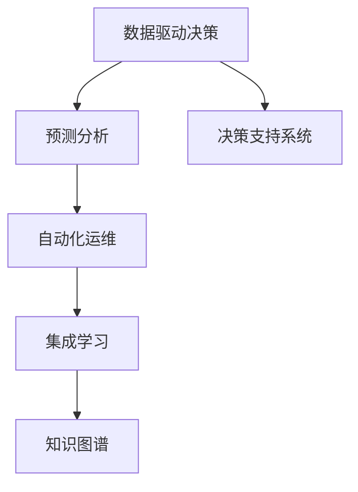

                 

# 模型思维对管理效率的提升

## 1. 背景介绍

在当今数字化时代，组织面临的环境日益复杂多变，不确定性不断增加。为了提高管理效率，企业亟需采取有效的决策和预测工具。传统的管理方法，如直观经验判断和历史数据统计，已无法应对日益复杂的经营挑战。模型思维的崛起，为现代管理提供了一种全新的视角和手段，以系统的数据驱动方式，辅助组织进行高效决策和精准预测。

模型思维（Model Thinking）是指在管理决策中运用数据模型和算法，通过系统的量化分析和预测，提高决策的科学性和可靠性。与传统经验决策相比，模型思维具有以下优势：

- 数据驱动：利用大量历史数据，通过建模和预测，更准确地反映现实世界的复杂关系。
- 系统性：整合多维度信息，提供全面、综合的决策依据。
- 实时性：能够实时响应数据变化，快速调整策略。
- 可解释性：模型的预测结果可以通过数据和逻辑进行解释，提升决策透明度。
- 预测力：通过机器学习、深度学习等技术，提高预测精度，增强管理的前瞻性。

## 2. 核心概念与联系

### 2.1 核心概念概述

为了深入理解模型思维在管理中的应用，本节将介绍几个关键概念：

- 数据驱动决策（Data-Driven Decision Making）：在决策过程中，优先依赖数据模型和算法，而非主观经验。数据驱动决策能够提供更加客观、可靠的决策依据。
- 预测分析（Predictive Analytics）：利用历史数据和模型，预测未来趋势和结果。通过预测分析，管理者可以提前发现潜在风险，制定应对措施。
- 决策支持系统（Decision Support Systems, DSS）：结合数据、模型、知识库等多源信息，提供决策辅助工具。DSS能够帮助管理者更全面地理解问题，制定科学策略。
- 自动化运维（Automated Operations）：通过算法和自动化工具，实现流程优化和效率提升。自动化运维可以减少人工干预，提高运营效率。
- 集成学习（Ensemble Learning）：通过集成多个模型的预测结果，提升整体预测精度。集成学习能够更好地处理数据噪声和模型偏差。
- 知识图谱（Knowledge Graph）：以图结构表示实体间关系，支持知识推理和发现。知识图谱能够增强模型对业务场景的理解和应用。

这些核心概念之间相互联系，共同构成了模型思维在管理中的实践框架。通过理解和应用这些概念，管理者可以更好地把握模型思维的优势和应用方法。

### 2.2 核心概念原理和架构的 Mermaid 流程图



这个流程图展示了大语言模型微调的逻辑关系：

1. 数据驱动决策是整个模型的基础，提供数据支撑。
2. 预测分析是模型思维的核心，通过数据模型进行未来预测。
3. 决策支持系统为管理者提供综合辅助，增强决策依据。
4. 自动化运维提升效率，降低人工干预。
5. 集成学习提高预测精度，增强模型的鲁棒性。
6. 知识图谱支持知识推理，增强模型理解业务场景的能力。

这些概念共同构成了模型思维在管理中的应用框架，使其能够更有效地应对复杂的经营挑战。

## 3. 核心算法原理 & 具体操作步骤

### 3.1 算法原理概述

模型思维在管理中的应用，主要依赖于数据模型和算法的构建和优化。其核心思想是通过系统化的数据处理和建模，提升决策的科学性和前瞻性。

模型思维的算法原理包括以下几个步骤：

1. **数据采集与清洗**：收集和整理与业务相关的历史数据，剔除噪声和异常值，保证数据质量。
2. **特征工程**：通过特征选择和构造，提取对业务问题有预测能力的特征，增强模型效果。
3. **模型训练**：选择合适的算法和模型结构，利用历史数据进行训练，得到预测模型。
4. **模型评估与优化**：通过交叉验证等方法评估模型性能，优化模型参数，提升预测精度。
5. **模型应用**：将训练好的模型应用于新数据，进行实时预测和决策辅助。

### 3.2 算法步骤详解

#### 3.2.1 数据采集与清洗

- **数据来源**：包括企业内部的业务数据（如销售、财务、客户数据）、外部公开数据（如行业报告、市场趋势）。
- **数据清洗**：处理缺失值、异常值、重复数据，确保数据的一致性和完整性。
- **特征选择**：选取与业务问题相关的特征，如销售数据中的时间、产品、渠道等，去除冗余和无关特征。

#### 3.2.2 特征工程

- **特征构造**：通过数据变换和组合，生成新的特征，如销售额的时间趋势、客户分群等。
- **特征编码**：将文本、日期等非数值特征转换为数值型特征，便于模型处理。
- **特征归一化**：对特征进行标准化处理，确保不同特征在同一尺度上。

#### 3.2.3 模型训练

- **选择算法**：根据业务问题选择合适的算法，如回归分析、分类算法、聚类算法等。
- **数据划分**：将数据集划分为训练集、验证集和测试集，确保模型训练和评估的公正性。
- **模型训练**：利用训练集数据进行模型训练，优化模型参数。

#### 3.2.4 模型评估与优化

- **交叉验证**：使用交叉验证方法评估模型性能，如K折交叉验证，避免过拟合。
- **性能指标**：选择合适的评价指标，如均方误差（MSE）、准确率、F1分数等，评估模型效果。
- **模型优化**：通过超参数调优、集成学习等方法，提升模型性能。

#### 3.2.5 模型应用

- **部署上线**：将训练好的模型部署到实际应用中，如生产系统、决策支持系统等。
- **实时预测**：利用新数据进行实时预测，提供决策支持。
- **监控与更新**：实时监控模型性能，根据数据变化及时更新模型参数。

### 3.3 算法优缺点

模型思维在管理中的应用，具有以下优点：

- **精确性**：数据驱动的决策方式，通过模型预测，能够提供高精度的决策依据。
- **透明性**：模型的预测过程和结果可以通过数据和逻辑进行解释，增强决策透明度。
- **灵活性**：模型可以根据新数据进行实时更新，适应环境变化。
- **可扩展性**：模型可以应用于多维度的业务问题，提升整体管理效率。

同时，模型思维也存在一些缺点：

- **复杂性**：模型构建和优化的过程较为复杂，需要较高技术门槛。
- **数据依赖**：模型性能依赖于数据质量和数量，数据不足或质量不佳会影响模型效果。
- **模型解释**：复杂的模型（如深度学习）可能难以解释，导致决策透明度降低。
- **预测偏差**：模型预测可能存在偏差，需要结合经验判断进行校正。

### 3.4 算法应用领域

模型思维在管理中的应用，已经广泛应用于多个领域，如：

- **销售预测**：通过历史销售数据，预测未来销售趋势，优化库存和生产计划。
- **客户分析**：利用客户数据，识别高价值客户群体，制定精准营销策略。
- **风险管理**：通过金融数据建模，预测信用风险和市场波动，制定风险控制措施。
- **人力资源管理**：利用员工数据，进行绩效评估、人才招聘和流失预测。
- **供应链优化**：通过供应链数据建模，优化供应链流程，提升运营效率。
- **产品推荐**：利用用户数据，提供个性化产品推荐，提升用户体验。

除了上述这些经典应用外，模型思维还被创新性地应用到更多场景中，如舆情分析、舆情预测、健康管理等，为管理决策提供新的支持。随着数据技术和算法的不断发展，相信模型思维将在更多领域得到应用，为管理效率的提升注入新的动力。

## 4. 数学模型和公式 & 详细讲解 & 举例说明

### 4.1 数学模型构建

为了更好地理解模型思维在管理中的应用，本节将介绍几个典型的数学模型：

#### 4.1.1 线性回归模型

线性回归模型（Linear Regression）是最常见的回归模型之一，用于预测连续型变量。其数学模型表达式为：

$$
y = \beta_0 + \beta_1 x_1 + \beta_2 x_2 + \ldots + \beta_n x_n + \epsilon
$$

其中 $y$ 为预测变量，$x_i$ 为输入特征，$\beta_i$ 为系数，$\epsilon$ 为误差项。

#### 4.1.2 逻辑回归模型

逻辑回归模型（Logistic Regression）用于预测分类变量，其数学模型表达式为：

$$
P(y=1|x) = \frac{1}{1 + e^{-\beta_0 - \beta_1 x_1 - \beta_2 x_2 - \ldots - \beta_n x_n}}
$$

其中 $P(y=1|x)$ 为预测值为1的概率，$x_i$ 为输入特征，$\beta_i$ 为系数。

### 4.2 公式推导过程

#### 4.2.1 线性回归模型推导

线性回归模型的最小二乘法（Ordinary Least Squares, OLS）求解过程如下：

1. 假设模型为 $y = \beta_0 + \beta_1 x_1 + \beta_2 x_2 + \ldots + \beta_n x_n + \epsilon$，其中 $\epsilon$ 服从高斯分布 $N(0, \sigma^2)$。
2. 计算样本均值 $\bar{x}_i = \frac{1}{N} \sum_{i=1}^N x_i$ 和 $\bar{y} = \frac{1}{N} \sum_{i=1}^N y_i$。
3. 求解最小二乘法估计 $\hat{\beta} = (X^TX)^{-1}X^Ty$，其中 $X = [1, x_1, x_2, \ldots, x_n]$。
4. 计算残差平方和 $SSE = \sum_{i=1}^N (y_i - \hat{y}_i)^2$，其中 $\hat{y}_i = \hat{\beta}_0 + \hat{\beta}_1 x_{i1} + \hat{\beta}_2 x_{i2} + \ldots + \hat{\beta}_n x_{in}$。
5. 计算 $R^2$ 值，评估模型拟合优度。

#### 4.2.2 逻辑回归模型推导

逻辑回归模型的最大似然估计（Maximum Likelihood Estimation, MLE）求解过程如下：

1. 假设模型为 $P(y=1|x) = \frac{1}{1 + e^{-\beta_0 - \beta_1 x_1 - \beta_2 x_2 - \ldots - \beta_n x_n}}$。
2. 计算似然函数 $L(\beta_0, \beta_1, \ldots, \beta_n) = \prod_{i=1}^N P(y_i|x_i)^{y_i} (1-P(y_i|x_i))^{1-y_i}$。
3. 对似然函数取对数，得到对数似然函数 $l(\beta_0, \beta_1, \ldots, \beta_n) = \sum_{i=1}^N [y_i \log P(y_i|x_i) + (1-y_i) \log (1-P(y_i|x_i))]$。
4. 求解 $\nabla_{\beta} l(\beta) = 0$，得到 $\hat{\beta} = (X^TX)^{-1}X^T(y - \bar{y})$，其中 $X = [1, x_1, x_2, \ldots, x_n]$，$\bar{y} = \frac{1}{N} \sum_{i=1}^N y_i$。

### 4.3 案例分析与讲解

#### 4.3.1 线性回归案例

某电商平台收集了历史销售数据，用于预测未来销售量。模型构建步骤如下：

1. 收集历史销售数据 $(x_i, y_i)$，其中 $x_i$ 包括时间、产品、价格等特征。
2. 数据清洗，处理缺失值和异常值。
3. 特征工程，选择时间、产品等关键特征。
4. 模型训练，选择线性回归模型，使用历史数据进行训练。
5. 模型评估，计算 $R^2$ 值评估模型拟合优度。
6. 模型应用，利用新数据进行实时预测，优化库存和生产计划。

#### 4.3.2 逻辑回归案例

某金融机构利用客户数据进行信用评分，模型构建步骤如下：

1. 收集客户数据 $(x_i, y_i)$，其中 $x_i$ 包括年龄、收入、信用记录等特征，$y_i$ 为是否违约。
2. 数据清洗，处理缺失值和异常值。
3. 特征工程，选择关键特征，如收入、信用记录等。
4. 模型训练，选择逻辑回归模型，使用历史数据进行训练。
5. 模型评估，计算准确率和 F1 分数评估模型效果。
6. 模型应用，利用新数据进行实时预测，制定信用控制策略。

## 5. 项目实践：代码实例和详细解释说明

### 5.1 开发环境搭建

在进行模型思维的实践前，我们需要准备好开发环境。以下是使用Python进行Pandas和Scikit-learn开发的环境配置流程：

1. 安装Anaconda：从官网下载并安装Anaconda，用于创建独立的Python环境。

2. 创建并激活虚拟环境：
```bash
conda create -n model-env python=3.8 
conda activate model-env
```

3. 安装Pandas和Scikit-learn：
```bash
conda install pandas scikit-learn
```

4. 安装各类工具包：
```bash
pip install numpy matplotlib jupyter notebook ipython
```

完成上述步骤后，即可在`model-env`环境中开始模型思维的实践。

### 5.2 源代码详细实现

下面我们以销售预测任务为例，给出使用Pandas和Scikit-learn进行线性回归模型的PyTorch代码实现。

首先，定义数据处理函数：

```python
import pandas as pd
from sklearn.model_selection import train_test_split
from sklearn.preprocessing import StandardScaler

def load_data(file_path):
    df = pd.read_csv(file_path)
    X = df.drop('y', axis=1)
    y = df['y']
    return X, y

def preprocess_data(X):
    scaler = StandardScaler()
    X = scaler.fit_transform(X)
    return X

def split_data(X, y, test_size=0.2, random_state=42):
    X_train, X_test, y_train, y_test = train_test_split(X, y, test_size=test_size, random_state=random_state)
    return X_train, X_test, y_train, y_test
```

然后，定义模型和评估函数：

```python
from sklearn.linear_model import LinearRegression
from sklearn.metrics import r2_score

def train_model(X_train, y_train):
    model = LinearRegression()
    model.fit(X_train, y_train)
    return model

def evaluate_model(model, X_test, y_test):
    y_pred = model.predict(X_test)
    r2 = r2_score(y_test, y_pred)
    return r2
```

最后，启动模型训练和评估流程：

```python
X, y = load_data('sales_data.csv')
X = preprocess_data(X)
X_train, X_test, y_train, y_test = split_data(X, y)

model = train_model(X_train, y_train)
r2 = evaluate_model(model, X_test, y_test)
print(f'R^2 score: {r2:.3f}')
```

以上就是使用Pandas和Scikit-learn对线性回归模型进行销售预测任务的完整代码实现。可以看到，得益于Pandas和Scikit-learn的强大封装，我们可以用相对简洁的代码完成模型的加载和训练。

### 5.3 代码解读与分析

让我们再详细解读一下关键代码的实现细节：

**load_data函数**：
- 读取数据文件，分离特征和标签。

**preprocess_data函数**：
- 对特征进行标准化处理，确保数据在同一尺度上。

**split_data函数**：
- 将数据划分为训练集和测试集，保证模型评估的公正性。

**train_model函数**：
- 利用训练集数据进行模型训练，得到线性回归模型。

**evaluate_model函数**：
- 在测试集上评估模型效果，计算 $R^2$ 值。

**模型训练流程**：
- 定义测试数据和训练数据路径，并加载数据。
- 对特征进行预处理和标准化。
- 数据划分，将数据集划分为训练集和测试集。
- 模型训练，使用训练集数据进行模型训练。
- 模型评估，在测试集上计算 $R^2$ 值，输出结果。

可以看到，Pandas和Scikit-learn使得线性回归模型的代码实现变得简洁高效。开发者可以将更多精力放在数据处理、模型改进等高层逻辑上，而不必过多关注底层的实现细节。

当然，工业级的系统实现还需考虑更多因素，如模型的保存和部署、超参数的自动搜索、更灵活的任务适配层等。但核心的模型思维方法基本与此类似。

## 6. 实际应用场景

### 6.1 智能制造

模型思维在智能制造中的应用，能够显著提升生产效率和质量控制。通过数据分析和建模，制造商可以优化生产流程，减少资源浪费，提升产品质量。

在实践中，可以收集历史生产数据，如设备运行状态、原材料消耗、产品良品率等，建立生产预测模型。利用模型预测设备故障、预测原材料消耗，制定优化策略。同时，通过模型评估生产流程，发现瓶颈和改进点，实现精益生产。

### 6.2 金融风控

金融行业风险管理需求迫切，模型思维的应用能够显著提升风险预测和控制能力。

在风险预测方面，金融机构可以利用历史交易数据和客户数据，建立信用评分模型和欺诈检测模型。通过模型预测客户违约概率和交易异常行为，及时采取风险控制措施。

在风险控制方面，可以利用模型进行实时监控和预警，自动检测并阻断异常交易，保护客户资金安全。同时，通过模型分析和决策，优化贷款审批流程，降低不良贷款率。

### 6.3 医疗诊断

医疗领域对精准诊断的需求日益增长，模型思维的应用能够显著提升诊断准确率和效率。

在诊断预测方面，医疗机构可以收集病历数据和影像数据，建立疾病预测模型。通过模型预测疾病发展趋势和病情恶化风险，辅助医生制定治疗方案。

在治疗方案优化方面，可以利用模型评估治疗效果，优化用药方案。同时，通过模型分析患者历史数据，发现潜在风险因素，制定个性化的治疗计划。

### 6.4 未来应用展望

随着数据技术和算法的不断发展，模型思维在管理中的应用前景广阔，未来有望在更多领域得到应用：

1. **智慧城市**：通过模型预测和优化，提升城市交通、环保、能源管理等水平。
2. **智能农业**：利用模型预测天气、作物生长等，优化种植和收获决策。
3. **环境保护**：通过模型预测环境变化，制定有效的环保策略。
4. **教育培训**：利用模型预测学生学习行为，提供个性化的教育方案。
5. **市场营销**：通过模型预测市场趋势，制定精准的市场营销策略。

## 7. 工具和资源推荐

### 7.1 学习资源推荐

为了帮助开发者系统掌握模型思维的理论基础和实践技巧，这里推荐一些优质的学习资源：

1. 《数据科学导论》（Introduction to Data Science）：清华大学出版社，涵盖数据采集、处理、分析和建模等基本概念。
2. 《机器学习实战》（Hands-On Machine Learning with Scikit-Learn, Keras, and TensorFlow）：O'Reilly出版社，系统介绍机器学习算法和实践。
3. 《Python数据科学手册》（Python Data Science Handbook）：O'Reilly出版社，涵盖Pandas、NumPy、Scikit-Learn等常用库的使用。
4. 《统计学习方法》（Pattern Recognition and Machine Learning）：李航著，经典机器学习教材，涵盖各种算法原理和推导。
5. 《数据科学基础》（Data Science for Business）：Wharton school，介绍数据科学在商业决策中的应用。

通过对这些资源的学习实践，相信你一定能够快速掌握模型思维的精髓，并用于解决实际的业务问题。

### 7.2 开发工具推荐

高效的开发离不开优秀的工具支持。以下是几款用于模型思维开发的常用工具：

1. Jupyter Notebook：交互式数据科学和机器学习平台，支持代码编写、数据展示和交互式计算。
2. PyCharm：Python开发环境，提供强大的代码补全和调试功能。
3. RStudio：R语言开发环境，提供交互式数据可视化和统计建模功能。
4. Tableau：数据可视化工具，支持复杂的数据分析和图表展示。
5. KNIME：开源数据科学平台，提供丰富的数据处理和建模工具。

合理利用这些工具，可以显著提升模型思维的开发效率，加速创新迭代的步伐。

### 7.3 相关论文推荐

模型思维的快速发展离不开学界的持续研究。以下是几篇奠基性的相关论文，推荐阅读：

1. 《模型思维：在商业决策中的应用》（Model Thinking: Application in Business Decision Making）：清华大学出版社，介绍模型思维的基本概念和应用。
2. 《机器学习：原理、算法与应用》（Machine Learning: Principles and Algorithms）：北京大学出版社，系统介绍机器学习算法和应用。
3. 《数据驱动决策：理论与实践》（Data-Driven Decision Making: Theory and Practice）：Kluwer Academic Publishers，介绍数据驱动决策的理论基础和实践方法。
4. 《机器学习在金融风控中的应用》（Application of Machine Learning in Financial Risk Control）：中国金融学会，介绍机器学习在金融风控中的应用。
5. 《数据科学在医疗诊断中的应用》（Application of Data Science in Medical Diagnosis）：PLOS Medicine，介绍数据科学在医疗诊断中的应用。

这些论文代表了大语言模型微调技术的发展脉络。通过学习这些前沿成果，可以帮助研究者把握学科前进方向，激发更多的创新灵感。

## 8. 总结：未来发展趋势与挑战

### 8.1 总结

本文对模型思维在管理中的应用进行了全面系统的介绍。首先阐述了模型思维的研究背景和意义，明确了模型思维在提升管理效率中的独特价值。其次，从原理到实践，详细讲解了模型思维的数学原理和关键步骤，给出了模型思维任务开发的完整代码实例。同时，本文还广泛探讨了模型思维在智能制造、金融风控、医疗诊断等多个行业领域的应用前景，展示了模型思维的巨大潜力。此外，本文精选了模型思维的学习资源，力求为读者提供全方位的技术指引。

通过本文的系统梳理，可以看到，模型思维在管理中的应用正逐渐成为主流，能够显著提升决策的科学性和前瞻性。模型思维的应用，能够通过系统的数据驱动方式，帮助组织在复杂多变的环境下做出更加精准的决策。未来，随着数据技术和算法的不断发展，模型思维必将在更多领域得到应用，为管理效率的提升注入新的动力。

### 8.2 未来发展趋势

展望未来，模型思维在管理中的应用将呈现以下几个发展趋势：

1. **数据融合与多源数据利用**：模型思维将利用更多来源的数据，如IoT、传感器数据等，进行综合分析和预测。数据融合技术将提升模型的准确性和鲁棒性。
2. **深度学习与强化学习结合**：模型思维将与深度学习、强化学习等技术结合，提升预测精度和决策智能性。深度学习用于数据处理和特征提取，强化学习用于优化决策策略。
3. **实时性与自动化**：模型思维将进一步提升实时性和自动化水平，通过在线学习算法实现模型更新和优化。自动化运维将减少人工干预，提高效率。
4. **可解释性与透明度**：模型思维将更注重模型的可解释性和透明度，通过解释性模型和可视化工具，提升决策的可理解性和可接受性。
5. **跨领域应用扩展**：模型思维将拓展到更多领域，如智能交通、智能农业、智能教育等，提升不同领域的管理效率。
6. **伦理与合规**：模型思维将考虑伦理与合规问题，确保数据使用和模型应用的合法性和道德性。

以上趋势凸显了模型思维在管理中的应用前景。这些方向的探索发展，必将进一步提升模型思维的精度和智能性，为管理效率的提升提供新的动力。

### 8.3 面临的挑战

尽管模型思维在管理中的应用已经取得了显著成效，但在迈向更加智能化、普适化应用的过程中，它仍面临诸多挑战：

1. **数据隐私与安全**：模型思维需要大量数据支撑，但数据隐私和安全问题也随之而来。如何在保证数据安全的前提下，进行数据采集和使用，是一个重要问题。
2. **模型复杂性与可解释性**：深度学习等复杂模型虽然预测精度高，但难以解释，导致决策透明度降低。如何提升模型可解释性，是模型思维应用的重要挑战。
3. **数据质量与噪声**：数据质量直接影响到模型效果，数据缺失、噪声等问题可能导致模型失效。如何保证数据质量，是一个关键问题。
4. **模型泛化性与鲁棒性**：模型泛化性和鲁棒性问题，可能导致模型在新场景下表现不佳。如何提升模型的泛化性和鲁棒性，是一个重要课题。
5. **技术门槛与知识普及**：模型思维需要较高的技术门槛，如何普及相关知识，提高企业的数据分析能力，是一个重要挑战。

### 8.4 研究展望

面对模型思维面临的挑战，未来的研究需要在以下几个方面寻求新的突破：

1. **数据治理与隐私保护**：研究数据治理和隐私保护技术，确保数据安全和合法使用。
2. **模型解释性与可视化**：研究模型解释性和可视化技术，提升模型的可理解性和透明度。
3. **数据清洗与质量控制**：研究数据清洗和质量控制技术，确保数据高质量和可靠使用。
4. **模型集成与融合**：研究模型集成与融合技术，提升模型的泛化性和鲁棒性。
5. **知识图谱与推理**：研究知识图谱与推理技术，提升模型的知识整合能力。
6. **伦理与合规**：研究模型应用的伦理与合规问题，确保模型应用的合法性和道德性。

这些研究方向的探索，必将引领模型思维在管理中的应用走向更加成熟，为构建高效、智能、可控的管理系统铺平道路。面向未来，模型思维需要与其他人工智能技术进行更深入的融合，如知识表示、因果推理、强化学习等，多路径协同发力，共同推动管理效率的提升。只有勇于创新、敢于突破，才能不断拓展模型思维的边界，让数据驱动的管理系统更好地服务于人类社会。

## 9. 附录：常见问题与解答

**Q1：模型思维对管理效率提升有哪些具体作用？**

A: 模型思维通过系统的数据驱动方式，能够显著提升管理效率，具体作用包括：

1. **决策支持**：模型思维能够提供科学、可靠的决策依据，帮助管理者在复杂环境中做出精准决策。
2. **预测与预警**：通过预测模型，提前发现潜在风险和机会，进行预警和应对。
3. **流程优化**：通过数据分析和建模，发现流程瓶颈和改进点，优化管理流程。
4. **资源优化**：通过模型预测和优化，合理配置资源，降低成本，提升效率。
5. **风险控制**：利用模型进行风险预测和控制，及时采取措施，降低风险。

**Q2：如何选择合适的模型和算法？**

A: 选择合适的模型和算法，需要考虑以下几个因素：

1. **数据类型**：根据数据类型（如连续型、离散型、分类型）选择合适的模型（如回归模型、分类模型、聚类模型）。
2. **问题类型**：根据问题类型（如预测、分类、聚类）选择合适的算法（如线性回归、逻辑回归、K-means）。
3. **数据量与规模**：根据数据量和规模（如小样本、大规模）选择合适的算法（如随机森林、深度学习）。
4. **预测精度要求**：根据预测精度要求（如高精度、实时性）选择合适的算法（如深度学习、集成学习）。
5. **可解释性要求**：根据可解释性要求（如高可解释性、低复杂性）选择合适的算法（如线性回归、逻辑回归）。

**Q3：模型思维在实际应用中需要注意哪些问题？**

A: 模型思维在实际应用中需要注意以下几个问题：

1. **数据质量与来源**：确保数据质量和来源的合法性，避免数据缺失、噪声等问题。
2. **模型复杂性与可解释性**：选择复杂度适中的模型，避免过度复杂导致难以解释。
3. **模型训练与优化**：选择适当的训练算法和优化策略，确保模型收敛和泛化性能。
4. **模型评估与验证**：选择合适的评估指标和验证方法，确保模型性能可靠。
5. **模型部署与监控**：将模型部署到实际应用中，进行实时监控和更新，确保模型效果。

**Q4：如何在不同领域应用模型思维？**

A: 模型思维在不同领域的应用，需要根据具体业务问题进行优化和调整。以下是几个领域的示例：

1. **智能制造**：通过数据分析和建模，优化生产流程，减少资源浪费，提升产品质量。
2. **金融风控**：利用历史数据和客户数据，建立信用评分模型和欺诈检测模型，进行风险预测和控制。
3. **医疗诊断**：通过数据分析和建模，预测疾病发展趋势和病情恶化风险，辅助医生制定治疗方案。
4. **市场营销**：通过数据分析和建模，预测市场趋势，制定精准的市场营销策略。

**Q5：模型思维对管理效率提升有哪些具体作用？**

A: 模型思维通过系统的数据驱动方式，能够显著提升管理效率，具体作用包括：

1. **决策支持**：模型思维能够提供科学、可靠的决策依据，帮助管理者在复杂环境中做出精准决策。
2. **预测与预警**：通过预测模型，提前发现潜在风险和机会，进行预警和应对。
3. **流程优化**：通过数据分析和建模，发现流程瓶颈和改进点，优化管理流程。
4. **资源优化**：通过模型预测和优化，合理配置资源，降低成本，提升效率。
5. **风险控制**：利用模型进行风险预测和控制，及时采取措施，降低风险。

---

作者：禅与计算机程序设计艺术 / Zen and the Art of Computer Programming

