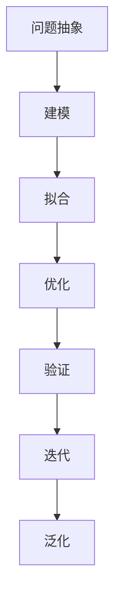

                 

# 模型思维：认知复杂世界的快捷方式

## 1. 背景介绍

### 1.1 问题由来

在现代社会，我们面对的信息量爆炸式增长，从文本、图片、音频到视频，从传感器数据到社交网络，从传统媒体到新兴技术，海量数据的涌现使得传统的数据处理和认知方法面临巨大挑战。然而，传统的统计方法、常规的线性模型和经验法则在处理复杂、动态、高维的数据时，常常显得力不从心。

模型思维作为认知复杂世界的快捷方式，能够帮助我们从海量数据中提取出本质规律，进行预测和决策。借助模型，我们可以更深入地理解数据背后的真实世界，从而在医疗、金融、商业、教育等多个领域中做出更加明智的决策。

### 1.2 问题核心关键点

模型思维的核心在于将现实问题转化为可量化、可模拟的数学模型，通过数学分析、数据拟合和参数优化等方式，建立并求解模型，从而获得问题的解或优化策略。具体来说，模型思维涉及以下关键步骤：

1. **问题抽象与建模**：将现实问题抽象为数学问题，选择合适的模型进行描述。
2. **模型求解**：对模型进行求解，得到问题的解或最优解。
3. **模型验证与优化**：通过实验验证模型的有效性，不断优化模型的参数和结构。
4. **应用与推广**：将模型应用于实际问题，推广至更多场景，实现泛化应用。

### 1.3 问题研究意义

研究模型思维对于推动科学发展、解决实际问题具有重要意义：

1. **科学进步**：模型思维帮助科学家从复杂现象中提炼规律，推动理论创新。
2. **问题解决**：模型思维为工程技术人员提供工具，解决实际问题。
3. **决策支持**：模型思维为决策者提供依据，提高决策质量。
4. **技术落地**：模型思维促进科技成果的产业化，带来经济效益。

## 2. 核心概念与联系

### 2.1 核心概念概述

模型思维涉及多个核心概念，这些概念之间存在紧密的联系：

- **模型**：描述现实问题的数学框架，通过数学变量和函数来刻画输入和输出之间的关系。
- **拟合**：通过数据训练模型参数，使模型输出与真实数据尽可能接近。
- **优化**：在拟合过程中，通过优化算法调整模型参数，找到最优解。
- **泛化**：模型不仅在训练数据上表现好，也能在新数据上保持良好性能。
- **验证**：通过验证集评估模型性能，确保模型具有良好的泛化能力。
- **迭代**：在模型构建、训练、验证、优化等环节进行多次迭代，不断提升模型性能。

这些概念共同构成了模型思维的核心框架，帮助我们从数据中提取知识，解决复杂问题。

### 2.2 核心概念原理和架构的 Mermaid 流程图



这个流程图展示了模型思维的关键步骤：

1. 从现实问题抽象为数学问题（问题抽象）
2. 选择适当的模型进行描述（建模）
3. 通过数据训练模型参数（拟合）
4. 使用优化算法调整模型参数（优化）
5. 在验证集上评估模型性能（验证）
6. 进行多次迭代提升模型（迭代）
7. 模型泛化到新数据上（泛化）

这些步骤环环相扣，共同构成模型思维的全过程。

## 3. 核心算法原理 & 具体操作步骤

### 3.1 算法原理概述

模型思维的核心在于建立和求解数学模型，其中最常用的算法包括线性回归、逻辑回归、决策树、随机森林、神经网络等。这些算法通过数学推导和实验验证，不断迭代优化，最终成为解决各类问题的有效工具。

例如，线性回归通过最小二乘法拟合数据点，建立线性模型，进行回归预测。逻辑回归使用sigmoid函数将线性模型输出映射到[0,1]区间，用于分类任务。决策树通过树形结构进行分类或回归，通过剪枝和交叉验证优化模型。神经网络通过多层非线性变换，进行高维数据的复杂建模和预测。

### 3.2 算法步骤详解

以神经网络为例，其核心步骤如下：

1. **数据预处理**：将原始数据进行归一化、标准化等处理，减少数据间的量纲差异。
2. **模型构建**：设计神经网络的结构，包括层数、节点数、激活函数等。
3. **损失函数定义**：选择适当的损失函数，如均方误差、交叉熵等，衡量模型预测与真实值之间的差异。
4. **参数初始化**：随机初始化模型参数，进行前向传播计算预测值。
5. **反向传播**：根据损失函数计算梯度，使用优化算法更新模型参数。
6. **迭代训练**：在训练集上多次迭代训练，直到模型收敛。
7. **验证与调参**：在验证集上评估模型性能，调整模型参数和结构。
8. **泛化应用**：将训练好的模型应用于新数据，进行预测或分类。

### 3.3 算法优缺点

模型思维具有以下优点：

1. **准确性高**：通过数学建模，能够从海量数据中提取规律，提供高精度的预测。
2. **灵活性大**：适用于多种类型的数据和问题，具有广泛的适用性。
3. **可解释性**：模型的每个参数和每一步计算都是可解释的，便于理解。
4. **可扩展性**：可以通过增加模型复杂度或优化算法，不断提升模型性能。

同时，模型思维也存在一些缺点：

1. **复杂度高**：模型构建和训练过程复杂，需要专业知识。
2. **数据需求大**：需要大量高质量的标注数据进行训练，数据获取成本高。
3. **易过拟合**：模型参数过多，容易过拟合训练集，泛化能力差。
4. **计算资源需求高**：模型训练需要高性能计算设备，成本较高。
5. **黑盒问题**：模型参数众多，难以直观理解模型内部工作机制。

### 3.4 算法应用领域

模型思维在各个领域都有广泛的应用，例如：

- **金融风险管理**：通过建立信用评分模型，预测客户信用风险。
- **医疗诊断**：利用诊断模型，辅助医生进行疾病诊断和治疗方案选择。
- **工业生产**：通过优化模型，提升生产线效率和产品质量。
- **市场营销**：建立消费者行为模型，指导市场策略制定。
- **智能交通**：构建交通流量预测模型，优化交通信号灯控制。
- **电子商务**：利用推荐模型，提升用户购物体验和销售转化率。

## 4. 数学模型和公式 & 详细讲解 & 举例说明

### 4.1 数学模型构建

模型的构建通常包括以下步骤：

1. **问题抽象**：将现实问题转化为数学问题。
2. **模型选择**：选择适当的模型框架。
3. **模型参数**：定义模型的输入和输出变量，设定模型参数。
4. **损失函数**：定义损失函数，衡量模型预测与真实值之间的差异。

以线性回归模型为例，其数学模型为：

$$ y = \theta_0 + \sum_{i=1}^{n} \theta_i x_i $$

其中 $y$ 为输出变量，$x_i$ 为输入变量，$\theta_i$ 为模型参数。

### 4.2 公式推导过程

线性回归模型的最小二乘法损失函数为：

$$ \mathcal{L}(\theta) = \frac{1}{2N} \sum_{i=1}^{N} (y_i - (\theta_0 + \sum_{i=1}^{n} \theta_i x_{i,i}))^2 $$

其中 $N$ 为样本数量，$y_i$ 为真实值，$(\theta_0 + \sum_{i=1}^{n} \theta_i x_{i,i})$ 为模型预测值。

最小二乘法的目标是最小化损失函数，即：

$$ \theta^* = \mathop{\arg\min}_{\theta} \mathcal{L}(\theta) $$

通过梯度下降等优化算法，求解上述最优化问题。

### 4.3 案例分析与讲解

以房价预测模型为例，我们可以使用线性回归模型进行建模和求解。数据集包含多个特征，如房屋面积、地理位置、建筑年代等，以及对应的房价。通过数据拟合，得到模型的参数，并用于预测新房的房价。

## 5. 项目实践：代码实例和详细解释说明

### 5.1 开发环境搭建

项目实践前，我们需要准备好开发环境。以下是Python和TensorFlow环境的搭建步骤：

1. 安装Python和相关库：
```bash
sudo apt-get update
sudo apt-get install python3-pip python3-dev python3-venv
pip3 install tensorflow
```

2. 创建虚拟环境：
```bash
python3 -m venv tf_env
source tf_env/bin/activate
```

### 5.2 源代码详细实现

以下是一个简单的线性回归模型实现，用于房价预测：

```python
import tensorflow as tf
import numpy as np
from sklearn.model_selection import train_test_split

# 加载数据集
data = np.loadtxt('data.csv', delimiter=',', skiprows=1, usecols=(0,1))
X = data[:, 0:2]  # 特征变量
y = data[:, 2]  # 目标变量

# 划分训练集和验证集
X_train, X_val, y_train, y_val = train_test_split(X, y, test_size=0.2)

# 定义模型
def linear_regression(x, y):
    theta = tf.Variable(tf.random.normal([2, 1]))
    y_pred = tf.matmul(x, theta)
    loss = tf.reduce_mean(tf.square(y_pred - y))
    optimizer = tf.optimizers.SGD(learning_rate=0.01)
    with tf.GradientTape() as tape:
        grads = tape.gradient(loss, theta)
    return loss, grads

# 训练模型
def train_model(X_train, y_train, X_val, y_val, epochs):
    loss_train, loss_val = [], []
    for epoch in range(epochs):
        loss, grads = linear_regression(X_train, y_train)
        optimizer.apply_gradients(zip(grads, theta))
        loss_train.append(loss)
        loss_val.append(linear_regression(X_val, y_val)[0])
        if epoch % 10 == 0:
            print(f'Epoch {epoch+1}/{epochs}, Loss: {loss.numpy()}, Val Loss: {loss_val[-1]}')
    return loss_train, loss_val

# 运行训练
loss_train, loss_val = train_model(X_train, y_train, X_val, y_val, 100)
```

### 5.3 代码解读与分析

以上代码实现了一个简单的线性回归模型，具体解读如下：

1. **数据加载**：使用NumPy加载CSV格式的数据集，将特征变量和目标变量分别赋值给 `X` 和 `y`。
2. **数据划分**：使用sklearn的 `train_test_split` 方法，将数据集划分为训练集和验证集。
3. **模型定义**：定义线性回归模型，包括特征变量、目标变量和模型参数。
4. **损失函数**：定义损失函数，使用均方误差衡量模型预测与真实值之间的差异。
5. **优化器**：使用梯度下降优化算法，更新模型参数。
6. **模型训练**：在训练集上多次迭代训练，记录每个epoch的损失函数值。
7. **验证集评估**：在验证集上评估模型性能，输出每个epoch的损失函数值。
8. **训练结果**：输出训练集和验证集的损失函数值，可视化训练过程。

## 6. 实际应用场景

### 6.1 智能推荐系统

模型思维在智能推荐系统中得到了广泛应用，如电商推荐、新闻推荐等。推荐系统通过建立用户-物品的评分矩阵，使用协同过滤、内容过滤、混合推荐等算法，预测用户对新物品的评分，从而提供个性化推荐。

在实际应用中，可以通过收集用户的历史行为数据和物品属性数据，构建评分矩阵，使用线性回归、逻辑回归、神经网络等模型进行拟合和预测。模型输出用户的评分预测值，通过排序选择推荐物品，提升用户体验和满意度。

### 6.2 金融风控管理

金融风险管理是模型思维的重要应用领域之一。通过构建信用评分模型，银行可以预测客户的信用风险，进行贷款审批和授信管理。

具体而言，银行可以收集客户的信用记录、收入水平、职业信息等数据，使用逻辑回归、随机森林等模型进行建模和预测。模型输出客户的信用评分，根据评分高低进行贷款审批和授信管理，从而降低坏账率，提升风险控制能力。

### 6.3 医疗诊断系统

医疗诊断系统是模型思维在医疗领域的重要应用。通过建立诊断模型，医生可以辅助诊断疾病，提高诊断的准确性和效率。

在实际应用中，医疗系统可以收集患者的症状、体征、病史等数据，使用决策树、神经网络等模型进行建模和预测。模型输出疾病诊断结果，医生可以参考诊断结果，进行更准确的治疗方案选择。

### 6.4 未来应用展望

随着模型思维技术的不断进步，其应用领域将不断拓展，带来更多创新和突破：

1. **医疗领域**：通过模型思维，可以建立更加精准的疾病预测和诊断模型，辅助医生做出更准确的诊断和治疗决策。
2. **金融领域**：使用模型思维构建更加稳健的信用评分和风险管理模型，降低金融风险，提升金融机构竞争力。
3. **教育领域**：通过模型思维，可以构建个性化推荐和智能辅导系统，提升教育质量和效率。
4. **交通领域**：建立交通流量预测和智能交通管理系统，优化交通信号灯控制，提高道路通行效率。
5. **能源领域**：利用模型思维，进行能源需求预测和智能调度，提升能源利用效率和可靠性。

## 7. 工具和资源推荐

### 7.1 学习资源推荐

为了帮助开发者深入掌握模型思维技术，这里推荐一些优质的学习资源：

1. **《机器学习》教材**：由Tom Mitchell和Peter Flach编写的经典教材，涵盖了模型思维的各个方面，适合初学者入门。
2. **Coursera《机器学习》课程**：由Andrew Ng开设的机器学习课程，内容详实，案例丰富，是学习模型思维的绝佳选择。
3. **Kaggle竞赛平台**：通过参与数据科学竞赛，提升模型思维能力，了解实际应用中的问题和方法。
4. **ArXiv论文库**：阅读最新的研究论文，了解模型思维的最新进展和应用。
5. **DeepLearning.AI课程**：由Andrew Ng和John Hughes联合开设的深度学习课程，涵盖深度学习模型构建和应用。

### 7.2 开发工具推荐

以下是几款用于模型思维开发的常用工具：

1. **Python和NumPy**：Python是数据科学和机器学习的主流语言，NumPy提供了高效的数组和矩阵计算功能。
2. **TensorFlow和PyTorch**：常用的深度学习框架，支持多种模型构建和优化算法。
3. **Scikit-learn**：开源机器学习库，提供了丰富的机器学习算法和工具，方便模型构建和评估。
4. **Jupyter Notebook**：交互式笔记本环境，支持Python代码的实时执行和展示，便于数据分析和模型构建。
5. **Anaconda**：Python环境管理工具，方便虚拟环境的创建和维护。

### 7.3 相关论文推荐

以下是几篇奠基性的模型思维相关论文，推荐阅读：

1. **《线性回归分析》**：由霍华德·戴维森和马克·F·哈特菲尔德编写的经典教材，系统介绍了线性回归模型及其应用。
2. **《机器学习：模型、算法和应用》**：由John Hughes和Ada Wai Chee编写，全面介绍了机器学习模型的构建和应用。
3. **《神经网络与深度学习》**：由Ian Goodfellow、Yoshua Bengio和Aaron Courville编写的经典教材，涵盖了神经网络和深度学习模型的构建和优化。
4. **《决策树学习》**：由Judea Pearl编写的经典教材，介绍了决策树模型的构建和应用。
5. **《集成学习》**：由Trevor Hastie、Robert Tibshirani和Jerome Friedman编写的经典教材，介绍了集成学习模型及其应用。

## 8. 总结：未来发展趋势与挑战

### 8.1 研究成果总结

模型思维作为认知复杂世界的快捷方式，已经广泛应用于金融、医疗、电商等多个领域。通过建立数学模型，我们能够从海量数据中提取规律，解决复杂问题，提升决策质量。未来，随着模型思维技术的不断发展，其应用领域将更加广泛，为人类社会带来更多创新和突破。

### 8.2 未来发展趋势

模型思维的未来发展趋势包括：

1. **多模态融合**：将文本、图像、音频等多种数据类型进行融合，提升模型的表达能力和泛化能力。
2. **联邦学习**：通过分布式训练，保护数据隐私，提升模型的鲁棒性和泛化能力。
3. **自适应学习**：构建自适应模型，根据数据和环境的变化，动态调整模型参数和结构。
4. **强化学习**：通过奖励机制，优化模型行为，提升模型在复杂环境中的决策能力。
5. **解释性增强**：通过可视化技术，增强模型的可解释性，提升模型在实际应用中的可信度和可接受度。

### 8.3 面临的挑战

尽管模型思维技术在各个领域得到了广泛应用，但其仍面临诸多挑战：

1. **数据获取难度大**：高质量标注数据的获取成本高，数据质量难以保证。
2. **模型复杂度高**：模型构建和训练过程复杂，需要专业知识。
3. **计算资源需求高**：模型训练需要高性能计算设备，成本较高。
4. **模型泛化能力差**：模型参数过多，容易过拟合训练集，泛化能力差。
5. **模型可解释性差**：模型参数众多，难以直观理解模型内部工作机制。

### 8.4 研究展望

未来的研究需要在以下几个方面寻求新的突破：

1. **模型压缩**：通过模型压缩技术，减少模型参数，提升计算效率和模型泛化能力。
2. **模型融合**：将多种模型进行融合，提升模型的表达能力和泛化能力。
3. **模型优化**：通过优化算法，提高模型的训练速度和准确性。
4. **模型部署**：将模型部署到实际应用场景中，进行实时预测和决策。
5. **模型评估**：构建合理的模型评估体系，评估模型在实际应用中的性能和效果。

总之，模型思维作为一种认知复杂世界的快捷方式，将在未来发挥更加重要的作用。只有不断突破技术瓶颈，解决实际问题，模型思维才能真正实现其价值，推动社会的进步和发展。

## 9. 附录：常见问题与解答

**Q1: 什么是模型思维？**

A: 模型思维是一种将现实问题转化为可量化、可模拟的数学模型，通过数学分析和数据拟合，建立并求解模型，从而解决复杂问题的思维方式。

**Q2: 模型思维有哪些应用领域？**

A: 模型思维在金融、医疗、电商、智能推荐、交通、能源等多个领域都有广泛的应用。

**Q3: 如何选择合适的模型？**

A: 选择合适的模型需要考虑问题的类型、数据的特征、模型的复杂度等因素。一般来说，对于高维数据和复杂问题，可以选择神经网络等模型；对于低维数据和简单问题，可以选择线性回归、逻辑回归等模型。

**Q4: 如何避免过拟合？**

A: 避免过拟合可以采用正则化、数据增强、模型剪枝等方法，控制模型的复杂度，提升泛化能力。

**Q5: 如何提升模型的可解释性？**

A: 提升模型的可解释性可以采用可视化技术，解释模型内部的决策过程和参数含义，便于理解和调试。

---

作者：禅与计算机程序设计艺术 / Zen and the Art of Computer Programming

