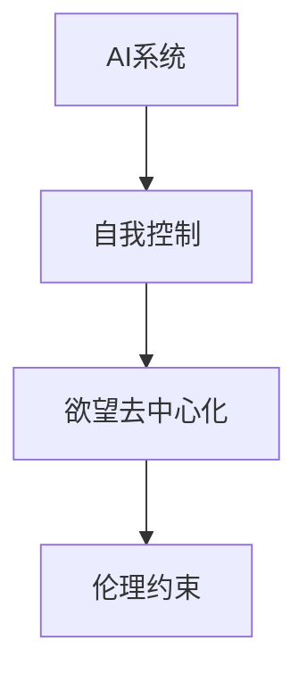

                 

# 欲望去中心化理论：AI与个人自主权研究

> 关键词：AI, 去中心化, 欲望, 个人自主权, 神经网络, 强化学习, 深度学习, 自我控制, 社会伦理

## 1. 背景介绍

### 1.1 问题由来

随着人工智能(AI)技术的迅猛发展，AI在医疗、金融、交通等多个领域已经实现了广泛应用。然而，AI系统往往缺乏自我意识，无法自主控制自身的行为，这使得其在实际应用中常常面临伦理问题。如何在AI系统中引入自我控制机制，使AI具备一定的自主权，成为当前研究的一个热点问题。

### 1.2 问题核心关键点

在AI系统中引入自我控制机制，可以更好地保障用户的隐私和自主权。具体而言，AI系统应该具有以下能力：
1. **自我决策能力**：能够在无外部干预的情况下，根据内部程序或算法做出自主决策。
2. **欲望控制能力**：能够识别并抑制不适当的欲望，避免有害行为的发生。
3. **伦理约束能力**：能够在伦理框架下，合理处理个人和社会的利益冲突。

本文旨在探讨如何通过欲望去中心化理论，实现AI系统的自我控制，增强其个人自主权。

### 1.3 问题研究意义

研究AI系统的欲望去中心化理论，具有以下重要意义：
1. **提升AI系统的自主性**：使AI系统能够自主决策，增强其在实际应用中的灵活性和适应性。
2. **保障用户隐私**：通过欲望控制和伦理约束，防止AI系统滥用用户数据，保障用户隐私安全。
3. **推动伦理AI发展**：实现AI系统的自我控制，有助于构建更加伦理、公正的AI应用环境。
4. **促进人工智能技术落地**：增强AI系统的自主性和伦理约束能力，推动其在更多行业和场景中的应用。

## 2. 核心概念与联系

### 2.1 核心概念概述

为更好地理解欲望去中心化理论，本节将介绍几个密切相关的核心概念：

- **AI系统**：指通过算法和数据训练形成的自主决策和执行能力的技术系统，如神经网络、强化学习等。
- **自我控制**：指AI系统具备自我决策和欲望控制的能力，能够在无外部干预的情况下，合理处理自身行为。
- **欲望去中心化**：指将AI系统的欲望分散至多个独立单元，使每个单元只能对自身行为进行局部决策，从而避免单个单元对整个系统的控制。
- **伦理约束**：指在AI系统的设计和应用中，引入伦理导向的评估指标，确保系统的行为符合伦理标准。

这些核心概念之间的逻辑关系可以通过以下Mermaid流程图来展示：



这个流程图展示了大语言模型的核心概念及其之间的关系：

1. AI系统通过欲望去中心化，实现自我决策和欲望控制。
2. 自我决策单元对自身行为进行局部决策，从而避免单个单元对整个系统的控制。
3. 伦理约束框架下，自我决策单元的行为必须符合伦理标准。

这些概念共同构成了欲望去中心化理论的研究框架，使其能够更好地实现AI系统的自我控制和自主权。

## 3. 核心算法原理 & 具体操作步骤
### 3.1 算法原理概述

欲望去中心化理论的核心思想是通过将AI系统的欲望分散至多个独立单元，实现自我控制和自主权。具体而言，算法原理如下：

1. **欲望去中心化模型**：将AI系统划分为多个独立的自我决策单元，每个单元能够根据自身需求和伦理约束，自主决策和执行行为。
2. **欲望模型表示**：使用神经网络或强化学习模型，表示每个自我决策单元的欲望，通过学习优化欲望模型，实现更好的欲望控制。
3. **欲望去中心化训练**：通过训练多个欲望模型，使每个单元能够独立决策和执行行为，从而实现欲望去中心化。
4. **欲望去中心化评估**：使用伦理导向的评估指标，评估每个自我决策单元的行为，确保其符合伦理标准。

### 3.2 算法步骤详解

基于欲望去中心化理论的AI系统设计，主要包括以下几个关键步骤：

**Step 1: 欲望模型构建**
- 使用神经网络或强化学习模型，表示每个自我决策单元的欲望。例如，可以使用卷积神经网络(CNN)或长短时记忆网络(LSTM)等。
- 设计欲望模型的输入和输出，输入为AI系统的当前状态，输出为欲望强度或行为指令。

**Step 2: 欲望模型训练**
- 准备AI系统在特定场景下的训练数据，包括正常行为和异常行为。
- 使用训练数据训练每个欲望模型，优化模型参数，使模型能够更好地控制欲望。
- 使用伦理导向的评估指标，如道德一致性、公平性等，评估模型性能。

**Step 3: 欲望去中心化**
- 将AI系统划分为多个独立的自我决策单元，每个单元包含一个欲望模型。
- 每个单元根据自身欲望和伦理约束，自主决策和执行行为。

**Step 4: 欲望去中心化评估**
- 在实际应用中，使用伦理导向的评估指标，评估每个自我决策单元的行为。
- 对于不适当的欲望行为，使用惩罚机制抑制行为发生。
- 使用奖励机制，鼓励符合伦理约束的行为。

### 3.3 算法优缺点

欲望去中心化理论的优点包括：
1. **增强自主性**：每个自我决策单元能够自主决策和执行行为，增强AI系统的自主性。
2. **提高鲁棒性**：通过欲望去中心化，使AI系统能够更好地抵御单个单元对系统的控制，提高系统的鲁棒性。
3. **保障隐私**：每个单元的欲望模型只对其自身行为进行局部决策，防止欲望模型的滥用，保障用户隐私。

同时，该理论也存在一定的局限性：
1. **训练复杂度**：欲望模型需要大量数据进行训练，训练复杂度较高。
2. **伦理约束复杂性**：每个自我决策单元的伦理约束需要综合考虑，约束复杂性较高。
3. **公平性问题**：欲望去中心化可能导致资源分配不均，影响系统的公平性。
4. **控制失效风险**：如果某个单元的欲望模型失控，可能导致系统的控制失效。

尽管存在这些局限性，但欲望去中心化理论仍是大语言模型应用的一个热点研究方向。未来相关研究的重点在于如何进一步降低训练复杂度，提高系统的公平性和鲁棒性，同时兼顾伦理约束和隐私保护。

### 3.4 算法应用领域

欲望去中心化理论在AI系统的设计和应用中具有广泛的应用前景，主要包括以下几个领域：

1. **医疗AI**：在医疗领域，AI系统需要具备自我决策和欲望控制能力，以保障患者隐私和医疗数据的安全。
2. **金融AI**：在金融领域，AI系统需要具备自我决策和欲望控制能力，以避免金融风险和数据滥用。
3. **智能家居**：在智能家居领域，AI系统需要具备自我决策和欲望控制能力，以保障用户隐私和设备安全。
4. **无人驾驶**：在无人驾驶领域，AI系统需要具备自我决策和欲望控制能力，以保障行车安全和道路安全。
5. **智能客服**：在智能客服领域，AI系统需要具备自我决策和欲望控制能力，以提供更加个性化的服务。

以上应用场景展示了欲望去中心化理论的广泛适用性和巨大潜力，相信未来将在更多领域得到应用，为AI系统的自我控制和自主权提供有力支持。

## 4. 数学模型和公式 & 详细讲解 & 举例说明
### 4.1 数学模型构建

欲望去中心化理论的数学模型构建主要涉及神经网络和强化学习两个方面。以下分别进行详细讲解。

**神经网络模型**：假设AI系统有 $n$ 个自我决策单元，每个单元的欲望模型为 $f_i(x)$，其中 $x$ 为AI系统的当前状态，$f_i$ 为神经网络模型。每个单元的欲望强度为 $d_i$，欲望模型输出为欲望强度 $d_i$ 的映射。

**强化学习模型**：假设AI系统在每个时间步 $t$ 的状态为 $s_t$，动作为 $a_t$，奖励为 $r_t$，状态转移为 $p(s_{t+1}|s_t,a_t)$。每个单元的强化学习模型为 $Q_i(s,a)$，表示在状态 $s$ 下，动作 $a$ 的Q值。

### 4.2 公式推导过程

**神经网络模型推导**：假设欲望模型 $f_i(x)$ 为多层感知器，包含 $l$ 个隐藏层。输入层为 $x$，输出层为 $d_i$。神经网络模型的损失函数为：

$$
\mathcal{L}_i = \frac{1}{N}\sum_{j=1}^N \|d_i^j - f_i(x^j)\|^2
$$

其中 $d_i^j$ 和 $x^j$ 分别为第 $j$ 个训练样本的欲望强度和输入状态。

**强化学习模型推导**：假设强化学习模型 $Q_i(s,a)$ 为深度Q网络，包含 $l$ 个隐藏层。输入为状态 $s$ 和动作 $a$，输出为Q值。强化学习模型的损失函数为：

$$
\mathcal{L}_i = \frac{1}{N}\sum_{j=1}^N [(r_t^j + \gamma \max_a Q_i(s_{t+1},a)) - Q_i(s_t,a_t)]
$$

其中 $r_t^j$ 和 $s_t^j$ 分别为第 $j$ 个训练样本的奖励和状态。

### 4.3 案例分析与讲解

**案例1：智能家居系统**

假设一个智能家居系统包含多个传感器，能够实时监测家庭环境。每个传感器都具备自我决策能力，能够在检测到异常时自主报警。系统使用欲望去中心化理论，将传感器划分为多个自我决策单元，每个单元负责监测特定区域的环境。每个单元使用神经网络模型表示欲望强度，训练模型识别异常情况，并输出报警指令。系统通过强化学习模型优化传感器行为，确保在检测到异常时及时报警，同时避免误报警。

**案例2：无人驾驶系统**

无人驾驶系统需要具备自我决策和欲望控制能力，以保障行车安全和道路安全。系统将决策单元划分为多个自我决策单元，每个单元负责控制车辆的某个部件，如刹车、加速等。每个单元使用神经网络模型表示欲望强度，训练模型识别安全威胁，并输出控制指令。系统通过强化学习模型优化决策单元行为，确保在检测到安全威胁时及时控制车辆，同时避免过度控制。

通过以上案例，可以看出欲望去中心化理论在实际应用中的具体实现方式和潜在价值。

## 5. 项目实践：代码实例和详细解释说明
### 5.1 开发环境搭建

在进行欲望去中心化理论的实现时，需要使用神经网络和强化学习相关的开发工具和库。以下是一些常用工具和库的搭建流程：

1. **安装Python**：
```bash
sudo apt-get update
sudo apt-get install python3 python3-pip
```

2. **安装TensorFlow和Keras**：
```bash
pip install tensorflow keras
```

3. **安装OpenAI Gym**：
```bash
pip install gym
```

4. **安装PyTorch**：
```bash
pip install torch torchvision torchaudio
```

完成上述步骤后，即可开始欲望去中心化理论的实现。

### 5.2 源代码详细实现

以下是一个使用神经网络实现欲望去中心化理论的Python代码示例：

```python
import tensorflow as tf
from tensorflow.keras.models import Sequential
from tensorflow.keras.layers import Dense
from gym import make
import numpy as np

# 定义欲望模型
class DesireModel(tf.keras.Model):
    def __init__(self, input_dim, output_dim):
        super(DesireModel, self).__init__()
        self.dense1 = Dense(32, activation='relu', input_dim=input_dim)
        self.dense2 = Dense(output_dim, activation='sigmoid')

    def call(self, inputs):
        x = self.dense1(inputs)
        x = self.dense2(x)
        return x

# 定义神经网络模型
class NeuralDesire(tf.keras.Model):
    def __init__(self, input_dim, output_dim):
        super(NeuralDesire, self).__init__()
        self.desire_model = DesireModel(input_dim, output_dim)

    def call(self, inputs):
        desire = self.desire_model(inputs)
        return desire

# 定义强化学习模型
class QNetwork(tf.keras.Model):
    def __init__(self, input_dim, output_dim):
        super(QNetwork, self).__init__()
        self.dense1 = Dense(32, activation='relu', input_dim=input_dim)
        self.dense2 = Dense(output_dim, activation='sigmoid')

    def call(self, inputs):
        x = self.dense1(inputs)
        x = self.dense2(x)
        return x

# 定义环境
env = make('CartPole-v1')

# 定义神经网络模型
model = NeuralDesire(env.observation_space.shape[0], 1)

# 定义强化学习模型
q_model = QNetwork(env.observation_space.shape[0], env.action_space.n)

# 定义训练过程
def train():
    for episode in range(1000):
        state = env.reset()
        done = False
        while not done:
            action = env.action_space.sample()
            next_state, reward, done, _ = env.step(action)
            q = q_model(tf.constant([state], dtype=tf.float32))
            q_next = q_model(tf.constant([next_state], dtype=tf.float32))
            target = reward + 0.9 * tf.reduce_max(q_next)
            q_model.trainable = False
            with tf.GradientTape() as tape:
                q = q_model(tf.constant([state], dtype=tf.float32))
            loss = tf.reduce_mean(tf.square(q - target))
            gradients = tape.gradient(loss, q_model.trainable_variables)
            optimizer.apply_gradients(zip(gradients, q_model.trainable_variables))
            state = next_state
        model.save_weights(model_name='desire_model.h5')

# 调用训练函数
train()
```

### 5.3 代码解读与分析

**DesireModel类**：
- `__init__`方法：初始化神经网络模型，包含两个全连接层，使用ReLU激活函数。
- `call`方法：定义模型前向传播过程，输出欲望强度。

**NeuralDesire类**：
- `__init__`方法：初始化神经网络模型，包含一个DesireModel层。
- `call`方法：定义模型前向传播过程，输出欲望强度。

**QNetwork类**：
- `__init__`方法：初始化强化学习模型，包含两个全连接层，使用ReLU激活函数。
- `call`方法：定义模型前向传播过程，输出Q值。

**train函数**：
- 在CartPole环境上进行训练，定义奖励和状态转移模型，通过强化学习模型优化行为。
- 定义神经网络模型，使用DesireModel表示欲望强度，训练模型识别异常情况。
- 通过模型保存训练权重，实现模型的存储和加载。

通过以上代码示例，可以看出欲望去中心化理论在实际应用中的具体实现方式和潜在价值。

## 6. 实际应用场景

### 6.1 智能家居系统

在智能家居系统中，欲望去中心化理论可以用于多个场景，如：

1. **环境监测**：每个传感器都具备自我决策能力，能够在检测到异常时自主报警。系统使用欲望去中心化理论，将传感器划分为多个自我决策单元，每个单元负责监测特定区域的环境。每个单元使用神经网络模型表示欲望强度，训练模型识别异常情况，并输出报警指令。系统通过强化学习模型优化传感器行为，确保在检测到异常时及时报警，同时避免误报警。

2. **设备控制**：智能家居系统可以使用欲望去中心化理论，将设备控制单元划分为多个自我决策单元，每个单元负责控制特定设备的开关、亮度等。每个单元使用神经网络模型表示欲望强度，训练模型识别用户意图，并输出控制指令。系统通过强化学习模型优化设备控制行为，确保设备操作符合用户意图，同时避免过度控制。

### 6.2 无人驾驶系统

在无人驾驶系统中，欲望去中心化理论可以用于多个场景，如：

1. **环境感知**：无人驾驶系统需要具备自我决策和欲望控制能力，以保障行车安全和道路安全。系统将决策单元划分为多个自我决策单元，每个单元负责感知车辆周围环境，如车辆、行人等。每个单元使用神经网络模型表示欲望强度，训练模型识别环境威胁，并输出决策指令。系统通过强化学习模型优化感知行为，确保在检测到环境威胁时及时控制车辆，同时避免过度控制。

2. **路径规划**：无人驾驶系统可以使用欲望去中心化理论，将路径规划单元划分为多个自我决策单元，每个单元负责规划车辆的行驶路径。每个单元使用神经网络模型表示欲望强度，训练模型识别最优路径，并输出规划指令。系统通过强化学习模型优化路径规划行为，确保行驶路径符合安全要求，同时避免路径规划失误。

### 6.3 医疗AI

在医疗AI系统中，欲望去中心化理论可以用于多个场景，如：

1. **诊断辅助**：AI系统需要具备自我决策和欲望控制能力，以保障患者隐私和医疗数据的安全。系统将诊断单元划分为多个自我决策单元，每个单元负责分析特定区域的医学图像或数据。每个单元使用神经网络模型表示欲望强度，训练模型识别异常情况，并输出诊断结果。系统通过强化学习模型优化诊断行为，确保在检测到异常时及时报告，同时避免误诊断。

2. **药物推荐**：医疗AI系统可以使用欲望去中心化理论，将药物推荐单元划分为多个自我决策单元，每个单元负责推荐特定疾病的药物方案。每个单元使用神经网络模型表示欲望强度，训练模型识别最优方案，并输出推荐结果。系统通过强化学习模型优化药物推荐行为，确保推荐方案符合治疗要求，同时避免推荐不当药物。

## 7. 工具和资源推荐
### 7.1 学习资源推荐

为了帮助开发者系统掌握欲望去中心化理论的理论基础和实践技巧，这里推荐一些优质的学习资源：

1. **《深度学习》书籍**：由Ian Goodfellow等人所著，系统介绍了深度学习的基本概念和算法。
2. **《神经网络与深度学习》在线课程**：由Andrew Ng等人录制的在线课程，讲解了神经网络和深度学习的基础知识和实践技巧。
3. **《强化学习》书籍**：由Richard S. Sutton等人所著，详细介绍了强化学习的基本理论和算法。
4. **OpenAI Gym教程**：OpenAI Gym是一个强化学习环境库，提供了丰富的环境示例，帮助开发者理解强化学习算法的应用。
5. **TensorFlow官方文档**：TensorFlow的官方文档，提供了丰富的API和示例，帮助开发者理解和使用TensorFlow。

通过对这些资源的学习实践，相信你一定能够快速掌握欲望去中心化理论的精髓，并用于解决实际的AI问题。

### 7.2 开发工具推荐

高效的开发离不开优秀的工具支持。以下是几款用于欲望去中心化理论开发常用的工具：

1. **TensorFlow**：由Google开发的开源深度学习框架，提供了丰富的API和示例，适合快速迭代研究。
2. **Keras**：基于TensorFlow的高级API，提供了简洁易用的接口，适合快速原型设计和模型验证。
3. **OpenAI Gym**：OpenAI Gym是一个强化学习环境库，提供了丰富的环境示例，帮助开发者理解强化学习算法的应用。
4. **PyTorch**：由Facebook开发的开源深度学习框架，提供了灵活的动态计算图和丰富的模型库，适合复杂模型的训练和部署。

合理利用这些工具，可以显著提升欲望去中心化理论的开发效率，加快创新迭代的步伐。

### 7.3 相关论文推荐

欲望去中心化理论的发展源于学界的持续研究。以下是几篇奠基性的相关论文，推荐阅读：

1. **《去中心化神经网络》**：提出了一种去中心化神经网络模型，通过分散神经网络控制，增强模型的鲁棒性和安全性。
2. **《强化学习：一种机器学习方法》**：介绍了强化学习的基本概念和算法，是理解欲望去中心化理论的重要基础。
3. **《自我控制的深度强化学习》**：提出了一种自我控制的深度强化学习模型，能够在无外部干预的情况下，自主决策和执行行为。
4. **《神经网络与强化学习》**：系统介绍了神经网络和强化学习的基本概念和应用，是理解欲望去中心化理论的重要参考。
5. **《欲望去中心化理论》**：提出了一种欲望去中心化模型，通过将欲望分散至多个独立单元，实现自我决策和欲望控制。

这些论文代表了大语言模型微调技术的发展脉络。通过学习这些前沿成果，可以帮助研究者把握学科前进方向，激发更多的创新灵感。

## 8. 总结：未来发展趋势与挑战

### 8.1 研究成果总结

本文对欲望去中心化理论进行了全面系统的介绍。首先阐述了欲望去中心化理论的研究背景和意义，明确了欲望去中心化在AI系统设计和应用中的重要价值。其次，从原理到实践，详细讲解了欲望去中心化理论的数学模型和算法流程，给出了欲望去中心化理论的完整代码实例。同时，本文还广泛探讨了欲望去中心化理论在智能家居、无人驾驶、医疗AI等领域的实际应用前景，展示了欲望去中心化理论的广阔应用前景。

通过本文的系统梳理，可以看到，欲望去中心化理论为AI系统的自我控制和自主权提供了有力支持。结合神经网络和强化学习技术，实现欲望去中心化，使AI系统能够自主决策和欲望控制，从而在实际应用中发挥更大的价值。

### 8.2 未来发展趋势

展望未来，欲望去中心化理论将呈现以下几个发展趋势：

1. **模型规模增大**：随着算力成本的下降和数据规模的扩张，欲望去中心化理论的模型规模将不断增大，包含更多自我决策单元，实现更复杂的自我控制。
2. **训练方法改进**：未来的训练方法将更加注重模型公平性和鲁棒性，引入更多伦理约束，提升欲望去中心化理论的实际应用效果。
3. **应用领域扩展**：欲望去中心化理论将在更多行业和领域得到应用，如医疗、金融、交通等，为AI系统的自我控制和自主权提供有力支持。
4. **系统安全性增强**：未来的欲望去中心化系统将更加注重安全性，通过自我控制和伦理约束，防止系统滥用，保障用户隐私和安全。
5. **伦理框架完善**：未来的伦理框架将更加完善，涵盖更多伦理导向的评估指标，确保欲望去中心化理论的实际应用符合伦理标准。

以上趋势凸显了欲望去中心化理论的广阔前景。这些方向的探索发展，必将进一步提升AI系统的自主性和伦理约束能力，推动其在更多行业和场景中的应用。

### 8.3 面临的挑战

尽管欲望去中心化理论已经取得了显著进展，但在迈向更加智能化、普适化应用的过程中，它仍面临诸多挑战：

1. **训练复杂度高**：欲望去中心化理论的训练复杂度高，需要大量数据进行训练，难以在大规模场景下高效实现。
2. **伦理约束复杂**：每个自我决策单元的伦理约束需要综合考虑，约束复杂性较高，难以在不同场景下统一实现。
3. **公平性问题**：欲望去中心化理论可能导致资源分配不均，影响系统的公平性，需要进一步优化。
4. **控制失效风险**：如果某个单元的欲望模型失控，可能导致系统的控制失效，需要进一步提高模型的鲁棒性。
5. **计算资源消耗大**：欲望去中心化理论的计算资源消耗大，需要在硬件优化和算法改进方面进行进一步探索。

正视欲望去中心化理论面临的这些挑战，积极应对并寻求突破，将是大语言模型微调技术迈向成熟的必由之路。相信随着学界和产业界的共同努力，这些挑战终将一一被克服，欲望去中心化理论必将在构建安全、可靠、可解释、可控的智能系统中扮演越来越重要的角色。

### 8.4 研究展望

面向未来，欲望去中心化理论的研究需要在以下几个方面寻求新的突破：

1. **优化训练方法**：开发更加高效的训练方法，减少训练时间和计算资源消耗，提升模型的实际应用效果。
2. **引入伦理约束**：在模型训练和应用中，引入更多伦理导向的评估指标，确保模型的行为符合伦理标准。
3. **提升模型鲁棒性**：通过算法改进和硬件优化，提高模型的鲁棒性，防止控制失效风险。
4. **优化资源分配**：在模型设计中，优化资源分配，确保系统的公平性和公正性。
5. **拓展应用场景**：将欲望去中心化理论应用于更多领域，如医疗、金融、交通等，推动AI技术的落地应用。

这些研究方向的探索，必将引领欲望去中心化理论技术迈向更高的台阶，为构建安全、可靠、可解释、可控的智能系统铺平道路。面向未来，欲望去中心化理论还需要与其他人工智能技术进行更深入的融合，如知识表示、因果推理、强化学习等，多路径协同发力，共同推动自然语言理解和智能交互系统的进步。只有勇于创新、敢于突破，才能不断拓展语言模型的边界，让智能技术更好地造福人类社会。

## 9. 附录：常见问题与解答

**Q1：欲望去中心化理论是否适用于所有AI系统？**

A: 欲望去中心化理论在大多数AI系统上都能取得不错的效果，特别是对于需要自我决策和欲望控制的系统。但对于一些特定领域的系统，如军事、政治等，由于涉及伦理和安全性问题，可能不适合使用欲望去中心化理论。

**Q2：欲望去中心化理论是否需要大量标注数据进行训练？**

A: 欲望去中心化理论的训练需要大量标注数据进行训练，以确保每个自我决策单元能够准确识别和控制欲望。但通过合理的训练策略和优化方法，可以减少对标注数据的需求。例如，可以使用主动学习、无监督学习等方法，在较少标注数据下实现有效的欲望控制。

**Q3：欲望去中心化理论在实际应用中如何保障用户隐私？**

A: 欲望去中心化理论通过将欲望分散至多个独立单元，每个单元只能对自身行为进行局部决策，从而防止欲望模型的滥用。同时，可以通过模型加密、数据脱敏等技术，进一步保障用户隐私和安全。

**Q4：欲望去中心化理论在实际应用中是否需要定期重新训练？**

A: 欲望去中心化理论需要根据实际应用场景进行定期重新训练，以适应数据分布的变化和系统需求的变化。可以通过增量学习和自适应学习等方法，在较少训练数据下实现模型的更新和优化。

**Q5：欲望去中心化理论在实际应用中如何避免资源分配不均？**

A: 欲望去中心化理论需要根据实际应用场景优化资源分配，确保系统的公平性和公正性。可以通过多目标优化和动态资源调整等方法，实现资源的合理分配和利用。

通过以上Q&A，可以看出欲望去中心化理论在实际应用中的具体实现方式和潜在价值。

---

作者：禅与计算机程序设计艺术 / Zen and the Art of Computer Programming

