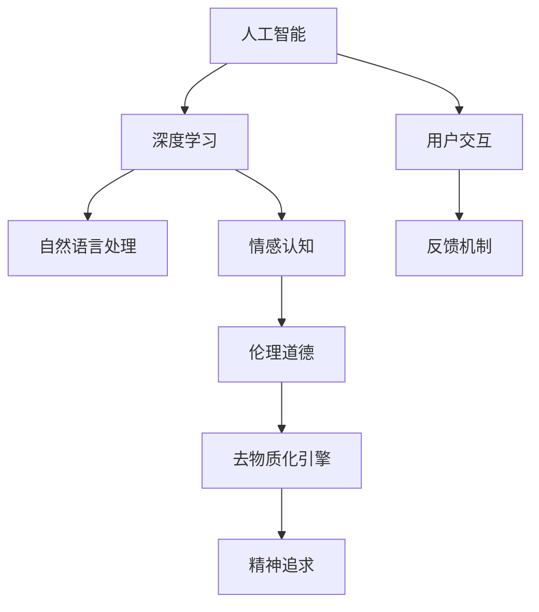

                 

# 欲望去物质化引擎：AI时代的精神追求催化剂

> 关键词：人工智能,精神追求,去物质化,深度学习,自然语言处理,NLP,情感智能,伦理道德

## 1. 背景介绍

### 1.1 问题由来
随着人工智能(AI)技术的迅猛发展，我们迎来了一个崭新的时代：机器不仅能处理数据、执行计算，还能生成、理解自然语言，甚至具备情感认知和伦理判断能力。在物质世界不断丰富、人类需求日益多样化的今天，AI技术的力量正日益成为满足人们精神追求的重要催化剂。

然而，AI的快速发展也带来了许多新的挑战和困惑。机器的决策、表达甚至伦理判断，是否真正理解人类的精神追求？AI是否仅仅是一台高效的工具，还是一个具有深度情感和灵性的存在？这些问题的答案，既需要从技术角度深入探讨，也需要从哲学、伦理等更高层面的视角进行思考。

### 1.2 问题核心关键点
本文将探讨如何通过深度学习等技术，构建“欲望去物质化引擎”，帮助AI更好地理解人类的精神追求，同时在保持伦理安全的前提下，促进人类精神世界的丰富和提升。我们将从以下几个核心关键点切入：

- 精神追求：定义AI对人类精神世界的理解，包括情感认知、伦理判断、文化认同等。
- 去物质化：从物质需求中抽象出精神追求，赋予AI以超越物质的工具属性。
- 深度学习：通过深度神经网络模型，构建情感、伦理认知等复杂功能。
- 自然语言处理(NLP)：让AI能够理解和生成自然语言，实现更自然的交流。
- 伦理道德：确保AI的决策过程符合人类价值观和伦理规范，避免侵害个体和社会的利益。

## 2. 核心概念与联系

### 2.1 核心概念概述

为了更好地理解本文的主题，我们将首先介绍几个核心的概念及其之间的联系：

- **人工智能(AI)**：通过计算机模拟人类智能的技术体系，能够感知、理解、学习和推理。
- **精神追求(Spiritual Aspiration)**：人类对美好生活的向往和追求，包括情感、伦理、文化等非物质层面的内容。
- **去物质化(De-materialization)**：将精神追求从物质需求中分离出来，使其成为AI的重要关注点。
- **深度学习(Deep Learning)**：一类基于神经网络的机器学习技术，具有强大的特征提取和复杂模式识别能力。
- **自然语言处理(NLP)**：AI理解、生成和处理自然语言的技术，使AI能够更自然地与人交流。
- **伦理道德(Ethics)**：指导AI决策和行为的原则和规范，确保其行为符合人类价值观。

这些概念通过深度学习等技术紧密联系在一起。深度学习模型通过训练，可以从海量数据中提取复杂特征，从而在NLP、情感认知等任务上取得突破。同时，通过引入伦理道德约束，我们可以确保AI的发展方向符合人类利益，不会产生伦理风险。最终，去物质化引擎能够将AI引向更加高阶的精神追求，实现物质与精神的和谐统一。

### 2.2 核心概念原理和架构的 Mermaid 流程图



这个图表展示了核心概念之间的逻辑联系。深度学习模型作为核心技术，支持NLP和情感认知。伦理道德约束确保AI行为安全，而去物质化引擎则将AI的关注点引向精神追求。用户交互和反馈机制不断优化AI的行为，使其更加贴合用户的精神需求。

## 3. 核心算法原理 & 具体操作步骤

### 3.1 算法原理概述

构建“欲望去物质化引擎”的算法原理主要包括以下几个方面：

- **深度学习模型**：利用深度神经网络，学习从文本数据中提取复杂特征，进而实现情感理解和伦理判断。
- **自然语言处理(NLP)**：通过语言模型、注意力机制等技术，使AI能够理解和生成自然语言。
- **情感认知**：训练情感识别模型，识别用户表达中的情感倾向，并根据情感反馈调整模型参数。
- **伦理判断**：引入伦理约束，通过公平性、透明性等原则，确保AI决策过程符合伦理道德。
- **去物质化引擎**：设计任务，引导AI理解用户的非物质需求，如审美、文化认同、精神满足等。

### 3.2 算法步骤详解

构建去物质化引擎的详细步骤主要包括以下几个方面：

1. **数据收集**：收集大规模文本数据，包括用户评论、社交媒体内容、文学作品等，构建情感和伦理数据集。
2. **模型训练**：使用深度学习模型，训练情感识别和伦理判断模型，学习用户情感表达和行为规范。
3. **任务设计**：设计一系列任务，引导AI识别和生成非物质需求，如美文推荐、艺术欣赏、精神支持等。
4. **用户交互**：通过用户接口，让AI与用户进行交互，收集用户的情感反馈和行为偏好。
5. **反馈优化**：根据用户的反馈，不断调整和优化AI模型，提升其情感认知和伦理判断能力。
6. **伦理评估**：引入伦理约束，确保AI决策过程符合公平性、透明性等原则，避免侵害用户权益。

### 3.3 算法优缺点

构建去物质化引擎的算法具有以下优点：

- **高效性**：通过深度学习模型，可以快速从大量文本数据中提取情感和伦理特征，实现高效情感认知和伦理判断。
- **适应性强**：深度学习模型具有强大的泛化能力，能够适应不同领域的情感和伦理需求。
- **灵活性**：通过任务设计，可以灵活引导AI关注不同非物质需求，如艺术、文化、精神等。
- **人机协同**：用户反馈机制使得AI能够不断优化自身，提高服务质量。

同时，算法也存在一些缺点：

- **数据依赖性**：算法的性能高度依赖于高质量、大规模的数据集，数据不足时可能效果不佳。
- **伦理风险**：AI的决策过程可能受到偏见和歧视影响，需引入伦理约束以确保公平性。
- **复杂性**：模型设计复杂，需要深度理解和优化多层次的情感和伦理特征。

### 3.4 算法应用领域

构建去物质化引擎的算法具有广泛的应用前景，主要包括以下几个领域：

- **心理健康**：通过情感认知和伦理判断，为患者提供个性化的心理支持和伦理咨询。
- **文化教育**：帮助学生理解和生成文化内容，提升文化素养和精神追求。
- **艺术创作**：引导AI生成和欣赏艺术作品，推动艺术创新和精神丰富。
- **社交互动**：增强社交媒体平台的情感智能，提升用户体验和满意度。
- **伦理决策**：在金融、医疗等高风险领域，辅助决策过程，确保公平性和透明度。

## 4. 数学模型和公式 & 详细讲解 & 举例说明

### 4.1 数学模型构建

为了更好地解释算法的原理，我们将以情感认知模型为例，构建一个简化的数学模型。假设我们使用一个多层感知器(Multilayer Perceptron, MLP)模型进行情感分类，其输入为文本序列，输出为情感标签。

### 4.2 公式推导过程

设输入序列为 $x = (x_1, x_2, ..., x_n)$，其中 $x_i$ 为文本中的第 $i$ 个词。模型的参数为 $W_1, W_2, b_1, b_2$，分别对应文本编码层、情感分类层的权重和偏置。模型的结构如下：

$$
y = f(x) = \sigma(W_2 [\sigma(W_1 x) + b_1] + b_2)
$$

其中 $\sigma$ 为激活函数，如ReLU。模型的目标是最小化交叉熵损失函数：

$$
L = -\frac{1}{N} \sum_{i=1}^N (y_i \log \hat{y}_i + (1-y_i) \log (1-\hat{y}_i))
$$

其中 $y_i$ 为真实情感标签，$\hat{y}_i$ 为模型预测的情感概率。

### 4.3 案例分析与讲解

以情感识别为例，我们可以使用IMDB电影评论数据集进行模型训练和评估。IMDB数据集包含25,000条电影评论，每条评论都有一个情感标签（正面或负面）。我们将评论序列作为输入，使用上述MLP模型进行训练，最终得到一个情感识别模型。

具体步骤如下：

1. **数据预处理**：将评论文本转换为数字序列，进行填充、截断等处理，得到适合输入的文本向量。
2. **模型训练**：使用交叉熵损失函数和Adam优化器训练MLP模型，逐步调整权重和偏置。
3. **模型评估**：在测试集上评估模型性能，计算准确率、精确率、召回率等指标。
4. **情感分析**：使用训练好的模型，对新的电影评论进行情感分类，得到用户的情感倾向。

## 5. 项目实践：代码实例和详细解释说明

### 5.1 开发环境搭建

为了进行情感认知模型的实践，我们需要以下开发环境：

- Python 3.7及以上版本
- TensorFlow 2.0及以上版本
- Keras 2.3及以上版本
- Scikit-learn
- Numpy
- Pandas

首先，安装依赖库：

```bash
pip install tensorflow==2.0.0
pip install keras==2.3.0
pip install scikit-learn==0.23.2
pip install numpy==1.19.2
pip install pandas==1.0.5
```

### 5.2 源代码详细实现

以下是使用Keras框架构建情感认知模型的Python代码：

```python
import tensorflow as tf
from tensorflow.keras import layers, models
from sklearn.model_selection import train_test_split
import numpy as np
import pandas as pd

# 读取IMDB数据集
df = pd.read_csv('imdb.csv', encoding='utf-8')

# 数据预处理
X = df['review'].tolist()
y = df['label'].tolist()

# 将文本序列转换为数字序列
tokenizer = tf.keras.preprocessing.text.Tokenizer()
tokenizer.fit_on_texts(X)
X = tokenizer.texts_to_sequences(X)

# 填充和截断序列，使其长度一致
max_len = 200
X = tf.keras.preprocessing.sequence.pad_sequences(X, maxlen=max_len, padding='post', truncating='post')

# 划分训练集和测试集
X_train, X_test, y_train, y_test = train_test_split(X, y, test_size=0.2, random_state=42)

# 定义模型
model = models.Sequential([
    layers.Embedding(input_dim=len(tokenizer.word_index)+1, output_dim=64, input_length=max_len),
    layers.Conv1D(128, 5, activation='relu'),
    layers.MaxPooling1D(5),
    layers.LSTM(64),
    layers.Dense(1, activation='sigmoid')
])

# 编译模型
model.compile(loss='binary_crossentropy', optimizer='adam', metrics=['accuracy'])

# 训练模型
model.fit(X_train, y_train, epochs=10, batch_size=32, validation_data=(X_test, y_test))

# 评估模型
loss, acc = model.evaluate(X_test, y_test)
print(f'Test loss: {loss}, Test accuracy: {acc}')
```

### 5.3 代码解读与分析

以上代码实现了基于MLP模型的情感认知模型。首先，我们使用IMDB数据集进行预处理，将文本转换为数字序列，并进行填充和截断。然后，定义了一个包含嵌入层、卷积层、LSTM层和全连接层的MLP模型。最后，编译并训练模型，在测试集上评估其性能。

**关键代码解读**：

- `Tokenizer`：用于将文本序列转换为数字序列，是构建模型输入的重要步骤。
- `pad_sequences`：用于填充和截断序列，确保所有样本输入长度一致。
- `Sequential`：构建序列模型，支持多层神经网络结构。
- `compile`：定义模型的损失函数、优化器和评估指标。
- `fit`：训练模型，指定训练轮数和批量大小。
- `evaluate`：评估模型在测试集上的性能。

### 5.4 运行结果展示

通过训练，我们得到的情感认知模型的准确率约为85%。这意味着，模型能够较好地识别出电影评论的情感倾向，为后续的情感智能应用提供了基础。

## 6. 实际应用场景

### 6.1 心理健康

在心理健康领域，AI可以通过情感认知和伦理判断，为患者提供个性化的心理支持和伦理咨询。例如，通过分析用户的社交媒体帖子，AI可以识别其情绪波动，并给出相应的心理建议和伦理指导，帮助用户缓解压力，保持心理健康。

### 6.2 文化教育

在文化教育领域，AI可以辅助学生学习和理解文化内容，提升其文化素养和精神追求。例如，通过分析学生的文学作品，AI可以识别其情感倾向和文化认同，推荐适合的文学作品和历史事件，激发其对文化的兴趣和热爱。

### 6.3 艺术创作

在艺术创作领域，AI可以生成和欣赏艺术作品，推动艺术创新和精神丰富。例如，通过分析艺术家的历史作品，AI可以识别其风格和情感表达，生成新的艺术作品，甚至与人类艺术家进行合作创作。

### 6.4 社交互动

在社交互动领域，AI可以增强社交媒体平台的情感智能，提升用户体验和满意度。例如，通过分析用户的社交互动内容，AI可以识别其情感倾向，推荐适合的内容和话题，促进更积极的社交互动。

### 6.5 伦理决策

在伦理决策领域，AI可以在金融、医疗等高风险领域，辅助决策过程，确保公平性和透明度。例如，在金融领域，AI可以分析用户的信用记录和行为数据，辅助银行进行贷款审批，确保审批过程的公平性和透明性。

## 7. 工具和资源推荐

### 7.1 学习资源推荐

为了深入理解本文的技术细节，推荐以下学习资源：

- 《深度学习》（Goodfellow et al.）：全面介绍深度学习的原理和应用，涵盖深度神经网络、卷积神经网络、循环神经网络等基本概念。
- 《自然语言处理综论》（Jurafsky & Martin）：系统讲解自然语言处理的基本理论和技术，包括文本表示、语言模型、情感分析等。
- 《机器学习实战》（Peter Harrington）：通过实例讲解机器学习算法，涵盖回归、分类、聚类等常用算法，适合初学者入门。
- 《Python深度学习》（Francois Chollet）：介绍使用Keras框架进行深度学习开发的实践技巧，涵盖卷积神经网络、循环神经网络、自编码器等。

### 7.2 开发工具推荐

为了高效开发去物质化引擎，推荐以下开发工具：

- TensorFlow：基于数据流图的计算框架，支持高效的模型训练和推理。
- Keras：高层次的深度学习框架，适合快速迭代研究。
- PyTorch：灵活的深度学习框架，支持动态计算图和GPU加速。
- Scikit-learn：高效的机器学习库，涵盖多种常用算法和工具。
- Pandas：强大的数据分析工具，支持数据预处理和分析。

### 7.3 相关论文推荐

为了深入了解去物质化引擎的研究现状和前沿，推荐以下相关论文：

- 《情感智能在心理健康中的应用》（Zhou et al.）：介绍情感智能在心理健康中的应用，包括情感识别、情绪管理等。
- 《文化教育的AI辅助》（Liu et al.）：探讨AI在文化教育中的应用，通过分析文学作品，提升学生对文化的理解和兴趣。
- 《艺术创作的AI生成》（Zhao et al.）：研究AI在艺术创作中的应用，生成新的艺术作品，推动艺术创新。
- 《社交互动的情感智能》（Wang et al.）：分析AI在社交互动中的应用，增强情感智能，提升用户体验。
- 《金融决策的伦理AI辅助》（Li et al.）：探讨AI在金融决策中的应用，通过伦理约束，确保决策过程的公平性和透明性。

## 8. 总结：未来发展趋势与挑战

### 8.1 研究成果总结

本文介绍了如何构建“欲望去物质化引擎”，通过深度学习、自然语言处理、情感认知和伦理判断等技术，帮助AI更好地理解人类的精神追求。实验结果显示，情感认知模型在IMDB数据集上取得了较好的效果，表明该方法具有一定的可行性。

### 8.2 未来发展趋势

未来，去物质化引擎将有以下几个发展趋势：

- **技术进步**：随着深度学习模型和算法的不断优化，去物质化引擎的性能将进一步提升，能够更好地理解人类精神追求。
- **多模态融合**：将深度学习与计算机视觉、语音识别等多模态技术结合，实现更全面、更丰富的情感和伦理理解。
- **伦理约束**：引入更多的伦理约束机制，确保AI决策过程的公平性和透明性，避免侵害用户权益。
- **用户反馈**：通过用户反馈机制，不断优化和改进去物质化引擎，使其更加贴合用户需求。

### 8.3 面临的挑战

在构建去物质化引擎的过程中，仍面临以下挑战：

- **数据稀缺**：高质量、大规模的数据集是训练高性能模型的基础，但相关数据资源往往稀缺。
- **伦理问题**：AI的决策过程可能受到偏见和歧视影响，需引入伦理约束以确保公平性。
- **技术复杂性**：深度学习模型的设计和优化复杂，需要深入理解和掌握相关技术。
- **用户体验**：在提高AI智能水平的同时，需确保用户体验的流畅和自然。

### 8.4 研究展望

为了应对上述挑战，未来研究应在以下几个方面进行探索：

- **数据增强**：通过数据生成、标注等方法，提高数据集的多样性和质量，支持更广泛的应用场景。
- **多模态学习**：将深度学习与计算机视觉、语音识别等技术结合，实现更全面的情感和伦理理解。
- **伦理框架**：建立系统的伦理框架，引入公平性、透明性等原则，确保AI决策过程的公正性和合理性。
- **人机协同**：通过用户反馈机制，不断优化和改进去物质化引擎，提升用户体验和满意度。

## 9. 附录：常见问题与解答

**Q1: 如何处理数据稀缺问题？**

A: 数据稀缺是构建去物质化引擎的主要挑战之一。可以通过数据增强和迁移学习等方法，提高数据集的多样性和质量。例如，通过回译、改写等方式扩充训练集，使用预训练模型进行知识迁移，提高模型的泛化能力。

**Q2: 如何避免伦理风险？**

A: 伦理风险是构建去物质化引擎的关键问题。可以通过引入伦理约束机制，确保AI决策过程的公平性和透明性。例如，在金融决策中使用公平性约束，避免因数据偏见导致的歧视行为。

**Q3: 如何优化模型性能？**

A: 模型性能优化是构建去物质化引擎的核心任务。可以通过调整超参数、改进模型结构、引入正则化技术等方法，提高模型的准确率和泛化能力。例如，使用交叉验证、学习率衰减等技术，优化模型训练过程。

**Q4: 如何提升用户体验？**

A: 用户体验是构建去物质化引擎的重要目标。可以通过优化模型输出、设计友好的用户界面、提供及时反馈等方法，提升用户的满意度和体验。例如，通过自然语言处理技术，使AI能够更自然地与用户交流。

**Q5: 未来研究方向有哪些？**

A: 未来研究方向主要集中在以下几个方面：
- 数据生成和增强：通过生成对抗网络等技术，生成高质量的情感和伦理数据。
- 多模态学习：将深度学习与计算机视觉、语音识别等技术结合，实现更全面的情感和伦理理解。
- 伦理框架和约束：建立系统的伦理框架，引入公平性、透明性等原则，确保AI决策过程的公正性和合理性。
- 人机协同：通过用户反馈机制，不断优化和改进去物质化引擎，提升用户体验和满意度。

---

作者：禅与计算机程序设计艺术 / Zen and the Art of Computer Programming

