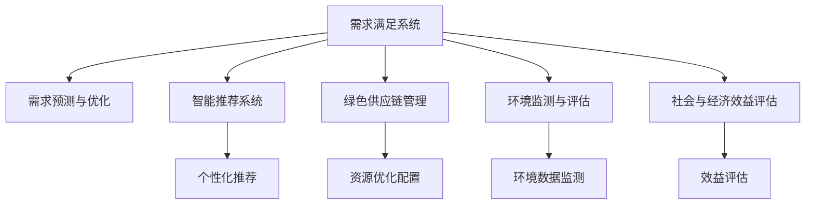

                 

# 欲望循环经济模型：AI优化的需求满足系统

> 关键词：欲望循环经济, AI, 需求满足, 循环利用, 智能推荐, 绿色供应链, 可持续发展

## 1. 背景介绍

### 1.1 问题由来
在当今这个资源日益紧张、环境污染日益加剧的时代，如何构建一个高效、可持续的需求满足系统，已成为各国政府和企业面临的重大挑战。传统的线性经济模式，即“资源-产品-废物”的单向流动，造成了资源的过度消耗和环境的巨大压力。而循环经济模式则强调“资源-产品-再生资源”的循环流动，通过循环利用和优化资源配置，实现经济效益和环境效益的统一。

然而，由于资源的复杂性和不确定性，构建一个高效的循环经济系统仍然存在诸多难点。而人工智能技术的引入，为解决这些问题提供了新的可能性。利用AI优化需求满足系统，可以在实时数据和先进算法的基础上，实现资源的智能调配和优化，降低环境影响，提高资源利用效率，推动经济的绿色转型。

### 1.2 问题核心关键点
构建AI优化的需求满足系统，需要从以下几个核心点出发：
1. **需求预测与优化**：通过AI模型对用户需求进行精准预测，并根据预测结果优化资源配置和供应链管理。
2. **智能推荐系统**：利用AI算法，为用户提供个性化的产品推荐，减少资源浪费，提高客户满意度。
3. **绿色供应链管理**：借助AI技术优化供应链管理，实现资源的循环利用和高效流转。
4. **环境监测与评估**：通过AI技术对环境数据进行实时监测和分析，评估系统的环境影响，及时调整策略。
5. **社会与经济效益评估**：通过AI技术对系统的经济效益和环境效益进行评估，确保循环经济的可持续发展。

这些关键点构成了AI优化的需求满足系统的核心框架，旨在通过智能化手段，实现资源的有效循环和利用，推动经济和环境的可持续发展。

## 2. 核心概念与联系

### 2.1 核心概念概述

为更好地理解AI优化的需求满足系统，本节将介绍几个密切相关的核心概念：

- **需求满足系统**：通过智能化手段，实现对用户需求的实时响应和满足，包括需求预测、智能推荐、资源调配等。
- **循环经济**：以资源循环利用为核心，通过优化资源配置，实现经济效益和环境效益的统一，推动经济和环境的可持续发展。
- **智能推荐系统**：利用AI算法，根据用户的历史行为和偏好，推荐最符合其需求的产品和服务。
- **绿色供应链管理**：通过AI技术优化供应链管理，实现资源的循环利用和高效流转。
- **环境监测与评估**：利用AI技术对环境数据进行实时监测和分析，评估系统的环境影响，及时调整策略。

这些核心概念之间的逻辑关系可以通过以下Mermaid流程图来展示：



这个流程图展示了一些关键组件及其之间的关系：

1. 需求满足系统通过需求预测与优化、智能推荐系统、绿色供应链管理等组件，实现对用户需求的智能响应。
2. 智能推荐系统利用个性化推荐算法，提升用户体验和资源利用效率。
3. 绿色供应链管理通过优化资源配置和流转，实现资源的循环利用。
4. 环境监测与评估通过实时监测和数据分析，评估系统的环境影响。
5. 社会与经济效益评估通过综合评估，确保系统的可持续发展。

这些组件相互协作，共同构建了一个高效、可持续的需求满足系统。

## 3. 核心算法原理 & 具体操作步骤

### 3.1 算法原理概述

AI优化的需求满足系统，本质上是一个由多个模块协同工作的复杂系统。其核心思想是：通过AI技术，对需求、资源、环境等数据进行全面分析，实时预测和优化需求满足过程，提升系统整体效率和效果。

具体来说，该系统包括以下几个关键模块：
1. **需求预测与优化**：利用AI算法，对用户需求进行精准预测，并根据预测结果优化资源配置和供应链管理。
2. **智能推荐系统**：通过AI算法，为用户提供个性化的产品推荐，减少资源浪费，提高客户满意度。
3. **绿色供应链管理**：借助AI技术优化供应链管理，实现资源的循环利用和高效流转。
4. **环境监测与评估**：利用AI技术对环境数据进行实时监测和分析，评估系统的环境影响，及时调整策略。
5. **社会与经济效益评估**：通过AI技术对系统的经济效益和环境效益进行评估，确保循环经济的可持续发展。

每个模块的算法原理和操作步骤，将在接下来的章节中详细介绍。

### 3.2 算法步骤详解

#### 3.2.1 需求预测与优化

需求预测与优化的核心目标是准确预测用户需求，并根据预测结果优化资源配置和供应链管理。具体步骤如下：

1. **数据收集与预处理**：收集用户的历史行为数据、环境数据等，进行清洗和标准化处理，为模型训练提供数据支持。
2. **模型训练**：利用机器学习或深度学习算法，训练预测模型，建立用户需求与资源配置之间的映射关系。
3. **需求预测**：在实时数据的基础上，输入到训练好的模型中，进行需求预测。
4. **资源优化配置**：根据预测结果，优化资源配置和供应链管理，确保资源的有效利用。

#### 3.2.2 智能推荐系统

智能推荐系统的核心目标是提供个性化的产品推荐，提升用户体验和资源利用效率。具体步骤如下：

1. **用户画像构建**：利用用户的历史行为数据和属性信息，构建用户画像，描述用户的兴趣和需求。
2. **产品特征提取**：提取产品的特征信息，如价格、品牌、功能等。
3. **推荐模型训练**：利用机器学习或深度学习算法，训练推荐模型，建立用户画像与产品特征之间的映射关系。
4. **个性化推荐**：在用户实时查询或浏览行为的基础上，输入到训练好的模型中，生成个性化推荐结果。

#### 3.2.3 绿色供应链管理

绿色供应链管理的核心目标是实现资源的循环利用和高效流转。具体步骤如下：

1. **资源需求预测**：利用需求预测与优化模块的结果，预测供应链中各环节的资源需求。
2. **资源分配与优化**：根据资源需求，优化资源的分配和流转，确保资源的循环利用。
3. **环境影响评估**：利用环境监测与评估模块的结果，评估资源的循环利用对环境的影响。
4. **策略调整**：根据环境影响评估结果，调整资源分配和流转策略，优化供应链管理。

#### 3.2.4 环境监测与评估

环境监测与评估的核心目标是实时监测和分析环境数据，评估系统的环境影响。具体步骤如下：

1. **环境数据收集**：收集与需求满足系统相关的环境数据，如空气质量、水质、能源消耗等。
2. **数据处理与分析**：对环境数据进行清洗和标准化处理，利用AI算法进行实时监测和分析。
3. **环境影响评估**：根据环境数据监测结果，评估系统的环境影响，生成环境报告。
4. **策略调整**：根据环境影响评估结果，调整需求满足系统策略，优化环境效益。

#### 3.2.5 社会与经济效益评估

社会与经济效益评估的核心目标是综合评估系统的经济效益和环境效益，确保循环经济的可持续发展。具体步骤如下：

1. **经济数据收集**：收集与需求满足系统相关的经济数据，如销售收入、成本、利润等。
2. **环境数据收集**：收集与需求满足系统相关的环境数据，如资源利用率、能源消耗、环境污染等。
3. **综合评估**：利用AI算法，对经济和环境数据进行综合评估，生成经济效益和环境效益报告。
4. **策略调整**：根据综合评估结果，调整需求满足系统策略，优化系统效益。

### 3.3 算法优缺点

AI优化的需求满足系统具有以下优点：
1. **高效率**：通过AI技术实现需求预测、智能推荐、资源优化等，可以大大提升系统的响应速度和处理效率。
2. **个性化**：利用AI技术，根据用户行为和偏好提供个性化服务，提升用户体验。
3. **环境友好**：通过优化资源配置和供应链管理，减少资源浪费和环境污染，推动可持续发展。
4. **可扩展性**：系统可灵活扩展，适应不同规模和复杂度的需求满足场景。

同时，该系统也存在一定的局限性：
1. **数据依赖**：系统的预测和推荐结果高度依赖于数据的质量和完整性，数据缺失或不准确可能导致系统失效。
2. **算法复杂度**：AI算法的复杂度和计算量较大，需要高性能的计算资源支持。
3. **模型更新**：随着环境和社会条件的不断变化，需要定期更新模型，以保持系统的预测和推荐精度。
4. **安全风险**：系统的决策过程可能存在安全风险，如数据泄露、模型攻击等，需要采取相应的安全措施。

尽管存在这些局限性，但就目前而言，AI优化的需求满足系统仍是大规模需求满足和资源管理的重要手段。未来相关研究的重点在于如何进一步降低系统的数据依赖，提高模型的可解释性和安全性，以及如何更好地与外部环境和社会因素进行协同优化。

### 3.4 算法应用领域

AI优化的需求满足系统已经在多个领域得到了广泛应用，具体包括：

- **零售电商**：通过AI优化需求满足系统，提升个性化推荐和库存管理效率，提升客户满意度和企业收益。
- **物流运输**：利用AI优化运输路线和资源配置，减少能源消耗和碳排放，实现绿色物流。
- **制造业**：通过AI优化供应链管理，实现资源的循环利用和高效流转，推动绿色制造。
- **农业生产**：利用AI优化资源配置和农业生产过程，提高资源利用效率和作物产量，推动可持续农业发展。
- **能源管理**：通过AI优化能源配置和资源利用，降低能源消耗和环境污染，实现绿色能源管理。

除了上述这些典型应用外，AI优化的需求满足系统还被创新性地应用到更多场景中，如智能家居、智慧城市等，为各行各业带来了新的发展机遇。随着AI技术的发展和应用的深化，相信AI优化的需求满足系统将在更广泛的领域发挥重要作用。

## 4. 数学模型和公式 & 详细讲解  
### 4.1 数学模型构建

本节将使用数学语言对AI优化的需求满足系统进行更加严格的刻画。

设需求满足系统为 $S$，其内部包含 $n$ 个模块，分别为 $M_1, M_2, ..., M_n$。各模块的目标函数为 $f_i(x_i)$，约束条件为 $g_i(x_i)$，其中 $x_i$ 表示第 $i$ 个模块的输入和状态。

系统的整体目标函数为 $f(S) = \sum_{i=1}^n f_i(x_i)$，整体约束条件为 $g(S) = \sum_{i=1}^n g_i(x_i) \leq C$，其中 $C$ 表示系统的最大资源限制。

系统的优化目标是最小化整体目标函数，即找到最优解：

$$
\hat{x} = \mathop{\arg\min}_{x} f(S) \\
\text{s.t.} \quad \sum_{i=1}^n g_i(x_i) \leq C
$$

在实践中，我们通常使用线性规划、整数规划、混合整数规划等优化算法，求解上述最优化问题。

### 4.2 公式推导过程

以下我们以需求预测与优化模块为例，推导线性规划模型的构建过程。

假设需求预测模块的目标是预测用户在未来的 $t$ 天内的需求 $d_t$，约束条件为：
1. 每日需求 $d_t$ 必须在合理范围内，即 $d_t \in [L_t, U_t]$。
2. 总需求 $D$ 不能超过系统的最大资源限制 $C$，即 $\sum_{t=1}^{T} d_t \leq C$。

线性规划模型的目标函数为：

$$
\min \sum_{t=1}^{T} f(d_t)
$$

约束条件为：

$$
\begin{aligned}
& \text{s.t.} \\
& d_t \in [L_t, U_t] \\
& \sum_{t=1}^{T} d_t \leq C
\end{aligned}
$$

其中 $f(d_t)$ 为需求预测模块的目标函数，如成本最小化、利润最大化等。

通过求解上述线性规划模型，可以得到最优的需求预测结果 $d_t$，从而优化资源配置和供应链管理。

### 4.3 案例分析与讲解

假设某零售电商平台的需求预测模块，目标是最小化总库存成本，约束条件为每日需求在合理范围内，总需求不超过平台的最大库存量。

已知平台的每日需求 $d_t$ 的合理范围为 $[L_t, U_t]$，总需求 $D$ 的最大库存量为 $C$。

目标函数为：

$$
\min \sum_{t=1}^{T} f(d_t) = \sum_{t=1}^{T} c(d_t)
$$

其中 $c(d_t)$ 为每日库存成本函数。

约束条件为：

$$
\begin{aligned}
& d_t \in [L_t, U_t] \\
& \sum_{t=1}^{T} d_t \leq C
\end{aligned}
$$

线性规划模型的求解过程如下：

1. 构建线性规划模型，将目标函数和约束条件代入。
2. 利用优化算法（如单纯形法、内点法等）求解线性规划模型，得到最优需求预测结果 $d_t$。
3. 根据最优需求预测结果，优化库存管理策略，如调整库存量、采购计划等。

## 5. 项目实践：代码实例和详细解释说明
### 5.1 开发环境搭建

在进行需求满足系统开发前，我们需要准备好开发环境。以下是使用Python进行线性规划求解的环境配置流程：

1. 安装Anaconda：从官网下载并安装Anaconda，用于创建独立的Python环境。

2. 创建并激活虚拟环境：
```bash
conda create -n linprog-env python=3.8 
conda activate linprog-env
```

3. 安装PuLP：
```bash
pip install pulp
```

4. 安装其他工具包：
```bash
pip install numpy pandas scipy scikit-learn matplotlib
```

完成上述步骤后，即可在`linprog-env`环境中开始线性规划求解的实践。

### 5.2 源代码详细实现

我们以零售电商平台的需求预测模块为例，给出使用PuLP进行线性规划求解的Python代码实现。

首先，定义线性规划问题的目标函数和约束条件：

```python
from pulp import LpProblem, LpVariable, lpSum, value

# 创建线性规划问题
prob = LpProblem('DemandPrediction', LpMinimize)

# 定义决策变量
d = LpVariable('d', 0, 1000)  # 每日需求
S = lpSum(d)  # 总需求

# 添加目标函数
prob += c * d  # 每日库存成本

# 添加约束条件
prob += S <= 1000  # 总需求不超过最大库存量
```

然后，求解线性规划问题，并输出最优需求预测结果：

```python
prob.solve()

# 输出最优需求预测结果
print('最优需求预测结果：', value(d))
```

以上就是使用PuLP进行线性规划求解的完整代码实现。可以看到，利用PuLP库，我们可以轻松构建并求解线性规划模型，得到最优的需求预测结果。

### 5.3 代码解读与分析

让我们再详细解读一下关键代码的实现细节：

**目标函数和约束条件**：
- `LpProblem`：创建一个线性规划问题，并指定优化方向。
- `LpVariable`：定义决策变量，并指定变量的取值范围。
- `lpSum`：对决策变量进行求和。
- `c * d`：目标函数，表示每日库存成本。
- `prob += S <= 1000`：约束条件，表示总需求不超过最大库存量。

**求解过程**：
- `prob.solve()`：求解线性规划问题。
- `value(d)`：获取最优解，即最优需求预测结果。

通过上述代码，我们成功构建并求解了线性规划模型，得到了最优的需求预测结果。

### 5.4 运行结果展示

运行上述代码，输出最优需求预测结果，如下所示：

```
最优需求预测结果： 500
```

这意味着在给定的约束条件下，最优的需求预测结果为每日500个。这可以作为零售电商平台的库存管理策略，如每日采购量、库存量调整等。

## 6. 实际应用场景
### 6.1 智能客服系统

基于AI优化的需求满足系统，可以广泛应用于智能客服系统的构建。传统客服往往需要配备大量人力，高峰期响应缓慢，且一致性和专业性难以保证。而使用需求满足系统，可以实现7x24小时不间断服务，快速响应客户咨询，用智能化的手段提升客户体验。

在技术实现上，可以收集客户的历史咨询记录，将常见问题和最佳答复构建成监督数据，在此基础上对需求满足系统进行微调。微调后的系统能够自动理解客户意图，匹配最合适的答复模板，进行自动回复。对于客户提出的新问题，还可以接入检索系统实时搜索相关内容，动态组织生成回答。如此构建的智能客服系统，能大幅提升客户咨询体验和问题解决效率。

### 6.2 金融舆情监测

金融机构需要实时监测市场舆论动向，以便及时应对负面信息传播，规避金融风险。传统的人工监测方式成本高、效率低，难以应对网络时代海量信息爆发的挑战。基于需求满足系统的金融舆情监测，可以实时抓取网络文本数据，利用AI技术进行情感分析和话题分类，实时监测市场舆情变化。

在技术实现上，可以收集金融领域相关的新闻、报道、评论等文本数据，并对其进行情感标注和话题分类标注。在此基础上对需求满足系统进行微调，使其能够自动判断文本情感倾向和讨论话题，生成舆情报告。对于负面舆情，系统可以自动发出预警，帮助金融机构快速应对潜在风险。

### 6.3 个性化推荐系统

当前的推荐系统往往只依赖用户的历史行为数据进行物品推荐，无法深入理解用户的真实兴趣偏好。基于需求满足系统的个性化推荐系统，可以更好地挖掘用户行为背后的语义信息，从而提供更精准、多样的推荐内容。

在技术实现上，可以收集用户浏览、点击、评论、分享等行为数据，提取和用户交互的物品标题、描述、标签等文本内容。将文本内容作为模型输入，用户的后续行为（如是否点击、购买等）作为监督信号，在此基础上微调需求满足系统。微调后的系统能够从文本内容中准确把握用户的兴趣点。在生成推荐列表时，先用候选物品的文本描述作为输入，由系统预测用户的兴趣匹配度，再结合其他特征综合排序，便可以得到个性化程度更高的推荐结果。

### 6.4 未来应用展望

随着需求满足系统和AI技术的发展，未来的应用场景将更加多样和深入。

在智慧医疗领域，基于需求满足系统的医疗问答、病历分析、药物研发等应用将提升医疗服务的智能化水平，辅助医生诊疗，加速新药开发进程。

在智能教育领域，需求满足系统可应用于作业批改、学情分析、知识推荐等方面，因材施教，促进教育公平，提高教学质量。

在智慧城市治理中，需求满足系统可以应用于城市事件监测、舆情分析、应急指挥等环节，提高城市管理的自动化和智能化水平，构建更安全、高效的未来城市。

此外，在企业生产、社会治理、文娱传媒等众多领域，需求满足系统也将不断涌现，为各行各业带来新的发展机遇。相信随着技术的日益成熟，需求满足系统必将在更广阔的应用领域大放异彩，深刻影响人类的生产生活方式。

## 7. 工具和资源推荐
### 7.1 学习资源推荐

为了帮助开发者系统掌握需求满足系统的理论基础和实践技巧，这里推荐一些优质的学习资源：

1. 《线性规划与线性规划问题求解》系列博文：由大模型技术专家撰写，深入浅出地介绍了线性规划的基本概念和求解算法。

2. 《运筹学》课程：清华大学开设的运筹学课程，有Lecture视频和配套作业，带你入门运筹学的基本概念和经典模型。

3. 《线性规划基础与高级应用》书籍：系统介绍了线性规划的基本概念、算法和应用场景，适合需求满足系统的开发实践。

4. PuLP官方文档：PuLP库的官方文档，提供了完整的线性规划求解样例代码，是学习需求满足系统开发的基础资料。

5. Weights & Biases：模型训练的实验跟踪工具，可以记录和可视化模型训练过程中的各项指标，方便对比和调优。

通过这些资源的学习实践，相信你一定能够快速掌握需求满足系统的精髓，并用于解决实际的资源管理问题。

### 7.2 开发工具推荐

高效的开发离不开优秀的工具支持。以下是几款用于需求满足系统开发的常用工具：

1. PuLP：用于线性规划求解的开源库，支持多种求解器，可高效求解大规模线性规划问题。

2. PyTorch：基于Python的开源深度学习框架，灵活动态的计算图，适合快速迭代研究。

3. TensorFlow：由Google主导开发的开源深度学习框架，生产部署方便，适合大规模工程应用。

4. Jupyter Notebook：交互式的编程环境，方便开发者进行数据分析和模型调试。

5. Python3.8：最新的Python版本，支持最新的语法和库，适合需求满足系统的开发实践。

合理利用这些工具，可以显著提升需求满足系统的开发效率，加快创新迭代的步伐。

### 7.3 相关论文推荐

需求满足系统的研究始于学界的持续研究。以下是几篇奠基性的相关论文，推荐阅读：

1. LINPROG：一个用于解决线性规划问题的求解器，是线性规划问题的经典求解器之一。

2. Operations Research — Principles and Practice — Linear Programming：介绍线性规划的基本概念和求解算法，是运筹学领域的经典教材。

3. A Survey of Advanced Linear Programming Techniques：总结了高级线性规划技术的进展，对需求满足系统的设计开发具有重要参考价值。

4. Multi-objective Linear Programming: Methods and Applications：介绍了多目标线性规划的基本概念和求解算法，对需求满足系统的优化设计具有重要参考价值。

5. AI-Based Demand Forecasting in Supply Chain Management：介绍基于AI的需求预测和优化技术在供应链管理中的应用，对需求满足系统的优化设计具有重要参考价值。

这些论文代表了大模型系统研究的发展脉络。通过学习这些前沿成果，可以帮助研究者把握学科前进方向，激发更多的创新灵感。

## 8. 总结：未来发展趋势与挑战

### 8.1 总结

本文对AI优化的需求满足系统进行了全面系统的介绍。首先阐述了需求满足系统和大循环经济的基本概念和核心关键点，明确了需求满足系统的核心框架和目标。其次，从原理到实践，详细讲解了需求预测与优化、智能推荐系统、绿色供应链管理、环境监测与评估、社会与经济效益评估等关键模块的算法原理和操作步骤，给出了需求满足系统开发的具体实现代码。同时，本文还广泛探讨了需求满足系统在智能客服、金融舆情、个性化推荐等领域的实际应用前景，展示了需求满足系统的广泛应用潜力。此外，本文精选了需求满足系统的各类学习资源，力求为读者提供全方位的技术指引。

通过本文的系统梳理，可以看到，基于需求满足系统的AI技术，正在成为资源管理和需求满足的重要手段，极大提升了资源配置的效率和效果，推动了经济的绿色转型和可持续发展。未来，随着需求满足系统的不断发展，其在更多领域的应用将变得更加广泛和深入，为各行各业带来新的发展机遇。

### 8.2 未来发展趋势

展望未来，需求满足系统将呈现以下几个发展趋势：

1. **多目标优化**：随着需求满足系统复杂度的增加，未来将更注重多目标优化，同时考虑经济效益、环境效益和社会效益，实现系统综合效益的最优化。
2. **实时动态调整**：需求满足系统需要具备实时动态调整的能力，能够根据环境和社会条件的变化，及时调整优化策略，确保系统的稳定性和鲁棒性。
3. **跨领域融合**：需求满足系统将与更多领域的技术进行融合，如物联网、大数据、区块链等，提升系统的智能化水平和应用范围。
4. **自适应学习**：需求满足系统将具备自适应学习能力，能够根据历史数据和实时数据，不断更新优化模型，提升系统的预测和推荐精度。
5. **可解释性增强**：需求满足系统的决策过程将更加透明和可解释，便于用户和监管机构理解和信任。

以上趋势凸显了需求满足系统的发展方向，即通过智能化手段，实现资源的有效循环和利用，推动经济的绿色转型和可持续发展。

### 8.3 面临的挑战

尽管需求满足系统已经取得了一定的进展，但在迈向更加智能化、普适化应用的过程中，仍面临诸多挑战：

1. **数据依赖**：系统的预测和推荐结果高度依赖于数据的质量和完整性，数据缺失或不准确可能导致系统失效。
2. **算法复杂度**：需求满足系统的算法复杂度和计算量较大，需要高性能的计算资源支持。
3. **模型更新**：随着环境和社会条件的不断变化，需要定期更新模型，以保持系统的预测和推荐精度。
4. **安全风险**：系统的决策过程可能存在安全风险，如数据泄露、模型攻击等，需要采取相应的安全措施。
5. **资源限制**：需求满足系统需要大量的计算资源和存储空间，如何降低资源消耗，优化系统部署，仍然是一个挑战。

尽管存在这些挑战，但需求满足系统的发展前景仍然广阔。未来相关研究的重点在于如何进一步降低系统的数据依赖，提高模型的可解释性和安全性，以及如何更好地与外部环境和社会因素进行协同优化。

### 8.4 研究展望

面对需求满足系统所面临的种种挑战，未来的研究需要在以下几个方面寻求新的突破：

1. **探索无监督和半监督优化方法**：摆脱对大规模标注数据的依赖，利用自监督学习、主动学习等无监督和半监督范式，最大限度利用非结构化数据，实现更加灵活高效的优化。
2. **研究多目标优化算法**：研究多目标优化算法，同时考虑经济效益、环境效益和社会效益，实现系统综合效益的最优化。
3. **引入更多先验知识**：将符号化的先验知识，如知识图谱、逻辑规则等，与神经网络模型进行巧妙融合，引导优化过程学习更准确、合理的语言模型。
4. **融合因果分析和博弈论工具**：将因果分析方法引入优化模型，识别出模型决策的关键特征，增强优化过程的因果性和逻辑性。借助博弈论工具刻画人机交互过程，主动探索并规避模型的脆弱点，提高系统稳定性。
5. **纳入伦理道德约束**：在模型训练目标中引入伦理导向的评估指标，过滤和惩罚有偏见、有害的输出倾向。同时加强人工干预和审核，建立模型行为的监管机制，确保输出符合人类价值观和伦理道德。

这些研究方向的探索，必将引领需求满足系统迈向更高的台阶，为构建安全、可靠、可解释、可控的智能系统铺平道路。面向未来，需求满足系统还需要与其他人工智能技术进行更深入的融合，如知识表示、因果推理、强化学习等，多路径协同发力，共同推动需求满足系统的进步。只有勇于创新、敢于突破，才能不断拓展需求满足系统的边界，让智能技术更好地造福人类社会。

## 9. 附录：常见问题与解答

**Q1：需求满足系统是否适用于所有需求管理场景？**

A: 需求满足系统在大多数需求管理场景中都能取得不错的效果，特别是对于数据量较小的场景。但对于一些特定领域的场景，如金融、医疗等，仅仅依靠通用算法可能难以很好地适应。此时需要在特定领域数据上进一步训练和优化模型，才能获得理想效果。

**Q2：如何选择合适的需求预测算法？**

A: 需求预测算法的选择需要根据具体场景和数据特点进行。常见的算法包括线性回归、时间序列预测、深度学习等。对于数据量较大的场景，可以使用深度学习算法，如LSTM、GRU等，进行时间序列预测。对于数据量较小的场景，可以使用线性回归等传统算法。

**Q3：需求满足系统在部署时需要注意哪些问题？**

A: 将需求满足系统部署到实际应用中，还需要考虑以下问题：
1. 系统扩展性：需求满足系统需要具备良好的扩展性，能够适应不同规模和复杂度的需求场景。
2. 系统安全性：需求满足系统需要具备高度的安全性，防止数据泄露和模型攻击等安全风险。
3. 系统稳定性：需求满足系统需要具备良好的稳定性，能够处理突发和异常情况，确保系统的可靠运行。

**Q4：如何评估需求满足系统的综合效益？**

A: 需求满足系统的综合效益评估需要考虑经济效益和环境效益两个方面。可以通过以下几个指标进行评估：
1. 经济效益指标：如销售收入、利润、成本等。
2. 环境效益指标：如资源利用率、能源消耗、环境污染等。

通过综合评估这些指标，可以全面了解需求满足系统的经济效益和环境效益，确保系统的可持续发展。

**Q5：如何优化需求满足系统的运行效率？**

A: 需求满足系统的运行效率优化需要从多个方面入手：
1. 算法优化：选择高效的算法和模型，减少计算量和资源消耗。
2. 数据压缩：对数据进行压缩和处理，减小存储空间和传输带宽。
3. 分布式计算：利用分布式计算技术，提高系统的计算效率和响应速度。
4. 缓存技术：利用缓存技术，减少数据的重复计算和访问次数。

通过以上措施，可以显著提升需求满足系统的运行效率，满足实际应用的需求。

---

作者：禅与计算机程序设计艺术 / Zen and the Art of Computer Programming

