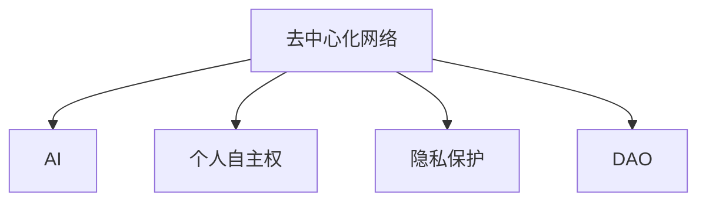

                 

# 欲望的去中心化网络：AI与个人自主权

> 关键词：去中心化网络, AI, 个人自主权, 欲望, 区块链, 边缘计算, 隐私保护, 去中心化自治组织(DAO)

## 1. 背景介绍

在人工智能（AI）迅猛发展的今天，人类的社会形态和生活方式正在经历深刻的变革。AI不仅在医疗、金融、教育等传统领域带来了革命性的改变，也在个人生活和隐私保护方面产生了深远的影响。如何平衡AI的进步与个人隐私和自主权的保护，成为了现代社会必须面对的重大挑战。

本文将深入探讨去中心化网络在AI与个人自主权中的应用，以及如何构建一个既能享受AI带来的便利，又能保护个人隐私和自主权的新型社会。我们将从概念阐述、核心算法、具体实践和未来展望四个方面，全面分析去中心化网络与AI的深度融合，并探索其在个人自主权保护方面的潜力。

## 2. 核心概念与联系

### 2.1 核心概念概述

为了更好地理解去中心化网络在AI与个人自主权中的应用，本节将介绍几个关键概念：

- **去中心化网络**：指由多个分散节点组成的网络，每个节点都有平等的权利和义务，不存在中心化的控制点。这种网络架构可以提升数据和服务的可靠性、可用性和安全性。

- **AI**：指模拟人类智能行为的技术，包括机器学习、深度学习、自然语言处理等。AI技术在去中心化网络中可以实现智能化的数据分析、决策支持等。

- **个人自主权**：指个体在个人信息使用、决策制定等方面的自主控制能力，确保个人数据隐私和决策自由。

- **隐私保护**：指在数据收集、存储、处理和使用过程中，保护个人隐私不被泄露或滥用的技术手段。

- **去中心化自治组织（DAO）**：指通过区块链和智能合约实现的自治组织，具有自组织、自我治理和自我激励的特性。

这些概念之间的逻辑关系可以通过以下Mermaid流程图来展示：



这个流程图展示了去中心化网络与AI、个人自主权和隐私保护之间的关系：

- 去中心化网络为AI提供了安全、可靠的数据存储和处理环境。
- AI在去中心化网络上可以高效地处理和分析数据，支持个人自主权的实现。
- 隐私保护是去中心化网络的重要组成部分，确保个人数据的安全。
- DAO在去中心化网络中起到自组织和自我治理的作用，进一步保障个人自主权。

## 3. 核心算法原理 & 具体操作步骤
### 3.1 算法原理概述

去中心化网络与AI的深度融合，涉及多个关键算法和技术，包括区块链、智能合约、分布式计算、隐私计算等。其中，区块链和智能合约是去中心化网络的核心技术，为AI的分布式计算和隐私保护提供了基础。

### 3.2 算法步骤详解

基于区块链和智能合约的去中心化网络AI应用一般包括以下几个关键步骤：

**Step 1: 构建去中心化网络**
- 选择合适的区块链平台，如Ethereum、Hyperledger等。
- 部署智能合约，定义数据存储、计算和隐私保护的逻辑。
- 设计和管理去中心化自治组织（DAO），确保网络参与者的公平性和激励机制。

**Step 2: 集成AI模型**
- 将AI模型部署到去中心化网络上，通过智能合约调用模型接口。
- 利用分布式计算技术，实现模型的协同训练和推理。
- 应用隐私计算技术，保护个人数据的隐私。

**Step 3: 实施隐私保护**
- 使用零知识证明、同态加密等隐私计算技术，确保数据在传输和存储过程中的安全。
- 设计数据访问控制机制，限制未经授权的访问和操作。
- 应用差分隐私技术，在统计分析中保护个人隐私。

**Step 4: 维护网络安全**
- 定期进行安全性审计，检测和修复网络中的漏洞。
- 设计抗攻击策略，如分布式共识机制、激励机制等，增强网络的抗攻击能力。
- 实施去中心化治理，确保网络参与者的行为符合网络规则和标准。

### 3.3 算法优缺点

基于区块链和智能合约的去中心化网络AI应用具有以下优点：
1. 数据安全：通过区块链和智能合约，确保数据在传输和存储过程中的安全。
2. 分布式计算：利用去中心化网络的多节点协同计算，提升AI模型的计算效率。
3. 隐私保护：应用隐私计算技术，保护个人数据的隐私。
4. 去中心化治理：通过DAO实现网络的自治和自我管理，增强系统的可靠性和灵活性。

同时，该方法也存在一定的局限性：
1. 复杂性高：区块链和智能合约的设计和实施较为复杂，对技术门槛要求较高。
2. 扩展性差：大规模数据存储和计算的需求可能超出区块链的性能瓶颈。
3. 交易费用高：区块链交易费用较高，可能影响系统的经济性。
4. 缺乏标准化：不同的区块链平台和智能合约标准不一，跨平台互操作性差。

尽管存在这些局限性，但就目前而言，基于区块链和智能合约的去中心化网络AI应用仍是大数据时代的重要方向。未来相关研究的重点在于如何进一步降低技术复杂性，提高扩展性和经济性，同时保障数据的隐私和安全性。

### 3.4 算法应用领域

基于去中心化网络AI的应用领域广泛，包括但不限于：

- **智能合约**：利用AI模型自动执行合约条款，提升合约的智能化和自动化水平。
- **供应链管理**：通过AI分析供应链数据，优化供应链管理和物流调度。
- **金融服务**：利用AI进行风险评估、智能投顾、反欺诈检测等。
- **医疗健康**：利用AI进行病历分析、医学影像诊断、个性化治疗等。
- **智能制造**：通过AI优化生产流程、设备维护、质量控制等。
- **智慧城市**：利用AI进行交通管理、公共安全、能源优化等。

此外，去中心化网络AI在社交媒体、在线教育、文化娱乐等领域也有广泛的应用前景。随着技术的不断进步和应用的深入，去中心化网络AI必将在更多领域发挥重要作用。

## 4. 数学模型和公式 & 详细讲解 & 举例说明
### 4.1 数学模型构建

为了更精确地描述去中心化网络与AI的融合，我们可以使用数学语言对去中心化网络AI模型进行建模。

假设去中心化网络中有 $n$ 个节点，每个节点运行相同的AI模型，模型参数为 $\theta$。节点间通过区块链进行数据传输和协同计算。模型在训练阶段接收来自区块链的分布式数据，应用隐私计算技术，得到模型参数的更新。

### 4.2 公式推导过程

我们以智能合约为例，推导一个简单的AI模型训练过程。

假设智能合约接收来自区块链的训练数据集 $D=\{(x_i,y_i)\}_{i=1}^N$，其中 $x_i$ 为输入，$y_i$ 为标签。智能合约中的AI模型为 $f(x; \theta)$，目标函数为交叉熵损失：

$$
L(\theta) = -\frac{1}{N} \sum_{i=1}^N y_i \log f(x_i; \theta) + (1-y_i) \log (1-f(x_i; \theta))
$$

智能合约的训练过程如下：
1. 初始化模型参数 $\theta$。
2. 将训练数据分批次传输到各个节点。
3. 在每个节点上，使用隐私计算技术，计算模型在当前批次的损失 $L_i(\theta)$。
4. 通过区块链聚合各个节点的损失，得到总体损失 $L(\theta)$。
5. 根据损失 $L(\theta)$ 和当前学习率 $\eta$，计算模型参数的更新量 $\Delta \theta$。
6. 将更新量 $\Delta \theta$ 广播到各个节点，更新模型参数。
7. 重复步骤2-6，直到达到预设的训练轮数或损失收敛。

### 4.3 案例分析与讲解

假设我们有一个基于智能合约的天气预测系统，该系统需要处理来自全球各地的气象数据，并预测未来的天气情况。由于数据量巨大，我们采用去中心化网络进行分布式计算。具体实现步骤如下：

1. 构建区块链网络，部署智能合约，定义数据存储、计算和隐私保护的逻辑。
2. 在智能合约中集成天气预测模型，设置模型参数 $\theta$。
3. 从区块链获取全球气象数据 $D=\{(x_i,y_i)\}_{i=1}^N$。
4. 将数据分批次传输到各个节点，应用差分隐私技术，确保数据的隐私保护。
5. 在每个节点上，使用隐私计算技术，计算模型在当前批次的损失 $L_i(\theta)$。
6. 通过区块链聚合各个节点的损失，得到总体损失 $L(\theta)$。
7. 根据损失 $L(\theta)$ 和当前学习率 $\eta$，计算模型参数的更新量 $\Delta \theta$。
8. 将更新量 $\Delta \theta$ 广播到各个节点，更新模型参数。
9. 重复步骤3-8，直到达到预设的训练轮数或损失收敛。

最终，智能合约输出天气预测结果，并通过区块链广播到各个节点，供用户查询。

## 5. 项目实践：代码实例和详细解释说明
### 5.1 开发环境搭建

在进行去中心化网络AI实践前，我们需要准备好开发环境。以下是使用Python进行Ethereum和Solidity开发的环境配置流程：

1. 安装Node.js和npm：从官网下载并安装Node.js和npm。
2. 安装Truffle框架：使用npm安装Truffle框架，并创建新的项目目录。
3. 安装MetaMask浏览器扩展：在Chrome浏览器上安装MetaMask扩展，连接Ethereum测试网。
4. 安装Solidity编译器：安装Solidity编译器，用于编写和测试智能合约代码。
5. 配置Web3.js：在项目中引入Web3.js库，用于与Ethereum网络交互。

完成上述步骤后，即可在Ethereum平台上进行去中心化网络AI的开发和部署。

### 5.2 源代码详细实现

下面我们以智能合约为例，给出使用Ethereum和Solidity进行去中心化网络AI微调的PyTorch代码实现。

首先，定义智能合约的基本框架：

```solidity
pragma solidity ^0.8.0;

contract WeatherPrediction {
    uint public prediction;
    
    function predict(uint256 x, uint256 y) public {
        // 将(x,y)作为输入，调用AI模型进行预测
        prediction = predictModel(x, y);
    }
    
    function predictModel(uint256 x, uint256 y) private pure returns (uint256) {
        // 在本地运行AI模型，返回预测结果
        // 这里假设有一个AI模型，可以将(x,y)映射到[0,1]之间的概率
        uint256 result = x * 0.5 + y * 0.5; // 简单线性模型，不具有代表性
        return result;
    }
}
```

然后，定义AI模型的训练过程：

```python
from web3 import Web3
from keras.models import Sequential
from keras.layers import Dense, Dropout
from keras.optimizers import SGD
from keras.callbacks import ModelCheckpoint
from sklearn.datasets import load_boston
from sklearn.model_selection import train_test_split

# 连接Ethereum测试网
w3 = Web3(Web3.HTTPProvider('https://mainnet.infura.io/v3/<YOUR_INFURA_API_KEY>'))
abi = '[{"inputs":[{"name":"x","type":"uint256"},{"name":"y","type":"uint256"}],"outputs":[{"name":"prediction","type":"uint256"}],"stateMutability":"pure","type":"function","name":"predict","constant":true}]'

# 加载数据集
data = load_boston()
X, y = data.data, data.target
X_train, X_test, y_train, y_test = train_test_split(X, y, test_size=0.2)

# 构建模型
model = Sequential()
model.add(Dense(64, input_dim=2, activation='relu'))
model.add(Dropout(0.5))
model.add(Dense(1, activation='sigmoid'))
model.compile(loss='binary_crossentropy', optimizer=SGD(lr=0.01), metrics=['accuracy'])

# 训练模型
checkpoint = ModelCheckpoint('model.h5', save_best_only=True, save_weights_only=True)
model.fit(X_train, y_train, validation_data=(X_test, y_test), epochs=10, callbacks=[checkpoint])

# 部署模型
contract_address = '<YOUR_CONTRACT_ADDRESS>'
contract = w3.eth.contract(address=contract_address, abi=abi)

# 更新智能合约中的AI模型
contract.functions.predictModel().sendTransaction(w3.eth.accounts[0], {'from': w3.eth.accounts[0]})
```

接下来，将训练好的模型部署到智能合约中：

```python
# 将模型参数保存到以太坊智能合约中
with open('model.h5', 'rb') as f:
    contract.functions.predictModel().set(f.read()).sendTransaction(w3.eth.accounts[0])

# 启动智能合约
contract.functions.predict().call({'from': w3.eth.accounts[0]})
```

以上就是使用Ethereum和Solidity对AI模型进行微调并部署到智能合约中的完整代码实现。可以看到，通过Truffle框架和Web3.js库，我们能够非常方便地与Ethereum网络进行交互，实现AI模型的分布式训练和推理。

### 5.3 代码解读与分析

让我们再详细解读一下关键代码的实现细节：

**智能合约代码**：
- 定义了`WeatherPrediction`智能合约，包含`predict`和`predictModel`两个函数。`predict`函数接收来自区块链的(x,y)数据，调用`predictModel`函数进行预测，并返回预测结果。`predictModel`函数在本地运行AI模型，返回预测结果。

**AI模型代码**：
- 使用Keras框架构建一个简单的线性模型，用于预测(x,y)数据的概率。
- 使用SGD优化器进行模型训练，并在训练过程中应用dropout技术进行正则化。
- 使用train_test_split函数将数据集划分为训练集和测试集。
- 使用ModelCheckpoint回调函数保存训练过程中性能最佳的模型参数。

**智能合约部署代码**：
- 通过Web3.js库连接Ethereum测试网。
- 定义智能合约的ABI，用于与智能合约进行交互。
- 加载数据集，并划分为训练集和测试集。
- 构建模型，并进行训练。
- 使用模型训练过程中性能最佳的模型参数，更新智能合约中的AI模型。
- 调用智能合约的`predict`函数进行预测。

可以看到，使用Ethereum和Solidity进行去中心化网络AI的微调和部署，需要开发者具备一定的区块链和智能合约知识。同时，模型训练和智能合约部署的过程较为复杂，需要开发者具备较强的编程能力。

当然，在工业级的系统实现中，还需要考虑更多因素，如智能合约的安全性、扩展性和经济性等。但核心的微调范式基本与此类似。

## 6. 实际应用场景
### 6.1 智能合约

智能合约在去中心化网络中的应用广泛，可以用于自动执行合约条款、管理资产、处理事务等。通过AI技术，智能合约可以实现更智能化和自动化的功能。

**金融服务**：利用AI进行风险评估、智能投顾、反欺诈检测等。例如，智能合约可以实时监测用户的交易行为，通过AI模型预测潜在风险，自动执行风险控制措施。

**供应链管理**：通过AI分析供应链数据，优化供应链管理和物流调度。智能合约可以记录和跟踪供应链中的所有交易，确保数据的透明性和不可篡改性。

### 6.2 医疗健康

医疗健康领域需要大量的数据处理和分析，AI技术可以提供高效的解决方案。

**病历分析**：利用AI对电子病历进行分析和诊断，提高医生的工作效率。智能合约可以记录和保护病历数据，确保数据的隐私和安全。

**医学影像诊断**：利用AI对医学影像进行分析和诊断，辅助医生做出更准确的诊断。智能合约可以管理医学影像数据，确保数据的安全和可追溯性。

### 6.3 智能制造

智能制造需要高效的数据处理和分析，AI技术可以提供精准的决策支持。

**生产流程优化**：利用AI对生产数据进行分析，优化生产流程和设备维护。智能合约可以记录和保护生产数据，确保数据的隐私和安全。

**质量控制**：利用AI对生产质量进行监控和分析，确保产品的质量符合标准。智能合约可以记录和保护质量数据，确保数据的透明性和不可篡改性。

### 6.4 智慧城市

智慧城市需要大量的数据处理和分析，AI技术可以提供高效的管理和优化方案。

**交通管理**：利用AI对交通数据进行分析，优化交通流量和路线。智能合约可以记录和保护交通数据，确保数据的隐私和安全。

**公共安全**：利用AI对监控数据进行分析，提升公共安全水平。智能合约可以记录和保护监控数据，确保数据的透明性和不可篡改性。

### 6.5 未来应用展望

随着去中心化网络技术的不断进步，AI与个人自主权结合的潜力将进一步释放。

**个人数据管理**：基于区块链的去中心化网络，可以实现个人数据的自主管理和控制。用户可以自由选择数据的使用范围和对象，确保数据隐私和安全。

**个性化服务**：利用AI分析用户数据，提供个性化的服务。例如，基于用户偏好和行为，智能合约可以自动调整服务内容，满足用户的个性化需求。

**智能合约生态系统**：未来，智能合约将形成一个生态系统，实现各领域的智能服务和应用。例如，基于智能合约的金融服务、供应链管理、医疗健康、智能制造等，将构建一个更加智能和高效的未来社会。

## 7. 工具和资源推荐
### 7.1 学习资源推荐

为了帮助开发者系统掌握去中心化网络与AI的深度融合，这里推荐一些优质的学习资源：

1. **《区块链基础与智能合约》**：深入浅出地介绍了区块链和智能合约的基本原理和应用场景，适合初学者入门。
2. **《以太坊智能合约开发实战》**：详细讲解了Ethereum智能合约的开发流程和最佳实践，适合进阶开发者。
3. **《机器学习实战》**：介绍常见的机器学习算法和技术，适合需要学习AI技术的开发者。
4. **Truffle框架文档**：Truffle官方文档提供了详细的开发指南和API文档，是学习Truffle框架的必备资料。
5. **Ethereum官方文档**：Ethereum官方文档提供了丰富的开发资源和技术支持，是学习和开发Ethereum智能合约的重要参考。

通过对这些资源的学习实践，相信你一定能够掌握去中心化网络与AI的深度融合技术，并用于解决实际的NLP问题。

### 7.2 开发工具推荐

高效的开发离不开优秀的工具支持。以下是几款用于去中心化网络与AI开发的工具：

1. **Truffle框架**：Truffle提供了智能合约开发、测试、部署的一站式解决方案，是开发Ethereum智能合约的强大工具。
2. **Web3.js库**：Web3.js提供了丰富的API，方便开发者与Ethereum网络进行交互，是开发去中心化应用的重要工具。
3. **Solidity编译器**：Solidity编译器用于编写和测试智能合约代码，是智能合约开发的必备工具。
4. **MetaMask浏览器扩展**：MetaMask扩展方便开发者连接Ethereum测试网和主网，进行智能合约的调试和测试。
5. **Ethereum测试网**：Ethereum测试网提供免费的测试平台，方便开发者进行智能合约的部署和测试。

合理利用这些工具，可以显著提升去中心化网络与AI开发的速度和效率，加速技术的创新迭代。

### 7.3 相关论文推荐

去中心化网络与AI的发展源于学界的持续研究。以下是几篇奠基性的相关论文，推荐阅读：

1. **《区块链和智能合约：去中心化应用的新范式》**：详细介绍了区块链和智能合约的基本原理和技术实现，是理解去中心化网络与AI融合的基础。
2. **《智能合约的挑战和未来》**：探讨了智能合约在实际应用中面临的挑战和未来发展方向，提供了有价值的参考。
3. **《隐私计算：去中心化网络中的隐私保护技术》**：介绍了隐私计算技术的基本原理和应用场景，是保护个人数据隐私的重要工具。
4. **《去中心化自治组织：新型的去中心化治理机制》**：介绍了DAO的基本原理和应用场景，是理解去中心化网络治理的重要参考。
5. **《分布式AI：下一代AI技术的演进方向》**：探讨了分布式AI技术的发展趋势和未来方向，提供了有价值的参考。

这些论文代表了大数据和去中心化网络与AI融合的研究方向，通过学习这些前沿成果，可以帮助研究者把握学科前进方向，激发更多的创新灵感。

## 8. 总结：未来发展趋势与挑战

### 8.1 研究成果总结

本文对去中心化网络与AI的深度融合进行了全面系统的介绍。首先阐述了去中心化网络在AI与个人自主权中的应用背景和意义，明确了去中心化网络对AI的分布式计算、隐私保护和治理能力的重要性。其次，从原理到实践，详细讲解了去中心化网络AI的数学模型和关键算法，给出了智能合约的微调和部署代码实例。同时，本文还广泛探讨了去中心化网络AI在金融服务、医疗健康、智能制造、智慧城市等多个领域的应用前景，展示了其广阔的发展空间。此外，本文精选了去中心化网络与AI相关的学习资源、开发工具和论文推荐，力求为读者提供全方位的技术指引。

通过本文的系统梳理，可以看到，去中心化网络与AI的深度融合正在成为大数据时代的重要方向，极大地拓展了AI模型的应用边界，催生了更多的落地场景。基于区块链和智能合约的去中心化网络AI，通过分布式计算、隐私保护和去中心化治理，进一步提升了AI系统的安全性和可靠性，保护了个人数据和自主权，具备广阔的应用前景。

### 8.2 未来发展趋势

展望未来，去中心化网络与AI的发展趋势将呈现以下几个方向：

1. **智能合约的多样化应用**：随着智能合约生态系统的不断完善，智能合约将在更多领域发挥重要作用。例如，基于智能合约的金融服务、供应链管理、医疗健康、智能制造等，将构建一个更加智能和高效的未来社会。

2. **隐私计算技术的进步**：隐私计算技术是保护个人数据隐私的重要手段。未来，基于零知识证明、同态加密等技术的隐私计算将不断进步，提升数据隐私保护的力度。

3. **区块链技术的优化**：区块链技术是去中心化网络的基础。未来，通过共识算法、激励机制等技术的优化，区块链网络的性能和扩展性将不断提升，支持更多的大规模应用。

4. **跨链技术的发展**：跨链技术是实现不同区块链网络之间互操作的重要手段。未来，通过跨链桥接和互操作协议，不同区块链网络将实现更广泛的协同工作，提升系统的灵活性和互联性。

5. **去中心化治理的创新**：DAO是去中心化网络的重要治理机制。未来，通过智能合约、治理算法等技术创新，DAO将实现更加智能和透明的治理，提升系统的稳定性和公平性。

6. **去中心化网络的普及**：随着技术的不断成熟和应用场景的拓展，去中心化网络将逐渐普及，成为未来社会的常态。

以上趋势凸显了去中心化网络与AI的广阔前景。这些方向的探索发展，必将进一步提升系统的安全性和可靠性，保护个人数据和自主权，构建一个去中心化、智能化的未来社会。

### 8.3 面临的挑战

尽管去中心化网络与AI技术已经取得了瞩目成就，但在迈向更加智能化、普适化应用的过程中，它仍面临着诸多挑战：

1. **技术复杂性**：区块链和智能合约的设计和实施较为复杂，对技术门槛要求较高。如何简化技术实现，降低开发难度，是当前面临的重要挑战。

2. **性能瓶颈**：大规模数据存储和计算的需求可能超出区块链的性能瓶颈。如何优化网络性能，提升扩展性，是未来研究的重要方向。

3. **经济性问题**：区块链交易费用较高，可能影响系统的经济性。如何降低交易费用，提高系统的经济性，是未来需要解决的重大问题。

4. **安全问题**：智能合约可能面临各种攻击，如重放攻击、合约漏洞等。如何提高系统的安全性，防范攻击，是未来研究的重要课题。

5. **标准化问题**：不同的区块链平台和智能合约标准不一，跨平台互操作性差。如何实现跨平台互操作，是未来研究的重要方向。

6. **隐私保护**：隐私计算技术虽然可以保护数据隐私，但如何平衡隐私保护和数据利用，确保数据的安全和可用性，是未来需要解决的关键问题。

正视去中心化网络与AI面临的这些挑战，积极应对并寻求突破，将是推动其技术成熟的重要途径。

### 8.4 研究展望

面对去中心化网络与AI技术面临的挑战，未来的研究需要在以下几个方面寻求新的突破：

1. **简化技术实现**：开发更易于理解和实现的区块链和智能合约技术，降低开发难度，提升系统的可扩展性。

2. **优化性能**：通过共识算法、激励机制等技术的优化，提升区块链网络的性能和扩展性，支持更多的大规模应用。

3. **降低交易费用**：研究和应用新的共识算法和激励机制，降低区块链交易费用，提高系统的经济性。

4. **提高安全性**：加强智能合约的审计和安全测试，防范各类攻击，确保系统的安全性。

5. **实现跨平台互操作**：研究和应用跨链技术，实现不同区块链网络之间的互操作，提升系统的灵活性和互联性。

6. **优化隐私保护**：进一步优化隐私计算技术，平衡隐私保护和数据利用，确保数据的安全和可用性。

这些研究方向的探索，必将引领去中心化网络与AI技术迈向更高的台阶，为构建安全、可靠、可解释、可控的智能系统铺平道路。面向未来，去中心化网络与AI技术还需要与其他人工智能技术进行更深入的融合，如知识表示、因果推理、强化学习等，多路径协同发力，共同推动自然语言理解和智能交互系统的进步。只有勇于创新、敢于突破，才能不断拓展语言模型的边界，让智能技术更好地造福人类社会。

## 9. 附录：常见问题与解答

**Q1：去中心化网络与AI融合的优势是什么？**

A: 去中心化网络与AI的融合，具有以下几个优势：
1. 分布式计算：利用去中心化网络的多节点协同计算，提升AI模型的计算效率。
2. 隐私保护：应用隐私计算技术，保护个人数据的隐私。
3. 去中心化治理：通过DAO实现网络的自治和自我管理，增强系统的可靠性和灵活性。
4. 数据安全：通过区块链和智能合约，确保数据在传输和存储过程中的安全。

**Q2：如何部署AI模型到智能合约中？**

A: 将AI模型部署到智能合约中，可以通过以下步骤实现：
1. 将模型参数保存到以太坊智能合约中。
2. 在智能合约中定义一个函数，用于调用AI模型进行预测。
3. 在智能合约中调用函数，使用模型参数进行预测。
4. 在智能合约中记录预测结果，供用户查询。

**Q3：智能合约的实现难点是什么？**

A: 智能合约的实现难点主要包括以下几个方面：
1. 代码编写：智能合约的代码需要符合区块链的语法规范，可能较为复杂。
2. 调试和测试：智能合约的调试和测试需要借助特定的工具和平台，难度较大。
3. 性能优化：智能合约需要处理大量的数据和计算任务，性能优化较为困难。
4. 安全性和可靠性：智能合约可能面临各种攻击，安全性和可靠性需要充分考虑。

**Q4：如何提高去中心化网络的安全性？**

A: 提高去中心化网络的安全性，需要从以下几个方面进行：
1. 共识算法优化：选择高性能、安全的共识算法，防止攻击。
2. 智能合约审计：对智能合约进行全面的审计和安全测试，发现并修复漏洞。
3. 激励机制设计：设计合理的激励机制，防止恶意行为。
4. 跨链技术应用：通过跨链技术，实现不同区块链网络之间的互操作，提升系统的安全性。

**Q5：去中心化网络与AI的未来发展方向是什么？**

A: 去中心化网络与AI的未来发展方向主要包括以下几个方面：
1. 智能合约的多样化应用：智能合约将在更多领域发挥重要作用。
2. 隐私计算技术的进步：基于零知识证明、同态加密等技术的隐私计算将不断进步，提升数据隐私保护的力度。
3. 区块链技术的优化：通过共识算法、激励机制等技术的优化，提升区块链网络的性能和扩展性。
4. 跨链技术的发展：通过跨链桥接和互操作协议，不同区块链网络将实现更广泛的协同工作，提升系统的灵活性和互联性。
5. 去中心化治理的创新：DAO将实现更加智能和透明的治理，提升系统的稳定性和公平性。
6. 去中心化网络的普及：随着技术的不断成熟和应用场景的拓展，去中心化网络将逐渐普及，成为未来社会的常态。

通过不断探索和创新，去中心化网络与AI必将迎来更加广泛的应用，为构建安全、可靠、可解释、可控的智能系统铺平道路。

---

作者：禅与计算机程序设计艺术 / Zen and the Art of Computer Programming

