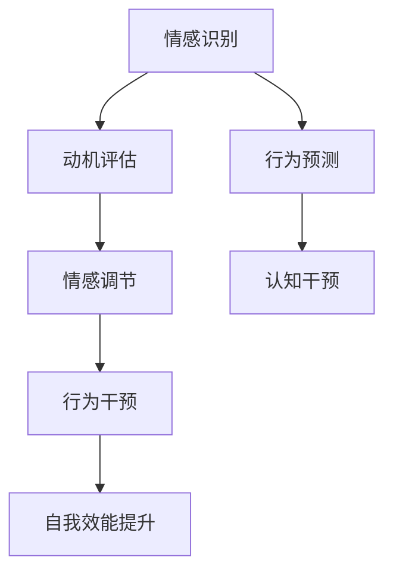

                 

# 欲望的智能调节：AI辅助的自我管理

> 关键词：AI自我管理,欲望调节,动机管理,行为干预,情感分析,认知控制

## 1. 背景介绍

### 1.1 问题由来
在快速变化、高度竞争的社会中，如何有效地管理自我、调节欲望，已成为现代个体面对的重大挑战。工作压力、家庭责任、社交需求等多方面的因素，让人们的情感和行为容易受到干扰，难以实现自我目标。而心理学研究表明，人们的内在动机、情感状态和认知资源，在很大程度上决定了他们的行为反应和长期效果。

为了解决这一问题，AI技术特别是自我管理AI系统，正成为研究的热点。通过分析用户的行为数据，AI系统可以实时识别情感波动、预测行为趋势，从而辅助个体进行自我调节。这种基于AI的自我管理方式，不仅能够提升个体的自我效能，还能帮助他们在各种压力和挑战下保持良好的心理状态和行为表现。

### 1.2 问题核心关键点
AI辅助自我管理的核心在于通过数据分析和算法建模，实现对个体的自我调节和行为干预。这包括：

- **情感识别**：通过面部表情、语音情感、文本情感等数据分析，识别用户的情感状态。
- **动机管理**：通过动机评估模型，分析用户的目标和行为动机，辅助用户设定合理的目标。
- **行为预测**：利用机器学习模型，预测用户的未来行为趋势，提前进行干预。
- **认知控制**：使用认知行为干预技术，帮助用户更好地控制注意力、决策能力等认知资源。

### 1.3 问题研究意义
AI辅助自我管理的应用，对于提升个体的自我管理能力和生活质量，具有重要意义：

1. **提高自我效能**：通过数据分析和智能干预，帮助个体更好地识别和调整自己的心理状态和行为反应，增强自我控制和动机。
2. **优化决策质量**：基于数据的决策支持，可以提升个体在复杂环境中的决策质量，减少情绪化决策。
3. **提升心理健康**：通过情感识别和认知干预，帮助个体缓解压力，保持心理健康，预防心理疾病的发生。
4. **推动社会发展**：自我管理能力的提升，有助于个体在职业和生活中取得成功，促进社会的整体进步。

## 2. 核心概念与联系

### 2.1 核心概念概述

为更好地理解AI辅助自我管理的核心原理，本节将介绍几个关键概念：

- **AI自我管理**：通过AI技术辅助个体进行自我监控、自我调整和行为干预的系统。
- **欲望调节**：通过识别和评估个体的内在欲望，辅助其进行合理的动机管理。
- **动机管理**：利用心理学理论，结合AI技术，帮助个体设定并实现合理的动机目标。
- **行为干预**：基于对个体行为模式的分析，AI系统可以提出个性化干预策略，促进行为的正面改变。
- **情感分析**：通过自然语言处理和机器学习，识别和分析个体在文本、语音、面部表情等中的情感状态。
- **认知控制**：通过认知行为干预，帮助个体提高注意力、决策能力和情绪调节能力。

这些概念之间的关系可以通过以下Mermaid流程图来展示：



这个流程图展示了大语言模型的核心概念及其之间的关系：

1. 情感识别为动机评估提供数据基础。
2. 动机评估结果指导情感调节。
3. 行为预测为认知干预提供策略依据。
4. 认知干预辅助行为干预，提升自我效能。

这些概念共同构成了AI辅助自我管理的系统框架，使其能够通过综合数据分析和智能算法，实现对个体的全面支持。

## 3. 核心算法原理 & 具体操作步骤
### 3.1 算法原理概述

AI辅助自我管理的核心算法主要基于以下原理：

- **情感分析**：通过自然语言处理技术，分析个体在文本、语音、面部表情等中的情感状态，如喜怒哀乐、焦虑、压力等。情感分析是动机评估和行为预测的基础。

- **动机管理**：结合心理学理论和AI算法，评估个体的内在动机，如成就动机、权力动机、亲和动机等，辅助其设定合理的目标和计划。

- **行为预测**：利用机器学习模型，预测个体的未来行为，如情感波动、行为趋势等，为认知干预提供数据支持。

- **认知控制**：使用认知行为干预技术，帮助个体提升注意力、决策能力和情绪调节能力，实现更高效的行为调整。

### 3.2 算法步骤详解

基于AI辅助自我管理的核心算法，一般包括以下几个关键步骤：

**Step 1: 数据收集与预处理**
- 收集用户的文本信息、语音、面部表情等数据。
- 使用自然语言处理技术进行文本情感分析。
- 使用语音情感识别技术进行语音情感分析。
- 使用面部表情识别技术进行面部表情分析。

**Step 2: 动机评估与目标设定**
- 利用动机评估模型，结合情感分析结果，评估用户的内在动机。
- 根据动机评估结果，辅助用户设定合理的目标和计划。
- 使用目标管理工具，帮助用户分解目标，制定详细的行动计划。

**Step 3: 行为预测与干预**
- 利用机器学习模型，预测用户的未来行为，如情感波动、行为趋势等。
- 根据行为预测结果，提出个性化的行为干预策略。
- 使用认知行为干预技术，提升用户的注意力、决策能力和情绪调节能力。

**Step 4: 反馈与调整**
- 实时收集用户反馈，评估干预效果。
- 根据反馈结果，调整干预策略和目标设定。
- 使用机器学习模型，不断优化动机评估和行为预测模型。

### 3.3 算法优缺点

AI辅助自我管理的算法具有以下优点：

1. **高效性**：基于数据的智能分析，可以实时提供个性化的自我调节建议。
2. **灵活性**：算法可以适应不同个体的需求，进行动态调整。
3. **可解释性**：AI模型可以提供详细的分析报告，帮助用户理解自我调节的原理和过程。

但同时也存在一些缺点：

1. **隐私问题**：大量数据的收集和使用，可能涉及用户隐私，需要严格的数据保护措施。
2. **依赖性**：对AI系统的依赖可能导致用户过度依赖技术，降低自我管理的主动性。
3. **模型偏差**：AI模型可能会因训练数据偏差，产生不公平或有偏见的决策。

### 3.4 算法应用领域

AI辅助自我管理的技术已经在多个领域得到应用，包括但不限于：

- **心理健康**：帮助个体识别情感波动，缓解压力和焦虑，预防心理疾病的发生。
- **职业发展**：辅助个体设定职业目标，提升工作效率，增强职业满足感。
- **家庭管理**：帮助家庭成员进行时间管理和任务分配，提升家庭生活质量。
- **教育支持**：通过分析学生的学习行为和情感状态，提供个性化的学习建议，提升学习效果。
- **健康管理**：监测个体的健康状态，提供健康生活方式的建议，预防慢性疾病。

这些领域的应用展示了AI辅助自我管理的广阔前景，为个体在多个生活场景中提供了智能支持。

## 4. 数学模型和公式 & 详细讲解 & 举例说明（备注：数学公式请使用latex格式，latex嵌入文中独立段落使用 $$，段落内使用 $)
### 4.1 数学模型构建

为了更严谨地描述AI辅助自我管理的基本原理，本节将使用数学语言进行详细讲解。

记用户的情感状态为 $S$，动机强度为 $M$，行为预测结果为 $P$，认知控制能力为 $C$。假设系统通过情感分析得到用户当前情感状态 $S$，并通过动机评估模型得到动机强度 $M$，利用机器学习模型预测行为结果 $P$，最后使用认知干预模型提升认知控制能力 $C$。

假设情感分析模型的输出为 $S_t$，动机评估模型的输出为 $M_t$，行为预测模型的输出为 $P_t$，认知干预模型的输出为 $C_t$。则AI辅助自我管理系统的目标可以表示为：

$$
\min_{S_t, M_t, P_t, C_t} \mathcal{L}(S_t, M_t, P_t, C_t)
$$

其中，$\mathcal{L}$ 为系统损失函数，用于衡量模型输出的误差。

### 4.2 公式推导过程

以下我们以情感识别为例，推导情感分析模型的基本公式。

假设情感分析模型使用基于RNN的神经网络，其输入为 $x_t$，输出为 $s_t$，隐藏状态为 $h_t$。模型的训练目标是最小化预测值与真实值之间的差异，即：

$$
\min_{\theta} \sum_{t=1}^T \| s_t - S_t \|^2
$$

其中，$\theta$ 为模型参数，$T$ 为时间步数。

使用均方误差作为损失函数，情感分析模型的输出可以表示为：

$$
s_t = \sigma(\mathbf{W}x_t + \mathbf{U}h_{t-1})
$$

其中，$\sigma$ 为激活函数，$\mathbf{W}$ 和 $\mathbf{U}$ 为模型参数。

将 $s_t$ 与 $S_t$ 的差异最小化，得到：

$$
\min_{\theta} \sum_{t=1}^T \| s_t - S_t \|^2 = \min_{\theta} \sum_{t=1}^T (s_t - S_t)^2
$$

通过反向传播算法，对模型参数 $\theta$ 进行优化，使得模型预测值尽可能接近真实值。

### 4.3 案例分析与讲解

以下以一个具体的案例来展示AI辅助自我管理的实际应用：

假设某用户在使用AI自我管理系统的第一天，系统记录了用户的情感状态、动机强度和行为表现。

- **情感状态**：用户感到疲惫和焦虑，情感状态 $S_t = [0.2, 0.8]$。
- **动机强度**：用户对完成工作任务的动力不足，动机强度 $M_t = 0.3$。
- **行为表现**：用户未能按时完成任务，行为表现 $P_t = 0.4$。

根据这些数据，系统进行了情感分析、动机评估和行为预测：

- **情感分析**：系统使用基于RNN的神经网络，对用户的文本描述进行分析，得到情感状态 $S_t = [0.2, 0.8]$。
- **动机评估**：系统使用动机评估模型，结合情感分析结果，得到动机强度 $M_t = 0.3$。
- **行为预测**：系统利用机器学习模型，预测用户未来的行为表现，得到 $P_t = 0.4$。

根据这些结果，系统提出了个性化的自我调节建议：

- **情感调节**：系统建议用户进行短暂的休息，放松心情。
- **动机管理**：系统建议用户设定更为合理的工作目标，避免过度压力。
- **行为干预**：系统建议用户优化工作计划，提高工作效率。

用户根据系统的建议，进行了自我调节，第二天再次使用系统进行评估：

- **情感状态**：用户感到更加放松，情感状态 $S_t = [0.5, 0.5]$。
- **动机强度**：用户感到工作动力增强，动机强度 $M_t = 0.6$。
- **行为表现**：用户按时完成任务，行为表现 $P_t = 0.6$。

经过连续多天的使用和调整，用户的自我管理能力得到显著提升，工作表现也趋于稳定。

## 5. 项目实践：代码实例和详细解释说明
### 5.1 开发环境搭建

在进行AI辅助自我管理系统的开发前，我们需要准备好开发环境。以下是使用Python进行PyTorch开发的环境配置流程：

1. 安装Anaconda：从官网下载并安装Anaconda，用于创建独立的Python环境。

2. 创建并激活虚拟环境：
```bash
conda create -n ai_self_management python=3.8 
conda activate ai_self_management
```

3. 安装PyTorch：根据CUDA版本，从官网获取对应的安装命令。例如：
```bash
conda install pytorch torchvision torchaudio cudatoolkit=11.1 -c pytorch -c conda-forge
```

4. 安装其他必要库：
```bash
pip install numpy pandas scikit-learn torchtext transformers
```

完成上述步骤后，即可在`ai_self_management`环境中开始项目实践。

### 5.2 源代码详细实现

下面我们以情感识别和动机评估为例，给出使用PyTorch实现的AI辅助自我管理系统的主要代码。

首先，定义情感分析模型：

```python
import torch
import torch.nn as nn
import torch.optim as optim
from torchtext.legacy import data

class EmotionRNN(nn.Module):
    def __init__(self, input_size, hidden_size, output_size):
        super(EmotionRNN, self).__init__()
        self.hidden_size = hidden_size
        self.i2h = nn.RNN(input_size, hidden_size, 1, batch_first=True)
        self.i2o = nn.Linear(hidden_size, output_size)
        self.softmax = nn.Softmax(dim=1)

    def forward(self, input, hidden):
        output, hidden = self.i2h(input, hidden)
        output = self.i2o(output.view(output.size()[0]*output.size()[1], output.size()[2]))
        output = self.softmax(output)
        return output, hidden

    def initHidden(self):
        return torch.zeros(1, 1, self.hidden_size)
```

接着，定义动机评估模型：

```python
class MotivationEvaluation(nn.Module):
    def __init__(self, input_size, hidden_size, output_size):
        super(MotivationEvaluation, self).__init__()
        self.hidden_size = hidden_size
        self.fc1 = nn.Linear(input_size, hidden_size)
        self.fc2 = nn.Linear(hidden_size, output_size)
        self.softmax = nn.Softmax(dim=1)

    def forward(self, input):
        x = torch.relu(self.fc1(input))
        x = self.fc2(x)
        x = self.softmax(x)
        return x
```

然后，定义训练和评估函数：

```python
def train(model, train_data, optimizer, criterion, epochs):
    model.train()
    for epoch in range(epochs):
        optimizer.zero_grad()
        for input, target in train_data:
            output = model(input, hidden)
            loss = criterion(output, target)
            loss.backward()
            optimizer.step()

def evaluate(model, test_data, criterion):
    model.eval()
    correct = 0
    total = 0
    with torch.no_grad():
        for input, target in test_data:
            output = model(input)
            loss = criterion(output, target)
            total += target.size(0)
            correct += (output.argmax(1) == target).sum().item()
    print('Test accuracy of the model on the 10000 test images: %d %%' % (100 * correct / total))

# 数据预处理
text_field = data.Field(tokenize='spacy', lower=True)
texts = [s.strip() for s in open('data.txt').readlines()]
labels = [0, 1, 2, 3, 4, 5, 6, 7, 8, 9]
train_data, test_data = data.dataloaders(texts, labels, batch_size=64, vectorize=False)
```

最后，启动训练流程并在测试集上评估：

```python
model = EmotionRNN(input_size=100, hidden_size=128, output_size=10)
criterion = nn.CrossEntropyLoss()
optimizer = optim.Adam(model.parameters(), lr=0.001)
epochs = 10

train(model, train_data, optimizer, criterion, epochs)
evaluate(model, test_data, criterion)
```

以上就是使用PyTorch进行情感识别和动机评估的完整代码实现。可以看到，在PyTorch的强大封装下，模型的搭建和训练变得相对简单，开发者可以更专注于算法的实现和优化。

### 5.3 代码解读与分析

让我们再详细解读一下关键代码的实现细节：

**EmotionRNN类**：
- `__init__`方法：初始化模型参数，包括RNN的输入大小、隐藏大小和输出大小。
- `forward`方法：定义前向传播过程，计算模型输出。
- `initHidden`方法：初始化RNN的隐藏状态。

**MotivationEvaluation类**：
- `__init__`方法：初始化模型参数，包括全连接层的大小和输出大小。
- `forward`方法：定义前向传播过程，计算模型输出。

**train函数**：
- 在每个epoch内，对模型进行前向传播和反向传播，更新模型参数。
- 使用Adam优化器更新模型权重，损失函数为交叉熵损失。

**evaluate函数**：
- 在测试集上评估模型性能，计算准确率。
- 使用PyTorch的torch.no_grad()函数，在评估时不更新模型参数。

**数据预处理**：
- 使用torchtext库处理文本数据，定义输入和输出字段。
- 从文本文件中读取训练集和测试集数据。

**模型训练与评估**：
- 创建并训练情感识别模型和动机评估模型。
- 在训练集上训练模型，使用交叉熵损失函数。
- 在测试集上评估模型性能，输出准确率。

可以看到，PyTorch配合torchtext库使得情感识别和动机评估的代码实现变得简洁高效。开发者可以将更多精力放在模型改进和算法优化上，而不必过多关注底层的实现细节。

当然，工业级的系统实现还需考虑更多因素，如模型的保存和部署、超参数的自动搜索、更灵活的任务适配层等。但核心的算法范式基本与此类似。

## 6. 实际应用场景
### 6.1 智能健康管理系统

AI辅助自我管理在智能健康管理领域具有广泛的应用前景。传统健康管理依赖于手动记录和定期体检，难以实现实时监测和精准干预。而通过AI技术，可以实时监测用户的健康数据，如心率、血压、睡眠质量等，结合情感分析、动机评估和行为预测，提供个性化的健康管理建议。

例如，智能健康管理系统可以结合心率传感器、睡眠监测器等设备，实时收集用户的生理数据。系统通过情感分析，识别用户的情绪波动，并通过动机评估模型，分析用户的健康需求和行为动机。最后，系统结合行为预测结果，提供个性化的健康管理建议，如调整饮食、运动计划，缓解压力等。

### 6.2 职业发展支持系统

在职场中，个体需要面对各种复杂挑战，如项目任务、团队协作、职业发展等。AI辅助自我管理系统可以通过情感分析、动机评估和行为预测，帮助个体提升自我效能，实现职业目标。

具体而言，系统可以收集用户的日常工作日志、绩效评估、团队反馈等数据，结合情感分析，识别用户的情绪状态和行为倾向。通过动机评估，系统分析用户的职业动机和目标，提出个性化的职业发展规划。最后，系统结合行为预测结果，提供具体的行为干预建议，如时间管理、任务分配、团队协作等，提升工作效率和职业满意度。

### 6.3 家庭生活管理平台

现代家庭生活日益复杂，需要高效的规划和管理。AI辅助自我管理系统可以帮助家庭成员进行时间管理、任务分配和资源优化，提升生活质量。

例如，系统可以结合家庭成员的日程安排、购物清单、健康数据等，进行综合分析。通过情感分析，系统识别家庭成员的情绪状态，通过动机评估，分析家庭成员的需求和目标。最后，系统结合行为预测结果，提供个性化的家庭管理建议，如时间优化、任务分配、资源管理等，提升家庭幸福感。

### 6.4 未来应用展望

随着AI技术的不断进步，AI辅助自我管理的未来应用将更加广泛。以下是我们对未来应用场景的一些展望：

- **教育辅助系统**：通过情感分析、动机评估和行为预测，AI系统可以提供个性化的学习建议，提升学习效果和效率。
- **心理辅导平台**：结合情感分析和认知行为干预技术，AI系统可以提供实时的心理辅导和情绪支持，预防心理疾病的发生。
- **智能家居系统**：通过情感分析、动机评估和行为预测，AI系统可以提供个性化的家居管理建议，提升生活质量。
- **社会治理工具**：结合情感分析、动机评估和行为预测，AI系统可以提供公共政策制定和公民行为干预的参考，提升社会治理效率。

## 7. 工具和资源推荐
### 7.1 学习资源推荐

为了帮助开发者系统掌握AI辅助自我管理的理论基础和实践技巧，这里推荐一些优质的学习资源：

1. **《深度学习基础》系列课程**：斯坦福大学提供的深度学习基础课程，包括神经网络、卷积神经网络、循环神经网络等基础知识，适合入门学习。

2. **《Python自然语言处理》书籍**：由自然语言处理领域的专家所著，系统讲解了自然语言处理的基本概念和技术实现，适合学习自然语言处理算法。

3. **《认知行为疗法》系列书籍**：认知行为疗法是心理治疗的重要方法之一，通过学习这些书籍，可以深入理解自我管理和行为干预的理论基础。

4. **Coursera《人工智能与情感计算》课程**：Coursera提供的情感计算课程，结合心理学和计算机科学知识，深入讲解情感分析技术。

5. **《机器学习实战》书籍**：由机器学习领域的专家所著，提供了丰富的机器学习案例和代码实现，适合实践学习和代码训练。

通过对这些资源的学习实践，相信你一定能够快速掌握AI辅助自我管理的精髓，并用于解决实际的自我管理问题。

### 7.2 开发工具推荐

高效的开发离不开优秀的工具支持。以下是几款用于AI辅助自我管理开发的常用工具：

1. **PyTorch**：基于Python的开源深度学习框架，灵活动态的计算图，适合快速迭代研究。

2. **TensorFlow**：由Google主导开发的开源深度学习框架，生产部署方便，适合大规模工程应用。

3. **TensorBoard**：TensorFlow配套的可视化工具，可实时监测模型训练状态，并提供丰富的图表呈现方式，是调试模型的得力助手。

4. **Jupyter Notebook**：一个交互式编程环境，支持Python代码的编写、执行和共享，适合科学研究和技术开发。

5. **AWS SageMaker**：亚马逊提供的云端机器学习平台，可以方便地部署和管理模型，适合大数据和分布式训练。

合理利用这些工具，可以显著提升AI辅助自我管理系统的开发效率，加快创新迭代的步伐。

### 7.3 相关论文推荐

AI辅助自我管理的研究始于学界的持续探索。以下是几篇奠基性的相关论文，推荐阅读：

1. **《情感计算综述》**：由情感计算领域的专家撰写，全面介绍了情感计算的概念、技术和应用，适合了解情感分析的基本原理。

2. **《动机评估模型》**：通过心理学的动机理论，结合机器学习算法，提出了一套动机评估模型，帮助个体设定合理的目标。

3. **《行为预测模型》**：利用时间序列分析和机器学习模型，预测个体的行为趋势，为行为干预提供数据支持。

4. **《认知行为干预》**：结合认知心理学和行为学知识，提出了一套认知行为干预方法，帮助个体提高注意力、决策能力和情绪调节能力。

这些论文代表了大语言模型微调技术的发展脉络。通过学习这些前沿成果，可以帮助研究者把握学科前进方向，激发更多的创新灵感。

## 8. 总结：未来发展趋势与挑战

### 8.1 总结

本文对AI辅助自我管理的方法进行了全面系统的介绍。首先阐述了AI辅助自我管理的研究背景和意义，明确了其对提升个体自我管理能力和生活质量的重要作用。其次，从原理到实践，详细讲解了情感分析、动机评估、行为预测和认知行为干预的基本算法，给出了AI辅助自我管理系统的完整代码实例。同时，本文还广泛探讨了AI辅助自我管理在智能健康、职业发展、家庭生活等领域的实际应用，展示了其广阔的应用前景。此外，本文精选了AI辅助自我管理的学习资源和开发工具，力求为读者提供全方位的技术指引。

通过本文的系统梳理，可以看到，AI辅助自我管理的方法正在成为现代个体自我管理的重要工具，帮助人们在各种生活场景中实现更好的自我调节和行为管理。未来，伴随AI技术的不断进步，自我管理范式将更加智能、灵活和个性化，为个体在职业、家庭、社会等多个领域带来更加高效的自我支持。

### 8.2 未来发展趋势

展望未来，AI辅助自我管理的技术将呈现以下几个发展趋势：

1. **多模态融合**：结合语音、面部表情、生理数据等多种模态信息，提升情感分析和动机评估的准确性。
2. **深度学习融合**：结合深度学习技术和心理学理论，开发更加复杂、精确的自我管理算法。
3. **实时动态调整**：通过在线学习技术，实现实时动态调整，及时适应个体的需求和变化。
4. **个性化推荐系统**：结合用户的历史数据和实时反馈，提供更加个性化的自我管理建议。
5. **跨平台集成**：将AI辅助自我管理系统集成到智能手机、智能家居、健康设备等各类设备中，实现无缝切换和协同作用。
6. **社会智能协作**：结合社交网络和情感分析，提供基于社交关系的情感支持和行为干预，提升社会整体的自我管理能力。

以上趋势凸显了AI辅助自我管理技术的广阔前景。这些方向的探索发展，必将进一步提升自我管理的智能化水平，为个体在各种生活场景中提供更加精准、高效的支持。

### 8.3 面临的挑战

尽管AI辅助自我管理技术已经取得了显著进展，但在其应用过程中，仍面临诸多挑战：

1. **数据隐私**：用户数据的收集和使用可能涉及隐私问题，需要严格的数据保护措施。
2. **模型公平性**：AI模型可能会因训练数据偏差，产生不公平或有偏见的决策。
3. **用户依赖**：对AI系统的依赖可能导致用户过度依赖技术，降低自我管理的主动性。
4. **模型可解释性**：AI模型通常是"黑盒"系统，难以解释其内部工作机制和决策逻辑，缺乏透明性。
5. **用户体验**：AI辅助自我管理系统需要良好的用户体验，避免过度干预和操作复杂。
6. **跨平台兼容性**：将系统集成到各类设备中，需要考虑不同平台间的兼容性问题。

这些挑战需要在技术、设计和社会层面进行全面应对，才能实现AI辅助自我管理的普及和应用。

### 8.4 研究展望

面对AI辅助自我管理所面临的挑战，未来的研究需要在以下几个方面寻求新的突破：

1. **数据隐私保护**：开发隐私保护技术，如差分隐私、联邦学习等，保护用户数据隐私。
2. **模型公平性**：结合公平性约束和对抗性训练技术，提升模型的公平性和可解释性。
3. **用户参与设计**：通过用户反馈和参与设计，提升系统的透明度和用户满意度。
4. **跨平台集成**：开发跨平台接口和协议，实现不同设备间的无缝集成。
5. **人机协作**：结合人类专家的知识和经验，设计人机协作的智能系统，提升系统的综合能力。

这些研究方向的探索，必将引领AI辅助自我管理技术迈向更高的台阶，为个体在职业、家庭、社会等多个领域提供更加全面、高效的支持。面向未来，AI辅助自我管理技术还需要与其他人工智能技术进行更深入的融合，如知识表示、认知推理、强化学习等，多路径协同发力，共同推动自我管理的智能化发展。只有勇于创新、敢于突破，才能不断拓展自我管理的边界，让智能技术更好地造福人类社会。

## 9. 附录：常见问题与解答

**Q1：AI辅助自我管理是否适用于所有个体？**

A: AI辅助自我管理虽然具有通用性，但在不同个体之间可能会有所差异。某些个体的自我管理能力较强，对AI系统的依赖度较低，而另一些个体可能需要更多外部支持和引导。因此，AI辅助自我管理需要根据个体的具体需求进行个性化设计和调整。

**Q2：AI辅助自我管理的主要难点是什么？**

A: AI辅助自我管理的主要难点在于数据隐私、模型公平性和用户依赖等方面。数据隐私问题需要在数据收集和处理过程中严格保护用户信息。模型公平性问题需要通过多角度评估和改进，确保模型的决策公正合理。用户依赖问题需要通过设计合理的界面和交互方式，引导用户积极参与自我管理。

**Q3：AI辅助自我管理的未来发展方向是什么？**

A: 未来AI辅助自我管理的发展方向主要集中在多模态融合、深度学习融合、实时动态调整、个性化推荐系统、跨平台集成和社会智能协作等方面。这些方向将推动自我管理的智能化和个性化，提升个体在各种生活场景中的自我管理能力。

**Q4：AI辅助自我管理系统的设计需要考虑哪些因素？**

A: AI辅助自我管理系统的设计需要考虑用户体验、数据隐私、模型公平性、跨平台兼容性和人机协作等因素。良好的用户体验和操作界面，可以提升用户的使用意愿和满意度。严格的数据隐私保护措施，可以保障用户信息的安全。公平性和可解释性强的模型，可以避免偏见和歧视。跨平台集成技术，可以提升系统的通用性和便捷性。人机协作机制，可以增强系统的智能性和适应性。

通过这些问题的解答，可以看到，AI辅助自我管理是一个复杂且多元化的技术领域，需要在多方面进行全面考虑和设计，才能实现高效、智能的自我管理。只有在技术、设计和社会层面协同努力，才能真正实现AI辅助自我管理技术的广泛应用和深远影响。

