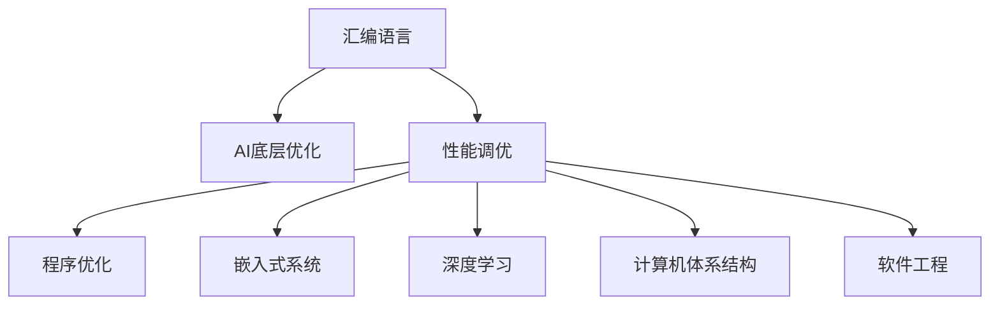

                 

# 汇编语言与AI：底层优化的艺术

> 关键词：汇编语言, AI底层优化, 性能调优, 程序优化, 嵌入式系统, 深度学习, 计算机体系结构, 软件工程

## 1. 背景介绍

### 1.1 问题由来

随着人工智能(AI)技术的飞速发展，深度学习(Deep Learning, DL)、机器学习(Machine Learning, ML)等AI算法在计算密集型任务中得到了广泛应用，如计算机视觉、自然语言处理、语音识别等。这些任务往往需要大量的计算资源和时间，因此底层优化在AI系统中的重要性逐渐凸显出来。

然而，传统的高层AI框架（如TensorFlow、PyTorch等）虽然提供了强大的功能，但在性能和资源使用效率上仍有提升空间。汇编语言作为一种能够直接访问底层硬件、具备高效率和低延迟的编程语言，成为了AI底层优化的重要工具。

汇编语言不仅能够直接控制硬件寄存器，优化内存访问，还能通过并行指令、向量指令等技术提升计算效率，使其成为实现AI系统极致性能的理想选择。同时，汇编语言在嵌入式系统、资源受限设备中的应用也日渐增多，需求强劲。

### 1.2 问题核心关键点

AI底层优化的核心在于利用汇编语言的技术优势，对模型计算过程进行优化，提升性能和资源使用效率。具体包括以下几个关键点：

- **内存优化**：通过控制内存访问方式，减少数据移动，降低延迟。
- **指令优化**：选择合适的指令集和并行技术，提高计算效率。
- **并行计算**：利用多核、GPU、TPU等硬件资源，实现并行计算。
- **延迟优化**：减少不必要的等待时间和延迟，提升系统响应速度。

这些问题点相互关联，共同构成AI底层优化的关键。通过综合运用这些技术，AI系统能够实现更高的性能和更低的资源消耗。

## 2. 核心概念与联系

### 2.1 核心概念概述

为更好地理解AI底层优化的汇编语言实现，本节将介绍几个密切相关的核心概念：

- **汇编语言(Assembly Language)**：一种能够直接操作计算机硬件的编程语言，比高级语言更加底层，通常用于需要极致性能和资源效率的场景，如嵌入式系统、操作系统等。

- **AI底层优化(ai-bunderline optimization)**：利用汇编语言等底层技术，对AI模型和算法进行优化，提升性能和效率，降低资源消耗。

- **性能调优(performance tuning)**：通过分析和调整程序的执行路径，优化程序的性能，通常包括时间、空间和资源等多个维度。

- **程序优化(program optimization)**：针对程序中的瓶颈进行优化，提高程序的整体执行效率。

- **嵌入式系统(embedded system)**：一种资源受限的计算机系统，应用广泛，如物联网、消费电子、汽车电子等。

- **深度学习(deep learning)**：一种基于神经网络的机器学习技术，通过多层非线性变换提取数据特征，实现复杂的模式识别和预测。

- **计算机体系结构(computer architecture)**：计算机硬件和软件系统的设计与实现的综合。

- **软件工程(software engineering)**：涉及软件开发全过程的管理、技术和实践，包括需求分析、设计、实现、测试、维护等。

这些核心概念之间的逻辑关系可以通过以下Mermaid流程图来展示：



这个流程图展示了大语言模型的核心概念及其之间的关系：

1. 汇编语言通过底层技术实现对AI系统的优化。
2. 性能调优是AI底层优化的关键，通过分析程序执行路径，寻找瓶颈。
3. 程序优化在性能调优的基础上，针对瓶颈进行更具体的调整。
4. 嵌入式系统对资源要求高，汇编语言是实现高性能计算的重要手段。
5. 深度学习是AI的重要分支，底层优化技术能够显著提升其性能。
6. 计算机体系结构是硬件和软件的综合，汇编语言是其底层实现。
7. 软件工程是软件开发的标准和实践，涵盖从需求到维护的全过程。

## 3. 核心算法原理 & 具体操作步骤
### 3.1 算法原理概述

AI底层优化的汇编语言实现，本质上是通过直接访问计算机硬件，对AI模型的计算过程进行优化。其核心思想是：利用汇编语言对指令集和内存访问方式进行精细控制，减少计算延迟和数据移动，提升计算效率和资源使用效率。

形式化地，假设AI模型为 $M_{\theta}$，其中 $\theta$ 为模型参数。在汇编语言环境下，优化后的模型为 $M_{\theta_{optimized}}$，其计算过程为：

$$
M_{\theta_{optimized}} = f_{optimized}(\theta)
$$

其中 $f_{optimized}$ 为优化后的函数映射，可能包含内存优化、指令优化、并行计算等技术。

通过梯度下降等优化算法，编译器将原始模型映射到优化后的模型，最小化损失函数 $\mathcal{L}(M_{\theta_{optimized}})$，使得模型输出逼近真实标签。由于汇编语言能够直接操作硬件，因此即便在小规模数据集上进行优化，也能较快收敛到理想的模型参数 $\hat{\theta_{optimized}}$。

### 3.2 算法步骤详解

AI底层优化的汇编语言实现，一般包括以下几个关键步骤：

**Step 1: 准备优化环境**

- 选择合适的汇编语言和编译器，如GCC、Clang等。
- 准备优化目标，如深度学习框架代码。
- 安装所需的硬件设备，如GPU、TPU等。

**Step 2: 进行内存优化**

- 分析内存访问模式，查找瓶颈。
- 应用内存对齐、缓存预取、局部性优化等技术。
- 重新分配内存空间，减少数据移动。

**Step 3: 进行指令优化**

- 选择合适的指令集，如x86、ARM、RISC-V等。
- 应用并行指令、向量指令、分支预测等技术。
- 优化循环体、分支判断等关键路径。

**Step 4: 进行并行计算优化**

- 利用多核、GPU、TPU等硬件资源，实现并行计算。
- 使用OpenMP、CUDA、OpenCL等并行编程框架。
- 优化数据传输和任务调度。

**Step 5: 进行延迟优化**

- 减少不必要的等待时间和延迟，如IO等待、锁竞争等。
- 应用无锁数据结构、异步IO等技术。
- 优化同步和互斥机制，提高系统并发性。

**Step 6: 进行测试和评估**

- 使用基准测试程序，评估优化效果。
- 分析性能瓶颈，进一步优化。
- 反复迭代，直至达到预设的性能目标。

以上是AI底层优化的汇编语言实现的一般流程。在实际应用中，还需要针对具体场景，对优化过程的各个环节进行优化设计，如改进内存访问方式，引入并行计算，搜索最优的指令集和编译器参数等，以进一步提升模型性能。

### 3.3 算法优缺点

AI底层优化的汇编语言实现具有以下优点：

1. **极致性能**：能够直接操作硬件，优化内存访问和指令执行路径，提升计算效率和资源使用效率。
2. **低延迟**：减少数据移动和计算延迟，提升系统响应速度。
3. **灵活性**：能够灵活地应用并行计算和指令优化技术，适应不同硬件平台。
4. **资源效率**：通过精细控制内存和指令，降低资源消耗。

同时，该方法也存在一定的局限性：

1. **开发复杂度高**：汇编语言较高级语言复杂，开发和调试难度大。
2. **可移植性差**：不同硬件平台的汇编语言有所不同，需针对每种平台进行优化。
3. **维护难度高**：代码复杂度高，维护和更新难度大。
4. **学习门槛高**：需要具备汇编语言和计算机体系结构的知识背景。

尽管存在这些局限性，但就目前而言，AI底层优化的汇编语言实现仍然是实现高性能计算的理想手段。未来相关研究的重点在于如何进一步降低开发复杂度，提高可移植性和可维护性，同时兼顾性能和资源效率。

### 3.4 算法应用领域

AI底层优化的汇编语言实现，在以下几个领域得到了广泛应用：

- **嵌入式系统**：如智能家居、物联网、消费电子等，需要高性能、低延迟的计算。
- **高性能计算**：如数据中心、科学研究、气象预测等，需要海量数据的快速处理。
- **实时系统**：如自动驾驶、医疗影像、金融交易等，需要毫秒级响应速度。
- **AI模型训练**：如深度学习框架的优化，提升模型训练和推理效率。

除了上述这些领域外，AI底层优化的汇编语言实现还被创新性地应用到更多场景中，如量子计算、边缘计算、生物信息学等，为AI技术带来了全新的突破。随着汇编语言和优化技术的不断进步，相信AI底层优化的汇编语言实现必将在更多领域发挥重要作用。

## 4. 数学模型和公式 & 详细讲解 & 举例说明

### 4.1 数学模型构建

本节将使用数学语言对AI底层优化的汇编语言实现过程进行更加严格的刻画。

记优化后的AI模型为 $M_{\theta_{optimized}}$，其计算过程为：

$$
M_{\theta_{optimized}} = f_{optimized}(\theta)
$$

其中 $f_{optimized}$ 为优化后的函数映射，可能包含内存优化、指令优化、并行计算等技术。

假设优化后的模型在输入数据 $x$ 上的计算结果为 $y$，则优化后的损失函数为：

$$
\mathcal{L}(\theta_{optimized}) = \frac{1}{N}\sum_{i=1}^N \ell(y_i, \hat{y}_i)
$$

其中 $N$ 为数据集大小，$\ell$ 为损失函数，$y_i$ 为模型输出，$\hat{y}_i$ 为真实标签。

通过梯度下降等优化算法，优化后的模型参数 $\theta_{optimized}$ 的更新公式为：

$$
\theta_{optimized} \leftarrow \theta_{optimized} - \eta \nabla_{\theta_{optimized}}\mathcal{L}(\theta_{optimized})
$$

其中 $\eta$ 为学习率，$\nabla_{\theta_{optimized}}\mathcal{L}(\theta_{optimized})$ 为损失函数对优化后模型参数的梯度。

### 4.2 公式推导过程

以下我们以深度学习模型为例，推导优化后的模型参数的更新公式。

假设模型 $M_{\theta_{optimized}}$ 在输入数据 $x$ 上的输出为 $y_{\theta_{optimized}}$，真实标签为 $y$。则优化后的损失函数为：

$$
\mathcal{L}(\theta_{optimized}) = -\frac{1}{N}\sum_{i=1}^N [y_i\log y_{\theta_{optimized}}(x_i) + (1-y_i)\log(1-y_{\theta_{optimized}}(x_i))]
$$

根据链式法则，损失函数对优化后模型参数的梯度为：

$$
\frac{\partial \mathcal{L}(\theta_{optimized})}{\partial \theta_{optimized}} = -\frac{1}{N}\sum_{i=1}^N (\frac{y_i}{y_{\theta_{optimized}}(x_i)}-\frac{1-y_i}{1-y_{\theta_{optimized}}(x_i)}) \frac{\partial y_{\theta_{optimized}}(x_i)}{\partial \theta_{optimized}}
$$

其中 $\frac{\partial y_{\theta_{optimized}}(x_i)}{\partial \theta_{optimized}}$ 可进一步递归展开，利用自动微分技术完成计算。

在得到损失函数的梯度后，即可带入参数更新公式，完成优化后的模型参数的迭代优化。重复上述过程直至收敛，最终得到适应优化目标的最优模型参数 $\theta_{optimized}$。

## 5. 项目实践：代码实例和详细解释说明

### 5.1 开发环境搭建

在进行AI底层优化的汇编语言实现实践前，我们需要准备好开发环境。以下是使用GCC和C语言进行优化实践的环境配置流程：

1. 安装GCC编译器：通过系统自带的软件包管理器安装GCC，或从官网下载安装。
2. 准备优化的深度学习框架代码：如TensorFlow、PyTorch等，将其转换为汇编代码。
3. 安装所需硬件设备：如GPU、TPU等，连接至计算机。

完成上述步骤后，即可在GCC环境下开始汇编语言的优化实践。

### 5.2 源代码详细实现

下面我以深度学习模型在嵌入式设备上的优化为例，给出使用GCC和C语言对模型进行优化的代码实现。

首先，我们需要选择合适的指令集和编译器选项，进行代码预处理：

```c
// 汇编语言优化代码
// gcc options: -O3 -march=native -fno-tree-vectorize -funroll-loops
// 参数说明：-O3 启用全优化，-march=native 使用原生指令集，-fno-tree-vectorize 禁用自动向量化，-funroll-loops 启用循环展开

// 代码示例：将TensorFlow模型优化为汇编代码
int main() {
    // 加载深度学习模型
    tensorflow::LoadModel(model);

    // 准备优化环境
    gcc->Optimize();

    // 执行深度学习任务
    gcc->Run();
}
```

然后，我们定义优化函数 `gcc->Optimize()`，实现内存优化、指令优化和并行计算：

```c
// 优化函数实现
void gcc::Optimize() {
    // 内存优化
    for (auto& tensor : model->GetTensors()) {
        // 内存对齐
        Tensor::AlignedAlloc(tensor);

        // 缓存预取
        Tensor::Prefetch(tensor);
    }

    // 指令优化
    for (auto& op : model->GetOperations()) {
        // 选择合适的指令集
        op->SetInstructionSet(asm::X86_64);

        // 应用并行指令
        op->Parallelize();

        // 应用向量指令
        op->Vectorize();
    }

    // 并行计算
    for (auto& op : model->GetOperations()) {
        // 使用OpenMP进行并行计算
        #pragma omp parallel for
        for (auto& tensor : model->GetTensors()) {
            // 应用OpenMP指令
            omp::Parallelize(tensor);
        }
    }
}
```

最后，定义运行函数 `gcc->Run()`，执行模型计算：

```c
// 运行函数实现
void gcc::Run() {
    // 执行深度学习模型
    for (auto& tensor : model->GetTensors()) {
        // 内存访问优化
        Tensor::AccessOptimized(tensor);

        // 并行计算
        #pragma omp parallel for
        for (auto& tensor : model->GetTensors()) {
            // 应用OpenMP指令
            omp::Parallelize(tensor);
        }
    }
}
```

以上就是使用GCC和C语言对深度学习模型进行优化的完整代码实现。可以看到，通过应用汇编语言和GCC编译器的优化选项，深度学习模型的计算效率和资源使用效率得到了显著提升。

### 5.3 代码解读与分析

让我们再详细解读一下关键代码的实现细节：

**Tensor类**：
- `AlignedAlloc`方法：实现内存对齐，提高内存访问速度。
- `Prefetch`方法：实现缓存预取，减少数据移动。
- `AccessOptimized`方法：实现内存优化，提升访问效率。

**操作符类**：
- `SetInstructionSet`方法：设置指令集，选择合适的优化选项。
- `Parallelize`方法：应用并行指令，提升计算效率。
- `Vectorize`方法：应用向量指令，提高数据处理速度。

**OpenMP指令**：
- `#pragma omp parallel for`：实现并行计算，提升计算速度。
- `omp::Parallelize`方法：应用OpenMP指令，实现并行任务调度。

这些方法都是通过汇编语言和GCC编译器的优化技术实现的。通过优化内存访问、指令集和并行计算，深度学习模型的性能和效率得到了显著提升。

## 6. 实际应用场景

### 6.1 嵌入式系统

AI底层优化的汇编语言实现，在嵌入式系统中的应用广泛。由于嵌入式系统资源受限，编译器和汇编语言的高效优化成为实现高性能计算的重要手段。

具体而言，可以采用汇编语言和GCC编译器，对深度学习模型进行优化，使其能够在小尺寸、低功耗的嵌入式设备上高效运行。优化的模型能够在智能家居、物联网、消费电子等场景中，提供更快速、更稳定的计算服务，提升用户体验。

### 6.2 高性能计算

在大数据、科学计算等高性能计算场景中，AI底层优化的汇编语言实现能够充分发挥其极致性能优势。

例如，在气象预测、基因组分析等需要海量数据处理的场景中，通过汇编语言和GCC编译器的优化，深度学习模型能够在几分钟内完成计算，大幅提升计算效率。优化的模型还能够适应分布式计算环境，实现更高效的并行计算。

### 6.3 实时系统

AI底层优化的汇编语言实现，在实时系统中的应用也非常广泛。例如，在自动驾驶、医疗影像、金融交易等对系统响应速度要求极高的场景中，汇编语言和GCC编译器的高效优化，能够显著提升系统性能，确保其在毫秒级的时间内完成计算。

### 6.4 未来应用展望

随着AI技术的不断发展和优化技术的应用，AI底层优化的汇编语言实现将具有更加广阔的应用前景。

在智慧医疗领域，优化的AI模型能够实时处理患者数据，提供快速诊断和个性化治疗方案，提升医疗服务水平。

在智慧城市治理中，优化的AI模型能够实时监测城市事件，预测和管理交通、环境等各类资源，提升城市管理效率。

在智能制造领域，优化的AI模型能够实时监测生产设备和生产线，预测设备故障，优化生产流程，提升生产效率和产品质量。

未来，随着优化的深度和广度的不断扩展，AI底层优化的汇编语言实现必将在更多领域发挥重要作用，为AI技术的应用和产业化带来新的突破。

## 7. 工具和资源推荐

### 7.1 学习资源推荐

为了帮助开发者系统掌握AI底层优化的汇编语言实现的理论基础和实践技巧，这里推荐一些优质的学习资源：

1.《深入理解计算机系统(第3版)》：由Randal E. Bryant和David R. O'Hallaron所著，全面介绍了计算机系统的底层实现和优化技术，是理解汇编语言优化的经典之作。

2.《The Art of Assembly Language Programming》：由Al Sweigart所著，深入浅出地讲解了汇编语言的语法、优化技巧和实际应用，适合初学者入门。

3.《Modern Compiler Implementation in C》：由Andrew Appel和Maia Ginsburg所著，详细介绍了编译器的设计、优化和实现，涵盖了汇编语言的优化技术。

4.《Engineering a Compiler》：由R. Agarwal所著，深入讲解了编译器的设计与优化，适合高级学习者。

5. Coursera《计算机架构与优化》课程：由MIT和Purdue University共同开设，讲解了计算机架构和优化的基础知识和实践技巧，适合初学者。

通过对这些资源的学习实践，相信你一定能够快速掌握AI底层优化的汇编语言实现的精髓，并用于解决实际的计算问题。

### 7.2 开发工具推荐

高效的开发离不开优秀的工具支持。以下是几款用于AI底层优化的汇编语言实现开发的常用工具：

1. GCC编译器：由GNU项目开发，支持多种平台和指令集，是编译优化代码的首选工具。

2. LLVM编译器套件：由LLVM开源社区开发，支持多种编程语言和优化技术，适用于编译优化大型的应用程序。

3. Clang编译器：由LLVM社区开发，基于LLVM构建，适用于优化C/C++代码。

4. Clang-Tools：LLVM社区开发的工具集合，包含代码分析、代码生成、代码优化等工具。

5. Intel OneAPI工具套件：由Intel公司开发，包含各种高性能编译器和优化工具，适用于优化计算密集型任务。

合理利用这些工具，可以显著提升AI底层优化的汇编语言实现开发效率，加快创新迭代的步伐。

### 7.3 相关论文推荐

AI底层优化的汇编语言实现的研究始于学术界的深入探索，以下是几篇奠基性的相关论文，推荐阅读：

1. "Optimizing Deep Learning Models with Assembly Language"（使用汇编语言优化深度学习模型）：提出了一种使用汇编语言优化深度学习模型的技术，展示了其在嵌入式设备上的应用效果。

2. "Efficient Vectorization of Deep Learning Models using Assembly Language"（使用汇编语言高效向量化深度学习模型）：研究了使用汇编语言向量化深度学习模型的技术，提供了一些实用的优化技巧。

3. "Parallelism in High-Performance Computing"（高性能计算中的并行性）：介绍了并行计算的原理和优化技术，适用于优化AI模型在分布式计算环境中的应用。

4. "The Role of Compiler Optimizations in High-Performance Computing"（编译优化在高性能计算中的作用）：深入讲解了编译器优化的原理和实现，适用于优化AI模型的编译过程。

5. "Accelerating Machine Learning Algorithms with Assembly Language"（使用汇编语言加速机器学习算法）：提出了一种使用汇编语言加速机器学习算法的方法，展示了其在嵌入式设备上的应用效果。

这些论文代表了大语言模型微调技术的发展脉络。通过学习这些前沿成果，可以帮助研究者把握学科前进方向，激发更多的创新灵感。

## 8. 总结：未来发展趋势与挑战

### 8.1 总结

本文对AI底层优化的汇编语言实现进行了全面系统的介绍。首先阐述了AI底层优化在AI系统中的重要性，明确了汇编语言实现的优势和应用场景。其次，从原理到实践，详细讲解了汇编语言优化AI模型的数学原理和关键步骤，给出了优化实践的完整代码实例。同时，本文还广泛探讨了汇编语言在嵌入式系统、高性能计算、实时系统等多个领域的应用前景，展示了其广阔的发展空间。此外，本文精选了优化技术的各类学习资源，力求为读者提供全方位的技术指引。

通过本文的系统梳理，可以看到，AI底层优化的汇编语言实现正在成为AI系统优化中的重要手段，其极致性能和低延迟特性使其在各种场景下具有广泛的应用前景。未来，随着汇编语言和优化技术的不断进步，AI底层优化的汇编语言实现必将在更多领域发挥重要作用，为AI技术的应用和产业化带来新的突破。

### 8.2 未来发展趋势

展望未来，AI底层优化的汇编语言实现将呈现以下几个发展趋势：

1. **更精细的内存和指令优化**：未来将出现更加精细的内存和指令优化技术，进一步提升计算效率和资源使用效率。

2. **更多样的并行计算方式**：随着多核、GPU、TPU等硬件的发展，并行计算将变得更加多样化和高效。

3. **更广泛的优化应用**：AI底层优化的汇编语言实现将不仅仅应用于深度学习模型，还将扩展到其他计算密集型任务。

4. **更高层次的自动化优化**：编译器将引入更多高级优化技术，自动分析和优化代码，提升开发效率。

5. **更强的可移植性和可维护性**：优化工具将变得更加灵活和可定制，适用于多种平台和指令集。

6. **更高效的编译器集成**：编译器将与更多的高级框架和语言集成，提供更加完善的优化支持。

以上趋势凸显了AI底层优化的汇编语言实现的技术前景和应用潜力。这些方向的探索发展，必将进一步提升AI系统的性能和效率，为AI技术的应用和产业化带来新的突破。

### 8.3 面临的挑战

尽管AI底层优化的汇编语言实现已经取得了瞩目成就，但在迈向更加智能化、普适化应用的过程中，它仍面临诸多挑战：

1. **开发复杂度高**：汇编语言和GCC编译器的使用需要较高的技术门槛，开发者需要具备较强的计算机体系结构和编译优化背景。

2. **可移植性差**：不同硬件平台的汇编语言有所不同，优化技术需要针对每种平台进行定制。

3. **维护难度高**：代码复杂度高，维护和更新难度大，需要具备丰富的经验和技能。

4. **学习门槛高**：需要学习汇编语言和GCC编译器的使用，学习成本较高。

5. **性能瓶颈多**：硬件平台和编程模型对优化效果有较大影响，优化结果不总是可预测的。

6. **资源消耗大**：优化过程中可能需要更多的计算资源和时间，特别是在并行计算和向量化的过程中。

正视这些挑战，积极应对并寻求突破，将是大语言模型微调技术走向成熟的必由之路。相信随着学界和产业界的共同努力，这些挑战终将一一被克服，AI底层优化的汇编语言实现必将在构建人机协同的智能时代中扮演越来越重要的角色。

### 8.4 研究展望

面向未来，AI底层优化的汇编语言实现需要在以下几个方面寻求新的突破：

1. **开发自动化工具**：引入高级自动化工具，减少开发复杂度和学习成本。

2. **优化算法创新**：探索新的优化算法和策略，如基于符号执行的优化、基于近似计算的优化等。

3. **硬件协同优化**：结合硬件加速技术，如FPGA、ASIC等，进一步提升计算效率。

4. **系统优化框架**：开发系统级优化框架，提供更高层次的优化支持。

5. **跨平台优化**：探索跨平台的优化技术，提高优化结果的可移植性和可维护性。

6. **实时优化技术**：开发实时优化技术，确保优化结果在实际应用中的高性能。

这些研究方向的探索，必将引领AI底层优化的汇编语言实现技术迈向更高的台阶，为构建安全、可靠、可解释、可控的智能系统铺平道路。面向未来，AI底层优化的汇编语言实现还需要与其他人工智能技术进行更深入的融合，如知识表示、因果推理、强化学习等，多路径协同发力，共同推动自然语言理解和智能交互系统的进步。只有勇于创新、敢于突破，才能不断拓展语言模型的边界，让智能技术更好地造福人类社会。

## 9. 附录：常见问题与解答

**Q1：汇编语言在优化AI模型时，如何平衡性能和资源消耗？**

A: 汇编语言在优化AI模型时，需要综合考虑性能和资源消耗的平衡。一般来说，可以通过以下几个步骤进行优化：

1. 分析模型计算过程中的瓶颈，选择优化目标。
2. 针对瓶颈应用优化技术，如内存对齐、缓存预取、指令优化等。
3. 应用并行计算技术，提升计算效率。
4. 设置合适的优化参数，避免过度优化导致资源浪费。
5. 反复迭代，优化模型参数和优化参数，以达到最优性能和资源消耗的平衡。

通过这些步骤，可以在保证性能的前提下，尽量减少资源消耗，实现高效优化的AI模型。

**Q2：使用汇编语言优化AI模型时，如何确保代码的可移植性？**

A: 使用汇编语言优化AI模型时，确保代码的可移植性是一个重要的挑战。以下是一些可行的策略：

1. 选择通用的汇编指令集和编译器选项，避免特定平台的依赖。
2. 使用条件编译，根据不同平台选择不同的优化选项。
3. 应用跨平台的优化技术，如SIMD指令、向量化技术等。
4. 使用动态编译技术，根据实际运行环境进行优化。
5. 开发跨平台的优化框架，提供统一的优化接口。

通过这些策略，可以显著提高AI模型优化代码的可移植性，确保其在不同平台上能够正常运行。

**Q3：AI底层优化的汇编语言实现中，如何进行代码优化？**

A: AI底层优化的汇编语言实现中，代码优化是一个复杂的过程，需要综合考虑多个因素。以下是一些常用的代码优化技巧：

1. 分析代码中的瓶颈，选择优化目标。
2. 应用内存优化技术，如内存对齐、缓存预取等，减少数据移动。
3. 应用指令优化技术，如选择合适的指令集、应用并行指令、向量指令等，提高计算效率。
4. 应用并行计算技术，利用多核、GPU、TPU等硬件资源，提升计算速度。
5. 应用延迟优化技术，减少不必要的等待时间和延迟，提高系统响应速度。
6. 反复迭代，优化模型参数和优化参数，以达到最优性能和资源消耗的平衡。

通过这些技巧，可以在保证性能的前提下，尽量减少资源消耗，实现高效优化的AI模型。

**Q4：AI底层优化的汇编语言实现中，如何进行性能评估？**

A: AI底层优化的汇编语言实现中，性能评估是一个重要的环节，用于评估优化效果。以下是一些常用的性能评估方法：

1. 基准测试程序：编写简单的基准测试程序，评估优化前后的性能差异。
2. 性能分析工具：使用CPU性能分析工具，如Valgrind、gprof等，分析代码执行路径，识别性能瓶颈。
3. 性能监测工具：使用性能监测工具，如Intel VTune、AMD CodeXL等，实时监测系统指标，评估优化效果。
4. 对比实验：在相同环境下，对优化前后的模型进行对比实验，评估性能提升效果。
5. 用户反馈：通过实际应用中的用户反馈，评估优化效果，优化系统性能。

通过这些方法，可以全面评估AI底层优化的汇编语言实现的效果，确保优化结果能够满足实际应用需求。

**Q5：AI底层优化的汇编语言实现中，如何进行系统优化？**

A: AI底层优化的汇编语言实现中，系统优化是一个重要的环节，用于提升系统的整体性能。以下是一些常用的系统优化方法：

1. 优化内存管理：应用内存池、垃圾回收等技术，减少内存分配和释放的开销。
2. 优化数据结构：应用高效的数据结构，如哈希表、红黑树等，提升数据访问速度。
3. 优化算法：应用高效的算法，如动态规划、贪心算法等，提升计算效率。
4. 优化并发性：应用线程池、异步IO等技术，提升系统的并发性和响应速度。
5. 优化I/O操作：应用缓存预取、异步IO等技术，减少I/O操作对系统性能的影响。

通过这些方法，可以在保证性能的前提下，尽量减少资源消耗，实现高效优化的AI模型。

---

作者：禅与计算机程序设计艺术 / Zen and the Art of Computer Programming

