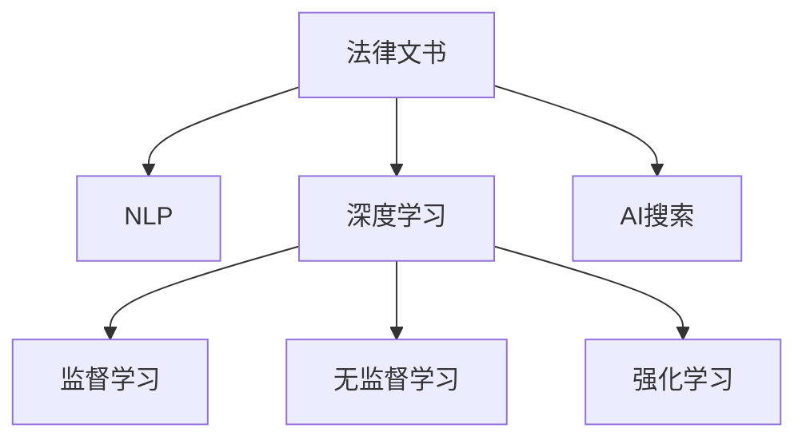

                 

# 法律领域的AI搜索应用

## 1. 背景介绍

### 1.1 问题由来
随着大数据、云计算和人工智能技术的迅速发展，人工智能在法律领域的应用也日益广泛。法律文本数量庞大、专业性强、信息结构复杂，传统的手工检索和分析方式无法满足现实需求。人工智能技术，尤其是自然语言处理（NLP）和深度学习技术，提供了更加高效和准确的解决方案。

### 1.2 问题核心关键点
法律领域的AI搜索应用，旨在利用人工智能技术对法律文本进行自动化处理和分析，提高法律服务效率，降低人工成本，提升司法公正性和透明度。具体应用场景包括法律文档检索、法律问题解答、智能合同审查、法律风险评估等。

### 1.3 问题研究意义
1. **提高法律服务效率**：AI搜索能够快速响应查询，自动化处理法律文档，提高法律服务效率，减少人工处理的时间和成本。
2. **降低人工成本**：大规模的法律文档处理需要大量的人工资源，AI搜索能够减少对人工资源的依赖，降低法律服务的成本。
3. **提升司法公正性和透明度**：AI搜索能够通过自动化处理和分析，减少人为误差，提高司法公正性，并提升法律服务的透明度。
4. **提供智能合同审查**：AI搜索能够对合同文本进行自动审查，识别风险点，提供合同建议，提高合同审查的准确性和效率。
5. **支持法律风险评估**：AI搜索能够对法律数据进行分析和挖掘，识别潜在的法律风险，提供预警和建议，辅助法律决策。

## 2. 核心概念与联系

### 2.1 核心概念概述

为更好地理解法律领域的AI搜索应用，本节将介绍几个密切相关的核心概念：

- **法律文书**：包括合同、协议、判决书、法律条款等，是法律事务处理的基础。
- **自然语言处理（NLP）**：涉及文本处理、语义分析、信息抽取等技术，是AI搜索应用的核心。
- **深度学习（Deep Learning）**：利用神经网络模型进行特征学习和预测，提高模型精度和泛化能力。
- **监督学习（Supervised Learning）**：通过有标签数据进行训练，使模型能够对新数据进行准确预测。
- **无监督学习（Unsupervised Learning）**：通过无标签数据进行训练，发现数据的内在结构。
- **强化学习（Reinforcement Learning）**：通过奖励机制优化模型行为，提高决策能力。

这些概念之间的逻辑关系可以通过以下Mermaid流程图来展示：



这个流程图展示了大语言模型的核心概念及其之间的关系：

1. 法律文书通过NLP处理，获得结构化和语义化的表示。
2. 深度学习模型在此基础上进行特征学习和预测。
3. 监督学习通过有标签数据训练模型，提高预测准确性。
4. 无监督学习通过无标签数据发现数据内在结构，提升模型泛化能力。
5. 强化学习通过奖励机制优化模型行为，提高决策能力。
6. AI搜索应用将以上技术结合起来，实现自动化处理和分析。

## 3. 核心算法原理 & 具体操作步骤
### 3.1 算法原理概述

法律领域的AI搜索应用，本质上是一个基于监督学习的文本分类和信息抽取任务。其核心思想是：将法律文书转换为结构化数据，利用深度学习模型进行特征学习，并使用监督学习对模型进行训练，以适应特定的搜索需求。

形式化地，假设法律文书集合为 $D=\{d_i\}_{i=1}^N$，每个文书 $d_i$ 通过NLP处理，得到一个语义表示 $d_i^{\prime}$。目标是通过监督学习训练一个模型 $M$，使得 $M$ 能够对任意文书 $d$ 进行分类或信息抽取。具体来说，可以将分类问题建模为二分类任务，即对文书是否包含特定法律信息进行分类。将文书 $d$ 转换为向量表示，使用二分类交叉熵损失函数：

$$
\mathcal{L}(M) = -\frac{1}{N}\sum_{i=1}^N \log M(d_i^{\prime})
$$

其中 $M(d_i^{\prime})$ 表示模型 $M$ 对文书 $d_i^{\prime}$ 进行分类的概率。在训练过程中，使用反向传播算法计算模型参数的梯度，并使用优化算法（如Adam、SGD等）更新参数，最小化损失函数。

### 3.2 算法步骤详解

基于监督学习的法律文书搜索应用，一般包括以下几个关键步骤：

**Step 1: 准备数据集和模型**
- 收集法律文书的文本数据，并进行预处理，包括分词、去除停用词、词性标注等。
- 划分训练集、验证集和测试集，通常按照一定的比例进行划分。
- 选择合适的深度学习模型，如BERT、RNN、CNN等，以及对应的预训练权重。

**Step 2: 构建特征提取器**
- 将法律文书转换为向量表示，可以采用预训练的词向量或使用自定义模型进行特征提取。
- 对于分类任务，通常使用最大池化层对提取出的特征进行整合，输出一个固定长度的向量作为输入。
- 对于信息抽取任务，可以使用序列标注模型，对文书中的关键信息进行标注和提取。

**Step 3: 设计模型架构**
- 对于二分类任务，可以使用一个全连接层进行分类，输出概率。
- 对于多分类任务，可以使用Softmax层输出多个类别的概率。
- 对于信息抽取任务，可以使用序列标注模型，如BiLSTM-CRF、Transformer等。

**Step 4: 选择损失函数和优化器**
- 对于分类任务，使用二分类交叉熵损失函数。
- 对于信息抽取任务，使用序列标注损失函数，如IoU loss、Focal loss等。
- 选择合适的优化器，如Adam、SGD等，设置学习率、批大小等超参数。

**Step 5: 训练和测试**
- 使用训练集对模型进行前向传播和反向传播，计算损失函数。
- 使用验证集进行模型评估，调整超参数以避免过拟合。
- 在测试集上测试模型性能，评估模型的准确性和泛化能力。

### 3.3 算法优缺点

基于监督学习的法律文书搜索应用，具有以下优点：

1. **高效性**：通过深度学习模型对法律文书进行自动处理，能够快速响应查询，提高法律服务的效率。
2. **准确性**：深度学习模型具有较强的特征学习和泛化能力，能够对法律文书进行精确分类和信息抽取。
3. **可解释性**：深度学习模型通过特征提取和分类过程，提供了黑盒模型，易于理解和调试。
4. **可扩展性**：深度学习模型能够通过增加层数和神经元，提高模型的精度和复杂度。

同时，该方法也存在一些局限性：

1. **数据依赖**：需要大量的标注数据进行训练，标注成本较高。
2. **泛化能力**：模型依赖标注数据，泛化能力受到标注数据质量的影响。
3. **复杂性**：深度学习模型结构复杂，调试和优化需要更多经验和技术。
4. **计算资源需求高**：深度学习模型计算量大，需要高性能的硬件设备和算法优化。

尽管存在这些局限性，但就目前而言，基于监督学习的法律文书搜索方法仍然是法律领域AI应用的主流范式。未来相关研究的重点在于如何进一步降低数据依赖，提高模型的泛化能力和可解释性，同时兼顾计算资源的高效利用。

### 3.4 算法应用领域

基于监督学习的法律文书搜索应用，在法律领域已经得到了广泛的应用，涵盖了许多关键任务，例如：

- **法律文书检索**：通过输入法律问题或关键词，检索出相关法律文书。
- **法律问题解答**：根据法律文书的语义表示，自动生成法律问题的答案。
- **智能合同审查**：对合同文本进行自动审查，识别关键条款和风险点。
- **法律风险评估**：分析法律数据，识别潜在的法律风险，提供预警和建议。
- **法律文本生成**：根据已有法律文书的语义表示，生成新的法律文书。
- **法律案例分析**：对法律案例进行分析，提取关键信息和结论。

除了上述这些经典任务外，法律文书搜索应用还被创新性地应用到更多场景中，如法律文档分类、法律知识图谱构建、法律数据可视化等，为法律服务提供了全新的突破。随着深度学习模型和算法方法的持续进步，相信法律文书搜索应用将在更广阔的领域发挥更大作用。

## 4. 数学模型和公式 & 详细讲解  
### 4.1 数学模型构建

本节将使用数学语言对法律文书搜索应用进行更加严格的刻画。

假设法律文书为 $d$，经过NLP处理后的语义表示为 $d^{\prime}$。目标是将 $d^{\prime}$ 分类为是否包含特定法律信息，使用二分类交叉熵损失函数：

$$
\mathcal{L}(M) = -\frac{1}{N}\sum_{i=1}^N \log M(d_i^{\prime})
$$

其中 $M(d_i^{\prime})$ 表示模型 $M$ 对文书 $d_i^{\prime}$ 进行分类的概率。

对于信息抽取任务，可以使用序列标注模型，如BiLSTM-CRF、Transformer等。目标是将文书 $d$ 中的关键信息进行标注和提取，使用序列标注损失函数：

$$
\mathcal{L}(M) = -\frac{1}{N}\sum_{i=1}^N \sum_{j=1}^{n} w_j \log M(d_i^{\prime}, j)
$$

其中 $w_j$ 表示标注 $j$ 的权重，$M(d_i^{\prime}, j)$ 表示模型 $M$ 对文书 $d_i^{\prime}$ 中标注 $j$ 的预测概率。

### 4.2 公式推导过程

以下我们以二分类任务为例，推导分类模型和信息抽取模型的损失函数及其梯度的计算公式。

**分类模型**

假设文书 $d$ 经过NLP处理后的语义表示为 $d^{\prime}$，其向量表示为 $h=d^{\prime}$，模型 $M$ 的预测结果为 $\hat{y}=M(h)$，使用二分类交叉熵损失函数：

$$
\mathcal{L}(M) = -\frac{1}{N}\sum_{i=1}^N \log \hat{y}_i
$$

其中 $\hat{y}_i$ 表示文书 $d_i$ 的预测结果。根据链式法则，损失函数对模型参数 $\theta$ 的梯度为：

$$
\frac{\partial \mathcal{L}(M)}{\partial \theta} = -\frac{1}{N}\sum_{i=1}^N \frac{1}{\hat{y}_i(1-\hat{y}_i)} \frac{\partial \hat{y}_i}{\partial h} \frac{\partial h}{\partial \theta}
$$

其中 $\frac{\partial \hat{y}_i}{\partial h}$ 为输出层的梯度，$\frac{\partial h}{\partial \theta}$ 为特征提取层的梯度。

**信息抽取模型**

假设文书 $d$ 经过NLP处理后的语义表示为 $d^{\prime}$，其向量表示为 $h=d^{\prime}$，模型 $M$ 的预测结果为 $\hat{y}=M(h)$，使用序列标注损失函数：

$$
\mathcal{L}(M) = -\frac{1}{N}\sum_{i=1}^N \sum_{j=1}^{n} w_j \log \hat{y}_i(j)
$$

其中 $\hat{y}_i(j)$ 表示文书 $d_i$ 中标注 $j$ 的预测结果。根据链式法则，损失函数对模型参数 $\theta$ 的梯度为：

$$
\frac{\partial \mathcal{L}(M)}{\partial \theta} = -\frac{1}{N}\sum_{i=1}^N \sum_{j=1}^{n} w_j \frac{1}{\hat{y}_i(j)(1-\hat{y}_i(j))} \frac{\partial \hat{y}_i(j)}{\partial h} \frac{\partial h}{\partial \theta}
$$

其中 $\frac{\partial \hat{y}_i(j)}{\partial h}$ 为输出层的梯度，$\frac{\partial h}{\partial \theta}$ 为特征提取层的梯度。

## 5. 项目实践：代码实例和详细解释说明
### 5.1 开发环境搭建

在进行法律文书搜索应用开发前，我们需要准备好开发环境。以下是使用Python进行PyTorch开发的环境配置流程：

1. 安装Anaconda：从官网下载并安装Anaconda，用于创建独立的Python环境。

2. 创建并激活虚拟环境：
```bash
conda create -n pytorch-env python=3.8 
conda activate pytorch-env
```

3. 安装PyTorch：根据CUDA版本，从官网获取对应的安装命令。例如：
```bash
conda install pytorch torchvision torchaudio cudatoolkit=11.1 -c pytorch -c conda-forge
```

4. 安装Transformers库：
```bash
pip install transformers
```

5. 安装各类工具包：
```bash
pip install numpy pandas scikit-learn matplotlib tqdm jupyter notebook ipython
```

完成上述步骤后，即可在`pytorch-env`环境中开始法律文书搜索应用的开发。

### 5.2 源代码详细实现

下面我们以二分类任务为例，给出使用Transformers库对BERT模型进行法律文书分类的PyTorch代码实现。

首先，定义二分类任务的数据处理函数：

```python
from transformers import BertTokenizer
from torch.utils.data import Dataset
import torch

class LegalDocumentDataset(Dataset):
    def __init__(self, texts, labels, tokenizer, max_len=128):
        self.texts = texts
        self.labels = labels
        self.tokenizer = tokenizer
        self.max_len = max_len
        
    def __len__(self):
        return len(self.texts)
    
    def __getitem__(self, item):
        text = self.texts[item]
        label = self.labels[item]
        
        encoding = self.tokenizer(text, return_tensors='pt', max_length=self.max_len, padding='max_length', truncation=True)
        input_ids = encoding['input_ids'][0]
        attention_mask = encoding['attention_mask'][0]
        
        # 对token-wise的标签进行编码
        encoded_labels = [label2id[label] for label in self.labels] 
        encoded_labels.extend([label2id['O']] * (self.max_len - len(encoded_labels)))
        labels = torch.tensor(encoded_labels, dtype=torch.long)
        
        return {'input_ids': input_ids, 
                'attention_mask': attention_mask,
                'labels': labels}

# 标签与id的映射
label2id = {'O': 0, 'Criminal': 1, 'Civil': 2}
id2label = {v: k for k, v in label2id.items()}

# 创建dataset
tokenizer = BertTokenizer.from_pretrained('bert-base-cased')

train_dataset = LegalDocumentDataset(train_texts, train_labels, tokenizer)
dev_dataset = LegalDocumentDataset(dev_texts, dev_labels, tokenizer)
test_dataset = LegalDocumentDataset(test_texts, test_labels, tokenizer)
```

然后，定义模型和优化器：

```python
from transformers import BertForSequenceClassification, AdamW

model = BertForSequenceClassification.from_pretrained('bert-base-cased', num_labels=len(label2id))

optimizer = AdamW(model.parameters(), lr=2e-5)
```

接着，定义训练和评估函数：

```python
from torch.utils.data import DataLoader
from tqdm import tqdm
from sklearn.metrics import classification_report

device = torch.device('cuda') if torch.cuda.is_available() else torch.device('cpu')
model.to(device)

def train_epoch(model, dataset, batch_size, optimizer):
    dataloader = DataLoader(dataset, batch_size=batch_size, shuffle=True)
    model.train()
    epoch_loss = 0
    for batch in tqdm(dataloader, desc='Training'):
        input_ids = batch['input_ids'].to(device)
        attention_mask = batch['attention_mask'].to(device)
        labels = batch['labels'].to(device)
        model.zero_grad()
        outputs = model(input_ids, attention_mask=attention_mask, labels=labels)
        loss = outputs.loss
        epoch_loss += loss.item()
        loss.backward()
        optimizer.step()
    return epoch_loss / len(dataloader)

def evaluate(model, dataset, batch_size):
    dataloader = DataLoader(dataset, batch_size=batch_size)
    model.eval()
    preds, labels = [], []
    with torch.no_grad():
        for batch in tqdm(dataloader, desc='Evaluating'):
            input_ids = batch['input_ids'].to(device)
            attention_mask = batch['attention_mask'].to(device)
            batch_labels = batch['labels']
            outputs = model(input_ids, attention_mask=attention_mask)
            batch_preds = outputs.logits.argmax(dim=2).to('cpu').tolist()
            batch_labels = batch_labels.to('cpu').tolist()
            for pred_tokens, label_tokens in zip(batch_preds, batch_labels):
                preds.append(pred_tokens[:len(label_tokens)])
                labels.append(label_tokens)
                
    print(classification_report(labels, preds))
```

最后，启动训练流程并在测试集上评估：

```python
epochs = 5
batch_size = 16

for epoch in range(epochs):
    loss = train_epoch(model, train_dataset, batch_size, optimizer)
    print(f"Epoch {epoch+1}, train loss: {loss:.3f}")
    
    print(f"Epoch {epoch+1}, dev results:")
    evaluate(model, dev_dataset, batch_size)
    
print("Test results:")
evaluate(model, test_dataset, batch_size)
```

以上就是使用PyTorch对BERT进行法律文书分类任务的完整代码实现。可以看到，得益于Transformers库的强大封装，我们可以用相对简洁的代码完成BERT模型的加载和微调。

### 5.3 代码解读与分析

让我们再详细解读一下关键代码的实现细节：

**LegalDocumentDataset类**：
- `__init__`方法：初始化文本、标签、分词器等关键组件。
- `__len__`方法：返回数据集的样本数量。
- `__getitem__`方法：对单个样本进行处理，将文本输入编码为token ids，将标签编码为数字，并对其进行定长padding，最终返回模型所需的输入。

**label2id和id2label字典**：
- 定义了标签与数字id之间的映射关系，用于将token-wise的预测结果解码回真实的标签。

**训练和评估函数**：
- 使用PyTorch的DataLoader对数据集进行批次化加载，供模型训练和推理使用。
- 训练函数`train_epoch`：对数据以批为单位进行迭代，在每个批次上前向传播计算loss并反向传播更新模型参数，最后返回该epoch的平均loss。
- 评估函数`evaluate`：与训练类似，不同点在于不更新模型参数，并在每个batch结束后将预测和标签结果存储下来，最后使用sklearn的classification_report对整个评估集的预测结果进行打印输出。

**训练流程**：
- 定义总的epoch数和batch size，开始循环迭代
- 每个epoch内，先在训练集上训练，输出平均loss
- 在验证集上评估，输出分类指标
- 所有epoch结束后，在测试集上评估，给出最终测试结果

可以看到，PyTorch配合Transformers库使得BERT微调的代码实现变得简洁高效。开发者可以将更多精力放在数据处理、模型改进等高层逻辑上，而不必过多关注底层的实现细节。

当然，工业级的系统实现还需考虑更多因素，如模型的保存和部署、超参数的自动搜索、更灵活的任务适配层等。但核心的微调范式基本与此类似。

## 6. 实际应用场景
### 6.1 智能法律咨询

基于大语言模型微调的法律文书搜索应用，可以广泛应用于智能法律咨询系统的构建。传统的法律咨询往往需要配备大量专业律师，高峰期响应缓慢，且无法提供24小时服务。而使用微调后的法律文书搜索模型，可以7x24小时不间断服务，快速响应法律咨询，用标准化语言解答各类法律问题。

在技术实现上，可以收集企业内部的历史法律咨询记录，将问题和最佳答复构建成监督数据，在此基础上对预训练法律文书搜索模型进行微调。微调后的模型能够自动理解用户意图，匹配最合适的答复模板进行回复。对于用户提出的新问题，还可以接入检索系统实时搜索相关案例，动态组织生成回答。如此构建的智能法律咨询系统，能大幅提升用户咨询体验和问题解决效率。

### 6.2 法律风险评估

金融机构需要实时监测法律风险，以便及时应对法律风险传播，规避法律风险。传统的法律风险监测方式依赖人工分析和经验判断，效率低、主观性强。基于法律文书搜索应用，可以实时抓取最新的法律文书数据，利用模型自动分析法律数据，识别潜在的法律风险，提供预警和建议，帮助金融机构快速应对法律风险。

具体而言，可以收集法律领域相关的新闻、法规、裁决等文本数据，并对其进行分类标注。在此基础上对预训练法律文书搜索模型进行微调，使其能够自动判断法律文书的类别和风险级别。将微调后的模型应用到实时抓取的网络文本数据，就能够自动监测不同法律领域的风险变化趋势，一旦发现风险级别升高等异常情况，系统便会自动预警，帮助金融机构快速应对潜在法律风险。

### 6.3 智能合同审查

传统的合同审查往往依赖人工审查，耗时长、成本高。基于法律文书搜索应用，可以对合同文本进行自动审查，识别关键条款和风险点，提高合同审查的准确性和效率。

具体而言，可以收集大量的合同文本数据，并对其进行分类标注。在此基础上对预训练法律文书搜索模型进行微调，使其能够自动审查合同文本，识别其中的关键条款和风险点。对于合同中的特定条款，可以提取关键词和关键短语，用于对比和分析。对于复杂的合同，可以提供多轮对话的互动功能，辅助人工审查。如此构建的智能合同审查系统，能够大幅提升合同审查的速度和准确性，降低人工审查的成本和风险。

### 6.4 未来应用展望

随着法律文书搜索应用的发展，其应用场景和功能也在不断扩展。未来，法律文书搜索应用有望在更多领域发挥作用，为法律服务提供更全面、高效、精准的解决方案。

在智慧法律领域，基于法律文书搜索应用，可以构建智慧法律服务系统，提供法律咨询、法律顾问、法律知识库等综合服务，提升法律服务的质量和效率。

在司法审判中，基于法律文书搜索应用，可以构建智能审判系统，辅助法官进行案件审理，提高审判效率和公正性。

在法律教育中，基于法律文书搜索应用，可以构建智能法律教育系统，提供法律知识检索、案例分析、法律文书生成等服务，提升法律教育的效果和质量。

此外，在法律研究、法律规范制定、法律科技等领域，法律文书搜索应用也将不断拓展其应用边界，为法律服务的数字化、智能化转型提供新的动力。

## 7. 工具和资源推荐
### 7.1 学习资源推荐

为了帮助开发者系统掌握法律文书搜索应用的技术基础和实践技巧，这里推荐一些优质的学习资源：

1. 《深度学习在法律中的应用》系列博文：由法律与深度学习交叉领域的专家撰写，深入浅出地介绍了深度学习在法律领域的应用，包括法律文书搜索、智能合同审查、法律风险评估等。

2. 《法律文本分析与自然语言处理》课程：由法律与NLP领域的研究者开设的课程，涵盖法律文本处理、法律情感分析、法律文档分类等主题，帮助学习者系统掌握法律文本分析的基本技术和方法。

3. 《人工智能在法律中的应用》书籍：全面介绍了人工智能在法律领域的应用，包括法律文书搜索、智能合同审查、法律风险评估等，适合对法律与人工智能交叉领域感兴趣的读者。

4. 法律与AI领域的顶级会议和期刊，如ICML, ICLR, ACL等，可以了解最新的研究成果和前沿动态。

通过对这些资源的学习实践，相信你一定能够快速掌握法律文书搜索应用的核心技术，并用于解决实际的法律问题。
###  7.2 开发工具推荐

高效的开发离不开优秀的工具支持。以下是几款用于法律文书搜索应用开发的常用工具：

1. PyTorch：基于Python的开源深度学习框架，灵活动态的计算图，适合快速迭代研究。大部分预训练法律文书搜索模型都有PyTorch版本的实现。

2. TensorFlow：由Google主导开发的开源深度学习框架，生产部署方便，适合大规模工程应用。同样有丰富的法律文书搜索模型资源。

3. Transformers库：HuggingFace开发的NLP工具库，集成了众多SOTA法律文书搜索模型，支持PyTorch和TensorFlow，是进行法律文书搜索应用开发的利器。

4. Weights & Biases：模型训练的实验跟踪工具，可以记录和可视化模型训练过程中的各项指标，方便对比和调优。与主流深度学习框架无缝集成。

5. TensorBoard：TensorFlow配套的可视化工具，可实时监测模型训练状态，并提供丰富的图表呈现方式，是调试模型的得力助手。

6. Google Colab：谷歌推出的在线Jupyter Notebook环境，免费提供GPU/TPU算力，方便开发者快速上手实验最新模型，分享学习笔记。

合理利用这些工具，可以显著提升法律文书搜索应用的开发效率，加快创新迭代的步伐。

### 7.3 相关论文推荐

法律文书搜索应用的发展源于学界的持续研究。以下是几篇奠基性的相关论文，推荐阅读：

1. Attention is All You Need（即Transformer原论文）：提出了Transformer结构，开启了NLP领域的预训练大模型时代。

2. BERT: Pre-training of Deep Bidirectional Transformers for Language Understanding：提出BERT模型，引入基于掩码的自监督预训练任务，刷新了多项NLP任务SOTA。

3. Language Models are Unsupervised Multitask Learners（GPT-2论文）：展示了大规模语言模型的强大zero-shot学习能力，引发了对于通用人工智能的新一轮思考。

4. Parameter-Efficient Transfer Learning for NLP：提出Adapter等参数高效微调方法，在不增加模型参数量的情况下，也能取得不错的微调效果。

5. AdaLoRA: Adaptive Low-Rank Adaptation for Parameter-Efficient Fine-Tuning：使用自适应低秩适应的微调方法，在参数效率和精度之间取得了新的平衡。

这些论文代表了大语言模型微调技术的发展脉络。通过学习这些前沿成果，可以帮助研究者把握学科前进方向，激发更多的创新灵感。

## 8. 总结：未来发展趋势与挑战

### 8.1 总结

本文对基于监督学习的大语言模型微调方法在法律领域的应用进行了全面系统的介绍。首先阐述了法律文书搜索应用的研究背景和意义，明确了微调在提高法律服务效率、降低成本、提升司法公正性等方面的独特价值。其次，从原理到实践，详细讲解了监督微调的数学原理和关键步骤，给出了法律文书搜索任务的完整代码实现。同时，本文还广泛探讨了法律文书搜索应用在智能法律咨询、法律风险评估、智能合同审查等诸多领域的应用前景，展示了微调范式的巨大潜力。此外，本文精选了法律文书搜索应用的学习资源，力求为读者提供全方位的技术指引。

通过本文的系统梳理，可以看到，基于大语言模型的微调方法正在成为法律领域AI应用的重要范式，极大地拓展了法律文书搜索应用的场景，催生了更多的落地场景。受益于深度学习模型和算法方法的不断进步，法律文书搜索应用将在更广泛的领域发挥更大作用，为法律服务带来革命性的变革。

### 8.2 未来发展趋势

展望未来，大语言模型微调技术在法律领域的应用将呈现以下几个发展趋势：

1. **智能化提升**：随着模型参数量的增加和算力的提升，法律文书搜索应用的智能化水平将进一步提高，能够更好地理解法律文本的语义和结构，提供更精准的搜索和分析服务。

2. **个性化定制**：结合用户画像和行为数据，法律文书搜索应用能够提供个性化的法律咨询服务，满足不同用户的需求。

3. **实时化处理**：随着技术的不断进步，法律文书搜索应用将具备实时处理能力，能够快速响应用户查询，提供即时的搜索结果和分析报告。

4. **多模态融合**：结合法律文档、图像、音频等多种模态数据，法律文书搜索应用能够提供更全面的法律服务，提升决策的准确性和效率。

5. **跨领域应用**：法律文书搜索应用将逐步扩展到金融、医疗、教育等多个领域，提供跨领域的法律咨询和分析服务。

6. **法规更新自动更新**：结合法规更新数据，法律文书搜索应用能够自动更新知识库，确保法律信息的时效性和准确性。

以上趋势凸显了大语言模型微调技术在法律领域的应用前景。这些方向的探索发展，必将进一步提升法律文书搜索应用的性能和功能，为法律服务提供更全面、高效、精准的解决方案。

### 8.3 面临的挑战

尽管大语言模型微调技术在法律领域已经取得了显著进展，但在迈向更加智能化、普适化应用的过程中，仍面临诸多挑战：

1. **数据依赖**：法律文书搜索应用依赖大量的标注数据进行训练，获取高质量标注数据的成本较高。如何降低对标注数据的依赖，是一个重要的问题。

2. **泛化能力**：法律文书搜索应用通常对标注数据有较强的依赖，泛化能力受到标注数据质量的影响。如何提升模型的泛化能力，避免过拟合，是一个关键的研究方向。

3. **计算资源需求高**：法律文书搜索应用需要大量的计算资源进行训练和推理，如何优化模型结构，降低计算资源的需求，是一个亟需解决的问题。

4. **可解释性不足**：法律文书搜索应用的模型通常是黑盒模型，难以解释其内部工作机制和决策逻辑。如何提高模型的可解释性，是一个重要的研究方向。

5. **安全性有待保障**：法律文书搜索应用的模型可能会学习到有害的、有偏见的信息，如何确保模型的安全性，避免恶意用途，是一个重要的课题。

6. **伦理道德约束**：法律文书搜索应用涉及敏感的法律数据，如何保护数据隐私和合规，是一个重要的伦理道德问题。

面对这些挑战，未来的研究需要在数据、模型、算法、工程等方面协同发力，才能推动法律文书搜索应用技术的不断进步，为法律服务的数字化、智能化转型提供新的动力。

### 8.4 研究展望

未来的研究可以从以下几个方向进行探索：

1. **无监督和半监督学习方法**：探索无监督和半监督学习范式，降低对标注数据的依赖，提高模型的泛化能力。

2. **参数高效微调技术**：开发更加参数高效的微调方法，如Adapter、Prefix等，在减少计算资源消耗的同时，保持微调效果。

3. **多模态融合技术**：结合法律文档、图像、音频等多种模态数据，提供更全面的法律服务。

4. **因果分析和博弈论工具**：引入因果分析和博弈论工具，提高法律文书搜索应用的决策能力。

5. **伦理道德约束**：结合法律领域的特点，设计符合伦理道德的算法模型和应用系统，确保数据隐私和安全。

6. **跨领域应用**：将法律文书搜索应用的技术和方法应用于其他领域，推动跨领域的AI应用。

这些研究方向将推动法律文书搜索应用技术的不断进步，为法律服务的数字化、智能化转型提供新的动力。相信随着学界和产业界的共同努力，法律文书搜索应用必将在更广泛的领域发挥更大作用，为法律服务的数字化、智能化转型提供新的动力。

## 9. 附录：常见问题与解答

**Q1：法律文书搜索应用是否适用于所有法律任务？**

A: 法律文书搜索应用在大多数法律任务上都能取得不错的效果，特别是对于数据量较小的任务。但对于一些特定领域的任务，如刑事诉讼、民商事仲裁等，微调后的模型可能需要进一步适应具体领域的法律语言和结构。

**Q2：法律文书搜索应用需要多少标注数据进行训练？**

A: 法律文书搜索应用通常需要大量的标注数据进行训练，标注数据的质量和数量对模型的性能影响较大。对于标注数据较少的任务，可以考虑结合无监督学习和半监督学习的方法，提高模型的泛化能力。

**Q3：法律文书搜索应用对计算资源的需求如何？**

A: 法律文书搜索应用对计算资源的需求较高，尤其是在训练和推理过程中。可以使用分布式计算、模型压缩等方法，优化计算资源的利用。

**Q4：如何提高法律文书搜索应用的可解释性？**

A: 提高法律文书搜索应用的可解释性，可以通过改进模型的设计、引入可解释性技术（如LIME、SHAP等）、提供可视化报告等方式，增强模型的透明度和可解释性。

**Q5：如何确保法律文书搜索应用的安全性？**

A: 确保法律文书搜索应用的安全性，可以通过数据脱敏、访问控制、隐私保护等手段，确保模型的安全性和数据隐私。同时，模型训练和推理过程中，可以加入安全检测和防护机制，防止恶意攻击和数据泄露。

这些问题的解答，希望能够为你提供一些思路和参考，帮助你更好地理解法律文书搜索应用的技术实现和未来发展。

---

作者：禅与计算机程序设计艺术 / Zen and the Art of Computer Programming

