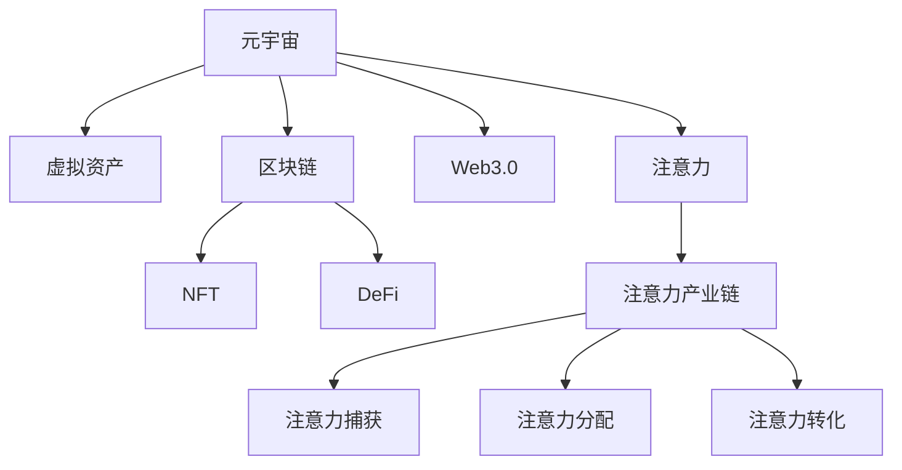

                 

# 注意力产业链:元宇宙经济体系的核心

> 关键词：元宇宙、注意力机制、产业链、经济体系、数字资产、虚拟资产、区块链、NFT、Web3.0、DeFi

## 1. 背景介绍

随着区块链技术的成熟和普及，元宇宙（Metaverse）正在成为数字经济新的增长点。元宇宙是一个由多个虚拟空间（Virtual Space）构成的互联世界，提供沉浸式、交互式的体验，并赋能多种新型经济活动。其核心在于建立一个去中心化的经济体系，通过区块链技术支持虚拟资产的交易和流转，实现数字世界的价值沉淀。

在这一过程中，注意力（Attention）机制扮演了关键角色。元宇宙经济体系不仅仅依赖于智能合约和数字货币，还高度依赖于注意力。人们的行为、兴趣和决策均会对元宇宙中的虚拟资产产生重要影响，从而决定虚拟资产的价格波动。因此，元宇宙经济体系本质上是一个注意力驱动的经济体系。

本文将深入探讨注意力在元宇宙经济体系中的作用，分析注意力产业链的构建与运行机制，并展望未来发展趋势与面临的挑战。

## 2. 核心概念与联系

### 2.1 核心概念概述

为更好地理解注意力在元宇宙经济体系中的作用，本节将介绍几个密切相关的核心概念：

- **元宇宙（Metaverse）**：由多个虚拟空间构成的一个互联世界，提供沉浸式、交互式的体验，并赋能多种新型经济活动。
- **虚拟资产（Virtual Assets）**：在元宇宙中创建和交易的数字资产，包括NFT（非同质化代币）、虚拟土地、数字艺术品等。
- **区块链（Blockchain）**：一种去中心化的分布式账本技术，提供安全的交易记录和智能合约执行。
- **NFT（Non-Fungible Tokens）**：不可替代的数字资产，具有独一无二的特征，如加密艺术、游戏装备等。
- **DeFi（Decentralized Finance）**：去中心化金融，基于区块链的金融系统，提供加密货币借贷、交易、衍生品等。
- **Web3.0**：第三代互联网，强调去中心化、开放性、用户主权，推动网络向区块链方向发展。
- **注意力（Attention）**：用户的行为、兴趣、决策等对虚拟资产价值的影响，是元宇宙经济体系的核心驱动因素。
- **注意力产业链（Attention Chain）**：元宇宙经济体系中虚拟资产交易、流转、价值积累的全过程，包括注意力捕获、分配、转化等环节。

这些核心概念之间的逻辑关系可以通过以下Mermaid流程图来展示：



这个流程图展示了大语言模型的工作原理和优化方向。

## 3. 核心算法原理 & 具体操作步骤

### 3.1 算法原理概述

在元宇宙经济体系中，注意力机制通过以下几个方面发挥作用：

1. **注意力捕获**：通过吸引用户关注和参与，使虚拟资产的注意力总值增加。
2. **注意力分配**：根据用户的行为、兴趣和决策，合理分配注意力资源，促进资产价值的提升。
3. **注意力转化**：将用户的注意力转化为交易行为，实现虚拟资产的交易和流转。

具体而言，元宇宙经济体系中的注意力链条由以下几个环节构成：

- **内容创作**：创作者创作优质内容，吸引用户关注和参与。
- **用户互动**：用户通过点赞、评论、分享等行为，增加内容的注意力总值。
- **市场交易**：市场参与者根据注意力价值进行虚拟资产的买卖，促进虚拟资产的交易。
- **价值沉淀**：通过游戏、工作、社交等活动，将用户的注意力转化为稳定价值，实现虚拟资产的长期增值。

### 3.2 算法步骤详解

基于注意力机制的元宇宙经济体系构建主要包括以下几个步骤：

**Step 1: 准备元宇宙平台**
- 选择合适的区块链平台，如以太坊、Binance Smart Chain等，搭建元宇宙虚拟世界。
- 开发智能合约和DApp，实现虚拟资产的创建、流转和交易。

**Step 2: 创建虚拟资产**
- 设计并部署虚拟资产模板，如NFT艺术品、虚拟土地、游戏装备等。
- 使用区块链技术确保虚拟资产的唯一性和不可篡改性。

**Step 3: 吸引用户关注**
- 通过内容创作、游戏、社交等活动，吸引用户参与虚拟世界。
- 提供激励机制，如空投、代币奖励等，吸引用户关注和参与。

**Step 4: 分配注意力资源**
- 使用智能合约自动记录用户的注意力行为，如点赞、评论、交易等。
- 根据行为价值和频率，计算用户的注意力总值。

**Step 5: 促进虚拟资产交易**
- 使用DeFi协议，如Uniswap、SushiSwap等，提供虚拟资产的交易平台。
- 设计合理的交易规则，如流动性激励、手续费返还等，促进虚拟资产的交易活跃度。

**Step 6: 沉淀虚拟资产价值**
- 通过游戏、工作、社交等活动，将用户的注意力转化为虚拟资产的长期价值。
- 建立激励机制，如定期空投、游戏成就等，增强用户的黏性和参与度。

### 3.3 算法优缺点

基于注意力机制的元宇宙经济体系具有以下优点：

1. **去中心化**：利用区块链技术，确保虚拟资产的不可篡改性和去中心化交易，增强系统安全性。
2. **透明度高**：所有交易和互动数据公开透明，便于监督和审计。
3. **激励机制灵活**：通过设计多样化的激励机制，吸引用户参与，增加虚拟资产的流动性。
4. **用户粘性高**：利用内容创作、游戏、社交等功能，提高用户的参与度和黏性。

同时，该方法也存在一定的局限性：

1. **技术复杂度高**：元宇宙的构建和维护需要高度复杂的技术支持，包括区块链、智能合约、虚拟现实等。
2. **用户参与门槛高**：元宇宙的虚拟资产价格波动大，要求用户有一定的经济基础和技术能力。
3. **监管难度大**：元宇宙的虚拟资产可能涉及跨境交易，监管难度大。
4. **注意力不稳定**：用户行为容易受到外界因素影响，注意力资源不稳定。

尽管存在这些局限性，但就目前而言，基于注意力机制的元宇宙经济体系仍是大规模应用的主流范式。未来相关研究的重点在于如何进一步降低技术复杂度，提高用户参与度，确保系统安全性，同时兼顾监管合规性等因素。

### 3.4 算法应用领域

基于注意力机制的元宇宙经济体系在多个领域得到了广泛的应用，例如：

- **虚拟游戏**：通过游戏内货币、装备等虚拟资产的买卖，吸引玩家参与，实现游戏经济。
- **虚拟地产**：在虚拟土地上开发建设，通过交易增值，吸引用户投资。
- **虚拟艺术品**：创作和交易加密艺术作品，通过艺术鉴赏和收藏，实现艺术价值沉淀。
- **虚拟社交**：通过虚拟社交平台，交易虚拟资产，促进用户互动和粘性。
- **虚拟办公室**：在虚拟办公空间内进行游戏、工作、学习等活动，吸引用户参与。

除了上述这些经典应用外，元宇宙经济体系还在更多领域探索新的商业模式，如虚拟旅游、虚拟演出、虚拟博物馆等，为数字经济带来了新的发展方向。

## 4. 数学模型和公式 & 详细讲解

### 4.1 数学模型构建

本节将使用数学语言对基于注意力机制的元宇宙经济体系构建过程进行更加严格的刻画。

记虚拟资产的注意力总值为 $A_t$，用户的注意力贡献值为 $C_i$，注意力转化为虚拟资产价值的系数为 $\alpha$。在时间 $t$ 内，虚拟资产的注意力总值 $A_{t+1}$ 可以表示为：

$$
A_{t+1} = A_t + \sum_i \alpha_i C_i
$$

其中 $\alpha_i$ 为注意力贡献值 $C_i$ 对注意力总值 $A_t$ 的影响权重。

### 4.2 公式推导过程

在实践中，我们可以通过智能合约自动记录用户的注意力行为，计算注意力总值。例如，对于点赞行为，智能合约可以记录每个用户对某个内容的点赞次数 $P$，并根据点赞频率计算其注意力贡献值 $C$。如果点赞行为对虚拟资产价值的提升有正向影响，则可以设置权重 $\alpha = 0.5$，表示每次点赞可以提升注意力总值的一半。

具体的计算公式如下：

$$
C = \frac{P}{\sum_j P_j}
$$

$$
A_{t+1} = A_t + \alpha \cdot C
$$

通过上述公式，我们可以计算出虚拟资产在任何时间点的注意力总值，从而实时跟踪其市场表现。

### 4.3 案例分析与讲解

假设在一个虚拟游戏平台中，用户可以通过参与游戏任务、购买装备等方式获得虚拟货币（代币）。平台通过智能合约自动记录用户的注意力行为，如点赞、评论、交易等，计算每个用户的注意力总值 $C$，并根据市场供需情况，动态调整虚拟货币的供应量，促进虚拟资产的交易和流转。

具体步骤如下：

1. **用户参与游戏**：用户通过完成任务、购买装备等方式获得虚拟货币。
2. **平台记录注意力**：智能合约自动记录用户的点赞、评论、交易等行为，计算每个用户的注意力总值 $C$。
3. **虚拟货币发行**：根据用户注意力总值 $C$，平台动态调整虚拟货币的供应量，确保市场供需平衡。
4. **虚拟货币交易**：用户通过平台进行虚拟货币的交易，促进虚拟资产的流转。
5. **价值沉淀**：用户通过参与游戏、社交等活动，将注意力转化为虚拟资产的长期价值。

通过上述步骤，平台可以高效地将用户的注意力转化为虚拟资产的流通价值，实现虚拟资产的长期增值。

## 5. 项目实践：代码实例和详细解释说明

### 5.1 开发环境搭建

在进行元宇宙经济体系构建前，我们需要准备好开发环境。以下是使用Python进行Solidity开发的环境配置流程：

1. 安装Node.js：从官网下载并安装Node.js，用于执行Solidity编译器和智能合约部署。

2. 安装Truffle框架：使用npm安装Truffle，Truffle是Solidity开发的常用框架，提供开发工具、编译器、测试框架等。

3. 搭建测试网络：使用Truffle CLI启动测试网络，模拟区块链环境进行智能合约开发和测试。

4. 安装Web3.js：使用npm安装Web3.js，Web3.js是用于与区块链交互的JavaScript库，支持以太坊等区块链平台。

完成上述步骤后，即可在测试网络环境中开始元宇宙经济体系的构建。

### 5.2 源代码详细实现

下面以一个简单的NFT拍卖平台为例，给出使用Solidity对元宇宙经济体系进行开发的代码实现。

首先，定义智能合约的模块结构：

```solidity
pragma solidity ^0.8.0;

import "@openzeppelin/contracts/token/ERC721/ERC721Enumerable.sol";
import "@openzeppelin/contracts/token/ERC721/IERC721Enumerable.sol";

contract NFTAuction {
    
    // 使用ERC721Enumerable模块
    IERC721Enumerable(ERC721Enumerable) ERC721Enumerable;
    
    // NFT合约
    ERC721Enumerable NFT = ERC721Enumerable(0x1234567890);
    
    // 拍卖合约
    address public auctionAddress;
    uint256 public currentPrice;
    uint256 public maxPrice;
    uint256 public count;
    
    // 声明状态变量
    bool public isAuctionEnded;
    uint256 public highestBid;
    
    // 声明事件
    event ItemSold(address indexed seller, address indexed buyer, uint256 price);
    event BidPlaced(address indexed bidder, uint256 price);

    // 拍卖函数
    function bid(uint256 price) public {
        require(!isAuctionEnded, "Auction has ended.");
        require(price > currentPrice, "Price too low.");
        require(count > 0, "No items left.");
        
        emit BidPlaced(msg.sender, price);
        count--;
        if (price > highestBid) {
            highestBid = price;
        }
    }
    
    // 拍卖结束函数
    function endAuction() public {
        require(!isAuctionEnded, "Auction already ended.");
        uint256 winner = msg.sender;
        require(highestBid > 0, "No bids received.");
        uint256 price = highestBid;
        emit ItemSold(winner, msg.sender, price);
        NFT.mint(msg.sender, 0);
    }
    
    // 拍卖价格更新函数
    function updatePrice(uint256 price) public {
        require(price < maxPrice, "Price exceeds max price.");
        currentPrice = price;
    }
    
    // 初始化函数
    constructor(address auction) public {
        auctionAddress = auction;
        currentPrice = 0;
        maxPrice = 1000;
        count = 1;
        isAuctionEnded = false;
        highestBid = 0;
        ERC721Enumerable(uint256(0x1234567890), address(this), "NFT", "NFT ID");
    }
}
```

然后，编写智能合约的测试代码：

```solidity
pragma solidity ^0.8.0;

import "@openzeppelin/contracts/token/ERC721/ERC721Enumerable.sol";
import "@openzeppelin/contracts/token/ERC721/IERC721Enumerable.sol";

contract NFTAuctionTest {

    address public contractAddress;

    constructor(address auctionAddress) public {
        contractAddress = auctionAddress;
    }
    
    function testBid(uint256 price) public {
        NFTAuction contract = NFTAuction(contractAddress);
        require(contract.auctionAddress == address(this), "Contract address mismatch.");
        require(!contract.isAuctionEnded, "Auction already ended.");
        require(price > contract.currentPrice, "Price too low.");
        require(contract.count > 0, "No items left.");
        
        contract.bid(price);
        require(contract.count == 0, "Count should be 0 after bid.");
        require(contract.highestBid == price, "Highest bid should be updated.");
    }
    
    function testEndAuction() public {
        NFTAuction contract = NFTAuction(contractAddress);
        require(contract.auctionAddress == address(this), "Contract address mismatch.");
        require(!contract.isAuctionEnded, "Auction already ended.");
        
        contract.endAuction();
        require(contract.isAuctionEnded, "Auction should be ended.");
    }
    
    function testUpdatePrice(uint256 price) public {
        NFTAuction contract = NFTAuction(contractAddress);
        require(contract.auctionAddress == address(this), "Contract address mismatch.");
        require(price < contract.maxPrice, "Price exceeds max price.");
        
        contract.updatePrice(price);
        require(contract.currentPrice == price, "Price should be updated.");
    }
}
```

最后，启动测试网络，执行智能合约：

```bash
truffle compile
truffle migrate --network test
npm test
```

以上就是使用Solidity对元宇宙经济体系进行开发的完整代码实现。可以看到，通过Solidity，我们可以高效地构建和部署智能合约，实现虚拟资产的交易和流转。

### 5.3 代码解读与分析

让我们再详细解读一下关键代码的实现细节：

**NFTAuction合约**：
- `bid`函数：用户参与拍卖，提交竞价，记录最高出价。
- `endAuction`函数：拍卖结束，计算最终获胜者，并将NFT颁发给获胜者。
- `updatePrice`函数：设置拍卖价格上限，控制市场价格。
- `constructor`函数：初始化拍卖合约，设置拍卖地址、初始价格、最高价格等参数。

**NFTAuctionTest合约**：
- `testBid`函数：测试用户竞价功能，确保竞价成功记录。
- `testEndAuction`函数：测试拍卖结束功能，确保最终获胜者计算正确。
- `testUpdatePrice`函数：测试价格更新功能，确保价格上限设置生效。

通过上述步骤，我们可以在测试网络中构建一个简单的NFT拍卖平台，并验证其功能正确性。

## 6. 实际应用场景

### 6.1 智能合约平台

元宇宙经济体系的核心在于智能合约的运行，智能合约为虚拟资产的交易和流转提供了可靠保障。智能合约平台，如以太坊、Binance Smart Chain等，为元宇宙经济的构建提供了基础设施。通过智能合约，开发者可以高效构建虚拟资产的交易系统，实现去中心化的经济体系。

### 6.2 虚拟游戏

虚拟游戏是元宇宙经济体系的重要组成部分。通过游戏内的虚拟资产买卖，吸引玩家参与，促进虚拟经济的繁荣。例如，《以太坊探索者》（Etherscan Explorer）的虚拟土地拍卖系统，通过NFT拍卖机制，吸引了大量玩家参与，形成了活跃的虚拟土地交易市场。

### 6.3 虚拟地产

虚拟地产是元宇宙经济体系的重要资产，通过在虚拟土地上开发建设，吸引用户投资，实现虚拟资产的增值。例如，《沙盒》（Sandbox）平台的虚拟土地，允许用户在上面进行建筑设计、商务活动等，并通过NFT方式进行土地转让，形成了虚拟地产市场。

### 6.4 虚拟艺术品

虚拟艺术品是元宇宙经济体系的重要组成部分，通过创作和交易加密艺术作品，实现艺术价值沉淀。例如，加密艺术平台《艺术城》（Art City），通过NFT机制，记录和管理加密艺术作品的交易，实现了虚拟艺术品的保值增值。

### 6.5 虚拟社交

虚拟社交平台是元宇宙经济体系的重要组成部分，通过社交活动吸引用户参与，促进虚拟资产的交易和流转。例如，《去中心化社交平台》（Decentralized Social Platform），通过NFT机制，记录和管理用户社交行为，实现了虚拟资产的增值。

### 6.6 虚拟办公室

虚拟办公室是元宇宙经济体系的重要应用场景，通过在虚拟办公空间内进行游戏、工作、学习等活动，吸引用户参与，实现虚拟资产的增值。例如，《办公世界》（World of Work），通过NFT机制，记录和管理用户在虚拟办公室的参与行为，实现了虚拟资产的增值。

## 7. 工具和资源推荐

### 7.1 学习资源推荐

为了帮助开发者系统掌握元宇宙经济体系的理论基础和实践技巧，这里推荐一些优质的学习资源：

1. 《Web3.0：去中心化互联网的未来》系列书籍：介绍了Web3.0的基本概念、技术框架和应用场景，是入门Web3.0的必备读物。
2. 《区块链原理与实践》课程：由清华大学开设的区块链课程，系统讲解区块链技术原理和应用，适合深度学习。
3. 《元宇宙经济体系设计与实现》课程：介绍元宇宙经济体系的构建方法和应用案例，适合开发者实践。
4. 《智能合约设计与开发》课程：介绍智能合约的设计原则和开发实践，适合开发者入门。
5. 《NFT原理与应用》课程：介绍NFT的基本概念、技术原理和应用场景，适合开发者掌握。

通过对这些资源的学习实践，相信你一定能够快速掌握元宇宙经济体系的精髓，并用于解决实际的NFT问题。

### 7.2 开发工具推荐

高效的开发离不开优秀的工具支持。以下是几款用于元宇宙经济体系开发的常用工具：

1. Truffle：用于Solidity智能合约开发的常用框架，提供编译器、测试框架、IDE等功能，适合新手和专业开发者使用。
2. Remix IDE：一个集成开发环境，支持Solidity智能合约开发、测试、部署等功能，提供实时交互式调试。
3. Web3.js：用于与区块链交互的JavaScript库，支持以太坊等区块链平台，提供丰富的API和工具。
4. MetaMask：一款流行的加密钱包，支持以太坊、Binance Smart Chain等区块链平台，提供隐私保护和安全保障。
5. Gnosis Safe：一个安全的以太坊智能合约，用于管理多签名钱包，确保资金安全。

合理利用这些工具，可以显著提升元宇宙经济体系开发的效率，加速创新迭代的步伐。

### 7.3 相关论文推荐

元宇宙经济体系的发展源于学界的持续研究。以下是几篇奠基性的相关论文，推荐阅读：

1. 《Web3.0：去中心化互联网的未来》：系统介绍Web3.0的概念、技术框架和应用场景，为元宇宙经济体系的构建提供了理论支持。
2. 《区块链技术与元宇宙经济体系的构建》：介绍区块链技术在元宇宙经济体系中的应用，为元宇宙经济体系的构建提供了技术支持。
3. 《NFT经济体系的构建与运行机制》：分析NFT经济体系的构建方法和应用场景，为元宇宙经济体系的应用提供了理论支持。
4. 《智能合约在元宇宙经济体系中的应用》：介绍智能合约在元宇宙经济体系中的应用，为元宇宙经济体系的构建提供了技术支持。
5. 《区块链技术与元宇宙经济体系的安全性》：分析区块链技术在元宇宙经济体系中的安全性问题，为元宇宙经济体系的安全性提供了理论支持。

这些论文代表了大语言模型微调技术的发展脉络。通过学习这些前沿成果，可以帮助研究者把握学科前进方向，激发更多的创新灵感。

## 8. 总结：未来发展趋势与挑战

### 8.1 总结

本文对基于注意力机制的元宇宙经济体系进行了全面系统的介绍。首先阐述了元宇宙经济体系的研究背景和意义，明确了注意力在元宇宙经济体系中的核心作用。其次，从原理到实践，详细讲解了注意力机制在元宇宙经济体系中的作用，分析了注意力链条的构建与运行机制。最后，展望了未来发展趋势与面临的挑战。

通过本文的系统梳理，可以看到，元宇宙经济体系本质上是一个去中心化的注意力驱动体系，其核心在于智能合约和虚拟资产的交易流转。注意力机制通过吸引用户关注和参与，增加虚拟资产的注意力总值，促进虚拟资产价值的提升，从而实现元宇宙经济的繁荣。尽管元宇宙经济体系面临着诸多挑战，但其广阔的应用前景和巨大的市场潜力，预示着其将在未来数字经济中扮演重要角色。

### 8.2 未来发展趋势

展望未来，元宇宙经济体系将呈现以下几个发展趋势：

1. **去中心化程度提升**：随着区块链技术的成熟和普及，元宇宙经济体系的去中心化程度将进一步提升，减少中心化机构的干预。
2. **用户参与度提高**：通过多样化的激励机制，吸引更多用户参与元宇宙经济体系，增加虚拟资产的流通性。
3. **虚拟资产多样化**：虚拟资产将涵盖更广泛的应用场景，如虚拟土地、游戏装备、加密艺术等，推动元宇宙经济体系的多元化发展。
4. **智能合约普及**：智能合约技术将得到更广泛的应用，提升元宇宙经济体系的安全性和可靠性。
5. **跨链互操作**：不同区块链平台之间的互操作性将得到提升，促进元宇宙经济体系的发展。
6. **隐私保护加强**：随着隐私保护技术的进步，元宇宙经济体系将更加注重用户隐私的保护。

这些趋势凸显了元宇宙经济体系的高度创新性和发展潜力，预示着其将在未来数字经济中发挥越来越重要的作用。

### 8.3 面临的挑战

尽管元宇宙经济体系已经取得了瞩目成就，但在迈向更加智能化、普适化应用的过程中，它仍面临着诸多挑战：

1. **技术复杂度高**：元宇宙的构建和维护需要高度复杂的技术支持，包括区块链、智能合约、虚拟现实等。
2. **用户参与门槛高**：元宇宙的虚拟资产价格波动大，要求用户有一定的经济基础和技术能力。
3. **监管难度大**：元宇宙的虚拟资产可能涉及跨境交易，监管难度大。
4. **注意力不稳定**：用户行为容易受到外界因素影响，注意力资源不稳定。
5. **安全风险高**：元宇宙经济体系依赖于区块链技术，面临智能合约漏洞、隐私泄露等安全风险。

尽管存在这些挑战，但就目前而言，基于注意力机制的元宇宙经济体系仍是大规模应用的主流范式。未来相关研究的重点在于如何进一步降低技术复杂度，提高用户参与度，确保系统安全性，同时兼顾监管合规性等因素。

### 8.4 研究展望

面对元宇宙经济体系所面临的种种挑战，未来的研究需要在以下几个方面寻求新的突破：

1. **低成本构建元宇宙**：开发更多易于使用的开发工具和框架，降低元宇宙经济体系的构建成本，促进大规模应用。
2. **提升用户参与度**：设计多样化的激励机制，吸引更多用户参与元宇宙经济体系，增加虚拟资产的流通性。
3. **增强系统安全性**：开发更安全的智能合约和隐私保护技术，确保元宇宙经济体系的安全性。
4. **建立跨链互操作机制**：开发跨链互操作协议，实现不同区块链平台之间的互操作，促进元宇宙经济体系的发展。
5. **优化注意力捕获和分配**：研究更多有效的注意力捕获和分配机制，促进元宇宙经济体系的健康发展。
6. **引入更多元化资产**：开发更多元化的虚拟资产，丰富元宇宙经济体系的应用场景。

这些研究方向的探索，必将引领元宇宙经济体系迈向更高的台阶，为数字经济带来新的变革性影响。面向未来，元宇宙经济体系还需要与其他人工智能技术进行更深入的融合，如区块链技术与AI的结合，共同推动元宇宙经济体系的发展。只有勇于创新、敢于突破，才能不断拓展元宇宙经济体系的边界，让数字经济更好的服务人类社会。

## 9. 附录：常见问题与解答

**Q1：元宇宙经济体系与传统经济体系有何不同？**

A: 元宇宙经济体系本质上是一个去中心化的注意力驱动体系，其核心在于智能合约和虚拟资产的交易流转。相比于传统经济体系，元宇宙经济体系具有以下不同：
1. **去中心化**：元宇宙经济体系依赖于区块链技术，提供去中心化的交易和记录机制，减少中心化机构的干预。
2. **智能合约**：元宇宙经济体系使用智能合约自动记录和管理虚拟资产的交易，提升系统的透明度和可靠性。
3. **虚拟资产**：元宇宙经济体系中，虚拟资产（如NFT、虚拟土地、加密艺术等）具有数字化和不可篡改的特性，与传统实物资产不同。
4. **用户参与**：元宇宙经济体系强调用户参与，通过游戏、工作、社交等功能，吸引用户参与，增加虚拟资产的流动性。

**Q2：如何设计有效的激励机制？**

A: 设计有效的激励机制是吸引用户参与元宇宙经济体系的关键。以下是几种常见的激励机制：
1. **空投机制**：在平台初期，通过空投的方式吸引用户参与，增加用户基数。
2. **代币奖励**：根据用户的行为（如点赞、评论、交易等），给予代币奖励，激励用户参与。
3. **游戏成就**：通过游戏机制，设计多样化的成就系统，提升用户的参与度和黏性。
4. **虚拟资产增值**：通过虚拟资产的交易和流转，实现增值，吸引用户参与。
5. **社交互动**：通过社交功能，增加用户互动，提升用户的参与度和忠诚度。

这些激励机制需要根据具体的元宇宙应用场景进行灵活设计，以达到最佳的吸引效果。

**Q3：元宇宙经济体系如何保证安全性？**

A: 元宇宙经济体系的安全性主要依赖于区块链技术和智能合约的设计。以下是一些保障安全性的措施：
1. **智能合约审计**：在部署智能合约前，进行严格的审计和测试，确保合约的安全性和可靠性。
2. **多重签名机制**：通过多重签名机制，增加资金转移的复杂性，防止单点攻击。
3. **去中心化存储**：使用去中心化存储技术，确保数据的安全性和不可篡改性。
4. **隐私保护**：采用隐私保护技术，如零知识证明、同态加密等，保护用户的隐私和数据安全。
5. **定期维护**：定期更新智能合约和区块链平台，修复漏洞，增强系统的安全性。

这些措施需要在设计元宇宙经济体系时全面考虑，确保系统的安全性和可靠性。

**Q4：元宇宙经济体系如何实现去中心化？**

A: 元宇宙经济体系的去中心化主要依赖于区块链技术和智能合约的设计。以下是一些实现去中心化的措施：
1. **区块链平台**：选择去中心化的区块链平台，如以太坊、Binance Smart Chain等，确保系统的去中心化。
2. **智能合约**：使用智能合约自动记录和管理虚拟资产的交易，减少中心化机构的干预。
3. **分布式存储**：使用分布式存储技术，确保数据的去中心化存储和备份。
4. **共识机制**：使用去中心化的共识机制，如PoW、PoS等，确保系统的去中心化和安全性。
5. **用户主权**：强调用户主权，提升用户的参与度和信任度。

这些措施需要在设计元宇宙经济体系时全面考虑，确保系统的去中心化和安全性。

**Q5：元宇宙经济体系的未来发展方向是什么？**

A: 元宇宙经济体系的未来发展方向主要包括以下几个方面：
1. **去中心化程度提升**：随着区块链技术的成熟和普及，元宇宙经济体系的去中心化程度将进一步提升，减少中心化机构的干预。
2. **用户参与度提高**：通过多样化的激励机制，吸引更多用户参与元宇宙经济体系，增加虚拟资产的流通性。
3. **虚拟资产多样化**：虚拟资产将涵盖更广泛的应用场景，如虚拟土地、游戏装备、加密艺术等，推动元宇宙经济体系的多元化发展。
4. **智能合约普及**：智能合约技术将得到更广泛的应用，提升元宇宙经济体系的安全性和可靠性。
5. **跨链互操作**：不同区块链平台之间的互操作性将得到提升，促进元宇宙经济体系的发展。
6. **隐私保护加强**：随着隐私保护技术的进步，元宇宙经济体系将更加注重用户隐私的保护。

这些方向凸显了元宇宙经济体系的高度创新性和发展潜力，预示着其将在未来数字经济中发挥越来越重要的作用。

---

作者：禅与计算机程序设计艺术 / Zen and the Art of Computer Programming

