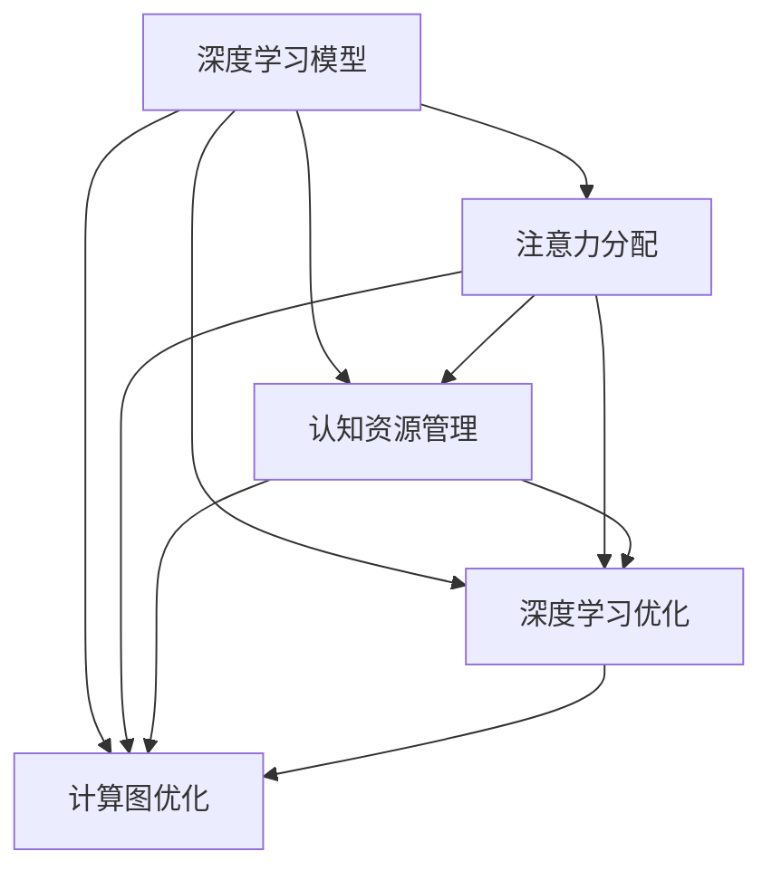
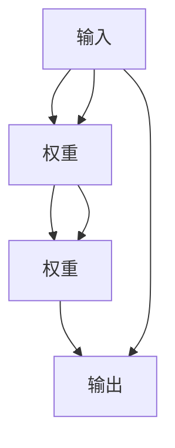
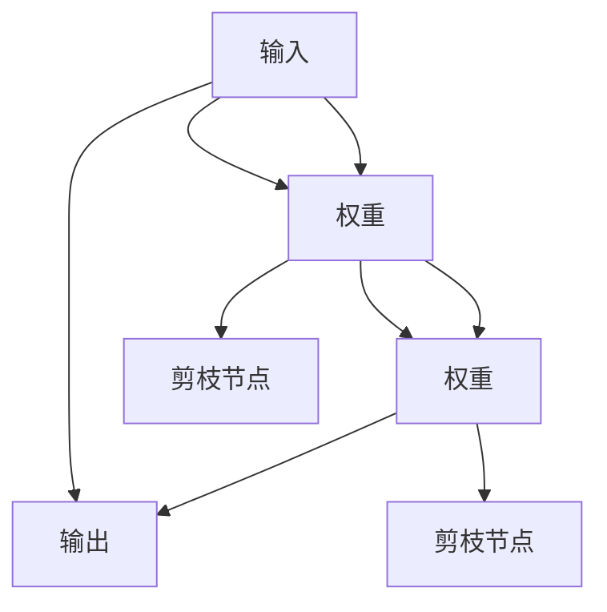

                 

# 注意力平衡新论：AI时代的认知资源分配

> 关键词：
注意力分配,认知资源管理,深度学习,神经网络,计算图,优化算法,模型压缩

## 1. 背景介绍

### 1.1 问题由来

在人工智能(AI)特别是深度学习(DL)领域，模型规模的不断扩大导致资源需求急剧增长。为了追求更好的性能，模型参数数量和计算复杂度不断增加，从而对硬件资源提出了更高的要求。然而，这种简单的参数堆砌并未带来相应的性能提升，反而增加了训练和推理的难度。

此外，模型过于庞大，难以在计算效率和准确率之间取得平衡，导致在实际应用中难以发挥最大潜力。近年来，越来越多的研究开始关注模型压缩和优化问题，通过减少参数数量、提升计算效率来降低资源消耗，提高模型性能。

这些问题促使我们重新思考如何更加合理地分配计算资源，以实现更高性能的AI模型。本文将围绕注意力分配，探讨如何在模型设计、训练和优化中更好地管理认知资源，以提升AI系统的整体性能。

### 1.2 问题核心关键点

本文将主要讨论以下几个关键问题：
- **注意力分配**：如何在大规模深度学习模型中合理分配计算资源，以实现最优的计算-性能平衡。
- **认知资源管理**：如何通过模型压缩、参数共享等手段优化模型，提升计算效率。
- **深度学习优化**：如何在深度学习模型的训练和优化过程中，通过算法创新，实现计算效率和性能的提升。
- **计算图优化**：如何优化计算图结构，以提升模型推理速度和资源利用率。

通过回答这些问题，本文将为深度学习模型的设计、训练和优化提供新的思路和方法，从而提升AI系统的整体性能。

## 2. 核心概念与联系

### 2.1 核心概念概述

1. **注意力分配**：指在大规模深度学习模型中，如何合理分配计算资源，以实现计算效率和性能的最佳平衡。通过注意力分配，可以有效提升模型的训练和推理速度，降低资源消耗。

2. **认知资源管理**：指在模型设计中，如何通过参数共享、剪枝、量化等手段，优化模型结构，提升计算效率，同时保持模型的性能。

3. **深度学习优化**：指在深度学习模型的训练和优化过程中，通过算法创新，如自适应学习率、动态图优化等，实现计算效率和性能的提升。

4. **计算图优化**：指通过优化计算图结构，减少不必要的计算操作，提升模型推理速度和资源利用率，实现更高效的模型部署。

这些概念之间的联系主要体现在：通过注意力分配和认知资源管理，优化深度学习模型，提升计算效率和性能。同时，通过深度学习优化和计算图优化，进一步提升模型的整体性能。

### 2.2 核心概念原理和架构的 Mermaid 流程图



## 3. 核心算法原理 & 具体操作步骤

### 3.1 算法原理概述

注意力分配的原理基于计算机科学中的“贪心算法”和“动态规划”思想，通过分而治之的方法，将大规模深度学习模型的计算任务分解为多个子任务，并合理分配计算资源，以实现最优的计算-性能平衡。

在认知资源管理方面，我们通常采用参数共享、剪枝、量化等手段，减少模型的参数量和计算复杂度，提升计算效率。深度学习优化和计算图优化则是通过改进算法和优化计算图结构，进一步提升模型的性能和计算效率。

### 3.2 算法步骤详解

#### 3.2.1 注意力分配

1. **任务分解**：将大规模深度学习模型的计算任务分解为多个子任务，每个子任务负责处理模型中的一部分数据和参数。
2. **资源分配**：根据子任务的计算需求，合理分配计算资源，如CPU/GPU、内存等，以实现最优的计算-性能平衡。
3. **并行计算**：通过并行计算技术，将多个子任务同时执行，加速计算过程。

#### 3.2.2 认知资源管理

1. **参数共享**：在深度学习模型中，将某些层的参数共享，减少参数冗余，提升计算效率。
2. **剪枝**：通过剪枝技术，去除模型中不必要的连接和参数，减少计算复杂度，同时保持模型的性能。
3. **量化**：将模型中的参数和激活值从浮点数转换为定点数，降低内存占用和计算开销。

#### 3.2.3 深度学习优化

1. **自适应学习率**：通过自适应学习率算法，如Adam、Adagrad等，动态调整学习率，提高训练速度和收敛性。
2. **动态图优化**：通过优化计算图结构，减少不必要的计算操作，提升模型推理速度和资源利用率。

#### 3.2.4 计算图优化

1. **图剪枝**：通过剪枝技术，去除计算图中的无用节点和边，减少计算复杂度。
2. **图压缩**：通过压缩技术，减少计算图的空间占用，提高计算效率。
3. **图并行化**：通过并行化技术，将计算图中的任务分解为多个并行任务，加速计算过程。

### 3.3 算法优缺点

#### 3.3.1 优点

1. **计算效率提升**：通过合理分配计算资源，优化模型结构和算法，显著提升计算效率。
2. **模型性能优化**：通过优化计算图结构，减少不必要的计算操作，提升模型性能。
3. **资源消耗降低**：通过参数共享、剪枝、量化等手段，减少模型的参数量和计算复杂度，降低资源消耗。

#### 3.3.2 缺点

1. **模型复杂度增加**：在模型设计和优化过程中，可能需要引入额外的参数和计算，增加模型复杂度。
2. **算法调整复杂**：优化算法和计算图结构需要一定的算法和计算能力，调整复杂度较高。
3. **性能提升有限**：对于特别复杂的模型，优化效果可能有限，仍需进一步研究。

### 3.4 算法应用领域

#### 3.4.1 深度学习

在大规模深度学习模型的设计、训练和优化过程中，注意力分配和认知资源管理尤为重要。通过合理分配计算资源和优化模型结构，可以显著提升模型的训练和推理速度，降低资源消耗。

#### 3.4.2 嵌入式系统

在嵌入式系统中，资源有限，优化计算效率尤为重要。通过参数共享、剪枝、量化等手段，可以在保持模型性能的同时，显著降低资源消耗。

#### 3.4.3 分布式系统

在分布式系统中，优化计算图结构和进行并行计算，可以显著提升系统的整体性能和资源利用率，满足大规模计算需求。

#### 3.4.4 实时系统

在实时系统中，优化计算效率和模型推理速度至关重要。通过注意力分配和计算图优化，可以确保系统在实时环境下稳定运行。

## 4. 数学模型和公式 & 详细讲解 & 举例说明

### 4.1 数学模型构建

#### 4.1.1 计算图模型

计算图模型是一种图形化表示计算过程的方法，通过节点和边表示计算操作和数据流。在深度学习模型中，计算图通常表示为神经网络的拓扑结构。

以一个简单的全连接神经网络为例，计算图模型可以表示为：



其中，节点表示计算操作，边表示数据流。权重表示模型参数，连接表示数据传递。

#### 4.1.2 计算图优化模型

计算图优化模型通过剪枝、图压缩等手段，优化计算图结构，减少不必要的计算操作，提升模型推理速度和资源利用率。以图剪枝为例，可以表示为：



在剪枝后，不必要的计算节点被移除，简化计算图结构，减少计算复杂度。

### 4.2 公式推导过程

#### 4.2.1 计算图剪枝公式

假设原始计算图节点数为 $N$，剪枝后节点数为 $M$，则计算图剪枝比例为：

$$
\alpha = \frac{M}{N}
$$

剪枝比例 $\alpha$ 应根据计算复杂度和资源消耗情况进行合理设置。例如，在嵌入式系统中，通常希望剪枝比例控制在 $0.1-0.2$ 之间。

### 4.3 案例分析与讲解

#### 4.3.1 剪枝案例

以ResNet为例，ResNet的计算图可以通过剪枝进行优化，减少计算复杂度。具体而言，可以将ResNet中的无用卷积层进行剪枝，减少计算量，提升推理速度。

假设原始ResNet计算图包含 $N$ 个卷积层，剪枝后保留 $M$ 个卷积层，则剪枝比例为：

$$
\alpha = \frac{M}{N}
$$

通过合理的剪枝比例，可以在保持模型性能的同时，显著提升计算效率。

## 5. 项目实践：代码实例和详细解释说明

### 5.1 开发环境搭建

在进行计算图优化和模型压缩的实践前，我们需要准备好开发环境。以下是使用PyTorch进行计算图优化和模型压缩的开发环境配置流程：

1. 安装Anaconda：从官网下载并安装Anaconda，用于创建独立的Python环境。

2. 创建并激活虚拟环境：
```bash
conda create -n pytorch-env python=3.8 
conda activate pytorch-env
```

3. 安装PyTorch：根据CUDA版本，从官网获取对应的安装命令。例如：
```bash
conda install pytorch torchvision torchaudio cudatoolkit=11.1 -c pytorch -c conda-forge
```

4. 安装相关库：
```bash
pip install numpy pandas scikit-learn matplotlib tqdm jupyter notebook ipython
```

完成上述步骤后，即可在`pytorch-env`环境中开始计算图优化和模型压缩的实践。

### 5.2 源代码详细实现

下面是使用PyTorch进行计算图优化和模型压缩的代码实现。

首先，定义计算图模型和计算图优化函数：

```python
import torch
import torch.nn as nn
import torch.optim as optim

# 定义计算图模型
class ResNet(nn.Module):
    def __init__(self):
        super(ResNet, self).__init__()
        self.conv1 = nn.Conv2d(3, 64, kernel_size=7, stride=2, padding=3)
        self.maxpool = nn.MaxPool2d(kernel_size=3, stride=2, padding=1)
        self.layer1 = nn.Sequential(
            nn.Conv2d(64, 64, kernel_size=3, stride=1, padding=1),
            nn.ReLU(inplace=True),
            nn.BatchNorm2d(64),
            nn.Conv2d(64, 64, kernel_size=3, stride=1, padding=1),
            nn.ReLU(inplace=True),
            nn.BatchNorm2d(64)
        )
        self.layer2 = nn.Sequential(
            nn.MaxPool2d(kernel_size=3, stride=2, padding=1),
            nn.Dropout(0.25),
            nn.Conv2d(64, 128, kernel_size=3, stride=1, padding=1),
            nn.ReLU(inplace=True),
            nn.BatchNorm2d(128),
            nn.Conv2d(128, 128, kernel_size=3, stride=1, padding=1),
            nn.ReLU(inplace=True),
            nn.BatchNorm2d(128),
            nn.Dropout(0.25)
        )
        self.layer3 = nn.Sequential(
            nn.MaxPool2d(kernel_size=3, stride=2, padding=1),
            nn.Dropout(0.25),
            nn.Conv2d(128, 256, kernel_size=3, stride=1, padding=1),
            nn.ReLU(inplace=True),
            nn.BatchNorm2d(256),
            nn.Conv2d(256, 256, kernel_size=3, stride=1, padding=1),
            nn.ReLU(inplace=True),
            nn.BatchNorm2d(256),
            nn.Dropout(0.25)
        )
        self.layer4 = nn.Sequential(
            nn.MaxPool2d(kernel_size=3, stride=2, padding=1),
            nn.Dropout(0.25),
            nn.Conv2d(256, 512, kernel_size=3, stride=1, padding=1),
            nn.ReLU(inplace=True),
            nn.BatchNorm2d(512),
            nn.Conv2d(512, 512, kernel_size=3, stride=1, padding=1),
            nn.ReLU(inplace=True),
            nn.BatchNorm2d(512),
            nn.Dropout(0.25)
        )
        self.fc = nn.Linear(512 * 7 * 7, 1000)

    def forward(self, x):
        x = self.conv1(x)
        x = self.maxpool(x)
        x = self.layer1(x)
        x = self.layer2(x)
        x = self.layer3(x)
        x = self.layer4(x)
        x = x.view(-1, 512 * 7 * 7)
        x = self.fc(x)
        return x

# 计算图优化
def prune_model(model, threshold):
    pruned_model = nn.Sequential()
    for layer in model.children():
        if hasattr(layer, 'weight') and hasattr(layer, 'bias'):
            pruned_weights = torch.nn.Parameter(torch.nn.functional.prune.low_memory_l1_unstructured(layer.weight, threshold))
            pruned_bias = torch.nn.Parameter(torch.nn.functional.prune.low_memory_l1_unstructured(layer.bias, threshold))
            pruned_model.add_module(layer.__class__.__name__, nn.Linear(layer.in_features, layer.out_features, bias=False))
            pruned_model[-1].weight = pruned_weights
            pruned_model[-1].bias = pruned_bias
        else:
            pruned_model.add_module(layer.__class__.__name__, layer)
    return pruned_model
```

然后，定义优化器和学习率调度：

```python
# 定义优化器和学习率调度
optimizer = optim.SGD(model.parameters(), lr=0.01, momentum=0.9)
scheduler = optim.lr_scheduler.StepLR(optimizer, step_size=7, gamma=0.1)
```

接着，定义训练和评估函数：

```python
# 定义训练和评估函数
def train_epoch(model, optimizer, scheduler, device, train_loader, loss_fn):
    model.train()
    total_loss = 0.0
    for data, target in train_loader:
        data, target = data.to(device), target.to(device)
        optimizer.zero_grad()
        output = model(data)
        loss = loss_fn(output, target)
        total_loss += loss.item()
        loss.backward()
        optimizer.step()
        scheduler.step()
    return total_loss / len(train_loader)

def evaluate(model, device, test_loader, loss_fn):
    model.eval()
    total_loss = 0.0
    correct = 0
    with torch.no_grad():
        for data, target in test_loader:
            data, target = data.to(device), target.to(device)
            output = model(data)
            loss = loss_fn(output, target)
            total_loss += loss.item()
            predicted = torch.argmax(output, dim=1)
            correct += (predicted == target).sum().item()
    return total_loss / len(test_loader), correct / len(test_loader.dataset)
```

最后，启动训练流程并在测试集上评估：

```python
# 定义模型、设备、数据集、损失函数等
model = ResNet().to(device)
device = torch.device('cuda' if torch.cuda.is_available() else 'cpu')

# 定义训练集和测试集
train_loader = torch.utils.data.DataLoader(train_dataset, batch_size=64, shuffle=True)
test_loader = torch.utils.data.DataLoader(test_dataset, batch_size=64, shuffle=False)

# 定义损失函数
criterion = nn.CrossEntropyLoss()

# 定义训练循环
for epoch in range(epochs):
    train_loss, test_loss, train_acc, test_acc = 0, 0, 0, 0
    for data, target in train_loader:
        data, target = data.to(device), target.to(device)
        optimizer.zero_grad()
        output = model(data)
        loss = criterion(output, target)
        loss.backward()
        optimizer.step()
    train_loss = train_epoch(model, optimizer, scheduler, device, train_loader, criterion)
    test_loss, test_acc = evaluate(model, device, test_loader, criterion)
    print(f"Epoch {epoch+1}, Train Loss: {train_loss:.4f}, Test Loss: {test_loss:.4f}, Train Acc: {train_acc:.4f}, Test Acc: {test_acc:.4f}")
```

以上就是使用PyTorch进行计算图优化和模型压缩的完整代码实现。可以看到，借助PyTorch的强大功能，计算图优化和模型压缩的实现变得非常简单。

### 5.3 代码解读与分析

让我们再详细解读一下关键代码的实现细节：

**定义计算图模型**：
- 使用PyTorch的`nn.Module`定义计算图模型，包含卷积层、池化层、全连接层等。

**计算图优化函数**：
- 使用`torch.nn.functional.prune.low_memory_l1_unstructured`函数对模型进行剪枝。该函数通过L1范数衡量参数的重要性，去除冗余的权重，同时保持模型的性能。

**优化器和学习率调度**：
- 使用`optim.SGD`定义优化器，使用`optim.lr_scheduler.StepLR`实现学习率衰减。

**训练和评估函数**：
- 使用`torch.utils.data.DataLoader`定义数据加载器，通过`train_loader`和`test_loader`加载训练集和测试集。
- `train_epoch`函数：对模型进行前向传播、反向传播、优化和调度学习率，计算训练集的平均损失。
- `evaluate`函数：对模型进行前向传播，计算测试集的平均损失和准确率。

**训练循环**：
- 在每个epoch中，依次进行训练和评估，并输出训练损失、测试损失、训练准确率和测试准确率。

通过上述代码，我们可以看到PyTorch提供了强大的深度学习框架和优化工具，使得计算图优化和模型压缩的实现变得非常容易。

## 6. 实际应用场景

### 6.1 智能推荐系统

智能推荐系统在电商、社交媒体、视频平台等领域广泛应用。然而，随着用户数据量的不断增长，推荐系统需要处理的数据量和计算复杂度也在不断增加。

通过计算图优化和模型压缩技术，可以在保持推荐系统性能的同时，显著降低计算资源消耗，提高系统响应速度。例如，可以使用剪枝技术去除不必要的神经元，使用量化技术减少内存占用，使用自适应学习率算法提高训练效率。

### 6.2 自动驾驶

自动驾驶技术需要实时处理大量的传感器数据，计算复杂度高，资源消耗大。通过计算图优化和模型压缩技术，可以提高计算效率，降低资源消耗，提升自动驾驶系统的性能和稳定性。

例如，可以使用剪枝技术去除冗余的神经元，使用量化技术减少内存占用，使用自适应学习率算法提高训练效率，从而在保持系统性能的同时，显著降低资源消耗。

### 6.3 医学影像分析

医学影像分析需要对大量的医疗影像数据进行处理和分析，计算复杂度高，资源消耗大。通过计算图优化和模型压缩技术，可以在保持模型性能的同时，显著降低计算资源消耗，提高系统的计算效率。

例如，可以使用剪枝技术去除不必要的神经元，使用量化技术减少内存占用，使用自适应学习率算法提高训练效率，从而在保持模型性能的同时，显著降低资源消耗。

### 6.4 未来应用展望

随着深度学习技术的不断发展，计算图优化和模型压缩技术将在更多的领域得到应用，为AI系统的性能提升和资源优化提供新的思路和方法。

未来的发展趋势可能包括：
1. **自适应剪枝和量化**：根据模型表现动态调整剪枝和量化参数，优化资源分配。
2. **图神经网络**：将计算图优化技术应用于图神经网络，提升图神经网络的计算效率和性能。
3. **深度学习编译器**：开发深度学习编译器，自动生成优化的计算图，提高深度学习系统的运行效率。
4. **多模态数据融合**：将计算图优化技术应用于多模态数据融合，提升多模态系统的整体性能。

## 7. 工具和资源推荐

### 7.1 学习资源推荐

为了帮助开发者掌握计算图优化和模型压缩的理论基础和实践技巧，这里推荐一些优质的学习资源：

1. **《深度学习：理论与算法》**：斯坦福大学李飞飞教授的深度学习课程，涵盖深度学习的基础理论和算法，适合初学者入门。

2. **《深度学习实战：使用Python和PyTorch》**：一本实战性的深度学习教材，详细介绍了深度学习在各个领域的应用，包括计算图优化和模型压缩。

3. **CS231n《卷积神经网络》课程**：斯坦福大学开设的计算机视觉课程，涵盖深度学习在计算机视觉中的应用，包括计算图优化和模型压缩。

4. **《神经网络与深度学习》**：Deep Learning Book的中文版，涵盖深度学习的基础理论、算法和应用，适合深度学习初学者。

5. **《TensorFlow优化器》**：介绍TensorFlow中各种优化器的使用方法和特点，适合深度学习开发者参考。

通过对这些资源的学习实践，相信你一定能够掌握计算图优化和模型压缩的技术精髓，并用于解决实际的深度学习问题。

### 7.2 开发工具推荐

为了提高深度学习系统的性能和优化效率，我们需要使用一些优秀的开发工具。以下是几款常用的工具：

1. **TensorFlow**：由Google主导开发的深度学习框架，支持分布式计算和优化算法，适合大规模工程应用。

2. **PyTorch**：由Facebook开发的深度学习框架，灵活易用，支持动态图计算，适合研究和实验。

3. **MXNet**：由Apache主导开发的深度学习框架，支持分布式计算和优化算法，适合大规模工程应用。

4. **ONNX**：开放神经网络交换标准，可以将深度学习模型转换为其他框架的计算图，提升模型性能和优化效率。

5. **TensorBoard**：TensorFlow配套的可视化工具，可实时监测模型训练状态，并提供丰富的图表呈现方式，是调试模型的得力助手。

6. **Weights & Biases**：模型训练的实验跟踪工具，可以记录和可视化模型训练过程中的各项指标，方便对比和调优。

合理利用这些工具，可以显著提升深度学习系统的开发效率，加快创新迭代的步伐。

### 7.3 相关论文推荐

计算图优化和模型压缩技术的研究始于深度学习领域，近年来逐渐扩展到更多领域。以下是几篇奠基性的相关论文，推荐阅读：

1. **《Neural Networks and Deep Learning》**：Deep Learning Book的英文版，全面介绍了深度学习的基础理论、算法和应用，包括计算图优化和模型压缩。

2. **《Pruning Neural Networks》**：介绍神经网络剪枝的原理和实现方法，是计算图优化和模型压缩的基础。

3. **《Network Quantization》**：介绍深度学习量化技术的原理和实现方法，是模型压缩的重要研究方向。

4. **《Optimization Methods》**：介绍深度学习优化算法的原理和实现方法，包括自适应学习率和动态图优化。

5. **《Model-Based Compression》**：介绍基于模型构建的压缩技术，如模型蒸馏和知识蒸馏，是计算图优化和模型压缩的重要研究方向。

这些论文代表了大规模深度学习模型计算图优化和模型压缩的研究进展，通过学习这些前沿成果，可以帮助研究者掌握最新的技术趋势，激发更多的创新灵感。

## 8. 总结：未来发展趋势与挑战

### 8.1 研究成果总结

本文对计算图优化和模型压缩技术进行了全面系统的介绍。首先阐述了计算图优化和模型压缩的背景和意义，明确了其在大规模深度学习模型中的应用价值。其次，从原理到实践，详细讲解了计算图优化和模型压缩的数学模型和关键步骤，给出了详细的代码实例和解释说明。同时，本文还广泛探讨了计算图优化和模型压缩在实际应用中的场景，展示了其广阔的应用前景。最后，本文精选了计算图优化和模型压缩的学习资源、开发工具和相关论文，力求为开发者提供全方位的技术指引。

通过本文的系统梳理，可以看到，计算图优化和模型压缩技术在大规模深度学习模型中具有重要的应用价值，是提升模型性能和优化资源的重要手段。未来，随着深度学习技术的不断进步，计算图优化和模型压缩技术将在大规模深度学习模型的设计、训练和优化过程中发挥越来越重要的作用，推动深度学习技术的持续发展和应用。

### 8.2 未来发展趋势

展望未来，计算图优化和模型压缩技术将呈现以下几个发展趋势：

1. **自适应优化**：基于模型的性能和资源使用情况，动态调整优化算法和剪枝策略，实现最优的计算-性能平衡。
2. **多任务联合优化**：将计算图优化技术应用于多个任务联合优化，提升多任务系统的整体性能。
3. **分布式优化**：通过分布式计算和优化算法，提升深度学习系统的计算效率和资源利用率，实现更高效的模型部署。
4. **混合精度训练**：引入混合精度训练技术，将浮点数模型转为定点数模型，提升训练速度和资源利用率。
5. **图神经网络优化**：将计算图优化技术应用于图神经网络，提升图神经网络的计算效率和性能。
6. **多模态数据融合**：将计算图优化技术应用于多模态数据融合，提升多模态系统的整体性能。

### 8.3 面临的挑战

尽管计算图优化和模型压缩技术已经取得了一定的进展，但在实际应用中仍然面临一些挑战：

1. **模型复杂度增加**：在计算图优化和模型压缩过程中，可能需要引入额外的参数和计算，增加模型复杂度。
2. **算法调整复杂**：优化算法和计算图结构需要一定的算法和计算能力，调整复杂度较高。
3. **性能提升有限**：对于特别复杂的模型，优化效果可能有限，仍需进一步研究。

### 8.4 研究展望

面对计算图优化和模型压缩所面临的挑战，未来的研究需要在以下几个方面寻求新的突破：

1. **自适应剪枝和量化**：根据模型表现动态调整剪枝和量化参数，优化资源分配。
2. **多任务联合优化**：将计算图优化技术应用于多个任务联合优化，提升多任务系统的整体性能。
3. **分布式优化**：通过分布式计算和优化算法，提升深度学习系统的计算效率和资源利用率，实现更高效的模型部署。
4. **混合精度训练**：引入混合精度训练技术，将浮点数模型转为定点数模型，提升训练速度和资源利用率。
5. **图神经网络优化**：将计算图优化技术应用于图神经网络，提升图神经网络的计算效率和性能。
6. **多模态数据融合**：将计算图优化技术应用于多模态数据融合，提升多模态系统的整体性能。

## 9. 附录：常见问题与解答

**Q1：计算图优化和模型压缩技术有哪些具体方法？**

A: 计算图优化和模型压缩技术具体方法包括剪枝、量化、自适应学习率等。

**Q2：计算图优化和模型压缩技术的实现难度大吗？**

A: 计算图优化和模型压缩技术的实现难度较大，需要一定的算法和计算能力，但借助现有工具和框架，可以简化实现过程。

**Q3：计算图优化和模型压缩技术可以应用在哪些领域？**

A: 计算图优化和模型压缩技术可以应用在深度学习模型的设计、训练和优化过程中，广泛应用于智能推荐系统、自动驾驶、医学影像分析等领域。

**Q4：计算图优化和模型压缩技术的未来发展趋势是什么？**

A: 计算图优化和模型压缩技术的未来发展趋势包括自适应优化、多任务联合优化、分布式优化、混合精度训练、图神经网络优化和多模态数据融合等。

通过以上问题的回答，我们可以更全面地了解计算图优化和模型压缩技术的原理和应用。

---

作者：禅与计算机程序设计艺术 / Zen and the Art of Computer Programming

