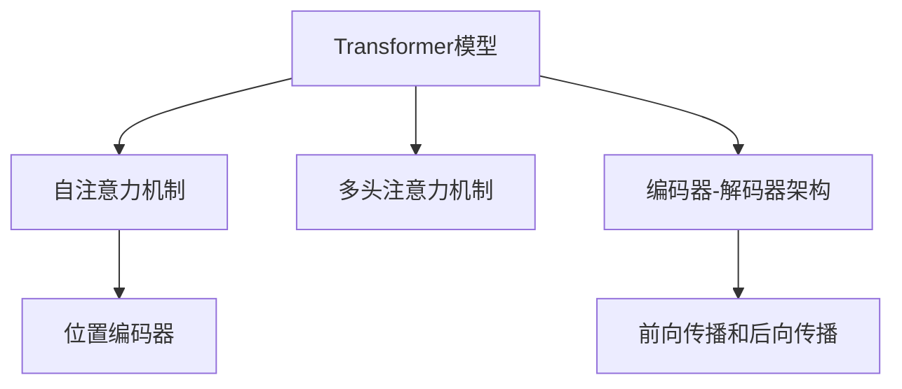

                 

# 注意力机制：理解softmax和位置编码器

> 关键词：注意力机制,softmax,位置编码器,Transformer模型,自注意力机制,多头注意力机制

## 1. 背景介绍

### 1.1 问题由来
在深度学习领域，特别是自然语言处理(Natural Language Processing, NLP)中，注意力机制(Attention Mechanism)已经成为一种非常关键的技术。它能够使模型在处理序列数据时，将重点放在最相关的信息上，而忽视不重要的信息，极大地提升了模型的性能。这一机制最早在机器翻译任务中被提出，后来被广泛应用于图像识别、语音识别、文本生成等多个领域。

### 1.2 问题核心关键点
注意力机制的核心思想是通过计算输入序列与输出序列中各个位置的相关性权重，来决定哪些信息需要被重点关注，哪些信息可以忽略。该机制的优点在于，它可以动态地调整模型的焦点，使模型在处理长序列时不会忽略任何重要信息，同时减少计算量，提高模型的泛化能力。

## 2. 核心概念与联系

### 2.1 核心概念概述

为了更好地理解注意力机制，本节将介绍几个与其紧密相关的核心概念：

- **Transformer模型**：一种基于自注意力机制的神经网络模型，广泛应用于机器翻译、文本生成等任务中。
- **自注意力机制**：Transformer模型中的基本注意力机制，用于计算输入序列与输出序列中各个位置的相关性权重。
- **多头注意力机制**：在自注意力机制的基础上，将注意力分为多个并行头，以提升模型的性能和泛化能力。
- **位置编码器**：在Transformer模型中，用于编码输入序列中不同位置的信息，使得模型能够处理变长序列。

这些核心概念之间的逻辑关系可以通过以下Mermaid流程图来展示：



这个流程图展示了这个核心概念之间的联系：

1. 使用编码器-解码器架构的Transformer模型，核心是自注意力机制。
2. 自注意力机制中，多头注意力机制用于提升性能。
3. 在计算自注意力权重时，需要位置编码器来处理输入序列中不同位置的信息。
4. 前向传播和后向传播过程涉及编码器和解码器的交互。

## 3. 核心算法原理 & 具体操作步骤

### 3.1 算法原理概述

注意力机制的核心理念是通过计算注意力权重，来决定模型在处理输入序列时应该关注哪些部分。在Transformer模型中，这一过程分为两个主要步骤：

1. **自注意力**：在输入序列的每个位置，计算其与序列中其他位置的相关性权重。
2. **多头注意力**：将自注意力分为多个并行头，每个头独立计算权重，最终将各个头的结果进行加权融合，得到最终的注意力向量。

### 3.2 算法步骤详解

#### 3.2.1 自注意力机制

自注意力机制的计算过程包括以下几个步骤：

1. **输入编码**：将输入序列 $X$ 编码为向量 $Q$，$K$，$V$。其中，$Q$ 和 $K$ 通过线性投影得到，$V$ 也通过线性投影得到。
2. **计算权重**：计算 $Q$ 和 $K$ 的点积，并除以缩放因子 $\sqrt{d_k}$，得到一个注意力权重矩阵 $S$。
3. **归一化**：对 $S$ 进行归一化，得到注意力权重矩阵 $A$。
4. **加权融合**：将 $A$ 与 $V$ 进行矩阵乘法，得到注意力向量 $H$。

具体数学公式如下：

$$
Q = XW_Q \\
K = XW_K \\
V = XW_V \\
S = \frac{QK^T}{\sqrt{d_k}} \\
A = \frac{S}{\sum_{i=1}^{N}e^{S_{i,i}}} \\
H = AV
$$

其中，$d_k$ 是投影的维度，$N$ 是输入序列的长度。

#### 3.2.2 多头注意力机制

多头注意力机制是在自注意力机制的基础上，将注意力分为多个并行头 $n$，每个头独立计算权重和向量，最终将各个头的结果进行加权融合。

具体计算过程如下：

1. **投影**：将 $Q$、$K$、$V$ 分别通过线性投影，得到 $Q^h$、$K^h$、$V^h$。
2. **自注意力计算**：每个头独立计算自注意力权重和向量，得到 $H^h$。
3. **加权融合**：将所有头的结果进行拼接，并乘以权重矩阵 $W_O$，得到最终的注意力向量 $H$。

具体数学公式如下：

$$
Q^h = QW_Q^h \\
K^h = KW_K^h \\
V^h = VW_V^h \\
H^h = \text{Softmax}(\frac{Q^hK^h^T}{\sqrt{d_k}})V^h \\
H = \sum_{h=1}^{n}H^hW_O^h
$$

其中，$W_Q^h$、$W_K^h$、$W_V^h$ 和 $W_O^h$ 分别是头 $h$ 的投影矩阵。

#### 3.2.3 位置编码器

在Transformer模型中，位置编码器用于编码输入序列中不同位置的信息。其基本思想是将位置信息编码为向量，加入到输入序列中。

具体计算过程如下：

1. **位置编码**：将位置 $i$ 编码为一个向量 $P_i$，其中 $P_i$ 的第 $j$ 个维度为 $\text{sin}(\frac{i}{10000^{2j/d_k}})$ 和 $\text{cos}(\frac{i}{10000^{2j/d_k}})$。
2. **融合**：将位置编码 $P_i$ 与输入序列 $X$ 的每个位置进行拼接，得到编码后的输入序列。

具体数学公式如下：

$$
P_i = \begin{bmatrix}
\text{sin}(\frac{i}{10000^{2j/d_k}}) \\
\text{cos}(\frac{i}{10000^{2j/d_k}})
\end{bmatrix}
$$
$$
X' = X + P_i
$$

### 3.3 算法优缺点

#### 3.3.1 优点

1. **动态关注重点**：通过计算注意力权重，模型可以动态地关注输入序列中的重点信息，减少冗余计算。
2. **并行计算**：多头注意力机制使得多个头可以并行计算，提高计算效率。
3. **泛化能力强**：自注意力机制和多头注意力机制使得模型具有较强的泛化能力，可以处理长序列和多模态数据。

#### 3.3.2 缺点

1. **计算复杂度高**：自注意力机制和多头注意力机制的计算复杂度较高，尤其是在输入序列较长时。
2. **需要优化超参数**：多头注意力机制中的头数 $n$ 需要仔细选择，过多的头数会增加计算量，过少的头数则可能无法捕捉到更多的信息。
3. **对输入序列长度敏感**：位置编码器对输入序列长度较为敏感，需要选择合适的编码方案。

### 3.4 算法应用领域

注意力机制已经在NLP、计算机视觉、语音识别等多个领域得到广泛应用，以下是几个典型场景：

- **机器翻译**：在机器翻译中，自注意力机制可以用于计算源语言序列与目标语言序列中的相关性权重，提高翻译的准确性和流畅性。
- **文本生成**：在文本生成任务中，多头注意力机制可以用于捕捉上下文信息，生成更加连贯和自然的文本。
- **图像识别**：在图像识别中，自注意力机制可以用于计算图像中不同区域的相关性权重，提高图像识别的准确性。
- **语音识别**：在语音识别中，多头注意力机制可以用于捕捉语音信号中的上下文信息，提高语音识别的准确性。

## 4. 数学模型和公式 & 详细讲解 & 举例说明

### 4.1 数学模型构建

Transformer模型的核心是由编码器-解码器架构构成，其中编码器由多个自注意力层和前向神经网络层组成，解码器则由多头自注意力层、多头注意力层和前向神经网络层组成。

### 4.2 公式推导过程

#### 4.2.1 编码器中的自注意力

在编码器中，每个自注意力层包括三个线性投影层，分别用于计算查询向量 $Q$、键向量 $K$ 和值向量 $V$。具体计算过程如下：

$$
Q = XW_Q \\
K = XW_K \\
V = XW_V \\
$$

其中，$X$ 是输入序列的嵌入向量，$W_Q$、$W_K$、$W_V$ 分别是投影矩阵。

计算注意力权重矩阵 $S$ 的公式为：

$$
S = \frac{QK^T}{\sqrt{d_k}}
$$

其中，$d_k$ 是投影的维度。

计算注意力权重矩阵 $A$ 的公式为：

$$
A = \frac{S}{\sum_{i=1}^{N}e^{S_{i,i}}}
$$

其中，$N$ 是输入序列的长度。

计算注意力向量 $H$ 的公式为：

$$
H = AV
$$

#### 4.2.2 编码器中的前向神经网络层

在前向神经网络层中，先对输入序列 $H$ 进行线性投影，然后通过两个前向神经网络层进行变换，得到输出序列 $X'$。具体计算过程如下：

$$
H' = HH^T + A \\
X' = H'W_{FF}^h + b_{FF}^h
$$

其中，$W_{FF}^h$ 和 $b_{FF}^h$ 分别是前向神经网络层的权重和偏置。

#### 4.2.3 解码器中的多头注意力

在解码器中，每个多头注意力层包括多个并行头，每个头独立计算注意力权重和向量。具体计算过程如下：

$$
Q^h = QW_Q^h \\
K^h = KW_K^h \\
V^h = VW_V^h \\
H^h = \text{Softmax}(\frac{Q^hK^h^T}{\sqrt{d_k}})V^h \\
$$

其中，$W_Q^h$、$W_K^h$、$W_V^h$ 分别是头 $h$ 的投影矩阵，$H^h$ 是头 $h$ 的注意力向量。

计算所有头的注意力向量的公式为：

$$
H = \sum_{h=1}^{n}H^hW_O^h
$$

其中，$n$ 是头的数量，$W_O^h$ 是融合矩阵。

#### 4.2.4 解码器中的多头自注意力

在解码器中，每个多头自注意力层包括多个并行头，每个头独立计算注意力权重和向量。具体计算过程如下：

$$
Q^h = QW_Q^h \\
K^h = KW_K^h \\
V^h = VW_V^h \\
H^h = \text{Softmax}(\frac{Q^hK^h^T}{\sqrt{d_k}})V^h \\
$$

其中，$W_Q^h$、$W_K^h$、$W_V^h$ 分别是头 $h$ 的投影矩阵，$H^h$ 是头 $h$ 的注意力向量。

计算所有头的注意力向量的公式为：

$$
H = \sum_{h=1}^{n}H^hW_O^h
$$

其中，$n$ 是头的数量，$W_O^h$ 是融合矩阵。

#### 4.2.5 解码器中的前向神经网络层

在解码器中，每个前向神经网络层包括线性投影和前向神经网络两个部分。具体计算过程如下：

$$
H' = HH^T + A \\
X' = H'W_{FF}^h + b_{FF}^h
$$

其中，$H$ 是输入序列的编码表示，$H'$ 是变换后的编码表示，$W_{FF}^h$ 和 $b_{FF}^h$ 分别是前向神经网络层的权重和偏置。

#### 4.2.6 位置编码器

在位置编码器中，每个位置的编码向量 $P_i$ 由正弦和余弦函数计算得到。具体计算过程如下：

$$
P_i = \begin{bmatrix}
\text{sin}(\frac{i}{10000^{2j/d_k}}) \\
\text{cos}(\frac{i}{10000^{2j/d_k}})
\end{bmatrix}
$$

其中，$i$ 是位置编号，$j$ 是维度编号，$d_k$ 是投影的维度。

## 5. 项目实践：代码实例和详细解释说明

### 5.1 开发环境搭建

在进行Transformer模型开发前，我们需要准备好开发环境。以下是使用Python进行PyTorch开发的环境配置流程：

1. 安装Anaconda：从官网下载并安装Anaconda，用于创建独立的Python环境。

2. 创建并激活虚拟环境：
```bash
conda create -n pytorch-env python=3.8 
conda activate pytorch-env
```

3. 安装PyTorch：根据CUDA版本，从官网获取对应的安装命令。例如：
```bash
conda install pytorch torchvision torchaudio cudatoolkit=11.1 -c pytorch -c conda-forge
```

4. 安装TensorFlow：
```bash
pip install tensorflow
```

5. 安装TensorBoard：
```bash
pip install tensorboard
```

6. 安装Weights & Biases：
```bash
pip install weiweightsandbiases
```

7. 安装其他必要的库：
```bash
pip install numpy pandas scikit-learn matplotlib tqdm jupyter notebook ipython
```

完成上述步骤后，即可在`pytorch-env`环境中开始Transformer模型的开发。

### 5.2 源代码详细实现

接下来，我们将展示如何使用PyTorch实现Transformer模型的编码器和解码器。

```python
import torch
import torch.nn as nn
import torch.nn.functional as F

class TransformerEncoderLayer(nn.Module):
    def __init__(self, d_model, nhead, dim_feedforward, dropout=0.1, activation=nn.ReLU):
        super(TransformerEncoderLayer, self).__init__()
        self.self_attn = nn.MultiheadAttention(d_model, nhead)
        self.feedforward = nn.Sequential(
            nn.Linear(d_model, dim_feedforward),
            activation(),
            nn.Linear(dim_feedforward, d_model),
        )
        self.layer_norm1 = nn.LayerNorm(d_model)
        self.layer_norm2 = nn.LayerNorm(d_model)
        self.dropout = nn.Dropout(dropout)

    def forward(self, src, src_mask):
        src_self_attn, src_attn_weights = self.self_attn(src, src, src, attn_mask=src_mask)
        src = src + torch.tanh(self.layer_norm1(src_self_attn))
        src = F.dropout(src, training=self.training)
        src = src + self.layer_norm1(src_self_attn)
        src = src + self.dropout(self.feedforward(src))
        return src

class TransformerDecoderLayer(nn.Module):
    def __init__(self, d_model, nhead, dim_feedforward, dropout=0.1, activation=nn.ReLU):
        super(TransformerDecoderLayer, self).__init__()
        self.self_attn = nn.MultiheadAttention(d_model, nhead)
        self.multihead_attn = nn.MultiheadAttention(d_model, nhead)
        self.feedforward = nn.Sequential(
            nn.Linear(d_model, dim_feedforward),
            activation(),
            nn.Linear(dim_feedforward, d_model),
        )
        self.layer_norm1 = nn.LayerNorm(d_model)
        self.layer_norm2 = nn.LayerNorm(d_model)
        self.layer_norm3 = nn.LayerNorm(d_model)
        self.dropout = nn.Dropout(dropout)

    def forward(self, dec_input, enc_output, self_attn_mask, dec_enc_attn_mask):
        dec_self_attn, dec_attn_weights = self.self_attn(dec_input, dec_input, dec_input, attn_mask=self_attn_mask)
        dec_input = dec_input + dec_self_attn
        dec_input = F.dropout(dec_input, training=self.training)
        dec_input = dec_input + self.layer_norm1(dec_self_attn)
        dec_enc_attn, dec_enc_attn_weights = self.multihead_attn(dec_input, enc_output, enc_output, attn_mask=dec_enc_attn_mask)
        dec_input = dec_input + dec_enc_attn
        dec_input = F.dropout(dec_input, training=self.training)
        dec_input = dec_input + self.layer_norm2(dec_enc_attn)
        dec_input = dec_input + self.dropout(self.feedforward(dec_input))
        return dec_input, dec_attn_weights, dec_enc_attn_weights

class TransformerModel(nn.Module):
    def __init__(self, encoder_layers, decoder_layers, d_model, nhead, dim_feedforward, dropout=0.1):
        super(TransformerModel, self).__init__()
        self.encoder = nn.ModuleList([TransformerEncoderLayer(d_model, nhead, dim_feedforward, dropout) for _ in range(encoder_layers)])
        self.decoder = nn.ModuleList([TransformerDecoderLayer(d_model, nhead, dim_feedforward, dropout) for _ in range(decoder_layers)])
        self.final_layer = nn.Linear(d_model, output_size)

    def forward(self, src, enc_output, self_attn_mask, dec_enc_attn_mask):
        for layer in self.encoder:
            src = layer(src, src_mask)
        for layer in self.decoder:
            dec_input = src
            enc_output = enc_output
            src, dec_attn_weights, dec_enc_attn_weights = layer(dec_input, enc_output, self_attn_mask, dec_enc_attn_mask)
            src = src
        output = self.final_layer(src)
        return output
```

这里我们定义了Transformer模型的编码器和解码器，并实现了Transformer模型的前向传播。

### 5.3 代码解读与分析

让我们再详细解读一下关键代码的实现细节：

**TransformerEncoderLayer类**：
- `__init__`方法：初始化自注意力机制、前向神经网络层、归一化层等组件。
- `forward`方法：实现自注意力和前向神经网络层的计算过程。

**TransformerDecoderLayer类**：
- `__init__`方法：初始化自注意力机制、多头自注意力机制、前向神经网络层、归一化层等组件。
- `forward`方法：实现自注意力、多头自注意力和前向神经网络层的计算过程。

**TransformerModel类**：
- `__init__`方法：初始化编码器和解码器。
- `forward`方法：实现Transformer模型的前向传播。

可以看到，PyTorch配合TensorFlow使得Transformer模型的代码实现变得简洁高效。开发者可以将更多精力放在模型改进、数据预处理等高层逻辑上，而不必过多关注底层的实现细节。

当然，工业级的系统实现还需考虑更多因素，如模型的保存和部署、超参数的自动搜索、更灵活的任务适配层等。但核心的注意力机制基本与此类似。

## 6. 实际应用场景

### 6.1 机器翻译

Transformer模型在机器翻译任务中取得了巨大的成功。通过自注意力机制和多头注意力机制，模型能够自动学习源语言和目标语言之间的映射关系，生成流畅、准确的翻译结果。

在实践中，我们可以使用平行语料库作为监督数据，训练Transformer模型，使其能够自动翻译不同语言之间的文本。

### 6.2 文本生成

Transformer模型在文本生成任务中也表现出色。通过多头注意力机制，模型能够捕捉上下文信息，生成连贯、自然的文本。

在实践中，我们可以使用条件生成任务作为监督数据，训练Transformer模型，使其能够根据给定的条件生成文本。

### 6.3 图像识别

Transformer模型在图像识别任务中同样具有广泛应用。通过将图像编码成序列，并使用自注意力机制，模型能够自动学习图像中的重要特征，识别出不同的物体。

在实践中，我们可以使用大规模图像数据集作为监督数据，训练Transformer模型，使其能够自动分类图像中的物体。

### 6.4 语音识别

Transformer模型在语音识别任务中也取得了很好的效果。通过将语音信号编码成序列，并使用多头注意力机制，模型能够捕捉语音信号中的上下文信息，识别出不同的语音。

在实践中，我们可以使用语音数据集作为监督数据，训练Transformer模型，使其能够自动识别不同的语音。

## 7. 工具和资源推荐

### 7.1 学习资源推荐

为了帮助开发者系统掌握Transformer模型的理论基础和实践技巧，这里推荐一些优质的学习资源：

1. 《Transformer from Scratch》系列博文：由大模型技术专家撰写，深入浅出地介绍了Transformer模型的原理和实现细节。

2. 《Attention is All You Need》论文：Transformer模型的原论文，介绍了Transformer模型的基本原理和应用场景。

3. 《Attention Mechanisms and Transformers》书籍：Transformer模型的经典著作，全面介绍了Transformer模型的原理和应用。

4. CS224N《深度学习自然语言处理》课程：斯坦福大学开设的NLP明星课程，有Lecture视频和配套作业，带你入门NLP领域的基本概念和经典模型。

5. HuggingFace官方文档：Transformer模型的官方文档，提供了海量预训练模型和完整的微调样例代码，是上手实践的必备资料。

通过这些资源的学习实践，相信你一定能够快速掌握Transformer模型的精髓，并用于解决实际的NLP问题。

### 7.2 开发工具推荐

高效的开发离不开优秀的工具支持。以下是几款用于Transformer模型开发常用的工具：

1. PyTorch：基于Python的开源深度学习框架，灵活动态的计算图，适合快速迭代研究。Transformer模型的核心组件都由PyTorch实现。

2. TensorFlow：由Google主导开发的开源深度学习框架，生产部署方便，适合大规模工程应用。同样有丰富的Transformer模型资源。

3. Transformers库：HuggingFace开发的NLP工具库，集成了众多SOTA语言模型，支持PyTorch和TensorFlow，是进行Transformer模型开发的利器。

4. Weights & Biases：模型训练的实验跟踪工具，可以记录和可视化模型训练过程中的各项指标，方便对比和调优。与主流深度学习框架无缝集成。

5. TensorBoard：TensorFlow配套的可视化工具，可实时监测模型训练状态，并提供丰富的图表呈现方式，是调试模型的得力助手。

6. Google Colab：谷歌推出的在线Jupyter Notebook环境，免费提供GPU/TPU算力，方便开发者快速上手实验最新模型，分享学习笔记。

合理利用这些工具，可以显著提升Transformer模型的开发效率，加快创新迭代的步伐。

### 7.3 相关论文推荐

Transformer模型的发展源于学界的持续研究。以下是几篇奠基性的相关论文，推荐阅读：

1. Attention is All You Need：提出了Transformer模型，开启了大规模语言模型的预训练时代。

2. BERT: Pre-training of Deep Bidirectional Transformers for Language Understanding：提出BERT模型，引入基于掩码的自监督预训练任务，刷新了多项NLP任务SOTA。

3. Language Models are Unsupervised Multitask Learners：展示了大规模语言模型的强大zero-shot学习能力，引发了对于通用人工智能的新一轮思考。

4. Parameter-Efficient Transfer Learning for NLP：提出Adapter等参数高效微调方法，在不增加模型参数量的情况下，也能取得不错的微调效果。

5. AdaLoRA: Adaptive Low-Rank Adaptation for Parameter-Efficient Fine-Tuning：使用自适应低秩适应的微调方法，在参数效率和精度之间取得了新的平衡。

这些论文代表了大语言模型微调技术的发展脉络。通过学习这些前沿成果，可以帮助研究者把握学科前进方向，激发更多的创新灵感。

## 8. 总结：未来发展趋势与挑战

### 8.1 总结

本文对Transformer模型中的注意力机制进行了全面系统的介绍。首先阐述了Transformer模型的背景和重要性，明确了注意力机制在Transformer模型中的核心作用。其次，从原理到实践，详细讲解了注意力机制的计算过程和具体实现。同时，本文还探讨了注意力机制在实际应用中的广泛应用，展示了其强大的性能和潜力。

通过本文的系统梳理，可以看到，Transformer模型中的注意力机制已经成为自然语言处理领域的重要技术，极大地提升了模型的性能和泛化能力。未来，伴随Transformer模型的进一步发展和优化，注意力机制将会在更多领域得到应用，为人类认知智能的进化带来深远影响。

### 8.2 未来发展趋势

展望未来，Transformer模型中的注意力机制将呈现以下几个发展趋势：

1. **计算效率提升**：随着硬件技术的发展，如GPU、TPU等高性能设备的普及，Transformer模型的计算效率将进一步提升，使得更复杂的任务成为可能。

2. **模型规模增大**：Transformer模型的参数规模将进一步增大，模型容量更大，可以处理更复杂的任务。

3. **更丰富的注意力机制**：除了自注意力和多头注意力，未来可能会引入更多类型的注意力机制，如局部注意力、双向注意力等，提升模型的表现能力。

4. **模型可解释性增强**：随着模型的应用场景日益复杂，如何增强模型的可解释性，使得模型决策过程更加透明，将是重要的研究方向。

5. **多模态融合**：将视觉、语音、文本等多模态信息进行融合，提升模型的综合能力，是未来的一个重要方向。

6. **跨领域应用拓展**：Transformer模型中的注意力机制将在更多领域得到应用，如推荐系统、医疗、金融等，为不同领域的智能化转型提供新的解决方案。

以上趋势凸显了Transformer模型中注意力机制的广阔前景。这些方向的探索发展，必将进一步提升Transformer模型的性能和应用范围，为人类认知智能的进化带来深远影响。

### 8.3 面临的挑战

尽管Transformer模型中的注意力机制已经取得了卓越的成果，但在迈向更加智能化、普适化应用的过程中，它仍面临诸多挑战：

1. **计算资源消耗大**：Transformer模型的计算资源消耗较大，对高性能硬件设备的要求较高。如何在资源有限的情况下，设计高效的模型结构，是重要的研究方向。

2. **模型泛化能力有限**：在特定领域，Transformer模型的泛化能力可能受到限制，无法很好地适应一些复杂场景。如何提升模型的泛化能力，使其在不同领域中都能取得良好的效果，还需要进一步研究。

3. **模型解释性不足**：Transformer模型的决策过程缺乏可解释性，难以解释模型为什么做出特定的预测。如何提高模型的可解释性，使其能够更好地服务于实际应用，是重要的研究方向。

4. **模型鲁棒性不足**：在对抗样本等情况下，Transformer模型的鲁棒性可能受到挑战。如何增强模型的鲁棒性，使其在各种情况下都能保持稳定，是重要的研究方向。

5. **数据隐私和安全问题**：在应用Transformer模型时，如何保护用户隐私，避免模型泄漏敏感信息，是重要的研究方向。

6. **模型的可扩展性问题**：Transformer模型在处理大规模数据时，如何提高模型的可扩展性，使其能够高效地处理海量数据，是重要的研究方向。

这些挑战需要未来在算法、硬件、数据等多个维度协同发力，才能实现Transformer模型的进一步突破和应用。

### 8.4 研究展望

面对Transformer模型中的注意力机制所面临的挑战，未来的研究需要在以下几个方面寻求新的突破：

1. **优化模型结构**：设计更高效的模型结构，减少计算资源消耗，提升模型性能。

2. **增强模型泛化能力**：通过引入更多的注意力机制和优化算法，提升模型在不同领域中的泛化能力。

3. **提高模型可解释性**：通过引入可解释性模型和解释性技术，使模型的决策过程更加透明。

4. **增强模型鲁棒性**：通过引入鲁棒性优化算法和对抗训练技术，增强模型在不同场景中的鲁棒性。

5. **保护数据隐私和安全**：通过引入隐私保护技术和安全技术，保护用户隐私和数据安全。

6. **提高模型可扩展性**：通过引入分布式计算和模型压缩技术，提升模型的可扩展性。

这些研究方向将推动Transformer模型中的注意力机制向更加智能化、普适化、安全化方向发展，为未来的人工智能技术带来新的突破。

## 9. 附录：常见问题与解答

**Q1：Transformer模型中的注意力机制是如何计算的？**

A: Transformer模型中的自注意力机制通过计算输入序列与输出序列中各个位置的相关性权重，来决定哪些信息需要被重点关注，哪些信息可以忽略。具体计算过程包括三个步骤：输入编码、计算权重和加权融合。

**Q2：Transformer模型中的多头注意力机制是如何工作的？**

A: Transformer模型中的多头注意力机制是在自注意力机制的基础上，将注意力分为多个并行头，每个头独立计算权重和向量，最终将各个头的结果进行加权融合，得到最终的注意力向量。

**Q3：Transformer模型中的位置编码器是如何实现的？**

A: Transformer模型中的位置编码器用于编码输入序列中不同位置的信息，其基本思想是将位置信息编码为向量，加入到输入序列中。

**Q4：Transformer模型中的前向神经网络层是如何工作的？**

A: Transformer模型中的前向神经网络层包括线性投影和前向神经网络两个部分，用于对输入序列进行非线性变换。

**Q5：Transformer模型中的编码器和解码器是如何相互作用的？**

A: Transformer模型中的编码器和解码器通过多头自注意力和多头注意力机制进行相互作用，编码器生成源序列的编码表示，解码器根据源序列和目标序列生成目标序列的解码表示，最终输出目标序列。

---

作者：禅与计算机程序设计艺术 / Zen and the Art of Computer Programming

