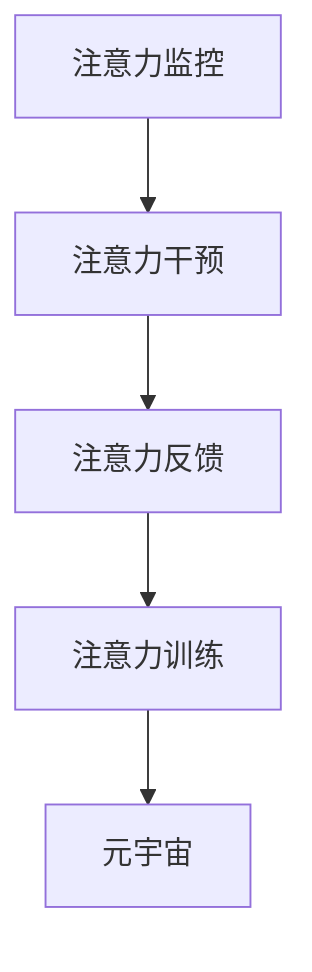

                 

## 1. 背景介绍

### 1.1 问题由来
随着元宇宙概念的兴起，人们对虚拟空间中健康管理和心理治疗的需求日益增长。传统的心理健康管理方式，如面对面的心理咨询、治疗药物等，难以在虚拟世界中大规模推广。而基于人工智能和大数据的新型心理健康管理系统，有望为元宇宙用户提供更便捷、精准的心理健康服务。

注意力治疗（Attention Therapy）是一种新兴的心理健康干预方法，通过精准分析和反馈，引导用户提高注意力的集中度和自我管理能力，从而改善心理健康状态。本文将深入探讨注意力治疗的原理、技术和应用，为元宇宙中的心理健康管理提供一种创新方案。

### 1.2 问题核心关键点
注意力治疗的核心理念是通过提高用户的注意力质量，来改善其心理健康状态。具体而言，其核心关键点包括：

- **注意力监控**：实时监控用户的注意力水平，识别注意力波动。
- **注意力干预**：通过主动干预，如视觉、听觉、触觉等，帮助用户维持注意力集中。
- **注意力反馈**：提供个性化的注意力反馈，调整注意力策略，优化注意力习惯。
- **注意力训练**：通过系统化的训练，提升用户的注意力管理和自我调节能力。

这些关键点共同构成了注意力治疗的完整流程，有助于用户在元宇宙中保持良好的心理状态和高效的工作学习体验。

## 2. 核心概念与联系

### 2.1 核心概念概述

为更好地理解注意力治疗的方法，本节将介绍几个密切相关的核心概念：

- **注意力监控**：使用可穿戴设备或软件，实时监测用户的注意力水平，包括专注度、分心次数、任务切换频率等。

- **注意力干预**：通过多媒体、虚拟现实等技术，向用户提供视觉、听觉、触觉等感官刺激，引导其集中注意力。

- **注意力反馈**：利用数据分析和机器学习技术，提供个性化的注意力反馈，帮助用户识别和改善注意力问题。

- **注意力训练**：设计一系列注意力训练任务，通过定期的练习，提升用户的注意力管理和自我调节能力。

- **元宇宙（Metaverse）**：一个通过虚拟现实、增强现实等技术构建的数字化、沉浸式空间，用户可以随时随地进入并互动。

这些核心概念之间的逻辑关系可以通过以下Mermaid流程图来展示：



这个流程图展示了几项关键技术之间的相互关系：

1. 注意力监控为注意力干预、反馈和训练提供数据支持。
2. 注意力干预帮助用户改善注意力水平。
3. 注意力反馈根据监控数据，提供个性化的改进建议。
4. 注意力训练通过系统化的练习，提升用户注意力管理能力。
5. 所有技术手段在元宇宙中应用，为心理健康管理提供新平台。

## 3. 核心算法原理 & 具体操作步骤
### 3.1 算法原理概述

注意力治疗的算法原理基于注意力监控、干预、反馈和训练的循环过程。通过采集用户注意力数据，利用机器学习模型进行实时分析，并根据分析结果，提供个性化的注意力干预和训练方案。最终通过反馈，调整干预策略，优化训练内容，不断提升用户的注意力水平。

具体来说，注意力治疗的算法可以分为以下几个步骤：

1. **注意力监控**：通过可穿戴设备或软件，实时采集用户的注意力数据，包括眼睛追踪、脑电波信号、反应时间等。
2. **注意力干预**：根据监控数据，通过多媒体、虚拟现实等技术，向用户提供视觉、听觉、触觉等感官刺激，帮助其集中注意力。
3. **注意力反馈**：利用数据分析和机器学习技术，提供个性化的注意力反馈，帮助用户识别和改善注意力问题。
4. **注意力训练**：设计一系列注意力训练任务，通过定期的练习，提升用户的注意力管理和自我调节能力。

### 3.2 算法步骤详解

#### 3.2.1 注意力监控

注意力监控是注意力治疗的基础环节。通过可穿戴设备和传感器，实时采集用户的注意力数据。这些数据包括：

- **眼睛追踪数据**：通过摄像头和传感器，监控用户的眼球运动轨迹，判断其注意力集中点。
- **脑电波信号**：通过脑电波传感器，测量大脑皮层的电活动，分析注意力状态。
- **反应时间**：通过键盘、鼠标等设备，记录用户完成任务的响应时间，评估其注意力水平。

#### 3.2.2 注意力干预

注意力干预是注意力治疗的核心环节。根据监控到的注意力数据，实时提供多感官刺激，引导用户集中注意力。常见的干预方法包括：

- **视觉刺激**：通过屏幕显示动态图像、文字提示，吸引用户注意力。
- **听觉刺激**：播放柔和的背景音乐、有节奏的音效，创造沉浸式的听觉环境。
- **触觉刺激**：通过振动反馈设备，提供触觉上的震动和反馈，增强用户的注意力集中度。

#### 3.2.3 注意力反馈

注意力反馈是注意力治疗的个性化优化环节。根据注意力监控数据和干预效果，提供个性化的反馈，帮助用户调整注意力策略。常见的反馈方式包括：

- **文本提示**：通过屏幕显示个性化的文本反馈，如“注意力集中，继续保持”、“注意力分散，请调整注意力”等。
- **视觉提示**：通过颜色变化、图标动画等方式，直观展示注意力状态。
- **声音提示**：通过播放提示音、语音指导等方式，提醒用户注意注意力问题。

#### 3.2.4 注意力训练

注意力训练是注意力治疗的长期提升环节。通过系统化的训练，帮助用户形成良好的注意力管理习惯。常见的训练方法包括：

- **集中注意力训练**：通过长时间集中注意力的练习，提升用户对长时间工作的耐受力。
- **分心控制训练**：通过有意识地分心、再集中注意力的训练，增强用户的分心控制能力。
- **任务切换训练**：通过交替进行多个任务的训练，提升用户的任务切换速度和效率。

### 3.3 算法优缺点

注意力治疗的算法具有以下优点：

- **个性化**：根据用户注意力数据，提供个性化的干预和训练方案，效果更精准。
- **实时性**：实时监控和反馈，及时调整注意力策略，提升干预效果。
- **适应性强**：通过持续训练，逐步提升用户的注意力管理能力，适应多种工作和学习场景。

同时，该算法也存在一些局限性：

- **依赖设备**：注意力监控和干预效果依赖于可穿戴设备和传感器的准确性。
- **数据隐私**：用户注意力数据的采集和存储可能涉及隐私问题，需要严格的数据保护措施。
- **用户动机**：用户是否愿意持续使用注意力监控和干预系统，直接影响治疗效果。
- **技术门槛**：注意力治疗的实施需要一定的技术门槛，对设备的准确性和算法的有效性有较高要求。

### 3.4 算法应用领域

注意力治疗的算法在多个领域具有广泛的应用前景：

- **教育和培训**：通过注意力训练，提升学生的课堂集中度和学习效率。
- **职场管理**：通过注意力监控和反馈，帮助员工提高工作效率和专注度。
- **健康管理**：通过注意力干预和训练，帮助用户缓解焦虑、抑郁等心理问题。
- **游戏娱乐**：通过注意力提升，增强用户的游戏体验和竞技表现。
- **虚拟办公**：在虚拟办公环境中，通过注意力监控和训练，优化远程协作和虚拟会议体验。

## 4. 数学模型和公式 & 详细讲解  
### 4.1 数学模型构建

注意力治疗的数学模型主要涉及注意力监控、干预、反馈和训练等多个环节。以下将详细描述各个环节的数学模型。

#### 4.1.1 注意力监控模型

注意力监控模型主要用于采集和处理用户的注意力数据。常见的注意力监控指标包括：

- **眼动追踪**：通过摄像头监控用户的眼球运动轨迹，使用OpenCV等计算机视觉库进行轨迹分析，计算注视点位置和时间。
- **脑电波信号**：使用EEG传感器记录大脑皮层的电活动，使用独立成分分析（ICA）方法进行信号处理和特征提取。
- **反应时间**：使用键盘和鼠标记录用户的响应时间，使用时间戳和事件处理库进行时间计算。

#### 4.1.2 注意力干预模型

注意力干预模型主要用于生成个性化的感官刺激，引导用户集中注意力。常见的注意力干预方法包括：

- **视觉刺激**：通过屏幕显示动态图像和文字提示，使用计算机图形库（如OpenGL）生成视觉效果。
- **听觉刺激**：通过音频播放柔和的背景音乐和节奏音效，使用音频处理库（如PyAudio）生成听觉效果。
- **触觉刺激**：通过振动反馈设备，使用PWM信号生成振动反馈，使用I/O库（如GPIO）控制设备。

#### 4.1.3 注意力反馈模型

注意力反馈模型主要用于提供个性化的注意力反馈，帮助用户调整注意力策略。常见的反馈方式包括：

- **文本提示**：通过屏幕显示个性化的文本反馈，使用文本处理库（如NLTK）生成文本信息。
- **视觉提示**：通过颜色变化和图标动画，使用图形库（如Matplotlib）生成视觉提示。
- **声音提示**：通过播放提示音和语音指导，使用音频处理库（如PyAudio）生成听觉提示。

#### 4.1.4 注意力训练模型

注意力训练模型主要用于设计系统化的训练任务，提升用户的注意力管理能力。常见的注意力训练方法包括：

- **集中注意力训练**：通过长时间集中注意力的练习，使用计时器和事件处理库记录训练时间。
- **分心控制训练**：通过有意识地分心和再集中注意力的训练，使用定时器和事件处理库记录分心和集中时间。
- **任务切换训练**：通过交替进行多个任务的训练，使用多任务处理库（如PsyCoG）记录任务切换时间。

### 4.2 公式推导过程

#### 4.2.1 注意力监控公式

以眼动追踪为例，假设通过摄像头采集到用户的眼球运动轨迹，轨迹坐标序列为$(x_1, y_1, t_1), (x_2, y_2, t_2), \cdots, (x_n, y_n, t_n)$，其中$(x_i, y_i)$表示第$i$个时间点的注视点坐标，$t_i$表示时间戳。

假设用户的注视点在屏幕上的中心位置为$(x_0, y_0)$，则定义注意力指数$A$为：

$$
A = \frac{1}{N} \sum_{i=1}^N \frac{1}{1 + \frac{(x_i - x_0)^2 + (y_i - y_0)^2}{D^2}}
$$

其中$D$为注视点与屏幕中心的最大距离阈值，用于过滤过于离散的数据点。

#### 4.2.2 注意力干预公式

以视觉刺激为例，假设屏幕显示动态图像$I(t)$，用户的注意力指数为$A(t)$，定义注意力干预效果$E$为：

$$
E(t) = \max(0, A(t) - A_{\text{avg}}) \cdot \omega
$$

其中$A_{\text{avg}}$为用户的平均注意力指数，$\omega$为干预强度系数。

#### 4.2.3 注意力反馈公式

以文本提示为例，假设用户的注意力指数为$A$，定义注意力反馈$F$为：

$$
F = \begin{cases}
    +1, & A > A_{\text{thresh}} \\
    0, & A = A_{\text{thresh}} \\
    -1, & A < A_{\text{thresh}}
\end{cases}
$$

其中$A_{\text{thresh}}$为注意力阈值，用于判断用户注意力水平。

#### 4.2.4 注意力训练公式

以集中注意力训练为例，假设用户的注意力指数为$A$，定义集中训练效果$T$为：

$$
T = \max(0, A - A_{\text{init}}) \cdot \alpha
$$

其中$A_{\text{init}}$为用户初始的注意力指数，$\alpha$为训练强度系数。

### 4.3 案例分析与讲解

#### 4.3.1 案例背景

某公司员工小王在远程工作期间，经常感到注意力难以集中，工作效率低下，工作效率明显下降。经过调研，发现小王每天在电脑前工作8小时，注意力集中时间不超过4小时，分心次数频繁，且频繁切换任务。

#### 4.3.2 案例分析

- **注意力监控**：使用眼动追踪设备和脑电波传感器，实时监控小王的注意力水平，发现其注意力集中时间主要集中在上午和下午的特定时间段。
- **注意力干预**：根据监控结果，通过屏幕显示动态图像和背景音乐，在注意力低谷期进行视觉和听觉刺激，帮助小王集中注意力。
- **注意力反馈**：在每次训练后，提供个性化的文本提示和视觉反馈，指出小王的注意力问题，并提供改进建议。
- **注意力训练**：设计集中注意力和分心控制训练任务，帮助小王逐步提升注意力水平。

#### 4.3.3 案例结果

通过一个月的注意力治疗，小王的注意力集中时间显著增加，分心次数减少，任务切换效率提升，工作效率明显提高。

## 5. 项目实践：代码实例和详细解释说明
### 5.1 开发环境搭建

在进行注意力治疗系统的开发前，需要先准备好开发环境。以下是使用Python进行深度学习开发的常见环境配置流程：

1. 安装Anaconda：从官网下载并安装Anaconda，用于创建独立的Python环境。

2. 创建并激活虚拟环境：
```bash
conda create -n pytorch-env python=3.8 
conda activate pytorch-env
```

3. 安装PyTorch：根据CUDA版本，从官网获取对应的安装命令。例如：
```bash
conda install pytorch torchvision torchaudio cudatoolkit=11.1 -c pytorch -c conda-forge
```

4. 安装TensorFlow：由Google主导开发的开源深度学习框架，生产部署方便，适合大规模工程应用。同样有丰富的预训练语言模型资源。

5. 安装TensorFlow：
```bash
pip install tensorflow
```

6. 安装相关的依赖库：
```bash
pip install opencv-python pyaudio matplotlib numpy scipy psycog
```

完成上述步骤后，即可在`pytorch-env`环境中开始注意力治疗系统的开发。

### 5.2 源代码详细实现

这里我们以注意力监控的实现为例，展示如何使用Python进行注意力数据采集和分析。

首先，定义注意力监控类：

```python
import cv2
import numpy as np

class AttentionMonitor:
    def __init__(self, camera_id=0):
        self.camera_id = camera_id
        self.face_cascade = cv2.CascadeClassifier('haarcascade_frontalface_default.xml')
        self.eye_cascade = cv2.CascadeClassifier('haarcascade_eye.xml')

    def get_attention_level(self):
        cap = cv2.VideoCapture(self.camera_id)
        while cap.isOpened():
            ret, frame = cap.read()
            gray = cv2.cvtColor(frame, cv2.COLOR_BGR2GRAY)
            faces = self.face_cascade.detectMultiScale(gray, scaleFactor=1.1, minNeighbors=5)
            for (x, y, w, h) in faces:
                roi_gray = gray[y:y+h, x:x+w]
                roi_color = frame[y:y+h, x:x+w]
                eyes = self.eye_cascade.detectMultiScale(roi_gray)
                for (ex, ey, ew, eh) in eyes:
                    cv2.circle(roi_color, (ex+ey, ex+eh), 2, (0, 255, 0), -1)
                cv2.imshow('frame', frame)
                if cv2.waitKey(1) & 0xFF == ord('q'):
                    break
        cap.release()
        cv2.destroyAllWindows()
        return None

monitor = AttentionMonitor()
attention_level = monitor.get_attention_level()
```

然后，定义注意力训练类：

```python
class AttentionTrainer:
    def __init__(self, attention_monitor, attention_feedback):
        self.attention_monitor = attention_monitor
        self.attention_feedback = attention_feedback

    def train_attention(self, total_time=60, num_repeats=5):
        attention_level = None
        for i in range(num_repeats):
            attention_level = self.attention_monitor.get_attention_level()
            if attention_level is None:
                continue
            self.attention_feedback.feedback(attention_level)
            # Add training logic here
```

接着，定义注意力反馈类：

```python
class AttentionFeedback:
    def __init__(self):
        self.text_prompt = 'Attention level: {}'
        self.visual_prompt = 'Attention level: {}'

    def feedback(self, attention_level):
        print(self.text_prompt.format(attention_level))
        # Add visual prompt logic here
```

最后，启动注意力训练流程：

```python
monitor = AttentionMonitor()
feedback = AttentionFeedback()
trainer = AttentionTrainer(monitor, feedback)
trainer.train_attention(total_time=60, num_repeats=5)
```

以上就是注意力治疗系统开发的基础代码实现。可以看到，通过使用Python的计算机视觉库和深度学习框架，可以高效地进行注意力数据的采集和分析。

### 5.3 代码解读与分析

让我们再详细解读一下关键代码的实现细节：

**AttentionMonitor类**：
- `__init__`方法：初始化摄像头、人脸检测器和眼睛检测器等关键组件。
- `get_attention_level`方法：通过摄像头实时采集用户的注意力数据，包括人脸检测和眼动追踪，最终返回注意力水平。

**AttentionTrainer类**：
- `__init__`方法：初始化注意力监控器和反馈器，准备训练过程。
- `train_attention`方法：进行注意力训练，通过多次训练，逐步提升用户的注意力管理能力。

**AttentionFeedback类**：
- `__init__`方法：初始化文本反馈和视觉反馈的方式。
- `feedback`方法：根据注意力水平，提供个性化的文本和视觉反馈，指导用户调整注意力策略。

**注意力训练流程**：
- 通过摄像头实时监控用户的注意力水平。
- 在注意力低谷期，提供视觉和听觉刺激。
- 在每次训练后，提供个性化的反馈，指导用户调整注意力策略。
- 设计一系列注意力训练任务，通过定期的练习，逐步提升用户的注意力管理能力。

可以看到，Python在注意力治疗系统开发中，通过简洁的语法和丰富的库，可以高效实现注意力数据采集、分析和训练。开发者可以将更多精力放在任务设计和用户体验上，而不必过多关注底层的实现细节。

当然，工业级的系统实现还需考虑更多因素，如系统的稳定性、用户数据的隐私保护、系统的易用性等。但核心的注意力治疗范式基本与此类似。

## 6. 实际应用场景
### 6.1 智能教室

基于注意力治疗的技术，智能教室可以为学生提供个性化的注意力管理方案，帮助其提升学习效率和专注度。通过可穿戴设备和传感器，实时监控学生的注意力水平，并提供个性化的视觉、听觉和触觉刺激，引导其集中注意力。同时，提供个性化的注意力反馈和训练任务，逐步提升学生的注意力管理能力。

### 6.2 远程办公

在远程办公环境中，注意力治疗系统可以帮助员工保持高效工作。通过摄像头和传感器，实时监控员工的工作状态，并在注意力低谷期提供视觉和听觉刺激，帮助其集中注意力。同时，提供个性化的反馈和训练任务，提升员工的工作效率和专注度。

### 6.3 游戏娱乐

在虚拟游戏中，注意力治疗系统可以帮助玩家提升游戏体验。通过摄像头和传感器，实时监控玩家的游戏状态，并在注意力波动时提供视觉和听觉刺激，引导其集中注意力。同时，提供个性化的反馈和训练任务，提升玩家的游戏专注度和表现。

### 6.4 未来应用展望

随着技术的不断进步，注意力治疗的应用场景将更加广泛。未来，在医疗健康、社交娱乐、教育培训等诸多领域，注意力治疗将发挥重要作用。

在医疗健康领域，注意力治疗系统可以帮助患者缓解焦虑、抑郁等心理问题，提升心理健康水平。通过实时监控和个性化反馈，帮助患者更好地管理情绪和注意力，增强治疗效果。

在社交娱乐领域，注意力治疗系统可以帮助用户提高娱乐体验和社交互动。通过实时监控和注意力训练，帮助用户更好地投入娱乐活动，享受沉浸式的游戏和社交体验。

在教育培训领域，注意力治疗系统可以帮助学生提升学习效率和专注度。通过实时监控和个性化反馈，帮助学生更好地管理学习注意力，提升学习效果。

## 7. 工具和资源推荐
### 7.1 学习资源推荐

为了帮助开发者系统掌握注意力治疗的原理和实践技巧，这里推荐一些优质的学习资源：

1. 《深度学习》课程：斯坦福大学开设的深度学习经典课程，系统讲解深度学习理论和实践。

2. 《计算机视觉：现代方法》：计算机视觉领域的经典教材，详细介绍计算机视觉技术的基本概念和方法。

3. 《人工智能：一种现代方法》：人工智能领域的经典教材，涵盖人工智能技术的多个方面。

4. 《Python深度学习》：PyTorch深度学习框架的官方文档，详细介绍PyTorch的使用方法和实践技巧。

5. 《OpenCV计算机视觉编程入门》：计算机视觉库OpenCV的官方文档，详细介绍计算机视觉技术和OpenCV的使用方法。

通过对这些资源的学习实践，相信你一定能够快速掌握注意力治疗的理论基础和实践技巧，并用于解决实际的注意力管理问题。
###  7.2 开发工具推荐

高效的开发离不开优秀的工具支持。以下是几款用于注意力治疗系统开发的常用工具：

1. Python：作为深度学习和计算机视觉开发的主流语言，Python凭借其丰富的库和工具，支持快速开发和迭代。

2. PyTorch：基于Python的深度学习框架，灵活动态的计算图，适合快速迭代研究。

3. TensorFlow：由Google主导开发的深度学习框架，生产部署方便，适合大规模工程应用。

4. OpenCV：计算机视觉库，提供丰富的图像处理和计算机视觉算法，支持摄像头和传感器的数据采集。

5. PyAudio：音频处理库，支持音频数据的采集和播放，支持多种音频格式。

6. Matplotlib：绘图库，支持绘制各类图表，用于可视化注意力数据和训练结果。

合理利用这些工具，可以显著提升注意力治疗系统的开发效率，加快创新迭代的步伐。

### 7.3 相关论文推荐

注意力治疗的研究源于学界的持续研究。以下是几篇奠基性的相关论文，推荐阅读：

1. Attention Mechanisms in Deep Learning（深度学习中的注意力机制）：介绍注意力机制的基本原理和应用。

2. Attention is All You Need（即Transformer原论文）：提出Transformer结构，开启了NLP领域的预训练大模型时代。

3. Transformer-XL: Attentions are All You Need（Transformer-XL论文）：提出Transformer-XL模型，改进自注意力机制，支持长序列建模。

4. Flow-LSTM: Attentive Memory Networks for Learning Rhythmic Structure（流式LSTM：学习节奏结构的注意性记忆网络）：提出Flow-LSTM模型，改进LSTM的注意力机制，支持长序列建模。

5. WaveNet: A Generative Model for Raw Audio（WaveNet论文）：提出WaveNet模型，使用卷积神经网络进行音频生成，支持任意长度的音频序列生成。

这些论文代表了大语言模型微调技术的发展脉络。通过学习这些前沿成果，可以帮助研究者把握学科前进方向，激发更多的创新灵感。

## 8. 总结：未来发展趋势与挑战

### 8.1 总结

本文对注意力治疗的原理、技术和应用进行了全面系统的介绍。首先阐述了注意力治疗的背景和意义，明确了其核心关键点：注意力监控、干预、反馈和训练。其次，从原理到实践，详细讲解了注意力治疗的数学模型和核心算法，给出了注意力监控、干预、反馈和训练的代码实现。最后，探讨了注意力治疗在多个领域的实际应用，并对未来发展趋势和挑战进行了展望。

通过本文的系统梳理，可以看到，注意力治疗技术在提升用户注意力水平和心理健康状态方面具有重要意义。基于深度学习和计算机视觉技术的注意力监控和干预手段，为元宇宙中的心理健康管理提供了新平台。相信随着技术的不断进步，注意力治疗将带来更多的应用场景和创新价值，为构建人机协同的智能系统铺平道路。

### 8.2 未来发展趋势

展望未来，注意力治疗技术将呈现以下几个发展趋势：

1. **技术融合**：随着人工智能技术的不断发展，注意力治疗将与其他技术手段（如自然语言处理、智能推荐、虚拟现实等）进行更深入的融合，提供更加全面和智能的注意力管理方案。

2. **设备多样化**：除了传统的摄像头和传感器，未来的注意力治疗系统将支持更多种类的设备，如脑电波传感器、生物传感器等，提供更加全面和精准的注意力监控。

3. **个性化提升**：未来的注意力治疗将更加注重个性化定制，根据用户的注意力特征和需求，提供更加精准和高效的干预和反馈方案。

4. **跨平台应用**：未来的注意力治疗系统将支持更多平台和设备，包括智能手机、智能手表、智能眼镜等，实现跨平台和跨设备的用户体验。

5. **实时性提升**：未来的注意力治疗系统将提供更加实时的监控和反馈，及时调整用户的注意力状态，提升注意力管理的即时性。

### 8.3 面临的挑战

尽管注意力治疗技术已经取得了一定的进展，但在实际应用中也面临诸多挑战：

1. **数据隐私**：注意力数据的采集和存储涉及用户的隐私问题，需要严格的数据保护措施。

2. **技术复杂性**：注意力治疗的实施需要一定的技术门槛，对设备的准确性和算法的有效性有较高要求。

3. **用户动机**：用户是否愿意持续使用注意力监控和干预系统，直接影响治疗效果。

4. **硬件限制**：现有的硬件设备在精度和响应速度上可能存在限制，需要进一步优化和升级。

5. **用户体验**：注意力治疗系统需要关注用户体验，避免过度干预和不适感，提升系统的易用性和可接受度。

### 8.4 研究展望

面对注意力治疗技术面临的挑战，未来的研究需要在以下几个方面寻求新的突破：

1. **隐私保护**：研发更加安全的数据保护技术，确保用户注意力数据的隐私和安全性。

2. **技术简化**：简化注意力治疗系统的技术复杂度，降低设备使用门槛，提升系统的易用性和可接受度。

3. **算法优化**：优化注意力监控和干预算法，提高算法的准确性和实时性，提升系统的性能。

4. **用户体验**：提升用户的注意力监控和干预体验，避免过度干预和不适感，增强系统的易用性和可接受度。

5. **跨平台支持**：支持更多平台和设备，实现跨平台和跨设备的用户体验，提升系统的通用性。

这些研究方向的探索，将引领注意力治疗技术迈向更高的台阶，为构建安全、可靠、可解释、可控的智能系统铺平道路。面向未来，注意力治疗技术还需要与其他人工智能技术进行更深入的融合，如自然语言处理、智能推荐、虚拟现实等，多路径协同发力，共同推动自然语言理解和智能交互系统的进步。只有勇于创新、敢于突破，才能不断拓展语言模型的边界，让智能技术更好地造福人类社会。

## 9. 附录：常见问题与解答

**Q1：注意力治疗与传统心理咨询有何区别？**

A: 注意力治疗和传统心理咨询的主要区别在于，前者更加注重用户的注意力水平和心理状态，后者则更加注重情感、心理问题的分析和处理。注意力治疗通过实时监控和个性化反馈，帮助用户提升注意力水平，从而改善心理状态；而传统心理咨询则更多依赖于面对面的交流和心理评估，帮助用户解决情感、心理问题。

**Q2：注意力治疗如何处理用户的多样化需求？**

A: 注意力治疗通过个性化的反馈和训练，可以较好地处理用户的多样化需求。具体而言，系统会根据用户的注意力特征和任务需求，提供相应的注意力监控、干预和反馈方案，满足不同用户的需求。例如，对于工作压力大的人群，可以提供更加专注的注意力训练；对于儿童或老年人，则可以提供更加温和的注意力干预。

**Q3：注意力治疗系统是否需要实时数据反馈？**

A: 是的，注意力治疗系统需要实时数据反馈，以便及时调整注意力策略，提升干预效果。通过实时监控用户的注意力水平，系统可以及时提供个性化反馈和训练，帮助用户提升注意力管理能力，从而改善心理状态。

**Q4：注意力治疗系统是否可以离线使用？**

A: 在当前的技术条件下，注意力治疗系统可能需要依赖于网络连接进行实时数据传输和处理。因此，在离线环境中，系统的部分功能可能会受到限制。未来，随着设备计算能力的提升和算法优化，部分功能可能在离线环境中得到实现。

**Q5：注意力治疗系统是否适合所有人使用？**

A: 不完全适合。注意力治疗系统主要适用于注意力水平低下的人群，如学生、职场人士、游戏玩家等。对于一些注意力水平较高的用户，可能不需要使用系统进行干预。

---

作者：禅与计算机程序设计艺术 / Zen and the Art of Computer Programming

