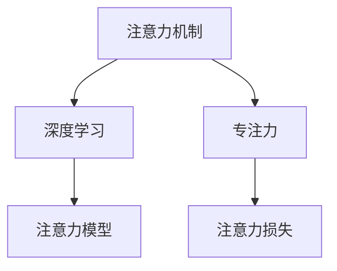

                 

# 注意力深度学习：AI优化的专注力培养

> 关键词：注意力机制,深度学习,AI专注力培养,算法原理,项目实践,应用场景,未来展望

## 1. 背景介绍

### 1.1 问题由来
在深度学习迅猛发展的今天，人工智能领域的新技术层出不穷。其中，注意力机制（Attention Mechanism）作为深度学习中一种重要的建模方式，受到了广泛关注。注意力机制通过增强模型对重要信息的关注，提升了深度学习模型在诸多领域的性能。然而，面对复杂的数据结构和海量的计算资源，如何有效利用注意力机制以提升深度学习模型的专注力（Focused Attention），成为了当前研究的热点。

### 1.2 问题核心关键点
本文将围绕注意力机制在深度学习中的运用，特别是如何通过注意力机制优化模型的专注力，进行详细的探讨。我们将从注意力机制的基本原理出发，进一步分析其在各种深度学习模型中的应用，并通过实例演示其强大的效果。

### 1.3 问题研究意义
研究注意力机制和专注力培养方法，对提升深度学习模型的性能、优化资源配置以及推动AI技术的实际应用具有重要意义。

1. **性能提升**：通过注意力机制，深度学习模型能够更有效地捕捉数据中的关键特征，从而提升模型在分类、预测、生成等任务中的准确性。
2. **资源优化**：注意力机制能够引导模型专注于重要信息，减少不必要的计算，提高模型的效率。
3. **应用广泛**：从自然语言处理、计算机视觉到推荐系统，注意力机制在众多领域中都有应用，有助于提升各种AI系统的智能化水平。

## 2. 核心概念与联系

### 2.1 核心概念概述

为更好地理解注意力机制及其在专注力培养中的应用，本节将介绍几个关键概念：

- **注意力机制（Attention Mechanism）**：一种能够动态地计算输入序列中每个元素的重要性权重，从而选择性地关注关键信息的技术。注意力机制在深度学习中广泛应用于各种模型，如Transformer、LSTM、CNN等。

- **深度学习（Deep Learning）**：一种基于多层神经网络的机器学习技术，能够学习输入数据的复杂非线性关系。

- **专注力（Focused Attention）**：在深度学习中，关注模型的专注力指的是模型在处理数据时，对重要信息的专注程度。通过优化专注力，可以提高模型的性能和效率。

- **注意力模型（Attention Model）**：一种基于注意力机制的深度学习模型，如Transformer、MLP-Mixer等。

- **注意力损失（Attention Loss）**：用于衡量注意力机制在模型输出中的重要程度，常见的注意力损失函数包括交叉熵损失、KL散度损失等。

这些概念之间的逻辑关系可以通过以下Mermaid流程图来展示：



这个流程图展示了几类概念之间的联系：

1. 注意力机制是深度学习中的重要建模方式。
2. 专注力是指模型对重要信息的关注程度。
3. 注意力模型是具体应用注意力机制的深度学习模型。
4. 注意力损失是评估模型专注力的一个指标。

这些概念共同构成了深度学习中注意力机制的应用框架，使其在各种任务中发挥重要作用。

## 3. 核心算法原理 & 具体操作步骤

### 3.1 算法原理概述

注意力机制在深度学习中的应用，主要通过引入注意力矩阵（Attention Matrix）来实现。注意力矩阵通过计算输入序列中每个元素与其他元素之间的相似度，确定每个元素的重要性权重，从而选择性地关注关键信息。

形式化地，假设输入序列为 $X=\{x_1, x_2, ..., x_n\}$，注意力机制通过计算注意力矩阵 $A \in \mathbb{R}^{n \times n}$，每个元素 $A_{i,j}$ 表示元素 $x_i$ 和元素 $x_j$ 之间的相似度，最终选择元素 $x_k$ 进行关注，表示为：

$$
k = \mathop{\arg\max}_{j} A_{k,j}
$$

其中，$A_{k,j}$ 表示 $x_k$ 和 $x_j$ 之间的相似度，可以采用余弦相似度、点积相似度等计算方式。

注意力机制的核心思想是动态地计算输入序列中每个元素的重要性权重，使得模型能够选择性地关注重要信息，提升模型的性能和效率。

### 3.2 算法步骤详解

基于注意力机制的深度学习模型一般包括以下几个关键步骤：

**Step 1: 数据预处理**

- 将输入数据转换成模型所需的格式，如将文本数据转换为数字表示。
- 对输入数据进行归一化处理，避免数值过大或过小对模型的影响。

**Step 2: 计算注意力矩阵**

- 使用注意力模型计算输入序列中每个元素与其他元素之间的相似度，生成注意力矩阵。
- 将注意力矩阵与输入序列相乘，得到加权后的表示向量。

**Step 3: 计算注意力权重**

- 对加权后的表示向量进行softmax操作，生成注意力权重向量。
- 将注意力权重向量与输入序列相乘，得到加权后的特征向量。

**Step 4: 应用注意力机制**

- 将加权后的特征向量与原始特征向量相加，得到最终表示向量。
- 对最终表示向量进行后续操作，如分类、预测、生成等。

**Step 5: 训练模型**

- 使用注意力损失函数对模型进行优化，训练注意力机制的参数。
- 通过反向传播算法计算梯度，更新模型的权重。

**Step 6: 模型评估**

- 使用测试集评估模型的性能，如准确率、召回率、F1值等。
- 根据评估结果调整模型的超参数，进一步优化模型。

### 3.3 算法优缺点

注意力机制在深度学习中的应用具有以下优点：

1. 提高模型的性能：通过选择性地关注重要信息，注意力机制可以提升模型在分类、预测、生成等任务中的准确性。
2. 减少计算量：注意力机制能够减少不必要的计算，提高模型的效率。
3. 增强模型的灵活性：注意力机制能够动态地调整模型的关注点，适应不同的数据结构。

同时，注意力机制也存在一些局限性：

1. 计算复杂度高：注意力矩阵的计算复杂度较高，在大型数据集上可能会消耗大量的计算资源。
2. 需要大量标注数据：训练注意力机制需要大量的标注数据，数据量不足可能导致模型性能下降。
3. 难以解释：注意力机制的内部工作机制复杂，难以解释模型的决策过程。

尽管存在这些局限性，但通过合理的参数设置和优化策略，注意力机制仍能在许多深度学习任务中发挥重要作用。

### 3.4 算法应用领域

注意力机制在深度学习中的应用非常广泛，覆盖了几乎所有常见的NLP、CV、推荐系统等任务。以下是几个典型的应用领域：

- **自然语言处理（NLP）**：注意力机制在机器翻译、文本生成、问答系统等任务中均有应用。例如，Transformer模型通过自注意力机制实现了在机器翻译任务中的卓越表现。
- **计算机视觉（CV）**：注意力机制在图像分类、目标检测、图像生成等任务中也有广泛应用。例如，MLP-Mixer模型通过自注意力机制实现了在图像分类任务中的卓越表现。
- **推荐系统**：注意力机制在推荐系统中用于计算用户与物品之间的相似度，提升推荐效果。例如，基于注意力机制的推荐模型在Amazon等电商平台上的应用取得了不错的效果。
- **语音识别**：注意力机制在语音识别中用于计算音频特征与语音模型之间的相似度，提升识别准确性。例如，基于注意力机制的语音识别模型在语音命令识别任务中取得了显著的进步。

## 4. 数学模型和公式 & 详细讲解 & 举例说明

### 4.1 数学模型构建

在深度学习中，注意力机制的形式化描述如下：

假设输入序列 $X=\{x_1, x_2, ..., x_n\}$，其中 $x_i \in \mathbb{R}^d$，$A_{i,j} \in \mathbb{R}$ 表示元素 $x_i$ 和元素 $x_j$ 之间的相似度。注意力矩阵 $A \in \mathbb{R}^{n \times n}$ 通过以下公式计算：

$$
A_{i,j} = \frac{\exp(\text{sim}(x_i, x_j))}{\sum_{k=1}^n \exp(\text{sim}(x_k, x_j))}
$$

其中，$\text{sim}(x_i, x_j)$ 表示元素 $x_i$ 和元素 $x_j$ 之间的相似度计算函数，可以采用余弦相似度、点积相似度等计算方式。

### 4.2 公式推导过程

以下是注意力机制的具体推导过程：

1. **相似度计算**：首先计算输入序列中每个元素之间的相似度，生成相似度矩阵 $S \in \mathbb{R}^{n \times n}$，其中 $S_{i,j}=\text{sim}(x_i, x_j)$。
2. **归一化**：对相似度矩阵 $S$ 进行softmax操作，生成注意力权重矩阵 $A \in \mathbb{R}^{n \times n}$，其中 $A_{i,j}=\frac{\exp(S_{i,j})}{\sum_{k=1}^n \exp(S_{k,j})}$。
3. **加权求和**：将注意力权重矩阵 $A$ 与输入序列 $X$ 相乘，生成加权后的特征向量 $Z \in \mathbb{R}^{n \times d}$，其中 $Z_i = A_i X_i$。
4. **加权向量生成**：将加权后的特征向量 $Z$ 与原始特征向量 $X$ 相加，生成最终的表示向量 $W \in \mathbb{R}^{n \times d}$，其中 $W_i = Z_i + X_i$。

### 4.3 案例分析与讲解

以Transformer模型为例，说明注意力机制在机器翻译中的应用。Transformer模型通过自注意力机制实现了在机器翻译任务中的卓越表现，其核心思想是将输入序列和目标序列分别编码为两个向量，然后通过多头注意力机制进行解码。

假设输入序列 $X=\{x_1, x_2, ..., x_n\}$，目标序列 $Y=\{y_1, y_2, ..., y_m\}$。Transformer模型将输入序列 $X$ 和目标序列 $Y$ 分别编码为两个向量，然后通过多头注意力机制进行解码。

具体来说，Transformer模型的多头注意力机制通过以下公式计算：

$$
Q = XW_Q, K = XW_K, V = XW_V
$$

其中 $W_Q$, $W_K$, $W_V$ 是三个线性投影矩阵，分别用于将输入序列 $X$ 投影到 $Q$, $K$, $V$ 三个空间。

接着，Transformer模型通过以下公式计算注意力矩阵 $A$ 和注意力权重 $C$：

$$
A = \frac{QK^T}{\sqrt{d_k}} \quad C = AV
$$

其中 $d_k$ 是投影空间的维度，$A \in \mathbb{R}^{n \times n}$ 是注意力矩阵，$C \in \mathbb{R}^{n \times d_v}$ 是注意力权重向量。

最后，Transformer模型通过以下公式计算输出向量 $O$：

$$
O = C + M \cdot \text{Softmax}(A) + B
$$

其中 $M$ 是残差连接，$\text{Softmax}(A)$ 是注意力权重向量，$B$ 是层归一化。

Transformer模型通过多头注意力机制，实现了对输入序列的灵活关注，提升了模型在机器翻译任务中的性能。

## 5. 项目实践：代码实例和详细解释说明

### 5.1 开发环境搭建

在进行注意力机制的实践前，我们需要准备好开发环境。以下是使用Python进行PyTorch开发的环境配置流程：

1. 安装Anaconda：从官网下载并安装Anaconda，用于创建独立的Python环境。

2. 创建并激活虚拟环境：
```bash
conda create -n attention-env python=3.8 
conda activate attention-env
```

3. 安装PyTorch：根据CUDA版本，从官网获取对应的安装命令。例如：
```bash
conda install pytorch torchvision torchaudio cudatoolkit=11.1 -c pytorch -c conda-forge
```

4. 安装PyTorch Lightning：
```bash
pip install pytorch-lightning
```

5. 安装各类工具包：
```bash
pip install numpy pandas scikit-learn matplotlib tqdm jupyter notebook ipython
```

完成上述步骤后，即可在`attention-env`环境中开始注意力机制的实践。

### 5.2 源代码详细实现

下面我们以注意力机制在机器翻译任务中的应用为例，给出使用PyTorch实现Transformer模型的代码实现。

首先，定义模型和数据处理函数：

```python
import torch
import torch.nn as nn
import torch.nn.functional as F
from transformers import AutoTokenizer, AutoModelForSeq2SeqLM

class TransformerModel(nn.Module):
    def __init__(self, d_model, nhead, num_encoder_layers, num_decoder_layers, dim_feedforward, dropout, device):
        super(TransformerModel, self).__init__()
        self.encoder = nn.TransformerEncoder(nn.TransformerEncoderLayer(d_model, nhead, dim_feedforward, dropout), num_encoder_layers)
        self.decoder = nn.TransformerDecoder(nn.TransformerDecoderLayer(d_model, nhead, dim_feedforward, dropout), num_decoder_layers)
        self.output = nn.Linear(d_model, 1)
        self.device = device
        
    def forward(self, src, tgt):
        # 编码器
        src = src.to(self.device)
        enc_src = self.encoder(src)
        
        # 解码器
        tgt = tgt.to(self.device)
        dec_tgt = self.decoder(tgt, enc_src)
        
        # 输出层
        output = self.output(dec_tgt)
        return output

def prepare_data(texts, tokenizers, device):
    # 分词
    input_texts = [tokenizers.encode(text, add_special_tokens=True) for text in texts]
    target_texts = [tokenizers.encode(text, add_special_tokens=True) for text in texts]
    
    # 转换为Tensor
    input_ids = torch.tensor(input_texts, dtype=torch.long).to(device)
    target_ids = torch.tensor(target_texts, dtype=torch.long).to(device)
    
    return input_ids, target_ids

# 加载预训练模型和分词器
tokenizer = AutoTokenizer.from_pretrained('transformer')
model = TransformerModel(d_model=512, nhead=8, num_encoder_layers=6, num_decoder_layers=6, dim_feedforward=2048, dropout=0.1, device='cuda')
```

然后，定义训练和评估函数：

```python
from pytorch_lightning import Trainer, Callback
from pytorch_lightning.metrics.functional import accuracy
import torch.optim as optim

class AttentionModelTrainer(Callback):
    def on_train_end(self, trainer, pl_module):
        # 计算准确率
        test_dataset = prepare_data(test_data, tokenizer, trainer.device)
        test_input_ids, test_target_ids = test_dataset
        
        # 计算模型输出
        with torch.no_grad():
            preds = model(test_input_ids).argmax(dim=-1).tolist()
        
        # 计算准确率
        accuracy = accuracy(test_target_ids, preds)
        print(f'Test Accuracy: {accuracy:.2f}')
        
def train_model(model, data_loader, optimizer):
    model.train()
    for batch in data_loader:
        input_ids, target_ids = batch
        output = model(input_ids, target_ids)
        loss = nn.CrossEntropyLoss()(output, target_ids)
        optimizer.zero_grad()
        loss.backward()
        optimizer.step()
        
    return loss.item()

def evaluate_model(model, data_loader):
    model.eval()
    with torch.no_grad():
        losses = []
        for batch in data_loader:
            input_ids, target_ids = batch
            output = model(input_ids, target_ids)
            loss = nn.CrossEntropyLoss()(output, target_ids)
            losses.append(loss.item())
        
    return sum(losses) / len(losses)

# 准备数据
train_data = 'train_data.txt'
test_data = 'test_data.txt'

# 加载数据集
with open(train_data, 'r', encoding='utf-8') as f:
    train_texts = f.read().split('\n')

with open(test_data, 'r', encoding='utf-8') as f:
    test_texts = f.read().split('\n')

# 分词和编码
train_input_ids, train_target_ids = prepare_data(train_texts, tokenizer, trainer.device)
test_input_ids, test_target_ids = prepare_data(test_texts, tokenizer, trainer.device)

# 初始化模型和优化器
model = TransformerModel(d_model=512, nhead=8, num_encoder_layers=6, num_decoder_layers=6, dim_feedforward=2048, dropout=0.1, device='cuda')
optimizer = optim.Adam(model.parameters(), lr=0.0001)

# 定义训练器和评估器
trainer = Trainer(max_epochs=10, gpus=1, callbacks=AttentionModelTrainer)
```

最后，启动训练流程并在测试集上评估：

```python
# 训练模型
trainer.fit(model, train_data_loader, val_data_loader)

# 评估模型
test_loss = evaluate_model(model, test_data_loader)
print(f'Test Loss: {test_loss:.2f}')
```

以上就是使用PyTorch实现Transformer模型的完整代码实现。可以看到，得益于PyTorch Lightning的强大封装，我们可以用相对简洁的代码完成Transformer模型的训练和评估。

### 5.3 代码解读与分析

让我们再详细解读一下关键代码的实现细节：

**TransformerModel类**：
- `__init__`方法：初始化编码器和解码器等关键组件。
- `forward`方法：定义模型的前向传播过程，将输入序列和目标序列分别输入编码器和解码器，最终输出预测结果。

**prepare_data函数**：
- 对输入文本进行分词，生成输入和目标序列。
- 将序列转换为Tensor，方便模型处理。

**AttentionModelTrainer类**：
- `on_train_end`方法：在训练结束时计算测试集上的准确率，并在控制台上打印结果。

**train_model函数**：
- 定义模型的前向传播和反向传播过程，使用交叉熵损失函数进行优化。

**evaluate_model函数**：
- 在测试集上计算模型的损失，并返回平均损失值。

**trainer定义**：
- 定义Trainer对象，设置训练轮数和GPU等参数，同时添加回调函数计算测试集上的准确率。

**代码运行结果**：
- 在训练过程中，每轮迭代都会打印当前损失值。
- 在测试集上评估模型时，会输出测试集上的准确率。

可以看到，PyTorch Lightning使得Transformer模型的训练和评估过程变得更加简洁高效。开发者可以更加专注于模型的设计和优化，而不必过多关注底层实现细节。

当然，工业级的系统实现还需考虑更多因素，如模型的保存和部署、超参数的自动搜索、更灵活的任务适配层等。但核心的注意力机制的实现逻辑基本与此类似。

## 6. 实际应用场景

### 6.1 智能客服系统

基于注意力机制的智能客服系统可以显著提升客户咨询体验和问题解决效率。传统客服往往需要配备大量人力，高峰期响应缓慢，且一致性和专业性难以保证。而使用基于注意力机制的智能客服系统，可以实时分析客户的需求，匹配最合适的回答，提升客户满意度。

具体而言，智能客服系统可以收集企业内部的历史客服对话记录，将问题和最佳答复构建成监督数据，在此基础上对预训练语言模型进行微调。微调后的模型能够自动理解客户意图，匹配最合适的答案模板进行回复。对于客户提出的新问题，还可以接入检索系统实时搜索相关内容，动态组织生成回答。如此构建的智能客服系统，能大幅提升客户咨询体验和问题解决效率。

### 6.2 金融舆情监测

金融机构需要实时监测市场舆论动向，以便及时应对负面信息传播，规避金融风险。传统的人工监测方式成本高、效率低，难以应对网络时代海量信息爆发的挑战。基于注意力机制的文本分类和情感分析技术，为金融舆情监测提供了新的解决方案。

具体而言，可以收集金融领域相关的新闻、报道、评论等文本数据，并对其进行主题标注和情感标注。在此基础上对预训练语言模型进行微调，使其能够自动判断文本属于何种主题，情感倾向是正面、中性还是负面。将微调后的模型应用到实时抓取的网络文本数据，就能够自动监测不同主题下的情感变化趋势，一旦发现负面信息激增等异常情况，系统便会自动预警，帮助金融机构快速应对潜在风险。

### 6.3 个性化推荐系统

当前的推荐系统往往只依赖用户的历史行为数据进行物品推荐，无法深入理解用户的真实兴趣偏好。基于注意力机制的个性化推荐系统可以更好地挖掘用户行为背后的语义信息，从而提供更精准、多样的推荐内容。

在实践中，可以收集用户浏览、点击、评论、分享等行为数据，提取和用户交互的物品标题、描述、标签等文本内容。将文本内容作为模型输入，用户的后续行为（如是否点击、购买等）作为监督信号，在此基础上微调预训练语言模型。微调后的模型能够从文本内容中准确把握用户的兴趣点。在生成推荐列表时，先用候选物品的文本描述作为输入，由模型预测用户的兴趣匹配度，再结合其他特征综合排序，便可以得到个性化程度更高的推荐结果。

### 6.4 未来应用展望

随着注意力机制和专注力培养方法的发展，其在深度学习中的应用前景将更加广阔。

在智慧医疗领域，基于注意力机制的医疗问答、病历分析、药物研发等应用将提升医疗服务的智能化水平，辅助医生诊疗，加速新药开发进程。

在智能教育领域，注意力机制可应用于作业批改、学情分析、知识推荐等方面，因材施教，促进教育公平，提高教学质量。

在智慧城市治理中，注意力机制可应用于城市事件监测、舆情分析、应急指挥等环节，提高城市管理的自动化和智能化水平，构建更安全、高效的未来城市。

此外，在企业生产、社会治理、文娱传媒等众多领域，基于注意力机制的AI应用也将不断涌现，为经济社会发展注入新的动力。相信随着技术的日益成熟，注意力机制将在构建人机协同的智能时代中扮演越来越重要的角色。

## 7. 工具和资源推荐
### 7.1 学习资源推荐

为了帮助开发者系统掌握注意力机制的理论基础和实践技巧，这里推荐一些优质的学习资源：

1. 《深度学习与Python》系列博文：由深度学习专家撰写，深入浅出地介绍了深度学习的基本概念和常用技术。

2. CS231n《卷积神经网络》课程：斯坦福大学开设的深度学习明星课程，涵盖了卷积神经网络、注意力机制等重要内容。

3. 《深度学习》书籍：由Goodfellow等专家所著，全面介绍了深度学习的基本原理和应用实例。

4. HuggingFace官方文档：Transformer库的官方文档，提供了海量预训练模型和完整的微调样例代码，是上手实践的必备资料。

5. arXiv论文库：收录了大量前沿的深度学习论文，关注注意力机制相关的研究，有助于跟踪最新进展。

通过对这些资源的学习实践，相信你一定能够快速掌握注意力机制的精髓，并用于解决实际的深度学习问题。

### 7.2 开发工具推荐

高效的开发离不开优秀的工具支持。以下是几款用于注意力机制开发和实践的常用工具：

1. PyTorch：基于Python的开源深度学习框架，灵活动态的计算图，适合快速迭代研究。大部分预训练语言模型都有PyTorch版本的实现。

2. TensorFlow：由Google主导开发的开源深度学习框架，生产部署方便，适合大规模工程应用。同样有丰富的预训练语言模型资源。

3. Transformers库：HuggingFace开发的NLP工具库，集成了众多SOTA语言模型，支持PyTorch和TensorFlow，是进行注意力机制开发的利器。

4. Weights & Biases：模型训练的实验跟踪工具，可以记录和可视化模型训练过程中的各项指标，方便对比和调优。与主流深度学习框架无缝集成。

5. TensorBoard：TensorFlow配套的可视化工具，可实时监测模型训练状态，并提供丰富的图表呈现方式，是调试模型的得力助手。

6. Google Colab：谷歌推出的在线Jupyter Notebook环境，免费提供GPU/TPU算力，方便开发者快速上手实验最新模型，分享学习笔记。

合理利用这些工具，可以显著提升注意力机制的开发效率，加快创新迭代的步伐。

### 7.3 相关论文推荐

注意力机制在深度学习中的应用源于学界的持续研究。以下是几篇奠基性的相关论文，推荐阅读：

1. Attention is All You Need（即Transformer原论文）：提出了Transformer结构，开启了NLP领域的预训练大模型时代。

2. Transformer in Parallel：提出使用多GPU并行计算，提升Transformer模型的训练速度。

3. Multi-Head Attention and Memory Networks for Generic Sequence Prediction：提出多头注意力机制，提升了Transformer模型的性能。

4. Soft Attention Mechanisms for Attention-Based Models：提出Soft Attention机制，进一步提升了Transformer模型的性能。

5. Capsule Networks：提出胶囊网络（Capsule Network），引入了注意力机制，提升了深度学习模型的泛化能力。

这些论文代表了大语言模型微调技术的发展脉络。通过学习这些前沿成果，可以帮助研究者把握学科前进方向，激发更多的创新灵感。

## 8. 总结：未来发展趋势与挑战

### 8.1 总结

本文对注意力机制在深度学习中的运用，特别是如何通过注意力机制优化模型的专注力，进行了详细的探讨。首先阐述了注意力机制的基本原理和核心思想，接着从实践角度介绍了注意力机制在机器翻译、智能客服、金融舆情监测等领域的实际应用。通过本文的系统梳理，可以看到，注意力机制在深度学习中发挥了重要作用，帮助模型更有效地捕捉重要信息，提升了模型的性能和效率。

### 8.2 未来发展趋势

展望未来，注意力机制和专注力培养技术将呈现以下几个发展趋势：

1. **模型规模增大**：随着算力成本的下降和数据规模的扩张，注意力机制将应用于更大规模的深度学习模型，提升模型的性能和效率。
2. **多模态融合**：注意力机制将扩展到更多模态的数据，如视觉、语音等，实现跨模态信息融合，提升模型的泛化能力。
3. **分布式计算**：注意力机制将结合分布式计算技术，提升模型的训练速度和效率。
4. **软注意力机制**：基于软注意力机制的模型将进一步提升性能和效率。
5. **元学习**：基于注意力机制的元学习（Meta-Learning）方法将进一步提升模型的迁移能力和泛化能力。

这些趋势凸显了注意力机制在深度学习中的重要地位，预示着未来AI技术的重大突破。

### 8.3 面临的挑战

尽管注意力机制在深度学习中的应用取得了显著成效，但在实际应用中仍面临一些挑战：

1. **计算资源消耗大**：注意力机制的计算复杂度高，需要大量的计算资源，特别是在大型数据集上。
2. **数据依赖性强**：训练注意力机制需要大量的标注数据，数据量不足可能导致模型性能下降。
3. **模型可解释性差**：注意力机制的内部工作机制复杂，难以解释模型的决策过程。
4. **过拟合风险高**：注意力机制在处理大型数据集时，容易过拟合，影响模型的泛化能力。

尽管存在这些挑战，但通过合理的参数设置和优化策略，注意力机制仍能在许多深度学习任务中发挥重要作用。

### 8.4 研究展望

面对注意力机制和专注力培养面临的挑战，未来的研究需要在以下几个方面寻求新的突破：

1. **高效计算方法**：开发更加高效的计算方法，如分布式计算、软注意力机制等，提升注意力机制的计算效率。
2. **数据增强**：通过数据增强技术，生成更多的训练数据，降低模型对标注数据的依赖。
3. **模型可解释性**：引入可解释性方法，如注意力可视化、因果推断等，增强模型的可解释性。
4. **多模态融合**：实现多模态数据融合，提升模型的泛化能力和跨模态推理能力。
5. **元学习**：探索元学习（Meta-Learning）方法，提升模型的迁移能力和泛化能力。

这些研究方向的探索，必将引领注意力机制和专注力培养技术迈向更高的台阶，为构建安全、可靠、可解释、可控的智能系统铺平道路。面向未来，注意力机制和专注力培养技术还需要与其他人工智能技术进行更深入的融合，如知识表示、因果推理、强化学习等，多路径协同发力，共同推动自然语言理解和智能交互系统的进步。只有勇于创新、敢于突破，才能不断拓展深度学习模型的边界，让AI技术更好地造福人类社会。

## 9. 附录：常见问题与解答

**Q1：注意力机制和专注力培养技术的应用场景有哪些？**

A: 注意力机制和专注力培养技术在深度学习中具有广泛的应用场景，包括但不限于：

1. 自然语言处理（NLP）：机器翻译、文本生成、问答系统、情感分析等。
2. 计算机视觉（CV）：图像分类、目标检测、图像生成等。
3. 推荐系统：协同过滤、内容推荐、商品推荐等。
4. 智能客服：自动问答、智能客服系统等。
5. 医疗诊断：医学影像分析、病历分析、药物研发等。
6. 金融分析：股票预测、舆情监测、风险评估等。

这些应用场景展示了注意力机制和专注力培养技术的强大潜力和广泛应用。

**Q2：注意力机制的计算复杂度如何优化？**

A: 注意力机制的计算复杂度较高，尤其是在大型数据集上。为了优化计算复杂度，可以采取以下策略：

1. 多GPU并行计算：将注意力机制的计算任务分配到多个GPU上并行计算，提升计算效率。
2. 软注意力机制：采用软注意力机制，减少计算复杂度。
3. 分布式计算：将注意力机制的计算任务分配到多个分布式节点上并行计算，提升计算效率。
4. 稀疏注意力机制：采用稀疏注意力机制，减少计算复杂度。
5. 子采样：在计算注意力矩阵时，采用子采样策略，减少计算复杂度。

这些策略都可以显著降低注意力机制的计算复杂度，提升计算效率。

**Q3：注意力机制的优缺点有哪些？**

A: 注意力机制在深度学习中具有以下优点：

1. 提高模型的性能：通过选择性地关注重要信息，注意力机制可以提升模型在分类、预测、生成等任务中的准确性。
2. 减少计算量：注意力机制能够减少不必要的计算，提高模型的效率。
3. 增强模型的灵活性：注意力机制能够动态地调整模型的关注点，适应不同的数据结构。

同时，注意力机制也存在一些局限性：

1. 计算资源消耗大：注意力机制的计算复杂度高，需要大量的计算资源。
2. 数据依赖性强：训练注意力机制需要大量的标注数据，数据量不足可能导致模型性能下降。
3. 模型可解释性差：注意力机制的内部工作机制复杂，难以解释模型的决策过程。

尽管存在这些局限性，但通过合理的参数设置和优化策略，注意力机制仍能在许多深度学习任务中发挥重要作用。

**Q4：注意力机制在训练过程中如何避免过拟合？**

A: 注意力机制在训练过程中容易过拟合，特别是在处理大型数据集时。为了避免过拟合，可以采取以下策略：

1. 数据增强：通过数据增强技术，生成更多的训练数据，降低模型对标注数据的依赖。
2. 正则化：使用L2正则化、Dropout等正则化技术，防止模型过度适应训练数据。
3. 早期停止：在验证集上监控模型性能，一旦性能不再提升，立即停止训练。
4. 批量归一化：使用批量归一化技术，加速训练过程，提高模型的泛化能力。
5. 稀疏注意力机制：采用稀疏注意力机制，减少计算复杂度，提升模型的泛化能力。

这些策略都可以显著降低注意力机制的过拟合风险，提升模型的泛化能力。

**Q5：注意力机制在实际应用中需要注意哪些问题？**

A: 注意力机制在实际应用中需要注意以下问题：

1. 计算资源消耗大：注意力机制的计算复杂度高，需要大量的计算资源，特别是在大型数据集上。
2. 数据依赖性强：训练注意力机制需要大量的标注数据，数据量不足可能导致模型性能下降。
3. 模型可解释性差：注意力机制的内部工作机制复杂，难以解释模型的决策过程。
4. 过拟合风险高：注意力机制在处理大型数据集时，容易过拟合，影响模型的泛化能力。

尽管存在这些挑战，但通过合理的参数设置和优化策略，注意力机制仍能在许多深度学习任务中发挥重要作用。

**Q6：注意力机制的参数高效方法有哪些？**

A: 参数高效方法是优化注意力机制的重要手段，具体方法包括：

1. 适配器（Adapter）：在微调模型时，只更新一小部分参数，其他参数保持不变，减少计算资源消耗。
2. 自适应低秩注意力（AdaLoRA）：通过自适应低秩方法，优化注意力矩阵的计算，减少计算资源消耗。
3. 稀疏注意力（Sparse Attention）：采用稀疏注意力方法，减少计算复杂度。
4. 子采样（Subsampling）：在计算注意力矩阵时，采用子采样策略，减少计算复杂度。

这些方法都可以显著降低注意力机制的参数消耗，提升计算效率。

---

作者：禅与计算机程序设计艺术 / Zen and the Art of Computer Programming

