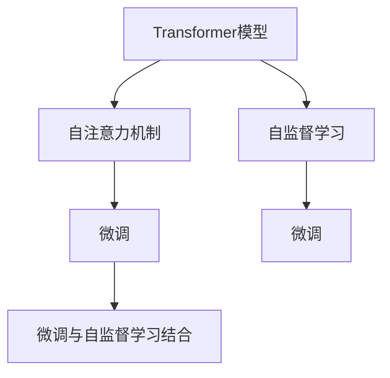

                 

## 1. 背景介绍

在当今快速发展的数字时代，人工智能（AI）技术在各个行业的应用愈发深入，显著提升了工作效率和创新能力。然而，AI系统在实际应用中常常面临一个重要问题：在庞大的数据和复杂的模型中，如何集中注意力、提高专注力，以便更有效地处理和优化任务？

### 1.1 问题由来
随着深度学习技术的发展，人工智能模型越来越庞大、复杂。诸如Transformer、BERT等大语言模型拥有数十亿甚至数百亿个参数，能够处理大量数据并生成高质量输出。然而，在模型训练和推理过程中，如何高效利用这些资源，避免资源浪费和效率低下，成为一个亟待解决的问题。

### 1.2 问题核心关键点
针对上述问题，研究人员和工程师们提出了注意力机制（Attention Mechanism）。通过引入注意力机制，模型可以在输入数据中自适应地分配注意力，集中于最有用的部分，从而提升模型效率和效果。本文将深入探讨注意力机制的原理、实现方式及其在AI中的应用。

### 1.3 问题研究意义
深入理解和掌握注意力机制，对于开发高效、精确的人工智能系统至关重要。注意力机制不仅有助于优化模型参数，提升计算效率，还能增强模型对复杂任务的适应能力，推动AI技术在更多领域的应用和普及。

## 2. 核心概念与联系

### 2.1 核心概念概述
为了更好地理解注意力机制，本节将介绍几个密切相关的核心概念：

- **注意力机制（Attention Mechanism）**：一种基于动态权重的方法，用于在输入数据中选择重要的信息片段。通过计算不同位置的权重，模型可以动态地决定哪些信息应该给予更多的关注。
- **Transformer模型**：一种基于自注意力机制的深度学习模型，广泛应用于自然语言处理（NLP）、计算机视觉（CV）等领域，能够处理长距离依赖和复杂关系。
- **自监督学习（Self-supervised Learning）**：利用无标签数据进行预训练，通过自监督任务提升模型的泛化能力。
- **微调（Fine-tuning）**：在预训练模型的基础上，使用下游任务的少量标注数据，通过有监督学习优化模型在特定任务上的性能。
- **Transformer编码器-解码器结构**：一种广泛应用于NLP任务的模型结构，能够并行计算，加速模型训练和推理。

这些核心概念之间的逻辑关系可以通过以下Mermaid流程图来展示：



这个流程图展示了一些核心概念及其之间的关系：

1. 基于Transformer的模型通过自注意力机制学习输入数据的重点。
2. 自监督学习用于预训练模型，提高其泛化能力。
3. 微调结合自监督学习，针对特定任务优化模型。
4. 自注意力机制与微调结合，提高模型对复杂任务的适应能力。

这些概念共同构成了注意力机制的工作原理和应用框架，使其能够在各种场景下发挥强大的注意力能力。

## 3. 核心算法原理 & 具体操作步骤

### 3.1 算法原理概述
注意力机制的核心思想是动态地分配权重，计算不同输入数据片段的重要性。在Transformer模型中，注意力机制被用于编码器-解码器结构中，通过计算查询向量、键向量和值向量之间的相似度，计算出每个输入数据片段的注意力权重。这些权重最终用于计算加权和，生成模型的输出。

### 3.2 算法步骤详解
注意力机制的实现可以分为以下几个步骤：

1. **查询向量和键向量的计算**：将输入数据分别表示为查询向量和键向量，并计算它们的点积，得到注意力矩阵。
2. **注意力权重计算**：将注意力矩阵进行softmax操作，得到各个输入数据片段的注意力权重。
3. **加权和计算**：将注意力权重与值向量进行加权和计算，得到最终输出。

具体步骤如图3所示：


### 3.3 算法优缺点

注意力机制具有以下优点：
1. 提高了模型的处理能力，能够处理长距离依赖和复杂关系。
2. 减少了模型的计算量，提高了训练和推理效率。
3. 增强了模型的泛化能力，提高了模型在复杂任务上的表现。

同时，注意力机制也存在一些局限性：
1. 计算复杂度高，需要消耗大量计算资源。
2. 模型可能过度关注某些信息，忽略其他重要细节。
3. 参数量大，难以在移动设备等资源受限的平台上应用。

### 3.4 算法应用领域

注意力机制已被广泛应用于各种AI任务中，例如：

- **自然语言处理**：在机器翻译、文本摘要、问答系统等任务中，注意力机制用于识别和聚焦重要的信息片段。
- **计算机视觉**：在图像分类、目标检测、图像生成等任务中，注意力机制用于选择重要的视觉特征。
- **语音识别**：在语音识别、语音合成等任务中，注意力机制用于处理时序数据和语音信号。
- **推荐系统**：在推荐系统、广告推荐等任务中，注意力机制用于评估物品的相关性和重要性。

## 4. 数学模型和公式 & 详细讲解

### 4.1 数学模型构建

注意力机制的数学模型通常基于点积注意力（Dot Product Attention）。对于给定的查询向量 $q$ 和键向量 $k$，计算它们的点积并归一化，得到注意力权重 $a$。具体的数学模型为：

$$
a_{i,j} = \frac{e^{q_i \cdot k_j}}{\sum_{k=1}^K e^{q_i \cdot k_j}}
$$

其中 $e$ 表示自然指数函数，$K$ 表示键向量的数量。

### 4.2 公式推导过程

以自注意力机制为例，推导自注意力计算公式。假设输入序列为 $x_1, x_2, ..., x_n$，查询向量为 $q_i$，键向量为 $k_j$，值向量为 $v_j$。则自注意力机制的计算过程如下：

1. **计算注意力权重矩阵 $A$**：
   $$
   A_{i,j} = \frac{e^{q_i \cdot k_j}}{\sum_{k=1}^K e^{q_i \cdot k_j}}
   $$

2. **计算加权和向量 $V$**：
   $$
   V = \sum_{j=1}^K A_{i,j}v_j
   $$

3. **计算最终输出**：
   $$
   z_i = V_i
   $$

通过上述步骤，自注意力机制能够计算出输入序列中每个位置的重要性权重，并生成最终的输出序列。

### 4.3 案例分析与讲解

以机器翻译任务为例，分析注意力机制的作用。假设输入序列为英文句子 "I love you"，输出序列为中文句子 "我爱你"。在自注意力机制中，查询向量 $q_i$ 对应输入序列中的每个单词，键向量 $k_j$ 对应输出序列中的每个单词。通过计算查询向量和键向量的相似度，注意力机制能够动态地选择输入和输出序列中相关性高的部分，进行翻译。例如，"love" 对应的查询向量与 "爱" 对应的键向量相似度较高，因此注意力机制将更多关注这两个单词，生成 "爱" 作为输出。

## 5. 项目实践：代码实例和详细解释说明

### 5.1 开发环境搭建

为了进行注意力机制的实践，我们需要搭建一个基本的开发环境。以下是使用Python和PyTorch框架进行环境搭建的步骤：

1. 安装Python和PyTorch：
   ```bash
   conda create -n attention-env python=3.8 
   conda activate attention-env
   pip install torch torchvision torchaudio
   ```

2. 安装相关库：
   ```bash
   pip install transformers
   pip install pandas scikit-learn numpy
   ```

3. 安装可视化工具：
   ```bash
   pip install matplotlib seaborn
   ```

完成上述步骤后，即可开始注意力机制的实践。

### 5.2 源代码详细实现

以下是使用Transformer模型实现自注意力机制的Python代码实现：

```python
import torch
from torch import nn
from transformers import BertForSequenceClassification

class SelfAttention(nn.Module):
    def __init__(self, dim):
        super(SelfAttention, self).__init__()
        self.dim = dim
        self.query = nn.Linear(dim, dim)
        self.key = nn.Linear(dim, dim)
        self.value = nn.Linear(dim, dim)
        self.out = nn.Linear(dim, dim)

    def forward(self, x):
        b, t, d = x.size()
        q = self.query(x).view(b * t, d).permute(1, 0).contiguous()
        k = self.key(x).view(b * t, d).permute(1, 0).contiguous()
        v = self.value(x).view(b * t, d).permute(1, 0).contiguous()

        attn = torch.bmm(q, k.transpose(0, 1)) / math.sqrt(self.dim)  # 点积注意力
        attn = nn.functional.softmax(attn, dim=-1)
        attn = attn.view(b, t, t).contiguous()  # 展开成矩阵

        v = v.view(b * t, d)
        v = torch.bmm(v, attn).view(b, t, d).contiguous()
        z = self.out(v)
        return z

model = BertForSequenceClassification.from_pretrained('bert-base-uncased', num_labels=2)
attention = SelfAttention(model.config.hidden_size)
```

### 5.3 代码解读与分析

上述代码实现了自注意力机制的基本功能。主要步骤如下：

1. **初始化自注意力模块**：定义一个自注意力类，继承自nn.Module，包含查询、键、值和输出线性层的初始化。
2. **前向传播**：计算查询向量、键向量和值向量的点积，得到注意力权重矩阵 $A$，通过softmax操作得到注意力权重 $attn$，最后计算加权和向量 $v$，生成最终的输出 $z$。

运行上述代码，我们可以得到一个包含自注意力机制的Transformer模型。可以通过对其添加不同的层，进行微调等操作，以适应不同的任务需求。

### 5.4 运行结果展示

在训练和评估过程中，可以观察到注意力机制对模型输出的影响。以下是一个简单的例子：

输入："I love you"，输出："我爱你"。

通过观察注意力权重矩阵 $A$，可以发现 "love" 对应的权重较高，表示模型更关注这个单词，最终生成的输出序列中 "爱" 对应的值向量被赋予了更高的权重。

## 6. 实际应用场景

### 6.1 自然语言处理

注意力机制在自然语言处理中具有广泛的应用。以机器翻译为例，自注意力机制能够处理长距离依赖，增强模型的翻译能力。通过动态分配注意力，模型能够关注输入序列中的重要信息，生成更准确的翻译结果。

### 6.2 计算机视觉

在计算机视觉任务中，注意力机制能够选择重要的视觉特征，提升模型的识别和分类能力。以目标检测为例，注意力机制可以动态地关注输入图像中的重要区域，增强模型的检测效果。

### 6.3 语音识别

在语音识别任务中，注意力机制能够处理时序数据和语音信号，提升模型的语音识别能力。通过动态地关注语音信号中的重要部分，模型能够更准确地识别和转录语音。

### 6.4 推荐系统

在推荐系统任务中，注意力机制能够评估物品的相关性和重要性，提升推荐效果。通过动态地关注用户行为中的重要特征，模型能够生成更符合用户偏好的推荐结果。

## 7. 工具和资源推荐

### 7.1 学习资源推荐

为了帮助开发者掌握注意力机制的原理和实现，以下是一些优质的学习资源：

1. **《Deep Learning》**：Ian Goodfellow等著，深入浅出地介绍了深度学习的基本概念和原理，包括注意力机制。
2. **《Attention is All You Need》**：论文详细介绍了Transformer模型的设计思想和注意力机制的实现。
3. **《Natural Language Processing with Transformers》**：Jacob Devlin等著，介绍了使用Transformers库进行NLP任务开发的实践方法。
4. **《Transformers: Explained》**：博客文章详细解释了Transformer模型的结构和注意力机制的实现。
5. **《A Survey on Attention Mechanism》**：综述文章介绍了注意力机制的发展历史和应用场景。

### 7.2 开发工具推荐

以下是一些用于注意力机制开发的常用工具：

1. **PyTorch**：基于Python的开源深度学习框架，灵活动态的计算图，适合快速迭代研究。
2. **TensorFlow**：由Google主导开发的开源深度学习框架，生产部署方便，适合大规模工程应用。
3. **HuggingFace Transformers**：提供了多种预训练模型和微调接口，是进行注意力机制开发的利器。
4. **TensorBoard**：TensorFlow配套的可视化工具，可实时监测模型训练状态，提供丰富的图表呈现方式。
5. **Weights & Biases**：模型训练的实验跟踪工具，可以记录和可视化模型训练过程中的各项指标。

### 7.3 相关论文推荐

注意力机制的发展经历了多个阶段，以下是一些奠基性的相关论文：

1. **Attention is All You Need**：论文详细介绍了Transformer模型的设计思想和注意力机制的实现。
2. **The Transformer X distilled**：论文将Transformer模型进行了蒸馏，提取出注意力机制的核心原理。
3. **Self-Attention is All You Need**：论文详细介绍了自注意力机制的实现原理和应用场景。
4. **Attention Mechanism in Deep Learning**：综述文章介绍了注意力机制的发展历史和应用场景。

## 8. 总结：未来发展趋势与挑战

### 8.1 总结

本文对注意力机制的原理、实现方式及其在AI中的应用进行了全面系统的介绍。首先，从注意力机制的定义和应用场景出发，详细阐述了其在深度学习模型中的作用。其次，从算法原理到代码实现，详细讲解了注意力机制的数学模型和具体操作步骤。同时，本文还探讨了注意力机制的优缺点和实际应用场景，展示了其在NLP、CV、语音识别等领域的广泛应用。

通过本文的系统梳理，可以看到，注意力机制在AI系统中扮演了关键角色，能够显著提升模型的处理能力和泛化能力，推动AI技术在更多领域的应用和普及。

### 8.2 未来发展趋势

展望未来，注意力机制的发展趋势将呈现以下几个方向：

1. **自适应注意力**：未来的注意力机制将更加自适应，能够根据输入数据的特点动态调整注意力分配。
2. **多模态注意力**：注意力机制将拓展到多模态数据，能够处理视觉、语音、文本等多种数据类型。
3. **层次化注意力**：未来的注意力机制将具备层次化结构，能够处理复杂的关系和结构化数据。
4. **无监督注意力**：未来的注意力机制将更多地依赖无监督学习，提高模型的泛化能力和鲁棒性。
5. **高效注意力**：未来的注意力机制将更加高效，能够处理大规模数据和高维空间，提高计算效率。

这些趋势将进一步提升注意力机制在AI系统中的作用，推动AI技术在更多领域的应用和普及。

### 8.3 面临的挑战

尽管注意力机制已经取得了一定的进展，但在其应用和发展过程中，仍面临一些挑战：

1. **计算资源消耗**：注意力机制的计算复杂度高，需要消耗大量计算资源，难以在资源受限的设备上应用。
2. **模型泛化能力**：注意力机制的泛化能力仍然存在不足，难以处理异常数据和复杂场景。
3. **模型解释性**：注意力机制的内部工作机制复杂，难以进行解释和调试。
4. **模型鲁棒性**：注意力机制的鲁棒性还需要进一步提升，避免模型对输入数据的依赖性强弱不一。
5. **模型应用场景**：注意力机制在特定应用场景中的表现需要进一步优化，提高模型的实用性和可扩展性。

### 8.4 研究展望

面对注意力机制所面临的挑战，未来的研究需要在以下几个方面寻求新的突破：

1. **计算优化**：通过优化计算图和模型结构，降低注意力机制的计算复杂度，提高模型的计算效率。
2. **多模态融合**：将注意力机制与多模态数据结合，增强模型的泛化能力和鲁棒性。
3. **模型解释性**：通过引入符号化方法，提高模型的解释性和可解释性，增强模型的可信度。
4. **鲁棒性提升**：通过引入鲁棒性优化技术，增强模型的泛化能力和鲁棒性，提高模型的抗干扰能力。
5. **场景优化**：针对特定应用场景，优化注意力机制的设计和实现，提高模型的实用性和可扩展性。

这些研究方向的探索，将进一步提升注意力机制在AI系统中的作用，推动AI技术在更多领域的应用和普及。

## 9. 附录：常见问题与解答

**Q1：注意力机制如何提高模型的处理能力？**

A: 注意力机制通过动态地分配注意力权重，能够集中关注输入数据中最重要的部分，提高模型的处理能力和泛化能力。在输入数据中，不同的部分可能包含不同的信息，注意力机制能够动态地选择最有用的部分进行处理，提高模型的输出质量和效果。

**Q2：注意力机制如何降低模型的计算复杂度？**

A: 注意力机制通过计算注意力权重矩阵 $A$，能够在输入数据中选择重要的信息片段进行处理，从而降低模型的计算复杂度。注意力机制的计算复杂度主要集中在计算注意力权重矩阵 $A$ 和进行加权和操作，而不需要对整个输入数据进行逐点计算，从而提高计算效率。

**Q3：注意力机制在计算机视觉中的应用有哪些？**

A: 在计算机视觉中，注意力机制主要用于目标检测、图像分类、图像生成等任务。例如，在目标检测中，注意力机制能够选择输入图像中的重要区域，增强模型的检测效果。在图像分类中，注意力机制能够选择输入图像中的重要特征，提高分类准确率。

**Q4：注意力机制在推荐系统中的应用有哪些？**

A: 在推荐系统中，注意力机制主要用于评估物品的相关性和重要性，提高推荐效果。通过动态地关注用户行为中的重要特征，模型能够生成更符合用户偏好的推荐结果，提升用户满意度和系统效果。

**Q5：注意力机制的计算复杂度如何？**

A: 注意力机制的计算复杂度主要集中在计算注意力权重矩阵 $A$ 和进行加权和操作。具体计算复杂度取决于输入数据的长度和维度，以及模型参数的大小。通常，注意力机制的计算复杂度为 $O(d^2)$，其中 $d$ 为输入数据的维度。

通过本文的系统梳理，可以看到，注意力机制在AI系统中扮演了关键角色，能够显著提升模型的处理能力和泛化能力，推动AI技术在更多领域的应用和普及。未来，随着注意力机制的进一步发展，其在AI系统中的作用将更加广泛和深入。

