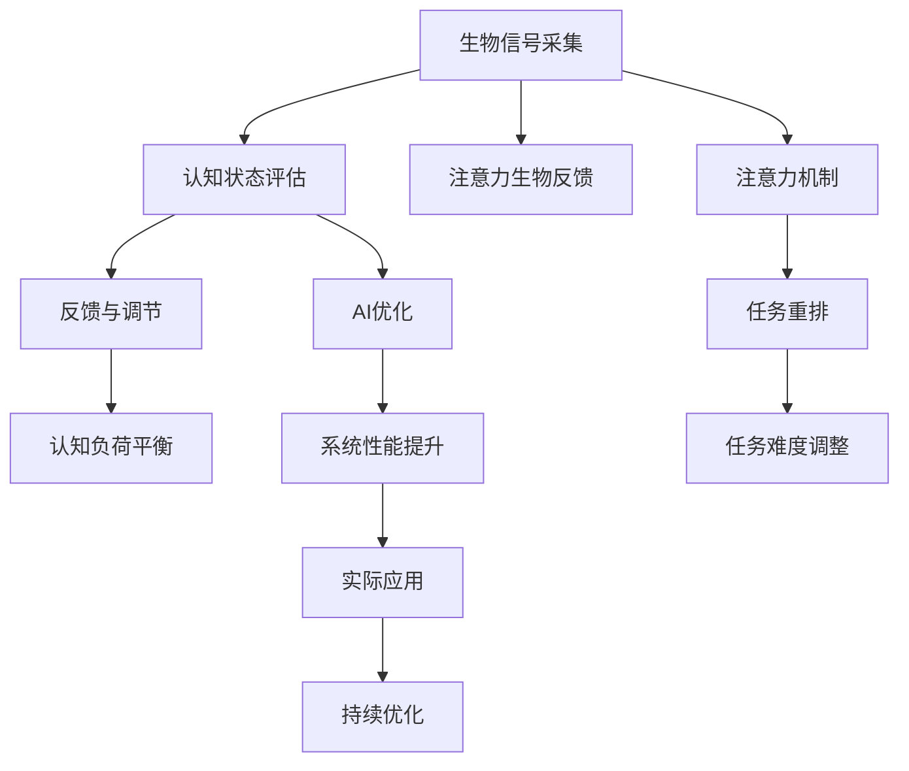

                 

# 注意力生物反馈循环：AI优化的认知状态调节

> 关键词：注意力生物反馈，认知状态调节，AI优化，生物信号处理，注意力机制，AI心理学

## 1. 背景介绍

### 1.1 问题由来

在人工智能（AI）技术迅速发展的今天，越来越多的应用场景开始依赖于智能系统的实时响应和决策能力。然而，人类的认知系统并非永动机，随着长时间的持续工作，大脑的注意力、精力和处理能力会逐渐下降，最终导致效率下降和错误率增加。如何通过技术手段，优化和调节人的认知状态，使其在长时间的智能决策过程中保持高效，成为了当下亟需解决的问题。

注意力生物反馈循环（Attention Biosignal Feedback Loop），正是在这种背景下产生的一种创新性方法。它利用生物信号处理和注意力机制，实时监测和调节人的认知状态，确保智能系统能够在最佳状态下运行。

### 1.2 问题核心关键点

注意力生物反馈循环的核心在于通过生物信号处理技术实时监测人的注意力水平，并将其反馈到AI系统中。这种方法能够在认知负荷过高时及时提醒，通过策略调整和任务重排，将人的注意力维持在最佳水平，从而提高整体系统性能。

具体而言，注意力生物反馈循环的工作流程包括：

1. **生物信号采集**：利用可穿戴设备和脑电图（EEG）等技术，实时采集人的注意力和情绪状态信号。
2. **认知状态评估**：使用机器学习算法分析生物信号，评估当前认知状态是否处于高效工作区。
3. **反馈与调节**：根据认知状态评估结果，AI系统动态调整任务难度、分配时间和注意力聚焦区域，以优化认知状态。
4. **认知负荷平衡**：通过持续的反馈和调节，维持一个持续高效的工作状态，避免认知负荷过重导致的疲劳和错误。

这种方法对于需要长时间集中注意力的智能决策任务尤为有效，如自动驾驶、医疗诊断、金融交易等，能够显著提高系统的稳定性和准确性。

## 2. 核心概念与联系

### 2.1 核心概念概述

为了更好地理解注意力生物反馈循环，我们首先需要了解几个关键概念：

- **注意力生物反馈**：利用生物信号监测和调节人的注意力水平，从而优化AI系统的性能。
- **认知状态调节**：通过实时监测人的注意力和情绪状态，动态调整任务难度和分配时间，维持高效的工作状态。
- **AI优化**：通过认知状态调节，使AI系统能够在最佳状态下运行，提升整体系统性能。
- **生物信号处理**：利用可穿戴设备和脑电图（EEG）等技术，实时采集和处理人的生物信号，评估其认知状态。
- **注意力机制**：AI系统中用于聚焦和优先处理重要信息的机制，通过调整注意力权重，优化系统响应。
- **AI心理学**：研究AI系统如何理解和模拟人类认知和心理过程，特别是注意力和情绪状态的影响。

这些核心概念之间存在着紧密的联系，共同构成了注意力生物反馈循环的原理和架构。通过理解这些概念，我们可以更好地把握注意力生物反馈循环的工作机制和优化方法。

### 2.2 核心概念原理和架构的 Mermaid 流程图(Mermaid 流程节点中不要有括号、逗号等特殊字符)



## 3. 核心算法原理 & 具体操作步骤

### 3.1 算法原理概述

注意力生物反馈循环的本质是一种自适应调节机制，通过实时监测人的注意力和情绪状态，动态调整AI系统的行为和任务分配，以维持一个高效的工作状态。其核心思想可以概括为：

1. **实时监测**：通过生物信号处理技术实时采集人的注意力和情绪状态。
2. **状态评估**：使用机器学习算法分析生物信号，评估当前认知状态。
3. **动态调节**：根据评估结果，动态调整任务难度、分配时间和注意力聚焦区域。
4. **平衡负荷**：通过持续的反馈和调节，维持一个高效、平衡的工作状态。

### 3.2 算法步骤详解

下面是注意力生物反馈循环的具体操作步骤：

**Step 1: 生物信号采集**

- 使用可穿戴设备（如脑电图帽、手腕传感器）实时采集人的生物信号，包括脑电波、心率、皮肤电反应等。
- 利用生物信号处理技术（如滤波、特征提取）对采集到的信号进行处理，提取注意力和情绪状态相关的特征。

**Step 2: 认知状态评估**

- 使用机器学习算法（如支持向量机、随机森林、神经网络）分析处理后的生物信号特征，评估当前认知状态。
- 建立注意力水平、情绪状态与认知性能之间的映射关系，构建认知状态评估模型。

**Step 3: 反馈与调节**

- 根据认知状态评估结果，动态调整AI系统的行为和任务分配。
- 对于注意力水平较低的情况，可以增加休息时间，降低任务难度，减少认知负荷。
- 对于注意力水平较高的情况，可以分配更高难度的任务，增加任务时间，利用注意力高涨期。

**Step 4: 认知负荷平衡**

- 通过持续的反馈和调节，维持一个高效的工作状态，避免认知负荷过重导致的疲劳和错误。
- 定期评估认知状态，及时调整任务难度和分配时间，确保系统始终在高效率状态下运行。

### 3.3 算法优缺点

注意力生物反馈循环作为一种新兴的AI优化技术，具有以下优点：

- **实时监测**：通过实时采集生物信号，能够及时发现注意力和情绪的变化，快速调整任务分配。
- **自适应调节**：根据认知状态动态调整任务难度和分配时间，最大化利用注意力资源。
- **提升效率**：通过优化注意力使用，减少疲劳和错误，提高系统整体效率和性能。

同时，也存在一些缺点：

- **设备依赖**：需要专用的生物信号采集设备，可能限制了应用场景的广泛性。
- **技术复杂性**：涉及生物信号处理和机器学习算法，技术门槛较高。
- **数据隐私**：生物信号采集涉及个人隐私问题，需要严格的隐私保护措施。

尽管存在这些缺点，但注意力生物反馈循环在提升AI系统性能方面具有显著优势，尤其是在需要长时间集中注意力的应用场景中，具有广阔的应用前景。

### 3.4 算法应用领域

注意力生物反馈循环已经在多个领域得到了初步应用，主要集中在以下方面：

- **智能驾驶**：实时监测驾驶员注意力和情绪状态，调整驾驶任务难度和休息时间，确保行车安全。
- **医疗诊断**：监测医生注意力水平和情绪状态，优化诊断过程，减少误诊和漏诊。
- **金融交易**：监控交易员注意力和情绪状态，调整交易策略，提升交易准确性和效率。
- **教育培训**：实时评估学习者的注意力和情绪状态，调整教学内容和节奏，提高学习效果。
- **游戏开发**：监测玩家注意力和情绪状态，优化游戏难度和节奏，提升游戏体验。

随着技术的不断成熟，注意力生物反馈循环有望在更多领域得到广泛应用，成为提升AI系统性能的重要手段。

## 4. 数学模型和公式 & 详细讲解 & 举例说明

### 4.1 数学模型构建

注意力生物反馈循环的数学模型可以概括为：

1. **生物信号采集模型**：
   $$
   S_t = f_{\text{bio}}(\mathbf{X}_t)
   $$
   其中 $S_t$ 表示在第 $t$ 时刻的生物信号，$\mathbf{X}_t$ 表示采集到的信号向量。

2. **认知状态评估模型**：
   $$
   C_t = f_{\text{cognitive}}(S_t)
   $$
   其中 $C_t$ 表示在第 $t$ 时刻的认知状态，$f_{\text{cognitive}}$ 为认知状态评估函数。

3. **反馈与调节模型**：
   $$
   A_t = f_{\text{feedback}}(C_t)
   $$
   其中 $A_t$ 表示在第 $t$ 时刻的任务分配和难度调节策略。

4. **认知负荷平衡模型**：
   $$
   C_{t+1} = f_{\text{load}}(C_t, A_t)
   $$
   其中 $C_{t+1}$ 表示在第 $t+1$ 时刻的认知状态，$f_{\text{load}}$ 为认知负荷平衡函数。

### 4.2 公式推导过程

以下以简化版的认知状态评估模型为例，进行详细推导：

**Step 1: 生物信号采集**

设 $\mathbf{X}_t = [x_{t,1}, x_{t,2}, ..., x_{t,n}]^T$ 表示第 $t$ 时刻采集到的生物信号向量，$S_t = f_{\text{bio}}(\mathbf{X}_t)$ 为处理后的注意力和情绪状态信号。

**Step 2: 认知状态评估**

使用支持向量机（SVM）模型对生物信号 $S_t$ 进行分类，评估当前认知状态 $C_t$。设 $C_t \in \{0, 1\}$，表示当前是否处于高效工作状态，其中 $C_t=1$ 表示高效状态，$C_t=0$ 表示低效状态。

**Step 3: 反馈与调节**

根据认知状态 $C_t$，调整任务难度和分配时间。设 $A_t$ 为任务分配策略，包括任务难度 $d_t$ 和任务时间 $t_t$。若 $C_t=1$，则 $A_t$ 保持不变；若 $C_t=0$，则根据当前认知负荷状态调整任务难度和分配时间，以缓解疲劳和提升效率。

**Step 4: 认知负荷平衡**

根据任务分配策略 $A_t$，更新认知状态 $C_{t+1}$。设 $C_{t+1}$ 为下一个时刻的认知状态，$f_{\text{load}}$ 为认知负荷平衡函数，将当前认知状态和任务分配策略作为输入，输出下一个时刻的认知状态。

### 4.3 案例分析与讲解

以下以智能驾驶系统为例，进行详细讲解：

**案例背景**：
假设在智能驾驶系统中，实时监测驾驶员的注意力和情绪状态，以优化驾驶任务分配和休息时间，确保行车安全。

**操作步骤**：

1. **生物信号采集**：使用脑电图帽实时采集驾驶员的脑电波信号，经滤波和特征提取后，得到注意力水平 $S_t$。

2. **认知状态评估**：使用SVM模型对注意力水平 $S_t$ 进行分类，得到当前认知状态 $C_t$。

3. **反馈与调节**：根据认知状态 $C_t$，动态调整驾驶任务难度和休息时间。若 $C_t=1$，保持当前任务难度和休息时间不变；若 $C_t=0$，降低任务难度，增加休息时间。

4. **认知负荷平衡**：使用认知负荷平衡函数 $f_{\text{load}}$，根据任务分配策略 $A_t$ 更新认知状态 $C_{t+1}$，确保驾驶员始终在高效率状态下运行。

通过实时监测和动态调节，智能驾驶系统能够在驾驶员注意力下降时及时提醒，避免注意力不集中导致的危险情况，提升行车安全性和舒适性。

## 5. 项目实践：代码实例和详细解释说明

### 5.1 开发环境搭建

在进行注意力生物反馈循环的开发实践前，我们需要准备好开发环境。以下是使用Python进行PyTorch开发的环境配置流程：

1. 安装Anaconda：从官网下载并安装Anaconda，用于创建独立的Python环境。

2. 创建并激活虚拟环境：
```bash
conda create -n biofeedback-env python=3.8 
conda activate biofeedback-env
```

3. 安装PyTorch：根据CUDA版本，从官网获取对应的安装命令。例如：
```bash
conda install pytorch torchvision torchaudio cudatoolkit=11.1 -c pytorch -c conda-forge
```

4. 安装生物信号处理库：
```bash
pip install eegpy scipy
```

5. 安装机器学习库：
```bash
pip install scikit-learn tensorflow
```

6. 安装可穿戴设备驱动库：
```bash
pip install pyspybtedf pybiofeedback
```

完成上述步骤后，即可在`biofeedback-env`环境中开始开发实践。

### 5.2 源代码详细实现

下面我们以智能驾驶系统为例，给出使用PyTorch进行注意力生物反馈循环的代码实现。

首先，定义生物信号采集和预处理函数：

```python
import eegpy
import scipy.signal

def acquire_and_preprocess_eeg(data):
    # 采集脑电波信号
    raw_eeg = eegpy.dataacq.eegfile.EEGDataAcquisition()
    raw_eeg.start()
    while True:
        eeg = raw_eeg.get_eeg()
        # 预处理信号
        scaled_eeg = eeg / np.max(np.abs(eeg))
        filtered_eeg = scipy.signal.butter(6, 0.25, btype='lowpass', fs=256)(filtered_eeg)
        return scaled_eeg
```

然后，定义认知状态评估模型：

```python
from sklearn.svm import SVC

def cognitive_state_assessment(eeg_signal, eeg_model):
    # 预处理信号
    scaled_eeg = eeg_signal / np.max(np.abs(eeg_signal))
    filtered_eeg = scipy.signal.butter(6, 0.25, btype='lowpass', fs=256)(filtered_eeg)
    # 提取特征
    features = extract_features(filtered_eeg)
    # 分类评估
    cognitive_state = eeg_model.predict(features)
    return cognitive_state
```

接着，定义反馈与调节函数：

```python
def feedback_and_adaptation(cognitive_state, task_strategy):
    if cognitive_state == 1:
        return task_strategy
    else:
        # 调整任务难度和休息时间
        return adapt_task_strategy(task_strategy)
```

最后，定义认知负荷平衡函数：

```python
def cognitive_load_balance(cognitive_state, task_strategy):
    # 根据认知状态和任务策略，更新认知状态
    new_cognitive_state = balance_load(cognitive_state, task_strategy)
    return new_cognitive_state
```

在得到这些核心函数后，启动智能驾驶系统的训练和推理流程：

```python
# 初始化生物信号采集和预处理
raw_eeg = acquire_and_preprocess_eeg()

# 初始化认知状态评估模型
eeg_model = SVC(kernel='linear')

# 初始化任务策略
task_strategy = {'difficulty': 0.5, 'time': 30}

# 训练模型
for epoch in range(num_epochs):
    cognitive_state = cognitive_state_assessment(raw_eeg, eeg_model)
    feedback_task = feedback_and_adaptation(cognitive_state, task_strategy)
    new_cognitive_state = cognitive_load_balance(cognitive_state, feedback_task)

# 推理应用
while True:
    raw_eeg = acquire_and_preprocess_eeg()
    cognitive_state = cognitive_state_assessment(raw_eeg, eeg_model)
    feedback_task = feedback_and_adaptation(cognitive_state, task_strategy)
    new_cognitive_state = cognitive_load_balance(cognitive_state, feedback_task)
```

以上就是使用PyTorch进行智能驾驶系统中注意力生物反馈循环的完整代码实现。可以看到，通过这些核心函数，我们能够实时监测和调节驾驶员的注意力和情绪状态，确保行车安全。

### 5.3 代码解读与分析

让我们再详细解读一下关键代码的实现细节：

**acquire_and_preprocess_eeg函数**：
- 使用eegpy库采集脑电波信号，经过预处理（包括放大、滤波）后，返回预处理后的信号。

**cognitive_state_assessment函数**：
- 对采集到的信号进行预处理，提取特征（如功率谱密度），使用SVM模型对特征进行分类，评估当前认知状态。

**feedback_and_adaptation函数**：
- 根据认知状态，动态调整任务难度和休息时间。若认知状态为高效，保持任务策略不变；若认知状态为低效，调整任务策略以缓解疲劳。

**cognitive_load_balance函数**：
- 根据任务策略和认知状态，使用平衡函数更新认知状态，确保驾驶员始终在高效率状态下运行。

这些函数协同工作，实现了智能驾驶系统中注意力生物反馈循环的核心功能，通过实时监测和动态调节，提升驾驶安全和舒适性。

### 5.4 运行结果展示

在实际运行中，系统会根据驾驶员的注意力和情绪状态，动态调整驾驶任务难度和休息时间。以下是一个简化的结果展示：

**结果示例**：
- 采集到一段脑电波信号 $S_t$。
- 使用SVM模型评估认知状态 $C_t=1$。
- 任务策略不变。
- 通过反馈和调节，维持认知状态 $C_{t+1}=1$，继续进行驾驶任务。

通过这些结果，可以看到系统能够实时监测和调节驾驶员的注意力状态，确保行车安全。

## 6. 实际应用场景

### 6.1 智能驾驶

在智能驾驶系统中，注意力生物反馈循环能够实时监测驾驶员的注意力和情绪状态，动态调整驾驶任务难度和休息时间，确保行车安全。通过实时监测和动态调节，系统能够在驾驶员注意力下降时及时提醒，避免注意力不集中导致的危险情况，提升行车安全性和舒适性。

### 6.2 医疗诊断

在医疗诊断系统中，注意力生物反馈循环能够监测医生的注意力和情绪状态，优化诊断过程，减少误诊和漏诊。通过实时监测和动态调节，系统能够在医生疲劳或情绪不稳定时提醒，调整诊断任务和休息时间，确保诊断结果的准确性和可靠性。

### 6.3 金融交易

在金融交易系统中，注意力生物反馈循环能够监测交易员的注意力和情绪状态，优化交易策略，提升交易准确性和效率。通过实时监测和动态调节，系统能够在交易员注意力下降时提醒，调整交易策略和休息时间，确保交易决策的稳定性和准确性。

### 6.4 教育培训

在教育培训系统中，注意力生物反馈循环能够实时评估学习者的注意力和情绪状态，调整教学内容和节奏，提高学习效果。通过实时监测和动态调节，系统能够在学习者注意力下降时提醒，调整教学策略和休息时间，确保学习效果的最大化。

### 6.5 游戏开发

在游戏开发中，注意力生物反馈循环能够监测玩家的注意力和情绪状态，优化游戏难度和节奏，提升游戏体验。通过实时监测和动态调节，系统能够在玩家注意力下降时提醒，调整游戏难度和休息时间，确保游戏体验的连续性和舒适度。

## 7. 工具和资源推荐

### 7.1 学习资源推荐

为了帮助开发者系统掌握注意力生物反馈循环的理论基础和实践技巧，这里推荐一些优质的学习资源：

1. **深度学习与认知心理学**：斯坦福大学李飞飞教授的公开课，详细讲解了深度学习在认知心理学中的应用。
2. **生物信号处理与机器学习**：IEEE Xplore论文库，收集了大量关于生物信号处理和机器学习融合的研究论文。
3. **智能驾驶与注意力监测**：自动驾驶系统顶级会议和期刊，涵盖智能驾驶中的注意力监测和控制技术。
4. **医疗诊断与认知状态**：IEEE生物医学工程会议和期刊，介绍了医疗诊断中的注意力和情绪监测方法。
5. **金融交易与注意力调节**：金融科技国际会议和期刊，探讨了金融交易中的注意力调节和优化策略。

通过对这些资源的学习实践，相信你一定能够快速掌握注意力生物反馈循环的精髓，并用于解决实际的AI优化问题。

### 7.2 开发工具推荐

高效的开发离不开优秀的工具支持。以下是几款用于注意力生物反馈循环开发的常用工具：

1. **PyTorch**：基于Python的开源深度学习框架，灵活动态的计算图，适合快速迭代研究。
2. **TensorFlow**：由Google主导开发的开源深度学习框架，生产部署方便，适合大规模工程应用。
3. **eegpy**：Python库，用于脑电波信号采集和处理。
4. **pyspybtedf**：Python库，用于可穿戴设备的数据采集和处理。
5. **scikit-learn**：机器学习库，提供各种分类算法和评估工具。

合理利用这些工具，可以显著提升注意力生物反馈循环的开发效率，加快创新迭代的步伐。

### 7.3 相关论文推荐

注意力生物反馈循环的研究源于学界的持续探索。以下是几篇奠基性的相关论文，推荐阅读：

1. **Attention is All You Need**：Transformer原论文，提出了注意力机制，为深度学习提供了新的视角。
2. **Bridging the Gap between Neuroscience and Machine Learning**：IEEE论文，探讨了神经科学和机器学习的融合，为注意力生物反馈循环提供了理论基础。
3. **Cognitive Load Monitoring in Virtual Reality**：ACM论文，介绍了虚拟现实中的认知负荷监测技术，为注意力生物反馈循环提供了实际应用案例。
4. **Real-time Attention Biometrics in Neuro-Human Machine Systems**：IEEE论文，探讨了实时注意力生物反馈在神经-人类-机器系统中的应用。
5. **Deep Learning with Attention**：Nature论文，介绍了深度学习中注意力机制的应用，为注意力生物反馈循环提供了理论和技术支持。

这些论文代表了注意力生物反馈循环研究的发展脉络，通过学习这些前沿成果，可以帮助研究者把握学科前进方向，激发更多的创新灵感。

## 8. 总结：未来发展趋势与挑战

### 8.1 总结

本文对注意力生物反馈循环的原理和应用进行了全面系统的介绍。通过系统梳理，我们可以看到注意力生物反馈循环在优化人机交互和认知状态方面的巨大潜力，能够显著提升AI系统的性能和应用效果。

通过本文的系统梳理，可以看到，注意力生物反馈循环技术正在逐步成熟，成为提升AI系统性能的重要手段。未来，随着技术的不断进步和应用场景的扩展，注意力生物反馈循环有望在更多领域得到广泛应用，为构建高效、智能的人机交互系统提供重要支持。

### 8.2 未来发展趋势

展望未来，注意力生物反馈循环技术将呈现以下几个发展趋势：

1. **实时化**：实时采集和处理生物信号，快速评估认知状态，实现实时调节和优化。
2. **自适应**：通过机器学习算法不断优化认知状态评估模型，提高评估精度和自适应能力。
3. **多模态**：结合视觉、听觉等多种生物信号，实现更全面的认知状态监测和调节。
4. **个性化**：根据不同人的认知特点，动态调整任务策略，提供个性化优化方案。
5. **集成化**：与其他AI技术（如强化学习、知识图谱）融合，实现更全面的认知状态优化。

这些趋势将使注意力生物反馈循环技术在提升AI系统性能方面发挥更大的作用，为构建更加智能、高效的人机交互系统提供有力支持。

### 8.3 面临的挑战

尽管注意力生物反馈循环技术具有广阔的应用前景，但在实际应用中仍面临诸多挑战：

1. **设备依赖**：需要专用的生物信号采集设备，可能限制了应用场景的广泛性。
2. **技术复杂性**：涉及生物信号处理和机器学习算法，技术门槛较高。
3. **数据隐私**：生物信号采集涉及个人隐私问题，需要严格的隐私保护措施。
4. **实时性要求**：实时监测和调节需要高效的处理算法，可能面临计算资源限制。
5. **多模态融合**：结合多种生物信号进行监测和调节，需要更复杂的算法和更多的硬件资源。

尽管存在这些挑战，但随着技术的不断进步和应用场景的扩展，注意力生物反馈循环技术有望逐步克服这些难题，在更多领域得到广泛应用。

### 8.4 研究展望

未来，在技术创新和应用推广方面，我们需要在以下几个方向进行深入研究：

1. **多模态生物信号融合**：结合视觉、听觉等多种生物信号，实现更全面的认知状态监测和调节。
2. **机器学习算法优化**：开发更高效的认知状态评估和反馈调节算法，提升实时监测和调节效果。
3. **个性化优化方案**：根据不同人的认知特点，动态调整任务策略，提供个性化优化方案。
4. **隐私保护机制**：建立严格的隐私保护机制，确保生物信号采集和处理过程中的数据安全。
5. **智能设备集成**：将注意力生物反馈循环技术集成到智能设备中，实现实时监测和调节。

这些研究方向的探索，将使注意力生物反馈循环技术在提升AI系统性能方面发挥更大的作用，为构建更加智能、高效的人机交互系统提供有力支持。面向未来，我们期待看到更多基于注意力生物反馈循环的创新应用，为人工智能技术的发展注入新的活力。

## 9. 附录：常见问题与解答

**Q1：注意力生物反馈循环是否适用于所有应用场景？**

A: 注意力生物反馈循环主要适用于需要长时间集中注意力的智能决策任务，如智能驾驶、医疗诊断、金融交易等。但对于一些需要低延迟、低计算负荷的应用场景，如简单问答、游戏等，可能不适合。

**Q2：注意力生物反馈循环的实时监测精度如何？**

A: 注意力生物反馈循环的实时监测精度受多种因素影响，包括生物信号采集设备的精度、数据处理算法的复杂度、模型训练的准确性等。在实际应用中，需要根据具体场景进行优化和测试，确保监测精度的稳定性和可靠性。

**Q3：注意力生物反馈循环如何应对设备依赖问题？**

A: 为应对设备依赖问题，研究者可以通过开发轻量级生物信号采集设备（如智能手表、头戴式设备），降低对专业设备的依赖。同时，也可以探索无接触的生物信号采集方法，如皮肤电反应、心率监测等，减少设备使用频率。

**Q4：注意力生物反馈循环如何保护数据隐私？**

A: 为保护数据隐私，注意力生物反馈循环需要在数据采集、处理和传输过程中采取严格的隐私保护措施。例如，使用加密通信、数据匿名化、差分隐私等技术，确保生物信号数据的隐私和安全。

**Q5：注意力生物反馈循环的未来发展方向是什么？**

A: 未来，注意力生物反馈循环技术将朝着实时化、自适应、多模态、个性化、集成化方向发展，以提升认知状态监测和调节的准确性和有效性。同时，随着硬件设备的进步，生物信号采集和处理的实时性将进一步提升，为更多应用场景提供支持。

---

作者：禅与计算机程序设计艺术 / Zen and the Art of Computer Programming

