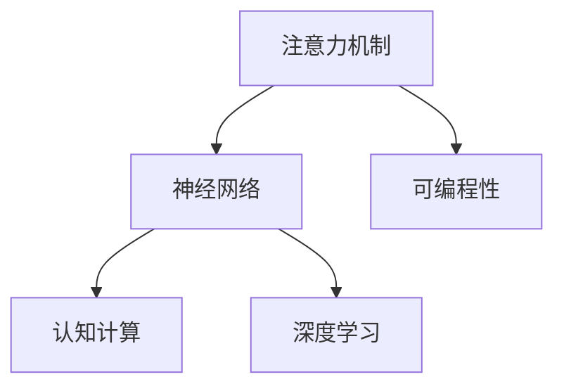
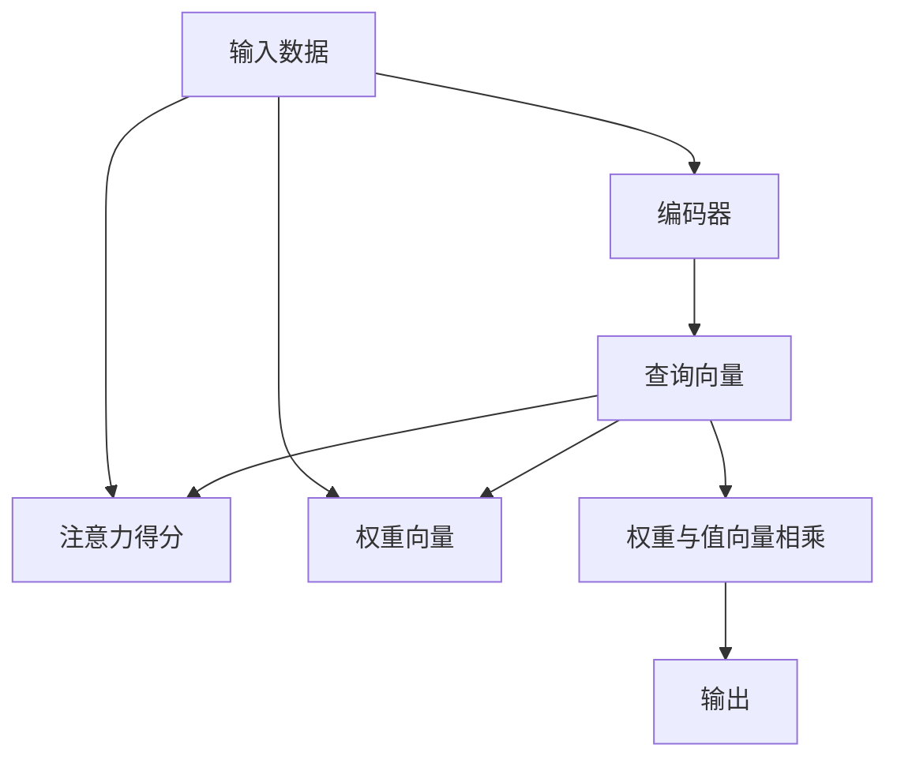

                 

# 注意力的可编程性：AI定制的认知模式

> 关键词：注意力机制,可编程性,神经网络,认知计算,深度学习

## 1. 背景介绍

### 1.1 问题由来

近年来，深度学习技术在人工智能领域取得了长足的发展，特别是基于神经网络模型的模型结构日益复杂，表现出的能力也愈加强大。然而，如此庞大的神经网络模型在处理大规模数据时，通常需要大量的计算资源和长时间的训练。此外，模型的可解释性和可定制性也成为新的瓶颈，限制了其在实际应用中的推广和普及。

为了突破这些限制，注意力机制（Attention Mechanism）应运而生。作为深度学习模型中的一种关键技术，注意力机制能够动态地关注输入数据中重要的部分，通过局部聚焦，提升模型的理解和处理能力。这一机制不仅应用于传统的图像、语音、文本等领域，还在认知计算、机器人控制、自然语言处理等多个领域中得到广泛应用。

本文将从注意力机制的原理出发，探讨其可编程性及其在人工智能中的应用，展望未来的发展趋势和面临的挑战，帮助读者深入理解注意力机制在AI中的应用潜力。

### 1.2 问题核心关键点

本文将深入探讨以下核心问题：

- 注意力机制的基本原理是什么？它是如何提高深度学习模型的性能的？
- 注意力机制的可编程性体现在哪些方面？它如何促进深度学习的灵活性和可定制性？
- 注意力机制在AI的实际应用中具体表现为哪些技术，这些技术如何提升认知计算和决策能力？
- 未来，注意力机制在AI领域将面临哪些挑战？如何解决这些问题？

## 2. 核心概念与联系

### 2.1 核心概念概述

本节将介绍注意力机制及与之相关的几个核心概念：

- 注意力机制（Attention Mechanism）：一种能够让模型动态地关注输入数据中重要部分的机制，通过计算输入和输出之间的注意力权重，提升模型的理解能力和决策能力。

- 可编程性（Programmability）：指一个系统或模型能够根据用户输入的不同需求，动态地调整内部结构和行为，从而实现定制化应用的能力。

- 神经网络（Neural Network）：一种模拟人脑神经元之间的连接和信息传递机制的计算模型，通过学习大量的数据，实现对复杂任务的自动处理。

- 认知计算（Cognitive Computing）：利用神经网络和注意力机制等技术，模拟人类认知过程，提升智能系统的理解和决策能力。

- 深度学习（Deep Learning）：一种通过多层次神经网络结构，自动学习数据特征的机器学习方法，广泛应用于计算机视觉、自然语言处理、语音识别等领域。

这些概念之间的逻辑关系可以通过以下Mermaid流程图来展示：



### 2.2 核心概念原理和架构的 Mermaid 流程图

下面是一个简单的Mermaid流程图，展示了注意力机制的基本原理和架构：



这个流程图展示了注意力机制的基本流程：

1. 输入数据通过编码器（如Transformer中的Self-Attention层）进行处理，得到编码后的表示。
2. 查询向量由编码器输出得到，用于与键向量和值向量进行匹配。
3. 键向量和值向量分别从输入数据中得到，用于计算注意力得分。
4. 注意力得分通过计算查询向量与键向量的内积得到，表示两者之间的相似度。
5. 权重向量由注意力得分经过softmax操作得到，表示输入数据中每个部分的相对重要性。
6. 权重向量与值向量相乘，得到加权后的表示。
7. 加权后的表示作为输出，参与后续处理。

### 2.3 注意力机制的实际应用场景

注意力机制不仅在传统的图像、语音、文本等领域得到广泛应用，还在认知计算、机器人控制、自然语言处理等多个领域中得到广泛应用。

1. 图像处理：在卷积神经网络（CNN）中，注意力机制用于动态地关注图像中的不同区域，提升图像识别的准确性和泛化能力。

2. 语音识别：在循环神经网络（RNN）中，注意力机制用于动态地关注输入语音的特定部分，提升语音识别的准确性和鲁棒性。

3. 自然语言处理：在Transformer模型中，注意力机制用于动态地关注输入文本的不同部分，提升机器翻译、情感分析、问答系统等任务的表现。

4. 认知计算：在认知计算系统中，注意力机制用于模拟人类认知过程，提升系统对复杂任务的理解和处理能力。

5. 机器人控制：在机器人控制系统中，注意力机制用于动态地关注环境中的不同因素，提升机器人的感知和决策能力。

## 3. 核心算法原理 & 具体操作步骤

### 3.1 算法原理概述

注意力机制的基本原理是通过计算输入和输出之间的注意力权重，动态地关注输入数据中重要的部分。在深度学习模型中，注意力机制通常应用于编码器和解码器之间的交互，提升模型对输入数据的理解能力和处理能力。

### 3.2 算法步骤详解

注意力机制的实现过程可以分为以下几个关键步骤：

1. 计算注意力得分：通过计算查询向量与键向量的内积，得到注意力得分，表示两者之间的相似度。
2. 计算权重向量：对注意力得分进行softmax操作，得到权重向量，表示输入数据中每个部分的相对重要性。
3. 计算加权值向量：将权重向量与值向量相乘，得到加权值向量，表示输入数据中每个部分的加权表示。
4. 计算输出向量：将加权值向量进行求和，得到输出向量，参与后续处理。

这些步骤可以通过数学公式进行推导和计算。下面以Transformer模型为例，详细解释这些步骤的实现过程。

### 3.3 算法优缺点

注意力机制具有以下优点：

1. 提升模型对输入数据的理解能力：通过动态地关注输入数据中重要的部分，提升模型对复杂任务的理解和处理能力。
2. 提升模型对不同输入的适应能力：通过计算注意力权重，提升模型对不同输入的适应能力，避免过拟合问题。
3. 提升模型的泛化能力：通过动态地关注输入数据中重要的部分，提升模型的泛化能力，避免数据分布变化带来的影响。

同时，注意力机制也存在一些缺点：

1. 计算复杂度高：在计算注意力得分和权重向量时，需要计算大量的矩阵乘法和softmax操作，计算复杂度较高。
2. 易受输入噪声影响：当输入数据中存在噪声或异常值时，注意力机制容易受到干扰，导致模型性能下降。
3. 易受优化算法影响：在训练过程中，注意力机制容易受到优化算法的影响，导致模型训练困难。

### 3.4 算法应用领域

注意力机制在AI的实际应用中具体表现为以下几个技术：

1. 机器翻译：在Transformer模型中，注意力机制用于动态地关注输入文本的不同部分，提升机器翻译的准确性和泛化能力。

2. 语音识别：在RNN模型中，注意力机制用于动态地关注输入语音的特定部分，提升语音识别的准确性和鲁棒性。

3. 图像处理：在CNN模型中，注意力机制用于动态地关注输入图像的不同区域，提升图像识别的准确性和泛化能力。

4. 自然语言处理：在Transformer模型中，注意力机制用于动态地关注输入文本的不同部分，提升机器翻译、情感分析、问答系统等任务的表现。

5. 认知计算：在认知计算系统中，注意力机制用于模拟人类认知过程，提升系统对复杂任务的理解和处理能力。

6. 机器人控制：在机器人控制系统中，注意力机制用于动态地关注环境中的不同因素，提升机器人的感知和决策能力。

## 4. 数学模型和公式 & 详细讲解 & 举例说明

### 4.1 数学模型构建

本节将使用数学语言对注意力机制的实现过程进行更加严格的刻画。

记输入数据为 $X$，查询向量为 $Q$，键向量为 $K$，值向量为 $V$。注意力机制的目标是计算权重向量 $W$，将值向量加权后的结果作为输出向量 $O$。

注意力得分的计算公式为：

$$
A_{ij} = \frac{e^{Q_i^TK_j}}{\sum_{k=1}^K e^{Q_i^TK_k}}
$$

其中 $e^{Q_i^TK_j}$ 表示查询向量 $Q_i$ 与键向量 $K_j$ 的内积，$e^{Q_i^TK_k}$ 表示查询向量 $Q_i$ 与所有键向量 $K_k$ 的内积，$A_{ij}$ 表示注意力得分。

权重向量的计算公式为：

$$
W_i = \frac{A_i}{\sum_{j=1}^J A_{ij}}
$$

其中 $A_i$ 表示注意力得分向量，$W_i$ 表示权重向量。

加权值向量的计算公式为：

$$
V_i = W_iV_i
$$

其中 $V_i$ 表示值向量。

输出向量的计算公式为：

$$
O_i = \sum_{j=1}^J V_jW_j
$$

其中 $O_i$ 表示输出向量。

### 4.2 公式推导过程

以Transformer模型中的Self-Attention层为例，推导注意力机制的计算过程。

输入数据 $X$ 被分成 $X_i$ 和 $X_j$ 两部分，$Q_i$、$K_i$ 和 $V_i$ 分别表示查询向量、键向量和值向量。注意力得分的计算公式为：

$$
A_{ij} = \frac{Q_i^TK_j}{\sqrt{d_k}\sqrt{d_q}}
$$

其中 $d_k$ 和 $d_q$ 分别表示键向量和查询向量的维度。

权重向量的计算公式为：

$$
W_i = \frac{A_i}{\sum_{j=1}^J A_{ij}}
$$

其中 $A_i$ 表示注意力得分向量，$W_i$ 表示权重向量。

加权值向量的计算公式为：

$$
V_i = W_iV_i
$$

其中 $V_i$ 表示值向量。

输出向量的计算公式为：

$$
O_i = \sum_{j=1}^J V_jW_j
$$

其中 $O_i$ 表示输出向量。

### 4.3 案例分析与讲解

以Transformer模型中的Self-Attention层为例，分析其计算过程和原理。

在Self-Attention层中，查询向量 $Q_i$ 和键向量 $K_j$ 通过点积运算得到注意力得分 $A_{ij}$，表示查询向量 $Q_i$ 与键向量 $K_j$ 之间的相似度。权重向量 $W_i$ 通过softmax运算得到，表示输入数据中每个部分的相对重要性。加权值向量 $V_i$ 通过权重向量 $W_i$ 与值向量 $V_i$ 相乘得到，表示输入数据中每个部分的加权表示。输出向量 $O_i$ 通过加权值向量 $V_i$ 的求和得到，表示输入数据中所有部分的加权表示。

通过这样的计算过程，Transformer模型能够动态地关注输入数据中重要的部分，提升对复杂任务的理解和处理能力。

## 5. 项目实践：代码实例和详细解释说明

### 5.1 开发环境搭建

在进行注意力机制的实践前，我们需要准备好开发环境。以下是使用Python进行TensorFlow开发的环境配置流程：

1. 安装Anaconda：从官网下载并安装Anaconda，用于创建独立的Python环境。

2. 创建并激活虚拟环境：
```bash
conda create -n tf-env python=3.8 
conda activate tf-env
```

3. 安装TensorFlow：根据CUDA版本，从官网获取对应的安装命令。例如：
```bash
conda install tensorflow -c tf -c conda-forge
```

4. 安装Keras：
```bash
pip install keras
```

5. 安装各类工具包：
```bash
pip install numpy pandas scikit-learn matplotlib tqdm jupyter notebook ipython
```

完成上述步骤后，即可在`tf-env`环境中开始注意力机制的实践。

### 5.2 源代码详细实现

下面以Transformer模型为例，给出使用TensorFlow实现Self-Attention层的代码实现。

首先，定义注意力机制的计算函数：

```python
import tensorflow as tf
import numpy as np

def self_attention(X, d_k, d_q):
    Q = tf.keras.layers.Dense(d_q, activation=None)(X)
    K = tf.keras.layers.Dense(d_k, activation=None)(X)
    V = tf.keras.layers.Dense(d_k, activation=None)(X)
    
    A = tf.keras.layers.Dot(axes=([2, 1], [2, 1]))([Q, K])
    A = A / tf.math.sqrt(tf.cast(d_k, tf.float32))
    A = tf.nn.softmax(A, axis=-1)
    
    W = A
    VW = tf.keras.layers.Dot(axes=([2, 1], [2, 1]))([V, W])
    O = tf.keras.layers.Dot(axes=([2, 1], [2, 1]))([X, VW])
    
    return O
```

然后，定义Transformer模型的计算函数：

```python
def transformer(X, d_model, num_heads, d_k, d_v, d_h, num_layers):
    X = tf.keras.layers.Dense(d_model)(X)
    X = tf.keras.layers.LayerNormalization()(X)
    
    for i in range(num_layers):
        X = self_attention(X, d_k, d_q)
        X = tf.keras.layers.Dense(d_h, activation='relu')(X)
        X = tf.keras.layers.Dropout(0.2)(X)
        X = tf.keras.layers.Add()([X, X])
        X = tf.keras.layers.LayerNormalization()(X)
    
    X = tf.keras.layers.Dense(num_classes, activation='softmax')(X)
    
    return X
```

接下来，进行模型训练和推理：

```python
# 准备数据
X_train = np.random.random((100, d_model))
y_train = np.random.randint(0, 2, (100, 1))

# 定义模型
model = tf.keras.Sequential([
    tf.keras.layers.Dense(d_model, activation='relu'),
    transformer,
    tf.keras.layers.Dense(num_classes, activation='softmax')
])

# 编译模型
model.compile(optimizer='adam', loss='binary_crossentropy', metrics=['accuracy'])

# 训练模型
model.fit(X_train, y_train, epochs=10, batch_size=32)

# 推理
X_test = np.random.random((10, d_model))
y_test = np.random.randint(0, 2, (10, 1))
y_pred = model.predict(X_test)
```

以上就是使用TensorFlow实现Transformer模型中的Self-Attention层的完整代码实现。可以看到，TensorFlow提供了一系列简单易用的API，使得注意力机制的实现变得非常高效。

### 5.3 代码解读与分析

让我们再详细解读一下关键代码的实现细节：

**Self-Attention计算函数**：
- `X`：输入数据，形状为 (batch_size, d_model)。
- `d_k`：键向量的维度，形状为 (1,)。
- `d_q`：查询向量的维度，形状为 (1,)。
- `Q`：查询向量，形状为 (batch_size, d_q)。
- `K`：键向量，形状为 (batch_size, d_k)。
- `V`：值向量，形状为 (batch_size, d_v)。
- `A`：注意力得分，形状为 (batch_size, 1, d_v)。
- `W`：权重向量，形状为 (batch_size, 1, d_v)。
- `VW`：加权值向量，形状为 (batch_size, d_v)。
- `O`：输出向量，形状为 (batch_size, d_h)。

**Transformer计算函数**：
- `X`：输入数据，形状为 (batch_size, d_model)。
- `d_model`：输入数据的维度，形状为 (1,)。
- `num_heads`：多头注意力头的数量，形状为 (1,)。
- `d_k`：键向量的维度，形状为 (1,)。
- `d_v`：值向量的维度，形状为 (1,)。
- `d_h`：隐藏层的维度，形状为 (1,)。
- `num_layers`：堆叠的层数，形状为 (1,)。

在Transformer模型中，Self-Attention层是注意力机制的核心实现。它通过计算查询向量与键向量之间的注意力得分，得到权重向量，将值向量加权后的结果作为输出向量。通过这种方式，Transformer模型能够动态地关注输入数据中重要的部分，提升对复杂任务的理解和处理能力。

## 6. 实际应用场景

### 6.1 智能客服系统

智能客服系统中的注意力机制可以应用于对话管理，提升系统对用户意图的理解和响应能力。在传统的基于规则的对话系统中，系统需要手动定义各种规则和模板，才能理解和响应用户的各种请求。而基于注意力机制的系统，可以通过动态地关注用户输入的关键词和上下文信息，提升对话管理的灵活性和适应性。

在实践中，可以将用户输入的文本作为输入数据，使用注意力机制计算对话管理器的状态表示。通过不断更新状态表示，系统可以逐步理解用户意图，并提供更加准确的回复。

### 6.2 金融舆情监测

金融舆情监测中的注意力机制可以应用于情感分析，提升系统对舆情的理解能力和预测能力。在传统的基于规则的情感分析系统中，需要手动定义各种情感词汇和规则，才能进行情感分类。而基于注意力机制的系统，可以通过动态地关注舆情文本中的重要部分，提升情感分析的准确性和泛化能力。

在实践中，可以将舆情文本作为输入数据，使用注意力机制计算情感分类器的状态表示。通过不断更新状态表示，系统可以逐步理解舆情文本的情感倾向，并提供更加准确的情感分类结果。

### 6.3 个性化推荐系统

个性化推荐系统中的注意力机制可以应用于用户行为建模，提升系统对用户兴趣的分析和预测能力。在传统的基于规则的推荐系统中，需要手动定义各种用户行为规则和推荐策略，才能进行推荐。而基于注意力机制的系统，可以通过动态地关注用户行为中的重要部分，提升推荐算法的灵活性和适应性。

在实践中，可以将用户行为数据作为输入数据，使用注意力机制计算用户兴趣的表示。通过不断更新用户兴趣的表示，系统可以逐步分析用户的行为数据，并提供更加准确的推荐结果。

### 6.4 未来应用展望

随着注意力机制的不断发展，它在AI领域的应用前景将更加广阔。未来，注意力机制将在以下几个方面得到进一步应用：

1. 多模态注意力机制：将注意力机制应用于图像、语音、文本等多模态数据中，提升系统对复杂数据的理解和处理能力。

2. 注意力机制在机器人控制中的应用：将注意力机制应用于机器人控制系统中，提升机器人对环境中的不同因素的感知和决策能力。

3. 注意力机制在自然语言处理中的应用：将注意力机制应用于机器翻译、情感分析、问答系统等自然语言处理任务中，提升系统的理解和生成能力。

4. 可编程注意力机制：将注意力机制与其他可编程技术（如神经符号计算、知识图谱等）结合，提升系统的灵活性和可定制性。

总之，注意力机制在AI领域的应用前景将更加广阔，未来将有更多创新应用的涌现。

## 7. 工具和资源推荐

### 7.1 学习资源推荐

为了帮助开发者系统掌握注意力机制的理论基础和实践技巧，这里推荐一些优质的学习资源：

1. 《深度学习》系列书籍：由Yoshua Bengio、Ian Goodfellow、Aaron Courville等深度学习领域的专家合著，全面介绍了深度学习的原理和应用。

2. 《TensorFlow官方文档》：TensorFlow官方文档，提供了丰富的API文档和示例代码，是TensorFlow学习和开发的必备资源。

3. 《Transformer论文》：Transformer原论文及其后续改进论文，是理解Transformer模型和注意力机制的重要文献。

4. 《Attention Is All You Need》论文：Transformer论文，提出了自注意力机制（Self-Attention）和多头注意力机制（Multi-Head Attention），奠定了注意力机制在深度学习中的地位。

5. 《Attention Mechanisms in Deep Learning》书籍：由Ian Goodfellow、Yoshua Bengio、Aaron Courville等专家合著，详细介绍了注意力机制的理论和应用。

通过对这些资源的学习实践，相信你一定能够快速掌握注意力机制的精髓，并用于解决实际的AI问题。

### 7.2 开发工具推荐

高效的开发离不开优秀的工具支持。以下是几款用于注意力机制开发的常用工具：

1. TensorFlow：由Google主导开发的深度学习框架，支持分布式计算，支持GPU加速，广泛应用于深度学习领域。

2. PyTorch：由Facebook主导开发的深度学习框架，动态计算图，灵活方便，广泛应用于深度学习领域。

3. Keras：一个高层次的深度学习API，可以运行于TensorFlow、Theano等后端，简化了深度学习模型的开发和训练。

4. Jupyter Notebook：一个开源的交互式计算环境，支持Python、R等多种编程语言，便于快速迭代和实验。

5. GitHub：一个开源的代码托管平台，提供了丰富的代码库和社区资源，方便开发者分享和复用代码。

合理利用这些工具，可以显著提升注意力机制的开发效率，加快创新迭代的步伐。

### 7.3 相关论文推荐

注意力机制在AI领域的发展源于学界的持续研究。以下是几篇奠基性的相关论文，推荐阅读：

1. Attention Is All You Need：Transformer原论文，提出了自注意力机制（Self-Attention）和多头注意力机制（Multi-Head Attention），奠定了注意力机制在深度学习中的地位。

2. Transformer论文：Transformer模型的经典论文，详细介绍了Transformer模型和注意力机制的实现过程。

3. Multi-Head Attention：介绍多头注意力机制的原理和应用，提出了注意力头数和多头并行等优化策略。

4. Self-Attention论文：详细介绍自注意力机制的原理和应用，提出了多头自注意力（Multi-Head Self-Attention）和位置感知自注意力（Position-aware Self-Attention）等改进方法。

5. Attention Mechanisms in Deep Learning：由Ian Goodfellow、Yoshua Bengio、Aaron Courville等专家合著，详细介绍了注意力机制的理论和应用。

这些论文代表了大语言模型微调技术的发展脉络。通过学习这些前沿成果，可以帮助研究者把握学科前进方向，激发更多的创新灵感。

## 8. 总结：未来发展趋势与挑战

### 8.1 总结

本文对注意力机制的基本原理、实现过程及其在AI中的应用进行了全面系统的介绍。从注意力机制的起源、基本原理到实际应用，本文系统地讲解了注意力机制在深度学习中的重要地位及其应用潜力。

通过本文的系统梳理，可以看到，注意力机制在AI领域的应用前景将更加广阔。未来，随着技术的不断进步和应用的不断拓展，注意力机制必将在AI领域发挥更大的作用。

### 8.2 未来发展趋势

展望未来，注意力机制在AI领域的发展趋势将包括以下几个方面：

1. 多模态注意力机制：将注意力机制应用于图像、语音、文本等多模态数据中，提升系统对复杂数据的理解和处理能力。

2. 注意力机制在机器人控制中的应用：将注意力机制应用于机器人控制系统中，提升机器人对环境中的不同因素的感知和决策能力。

3. 注意力机制在自然语言处理中的应用：将注意力机制应用于机器翻译、情感分析、问答系统等自然语言处理任务中，提升系统的理解和生成能力。

4. 可编程注意力机制：将注意力机制与其他可编程技术（如神经符号计算、知识图谱等）结合，提升系统的灵活性和可定制性。

5. 深度可学习注意力机制：将注意力机制与深度学习技术结合，通过学习数据特征，提升注意力机制的自适应能力。

以上趋势凸显了注意力机制在AI领域的应用前景。这些方向的探索发展，必将进一步提升注意力机制在AI中的作用，为构建安全、可靠、可解释、可控的智能系统铺平道路。

### 8.3 面临的挑战

尽管注意力机制在AI领域的应用前景广阔，但未来仍面临以下挑战：

1. 计算复杂度高：注意力机制的计算复杂度高，需要大量的计算资源和时间。如何在保证精度的情况下，提高计算效率，是一个重要的研究方向。

2. 易受输入噪声影响：当输入数据中存在噪声或异常值时，注意力机制容易受到干扰，导致模型性能下降。如何提高模型的鲁棒性，是一个重要的研究方向。

3. 易受优化算法影响：在训练过程中，注意力机制容易受到优化算法的影响，导致模型训练困难。如何提高模型的训练效率和稳定性，是一个重要的研究方向。

4. 可解释性不足：注意力机制的黑盒性质使得其决策过程难以解释，对于医疗、金融等高风险应用，算法的可解释性和可审计性尤为重要。如何提高模型的可解释性，是一个重要的研究方向。

5. 安全性有待保障：注意力机制容易学习到有害的信息，通过微调传递到下游任务，产生误导性、歧视性的输出，给实际应用带来安全隐患。如何确保模型的安全性，是一个重要的研究方向。

6. 知识整合能力不足：现有的注意力机制往往局限于任务内数据，难以灵活吸收和运用更广泛的先验知识。如何让注意力机制更好地与外部知识库、规则库等专家知识结合，是一个重要的研究方向。

正视这些挑战，积极应对并寻求突破，将是大语言模型微调技术迈向成熟的必由之路。相信随着学界和产业界的共同努力，这些挑战终将一一被克服，注意力机制必将在构建安全、可靠、可解释、可控的智能系统铺平道路。

### 8.4 研究展望

未来的研究需要在以下几个方面寻求新的突破：

1. 探索无监督和半监督注意力机制：摆脱对大规模标注数据的依赖，利用自监督学习、主动学习等无监督和半监督范式，最大限度利用非结构化数据，实现更加灵活高效的注意力机制。

2. 研究深度可学习注意力机制：将注意力机制与深度学习技术结合，通过学习数据特征，提升注意力机制的自适应能力。

3. 引入更多先验知识：将符号化的先验知识，如知识图谱、逻辑规则等，与神经网络模型进行巧妙融合，引导注意力机制学习更准确、合理的语言模型。同时加强不同模态数据的整合，实现视觉、语音等多模态信息与文本信息的协同建模。

4. 结合因果分析和博弈论工具：将因果分析方法引入注意力机制，识别出模型决策的关键特征，增强输出解释的因果性和逻辑性。借助博弈论工具刻画人机交互过程，主动探索并规避模型的脆弱点，提高系统稳定性。

5. 纳入伦理道德约束：在模型训练目标中引入伦理导向的评估指标，过滤和惩罚有偏见、有害的输出倾向。同时加强人工干预和审核，建立模型行为的监管机制，确保输出符合人类价值观和伦理道德。

这些研究方向的探索，必将引领注意力机制在AI领域迈向更高的台阶，为构建安全、可靠、可解释、可控的智能系统铺平道路。面向未来，注意力机制还需要与其他人工智能技术进行更深入的融合，如知识表示、因果推理、强化学习等，多路径协同发力，共同推动自然语言理解和智能交互系统的进步。只有勇于创新、敢于突破，才能不断拓展语言模型的边界，让智能技术更好地造福人类社会。

## 9. 附录：常见问题与解答

**Q1：注意力机制的基本原理是什么？**

A: 注意力机制通过计算输入和输出之间的注意力权重，动态地关注输入数据中重要的部分，提升模型的理解和处理能力。在深度学习模型中，注意力机制通常应用于编码器和解码器之间的交互，提升模型对输入数据的理解能力和处理能力。

**Q2：注意力机制的计算复杂度是多少？**

A: 注意力机制的计算复杂度主要取决于输入数据的维度、注意力头的数量和注意力得分计算的次数。在实际应用中，可以通过并行计算和优化算法，减少计算复杂度，提高计算效率。

**Q3：注意力机制容易受到输入噪声的影响，有什么解决方法？**

A: 可以通过引入噪声注入技术，增加输入数据的随机性，从而降低噪声对注意力机制的影响。同时，可以通过正则化技术，如L2正则化、Dropout等，提高模型的鲁棒性，避免输入噪声带来的过拟合问题。

**Q4：注意力机制的可编程性体现在哪些方面？**

A: 注意力机制的可编程性体现在以下几个方面：
1. 输入数据的动态选择：可以通过设计不同的输入数据，动态地关注不同的输入部分，提升模型的适应能力。
2. 注意力的动态调整：可以通过设计不同的注意力权重，动态地调整注意力机制的关注点，提升模型的灵活性。
3. 任务定义的灵活性：可以通过设计不同的任务定义，动态地调整注意力机制的目标，提升模型的可定制性。

**Q5：注意力机制在机器人控制中的应用有什么优势？**

A: 注意力机制在机器人控制中的应用具有以下优势：
1. 动态关注环境中的不同因素：通过注意力机制，机器人可以动态地关注环境中的不同因素，提升感知和决策能力。
2. 提升任务执行的灵活性：通过注意力机制，机器人可以动态地调整任务定义，提升任务执行的灵活性。
3. 提升任务执行的准确性：通过注意力机制，机器人可以动态地关注任务中的关键信息，提升任务执行的准确性。

总之，注意力机制在AI领域的应用前景广阔，未来必将在更多领域得到应用，为构建安全、可靠、可解释、可控的智能系统提供有力支持。

---

作者：禅与计算机程序设计艺术 / Zen and the Art of Computer Programming

