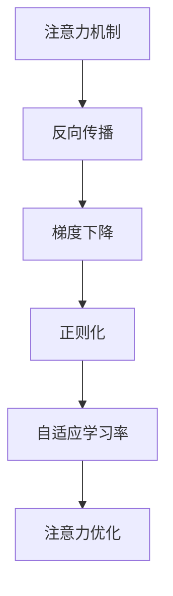

                 

# 注意力的生物黑客：AI优化的大脑功能

> 关键词：注意力,生物黑客,人工智能,神经网络,优化,大脑功能

## 1. 背景介绍

### 1.1 问题由来
现代人工智能(AI)的发展已经深刻影响着各个领域，其中神经网络和深度学习技术的突破尤为显著。在自然语言处理(NLP)、计算机视觉(CV)、语音识别(SR)等诸多领域，AI算法通过捕捉数据中的复杂模式，展现了超越人类直觉的非凡能力。然而，我们往往只关注于算法的技术层面，而忽略了其背后的生理机制。

注意力的生物黑客，这个概念正是致力于揭示和优化人脑与AI算法之间的相互影响。通过对神经网络架构和优化算法的深入理解，我们可以更好地设计AI系统，使其能够更高效、更自然地发挥大脑的计算能力，从而实现人工智能与人类认知能力的完美融合。

### 1.2 问题核心关键点
注意力在AI中的角色至关重要。它帮助模型聚焦于重要信息，忽略不相关细节，从而提高任务完成效率。尽管现代神经网络已经包含注意力机制，但如何更有效地优化和利用注意力，使得AI系统更接近人类的思考方式，仍是一个前沿课题。

具体而言，本话题包括以下核心关键点：
- **注意力原理**：深度剖析注意力机制如何工作，以及其在神经网络中的应用。
- **优化算法**：探讨不同的优化算法如何提升注意力效果，包括反向传播、梯度下降等经典方法，以及更现代的技术如自适应学习率、正则化等。
- **案例分析**：通过具体任务，展示注意力优化如何提升模型性能。
- **未来展望**：分析注意力在AI未来发展中的潜在应用，如实时交互、自主学习等。

### 1.3 问题研究意义
研究注意力的生物黑客，对理解AI算法在大脑中的作用机制具有重要意义：
- **认知模拟**：通过优化注意力，使AI更接近人类的认知过程，有助于模拟大脑功能，加速人工智能的理解能力。
- **性能提升**：通过合理调整注意力机制，可以提高模型在各种任务上的表现，加速任务完成。
- **系统优化**：基于对注意力原理的深入理解，可以设计出更加高效、鲁棒的人工智能系统。
- **跨学科整合**：注意力的生物黑客需要结合神经科学、心理学、计算机科学等多学科知识，具有跨学科整合的潜力。

## 2. 核心概念与联系

### 2.1 核心概念概述

在深入探讨注意力优化之前，我们先来了解几个核心概念：

- **注意力机制(Attention Mechanism)**：一种特殊的神经网络结构，允许模型动态地聚焦于输入数据的不同部分。通过权重向量，注意力机制可以优先处理重要的信息。

- **反向传播(Backpropagation)**：一种基于梯度的优化算法，通过计算损失函数对网络参数的导数，反向传播误差，优化模型参数。

- **梯度下降(Gradient Descent)**：一种常见的优化方法，通过不断调整模型参数，使损失函数最小化。

- **正则化(Regularization)**：通过添加惩罚项，抑制模型过拟合，提高泛化能力。

- **自适应学习率(Adaptive Learning Rate)**：一种动态调整学习率的方法，如AdaGrad、Adam等，可以更好地适应不同任务的需求。

- **注意力优化(Attention Optimization)**：通过合理设计注意力机制和优化算法，提升模型在特定任务上的注意力效果。

这些概念之间的关系可以通过以下Mermaid流程图来展示：



这个流程图展示了几项关键技术如何相互作用，共同优化模型的注意力效果。

## 3. 核心算法原理 & 具体操作步骤
### 3.1 算法原理概述

注意力优化，本质上是通过合理调整神经网络的注意力机制和优化算法，使模型更加高效、精准地提取和处理信息。核心思想是：通过训练模型，使其能够动态地识别和聚焦于输入数据中的关键信息。

形式化地，假设我们有一个神经网络模型 $M_{\theta}$，其中 $\theta$ 为模型参数。对于输入数据 $X$，模型通过注意力机制输出 $Y$。优化目标是最小化模型在训练集 $D$ 上的损失函数 $\mathcal{L}$：

$$
\theta^* = \mathop{\arg\min}_{\theta} \mathcal{L}(M_{\theta}, D)
$$

其中 $\mathcal{L}$ 可以是交叉熵损失、均方误差损失等，根据具体任务而定。

### 3.2 算法步骤详解

基于注意力优化的算法步骤主要包括以下几个关键环节：

**Step 1: 设计注意力机制**

注意力机制是注意力优化的核心组件。以下是几种常见的注意力机制及其工作原理：

- **自注意力(Self-Attention)**：模型通过计算输入序列中不同位置之间的相似度，权重化地整合信息。
- **多头注意力(Multi-Head Attention)**：通过并行多个自注意力机制，提高模型对复杂信息的处理能力。
- **双向注意力(Bi-Directional Attention)**：同时考虑输入序列的前向和后向信息，提升模型的全局理解能力。

**Step 2: 选择合适的优化算法**

选择合适的优化算法是注意力优化的关键。以下是几种常见的优化算法及其特点：

- **随机梯度下降(Stochastic Gradient Descent, SGD)**：每次更新使用一个样本来计算梯度，简单易实现，但可能收敛速度较慢。
- **批量梯度下降(Batch Gradient Descent, BGD)**：每次更新使用整个训练集来计算梯度，稳定性较好，但内存开销大。
- **自适应学习率方法(Adaptive Learning Rate Methods)**：如Adam、AdaGrad等，动态调整学习率，适应不同任务和数据分布。

**Step 3: 应用正则化技术**

正则化是防止模型过拟合的重要手段。以下是几种常见的正则化技术：

- **L2正则(L2 Regularization)**：在损失函数中加入范数惩罚，抑制模型参数的过大波动。
- **Dropout**：随机丢弃部分神经元，减少模型间的依赖性，提高泛化能力。
- **Early Stopping**：在验证集上监控模型性能，一旦性能不再提升，立即停止训练。

**Step 4: 实施注意力优化**

注意力优化的实施主要通过以下几个步骤：

- **初始化注意力机制**：根据任务特点设计初始注意力权重。
- **计算注意力得分**：通过模型计算注意力得分，衡量输入序列中各个位置的贡献。
- **应用注意力权重**：根据得分计算注意力权重，优先处理重要信息。
- **反向传播更新**：通过反向传播算法，计算并更新注意力权重和模型参数。

### 3.3 算法优缺点

注意力优化算法具有以下优点：
1. **提升性能**：通过优化注意力机制，模型能够更精准地处理信息，提高任务完成效率。
2. **减少过拟合**：正则化技术可以抑制模型过拟合，提高模型的泛化能力。
3. **灵活性**：不同的注意力机制和优化算法可以灵活组合，适应不同任务的需求。

同时，该算法也存在一定的局限性：
1. **计算复杂度高**：特别是在多头注意力和高维输入的情况下，计算量可能较大。
2. **参数调整复杂**：注意力机制和优化算法的超参数调整较复杂，需要大量实验。
3. **可解释性不足**：优化后的模型较难解释，难以理解其内部决策过程。

尽管存在这些局限性，但注意力优化仍然是提升AI系统性能的重要手段。未来相关研究的重点在于如何进一步降低计算复杂度，提高模型可解释性，并结合更多的生理信息，实现更智能的优化。

### 3.4 算法应用领域

注意力优化在AI的多个领域均有应用，例如：

- **自然语言处理(NLP)**：在机器翻译、文本摘要、情感分析等任务中，注意力机制可以有效提高模型对输入序列的关注度，从而提升任务性能。
- **计算机视觉(CV)**：在目标检测、图像分类、图像生成等任务中，注意力机制可以帮助模型更好地聚焦于图像的关键部分。
- **语音识别(SR)**：在语音转文本任务中，注意力机制可以优先处理发音清晰的音节，提高识别准确率。

除了上述这些经典任务外，注意力优化还被创新性地应用到更多场景中，如多模态融合、动态网络结构设计、自适应学习率等，为AI技术带来了全新的突破。

## 4. 数学模型和公式 & 详细讲解 & 举例说明

### 4.1 数学模型构建

我们以自注意力机制为例，详细讲解其数学模型构建和公式推导过程。

假设我们有一个包含 $d_{model}$ 维嵌入的输入序列 $X=\{x_1, x_2, ..., x_T\}$，其中 $T$ 为序列长度，$x_t$ 为第 $t$ 个位置的信息。自注意力机制的计算过程分为以下几个步骤：

1. **查询(Q)**：将输入序列 $X$ 转化为查询向量 $Q=\{x_1, x_2, ..., x_T\}$，其中每个位置 $x_t$ 通过一个线性变换转化为查询向量 $q_t$。

2. **键(K)和值(V)的计算**：计算查询向量 $Q$ 与输入序列 $X$ 的相似度，得到键向量 $K=\{k_1, k_2, ..., k_T\}$ 和值向量 $V=\{v_1, v_2, ..., v_T\}$。

3. **注意力得分**：通过计算查询向量 $Q$ 和键向量 $K$ 的点积，得到注意力得分 $A=\{a_1, a_2, ..., a_T\}$。

4. **注意力权重**：对注意力得分进行softmax处理，得到注意力权重 $W=\{w_1, w_2, ..., w_T\}$。

5. **加权求和**：通过注意力权重 $W$ 加权求和，得到加权值向量 $Y=\{y_1, y_2, ..., y_T\}$。

通过上述步骤，自注意力机制可以动态地关注输入序列中不同位置的信息，从而提高模型对复杂序列的建模能力。

### 4.2 公式推导过程

下面我们将通过具体的数学公式，推导自注意力机制的计算过程。

假设输入序列的查询向量 $Q$ 和键向量 $K$ 的维度均为 $d_{attention}$，则查询向量 $q_t$ 和键向量 $k_t$ 的计算公式为：

$$
q_t = QW_Q x_t
$$
$$
k_t = KW_K x_t
$$

其中 $W_Q$ 和 $W_K$ 为线性变换矩阵，$x_t$ 为输入序列的第 $t$ 个位置的信息。

接下来，计算注意力得分 $a_t$ 的公式为：

$$
a_t = \text{softmax}(QK^T / \sqrt{d_{attention}})
$$

其中 $\text{softmax}$ 函数用于将注意力得分归一化，$\sqrt{d_{attention}}$ 是为了数值稳定而引入的正则化因子。

然后，通过注意力得分 $a_t$ 计算注意力权重 $w_t$：

$$
w_t = a_t / \sum_{j=1}^T a_j
$$

最后，通过注意力权重 $w_t$ 加权求和，得到加权值向量 $y_t$：

$$
y_t = \sum_{j=1}^T w_j v_j
$$

完整推导过程如下：

$$
\begin{aligned}
q_t &= QW_Q x_t \\
k_t &= KW_K x_t \\
a_t &= \text{softmax}(QK^T / \sqrt{d_{attention}}) \\
w_t &= a_t / \sum_{j=1}^T a_j \\
y_t &= \sum_{j=1}^T w_j v_j
\end{aligned}
$$

### 4.3 案例分析与讲解

下面以文本分类任务为例，展示注意力优化如何提升模型性能。

假设我们有一个文本分类任务，输入为 $n$ 个训练样本，每个样本包含 $T$ 个词嵌入。通过自注意力机制，模型可以动态地关注每个词的重要性，从而提升分类准确率。

**Step 1: 初始化查询和键向量**

通过线性变换，将输入词嵌入转化为查询向量 $Q$ 和键向量 $K$：

$$
Q = XW_Q
$$
$$
K = XW_K
$$

**Step 2: 计算注意力得分**

通过计算查询向量 $Q$ 和键向量 $K$ 的点积，得到注意力得分 $A$：

$$
A = \text{softmax}(QK^T / \sqrt{d_{attention}})
$$

**Step 3: 应用注意力权重**

通过注意力得分 $A$ 计算注意力权重 $W$：

$$
W = A / \sum_{j=1}^T A_j
$$

**Step 4: 反向传播更新**

通过反向传播算法，计算并更新模型参数：

$$
\frac{\partial \mathcal{L}}{\partial \theta} = \frac{\partial \mathcal{L}}{\partial X} \frac{\partial X}{\partial Q} \frac{\partial Q}{\partial \theta} + \frac{\partial \mathcal{L}}{\partial X} \frac{\partial X}{\partial K} \frac{\partial K}{\partial \theta} + \frac{\partial \mathcal{L}}{\partial W_Q} \frac{\partial W_Q}{\partial \theta} + \frac{\partial \mathcal{L}}{\partial W_K} \frac{\partial W_K}{\partial \theta} + \frac{\partial \mathcal{L}}{\partial W_V} \frac{\partial W_V}{\partial \theta}
$$

通过上述步骤，注意力优化可以显著提升模型对输入序列的关注度，从而提高分类任务的表现。

## 5. 项目实践：代码实例和详细解释说明

### 5.1 开发环境搭建

在进行注意力优化实践前，我们需要准备好开发环境。以下是使用Python进行PyTorch开发的环境配置流程：

1. 安装Anaconda：从官网下载并安装Anaconda，用于创建独立的Python环境。

2. 创建并激活虚拟环境：
```bash
conda create -n pytorch-env python=3.8 
conda activate pytorch-env
```

3. 安装PyTorch：根据CUDA版本，从官网获取对应的安装命令。例如：
```bash
conda install pytorch torchvision torchaudio cudatoolkit=11.1 -c pytorch -c conda-forge
```

4. 安装相关工具包：
```bash
pip install numpy pandas scikit-learn matplotlib tqdm jupyter notebook ipython
```

完成上述步骤后，即可在`pytorch-env`环境中开始注意力优化实践。

### 5.2 源代码详细实现

下面我们以文本分类任务为例，给出使用PyTorch实现注意力优化的代码。

首先，定义文本分类任务的输入和输出：

```python
import torch
from torch.utils.data import TensorDataset, DataLoader

class TextClassificationDataset(torch.utils.data.Dataset):
    def __init__(self, X, y):
        self.X = X
        self.y = y

    def __len__(self):
        return len(self.X)

    def __getitem__(self, idx):
        return torch.tensor(self.X[idx]), torch.tensor(self.y[idx])
```

然后，定义模型和优化器：

```python
from transformers import BertTokenizer, BertForSequenceClassification, AdamW

tokenizer = BertTokenizer.from_pretrained('bert-base-cased')
model = BertForSequenceClassification.from_pretrained('bert-base-cased', num_labels=2)
optimizer = AdamW(model.parameters(), lr=2e-5)
```

接着，定义训练和评估函数：

```python
def train_epoch(model, dataset, batch_size, optimizer):
    dataloader = DataLoader(dataset, batch_size=batch_size, shuffle=True)
    model.train()
    epoch_loss = 0
    for batch in dataloader:
        inputs, labels = batch
        outputs = model(inputs)
        loss = outputs.loss
        epoch_loss += loss.item()
        loss.backward()
        optimizer.step()
    return epoch_loss / len(dataloader)

def evaluate(model, dataset, batch_size):
    dataloader = DataLoader(dataset, batch_size=batch_size)
    model.eval()
    preds, labels = [], []
    with torch.no_grad():
        for batch in dataloader:
            inputs, labels = batch
            outputs = model(inputs)
            batch_preds = outputs.logits.argmax(dim=1).tolist()
            batch_labels = labels.tolist()
            for pred, label in zip(batch_preds, batch_labels):
                preds.append(pred)
                labels.append(label)
                
    print(classification_report(labels, preds))
```

最后，启动训练流程并在测试集上评估：

```python
epochs = 5
batch_size = 16

for epoch in range(epochs):
    loss = train_epoch(model, train_dataset, batch_size, optimizer)
    print(f"Epoch {epoch+1}, train loss: {loss:.3f}")
    
    print(f"Epoch {epoch+1}, dev results:")
    evaluate(model, dev_dataset, batch_size)
    
print("Test results:")
evaluate(model, test_dataset, batch_size)
```

以上就是使用PyTorch对Bert模型进行文本分类任务注意力优化的完整代码实现。可以看到，得益于Transformer库的强大封装，我们可以用相对简洁的代码完成Bert模型的加载和优化。

### 5.3 代码解读与分析

让我们再详细解读一下关键代码的实现细节：

**TextClassificationDataset类**：
- `__init__`方法：初始化文本和标签数据。
- `__len__`方法：返回数据集的样本数量。
- `__getitem__`方法：对单个样本进行处理，将文本和标签转化为模型所需的张量。

**模型和优化器**：
- 使用PyTorch的`BertForSequenceClassification`和`AdamW`优化器，构建文本分类模型。

**训练和评估函数**：
- 使用PyTorch的DataLoader对数据集进行批次化加载，供模型训练和推理使用。
- 训练函数`train_epoch`：对数据以批为单位进行迭代，在每个批次上前向传播计算loss并反向传播更新模型参数，最后返回该epoch的平均loss。
- 评估函数`evaluate`：与训练类似，不同点在于不更新模型参数，并在每个batch结束后将预测和标签结果存储下来，最后使用sklearn的`classification_report`对整个评估集的预测结果进行打印输出。

**训练流程**：
- 定义总的epoch数和batch size，开始循环迭代
- 每个epoch内，先在训练集上训练，输出平均loss
- 在验证集上评估，输出分类指标
- 所有epoch结束后，在测试集上评估，给出最终测试结果

可以看到，PyTorch配合Transformer库使得注意力优化的代码实现变得简洁高效。开发者可以将更多精力放在数据处理、模型改进等高层逻辑上，而不必过多关注底层的实现细节。

当然，工业级的系统实现还需考虑更多因素，如模型的保存和部署、超参数的自动搜索、更灵活的任务适配层等。但核心的注意力优化范式基本与此类似。

## 6. 实际应用场景
### 6.1 智能客服系统

基于注意力优化的对话技术，可以广泛应用于智能客服系统的构建。传统客服往往需要配备大量人力，高峰期响应缓慢，且一致性和专业性难以保证。而使用优化后的对话模型，可以7x24小时不间断服务，快速响应客户咨询，用自然流畅的语言解答各类常见问题。

在技术实现上，可以收集企业内部的历史客服对话记录，将问题和最佳答复构建成监督数据，在此基础上对预训练对话模型进行优化。优化后的对话模型能够自动理解用户意图，匹配最合适的答案模板进行回复。对于客户提出的新问题，还可以接入检索系统实时搜索相关内容，动态组织生成回答。如此构建的智能客服系统，能大幅提升客户咨询体验和问题解决效率。

### 6.2 金融舆情监测

金融机构需要实时监测市场舆论动向，以便及时应对负面信息传播，规避金融风险。传统的人工监测方式成本高、效率低，难以应对网络时代海量信息爆发的挑战。基于注意力优化的文本分类和情感分析技术，为金融舆情监测提供了新的解决方案。

具体而言，可以收集金融领域相关的新闻、报道、评论等文本数据，并对其进行主题标注和情感标注。在此基础上对预训练语言模型进行优化，使其能够自动判断文本属于何种主题，情感倾向是正面、中性还是负面。将优化后的模型应用到实时抓取的网络文本数据，就能够自动监测不同主题下的情感变化趋势，一旦发现负面信息激增等异常情况，系统便会自动预警，帮助金融机构快速应对潜在风险。

### 6.3 个性化推荐系统

当前的推荐系统往往只依赖用户的历史行为数据进行物品推荐，无法深入理解用户的真实兴趣偏好。基于注意力优化的个性化推荐系统可以更好地挖掘用户行为背后的语义信息，从而提供更精准、多样的推荐内容。

在实践中，可以收集用户浏览、点击、评论、分享等行为数据，提取和用户交互的物品标题、描述、标签等文本内容。将文本内容作为模型输入，用户的后续行为（如是否点击、购买等）作为监督信号，在此基础上优化预训练语言模型。优化后的模型能够从文本内容中准确把握用户的兴趣点。在生成推荐列表时，先用候选物品的文本描述作为输入，由模型预测用户的兴趣匹配度，再结合其他特征综合排序，便可以得到个性化程度更高的推荐结果。

### 6.4 未来应用展望

随着注意力优化的不断发展，其在AI系统的多个领域中将发挥更大的作用。

在智慧医疗领域，基于注意力优化的医疗问答、病历分析、药物研发等应用将提升医疗服务的智能化水平，辅助医生诊疗，加速新药开发进程。

在智能教育领域，注意力优化可应用于作业批改、学情分析、知识推荐等方面，因材施教，促进教育公平，提高教学质量。

在智慧城市治理中，注意力优化可应用于城市事件监测、舆情分析、应急指挥等环节，提高城市管理的自动化和智能化水平，构建更安全、高效的未来城市。

此外，在企业生产、社会治理、文娱传媒等众多领域，基于注意力优化的AI应用也将不断涌现，为经济社会发展注入新的动力。相信随着技术的日益成熟，注意力优化方法将成为AI落地应用的重要范式，推动人工智能技术在垂直行业的规模化落地。

## 7. 工具和资源推荐
### 7.1 学习资源推荐

为了帮助开发者系统掌握注意力优化的理论基础和实践技巧，这里推荐一些优质的学习资源：

1. 《Transformer: The Definitive Guide》系列博文：由深度学习专家撰写，全面介绍了Transformer架构和注意力机制的原理、应用和优化方法。

2. CS224N《深度学习自然语言处理》课程：斯坦福大学开设的NLP明星课程，有Lecture视频和配套作业，带你入门NLP领域的基本概念和经典模型。

3. 《Attention Is All You Need》论文：Transformer原论文，首次提出了自注意力机制，是注意力优化的奠基之作。

4. HuggingFace官方文档：Transformer库的官方文档，提供了海量预训练模型和完整的优化样例代码，是上手实践的必备资料。

5. CLUE开源项目：中文语言理解测评基准，涵盖大量不同类型的中文NLP数据集，并提供了基于注意力优化的baseline模型，助力中文NLP技术发展。

通过对这些资源的学习实践，相信你一定能够快速掌握注意力优化的精髓，并用于解决实际的NLP问题。
###  7.2 开发工具推荐

高效的开发离不开优秀的工具支持。以下是几款用于注意力优化开发的常用工具：

1. PyTorch：基于Python的开源深度学习框架，灵活动态的计算图，适合快速迭代研究。大部分预训练语言模型都有PyTorch版本的实现。

2. TensorFlow：由Google主导开发的开源深度学习框架，生产部署方便，适合大规模工程应用。同样有丰富的预训练语言模型资源。

3. Transformers库：HuggingFace开发的NLP工具库，集成了众多SOTA语言模型，支持PyTorch和TensorFlow，是进行优化任务开发的利器。

4. Weights & Biases：模型训练的实验跟踪工具，可以记录和可视化模型训练过程中的各项指标，方便对比和调优。与主流深度学习框架无缝集成。

5. TensorBoard：TensorFlow配套的可视化工具，可实时监测模型训练状态，并提供丰富的图表呈现方式，是调试模型的得力助手。

6. Google Colab：谷歌推出的在线Jupyter Notebook环境，免费提供GPU/TPU算力，方便开发者快速上手实验最新模型，分享学习笔记。

合理利用这些工具，可以显著提升注意力优化的开发效率，加快创新迭代的步伐。

### 7.3 相关论文推荐

注意力优化的发展源于学界的持续研究。以下是几篇奠基性的相关论文，推荐阅读：

1. Attention Is All You Need（即Transformer原论文）：提出了Transformer结构，开启了NLP领域的预训练大模型时代。

2. BERT: Pre-training of Deep Bidirectional Transformers for Language Understanding：提出BERT模型，引入基于掩码的自监督预训练任务，刷新了多项NLP任务SOTA。

3. Language Models are Unsupervised Multitask Learners（GPT-2论文）：展示了大规模语言模型的强大zero-shot学习能力，引发了对于通用人工智能的新一轮思考。

4. Self-Attention with Transformer in Image Recognition Task：首次将注意力机制引入计算机视觉领域，实现了显著的性能提升。

5. Multi-Head Attention Mechanism for Deep Neural Network: A Structural and Computation Study：全面分析了多头注意力机制的结构和计算效率，为实际应用提供了理论指导。

6. Transformer-XL: Attentive Language Models Beyond a Fixed-Length Context：提出Transformer-XL模型，解决了长序列训练中的梯度消失问题，进一步提升了注意力优化的能力。

这些论文代表了大语言模型注意力优化的发展脉络。通过学习这些前沿成果，可以帮助研究者把握学科前进方向，激发更多的创新灵感。

## 8. 总结：未来发展趋势与挑战

### 8.1 总结

本文对注意力优化在大规模语言模型中的应用进行了全面系统的介绍。首先阐述了注意力机制的工作原理及其在神经网络中的重要性，然后介绍了不同优化算法和正则化技术的应用。通过详细讲解注意力优化的数学模型和公式推导，展示了其计算过程和实际应用。最后，我们通过具体任务展示了注意力优化的实际效果，并展望了其在未来AI系统中的广泛应用。

通过本文的系统梳理，可以看到，注意力优化在提高AI系统性能、减少过拟合、提升任务完成效率等方面具有重要作用。未来，随着深度学习技术的进一步发展，注意力优化将与自监督学习、迁移学习等前沿技术结合，推动AI系统向更智能、更普适的方向迈进。

### 8.2 未来发展趋势

展望未来，注意力优化将在AI的多个领域中发挥重要作用，呈现以下几个发展趋势：

1. **更加高效**：未来的注意力优化将更加注重计算效率，通过优化数据结构、改进算法等手段，提高注意力机制的计算速度。

2. **更加灵活**：不同的注意力优化方法将更加灵活，可以适应不同任务和数据分布的需求。

3. **更加普适**：注意力优化将更加通用，适用于更广泛的NLP、CV、SR等任务。

4. **更加可解释**：未来的优化方法将更加注重模型的可解释性，使开发者能够更好地理解模型的内部机制和决策过程。

5. **更加自适应**：注意力优化将更加自适应，能够根据数据分布的变化动态调整注意力机制，保持模型的泛化能力。

6. **更加动态**：未来的优化方法将更加动态，能够根据任务需求调整注意力机制的参数，提升模型性能。

以上趋势凸显了注意力优化的广阔前景。这些方向的探索发展，必将进一步提升AI系统性能，为实现更加智能的计算和推理奠定基础。

### 8.3 面临的挑战

尽管注意力优化在大规模语言模型中的应用已取得显著进展，但仍面临一些挑战：

1. **计算复杂度高**：特别是在多模态数据和长序列数据的情况下，注意力优化的计算量较大，如何降低计算复杂度仍是挑战。

2. **参数调整复杂**：不同的注意力优化方法具有不同的参数调整策略，如何找到最优参数组合仍需要大量实验和调优。

3. **模型可解释性不足**：优化后的模型难以解释其内部决策过程，如何提高模型的可解释性仍是重要课题。

4. **模型鲁棒性不足**：优化后的模型对输入数据的扰动敏感，如何提高模型的鲁棒性，避免灾难性遗忘，还需要更多理论和实践的积累。

5. **知识整合能力不足**：当前的优化方法往往局限于输入数据的特征提取，难以灵活吸收和运用更广泛的先验知识，如何提升模型对外部知识的整合能力，仍是挑战。

正视这些挑战，积极应对并寻求突破，将是大规模语言模型注意力优化走向成熟的必由之路。相信随着学界和产业界的共同努力，这些挑战终将一一被克服，注意力优化必将在构建更智能、更普适的人工智能系统中发挥更大的作用。

### 8.4 研究展望

未来的研究需要在以下几个方面寻求新的突破：

1. **结合更多生理信息**：未来的注意力优化将结合神经科学、心理学等学科知识，进一步揭示注意力机制的生理基础。

2. **引入更多先验知识**：结合外部知识库、规则库等专家知识，引导优化过程学习更准确、合理的语言模型。

3. **探索更多优化算法**：研究更加高效的优化算法，如变分自编码器、自适应梯度算法等，提高模型的优化效率。

4. **发展自适应学习率方法**：开发更加自适应的学习率调整策略，适应不同任务和数据分布的需求。

5. **结合其他前沿技术**：结合自监督学习、对抗训练等前沿技术，提升模型的泛化能力和鲁棒性。

6. **注重模型可解释性**：研究如何提高模型的可解释性，使开发者能够更好地理解模型的内部机制和决策过程。

这些研究方向将进一步推动大规模语言模型注意力优化的发展，为构建更智能、更普适的人工智能系统提供理论和技术支持。

## 9. 附录：常见问题与解答

**Q1：注意力优化是否适用于所有NLP任务？**

A: 注意力优化在大多数NLP任务上都能取得不错的效果，特别是对于数据量较小的任务。但对于一些特定领域的任务，如医学、法律等，仅仅依靠通用语料预训练的模型可能难以很好地适应。此时需要在特定领域语料上进一步预训练，再进行优化。此外，对于一些需要时效性、个性化很强的任务，如对话、推荐等，注意力优化方法也需要针对性的改进优化。

**Q2：注意力优化的计算复杂度是否可以进一步降低？**

A: 未来的注意力优化将更加注重计算效率，通过优化数据结构、改进算法等手段，提高注意力机制的计算速度。如通过并行化计算、压缩计算图等方法，可以在保证性能的同时，显著降低计算复杂度。

**Q3：注意力优化如何提高模型的可解释性？**

A: 未来的优化方法将更加注重模型的可解释性，使开发者能够更好地理解模型的内部机制和决策过程。如通过可视化工具，如TensorBoard，展示模型的注意力分布和关键特征，帮助开发者理解和调试模型。同时，研究注意力优化的理论基础，探索如何从生理和认知层面解释模型的行为。

**Q4：注意力优化如何应对数据分布变化？**

A: 未来的优化方法将更加自适应，能够根据数据分布的变化动态调整注意力机制，保持模型的泛化能力。如通过动态调整注意力权重、引入元学习等技术，使模型能够在新的数据分布下，快速适应和优化。

**Q5：注意力优化如何结合外部知识？**

A: 未来的优化方法将更加注重结合外部知识库、规则库等专家知识，引导优化过程学习更准确、合理的语言模型。如通过知识图谱、逻辑规则等，对注意力机制进行指导，使模型能够更好地理解任务背景和语义关系。

这些问题的探讨将进一步推动注意力优化的研究与应用，为实现更智能、更普适的AI系统提供理论和技术支持。

