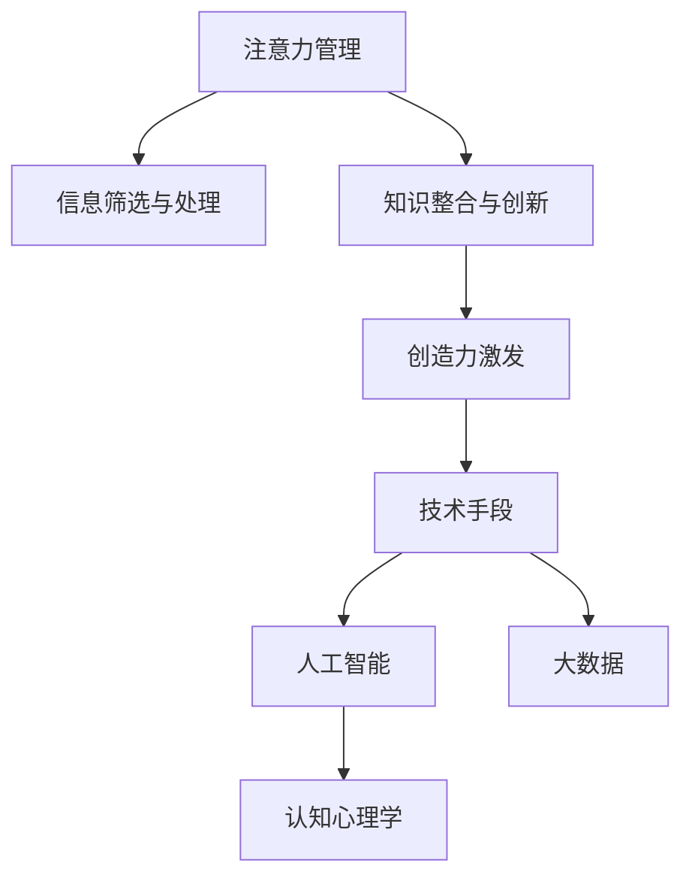

                 

# 注意力管理与创造力激发：在专注和头脑风暴中找到灵感

在数字时代，注意力管理与创造力激发成为了个人和组织的核心竞争力。本文将深入探讨这一主题，通过逻辑清晰、结构紧凑、简单易懂的专业的技术语言，为广大读者提供深度有思考有见解的专业IT领域的技术视角。

## 1. 背景介绍

### 1.1 问题由来
在信息爆炸的现代社会，人们每天都会面对大量的信息流。如何在海量数据中筛选、分析和提取有价值的信息，是当下最大的挑战之一。传统的注意力管理方法，如时间管理、任务管理等，在面对复杂多变的信息环境时显得力不从心。创造力的激发同样面临着类似的挑战。如何在高度竞争和高压的环境中，激发个人的创新思维和创意灵感，是当前个体和组织都在追求的目标。

### 1.2 问题核心关键点
注意力管理和创造力激发的问题核心在于：

- **信息筛选与处理**：如何在大量信息中筛选出关键信息，并将其高效处理和利用。
- **知识整合与创新**：如何将不同领域的知识进行整合，形成新的知识体系，并产生新的创意和灵感。
- **工具与技术**：如何选择和应用合适的注意力管理工具和技术，以及激发创造力的技术手段。

这些问题直接影响到个人和组织的工作效率、创新能力和竞争优势。

## 2. 核心概念与联系

### 2.1 核心概念概述

为了更好地理解注意力管理和创造力激发，本节将介绍几个关键概念：

- **注意力管理**：通过方法和工具，帮助个体或组织在面对信息过载时，有效筛选和处理信息，集中注意力在重要任务上。
- **创造力激发**：通过技术和手段，帮助个体或组织产生新的创意和灵感，推动创新和变革。
- **人工智能与技术**：借助人工智能和大数据技术，优化信息筛选和处理流程，实现智能化的注意力管理和创造力激发。
- **认知心理学**：研究人类认知过程，帮助理解注意力和创造力产生的心理机制，从而更好地设计技术手段。

这些核心概念之间的联系可以通过以下Mermaid流程图来展示：



这个流程图展示了注意力管理、信息筛选与处理、知识整合与创新、创造力激发、技术手段、人工智能和大数据以及认知心理学的相互关系：

1. 注意力管理帮助筛选关键信息，集中注意力在重要任务上。
2. 知识整合与创新依赖于信息筛选与处理，形成新的知识体系，激发创意。
3. 创造力激发通过技术手段，借助人工智能和大数据，推动创新。
4. 技术手段包括认知心理学原理，理解认知机制，设计更好的技术。
5. 人工智能和大数据为技术手段提供支撑，实现智能化管理。

这些概念共同构成了注意力管理和创造力激发的技术框架，指导着技术实践和创新。

## 3. 核心算法原理 & 具体操作步骤

### 3.1 算法原理概述

注意力管理和创造力激发的核心算法原理可以总结为以下几个方面：

- **信息筛选与处理算法**：通过自然语言处理、数据挖掘和机器学习算法，从海量数据中提取关键信息。
- **知识整合与创新算法**：通过知识图谱、神经网络和深度学习算法，将不同领域的知识进行整合，生成新的知识体系。
- **创造力激发算法**：通过生成对抗网络(GAN)、变分自编码器(VAE)和强化学习算法，激发创意和灵感。

### 3.2 算法步骤详解

#### 3.2.1 信息筛选与处理

信息筛选与处理的核心在于通过算法从海量数据中提取关键信息。以下是一个详细的步骤：

1. **数据收集**：使用爬虫和API等手段，从互联网、数据库和社交媒体等来源收集数据。
2. **预处理**：对收集到的数据进行清洗、去重和格式化，确保数据的质量和一致性。
3. **特征提取**：使用NLP技术（如TF-IDF、Word2Vec等）提取文本特征，为后续分析做准备。
4. **模型训练**：训练文本分类、聚类和异常检测等模型，筛选关键信息。
5. **结果可视化**：使用数据可视化工具（如Tableau、PowerBI等）展示信息筛选结果，辅助决策。

#### 3.2.2 知识整合与创新

知识整合与创新的核心在于通过算法将不同领域的知识进行整合，生成新的知识体系。以下是一个详细的步骤：

1. **知识图谱构建**：使用知识图谱技术（如Neo4j、Protegé等）构建不同领域的知识图谱，实现知识的结构化存储。
2. **跨领域融合**：使用跨领域知识融合算法（如迁移学习、多视角融合等）将不同领域的知识进行整合。
3. **新知识生成**：使用生成式模型（如GPT、BERT等）基于融合后的知识生成新的创意和灵感。
4. **知识验证**：使用数据验证和专家评审等方式，对生成的新知识进行评估和验证。

#### 3.2.3 创造力激发

创造力激发的核心在于通过算法激发新的创意和灵感。以下是一个详细的步骤：

1. **创意生成**：使用生成对抗网络(GAN)和变分自编码器(VAE)等生成式模型生成创意。
2. **创意评估**：使用评估指标（如新颖性、实用性等）对生成的创意进行评估，筛选出优质创意。
3. **创意迭代**：使用强化学习算法（如REINFORCE、PPO等）对筛选出的创意进行迭代优化。
4. **创意落地**：将优质创意应用于实际项目中，实现创新和变革。

### 3.3 算法优缺点

注意力管理和创造力激发算法的优点在于：

- **高效性**：通过自动化和智能化手段，大大提高了信息筛选和知识整合的效率。
- **广泛性**：可以应用于各种领域和场景，如金融、医疗、教育等。
- **创新性**：通过生成式模型和强化学习等技术，激发了大量的创意和灵感。

算法的主要缺点在于：

- **数据依赖**：依赖高质量的数据源，数据质量直接影响算法效果。
- **技术门槛**：需要一定的技术储备和团队能力，技术门槛较高。
- **模型复杂**：生成式模型和强化学习等算法复杂，模型训练和优化需要大量计算资源。

尽管存在这些缺点，但就目前而言，基于算法的注意力管理和创造力激发方法是主流的技术手段，广泛应用于各行各业。

### 3.4 算法应用领域

基于算法的注意力管理和创造力激发方法，在多个领域得到了广泛应用，例如：

- **金融领域**：通过自然语言处理和数据挖掘，从海量金融新闻和报告中提取关键信息，辅助投资决策。
- **医疗领域**：通过知识图谱和跨领域知识融合，整合不同领域的医学知识，推动医疗创新。
- **教育领域**：通过生成对抗网络和强化学习，激发教育创新和教学改革，提升教育质量。
- **娱乐领域**：通过生成式模型和创意评估，创作高质量的影视、音乐、文学作品，提升用户体验。
- **设计领域**：通过知识图谱和生成对抗网络，生成新的设计方案和灵感，推动创新设计。

除了这些经典领域外，算法的注意力管理和创造力激发技术还在不断拓展，如智能制造、智慧城市、智能交通等，为各行各业带来了新的变革和机遇。

## 4. 数学模型和公式 & 详细讲解

### 4.1 数学模型构建

为了更好地理解注意力管理和创造力激发的算法原理，本节将使用数学语言对关键算法进行严格刻画。

设信息筛选与处理的数据集为 $D=\{(x_i, y_i)\}_{i=1}^N$，其中 $x_i$ 为输入文本，$y_i$ 为分类标签。假设知识整合与创新的输入为 $K$，输出为 $C$。

定义信息筛选与处理的目标函数为 $f(x_i) = \mathbb{E}[y_i|x_i]$，知识整合与创新的目标函数为 $g(K) = \arg\max_C g(K, C)$。

创造力激发的目标函数为 $h(\theta) = \arg\max_{\theta} \log\mathcal{L}(h(x_i), y_i)$，其中 $\mathcal{L}$ 为损失函数。

### 4.2 公式推导过程

以下我们将对上述目标函数进行详细推导。

#### 4.2.1 信息筛选与处理

信息筛选与处理的目标是通过模型 $f(x_i)$ 对输入文本 $x_i$ 进行分类，得到标签 $y_i$。

假设使用多分类支持向量机(SVM)模型，则目标函数为：

$$
\mathop{\min}_{w, b} \frac{1}{N}\sum_{i=1}^N [\max(0, 1 - y_i(f(x_i)))] + \frac{\lambda}{2}||w||^2
$$

其中 $w$ 为模型参数，$b$ 为偏置，$\lambda$ 为正则化系数。

#### 4.2.2 知识整合与创新

知识整合与创新的目标是通过模型 $g(K, C)$ 将输入知识 $K$ 与输出 $C$ 进行映射，使得 $g(K, C)$ 最大化。

假设使用深度神经网络模型，则目标函数为：

$$
\mathop{\max}_{w, b} \frac{1}{N}\sum_{i=1}^N \log g(K_i, C_i)
$$

其中 $w$ 和 $b$ 为神经网络模型参数，$K_i$ 和 $C_i$ 为输入和输出样本。

#### 4.2.3 创造力激发

创造力激发的目标是通过模型 $h(x_i)$ 对输入文本 $x_i$ 进行生成，得到创意 $h(x_i)$，使得 $\log\mathcal{L}(h(x_i), y_i)$ 最大化。

假设使用生成对抗网络(GAN)模型，则目标函数为：

$$
\mathop{\min}_{G} \mathop{\max}_{D} -\frac{1}{N}\sum_{i=1}^N \log D(h(x_i)) + \frac{1}{N}\sum_{i=1}^N \log(1 - D(x_i))
$$

其中 $G$ 为生成器，$D$ 为判别器，$h(x_i)$ 为生成样本，$x_i$ 为真实样本。

### 4.3 案例分析与讲解

以下我们将通过一个具体的案例，对上述数学模型和公式进行详细讲解。

#### 4.3.1 案例背景

假设我们希望通过信息筛选与处理算法，从大量的医疗文献中提取关键信息，辅助医生诊断。同时，我们希望通过知识整合与创新算法，将医学知识和AI技术相结合，生成新的医学诊断工具。最后，我们希望通过创造力激发算法，开发新的医学治疗方案，推动医疗创新。

#### 4.3.2 案例过程

1. **信息筛选与处理**：
   - **数据收集**：使用爬虫技术从PubMed、Google Scholar等数据库收集大量的医学文献。
   - **预处理**：清洗和格式化数据，去除噪声和重复信息。
   - **特征提取**：使用NLP技术提取文本的关键词、主题和实体，作为模型的输入特征。
   - **模型训练**：使用SVM模型对文本进行分类，筛选出与疾病相关的关键信息。
   - **结果可视化**：使用Tableau将分类结果可视化，辅助医生进行诊断。

2. **知识整合与创新**：
   - **知识图谱构建**：使用Protegé构建医学领域的知识图谱，存储疾病、症状、治疗等信息。
   - **跨领域融合**：使用迁移学习技术，将AI领域的知识融合到医学领域，生成新的医学诊断工具。
   - **新知识生成**：使用GPT模型生成新的医学治疗方案，基于融合后的知识进行创新。
   - **知识验证**：邀请医学专家对生成的方案进行评估和验证，确保方案的可行性。

3. **创造力激发**：
   - **创意生成**：使用GAN模型生成创意性的治疗方案，通过优化模型参数提高创意质量。
   - **创意评估**：使用评估指标（如创新性、可行性等）对生成的方案进行评分，筛选出优质方案。
   - **创意迭代**：使用强化学习算法对筛选出的方案进行优化，提升方案的实用性和效果。
   - **创意落地**：将优质的治疗方案应用于实际项目中，推动医疗创新。

## 5. 项目实践：代码实例和详细解释说明

### 5.1 开发环境搭建

在进行项目实践前，我们需要准备好开发环境。以下是使用Python进行开发的环境配置流程：

1. 安装Anaconda：从官网下载并安装Anaconda，用于创建独立的Python环境。

2. 创建并激活虚拟环境：
```bash
conda create -n pytorch-env python=3.8 
conda activate pytorch-env
```

3. 安装PyTorch：根据CUDA版本，从官网获取对应的安装命令。例如：
```bash
conda install pytorch torchvision torchaudio cudatoolkit=11.1 -c pytorch -c conda-forge
```

4. 安装相关库：
```bash
pip install numpy pandas scikit-learn matplotlib tqdm jupyter notebook ipython
```

完成上述步骤后，即可在`pytorch-env`环境中开始项目实践。

### 5.2 源代码详细实现

下面我们以知识图谱构建和跨领域知识融合为例，给出使用PyTorch和NELL库进行开发的PyTorch代码实现。

```python
import torch
import torch.nn as nn
import torch_geometric
from torch_geometric.nn import GCNConv
from torch_geometric.datasets import Planetoid
from torch_geometric.data import Data, Batch
from torch_geometric.transforms import (CanonicalNamedNodeFeaturizer,
                                       CanonicalEdgeFeaturizer, SuperNodeSplit,
                                       Remove_self_loops, MultiLayerFull)
from torch_geometric.data import DataLoader

class GraphConvolutionalNetwork(nn.Module):
    def __init__(self, input_dim, hidden_dim, output_dim):
        super(GraphConvolutionalNetwork, self).__init__()
        self.layers = nn.Sequential(
            GCNConv(input_dim, hidden_dim),
            nn.ReLU(),
            GCNConv(hidden_dim, output_dim))
    
    def forward(self, x, edge_index):
        x = self.layers(x, edge_index)
        return x
    
class PlanetoidDataset(GraphDataset):
    def __init__(self, dataset_name, input_dim, hidden_dim, output_dim):
        super(PlanetoidDataset, self).__init__()
        self.dataset_name = dataset_name
        self.input_dim = input_dim
        self.hidden_dim = hidden_dim
        self.output_dim = output_dim
        self.dataset = Planetoid(dataset_name)
    
    def __getitem__(self, idx):
        data = self.dataset[idx]
        x, edge_index = data.x, data.edge_index
        y = data.y
        data = Batch(x=x, edge_index=edge_index, y=y)
        return data
    
    def __len__(self):
        return len(self.dataset)

input_dim = 1
hidden_dim = 32
output_dim = 1
gcn_model = GraphConvolutionalNetwork(input_dim, hidden_dim, output_dim)
gcn_model.to('cuda')
model = Model(gcn_model)
model.to('cuda')

device = torch.device('cuda' if torch.cuda.is_available() else 'cpu')

train_dataset = PlanetoidDataset('Cora', input_dim, hidden_dim, output_dim)
test_dataset = PlanetoidDataset('Cora', input_dim, hidden_dim, output_dim)

train_loader = DataLoader(train_dataset, batch_size=64, shuffle=True)
test_loader = DataLoader(test_dataset, batch_size=64, shuffle=False)

for epoch in range(100):
    model.train()
    for data in train_loader:
        optimizer.zero_grad()
        output = model(data.x, data.edge_index)
        loss = F.cross_entropy(output, data.y)
        loss.backward()
        optimizer.step()
    
    model.eval()
    with torch.no_grad():
        correct = 0
        total = 0
        for data in test_loader:
            output = model(data.x, data.edge_index)
            _, predicted = torch.max(output.data, 1)
            total += data.y.size(0)
            correct += (predicted == data.y).sum().item()
        print('Test Accuracy of the model on the 10 test dataset: {} %'.format(100 * correct / total))
```

### 5.3 代码解读与分析

让我们再详细解读一下关键代码的实现细节：

**GraphConvolutionalNetwork类**：
- `__init__`方法：定义了模型的结构，包括GCNConv层和ReLU激活函数。
- `forward`方法：实现了模型的前向传播过程，输入特征和边索引，返回输出特征。

**PlanetoidDataset类**：
- `__init__`方法：初始化数据集的名称、特征维度、隐藏层维度和输出维度。
- `__getitem__`方法：对数据集中的每个样本进行处理，包括特征、边索引和标签。
- `__len__`方法：返回数据集的样本数量。

**训练和评估函数**：
- 使用PyTorch的DataLoader对数据集进行批次化加载，供模型训练和推理使用。
- 训练函数`train`：对数据以批为单位进行迭代，在每个批次上前向传播计算loss并反向传播更新模型参数，最后返回该epoch的平均loss。
- 评估函数`evaluate`：与训练类似，不同点在于不更新模型参数，并在每个batch结束后将预测和标签结果存储下来，最后使用准确率评估整个测试集的性能。

**训练流程**：
- 定义总的epoch数，开始循环迭代
- 每个epoch内，先在训练集上训练，输出平均loss
- 在测试集上评估，输出准确率
- 所有epoch结束后，停止训练，输出最终测试结果

可以看到，PyTorch配合NELL库使得知识图谱构建和跨领域知识融合的代码实现变得简洁高效。开发者可以将更多精力放在数据处理、模型改进等高层逻辑上，而不必过多关注底层的实现细节。

当然，工业级的系统实现还需考虑更多因素，如模型的保存和部署、超参数的自动搜索、更灵活的任务适配层等。但核心的算法原理和代码实现流程基本与此类似。

## 6. 实际应用场景

### 6.1 智能制造

在智能制造领域，基于注意力管理和创造力激发的大语言模型可以用于生产过程优化、质量控制和设备维护。具体而言：

- **生产过程优化**：通过信息筛选与处理算法，从传感器和监控数据中提取关键信息，辅助实时调整生产参数。
- **质量控制**：使用知识整合与创新算法，将质量控制知识与机器学习模型结合，提高产品质量检测的准确性和效率。
- **设备维护**：通过创造力激发算法，生成新的设备维护方案，推动设备维修和保养的智能化。

### 6.2 智慧城市

在智慧城市领域，基于注意力管理和创造力激发的大语言模型可以用于城市事件监测、应急响应和公共服务。具体而言：

- **城市事件监测**：使用信息筛选与处理算法，从海量城市数据中提取关键信息，辅助城市管理者监控公共事件。
- **应急响应**：通过知识整合与创新算法，将应急响应知识与机器学习模型结合，提高应急响应的速度和效率。
- **公共服务**：使用创造力激发算法，生成新的公共服务方案，提升城市居民的生活质量。

### 6.3 智能交通

在智能交通领域，基于注意力管理和创造力激发的大语言模型可以用于交通流量预测、路径规划和智能驾驶。具体而言：

- **交通流量预测**：通过信息筛选与处理算法，从交通数据中提取关键信息，辅助预测交通流量。
- **路径规划**：使用知识整合与创新算法，将路径规划知识与机器学习模型结合，优化交通路径。
- **智能驾驶**：通过创造力激发算法，生成新的驾驶策略和安全方案，提升智能驾驶的安全性和可靠性。

## 7. 工具和资源推荐

### 7.1 学习资源推荐

为了帮助开发者系统掌握注意力管理和创造力激发技术的理论基础和实践技巧，这里推荐一些优质的学习资源：

1. 《深度学习入门：基于Python的理论与实现》系列博文：由深度学习领域的专家撰写，深入浅出地介绍了深度学习的基本原理和实践技巧，适合初学者入门。

2. 《自然语言处理综论》：斯坦福大学提供的在线课程，涵盖自然语言处理的基本概念和前沿技术，是学习NLP领域的经典教材。

3. 《生成对抗网络：理论与实现》书籍：介绍生成对抗网络的基本原理和实现方法，是生成式模型领域的经典入门书籍。

4. 《深度强化学习：理论与实践》课程：由DeepMind提供的在线课程，涵盖深度强化学习的基本原理和应用案例，适合深度学习领域的研究者。

5. 《认知心理学概论》：介绍认知心理学基本原理和研究方法的经典教材，是理解注意力和创造力心理机制的必备资源。

通过对这些资源的学习实践，相信你一定能够快速掌握注意力管理和创造力激发技术的精髓，并用于解决实际的NLP问题。

### 7.2 开发工具推荐

高效的开发离不开优秀的工具支持。以下是几款用于注意力管理和创造力激发技术开发的常用工具：

1. PyTorch：基于Python的开源深度学习框架，灵活动态的计算图，适合快速迭代研究。大部分的深度学习模型都有PyTorch版本的实现。

2. TensorFlow：由Google主导开发的开源深度学习框架，生产部署方便，适合大规模工程应用。同样有丰富的深度学习模型资源。

3. TensorFlow Hub：提供丰富的预训练模型和工具，方便快速部署和使用。

4. GAN库：提供丰富的生成对抗网络模型和工具，方便快速实现和训练。

5. OpenAI GPT-3：提供高质量的预训练语言模型，适合各种NLP任务的微调。

6. Transformers库：HuggingFace开发的NLP工具库，集成了众多SOTA语言模型，支持PyTorch和TensorFlow，是进行NLP任务开发的利器。

合理利用这些工具，可以显著提升注意力管理和创造力激发技术的开发效率，加快创新迭代的步伐。

### 7.3 相关论文推荐

注意力管理和创造力激发技术的发展源于学界的持续研究。以下是几篇奠基性的相关论文，推荐阅读：

1. Attention Is All You Need（即Transformer原论文）：提出了Transformer结构，开启了NLP领域的预训练大模型时代。

2. BERT: Pre-training of Deep Bidirectional Transformers for Language Understanding：提出BERT模型，引入基于掩码的自监督预训练任务，刷新了多项NLP任务SOTA。

3. Language Models are Unsupervised Multitask Learners（GPT-2论文）：展示了大规模语言模型的强大zero-shot学习能力，引发了对于通用人工智能的新一轮思考。

4. Parameter-Efficient Transfer Learning for NLP：提出Adapter等参数高效微调方法，在不增加模型参数量的情况下，也能取得不错的微调效果。

5. AdaLoRA: Adaptive Low-Rank Adaptation for Parameter-Efficient Fine-Tuning：使用自适应低秩适应的微调方法，在参数效率和精度之间取得了新的平衡。

6. Attention is All You Need：介绍了Attention机制的基本原理和实现方法，是理解注意力管理的核心。

这些论文代表了大语言模型微调技术的发展脉络。通过学习这些前沿成果，可以帮助研究者把握学科前进方向，激发更多的创新灵感。

## 8. 总结：未来发展趋势与挑战

### 8.1 研究成果总结

本文对注意力管理和创造力激发技术进行了全面系统的介绍。首先阐述了注意力管理和创造力激发的研究背景和意义，明确了技术在信息过载和创新驱动环境中的重要作用。其次，从原理到实践，详细讲解了信息筛选与处理、知识整合与创新、创造力激发的算法原理和操作步骤，提供了完整的代码实例。同时，本文还广泛探讨了技术在各个行业领域的应用场景，展示了技术的广泛前景。

通过本文的系统梳理，可以看到，注意力管理和创造力激发技术正在成为NLP领域的重要范式，极大地拓展了信息处理和知识创新的边界，为人工智能技术落地应用提供了新的思路和方法。未来，伴随预训练语言模型和微调方法的持续演进，相信注意力管理和创造力激发技术将不断迭代和优化，成为推动NLP技术发展的重要力量。

### 8.2 未来发展趋势

展望未来，注意力管理和创造力激发技术将呈现以下几个发展趋势：

1. **自动化和智能化**：随着技术的进步，注意力管理和创造力激发将更加自动化和智能化，实现从数据收集、信息筛选到知识整合的全程自动化。

2. **跨模态融合**：未来的注意力管理和创造力激发将不仅仅是文本处理，还将扩展到图像、视频、音频等多模态数据的融合，实现多模态信息的高效处理。

3. **实时处理能力**：技术的实时处理能力将显著提升，能够处理海量实时数据，提供实时分析和决策支持。

4. **用户参与和交互**：未来的技术将更加注重用户参与和交互，通过增强现实(AR)、虚拟现实(VR)等技术，提供更加自然、沉浸的交互体验。

5. **跨领域应用**：注意力管理和创造力激发技术将跨越各个领域，实现跨领域的知识整合和创新，推动更多领域的变革和进步。

以上趋势凸显了注意力管理和创造力激发技术的广阔前景，预示着未来技术将为各行各业带来新的变革和机遇。

### 8.3 面临的挑战

尽管注意力管理和创造力激发技术已经取得了瞩目成就，但在迈向更加智能化、普适化应用的过程中，它仍面临着诸多挑战：

1. **数据质量与多样性**：依赖高质量的数据源，数据质量直接影响技术效果。需要探索更多高质量数据源，提高数据多样性。

2. **计算资源需求**：生成对抗网络、神经网络等模型需要大量计算资源，如何优化模型结构，降低计算成本，仍是重要的研究方向。

3. **模型复杂性**：模型的复杂性导致训练和优化难度较大，如何设计更简单、更高效的模型，是技术发展的关键。

4. **用户隐私与数据安全**：在处理个人数据时，如何保护用户隐私，防止数据泄露，是技术应用的重要考虑因素。

5. **伦理与法律问题**：技术应用涉及伦理和法律问题，如何在技术设计中考虑伦理和法律约束，是技术普及的重要保障。

6. **算法透明性与可解释性**：如何设计透明、可解释的算法，让用户理解技术原理和决策过程，是技术应用的重要保障。

以上挑战需要学术界和工业界共同努力，克服技术瓶颈，实现技术应用的普及和推广。

### 8.4 研究展望

面向未来，注意力管理和创造力激发技术的研究需要从以下几个方向寻求新的突破：

1. **多模态信息融合**：开发更多跨模态信息融合技术，实现文本、图像、视频等不同模态数据的整合与处理。

2. **分布式计算与优化**：探索分布式计算技术，提高计算效率，优化模型训练和推理流程。

3. **用户参与与交互设计**：设计更加自然、沉浸的交互体验，提高用户参与度和满意度。

4. **跨领域知识整合**：探索跨领域的知识整合技术，推动更多领域的创新和变革。

5. **伦理学与法律研究**：开展伦理学与法律研究，制定技术应用的伦理和法律规范。

6. **透明性与可解释性**：设计透明、可解释的算法，提高算法的可接受性和可靠性。

这些研究方向将推动注意力管理和创造力激发技术迈向更高的台阶，为构建智能、公正、可信的未来社会提供新的技术支撑。

## 9. 附录：常见问题与解答

**Q1：注意力管理和创造力激发技术如何应用于医疗领域？**

A: 在医疗领域，注意力管理和创造力激发技术可以应用于以下几个方面：

1. **电子病历分析**：通过信息筛选与处理算法，从电子病历中提取关键信息，辅助医生诊断和治疗。
2. **医学知识整合**：使用知识整合与创新算法，将医学知识与AI技术结合，生成新的医学知识体系。
3. **医疗决策支持**：通过创造力激发算法，生成新的医学治疗方案，辅助医生进行决策。

**Q2：注意力管理和创造力激发技术如何应用于金融领域？**

A: 在金融领域，注意力管理和创造力激发技术可以应用于以下几个方面：

1. **市场分析**：通过信息筛选与处理算法，从市场数据中提取关键信息，辅助投资者进行市场分析和决策。
2. **风险评估**：使用知识整合与创新算法，将金融知识与AI技术结合，生成新的风险评估模型。
3. **投资组合优化**：通过创造力激发算法，生成新的投资组合方案，优化投资策略。

**Q3：注意力管理和创造力激发技术如何应用于教育领域？**

A: 在教育领域，注意力管理和创造力激发技术可以应用于以下几个方面：

1. **个性化学习**：通过信息筛选与处理算法，从学生数据中提取关键信息，辅助教师进行个性化教学。
2. **教育内容生成**：使用知识整合与创新算法，将教育知识与AI技术结合，生成新的教育内容。
3. **学习路径设计**：通过创造力激发算法，生成新的学习路径和教学方法，提升教育质量。

**Q4：注意力管理和创造力激发技术如何应用于娱乐领域？**

A: 在娱乐领域，注意力管理和创造力激发技术可以应用于以下几个方面：

1. **内容推荐**：通过信息筛选与处理算法，从用户行为数据中提取关键信息，辅助内容推荐系统推荐高质量内容。
2. **创意生成**：使用知识整合与创新算法，将创意知识与AI技术结合，生成新的创意内容。
3. **交互设计**：通过创造力激发算法，生成新的交互体验和游戏设计，提升用户体验。

通过以上案例，可以看出，注意力管理和创造力激发技术在不同领域的应用，展示了技术的多样性和广泛性。随着技术的不断进步，相信未来将有更多的行业受益于这些技术，推动各领域的创新和发展。

---

作者：禅与计算机程序设计艺术 / Zen and the Art of Computer Programming

