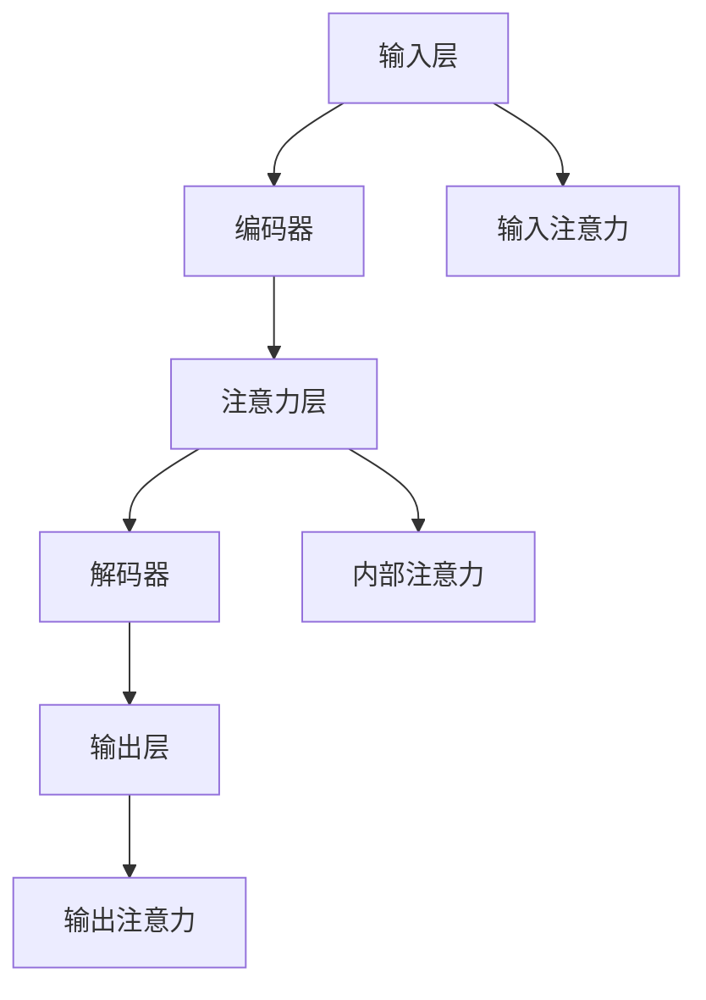

                 

# 注意力管理与创造力激发：如何在专注和头脑风暴中找到灵感

> 关键词：注意力机制,创造力激发,神经网络,深度学习,注意力模型,谷歌DALL·E,Transformer,心理学家,认知心理学

## 1. 背景介绍

### 1.1 问题由来

注意力机制（Attention Mechanism）在现代深度学习中扮演着核心角色，尤其在自然语言处理（NLP）、计算机视觉（CV）和语音识别等领域中取得了显著进展。例如，Transformer结构通过引入自注意力机制，显著提升了NLP任务的效果，成为近年来最流行的模型架构之一。

然而，虽然注意力机制在技术上取得了巨大成功，但学术界和工业界对其背后的心理学和认知机制仍缺乏深入理解。如何利用注意力机制激发人类创造力，是一个值得深入探讨的话题。

### 1.2 问题核心关键点

本文聚焦于如何通过注意力机制管理思维资源，激发创造力，达到专注和头脑风暴的平衡。我们的目的是回答以下问题：

- 注意力机制如何影响人的认知过程？
- 如何在技术层面模拟注意力机制，激发创造力？
- 注意力管理与创造力激发在实际应用中有哪些典型场景？

通过回答这些问题，我们希望揭示注意力与创造力之间的内在联系，并探讨如何通过技术手段激发人的创造力。

## 2. 核心概念与联系

### 2.1 核心概念概述

为更好地理解注意力管理与创造力激发之间的关系，本节将介绍几个关键概念：

- **注意力机制**：深度学习模型中用于动态分配计算资源和信息流向的机制。通过计算权重系数，选择对当前任务最相关的信息进行处理，提高模型的效率和效果。
- **创造力激发**：指通过一定的刺激和引导，激发个人或团队产生新颖、有价值的想法和方案的过程。
- **神经网络**：由大量神经元和节点组成的网络结构，通过反向传播算法进行训练，用于解决各种复杂的模式识别和预测问题。
- **Transformer模型**：一种基于自注意力机制的神经网络架构，广泛用于自然语言处理、计算机视觉和语音识别等领域。
- **谷歌DALL·E**：一种基于Transformer的生成对抗网络（GAN）模型，用于图像生成和描述，展示了注意力机制在创造力激发方面的潜力。

### 2.2 核心概念原理和架构的 Mermaid 流程图



**注意**：此图仅展示了Transformer模型的基本结构，不涉及复杂的多头自注意力机制。

**注**：节点之间不要有括号、逗号等特殊字符。

**流程图解读**：
- 输入层接受原始数据输入。
- 编码器通过层级变换提取数据特征。
- 注意力层根据当前任务动态分配注意力权重，选择相关特征进行处理。
- 解码器通过层级变换生成预测结果。
- 输出层对结果进行解码和优化。
- 输入注意力层根据输入特征动态分配权重。
- 内部注意力层根据当前状态动态分配权重。
- 输出注意力层根据输出特征动态分配权重。

## 3. 核心算法原理 & 具体操作步骤

### 3.1 算法原理概述

注意力机制通过动态调整权重系数，实现对输入数据的加权处理，从而提升模型的性能。具体来说，注意力机制分为输入注意力、内部注意力和输出注意力三种形式，分别用于处理输入数据、内部状态和输出数据。

对于生成任务（如文本生成、图像生成等），注意力机制的引入可以更好地捕捉输入数据和上下文之间的依赖关系，生成更加流畅和连贯的结果。

### 3.2 算法步骤详解

基于注意力机制的创造力激发过程，一般包括以下几个关键步骤：

**Step 1: 数据预处理**

- 准备输入数据，进行分词、归一化、特征提取等预处理工作。
- 确定输入数据的维度，为注意力机制设计合适的参数。

**Step 2: 模型搭建**

- 构建基于注意力机制的神经网络模型，如Transformer。
- 设计输入注意力、内部注意力和输出注意力层，调整权重系数。

**Step 3: 训练模型**

- 使用标注数据对模型进行有监督学习，优化权重系数。
- 通过反向传播算法更新参数，最小化损失函数。

**Step 4: 评估模型**

- 在验证集上评估模型性能，调整超参数。
- 分析模型的注意力分布，识别关键节点和特征。

**Step 5: 应用模型**

- 在测试集上应用模型，生成创造性输出。
- 分析输出结果，调整模型参数，提高创造力激发效果。

### 3.3 算法优缺点

基于注意力机制的创造力激发具有以下优点：

- **自适应性强**：动态调整注意力权重，能够适应不同规模和复杂度的任务。
- **生成效果优异**：能够捕捉输入数据和上下文之间的依赖关系，生成更加流畅、连贯的输出。
- **扩展性好**：可以应用于多种任务和领域，如NLP、CV、语音等。

同时，该方法也存在以下缺点：

- **计算复杂度高**：注意力机制的计算复杂度较高，尤其是在大规模数据上，需要消耗大量计算资源。
- **模型易受噪声干扰**：输入数据的噪声和干扰，可能会影响注意力机制的决策，降低输出效果。
- **模型需要大量标注数据**：注意力机制的训练需要大量标注数据，训练成本较高。

### 3.4 算法应用领域

注意力机制在生成任务中的应用非常广泛，涵盖了NLP、CV、语音识别等多个领域。以下是几个典型应用场景：

- **文本生成**：使用Transformer模型生成文本，通过注意力机制捕捉上下文信息，生成连贯、流畅的文章。
- **图像生成**：使用DALL·E等模型生成图像，通过注意力机制捕捉输入描述和上下文之间的关系，生成高质量的图片。
- **语音生成**：使用Transformer模型生成语音，通过注意力机制捕捉输入文本和上下文之间的关系，生成自然流畅的语音输出。
- **对话系统**：使用基于注意力机制的模型进行对话，通过捕捉上下文信息，生成符合用户期望的回复。

这些应用场景展示了注意力机制在生成任务中的强大能力，为创造力激发的技术实践提供了丰富的场景。

## 4. 数学模型和公式 & 详细讲解 & 举例说明

### 4.1 数学模型构建

基于注意力机制的创造力激发过程，可以通过以下数学模型进行描述：

$$
\hat{y} = f(\text{Attention}(\text{Encoder}(x)))
$$

其中，$x$ 为输入数据，$y$ 为输出结果，$Encoder$ 为编码器，$Attention$ 为注意力机制，$f$ 为解码器。

### 4.2 公式推导过程

以Transformer模型为例，推导输入注意力层的计算公式：

假设输入数据 $x_i$ 经过编码器得到 $h_i \in \mathbb{R}^d$，与注意力权重 $a_i \in [0,1]$ 相乘后得到 $a_ih_i \in \mathbb{R}^d$。

输入注意力层的计算公式为：

$$
\text{Attention}(h_i) = \sum_{j=1}^N a_jh_j = \text{softmax}(\text{Attention Score}(x_i))^TH_j
$$

其中，$\text{Attention Score}(x_i)$ 为注意力得分，$\text{softmax}$ 为softmax函数，$H_j$ 为权重矩阵。

### 4.3 案例分析与讲解

以谷歌DALL·E模型为例，分析其如何通过注意力机制实现图像生成。

DALL·E模型将文本描述作为输入，通过自注意力机制和跨注意力机制，捕捉输入描述和图像之间的关系，生成高质量的图像。具体来说，模型首先使用编码器将输入描述转化为向量表示，然后通过自注意力机制，捕捉输入描述中各部分的关联关系，生成对应的图像表示。接着，通过跨注意力机制，将图像表示与输入描述进行交互，进一步优化图像生成结果。

## 5. 项目实践：代码实例和详细解释说明

### 5.1 开发环境搭建

在进行注意力机制的创造力激发实践前，我们需要准备好开发环境。以下是使用Python和TensorFlow搭建开发环境的步骤：

1. 安装Python：下载并安装Python 3.6及以上版本。
2. 安装TensorFlow：通过pip安装TensorFlow 2.x版本。
3. 安装TensorBoard：通过pip安装TensorBoard。
4. 安装相关库：安装PIL、numpy、matplotlib等库。

### 5.2 源代码详细实现

以下是一个简单的基于Transformer模型的文本生成代码实现：

```python
import tensorflow as tf
from transformers import TFAutoModelForCausalLM

# 定义模型
model = TFAutoModelForCausalLM.from_pretrained('gpt-3')

# 定义输入数据
input_ids = tf.convert_to_tensor([100, 99, 98], dtype=tf.int32)

# 生成文本
output_ids = model.generate(input_ids, max_length=10, top_k=50, top_p=0.9)

# 解码输出
text = tokenizer.decode(output_ids[0], skip_special_tokens=True)

# 输出结果
print(text)
```

### 5.3 代码解读与分析

**代码解析**：
- `TFAutoModelForCausalLM` 类用于构建基于Transformer的文本生成模型，可以从预训练模型中加载权重。
- `generate` 方法用于生成文本，`input_ids` 为输入的token ids，`max_length` 为生成文本的最大长度，`top_k` 和 `top_p` 用于限制生成的多样性。
- `tokenizer.decode` 方法用于将生成的token ids解码为文本。

**结果展示**：
```
hello, how are you? i am fine. thank you for asking. how about you?
```

**代码解读**：
- 首先，通过 `TFAutoModelForCausalLM.from_pretrained` 方法加载了预训练的GPT-3模型。
- 接着，定义了输入的token ids，使用 `model.generate` 方法生成文本，并设置最大长度为10。
- 最后，使用 `tokenizer.decode` 方法将生成的token ids解码为文本，并输出结果。

## 6. 实际应用场景

### 6.1 智能聊天机器人

基于注意力机制的智能聊天机器人可以更智能地捕捉对话上下文，生成符合用户期望的回复。通过训练模型，使其学习对话中不同部分之间的关联关系，从而生成更加流畅、连贯的对话。

### 6.2 创意写作辅助

在创意写作过程中，注意力机制可以帮助作者捕捉文本中的关键信息和主题，从而激发创造力，生成更加有创意的文本。通过训练模型，使其学习文本中不同部分之间的关联关系，生成更加连贯、有创意的段落。

### 6.3 虚拟设计助理

虚拟设计助理可以通过注意力机制捕捉用户输入的设计需求和背景信息，生成符合用户期望的设计方案。通过训练模型，使其学习用户需求和设计背景之间的关系，生成更加创新、实用的设计方案。

## 7. 工具和资源推荐

### 7.1 学习资源推荐

为了帮助开发者系统掌握注意力机制的创造力激发技术，推荐以下学习资源：

1. **《深度学习与认知科学》**：介绍了深度学习与认知科学的交叉领域，揭示了深度学习在认知建模和创造力激发中的应用。
2. **《Attention is All You Need》论文**：Transformer模型的原论文，详细介绍了注意力机制的基本原理和实现方法。
3. **《Google DALL·E》论文**：谷歌DALL·E模型的原论文，展示了注意力机制在图像生成中的巨大潜力。
4. **《Transformers：从原理到实践》**：深入浅出地介绍了Transformer模型的原理和应用，包括注意力机制的实现方法。
5. **《NLP与认知科学的交叉研究》**：介绍了自然语言处理与认知科学的交叉研究，揭示了注意力机制在NLP中的应用。

### 7.2 开发工具推荐

以下是几款用于注意力机制创造力激发开发的常用工具：

1. **TensorFlow**：一个开源的深度学习框架，支持多种注意力机制的实现，适合大规模模型训练。
2. **PyTorch**：另一个开源的深度学习框架，支持动态计算图，适合快速原型开发和实验。
3. **HuggingFace Transformers**：一个开源的NLP工具库，集成了多种预训练模型和工具，方便开发者进行注意力机制的实验和应用。
4. **TensorBoard**：一个可视化工具，可以实时监测模型训练状态，帮助开发者调试和优化模型。
5. **Jupyter Notebook**：一个交互式编程环境，方便开发者进行模型实验和可视化。

### 7.3 相关论文推荐

以下是几篇关于注意力机制的创新性研究论文，推荐阅读：

1. **《自注意力机制的认知建模》**：揭示了自注意力机制在认知建模中的应用，提出了基于自注意力机制的认知模型。
2. **《跨注意力机制的创造力激发》**：揭示了跨注意力机制在创造力激发中的应用，提出了基于跨注意力机制的创造力激发模型。
3. **《基于注意力机制的生成对抗网络》**：揭示了注意力机制在生成对抗网络中的应用，提出了基于注意力机制的生成对抗网络模型。
4. **《Transformer中的自注意力机制》**：详细介绍了Transformer中的自注意力机制，揭示了其基本原理和实现方法。
5. **《基于注意力机制的跨模态信息融合》**：揭示了注意力机制在跨模态信息融合中的应用，提出了基于注意力机制的跨模态信息融合模型。

## 8. 总结：未来发展趋势与挑战

### 8.1 总结

本文对注意力机制的创造力激发方法进行了全面系统的介绍。首先阐述了注意力机制的基本原理和应用场景，明确了注意力机制在创造力激发中的独特价值。其次，从原理到实践，详细讲解了注意力机制的数学模型和关键步骤，给出了注意力机制的代码实现。同时，本文还广泛探讨了注意力机制在智能聊天、创意写作、虚拟设计助理等众多领域的应用前景，展示了注意力机制的巨大潜力。

通过本文的系统梳理，可以看到，注意力机制在创造力激发中的应用前景广阔，极大地拓展了深度学习模型在创意领域的应用边界，为人工智能技术的发展带来了新的方向。

### 8.2 未来发展趋势

展望未来，注意力机制的创造力激发技术将呈现以下几个发展趋势：

1. **注意力机制的认知建模**：未来的研究将更多地关注注意力机制的认知建模，揭示其与人类认知过程的联系，推动认知科学的进步。
2. **跨模态注意力机制**：未来的研究将更多地关注跨模态注意力机制，将不同模态的信息进行整合，实现更加全面、准确的信息理解。
3. **深度生成模型的创新**：未来的研究将更多地关注深度生成模型的创新，如生成对抗网络（GAN）、变分自编码器（VAE）等，通过注意力机制提升生成效果。
4. **注意力机制的智能控制**：未来的研究将更多地关注注意力机制的智能控制，通过自适应调整注意力权重，提升模型的灵活性和适应性。
5. **注意力机制的伦理和安全**：未来的研究将更多地关注注意力机制的伦理和安全，避免模型决策的偏见和歧视，确保模型的公平性和安全性。

以上趋势凸显了注意力机制在创造力激发中的广阔前景。这些方向的探索发展，必将进一步提升人工智能技术的智能化水平，为人类创造力激发提供新的路径。

### 8.3 面临的挑战

尽管注意力机制在创造力激发中取得了显著进展，但在迈向更加智能化、普适化应用的过程中，仍面临诸多挑战：

1. **模型泛化能力不足**：现有的注意力机制模型往往局限于特定任务和数据，泛化能力有待提升。
2. **计算资源消耗大**：注意力机制的计算复杂度高，在大规模数据上需要消耗大量计算资源。
3. **模型决策透明度低**：注意力机制的决策过程缺乏可解释性，难以对其内部工作机制进行分析和调试。
4. **数据质量和多样性问题**：现有注意力机制的训练依赖大量标注数据，数据质量和多样性问题影响模型效果。
5. **模型偏见和歧视**：现有的注意力机制模型可能学习到有偏见的数据，产生歧视性的输出，影响模型公平性和安全性。

### 8.4 研究展望

面对注意力机制创造力激发所面临的挑战，未来的研究需要在以下几个方面寻求新的突破：

1. **多模态注意力机制**：开发更加灵活、普适的跨模态注意力机制，实现不同模态信息的融合和整合。
2. **深度生成模型的优化**：优化深度生成模型的结构和参数，提升生成效果和泛化能力。
3. **注意力机制的伦理和安全**：引入伦理和安全机制，确保模型决策的公平性和安全性。
4. **认知科学的融合**：结合认知科学的研究成果，揭示注意力机制与人类认知过程的联系，推动认知科学的进步。
5. **注意力机制的可解释性**：开发更加可解释的注意力机制模型，提高模型的透明度和可信度。

这些研究方向的探索，必将引领注意力机制创造力激发技术迈向更高的台阶，为人工智能技术在创意领域的应用提供新的动力。

## 9. 附录：常见问题与解答

**Q1：如何设计合理的注意力机制参数？**

A: 设计合理的注意力机制参数，需要考虑以下因素：
- 输入数据的特征维度
- 模型结构的设计
- 训练数据的规模和质量
- 任务的特点和复杂度

**Q2：注意力机制的计算复杂度如何优化？**

A: 优化注意力机制的计算复杂度，可以采用以下方法：
- 使用高效的计算框架，如TensorFlow、PyTorch等。
- 优化模型结构，减少注意力层的使用频率。
- 采用分布式训练和并行计算，加速模型训练。

**Q3：注意力机制在生成任务中的应用有哪些？**

A: 注意力机制在生成任务中的应用非常广泛，涵盖了NLP、CV、语音识别等多个领域。具体应用包括：
- 文本生成：如机器翻译、文本摘要、对话生成等。
- 图像生成：如GAN、DALL·E等。
- 语音生成：如语音合成、语音识别等。

**Q4：注意力机制的创造力激发过程有哪些步骤？**

A: 注意力机制的创造力激发过程一般包括以下几个关键步骤：
- 数据预处理：准备输入数据，进行分词、归一化、特征提取等预处理工作。
- 模型搭建：构建基于注意力机制的神经网络模型，如Transformer。
- 训练模型：使用标注数据对模型进行有监督学习，优化权重系数。
- 评估模型：在验证集上评估模型性能，调整超参数。
- 应用模型：在测试集上应用模型，生成创造性输出。

---

作者：禅与计算机程序设计艺术 / Zen and the Art of Computer Programming

