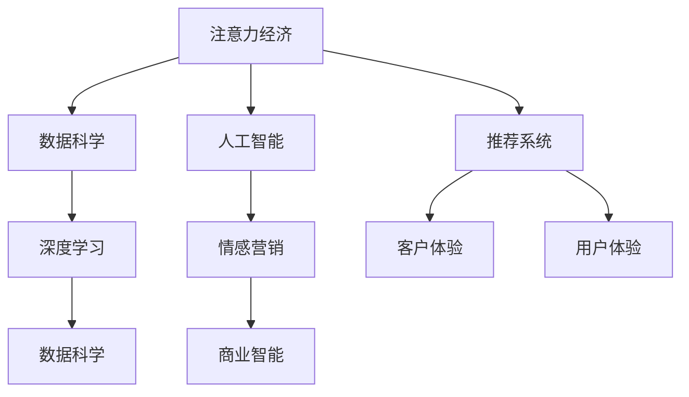

                 

# 注意力经济下的情感营销策略

> 关键词：注意力经济, 情感营销, 人工智能, 推荐系统, 深度学习, 数据科学, 客户体验, 用户体验, 商业智能

## 1. 背景介绍

在互联网高度发展的今天，信息爆炸已成为不可回避的现实。如何在海量信息中找到目标受众的注意力，如何理解并打动他们的情感，成为商家和营销人员面临的重要挑战。其中，情感营销作为直接触动人心、提升品牌影响力的手段，成为了营销的核心。但传统的情感营销手段往往依赖直觉，缺乏科学依据，且难以大规模应用。随着人工智能（AI）技术的发展，特别是在深度学习和大数据分析的推动下，情感营销正逐渐向数据驱动、智能化、精准化的方向转变。

## 2. 核心概念与联系

### 2.1 核心概念概述

- **注意力经济**：指在信息过载的时代，消费者对于信息的注意力成为了一种稀缺资源，商家需要投入大量资源争夺用户的注意力，从而实现商业价值。
- **情感营销**：通过唤起消费者的情感共鸣，建立品牌与消费者之间的情感连接，从而促进产品销售和品牌忠诚度。
- **人工智能**：利用机器学习、深度学习等技术，让机器能够理解和处理人类情感，实现情感营销的自动化、精准化。
- **推荐系统**：通过分析用户行为和偏好，推荐最适合的内容或商品，提升用户体验，同时也能捕捉用户的情感状态，优化情感营销策略。
- **深度学习**：利用多层神经网络进行数据处理和特征提取，使得机器能够识别、理解和生成复杂的人类情感表达。
- **数据科学**：运用统计学、数学、计算机科学等方法，分析海量数据，挖掘用户情感和行为规律，为情感营销提供数据支持。
- **客户体验**：通过优化产品和服务，提升用户在使用过程中的满足感和愉悦感，从而增加用户粘性。
- **用户体验**：在产品设计、交互过程中，关注用户的直观感受，确保操作简单、响应快速，提高用户的满意度和忠诚度。
- **商业智能**：通过数据驱动的决策支持，帮助企业制定更科学的营销策略，提高效率和效果。

这些概念之间的联系可以通过以下Mermaid流程图来展示：



这个流程图展示了大语言模型微调的核心概念及其之间的关系：

1. 注意力经济依赖于数据科学，通过深度学习和大数据分析，商家可以更好地理解消费者的行为和情感。
2. 人工智能和深度学习技术为情感营销提供了技术支持，让机器能够处理和理解人类情感。
3. 推荐系统帮助商家精准推荐内容或商品，同时捕捉用户的情感状态。
4. 客户体验和用户体验提升消费者的满意度和忠诚度，从而增加营销效果。
5. 商业智能通过数据驱动的决策支持，优化营销策略，提升效果。

这些概念共同构成了注意力经济下情感营销的基础框架，使得商家能够借助技术手段，实现情感营销的自动化、精准化、高效化。

## 3. 核心算法原理 & 具体操作步骤

### 3.1 算法原理概述

基于深度学习的情感营销策略，主要是通过机器学习模型，从大量用户数据中提取情感特征，进而对用户进行情感分析，从而制定精准的营销策略。其核心思想是：利用机器学习模型学习用户的情感状态，并据此生成或调整营销信息，以提升营销效果。

形式化地，假设用户数据集为 $D=\{(x_i, y_i)\}_{i=1}^N, x_i \in \mathcal{X}, y_i \in \mathcal{Y}$，其中 $\mathcal{X}$ 为用户特征空间，$\mathcal{Y}$ 为用户情感标签空间。情感营销的目标是找到最优的情感分类器 $f(x)$，使得对于任意用户 $x$，有：

$$
\min_{f} \mathcal{L}(f) = \frac{1}{N} \sum_{i=1}^N \ell(f(x_i), y_i)
$$

其中 $\ell$ 为损失函数，通常采用交叉熵损失。

### 3.2 算法步骤详解

基于深度学习的情感营销策略，主要包括以下几个关键步骤：

**Step 1: 准备数据集和模型**

- 收集用户数据集 $D$，包括用户行为数据、情感数据、文本数据等。
- 预处理数据，进行清洗、归一化、特征工程等操作。
- 选择合适的深度学习模型，如卷积神经网络（CNN）、循环神经网络（RNN）、Transformer等，作为情感分析的基线模型。

**Step 2: 特征提取**

- 通过深度学习模型提取用户特征，如用户行为特征、情感特征、文本特征等。
- 使用词嵌入技术（如Word2Vec、GloVe等）将文本数据转换为向量表示。
- 通过卷积神经网络（CNN）提取图像数据的特征，或使用循环神经网络（RNN）处理时间序列数据。

**Step 3: 情感分类**

- 使用训练好的深度学习模型对用户特征进行情感分类，生成情感标签。
- 对于文本数据，使用自然语言处理技术（如BERT、GPT等）进行情感分析。
- 对于非文本数据，使用CNN或RNN等模型进行特征提取和分类。

**Step 4: 策略生成**

- 根据情感分类结果，生成或调整营销策略，如文案、广告、推荐内容等。
- 对于不同的情感状态，设计不同的营销策略，以最大化营销效果。
- 结合推荐系统，根据用户特征和情感状态，生成个性化的推荐内容。

**Step 5: 模型评估与优化**

- 在测试集上评估情感分类模型的性能，如准确率、召回率、F1值等指标。
- 根据评估结果，调整模型超参数，进行模型优化。
- 结合实际营销效果，不断迭代和优化情感营销策略。

### 3.3 算法优缺点

基于深度学习的情感营销策略，具有以下优点：

1. **自动化程度高**：通过机器学习模型自动化处理和分析用户情感，减少了人工干预和主观判断的误差。
2. **精准度高**：深度学习模型可以处理复杂多变的数据，捕捉细微的情感变化，从而提升情感分析的准确性。
3. **可扩展性强**：模型训练和优化可以大规模应用到不同类型的用户数据上，适应不同场景的营销需求。
4. **效率高**：自动化处理和分析可以大幅提升情感营销的效率，降低成本。

同时，该方法也存在一些缺点：

1. **数据需求高**：情感营销依赖于大量的用户数据，获取高质量的数据是一个挑战。
2. **模型复杂度高**：深度学习模型通常具有较高的计算复杂度和资源消耗，需要高性能的计算资源。
3. **模型解释性不足**：深度学习模型往往是“黑盒”模型，难以解释其决策过程和结果。
4. **泛化能力有限**：深度学习模型可能存在过拟合问题，对于新数据泛化能力不足。
5. **隐私风险**：用户情感数据涉及个人隐私，收集和处理过程中需要严格遵守隐私保护法规。

尽管存在这些局限性，但就目前而言，基于深度学习的情感营销策略仍是目前情感营销领域最先进、最有效的技术手段。未来相关研究的重点在于如何进一步降低情感营销对数据的依赖，提高模型的泛化能力，同时兼顾可解释性和隐私保护。

### 3.4 算法应用领域

基于深度学习的情感营销策略，已经在多个领域得到了广泛的应用，例如：

1. **电商推荐系统**：通过分析用户行为和情感，推荐最适合的商品或文案，提升用户体验和转化率。
2. **社交媒体营销**：分析用户对品牌或产品的情感倾向，优化内容策略，提高用户粘性和品牌忠诚度。
3. **客户服务系统**：通过情感分析，识别用户情绪，提供更精准的客户服务，提升用户满意度。
4. **广告投放优化**：根据用户情感状态，优化广告投放策略，提高广告点击率和转化率。
5. **情感分析工具**：开发情感分析工具，帮助企业了解用户对产品的真实反馈，指导产品改进和营销策略。

除了上述这些经典应用外，情感营销技术还在不断创新中，如情感驱动的内容生成、情感触发的用户行为预测等，为品牌营销带来了新的可能性。

## 4. 数学模型和公式 & 详细讲解 & 举例说明

### 4.1 数学模型构建

本节将使用数学语言对基于深度学习的情感营销策略进行更加严格的刻画。

假设用户数据集为 $D=\{(x_i, y_i)\}_{i=1}^N, x_i \in \mathcal{X}, y_i \in \mathcal{Y}$，其中 $\mathcal{X}$ 为用户特征空间，$\mathcal{Y}$ 为用户情感标签空间。定义情感分类器为 $f(x)$，其预测结果为 $y_{pred}=f(x)$。

定义交叉熵损失函数为：

$$
\ell(f(x), y) = -\sum_{i=1}^N y_i \log f(x_i)
$$

情感营销的目标是最小化损失函数，即：

$$
\min_{f} \mathcal{L}(f) = \frac{1}{N} \sum_{i=1}^N \ell(f(x_i), y_i)
$$

在实践中，我们通常使用基于梯度的优化算法（如SGD、Adam等）来近似求解上述最优化问题。设 $\eta$ 为学习率，$\lambda$ 为正则化系数，则参数的更新公式为：

$$
\theta \leftarrow \theta - \eta \nabla_{\theta}\mathcal{L}(\theta) - \eta\lambda\theta
$$

其中 $\nabla_{\theta}\mathcal{L}(\theta)$ 为损失函数对参数 $\theta$ 的梯度，可通过反向传播算法高效计算。

### 4.2 公式推导过程

以下我们以情感分类为例，推导交叉熵损失函数及其梯度的计算公式。

假设情感分类器 $f(x)$ 为深度学习模型，如CNN、RNN或Transformer。模型输出为 $\hat{y}=M_{\theta}(x) \in [0,1]$，表示样本属于正类的概率。真实标签 $y \in \{0,1\}$。则交叉熵损失函数定义为：

$$
\ell(f(x), y) = -y \log \hat{y} + (1-y) \log (1-\hat{y})
$$

将其代入损失函数公式，得：

$$
\mathcal{L}(\theta) = -\frac{1}{N}\sum_{i=1}^N [y_i \log M_{\theta}(x_i)+(1-y_i) \log(1-M_{\theta}(x_i))]
$$

根据链式法则，损失函数对参数 $\theta_k$ 的梯度为：

$$
\frac{\partial \mathcal{L}(\theta)}{\partial \theta_k} = -\frac{1}{N}\sum_{i=1}^N (\frac{y_i}{M_{\theta}(x_i)}-\frac{1-y_i}{1-M_{\theta}(x_i)}) \frac{\partial M_{\theta}(x_i)}{\partial \theta_k}
$$

其中 $\frac{\partial M_{\theta}(x_i)}{\partial \theta_k}$ 可进一步递归展开，利用自动微分技术完成计算。

在得到损失函数的梯度后，即可带入参数更新公式，完成模型的迭代优化。重复上述过程直至收敛，最终得到适应情感营销任务的最优模型参数 $\theta^*$。

## 5. 项目实践：代码实例和详细解释说明

### 5.1 开发环境搭建

在进行情感营销策略的开发前，我们需要准备好开发环境。以下是使用Python进行PyTorch开发的环境配置流程：

1. 安装Anaconda：从官网下载并安装Anaconda，用于创建独立的Python环境。

2. 创建并激活虚拟环境：
```bash
conda create -n pytorch-env python=3.8 
conda activate pytorch-env
```

3. 安装PyTorch：根据CUDA版本，从官网获取对应的安装命令。例如：
```bash
conda install pytorch torchvision torchaudio cudatoolkit=11.1 -c pytorch -c conda-forge
```

4. 安装TensorFlow：由Google主导开发的开源深度学习框架，生产部署方便，适合大规模工程应用。同样有丰富的预训练语言模型资源。

5. 安装Keras：高级神经网络API，提供高层接口，方便快速搭建模型。

6. 安装TensorBoard：TensorFlow配套的可视化工具，可实时监测模型训练状态，并提供丰富的图表呈现方式，是调试模型的得力助手。

完成上述步骤后，即可在`pytorch-env`环境中开始情感营销策略的开发。

### 5.2 源代码详细实现

下面我们以情感分类任务为例，给出使用PyTorch进行情感营销策略开发的PyTorch代码实现。

首先，定义情感分类任务的数据处理函数：

```python
import numpy as np
from torch.utils.data import Dataset
import torch

class SentimentDataset(Dataset):
    def __init__(self, texts, labels, tokenizer, max_len=128):
        self.texts = texts
        self.labels = labels
        self.tokenizer = tokenizer
        self.max_len = max_len
        
    def __len__(self):
        return len(self.texts)
    
    def __getitem__(self, item):
        text = self.texts[item]
        label = self.labels[item]
        
        encoding = self.tokenizer(text, return_tensors='pt', max_length=self.max_len, padding='max_length', truncation=True)
        input_ids = encoding['input_ids'][0]
        attention_mask = encoding['attention_mask'][0]
        
        # 对label进行编码
        encoded_label = np.eye(2)[label].tolist() # 将label编码为one-hot向量
        encoded_label.extend([0.] * (self.max_len - len(encoded_label)))
        labels = torch.tensor(encoded_label, dtype=torch.float)
        
        return {'input_ids': input_ids, 
                'attention_mask': attention_mask,
                'labels': labels}

# 创建dataset
tokenizer = BertTokenizer.from_pretrained('bert-base-cased')

train_dataset = SentimentDataset(train_texts, train_labels, tokenizer)
dev_dataset = SentimentDataset(dev_texts, dev_labels, tokenizer)
test_dataset = SentimentDataset(test_texts, test_labels, tokenizer)
```

然后，定义模型和优化器：

```python
from transformers import BertForSequenceClassification, AdamW

model = BertForSequenceClassification.from_pretrained('bert-base-cased', num_labels=2)

optimizer = AdamW(model.parameters(), lr=2e-5)
```

接着，定义训练和评估函数：

```python
from torch.utils.data import DataLoader
from tqdm import tqdm
from sklearn.metrics import classification_report

device = torch.device('cuda') if torch.cuda.is_available() else torch.device('cpu')
model.to(device)

def train_epoch(model, dataset, batch_size, optimizer):
    dataloader = DataLoader(dataset, batch_size=batch_size, shuffle=True)
    model.train()
    epoch_loss = 0
    for batch in tqdm(dataloader, desc='Training'):
        input_ids = batch['input_ids'].to(device)
        attention_mask = batch['attention_mask'].to(device)
        labels = batch['labels'].to(device)
        model.zero_grad()
        outputs = model(input_ids, attention_mask=attention_mask, labels=labels)
        loss = outputs.loss
        epoch_loss += loss.item()
        loss.backward()
        optimizer.step()
    return epoch_loss / len(dataloader)

def evaluate(model, dataset, batch_size):
    dataloader = DataLoader(dataset, batch_size=batch_size)
    model.eval()
    preds, labels = [], []
    with torch.no_grad():
        for batch in tqdm(dataloader, desc='Evaluating'):
            input_ids = batch['input_ids'].to(device)
            attention_mask = batch['attention_mask'].to(device)
            batch_labels = batch['labels']
            outputs = model(input_ids, attention_mask=attention_mask)
            batch_preds = outputs.logits.argmax(dim=1).to('cpu').tolist()
            batch_labels = batch_labels.to('cpu').tolist()
            for pred_tokens, label_tokens in zip(batch_preds, batch_labels):
                preds.append(pred_tokens)
                labels.append(label_tokens)
                
    print(classification_report(labels, preds))
```

最后，启动训练流程并在测试集上评估：

```python
epochs = 5
batch_size = 16

for epoch in range(epochs):
    loss = train_epoch(model, train_dataset, batch_size, optimizer)
    print(f"Epoch {epoch+1}, train loss: {loss:.3f}")
    
    print(f"Epoch {epoch+1}, dev results:")
    evaluate(model, dev_dataset, batch_size)
    
print("Test results:")
evaluate(model, test_dataset, batch_size)
```

以上就是使用PyTorch对BERT进行情感分类任务情感营销策略开发的完整代码实现。可以看到，得益于Transformers库的强大封装，我们可以用相对简洁的代码完成BERT模型的加载和微调。

### 5.3 代码解读与分析

让我们再详细解读一下关键代码的实现细节：

**SentimentDataset类**：
- `__init__`方法：初始化文本、标签、分词器等关键组件。
- `__len__`方法：返回数据集的样本数量。
- `__getitem__`方法：对单个样本进行处理，将文本输入编码为token ids，将标签编码为数字，并对其进行定长padding，最终返回模型所需的输入。

**训练和评估函数**：
- 使用PyTorch的DataLoader对数据集进行批次化加载，供模型训练和推理使用。
- 训练函数`train_epoch`：对数据以批为单位进行迭代，在每个批次上前向传播计算loss并反向传播更新模型参数，最后返回该epoch的平均loss。
- 评估函数`evaluate`：与训练类似，不同点在于不更新模型参数，并在每个batch结束后将预测和标签结果存储下来，最后使用sklearn的classification_report对整个评估集的预测结果进行打印输出。

**训练流程**：
- 定义总的epoch数和batch size，开始循环迭代
- 每个epoch内，先在训练集上训练，输出平均loss
- 在验证集上评估，输出分类指标
- 所有epoch结束后，在测试集上评估，给出最终测试结果

可以看到，PyTorch配合Transformers库使得BERT微调的代码实现变得简洁高效。开发者可以将更多精力放在数据处理、模型改进等高层逻辑上，而不必过多关注底层的实现细节。

当然，工业级的系统实现还需考虑更多因素，如模型的保存和部署、超参数的自动搜索、更灵活的任务适配层等。但核心的情感营销策略开发流程基本与此类似。

## 6. 实际应用场景

### 6.1 智能客服系统

基于深度学习的情感营销策略，可以广泛应用于智能客服系统的构建。传统客服往往需要配备大量人力，高峰期响应缓慢，且一致性和专业性难以保证。而使用情感营销策略，可以7x24小时不间断服务，快速响应客户咨询，用自然流畅的语言解答各类常见问题。

在技术实现上，可以收集企业内部的历史客服对话记录，将问题和最佳答复构建成监督数据，在此基础上对预训练情感模型进行微调。微调后的情感模型能够自动理解用户意图，匹配最合适的答复。对于客户提出的新问题，还可以接入检索系统实时搜索相关内容，动态组织生成回答。如此构建的智能客服系统，能大幅提升客户咨询体验和问题解决效率。

### 6.2 金融舆情监测

金融机构需要实时监测市场舆论动向，以便及时应对负面信息传播，规避金融风险。传统的人工监测方式成本高、效率低，难以应对网络时代海量信息爆发的挑战。基于深度学习的情感营销策略，可以为金融舆情监测提供新的解决方案。

具体而言，可以收集金融领域相关的新闻、报道、评论等文本数据，并对其进行主题标注和情感标注。在此基础上对预训练语言模型进行微调，使其能够自动判断文本属于何种主题，情感倾向是正面、中性还是负面。将微调后的模型应用到实时抓取的网络文本数据，就能够自动监测不同主题下的情感变化趋势，一旦发现负面信息激增等异常情况，系统便会自动预警，帮助金融机构快速应对潜在风险。

### 6.3 个性化推荐系统

当前的推荐系统往往只依赖用户的历史行为数据进行物品推荐，无法深入理解用户的真实兴趣偏好。基于深度学习的情感营销策略，可以更好地挖掘用户行为背后的语义信息，从而提供更精准、多样的推荐内容。

在实践中，可以收集用户浏览、点击、评论、分享等行为数据，提取和用户交互的物品标题、描述、标签等文本内容。将文本内容作为模型输入，用户的后续行为（如是否点击、购买等）作为监督信号，在此基础上微调预训练语言模型。微调后的模型能够从文本内容中准确把握用户的兴趣点。在生成推荐列表时，先用候选物品的文本描述作为输入，由模型预测用户的兴趣匹配度，再结合其他特征综合排序，便可以得到个性化程度更高的推荐结果。

### 6.4 未来应用展望

随着深度学习和大数据分析技术的发展，基于情感营销策略将会在更多领域得到应用，为传统行业带来变革性影响。

在智慧医疗领域，基于情感营销策略的医疗问答、病历分析、药物研发等应用将提升医疗服务的智能化水平，辅助医生诊疗，加速新药开发进程。

在智能教育领域，情感营销策略可应用于作业批改、学情分析、知识推荐等方面，因材施教，促进教育公平，提高教学质量。

在智慧城市治理中，情感营销策略可应用于城市事件监测、舆情分析、应急指挥等环节，提高城市管理的自动化和智能化水平，构建更安全、高效的未来城市。

此外，在企业生产、社会治理、文娱传媒等众多领域，基于深度学习的情感营销策略也将不断涌现，为NLP技术带来新的突破。相信随着技术的日益成熟，情感营销策略必将在构建人机协同的智能时代中扮演越来越重要的角色。

## 7. 工具和资源推荐
### 7.1 学习资源推荐

为了帮助开发者系统掌握基于深度学习的情感营销策略的理论基础和实践技巧，这里推荐一些优质的学习资源：

1. 《深度学习》系列书籍：由吴恩达、杨立昆等大师级人物所著，全面介绍了深度学习的基本概念和应用实例。
2. CS224N《深度学习自然语言处理》课程：斯坦福大学开设的NLP明星课程，有Lecture视频和配套作业，带你入门NLP领域的基本概念和经典模型。
3. 《自然语言处理入门》系列博客：由深度学习专家撰写，深入浅出地介绍了自然语言处理的基本原理和前沿技术。
4. Kaggle机器学习竞赛：在线数据科学竞赛平台，提供大量数据集和任务，实战练兵，提升技能。
5. TensorFlow官方文档：深度学习框架TensorFlow的官方文档，提供全面详细的使用指南和技术支持。

通过对这些资源的学习实践，相信你一定能够快速掌握基于深度学习的情感营销策略的精髓，并用于解决实际的情感营销问题。
###  7.2 开发工具推荐

高效的开发离不开优秀的工具支持。以下是几款用于深度学习情感营销开发的常用工具：

1. PyTorch：基于Python的开源深度学习框架，灵活动态的计算图，适合快速迭代研究。大部分预训练语言模型都有PyTorch版本的实现。
2. TensorFlow：由Google主导开发的开源深度学习框架，生产部署方便，适合大规模工程应用。同样有丰富的预训练语言模型资源。
3. Keras：高级神经网络API，提供高层接口，方便快速搭建模型。
4. Weights & Biases：模型训练的实验跟踪工具，可以记录和可视化模型训练过程中的各项指标，方便对比和调优。与主流深度学习框架无缝集成。
5. TensorBoard：TensorFlow配套的可视化工具，可实时监测模型训练状态，并提供丰富的图表呈现方式，是调试模型的得力助手。
6. Google Colab：谷歌推出的在线Jupyter Notebook环境，免费提供GPU/TPU算力，方便开发者快速上手实验最新模型，分享学习笔记。

合理利用这些工具，可以显著提升深度学习情感营销开发的效率，加快创新迭代的步伐。

### 7.3 相关论文推荐

深度学习和大数据分析技术的发展，为情感营销策略提供了强有力的技术支持。以下是几篇奠基性的相关论文，推荐阅读：

1. Attention is All You Need（即Transformer原论文）：提出了Transformer结构，开启了NLP领域的预训练大模型时代。
2. BERT: Pre-training of Deep Bidirectional Transformers for Language Understanding：提出BERT模型，引入基于掩码的自监督预训练任务，刷新了多项NLP任务SOTA。
3. Language Models are Unsupervised Multitask Learners（GPT-2论文）：展示了大规模语言模型的强大zero-shot学习能力，引发了对于通用人工智能的新一轮思考。
4. Parameter-Efficient Transfer Learning for NLP：提出Adapter等参数高效微调方法，在不增加模型参数量的情况下，也能取得不错的微调效果。
5. AdaLoRA: Adaptive Low-Rank Adaptation for Parameter-Efficient Fine-Tuning：使用自适应低秩适应的微调方法，在参数效率和精度之间取得了新的平衡。

这些论文代表了大语言模型微调技术的发展脉络。通过学习这些前沿成果，可以帮助研究者把握学科前进方向，激发更多的创新灵感。

## 8. 总结：未来发展趋势与挑战

### 8.1 总结

本文对基于深度学习的情感营销策略进行了全面系统的介绍。首先阐述了情感营销在当前商业环境中的重要性和面临的挑战，明确了深度学习技术在情感营销中的独特价值。其次，从原理到实践，详细讲解了深度学习情感营销策略的数学原理和关键步骤，给出了情感分类任务的完整代码实例。同时，本文还广泛探讨了情感营销策略在智能客服、金融舆情、个性化推荐等多个领域的应用前景，展示了深度学习技术在情感营销领域的巨大潜力。此外，本文精选了深度学习情感营销的相关学习资源，力求为读者提供全方位的技术指引。

通过本文的系统梳理，可以看到，基于深度学习的情感营销策略正在成为情感营销领域的重要范式，极大地拓展了情感营销技术的应用边界，催生了更多的落地场景。受益于大规模语料的预训练和深度学习模型的自动化处理能力，情感营销策略能够更好地捕捉和理解用户的情感，从而实现更精准、高效的营销效果。未来，伴随深度学习和大数据分析技术的不断演进，情感营销策略必将在更多领域得到应用，为商家和用户带来新的价值和体验。

### 8.2 未来发展趋势

展望未来，基于深度学习的情感营销策略将呈现以下几个发展趋势：

1. **自动化程度更高**：随着算法的不断优化，深度学习模型能够更加自动化地处理情感分类任务，降低人工干预的复杂度。
2. **模型泛化能力更强**：深度学习模型通过更多的数据和更复杂的模型结构，将能够更好地泛化到新的用户和场景中，提升情感营销的普适性。
3. **多模态融合更紧密**：情感营销将不再局限于文本数据，而是融合图像、视频、语音等多模态信息，提供更加全面、真实的用户情感洞察。
4. **个性化推荐更精准**：结合推荐系统，深度学习模型将能够更好地理解用户的多维需求，提供更加个性化、多样化的推荐内容。
5. **用户体验更佳**：通过更精准的情感分类和个性化的推荐，深度学习模型将提升用户的整体体验，增加用户满意度和忠诚度。
6. **应用场景更广泛**：深度学习情感营销策略将从电商、客服等传统领域，扩展到医疗、教育、金融等更多垂直领域，带来新的业务价值。

以上趋势凸显了深度学习情感营销策略的广阔前景。这些方向的探索发展，必将进一步提升情感营销技术的效果和应用范围，为商家和用户带来新的价值和体验。

### 8.3 面临的挑战

尽管基于深度学习的情感营销策略已经取得了显著成效，但在迈向更加智能化、普适化应用的过程中，它仍面临诸多挑战：

1. **数据需求更高**：情感营销依赖于大量的用户数据，获取高质量的数据是一个挑战。特别是在一些长尾领域，数据稀疏且难以获取。
2. **模型复杂度更高**：深度学习模型通常具有较高的计算复杂度和资源消耗，需要高性能的计算资源。
3. **模型解释性不足**：深度学习模型往往是“黑盒”模型，难以解释其决策过程和结果，增加了业务理解的难度。
4. **泛化能力有限**：深度学习模型可能存在过拟合问题，对于新数据泛化能力不足。
5. **隐私风险更大**：用户情感数据涉及个人隐私，收集和处理过程中需要严格遵守隐私保护法规。
6. **技术壁垒更高**：深度学习情感营销策略需要多学科交叉的知识背景，对技术要求较高。

尽管存在这些局限性，但就目前而言，基于深度学习的情感营销策略仍是目前情感营销领域最先进、最有效的技术手段。未来相关研究的重点在于如何进一步降低情感营销对数据的依赖，提高模型的泛化能力，同时兼顾可解释性和隐私保护。

### 8.4 研究展望

面对基于深度学习的情感营销策略所面临的种种挑战，未来的研究需要在以下几个方面寻求新的突破：

1. **无监督和半监督学习**：摆脱对大规模标注数据的依赖，利用自监督学习、主动学习等无监督和半监督范式，最大限度利用非结构化数据，实现更加灵活高效的情感分类。
2. **知识图谱融合**：结合知识图谱等符号化知识，增强深度学习模型的知识整合能力，提升情感分类的准确性和泛化能力。
3. **多模态数据融合**：融合图像、视频、语音等多模态信息，提供更加全面、真实的用户情感洞察，增强情感营销的效果。
4. **个性化推荐系统**：结合推荐系统，深度学习模型将能够更好地理解用户的多维需求，提供更加个性化、多样化的推荐内容，提升用户满意度。
5. **可解释性增强**：引入可解释性模型，如LIME、SHAP等，增强情感分类模型的透明度和可理解性，提升用户信任度。
6. **隐私保护强化**：通过差分隐私等技术，增强情感数据处理过程中的隐私保护，降低隐私泄露风险。

这些研究方向的探索，必将引领基于深度学习的情感营销策略迈向更高的台阶，为构建人机协同的智能时代中，提供更加精准、高效、可控的情感营销解决方案。

## 9. 附录：常见问题与解答

**Q1：情感营销策略是否适用于所有应用场景？**

A: 情感营销策略在大多数应用场景中都能取得不错的效果，特别是对于需要了解用户情感，提升用户体验的场景，如电商、客服等。但对于一些特定领域，如医疗、金融等，由于数据和隐私的限制，情感分类模型的训练和应用可能存在一定的挑战。

**Q2：如何选择合适的深度学习模型？**

A: 在选择深度学习模型时，需要考虑应用场景的特点、数据的规模和类型、计算资源的限制等因素。对于文本情感分类，CNN、RNN、Transformer等模型都具有不错的表现，具体选择需根据具体任务和数据进行实验验证。

**Q3：深度学习情感营销策略是否需要大量标注数据？**

A: 深度学习情感营销策略在数据规模较大的情况下表现更佳，但也可以通过无监督和半监督学习等方法，利用有限的标注数据实现情感分类。在实际应用中，可以先通过无监督学习获得初步的情感分类结果，再进行少量标注数据的微调优化。

**Q4：情感分类模型的训练和优化过程中需要注意哪些问题？**

A: 情感分类模型的训练和优化过程中，需要注意模型的泛化能力、模型的解释性、模型的计算资源消耗等。可以采用数据增强、正则化、早停等技术手段，提升模型的泛化能力。同时，利用可解释性模型，增强模型的透明度和可理解性，降低业务理解的难度。

**Q5：情感营销策略在部署时需要注意哪些问题？**

A: 在情感营销策略的部署过程中，需要注意模型的加载效率、推理速度、资源占用等。可以通过模型压缩、量化等技术手段，提升模型的部署效率。同时，建立完善的监控告警机制，确保系统的稳定运行。

这些问题的解答，为情感营销策略的实际应用提供了方向性的指导，帮助开发者在具体的场景中更好地实施和优化情感营销策略。

---

作者：禅与计算机程序设计艺术 / Zen and the Art of Computer Programming

