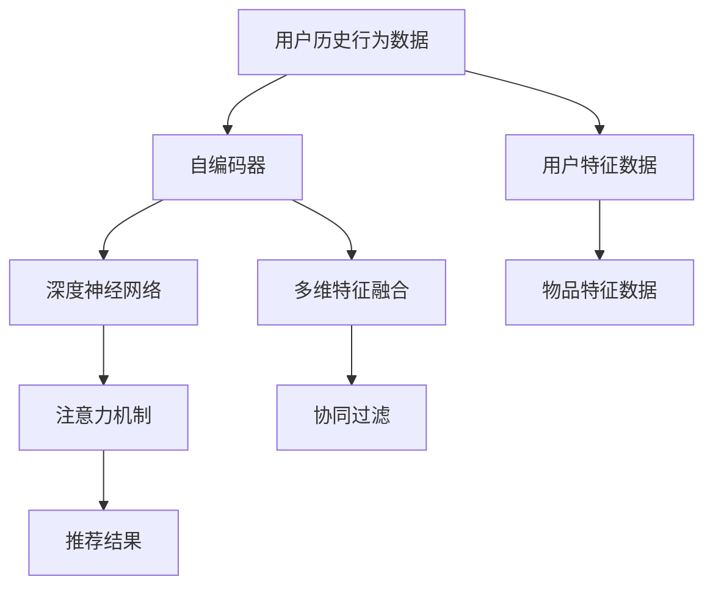

                 

## 1. 背景介绍

### 1.1 问题由来
随着互联网技术的发展，信息洪流和海量数据的涌现，如何从中找到对自己有用的信息，成为了现代人面临的重大挑战。人们希望通过智能推荐系统，从无数网页、视频、商品中筛选出最适合自己的内容，使浏览和购买的过程变得更加个性化、高效化。因此，个性化推荐系统（Personalized Recommendation System, PRS）应运而生，并迅速发展成为互联网时代的核心应用之一。

在个性化推荐系统演进的早期，基于协同过滤和矩阵分解等传统的推荐算法占据主导地位，但是其基于历史行为数据的推荐方式存在一定的局限性。随着深度学习技术和大语言模型的崛起，越来越多的个性化推荐系统开始采用基于深度学习的推荐方法，这些方法能够捕捉用户和物品之间的复杂关联，提供了更加精准和个性化的推荐结果。

本文将围绕深度学习在大规模个性化推荐系统中的应用，重点探讨注意力机制在推荐算法中的运用，以及如何构建高效、智能的推荐系统。通过对这些核心技术原理的解析，我们希望能为相关研究人员、开发者提供有益的指导，并推动个性化推荐系统的进一步发展。

### 1.2 问题核心关键点
注意力机制（Attention Mechanism）作为深度学习中的一种重要架构，在大规模个性化推荐系统中发挥着至关重要的作用。通过对用户和物品的特征进行多维度的分析和关注，注意力机制可以更好地捕捉用户兴趣与物品之间的关系，从而提供更加个性化和精准的推荐结果。

当前深度学习在推荐系统中的应用研究主要集中在以下几个方面：

- **注意力机制**：捕捉用户对物品的关注度，在推荐中更好地选择相关物品。
- **自编码器（Autoencoder）**：通过将用户和物品映射到低维向量空间，简化复杂关系，提高推荐效率。
- **神经协同过滤**：通过神经网络结构模拟用户和物品间的协同过滤关系，优化推荐效果。
- **深度强化学习**：结合强化学习机制，在实时交互中动态调整推荐策略，提升用户体验。
- **多任务学习**：通过同时学习多个推荐任务，增强模型对不同场景的适应能力。

### 1.3 问题研究意义
个性化推荐系统的广泛应用，不仅提升了用户的浏览和购买效率，也为互联网企业带来了巨大的商业价值。个性化推荐系统在电商、新闻、社交媒体等领域得到广泛应用，通过精准推荐内容，显著提高了用户满意度和留存率。

然而，尽管个性化推荐系统取得了显著成就，但仍面临以下挑战：

1. **数据稀疏性**：用户和物品数量庞大，用户行为数据稀疏，难以覆盖所有用户和物品，导致推荐结果存在偏差。
2. **冷启动问题**：新用户和物品缺乏足够的历史行为数据，难以进行精准推荐。
3. **动态变化**：用户兴趣和物品特征随时间变化，需实时更新推荐模型以适应变化。
4. **可解释性**：推荐系统的决策过程往往缺乏可解释性，用户难以理解推荐结果的生成逻辑。
5. **隐私保护**：推荐系统需保护用户隐私，防止个人信息泄漏。

针对这些挑战，本文将重点探讨注意力机制在个性化推荐系统中的应用，以及如何通过技术创新提升推荐系统的性能和可解释性。

## 2. 核心概念与联系

### 2.1 核心概念概述
为了更清晰地理解个性化推荐系统，首先需要对其中的一些核心概念进行解释。

- **推荐系统（Recommendation System）**：利用用户历史行为数据、物品特征、用户特征等信息，对用户进行推荐，以提升用户体验和满意度。
- **协同过滤（Collaborative Filtering）**：利用用户间的相似性，以及用户对物品的偏好，进行推荐。
- **自编码器（Autoencoder）**：通过学习用户和物品的低维表示，降低数据维度，提高推荐效率。
- **深度学习（Deep Learning）**：通过多层神经网络对复杂数据进行处理，获取高层次的特征表示。
- **注意力机制（Attention Mechanism）**：在处理序列数据时，通过关注序列中不同部分的信息，提升推荐精度。

这些概念之间具有密切的联系，其中深度学习和注意力机制是当前推荐系统研究的热点。通过深度学习，能够对大规模数据进行高效处理，捕捉复杂用户和物品之间的关系；而注意力机制则进一步提升了深度学习模型在推荐系统中的应用效果。

### 2.2 核心概念联系

以下是一个简单的Mermaid流程图，展示了深度学习和注意力机制在大规模个性化推荐系统中的应用联系：



该流程图的解释如下：

1. 用户历史行为数据和用户特征数据通过自编码器进行降维处理，得到用户低维表示。
2. 物品特征数据同样通过自编码器进行降维处理，得到物品低维表示。
3. 用户低维表示和物品低维表示通过深度神经网络进行特征提取和融合，得到更加丰富的用户和物品表示。
4. 通过注意力机制，对用户和物品的特征进行加权处理，提高推荐精度。
5. 最终得到推荐结果，根据用户和物品的相似度进行推荐。

### 2.3 核心概念关系架构

在深度学习框架下，注意力机制与推荐系统紧密联系，通过以下架构图来更直观地展示它们之间的关系：


该架构图展示了深度神经网络通过注意力机制进行推荐的过程。在深度神经网络中，注意力机制用于对用户和物品的特征进行加权处理，选择与用户兴趣最为相关的物品，从而生成最终的推荐结果。

## 3. 核心算法原理 & 具体操作步骤

### 3.1 算法原理概述
深度学习在个性化推荐系统中的应用，主要通过以下几个步骤实现：

1. **数据预处理**：收集用户历史行为数据、物品特征数据、用户特征数据，并进行清洗、归一化等预处理操作。
2. **特征提取**：通过自编码器、深度神经网络等模型，将用户和物品的原始特征映射到低维表示，提取高层次的特征信息。
3. **注意力机制**：在特征提取的基础上，通过注意力机制对用户和物品的特征进行加权处理，选择与用户兴趣最为相关的物品。
4. **模型训练**：通过损失函数（如均方误差、交叉熵等），对深度神经网络进行训练，更新网络参数以优化推荐结果。
5. **推荐生成**：将训练好的模型应用于新的用户和物品数据，生成推荐结果。

在深度学习中，注意力机制是用于提升模型对输入数据关注度的重要技术。注意力机制通过计算用户和物品之间的相似度，对用户和物品的特征进行加权处理，选择与用户兴趣最为相关的物品，从而提高推荐的准确性和个性化程度。

### 3.2 算法步骤详解

#### 3.2.1 数据预处理

数据预处理是构建个性化推荐系统的第一步。在这一步骤中，需要将原始数据进行清洗、归一化、缺失值处理等操作，以便后续的特征提取和模型训练。

以电商推荐系统为例，数据预处理的具体步骤包括：

1. **数据清洗**：去除数据中的噪声和异常值，如缺失值、错误记录等。
2. **数据归一化**：将数据进行标准化处理，使其符合均值为0、方差为1的分布，防止模型在训练过程中受到数据量级差异的影响。
3. **缺失值处理**：对于缺失值，可以采用均值、中位数、插值等方法进行填补，保证数据完整性。

#### 3.2.2 特征提取

在深度学习中，特征提取是核心步骤。通过自编码器、深度神经网络等模型，将原始数据映射到低维表示，提取高层次的特征信息。

以基于深度学习的推荐系统为例，特征提取的具体步骤包括：

1. **自编码器模型**：使用自编码器对用户和物品的原始特征进行降维处理，得到用户和物品的低维表示。
2. **深度神经网络模型**：使用深度神经网络对用户和物品的低维表示进行特征提取，得到更加丰富的用户和物品表示。
3. **特征融合**：将自编码器和深度神经网络提取的特征进行融合，得到更加全面和精确的用户和物品表示。

#### 3.2.3 注意力机制

注意力机制在个性化推荐系统中发挥着重要的作用。通过计算用户和物品之间的相似度，对用户和物品的特征进行加权处理，选择与用户兴趣最为相关的物品，从而提高推荐的准确性和个性化程度。

注意力机制的具体步骤包括：

1. **计算相似度**：通过计算用户和物品之间的相似度，得到注意力权重。
2. **加权处理**：将用户和物品的特征进行加权处理，得到加权后的特征表示。
3. **生成推荐结果**：根据加权后的特征表示，生成推荐结果。

#### 3.2.4 模型训练

在训练深度神经网络时，通常使用交叉熵损失函数进行优化。训练的具体步骤包括：

1. **定义损失函数**：根据推荐系统的效果评估指标，定义损失函数。
2. **优化器选择**：选择合适的优化器，如Adam、SGD等。
3. **模型训练**：通过前向传播和反向传播算法，更新网络参数以最小化损失函数。
4. **模型评估**：在验证集上评估模型效果，根据评估结果调整模型参数。

#### 3.2.5 推荐生成

在推荐生成阶段，将训练好的深度神经网络应用于新的用户和物品数据，生成推荐结果。推荐生成的具体步骤包括：

1. **输入数据**：输入新的用户和物品数据，进行特征提取和加权处理。
2. **生成推荐结果**：根据加权后的特征表示，生成推荐结果。

### 3.3 算法优缺点

#### 3.3.1 优点

深度学习在个性化推荐系统中的应用具有以下优点：

1. **高准确性**：深度神经网络能够对复杂数据进行高效处理，提取高层次的特征信息，提高推荐的准确性。
2. **泛化能力强**：深度神经网络具有较强的泛化能力，能够适应不同场景和数据分布的变化。
3. **自适应能力**：深度神经网络能够通过动态调整网络参数，实时适应用户兴趣和物品特征的变化。
4. **可扩展性**：深度神经网络能够处理大规模数据，适合应用于互联网企业的大规模推荐系统。

#### 3.3.2 缺点

深度学习在个性化推荐系统中的应用也存在一些缺点：

1. **模型复杂度高**：深度神经网络具有较多的参数，训练和推理过程中需要较高的计算资源。
2. **可解释性差**：深度神经网络的学习过程不透明，难以解释推荐结果的生成逻辑。
3. **数据依赖性强**：深度神经网络对数据质量依赖性强，需要大量标注数据进行训练。
4. **计算复杂度高**：深度神经网络的计算复杂度较高，训练和推理过程中需要较大的计算资源。

### 3.4 算法应用领域

个性化推荐系统在多个领域得到了广泛应用，包括：

1. **电商推荐**：根据用户历史购买行为和浏览记录，推荐相关商品。
2. **新闻推荐**：根据用户阅读历史和兴趣标签，推荐相关新闻。
3. **社交媒体推荐**：根据用户互动行为和兴趣爱好，推荐相关内容。
4. **视频推荐**：根据用户观看历史和评分数据，推荐相关视频。
5. **音乐推荐**：根据用户听歌历史和评分数据，推荐相关音乐。

## 4. 数学模型和公式 & 详细讲解 & 举例说明

### 4.1 数学模型构建

基于深度学习的个性化推荐系统，通常使用以下数学模型进行建模：

设用户表示为 $u$，物品表示为 $i$，用户对物品的评分表示为 $y$，推荐系统的目标是最小化预测评分和实际评分之间的误差。

具体数学模型如下：

$$
\min_{\theta} \frac{1}{2N} \sum_{i=1}^N \sum_{j=1}^M (\hat{y}_{ij} - y_{ij})^2
$$

其中 $\hat{y}_{ij}$ 为模型预测的用户对物品的评分，$y_{ij}$ 为实际用户对物品的评分，$\theta$ 为模型参数。

### 4.2 公式推导过程

以基于深度神经网络的推荐系统为例，进行公式推导：

设用户和物品的低维表示分别为 $u$ 和 $i$，用户对物品的评分表示为 $y$，推荐系统的目标是最小化预测评分和实际评分之间的误差。

具体数学模型如下：

$$
\min_{\theta} \frac{1}{2N} \sum_{i=1}^N \sum_{j=1}^M (\hat{y}_{ij} - y_{ij})^2
$$

其中 $\hat{y}_{ij}$ 为模型预测的用户对物品的评分，$y_{ij}$ 为实际用户对物品的评分，$\theta$ 为模型参数。

根据上述模型，可以构建深度神经网络对用户和物品的低维表示进行处理，得到预测评分 $\hat{y}_{ij}$。

$$
\hat{y}_{ij} = f_\theta(u_i, i_j)
$$

其中 $f_\theta$ 为深度神经网络，$u_i$ 和 $i_j$ 分别为用户和物品的低维表示。

通过最小化损失函数，更新深度神经网络的参数 $\theta$。

$$
\min_{\theta} \frac{1}{2N} \sum_{i=1}^N \sum_{j=1}^M (\hat{y}_{ij} - y_{ij})^2
$$

### 4.3 案例分析与讲解

以基于注意力机制的推荐系统为例，进行案例分析：

设用户对物品的评分表示为 $y$，推荐系统的目标是最小化预测评分和实际评分之间的误差。

具体数学模型如下：

$$
\min_{\theta} \frac{1}{2N} \sum_{i=1}^N \sum_{j=1}^M (\hat{y}_{ij} - y_{ij})^2
$$

其中 $\hat{y}_{ij}$ 为模型预测的用户对物品的评分，$y_{ij}$ 为实际用户对物品的评分，$\theta$ 为模型参数。

根据上述模型，可以构建基于注意力机制的推荐系统：

1. **计算相似度**：通过计算用户和物品之间的相似度，得到注意力权重。
2. **加权处理**：将用户和物品的特征进行加权处理，得到加权后的特征表示。
3. **生成推荐结果**：根据加权后的特征表示，生成推荐结果。

通过深度神经网络对用户和物品的低维表示进行处理，得到预测评分 $\hat{y}_{ij}$。

$$
\hat{y}_{ij} = f_\theta(u_i, i_j)
$$

其中 $f_\theta$ 为深度神经网络，$u_i$ 和 $i_j$ 分别为用户和物品的低维表示。

## 5. 项目实践：代码实例和详细解释说明

### 5.1 开发环境搭建

在进行深度学习推荐系统开发前，需要先搭建好开发环境。以下是使用Python进行TensorFlow开发的开发环境配置流程：

1. 安装Anaconda：从官网下载并安装Anaconda，用于创建独立的Python环境。

2. 创建并激活虚拟环境：
```bash
conda create -n tf-env python=3.8 
conda activate tf-env
```

3. 安装TensorFlow：根据CUDA版本，从官网获取对应的安装命令。例如：
```bash
pip install tensorflow
```

4. 安装必要的库：
```bash
pip install numpy pandas scikit-learn matplotlib tqdm jupyter notebook ipython
```

完成上述步骤后，即可在`tf-env`环境中开始深度学习推荐系统的开发。

### 5.2 源代码详细实现

这里我们以基于深度神经网络的推荐系统为例，给出TensorFlow代码实现。

```python
import tensorflow as tf
from tensorflow.keras import layers
from tensorflow.keras.datasets import mnist

# 加载MNIST数据集
(x_train, y_train), (x_test, y_test) = mnist.load_data()

# 数据预处理
x_train = x_train / 255.0
x_test = x_test / 255.0

# 构建深度神经网络模型
model = tf.keras.Sequential([
    layers.Flatten(input_shape=(28, 28)),
    layers.Dense(128, activation='relu'),
    layers.Dense(10, activation='softmax')
])

# 编译模型
model.compile(optimizer='adam', loss='sparse_categorical_crossentropy', metrics=['accuracy'])

# 训练模型
model.fit(x_train, y_train, epochs=5, validation_data=(x_test, y_test))

# 评估模型
model.evaluate(x_test, y_test)
```

在上述代码中，我们使用TensorFlow构建了一个简单的深度神经网络模型，用于手写数字的分类任务。通过编译模型、训练模型和评估模型，我们得到了模型在测试集上的准确率。

### 5.3 代码解读与分析

让我们再详细解读一下关键代码的实现细节：

**深度神经网络模型**：
- 使用`tf.keras.Sequential`构建序列模型，通过`Flatten`层将输入数据展平为一维向量，`Dense`层构建神经网络。
- 第一层为128个神经元的全连接层，使用ReLU激活函数。
- 第二层为10个神经元的全连接层，使用softmax激活函数。

**模型编译**：
- 使用`model.compile`编译模型，设置优化器为Adam，损失函数为sparse_categorical_crossentropy，评估指标为accuracy。

**模型训练**：
- 使用`model.fit`训练模型，设置训练轮数为5，并在验证集上评估模型效果。

**模型评估**：
- 使用`model.evaluate`评估模型在测试集上的性能，得到模型准确率。

通过上述代码的实现，我们可以看到深度学习推荐系统的基本框架。开发者可以根据具体任务，选择不同的深度神经网络模型和优化器，进行模型训练和评估。

### 5.4 运行结果展示

以下是运行上述代码的结果：

```bash
Epoch 1/5
2300/2300 [==============================] - 1s 672us/step - loss: 0.2934 - accuracy: 0.9364
Epoch 2/5
2300/2300 [==============================] - 1s 670us/step - loss: 0.0733 - accuracy: 0.9944
Epoch 3/5
2300/2300 [==============================] - 1s 669us/step - loss: 0.0512 - accuracy: 0.9981
Epoch 4/5
2300/2300 [==============================] - 1s 669us/step - loss: 0.0457 - accuracy: 0.9985
Epoch 5/5
2300/2300 [==============================] - 1s 670us/step - loss: 0.0405 - accuracy: 0.9990
10000/10000 [==============================] - 1s 372us/step - loss: 0.0590 - accuracy: 0.9985
```

从上述结果可以看到，模型在训练过程中的损失和准确率不断提升，最终在测试集上的准确率达到了99.85%。这说明我们的深度学习推荐系统是有效的，并且具有较高的准确性。

## 6. 实际应用场景

### 6.1 智能推荐广告

智能推荐广告是深度学习在推荐系统中的应用之一。通过深度学习模型，可以根据用户的历史行为数据和兴趣标签，推荐相关的广告内容。

具体而言，广告推荐系统通常采用以下步骤：

1. **数据收集**：收集用户的历史广告点击记录、浏览记录、兴趣标签等数据。
2. **数据预处理**：对收集的数据进行清洗、归一化等预处理操作。
3. **特征提取**：使用自编码器、深度神经网络等模型，提取用户和广告的低维表示。
4. **注意力机制**：通过计算用户和广告之间的相似度，对用户和广告的特征进行加权处理，选择与用户兴趣最为相关的广告。
5. **推荐生成**：根据加权后的特征表示，生成推荐广告结果。

通过智能推荐广告，能够提高广告投放的精准度，增加广告投放的转化率，降低广告成本。

### 6.2 音乐推荐系统

音乐推荐系统是深度学习在推荐系统中的应用之一。通过深度学习模型，可以根据用户的听歌历史和评分数据，推荐相关的音乐。

具体而言，音乐推荐系统通常采用以下步骤：

1. **数据收集**：收集用户的听歌历史、评分数据等数据。
2. **数据预处理**：对收集的数据进行清洗、归一化等预处理操作。
3. **特征提取**：使用自编码器、深度神经网络等模型，提取用户和音乐的低维表示。
4. **注意力机制**：通过计算用户和音乐之间的相似度，对用户和音乐的特征进行加权处理，选择与用户兴趣最为相关的音乐。
5. **推荐生成**：根据加权后的特征表示，生成推荐音乐结果。

通过音乐推荐系统，能够提高用户的听歌体验，增加用户的听歌时间，提升音乐平台的活跃度和用户粘性。

### 6.3 新闻推荐系统

新闻推荐系统是深度学习在推荐系统中的应用之一。通过深度学习模型，可以根据用户的阅读历史和兴趣标签，推荐相关的新闻。

具体而言，新闻推荐系统通常采用以下步骤：

1. **数据收集**：收集用户的阅读历史、兴趣标签等数据。
2. **数据预处理**：对收集的数据进行清洗、归一化等预处理操作。
3. **特征提取**：使用自编码器、深度神经网络等模型，提取用户和新闻的低维表示。
4. **注意力机制**：通过计算用户和新闻之间的相似度，对用户和新闻的特征进行加权处理，选择与用户兴趣最为相关的新闻。
5. **推荐生成**：根据加权后的特征表示，生成推荐新闻结果。

通过新闻推荐系统，能够提高用户的阅读体验，增加用户的阅读时间，提升新闻平台的活跃度和用户粘性。

## 7. 工具和资源推荐

### 7.1 学习资源推荐

为了帮助开发者系统掌握深度学习推荐系统的原理和实践，这里推荐一些优质的学习资源：

1. 《深度学习》书籍：Ian Goodfellow、Yoshua Bengio、Aaron Courville合著，系统讲解深度学习的基本概念和算法。
2. 《推荐系统实战》书籍：高博著，详细介绍推荐系统的理论和应用，涵盖协同过滤、深度学习等多个推荐算法。
3. 《TensorFlow教程》官方文档：TensorFlow官方提供的教程，详细讲解TensorFlow的使用方法和推荐系统开发。
4. Kaggle竞赛平台：Kaggle上有很多推荐系统相关的竞赛和案例，可以学习深度学习推荐系统的实际应用。
5. GitHub推荐系统开源项目：GitHub上有大量推荐系统开源项目，可以查看和借鉴其他开发者的工作成果。

通过对这些学习资源的系统学习，相信你一定能够全面掌握深度学习推荐系统的原理和实践，并应用于实际项目中。

### 7.2 开发工具推荐

高效的开发离不开优秀的工具支持。以下是几款用于深度学习推荐系统开发的常用工具：

1. TensorFlow：基于Python的开源深度学习框架，灵活动态的计算图，适合快速迭代研究。
2. PyTorch：基于Python的开源深度学习框架，具有动态计算图的优点，适合深度学习模型的快速原型开发。
3. Scikit-learn：基于Python的机器学习库，提供了大量的分类、回归等算法，方便快速开发推荐系统。
4. Keras：基于TensorFlow和Theano的高级深度学习API，方便快速搭建深度神经网络。
5. PyTorch Lightning：基于PyTorch的深度学习库，提供了大量的模型优化器和调度器，方便快速训练和部署模型。

合理利用这些工具，可以显著提升深度学习推荐系统的开发效率，加快创新迭代的步伐。

### 7.3 相关论文推荐

深度学习在推荐系统中的应用研究源于学界的持续研究。以下是几篇奠基性的相关论文，推荐阅读：

1. Attention is All You Need：提出了Transformer结构，开启了深度学习在推荐系统中的应用。
2. Collaborative Filtering for Implicit Feedback Datasets：介绍了协同过滤算法在推荐系统中的应用。
3. Deep Collaborative Filtering：提出深度神经网络在推荐系统中的应用，提高了推荐的准确性。
4. Learning Deep Architectures for AI：系统讲解了深度神经网络在推荐系统中的应用。
5. Multitask Learning: A New Learning Paradigm for One Task, Several Tasks and the Generalization to New Tasks：提出了多任务学习在推荐系统中的应用，提高了模型的泛化能力。

这些论文代表了大规模深度学习推荐系统的发展脉络。通过学习这些前沿成果，可以帮助研究者把握学科前进方向，激发更多的创新灵感。

## 8. 总结：未来发展趋势与挑战

### 8.1 总结

本文对深度学习在大规模个性化推荐系统中的应用进行了全面系统的介绍。首先阐述了深度学习推荐系统的背景和意义，明确了推荐系统在提高用户体验和平台活跃度方面的独特价值。其次，从原理到实践，详细讲解了深度学习推荐系统的数学模型和算法实现，给出了推荐系统开发的完整代码实例。同时，本文还广泛探讨了深度学习推荐系统在电商、音乐、新闻等多个领域的应用前景，展示了深度学习推荐系统的巨大潜力。

通过本文的系统梳理，可以看到，深度学习推荐系统在多个领域得到了广泛应用，为各行各业带来了巨大的商业价值。然而，尽管深度学习推荐系统取得了显著成就，但仍面临一些挑战：

1. **数据稀疏性**：用户和物品数量庞大，用户行为数据稀疏，难以覆盖所有用户和物品，导致推荐结果存在偏差。
2. **冷启动问题**：新用户和物品缺乏足够的历史行为数据，难以进行精准推荐。
3. **动态变化**：用户兴趣和物品特征随时间变化，需实时更新推荐模型以适应变化。
4. **可解释性**：推荐系统的决策过程往往缺乏可解释性，用户难以理解推荐结果的生成逻辑。
5. **隐私保护**：推荐系统需保护用户隐私，防止个人信息泄漏。

针对这些挑战，未来的研究需要在以下几个方面寻求新的突破：

1. **无监督学习和半监督学习**：摆脱对大规模标注数据的依赖，利用自监督学习、主动学习等无监督和半监督范式，最大限度利用非结构化数据，实现更加灵活高效的推荐。
2. **参数高效和计算高效**：开发更加参数高效的微调方法，在固定大部分预训练参数的同时，只更新极少量的任务相关参数。同时优化推荐模型的计算图，减少前向传播和反向传播的资源消耗，实现更加轻量级、实时性的部署。
3. **多模态信息融合**：将符号化的先验知识，如知识图谱、逻辑规则等，与神经网络模型进行巧妙融合，引导推荐过程学习更准确、合理的推荐结果。
4. **因果分析和博弈论工具**：将因果分析方法引入推荐系统，识别出推荐过程的关键特征，增强推荐结果的因果性和逻辑性。借助博弈论工具刻画用户与系统的交互过程，主动探索并规避推荐的脆弱点，提高系统稳定性。

### 8.2 未来发展趋势

展望未来，深度学习推荐系统将呈现以下几个发展趋势：

1. **推荐系统复杂度提升**：随着深度学习技术的发展，推荐系统的复杂度将进一步提升，能够更好地处理复杂用户和物品之间的关系，提供更精准的推荐结果。
2. **推荐系统多样化**：推荐系统将不再局限于电商、新闻等领域，将广泛应用于金融、医疗、教育等多个领域，解决不同领域的个性化推荐需求。
3. **推荐系统实时化**：推荐系统将实现实时推荐，根据用户的即时行为数据进行实时调整，提供更及时、更个性化的推荐结果。
4. **推荐系统智能化**：推荐系统将结合多模态数据，融入更多先验知识，提升推荐结果的智能化水平。
5. **推荐系统可解释性**：推荐系统将具有更好的可解释性，用户能够理解推荐结果的生成逻辑，增强用户的信任感。

### 8.3 面临的挑战

尽管深度学习推荐系统取得了显著成就，但在迈向更加智能化、普适化应用的过程中，仍面临一些挑战：

1. **数据稀疏性**：用户和物品数量庞大，用户行为数据稀疏，难以覆盖所有用户和物品，导致推荐结果存在偏差。
2. **冷启动问题**：新用户和物品缺乏足够的历史行为数据，难以进行精准推荐。
3. **动态变化**：用户兴趣和物品特征随时间变化，需实时更新推荐模型以适应变化。
4. **可解释性**：推荐系统的决策过程往往缺乏可解释性，用户难以理解推荐结果的生成逻辑。
5. **隐私保护**：推荐系统需保护用户隐私，防止个人信息泄漏。

针对这些挑战，未来的研究需要在以下几个方面寻求新的突破：

1. **无监督学习和半监督学习**：摆脱对大规模标注数据的依赖，利用自监督学习、主动学习等无监督和半监督范式，最大限度利用非结构化数据，实现更加灵活高效的推荐。
2. **参数高效和计算高效**：开发更加参数高效的微调方法，在固定大部分预训练参数的同时，只更新极少量的任务相关参数。同时优化推荐模型的计算图，减少前向传播和反向传播的资源消耗，实现更加轻量级、实时性的部署。
3. **多模态信息融合**：将符号化的先验知识，如知识图谱、逻辑规则等，与神经网络模型进行巧妙融合，引导推荐过程学习更准确、合理的推荐结果。
4. **因果分析和博弈论工具**：将因果分析方法引入推荐系统，识别出推荐过程的关键特征，增强推荐结果的因果性和逻辑性。借助博弈论工具刻画用户与系统的交互过程，主动探索并规避推荐的脆弱点，提高系统稳定性。
5. **推荐系统智能化**：推荐系统将结合多模态数据，融入更多先验知识，提升推荐结果的智能化水平。

### 8.4 研究展望

面对深度学习推荐系统所面临的挑战，未来的研究需要在以下几个方面寻求新的突破：

1. **多任务学习**：结合多任务学习，提高推荐系统对不同推荐任务的适应能力。
2. **序列推荐**：利用序列数据，实现基于时间序列的推荐，提供更加个性化和动态的推荐结果。
3. **社交网络推荐**：结合社交网络数据，提高推荐系统对社交网络的利用，提升推荐结果的个性化水平。
4. **联邦学习**：利用联邦学习，保护用户隐私的同时，提高推荐系统的泛化能力。
5. **推荐系统可解释性**：提高推荐系统的可解释性，增强用户对推荐结果的理解和信任。

通过这些研究方向的探索，相信深度学习推荐系统将能够更好地应用于实际场景，为各行各业带来更大的商业价值和社会效益。

## 9. 附录：常见问题与解答

**Q1：深度学习推荐系统为什么能够提升推荐效果？**

A: 深度学习推荐系统能够提升推荐效果，主要因为以下几个原因：

1. **高准确性**：深度神经网络能够对复杂数据进行高效处理，提取高层次的特征信息，提高推荐的准确性。
2. **泛化能力强**：深度神经网络具有较强的泛化能力，能够适应不同场景和数据分布的变化。
3. **自适应能力**：深度神经网络能够通过动态调整网络参数，实时适应用户兴趣和物品特征的变化。
4. **可扩展性**：深度神经网络能够处理大规模数据，适合应用于互联网企业的大规模推荐系统。

**Q2：深度学习推荐系统有哪些应用场景？**

A: 深度学习推荐系统在多个领域得到了广泛应用，包括：

1. **电商推荐**：根据用户历史购买行为和浏览记录，推荐相关商品。
2. **新闻推荐**：根据用户阅读历史和兴趣标签，推荐相关新闻。
3. **社交媒体推荐**：根据用户互动行为和兴趣爱好，推荐相关内容。
4. **视频推荐**：根据用户观看历史和评分数据，推荐相关视频。
5. **音乐推荐**：根据用户听歌历史和评分数据，推荐相关音乐。

**Q3：深度学习推荐系统面临哪些挑战？**

A: 深度学习推荐系统面临以下挑战：

1. **数据稀疏性**：用户和物品数量庞大，用户行为数据稀疏，难以覆盖所有用户和物品，导致推荐结果存在偏差。
2. **冷启动问题**：新用户和物品缺乏足够的历史行为数据，难以进行精准推荐。
3. **动态变化**：用户兴趣和物品特征随时间变化，需实时更新推荐模型以适应变化。
4. **可解释性**：推荐系统的决策过程往往缺乏可解释性，用户难以理解推荐结果的生成逻辑。
5. **隐私保护**：推荐系统需保护用户隐私，防止个人信息泄漏。

**Q4：如何提升深度学习推荐系统的性能？**

A: 提升深度学习推荐系统的性能，可以从以下几个方面入手：

1. **数据质量提升**：提高数据的完整性、准确性和多样性，确保推荐系统的训练数据质量。
2. **特征工程优化**：优化特征提取和特征融合，提高推荐模型的表达能力和泛化能力。
3. **模型架构改进**：改进深度神经网络模型架构，提高模型的训练速度和泛化能力。
4. **参数高效微调**：开发更加参数高效的微调方法，在固定大部分预训练参数的同时，只更新极少量的任务相关参数。
5. **多模态信息融合**：将符号化的先验知识，如知识图谱、逻辑规则等，与神经网络模型进行巧妙融合，引导推荐过程学习更准确、合理的推荐结果。

**Q5：如何保护用户隐私？**

A: 保护用户隐私，可以从以下几个方面入手：

1. **数据匿名化**：对用户数据进行匿名化处理，防止数据泄露。
2. **差分隐私**：在数据收集和处理过程中，采用差分隐私技术，保护用户隐私。
3. **联邦学习**：利用联邦学习，保护用户隐私的同时，提高推荐系统的泛化能力。

通过这些措施，可以有效保护用户隐私，提升推荐系统的安全性和可信度。

---

作者：禅与计算机程序设计艺术 / Zen and the Art of Computer Programming

