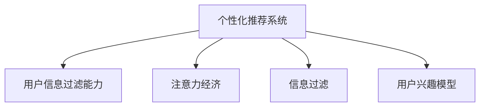

                 

# 注意力经济与个人信息过滤能力的培养

在信息爆炸的时代，人们面临的是海量数据和有限时间的矛盾，而注意力经济（Economies of Attention）则是解决这一矛盾的关键。本文将探讨注意力经济的内涵、在个性化推荐系统中的应用，并详细介绍提升个人信息过滤能力的算法原理与实践。

## 1. 背景介绍

### 1.1 问题由来
随着互联网的发展，信息量呈指数级增长，人们在获取所需信息时面临巨大的挑战。传统的信息检索方式已无法满足用户需求，个性化推荐系统应运而生。推荐系统通过收集用户的浏览、购买等行为数据，学习用户的兴趣偏好，从而提供个性化的内容。然而，推荐系统的效果不仅取决于算法的好坏，还与用户信息过滤能力密切相关。

### 1.2 问题核心关键点
1. 用户信息过滤能力的培养：推荐系统通过个性化推荐提升用户体验，但用户对推荐结果的信任和满意度还取决于其自身的信息过滤能力。
2. 注意力经济：推荐系统需要对用户有限的信息注意资源进行分配，使推荐结果尽可能符合用户兴趣。

## 2. 核心概念与联系

### 2.1 核心概念概述

为更好地理解个性化推荐系统和注意力经济，本节将介绍几个关键概念：

- 个性化推荐系统（Personalized Recommendation System）：通过分析用户的历史行为数据，学习用户的兴趣，为用户提供个性化的推荐结果。
- 注意力经济（Economies of Attention）：在信息过载的互联网时代，用户的信息注意资源是稀缺的，推荐系统需要优化资源的分配，使得推荐的准确度和用户的满意度最大化。
- 信息过滤（Information Filtering）：用户在接收到推荐结果后，需根据自身需求和兴趣进行筛选，这个过程称为信息过滤。
- 用户兴趣模型（User Interest Model）：推荐系统通过用户行为数据学习用户的兴趣偏好，建立兴趣模型。

这些概念之间的逻辑关系可以通过以下Mermaid流程图来展示：



这个流程图展示了几组概念之间的关联：

1. 个性化推荐系统是核心，它通过优化资源分配，最大化用户满意度和推荐效果。
2. 用户信息过滤能力是用户利用推荐系统的基础，推荐系统的优化需考虑用户过滤能力。
3. 注意力经济是推荐系统优化的目标，用户有限的注意力资源需合理分配。
4. 用户兴趣模型是推荐系统的基础，需准确捕捉用户兴趣，以便个性化推荐。

## 3. 核心算法原理 & 具体操作步骤

### 3.1 算法原理概述

在个性化推荐系统中，注意力经济是核心，即推荐系统需有效利用用户的有限注意力资源。常见的注意力经济算法包括：

1. 协同过滤（Collaborative Filtering）：通过用户与项目的交互数据，捕捉用户之间的相似性，推荐相似用户喜欢的项目。
2. 基于内容的推荐（Content-based Recommendation）：通过分析项目特征，推荐与用户兴趣相似的项目。
3. 混合推荐（Hybrid Recommendation）：结合多种推荐方法，提高推荐效果。

其中，协同过滤是最常用的方法，其基本思路是通过用户和项目的相似性来推荐项目。

### 3.2 算法步骤详解

#### 3.2.1 协同过滤算法步骤

协同过滤算法一般包括以下几个关键步骤：

1. 用户与项目评分矩阵构建：收集用户对项目的评分数据，构建用户-项目评分矩阵 $R_{U \times I}$，其中 $U$ 为用户数，$I$ 为物品数。
2. 相似度计算：计算用户之间和项目之间的相似度，常用余弦相似度或皮尔逊相关系数。
3. 预测评分：根据相似度，预测用户对未评分项目的评分。
4. 推荐排序：根据预测评分对物品进行排序，选择评分最高的物品推荐给用户。

#### 3.2.2 基于内容的推荐算法步骤

基于内容的推荐算法步骤相对简单，主要包括：

1. 物品特征提取：提取物品的特征，如关键词、标签等。
2. 特征匹配：计算用户兴趣特征与物品特征的相似度，常用余弦相似度或欧式距离。
3. 推荐排序：根据特征匹配结果，对物品进行排序，选择相似度最高的物品推荐给用户。

#### 3.2.3 混合推荐算法步骤

混合推荐算法结合了多种推荐方法，步骤较为复杂：

1. 选择多种推荐方法：如协同过滤、基于内容的推荐等。
2. 权重计算：根据各推荐方法的优缺点，计算每种推荐方法的权重。
3. 综合排序：根据权重综合排序结果，选择评分最高的物品推荐给用户。

### 3.3 算法优缺点

#### 3.3.1 协同过滤算法

**优点**：
1. 无需物品特征信息，适合处理隐式反馈数据。
2. 用户和项目的相似性计算较简单，易于实现。
3. 能够发现用户之间的潜在兴趣。

**缺点**：
1. 数据稀疏性问题严重，用户和项目评分矩阵往往不完整。
2. 冷启动问题：新用户或新项目没有评分数据，难以推荐。
3. 推荐结果可能存在偏差，推荐物品之间的关联性弱。

#### 3.3.2 基于内容的推荐算法

**优点**：
1. 无需用户评分数据，可处理显式和隐式反馈数据。
2. 用户特征和物品特征具有明确的语义信息，容易解释。
3. 能较好处理新物品推荐，推荐结果具有相关性。

**缺点**：
1. 特征提取需要人工干预，特征维度可能过高。
2. 特征匹配计算复杂，容易受噪声影响。
3. 难以捕捉用户动态兴趣变化，推荐结果较单一。

#### 3.3.3 混合推荐算法

**优点**：
1. 综合多种推荐方法，提高推荐效果。
2. 能较好处理冷启动和数据稀疏问题。
3. 可灵活调整各推荐方法的权重，提高算法鲁棒性。

**缺点**：
1. 算法复杂度高，计算成本较大。
2. 需对各推荐方法进行调参，确定最优权重。
3. 推荐系统难以在离线测试中验证。

## 4. 数学模型和公式 & 详细讲解 & 举例说明

### 4.1 数学模型构建

假设用户对物品的评分矩阵为 $R_{U \times I}$，其中 $U$ 为用户数，$I$ 为物品数。用户对物品 $i$ 的评分记为 $r_{ui}$。基于协同过滤的推荐算法可以表示为：

$$
r_{ui}=\alpha \sum_{j=1}^{U} \sum_{k=1}^{I} \frac{r_{uj}r_{ik}}{\sqrt{\sum_{l=1}^{U}r_{ul}^2} \sqrt{\sum_{m=1}^{I}r_{im}^2}}
$$

其中 $\alpha$ 为常数，$\sqrt{\sum_{l=1}^{U}r_{ul}^2}$ 和 $\sqrt{\sum_{m=1}^{I}r_{im}^2}$ 分别是用户 $u$ 和物品 $i$ 的归一化权重。

### 4.2 公式推导过程

根据协同过滤算法的公式，可以进一步推导出推荐系统中的权重计算公式。

假设用户 $u$ 和物品 $i$ 的相似度为 $s_{ui}$，则推荐公式可表示为：

$$
r_{ui}=\alpha \sum_{j=1}^{U} \sum_{k=1}^{I} \frac{s_{uj}s_{ik}}{\sqrt{\sum_{l=1}^{U}s_{ul}^2} \sqrt{\sum_{m=1}^{I}s_{im}^2}}
$$

其中 $s_{uj}$ 和 $s_{ik}$ 分别表示用户 $u$ 和物品 $i$ 与用户 $j$ 和物品 $k$ 的相似度。

### 4.3 案例分析与讲解

以Amazon平台的商品推荐系统为例，通过协同过滤算法，可以针对用户的历史行为数据进行推荐。设用户 $u$ 对物品 $i$ 的评分 $r_{ui} \in \{1,2,3,4,5\}$，用户与物品的相似度 $s_{uj} \in [-1,1]$。通过计算用户和物品的相似度，推荐系统可以预测用户对未评分物品的评分，并按评分排序推荐给用户。

## 5. 项目实践：代码实例和详细解释说明

### 5.1 开发环境搭建

在实践中，我们通常使用Python语言和Scikit-learn库进行推荐系统的开发。以下是安装依赖和配置环境的步骤：

```bash
pip install scikit-learn
```

### 5.2 源代码详细实现

下面以协同过滤算法为例，给出代码实现：

```python
from sklearn.metrics.pairwise import cosine_similarity
import numpy as np

# 假设用户-物品评分矩阵为 R
R = np.array([[5, 0, 0], [4, 5, 3], [0, 0, 5]])

# 计算用户-物品相似度
S = cosine_similarity(R, R)

# 预测用户对物品的评分
scores = np.dot(S, R.T)

# 推荐排序
indices = np.argsort(scores)
recommendations = indices[::-1][:5]
```

### 5.3 代码解读与分析

在上述代码中，我们首先计算了用户-物品的相似度矩阵 $S$，然后根据相似度矩阵计算用户对物品的评分 $scores$。最后，通过排序得到推荐列表 $recommendations$。

需要注意的是，实际应用中，评分矩阵 $R$ 通常是稀疏的，因此需要使用稀疏矩阵处理库，如scipy的稀疏矩阵。

## 6. 实际应用场景

### 6.1 智能推荐系统

基于协同过滤的推荐系统广泛应用于智能推荐中，如电商、视频、音乐等平台。用户通过浏览、点击、评分等行为数据，系统学习用户的兴趣偏好，自动推荐相关物品。

### 6.2 个性化广告

在广告推荐中，推荐系统通过分析用户的历史行为数据，预测用户对广告的兴趣，并将广告投放给潜在用户。基于协同过滤的算法能够快速发现用户和广告之间的相似性，提高广告的点击率和转化率。

### 6.3 内容分发

新闻、视频等平台通过推荐系统向用户推送个性化内容。系统通过分析用户的阅读、观看历史，学习用户兴趣，推荐相关文章或视频。基于内容的推荐算法能够更好地处理新内容推荐，提高内容分发效率。

### 6.4 未来应用展望

未来，基于注意力经济的推荐系统将更加智能化、个性化。随着深度学习技术的发展，推荐系统将融合多模态数据，如文本、图像、语音等，实现跨模态推荐。同时，推荐系统还将结合强化学习、序列模型等先进技术，实现动态自适应推荐。

## 7. 工具和资源推荐

### 7.1 学习资源推荐

为帮助开发者掌握推荐系统的理论和实践，推荐以下学习资源：

1. 《推荐系统实战》：陈骥光著，系统介绍了推荐系统的基本原理和实际应用。
2. Coursera《Recommender Systems Specialization》：由斯坦福大学开设的推荐系统课程，涵盖多种推荐算法和评估指标。
3. 《Adaptive Computation of User Preference》：Liu et al. 提出的基于协同过滤的推荐算法，是推荐系统领域的经典论文。
4. Deep Learning Specialization：由Andrew Ng教授开设的深度学习课程，涵盖了深度学习在推荐系统中的应用。

### 7.2 开发工具推荐

推荐的开发工具包括：

1. Scikit-learn：Python机器学习库，提供多种推荐算法和评估指标。
2. TensorFlow：Google开源的深度学习框架，支持大规模推荐系统的开发。
3. PyTorch：Facebook开源的深度学习框架，灵活性高，适合推荐系统的研究。

### 7.3 相关论文推荐

推荐系统的研究论文众多，推荐以下经典论文：

1. KDD '98: A Scalable Approach to Recommender System: Adaptive Computation of User Preference（Liu et al.）
2. Recommender Systems Handbook（Riccardo V. Gambini, Dror Meir, Antonio Mei）
3. Semantic Analysis in Recommender Systems（Lionel Cucala, Thomas Kopecky）
4. Sequential Recommendation Learning with Deep Recurrent Neural Networks（He et al.）

## 8. 总结：未来发展趋势与挑战

### 8.1 研究成果总结

本文系统介绍了基于协同过滤的推荐系统，并探讨了注意力经济在个性化推荐中的应用。推荐系统在电商、广告、内容分发等领域得到广泛应用，提升了用户体验和商业价值。未来，推荐系统将更加智能化、个性化，融合多模态数据和深度学习技术，提升推荐效果。

### 8.2 未来发展趋势

1. 融合多模态数据：未来的推荐系统将结合文本、图像、语音等多模态数据，实现跨模态推荐。
2. 深度学习的应用：深度学习技术将更好地应用于推荐系统，提高推荐效果。
3. 个性化推荐：基于用户行为数据的个性化推荐将更加智能化，提升用户体验。
4. 实时推荐：实时推荐系统能够动态调整推荐内容，提高用户满意度。

### 8.3 面临的挑战

1. 数据隐私问题：推荐系统需处理大量用户数据，数据隐私保护成为一大挑战。
2. 冷启动问题：新用户或新物品没有评分数据，难以推荐。
3. 数据稀疏性：用户和物品的评分矩阵通常较为稀疏，影响推荐效果。
4. 模型复杂度：深度学习模型复杂度高，计算成本较大。
5. 用户行为变化：用户兴趣和行为可能会发生变化，推荐系统需动态适应。

### 8.4 研究展望

未来推荐系统需解决数据隐私、冷启动、数据稀疏性等挑战，同时提高推荐效果和用户体验。推荐系统还需融合多模态数据和深度学习技术，实现更加智能化和个性化的推荐。此外，推荐系统还需注重数据隐私保护，提升用户信任度。

## 9. 附录：常见问题与解答

**Q1：协同过滤算法能否处理新用户和新物品推荐？**

A: 协同过滤算法主要依赖用户和物品的历史评分数据，难以处理新用户和新物品推荐。对于新用户，可以使用基于内容的推荐方法，根据新用户的特征和历史行为数据进行推荐。对于新物品，可以使用显式反馈数据，如评分、评论等，进行推荐。

**Q2：推荐系统中的数据隐私如何保护？**

A: 推荐系统需保护用户数据隐私，可采用以下措施：
1. 数据匿名化：对用户数据进行去标识化处理，保护用户隐私。
2. 差分隐私：在推荐过程中加入噪声，保护用户隐私。
3. 访问控制：限制对用户数据的访问权限，保护数据安全。

**Q3：推荐系统中的数据稀疏性问题如何解决？**

A: 推荐系统中的数据稀疏性问题可以通过以下方法解决：
1. 矩阵分解：对用户-物品评分矩阵进行分解，减少矩阵维度。
2. 稀疏矩阵压缩：使用稀疏矩阵压缩技术，减少矩阵存储和计算成本。
3. 数据补全：通过预测用户评分或物品评分，补全缺失数据。

**Q4：推荐系统中的冷启动问题如何解决？**

A: 推荐系统中的冷启动问题可以通过以下方法解决：
1. 基于内容的推荐：根据新用户的特征进行推荐。
2. 多模态推荐：结合文本、图像、语音等多模态数据进行推荐。
3. 兴趣引导：通过用户输入的偏好信息进行推荐。

**Q5：推荐系统中的推荐结果多样性如何控制？**

A: 推荐系统中的推荐结果多样性可以通过以下方法控制：
1. 多样性约束：在推荐算法中加入多样性约束，限制相似推荐物品的数量。
2. 噪声注入：在推荐结果中加入随机噪声，提高推荐多样性。
3. 多臂老虎机：在推荐过程中使用多臂老虎机算法，动态调整推荐物品的多样性。

通过本文的系统介绍和实践案例，相信你能够更好地理解基于协同过滤的推荐系统，掌握注意力经济在个性化推荐中的应用。推荐系统作为未来互联网的核心技术之一，其研究和应用将不断深入，为人们的日常生活和工作带来更多便利和效益。

---

作者：禅与计算机程序设计艺术 / Zen and the Art of Computer Programming

