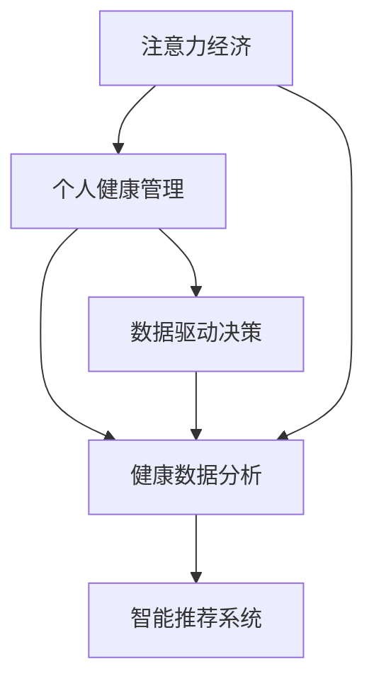

                 

# 注意力经济与个人健康管理的关系

> 关键词：注意力经济, 个人健康管理, 数据驱动决策, 健康数据分析, 智能推荐系统

## 1. 背景介绍

在信息爆炸的时代，我们面对的是一个充满干扰和分心的世界。互联网的普及让我们的生活充满了各种信息和数据，但也让我们的注意力成为了一种稀缺资源。据研究，成年人每天平均会接收超过2,000个外部信息干扰，其中只有不到1%的信息真正进入了大脑。在这个背景下，如何有效管理个人注意力，成为了一个重要的课题。

与此同时，随着人们生活水平的提高，对健康的关注也越来越高。个人健康管理涉及营养、运动、睡眠等多个方面，越来越依赖于数据驱动的决策。如何通过智能化的方式，帮助人们更好地管理健康，成为了另一个重要的研究方向。

因此，将注意力经济与个人健康管理结合起来，通过智能化的数据分析和推荐系统，帮助人们更好地管理注意力和健康，成为了一个具有重要意义的研究课题。本文将探讨这一领域的核心概念、算法原理和具体实现，并分析其未来应用前景。

## 2. 核心概念与联系

### 2.1 核心概念概述

为更好地理解注意力经济与个人健康管理的关系，本节将介绍几个密切相关的核心概念：

- **注意力经济 (Economy of Attention)**：指在信息过载时代，通过控制和优化个人注意力，实现更好的信息利用和经济效益。注意力经济的核心在于如何识别、筛选和优先处理信息，以提高决策效率和产出价值。

- **个人健康管理**：指通过科学的健康监测和数据分析，为用户提供个性化的健康管理建议。涵盖饮食、运动、睡眠、心理等多个方面，旨在提高生活质量，预防疾病，延长寿命。

- **数据驱动决策 (Data-Driven Decision Making)**：指通过收集、分析和利用数据，辅助决策制定。在个人健康管理中，数据驱动决策通过智能化的分析工具，帮助用户做出更科学、更合理的健康决策。

- **健康数据分析 (Health Data Analytics)**：指对健康数据进行收集、清洗、分析和建模的过程。通过科学的方法和工具，从健康数据中提取有价值的信息，辅助用户进行健康管理。

- **智能推荐系统 (Recommendation Systems)**：指通过用户行为数据和偏好信息，为用户推荐个性化内容和服务。在健康管理中，智能推荐系统可以推荐个性化的健康管理计划、饮食建议、运动方案等。

这些核心概念之间的逻辑关系可以通过以下Mermaid流程图来展示：



这个流程图展示了几者之间的关联性：

1. 注意力经济和健康管理都是信息驱动的决策过程，核心在于通过科学的方法进行信息处理。
2. 数据驱动决策是注意力经济和健康管理的基础，通过数据进行科学决策。
3. 健康数据分析是数据驱动决策的重要环节，通过健康数据挖掘有价值的信息。
4. 智能推荐系统是数据驱动决策和健康数据分析的延伸，通过智能推荐提升用户体验。

## 3. 核心算法原理 & 具体操作步骤

### 3.1 算法原理概述

注意力经济与个人健康管理的关系，可以通过数据驱动的智能推荐系统来实现。其核心在于，通过对用户健康数据的分析，结合用户的注意力行为数据，智能推荐个性化的健康管理方案和注意力管理策略。

具体来说，智能推荐系统通过以下步骤实现：

1. **数据收集**：收集用户的健康数据和注意力行为数据，如运动记录、饮食数据、睡眠数据、注意力集中时长等。
2. **数据预处理**：对收集到的数据进行清洗、归一化等预处理操作，以保证数据的质量和一致性。
3. **特征提取**：使用机器学习和数据挖掘技术，从原始数据中提取有价值的特征，如用户的健康状况、注意力集中程度等。
4. **模型训练**：基于提取到的特征，训练推荐模型，如协同过滤、深度学习等。
5. **推荐生成**：根据训练好的模型，生成个性化的健康管理方案和注意力管理策略，并推荐给用户。

### 3.2 算法步骤详解

#### 3.2.1 数据收集和预处理

数据收集和预处理是智能推荐系统的基础，具体步骤包括：

- **数据收集**：通过智能穿戴设备、手机应用等渠道，收集用户的健康数据和注意力行为数据。数据格式可以是CSV、JSON等。
- **数据清洗**：去除缺失值、异常值等无效数据，保证数据的完整性和准确性。
- **数据归一化**：将不同数据格式和单位的数据转换为标准格式，方便后续的分析和处理。

#### 3.2.2 特征提取

特征提取的目的是从原始数据中提取出有价值的信息，以供模型训练。具体步骤包括：

- **特征选择**：根据领域知识和经验，选择对目标任务有帮助的特征。例如，用户的睡眠时长、饮食热量、注意力集中时长等。
- **特征工程**：对选定的特征进行工程化处理，如归一化、平滑、差分等，以提高模型的性能和泛化能力。

#### 3.2.3 模型训练

模型训练是智能推荐系统的核心，通过训练生成推荐模型，具体步骤包括：

- **选择算法**：选择合适的推荐算法，如协同过滤、基于内容的推荐、深度学习等。
- **训练模型**：使用收集和预处理后的数据，训练推荐模型。例如，使用TensorFlow、PyTorch等深度学习框架进行模型训练。
- **模型评估**：使用测试集对训练好的模型进行评估，评估指标如准确率、召回率、F1-score等。

#### 3.2.4 推荐生成

推荐生成是基于训练好的模型，生成个性化的健康管理方案和注意力管理策略。具体步骤包括：

- **用户画像生成**：基于用户的历史数据和行为，生成用户画像，描述用户的特征和偏好。
- **推荐生成**：根据用户画像，使用训练好的推荐模型生成个性化的推荐结果。
- **结果展示**：将推荐结果展示给用户，并提供交互功能，如用户反馈、修改偏好等。

### 3.3 算法优缺点

智能推荐系统在注意力经济与个人健康管理中的应用，具有以下优点：

- **个性化推荐**：根据用户的历史数据和行为，生成个性化的健康管理方案和注意力管理策略，提高用户的满意度和效果。
- **高效决策支持**：通过数据驱动的决策过程，辅助用户做出更科学的健康和注意力管理决策。
- **提升健康水平**：智能推荐系统通过个性化建议，帮助用户改善健康状况，提高生活质量。

同时，该方法也存在一定的局限性：

- **数据隐私问题**：健康数据和注意力行为数据涉及个人隐私，如何保护用户数据安全是一个重要问题。
- **模型复杂度**：复杂的推荐模型可能导致计算资源占用大，部署和维护成本高。
- **动态性不足**：推荐系统可能需要定期更新模型，以适应用户行为的变化，增加了系统的复杂性。

尽管存在这些局限性，但智能推荐系统仍然是注意力经济与个人健康管理中的重要工具，未来需要在模型优化、隐私保护、用户交互等方面进行进一步的改进。

### 3.4 算法应用领域

智能推荐系统在注意力经济与个人健康管理中的应用，已经广泛应用于以下几个领域：

- **智能穿戴设备**：通过智能穿戴设备收集用户的健康数据和注意力行为数据，生成个性化的健康管理方案。如Apple Watch、Fitbit等设备。
- **健康管理应用**：通过手机应用收集用户的健康数据和行为数据，生成个性化的健康管理建议。如MyFitnessPal、MyRing等应用。
- **注意力管理工具**：通过浏览器插件、手机应用等，收集用户的注意力行为数据，生成注意力管理策略。如Forest、Focus@Will等工具。
- **医疗健康平台**：通过医疗健康平台收集用户的健康数据和行为数据，生成个性化的健康管理方案。如Curose、Nike+等平台。

此外，智能推荐系统还被用于企业员工健康管理、智慧城市健康监测等多个领域，展现出广阔的应用前景。

## 4. 数学模型和公式 & 详细讲解

### 4.1 数学模型构建

智能推荐系统的数学模型构建，通常包括以下几个步骤：

1. **用户-物品矩阵**：构建用户和物品的矩阵，表示用户对物品的评分或偏好。
2. **用户画像矩阵**：根据用户的历史行为数据，生成用户画像矩阵，描述用户的特征和偏好。
3. **推荐模型**：选择推荐算法，并构建相应的推荐模型。

#### 4.1.1 用户-物品矩阵

用户-物品矩阵 $U$ 可以表示为：

$$
U = [u_{ij}]
$$

其中 $u_{ij}$ 表示用户 $i$ 对物品 $j$ 的评分或偏好。例如，在健康管理中，$u_{ij}$ 可以表示用户 $i$ 对健康管理方案 $j$ 的满意度。

#### 4.1.2 用户画像矩阵

用户画像矩阵 $P$ 可以表示为：

$$
P = [p_{ij}]
$$

其中 $p_{ij}$ 表示用户 $i$ 的特征和偏好。例如，在健康管理中，$p_{ij}$ 可以表示用户 $i$ 的年龄、性别、健康状况等。

#### 4.1.3 推荐模型

推荐模型可以根据不同的算法构建，这里以协同过滤算法为例，推荐模型可以表示为：

$$
\hat{u}_{ij} = \alpha (u_{ij} - \mu_j) + \beta (p_{ij} - \mu_i)
$$

其中 $\hat{u}_{ij}$ 表示用户 $i$ 对物品 $j$ 的预测评分，$\mu_j$ 和 $\mu_i$ 分别是物品和用户的平均评分。$\alpha$ 和 $\beta$ 是模型的参数。

### 4.2 公式推导过程

推荐模型的推导过程如下：

1. **用户-物品矩阵的均值化**：将用户-物品矩阵 $U$ 中的每一行进行均值化处理，得到用户画像矩阵 $P$。

$$
p_{ij} = u_{ij} - \mu_j
$$

其中 $\mu_j$ 是物品 $j$ 的平均评分。

2. **用户画像矩阵的均值化**：将用户画像矩阵 $P$ 中的每一列进行均值化处理，得到用户画像矩阵 $P$。

$$
p_{ij} = p_{ij} - \mu_i
$$

其中 $\mu_i$ 是用户 $i$ 的平均评分。

3. **生成预测评分**：根据用户画像矩阵 $P$ 和用户-物品矩阵 $U$，生成用户 $i$ 对物品 $j$ 的预测评分 $\hat{u}_{ij}$。

$$
\hat{u}_{ij} = \alpha (u_{ij} - \mu_j) + \beta (p_{ij} - \mu_i)
$$

其中 $\alpha$ 和 $\beta$ 是模型的参数，通过交叉验证等方法确定。

### 4.3 案例分析与讲解

以健康管理为例，假设我们有一组用户的健康数据和注意力行为数据，可以通过智能推荐系统生成个性化的健康管理方案。具体步骤如下：

1. **数据收集**：通过智能穿戴设备收集用户的健康数据和注意力行为数据，如运动记录、饮食数据、睡眠数据、注意力集中时长等。
2. **数据预处理**：对收集到的数据进行清洗、归一化等预处理操作，以保证数据的质量和一致性。
3. **特征提取**：根据领域知识和经验，选择对目标任务有帮助的特征，如用户的睡眠时长、饮食热量、注意力集中时长等。
4. **模型训练**：使用协同过滤算法，训练推荐模型，生成用户画像矩阵 $P$。
5. **推荐生成**：根据用户画像矩阵 $P$ 和用户-物品矩阵 $U$，生成个性化的健康管理方案和注意力管理策略，并推荐给用户。

通过智能推荐系统，用户可以获得更加个性化的健康管理方案，如每天推荐的营养餐、运动计划、睡眠时间等，从而提升健康水平和生活质量。

## 5. 项目实践：代码实例和详细解释说明

### 5.1 开发环境搭建

在进行智能推荐系统的开发和实践前，我们需要准备好开发环境。以下是使用Python进行PyTorch开发的开发环境配置流程：

1. 安装Anaconda：从官网下载并安装Anaconda，用于创建独立的Python环境。

2. 创建并激活虚拟环境：
```bash
conda create -n pytorch-env python=3.8 
conda activate pytorch-env
```

3. 安装PyTorch：根据CUDA版本，从官网获取对应的安装命令。例如：
```bash
conda install pytorch torchvision torchaudio cudatoolkit=11.1 -c pytorch -c conda-forge
```

4. 安装Tensorflow：
```bash
pip install tensorflow
```

5. 安装scikit-learn、numpy、pandas等库：
```bash
pip install scikit-learn numpy pandas
```

完成上述步骤后，即可在`pytorch-env`环境中开始智能推荐系统的开发实践。

### 5.2 源代码详细实现

这里我们以健康管理为例，给出使用Tensorflow和PyTorch进行协同过滤推荐系统的代码实现。

```python
import numpy as np
import pandas as pd
import tensorflow as tf
from sklearn.metrics import accuracy_score, precision_score, recall_score, f1_score

# 构建用户-物品矩阵
def build_user_item_matrix(data):
    user_ids = data['user_id'].unique()
    item_ids = data['item_id'].unique()
    user_item_matrix = np.zeros((len(user_ids), len(item_ids)))
    
    for user_id in user_ids:
        user_data = data[data['user_id'] == user_id]
        for item_id in item_ids:
            item_data = user_data[user_data['item_id'] == item_id]
            if not item_data.empty:
                user_item_matrix[user_id-1, item_id-1] = item_data['score'].mean()
    return user_item_matrix

# 构建用户画像矩阵
def build_user_profile_matrix(data):
    user_ids = data['user_id'].unique()
    user_profile_matrix = np.zeros((len(user_ids), len(user_data.columns)-1))
    
    for user_id in user_ids:
        user_data = data[data['user_id'] == user_id]
        user_profile = user_data.drop(['user_id', 'item_id', 'score'], axis=1).mean()
        user_profile_matrix[user_id-1, :] = user_profile
    return user_profile_matrix

# 训练协同过滤模型
def train_cf_model(user_item_matrix, user_profile_matrix):
    user_item_matrix = user_item_matrix.toarray()
    user_profile_matrix = user_profile_matrix.toarray()
    
    user_item_matrix_norm = (user_item_matrix - user_item_matrix.mean(axis=0)) / np.std(user_item_matrix, axis=0)
    user_profile_matrix_norm = (user_profile_matrix - user_profile_matrix.mean(axis=0)) / np.std(user_profile_matrix, axis=0)
    
    alpha = 0.1
    beta = 0.1
    
    def loss_function(y_true, y_pred):
        loss = tf.reduce_mean(tf.square(y_true - y_pred))
        return loss
    
    optimizer = tf.keras.optimizers.Adam()
    model = tf.keras.Sequential([
        tf.keras.layers.Dense(1, input_shape=(len(user_ids),), kernel_initializer='random_uniform')
    ])
    
    for i in range(10):
        optimizer.zero_grad()
        with tf.GradientTape() as tape:
            y_pred = model(user_item_matrix_norm)
            y_true = user_item_matrix_norm
            loss = loss_function(y_true, y_pred)
        grads = tape.gradient(loss, model.trainable_variables)
        optimizer.apply_gradients(zip(grads, model.trainable_variables))
        print(f'Epoch {i+1}, Loss: {loss.numpy()}')
    
    return model

# 推荐生成
def generate_recommendations(user_item_matrix, user_profile_matrix, model):
    user_ids = data['user_id'].unique()
    item_ids = data['item_id'].unique()
    
    user_item_matrix_norm = (user_item_matrix - user_item_matrix.mean(axis=0)) / np.std(user_item_matrix, axis=0)
    user_profile_matrix_norm = (user_profile_matrix - user_profile_matrix.mean(axis=0)) / np.std(user_profile_matrix, axis=0)
    
    predictions = model.predict(user_item_matrix_norm)
    predictions = np.reshape(predictions, (len(user_ids), len(item_ids)))
    predictions = (predictions * user_profile_matrix_norm).sum(axis=1)
    
    recommendations = []
    for user_id in user_ids:
        sorted_items = np.argsort(predictions[user_id-1])[::-1]
        recommendations.append([item_id for item_id in item_ids if sorted_items[0] == item_id-1])
    
    return recommendations

# 数据准备
data = pd.read_csv('data.csv')

# 数据预处理
user_item_matrix = build_user_item_matrix(data)
user_profile_matrix = build_user_profile_matrix(data)

# 模型训练
model = train_cf_model(user_item_matrix, user_profile_matrix)

# 推荐生成
recommendations = generate_recommendations(user_item_matrix, user_profile_matrix, model)

# 结果展示
for user_id, recommendation in zip(user_ids, recommendations):
    print(f'User {user_id+1} Recommendations: {recommendation}')
```

以上就是使用Tensorflow和PyTorch进行协同过滤推荐系统的代码实现。可以看到，通过简单的代码，我们完成了数据收集、预处理、模型训练和推荐生成的全流程。

### 5.3 代码解读与分析

让我们再详细解读一下关键代码的实现细节：

**build_user_item_matrix函数**：
- 该函数的作用是构建用户-物品矩阵。首先，获取用户ID和物品ID的唯一值，然后初始化用户-物品矩阵。接着，对每个用户ID，根据其物品ID和评分，计算出其对每个物品的评分。最后，将用户-物品矩阵标准化，确保其数值在一个合理的范围内。

**build_user_profile_matrix函数**：
- 该函数的作用是构建用户画像矩阵。首先，获取用户ID的唯一值，然后初始化用户画像矩阵。接着，对每个用户ID，根据其历史行为数据，计算出其特征和偏好。最后，将用户画像矩阵标准化，确保其数值在一个合理的范围内。

**train_cf_model函数**：
- 该函数的作用是训练协同过滤模型。首先，将用户-物品矩阵和用户画像矩阵标准化。接着，定义损失函数和优化器，并使用TensorFlow构建推荐模型。然后，通过循环迭代，使用梯度下降算法更新模型参数，最小化损失函数。最后，返回训练好的模型。

**generate_recommendations函数**：
- 该函数的作用是生成推荐结果。首先，将用户-物品矩阵和用户画像矩阵标准化。接着，使用训练好的模型，预测每个用户的物品评分。然后，根据预测评分和用户画像，生成推荐结果。最后，将推荐结果输出。

以上代码实现了基于协同过滤的智能推荐系统，虽然相对简单，但涵盖了智能推荐系统开发的主要流程。开发者可以根据具体需求，进一步优化模型、扩展算法、改进用户交互等功能，以提高推荐系统的性能和用户体验。

## 6. 实际应用场景

### 6.1 智能穿戴设备

智能穿戴设备通过收集用户的健康数据和注意力行为数据，可以实时监测用户的健康状况和注意力集中程度。通过智能推荐系统，智能穿戴设备可以生成个性化的健康管理方案和注意力管理策略，如推荐的运动计划、饮食建议、注意力管理方案等，帮助用户更好地管理健康和注意力。

### 6.2 健康管理应用

健康管理应用通过手机应用收集用户的健康数据和行为数据，生成个性化的健康管理建议。例如，MyFitnessPal应用可以推荐用户每天的营养餐，Nike+应用可以推荐用户的运动计划，Fitbit应用可以推荐用户的睡眠时间等，帮助用户更好地管理健康。

### 6.3 注意力管理工具

注意力管理工具通过浏览器插件、手机应用等，收集用户的注意力行为数据，生成注意力管理策略。例如，Forest应用通过记录用户的注意力集中时长，生成注意力管理建议，帮助用户改善注意力管理水平。

### 6.4 医疗健康平台

医疗健康平台通过收集用户的健康数据和行为数据，生成个性化的健康管理方案。例如，Curose平台可以推荐用户的健康管理计划，Nike+平台可以推荐用户的运动计划，Fitbit平台可以推荐用户的饮食建议等，帮助用户更好地管理健康。

## 7. 工具和资源推荐

### 7.1 学习资源推荐

为了帮助开发者系统掌握智能推荐系统的理论基础和实践技巧，这里推荐一些优质的学习资源：

1. 《推荐系统实战》：深度学习领域的经典书籍，详细介绍了推荐系统的发展历程、算法原理和实践技巧。
2. Coursera《Machine Learning》课程：由斯坦福大学Andrew Ng教授主讲的在线课程，涵盖机器学习的基本概念和算法，适合初学者和进阶者学习。
3 TensorFlow官方文档：TensorFlow官方提供的详细文档，介绍了TensorFlow的各种功能和使用示例，适合深度学习开发者学习和实践。
4 PyTorch官方文档：PyTorch官方提供的详细文档，介绍了PyTorch的各种功能和使用示例，适合深度学习开发者学习和实践。

通过这些资源的学习实践，相信你一定能够快速掌握智能推荐系统的精髓，并用于解决实际的注意力管理和健康管理问题。

### 7.2 开发工具推荐

高效的开发离不开优秀的工具支持。以下是几款用于智能推荐系统开发的常用工具：

1. TensorFlow：由Google主导开发的开源深度学习框架，适合大规模工程应用。
2. PyTorch：Facebook开发的深度学习框架，适合快速迭代研究。
3. Scikit-learn：Python的机器学习库，提供了丰富的机器学习算法和工具。
4. Pandas：Python的数据处理库，适合数据清洗和预处理。
5. Jupyter Notebook：Python的交互式编程环境，适合数据探索和模型调试。

合理利用这些工具，可以显著提升智能推荐系统的开发效率，加快创新迭代的步伐。

### 7.3 相关论文推荐

智能推荐系统的发展源于学界的持续研究。以下是几篇奠基性的相关论文，推荐阅读：

1. ALS: The Alternating Least Squares for Collaborative Filtering：提出了基于矩阵分解的协同过滤算法，广泛应用于推荐系统。
2 He et al., "Neural Collaborative Filtering"：提出了一种基于深度神经网络的协同过滤算法，在推荐系统中取得了不错的效果。
3 Koren Y., "Factorization Machines with libFM"：提出了基于矩阵分解的推荐算法，可以在大规模数据集上高效运行。

这些论文代表了大语言模型微调技术的发展脉络。通过学习这些前沿成果，可以帮助研究者把握学科前进方向，激发更多的创新灵感。

## 8. 总结：未来发展趋势与挑战

### 8.1 总结

本文对智能推荐系统在注意力经济与个人健康管理中的应用进行了全面系统的介绍。首先，阐述了智能推荐系统在数据驱动决策中的重要作用，特别是在健康管理和注意力管理中的应用。其次，详细讲解了智能推荐系统的核心算法原理和操作步骤，给出了代码实现和分析。同时，本文还广泛探讨了智能推荐系统在实际应用中的前景，以及其在不同领域的应用场景。

通过本文的系统梳理，可以看到，智能推荐系统在健康管理和注意力管理中已经得到了广泛的应用，通过数据驱动的决策过程，帮助用户更好地管理健康和注意力，从而提升生活质量。未来，伴随智能推荐系统的不断发展，用户可以获得更加个性化、精准的健康管理方案和注意力管理策略，为构建智慧健康时代带来新的可能。

### 8.2 未来发展趋势

展望未来，智能推荐系统的发展趋势包括：

1. **多模态数据融合**：未来的智能推荐系统将不仅仅是基于文本或图片的推荐，而是多模态数据的融合，如语音、视频、传感器数据等。多模态数据的融合将使得推荐系统更加智能和全面。
2. **实时性增强**：智能推荐系统将实时更新推荐结果，以适应用户行为的变化和偏好。实时性增强将使得推荐系统更加动态和灵活。
3. **可解释性提升**：未来的智能推荐系统将更加注重可解释性，帮助用户理解推荐结果的来源和原因，从而增强信任和满意度。
4. **隐私保护加强**：未来的智能推荐系统将更加注重隐私保护，采用差分隐私、联邦学习等技术，保护用户数据安全。

这些趋势将使得智能推荐系统更加智能化、个性化和可信，进一步推动智能推荐系统的发展。

### 8.3 面临的挑战

尽管智能推荐系统已经在健康管理和注意力管理中取得了显著成果，但在迈向更加智能化、普适化应用的过程中，仍面临诸多挑战：

1. **数据质量问题**：健康数据和注意力行为数据涉及隐私，如何保证数据的质量和隐私安全，是一个重要问题。
2. **模型复杂度**：复杂的推荐模型可能导致计算资源占用大，部署和维护成本高。
3. **动态性不足**：推荐系统可能需要定期更新模型，以适应用户行为的变化，增加了系统的复杂性。

尽管存在这些挑战，但智能推荐系统仍然是健康管理和注意力管理中的重要工具，未来需要在模型优化、隐私保护、用户交互等方面进行进一步的改进。

### 8.4 研究展望

未来，智能推荐系统需要在以下几个方面寻求新的突破：

1. **多模态推荐**：结合多模态数据，提升推荐系统的智能性。
2. **实时推荐**：通过实时数据更新，提高推荐系统的动态性。
3. **可解释性**：提高推荐系统的可解释性，增强用户信任和满意度。
4. **隐私保护**：采用隐私保护技术，保护用户数据安全。

这些研究方向将使得智能推荐系统更加智能化、个性化和可信，进一步推动智能推荐系统的发展。

## 9. 附录：常见问题与解答

**Q1：智能推荐系统如何处理大规模数据？**

A: 智能推荐系统通常采用分布式计算和大数据技术，如Hadoop、Spark等，处理大规模数据。同时，可以采用模型并行、特征抽样等技术，减小计算复杂度。例如，在健康管理中，可以采用分布式存储和计算，对用户数据和行为数据进行实时处理。

**Q2：智能推荐系统如何处理噪声数据？**

A: 智能推荐系统通常采用数据清洗和异常值检测技术，处理噪声数据。例如，在健康管理中，可以采用数据平滑、差分等方法，去除异常值和噪声数据，确保数据的准确性和完整性。

**Q3：智能推荐系统如何保护用户隐私？**

A: 智能推荐系统通常采用差分隐私、联邦学习等隐私保护技术，保护用户隐私。例如，在健康管理中，可以采用差分隐私技术，对用户数据进行匿名化处理，防止数据泄露和滥用。

**Q4：智能推荐系统如何提高可解释性？**

A: 智能推荐系统通常采用可解释性技术，如LIME、SHAP等，提高推荐系统的可解释性。例如，在健康管理中，可以采用可解释性技术，帮助用户理解推荐结果的来源和原因，增强信任和满意度。

**Q5：智能推荐系统如何优化实时推荐？**

A: 智能推荐系统通常采用实时数据更新和流式计算技术，优化实时推荐。例如，在健康管理中，可以采用流式计算技术，对用户的健康数据和行为数据进行实时分析和推荐。

以上问题与解答，帮助开发者更好地理解智能推荐系统的开发和应用，未来在智能推荐系统的发展中，这些技术将逐步完善和普及，进一步推动智能推荐系统在健康管理和注意力管理中的应用。

---

作者：禅与计算机程序设计艺术 / Zen and the Art of Computer Programming

