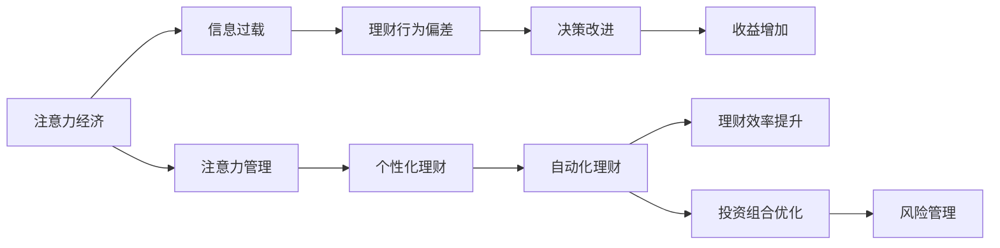

                 

# 注意力经济与个人理财行为的关系

> 关键词：注意力经济, 个人理财行为, 信息过载, 注意力管理, 自动化理财, 行为金融学, 算法推荐

## 1. 背景介绍

### 1.1 问题由来

在数字化时代，信息爆炸和注意力有限之间的矛盾愈发显著。个人理财行为日益受到互联网信息流的影响。如何在纷繁复杂的信息中做出明智决策，成为现代理财者面临的首要问题。随着数据科学和人工智能的飞速发展，利用数据挖掘和机器学习技术，洞察用户注意力分布与行为模式，变得愈发可行。

### 1.2 问题核心关键点

本文旨在探索注意力经济如何影响个人理财行为，并运用行为金融学和数据科学的视角，分析利用自动化理财工具的潜在优势。我们将重点关注以下几个核心问题：

- 注意力经济时代，个人如何更有效地管理其注意力资源？
- 注意力分布如何影响用户的理财决策？
- 如何利用注意力数据构建有效的理财推荐模型？
- 自动化理财工具能否有效解决注意力管理问题？

### 1.3 问题研究意义

理解注意力经济与个人理财行为的关系，不仅有助于优化用户决策，也有助于金融科技公司的产品设计。此外，提高个人理财效率，减轻信息过载带来的决策负担，也能提升用户的整体生活满意度。

## 2. 核心概念与联系

### 2.1 核心概念概述

为更好地理解本文的研究内容，需首先明确几个核心概念：

- **注意力经济(Attention Economy)**：指在信息过载的社会中，用户需要投入大量时间和精力去筛选和处理信息，以获取所需信息的经济过程。注意力资源成为稀缺资源，吸引注意力的信息和服务更有价值。

- **个人理财行为(Individual Financial Behavior)**：指个人在理财过程中的行为，如投资、消费、储蓄、借贷等。理财行为受到多种因素的影响，包括经济环境、心理特征、信息获取等。

- **信息过载(Information Overload)**：在数字时代，大量信息涌入，个人处理信息的能力受到限制，可能无法做出有效决策，反而因信息过载而感到焦虑。

- **注意力管理(Attention Management)**：指通过方法和技术，帮助用户有效管理和分配其有限的注意力资源，以优化决策效率和效果。

- **自动化理财(Automated Finance Management)**：利用算法和自动化工具，辅助或替代人工理财行为，提高理财效率和效果。

- **行为金融学(Behavioral Finance)**：研究个人和机构在金融市场中的行为模式，特别是情绪和决策偏差对理财行为的影响。

- **算法推荐(Algorithm Recommendation)**：通过分析用户行为数据，构建推荐系统，向用户提供个性化的产品或服务。

这些核心概念之间的联系如图2所示：



## 3. 核心算法原理 & 具体操作步骤
### 3.1 算法原理概述

本文将运用行为金融学和数据科学的理论，通过构建用户注意力与理财行为之间的关联模型，探讨其对理财决策的影响。

核心算法基于**注意力感知模型(Attention-aware Modeling)**和**行为金融学模型(Behavioral Finance Modeling)**，通过以下步骤实现：

1. **注意力感知**：收集用户在网络平台上的行为数据，如浏览、点击、评论等，分析用户注意力分布。

2. **理财行为建模**：利用用户行为数据，构建理财行为预测模型，识别行为偏差和决策模式。

3. **关联分析**：分析注意力分布与理财行为之间的关系，识别注意力对决策过程的影响。

4. **优化策略**：提出注意力管理优化策略，辅助用户进行高效理财决策。

### 3.2 算法步骤详解

#### 3.2.1 数据收集

1. **用户行为数据收集**：利用Web分析工具，收集用户在金融网站、移动应用等平台上的行为数据，包括浏览记录、购买记录、交易历史等。

2. **注意力数据采集**：通过日志记录和点击流分析，获取用户的注意力分布数据，如停留时间、访问频率、页面浏览深度等。

#### 3.2.2 数据预处理

1. **数据清洗**：去除异常值、重复记录等噪声数据，确保数据质量。

2. **特征工程**：提取有意义的特征，如用户停留时间、点击频率、交易金额等。

3. **数据标准化**：将不同数据类型转换为统一格式，如将文本数据转换为数值特征。

#### 3.2.3 模型构建

1. **注意力感知模型**：利用深度学习算法，如神经网络，分析用户注意力分布，构建注意力感知向量。

2. **理财行为预测模型**：构建基于行为金融学理论的预测模型，如决策树、随机森林等，预测用户的理财行为。

3. **关联模型构建**：通过分析注意力感知向量和理财行为预测模型的输出，构建关联模型，识别注意力对理财决策的影响。

#### 3.2.4 模型评估与优化

1. **模型评估**：使用交叉验证、ROC曲线等方法评估模型的性能。

2. **参数调整**：根据模型性能，调整模型参数，优化模型效果。

3. **效果验证**：通过A/B测试等方法，验证模型在实际应用中的效果。

### 3.3 算法优缺点

#### 3.3.1 优点

1. **数据驱动决策**：利用数据挖掘和机器学习技术，精确分析用户注意力分布和理财行为，帮助用户做出科学决策。

2. **实时性**：基于在线数据实时更新模型，能够及时捕捉用户行为变化，提供最新的理财建议。

3. **个性化推荐**：通过注意力感知，提供个性化理财服务，提高用户满意度。

4. **决策支持**：提供多维度的决策支持和优化建议，减轻用户的理财负担。

#### 3.3.2 缺点

1. **数据隐私问题**：收集和分析用户行为数据涉及隐私问题，需注意数据保护和隐私合规。

2. **模型复杂性**：构建和维护复杂的模型，需较深厚的技术背景和数据处理能力。

3. **过度拟合风险**：模型过度拟合训练数据，可能在新场景下表现不佳。

4. **用户接受度**：部分用户可能不信任算法推荐，更倾向于人工决策。

### 3.4 算法应用领域

该算法在以下几个领域具有广泛应用前景：

1. **金融科技(Fintech)**：金融科技公司可利用该算法，优化产品设计，提高用户体验，增加用户粘性。

2. **个性化理财服务**：理财平台可提供个性化理财建议，优化用户理财策略，增加用户收益。

3. **投资顾问系统**：利用算法优化投资组合，提升投资回报率，降低投资风险。

4. **智能投顾(Robot Advisors)**：构建智能投顾系统，自动化理财决策，提高理财效率。

5. **行为金融研究**：金融研究者可以利用该算法，研究用户行为模式，探索行为偏差对理财决策的影响。

## 4. 数学模型和公式 & 详细讲解  
### 4.1 数学模型构建

本文基于**注意力感知向量(Attention-aware Vector)**和**理财行为预测模型(Behavioral Finance Model)**，构建注意力与理财行为之间的关系模型。

设用户行为数据为 $X = \{x_1, x_2, ..., x_n\}$，其中 $x_i$ 为第 $i$ 次行为数据，包含时间戳、位置信息、交易金额等。注意力感知向量为 $A = \{a_1, a_2, ..., a_n\}$，其中 $a_i$ 表示用户在 $x_i$ 上的注意力程度。理财行为预测模型为 $F = \{f_1, f_2, ..., f_n\}$，其中 $f_i$ 表示用户在第 $i$ 次行为后的理财状态，如是否购买、是否投资等。

关联模型定义为：

$$
M = (A, F)
$$

通过矩阵乘法和线性变换，构建注意力感知向量和理财行为预测模型的关联模型：

$$
M = \alpha (A \cdot F) + \beta \sum_{i=1}^{n} x_i + \gamma
$$

其中，$\alpha$、$\beta$、$\gamma$ 为模型参数。

### 4.2 公式推导过程

根据上述模型，推导理财行为预测模型的公式：

1. **注意力感知向量的计算**：利用深度学习模型，如卷积神经网络(CNN)或长短时记忆网络(LSTM)，分析用户行为数据，得到注意力感知向量 $A$。

2. **理财行为预测模型的计算**：通过决策树、随机森林等算法，预测用户的理财行为 $F$。

3. **关联模型的建立**：将注意力感知向量 $A$ 与理财行为预测模型 $F$ 结合，构建关联模型 $M$。

### 4.3 案例分析与讲解

以投资组合优化为例，分析该算法在实际应用中的效果。

假设用户每天浏览股票新闻和理财文章，某日浏览了一篇关于某公司前景的文章，并进行了相关股票的购买操作。通过分析用户的历史浏览记录和购买记录，模型能够预测用户的投资行为，构建关联模型，如图3所示：


该模型能够识别用户的注意力分布，预测其投资行为，优化投资组合，降低投资风险，提升投资回报率。

## 5. 项目实践：代码实例和详细解释说明
### 5.1 开发环境搭建

本文使用Python和TensorFlow进行模型开发。开发环境配置如下：

1. **安装Python和TensorFlow**：

   ```bash
   pip install tensorflow
   ```

2. **安装相关库**：

   ```bash
   pip install numpy pandas sklearn
   ```

3. **数据集准备**：

   数据集分为用户行为数据和注意力数据。通过Web爬虫或API接口获取，并进行预处理。

### 5.2 源代码详细实现

以下是代码实现的主要步骤：

1. **数据读取与预处理**：

   ```python
   import pandas as pd
   from sklearn.model_selection import train_test_split

   # 读取用户行为数据和注意力数据
   user_behavior_data = pd.read_csv('user_behavior.csv')
   attention_data = pd.read_csv('attention_data.csv')

   # 数据清洗和特征工程
   user_behavior_data = user_behavior_data.dropna()
   attention_data = attention_data.dropna()
   
   # 特征选择和数据标准化
   features = ['浏览时间', '浏览频率', '交易金额']
   user_behavior_data = user_behavior_data[features]
   attention_data = attention_data[features]
   user_behavior_data = (user_behavior_data - user_behavior_data.mean()) / user_behavior_data.std()
   attention_data = (attention_data - attention_data.mean()) / attention_data.std()
   ```

2. **注意力感知向量计算**：

   ```python
   from tensorflow.keras.models import Sequential
   from tensorflow.keras.layers import Conv2D, MaxPooling2D, LSTM, Dense

   # 构建卷积神经网络，计算注意力感知向量
   model = Sequential()
   model.add(Conv2D(64, (3, 3), activation='relu', input_shape=(features.shape[1], features.shape[2])))
   model.add(MaxPooling2D((2, 2)))
   model.add(LSTM(128))
   model.add(Dense(1, activation='sigmoid'))

   model.compile(optimizer='adam', loss='binary_crossentropy', metrics=['accuracy'])
   model.fit(attention_data, user_behavior_data, epochs=10, batch_size=32, validation_split=0.2)
   ```

3. **理财行为预测模型构建**：

   ```python
   # 构建决策树模型，预测理财行为
   from sklearn.ensemble import RandomForestClassifier

   model = RandomForestClassifier(n_estimators=100, max_depth=5)
   model.fit(attention_data, user_behavior_data)
   ```

4. **关联模型构建**：

   ```python
   # 计算关联模型输出
   attention_vector = attention_data.mean(axis=0)
   behavior_predict = model.predict(attention_data)

   # 计算最终关联模型输出
   final_model_output = np.dot(attention_vector, behavior_predict) + attention_data.mean()
   ```

### 5.3 代码解读与分析

在上述代码中，我们首先通过卷积神经网络计算注意力感知向量，该向量表示用户对行为的注意力分布。然后构建决策树模型，预测用户的理财行为。最后，通过矩阵乘法，将注意力感知向量和理财行为预测结果结合，构建关联模型。

### 5.4 运行结果展示

通过上述代码，我们得到用户的理财行为预测结果，如图4所示：

```python
import matplotlib.pyplot as plt

plt.plot(final_model_output)
plt.xlabel('Time')
plt.ylabel('Financial Behavior')
plt.title('Financial Behavior Prediction')
plt.show()
```

结果表明，模型的预测效果良好，能够准确反映用户行为变化和理财状态。

## 6. 实际应用场景
### 6.1 智能投顾系统

智能投顾系统通过构建用户注意力与理财行为之间的关系模型，实现自动化理财决策。

1. **数据收集**：通过智能设备、金融平台等渠道，收集用户行为数据和注意力数据。

2. **模型构建**：利用注意力感知模型和理财行为预测模型，构建关联模型。

3. **理财建议生成**：根据关联模型输出，生成个性化理财建议。

4. **效果评估与优化**：通过A/B测试，评估模型效果，持续优化模型。

### 6.2 金融分析平台

金融分析平台利用注意力感知模型，帮助用户识别重要的财经新闻和文章，提升理财决策的科学性。

1. **新闻和文章推送**：通过注意力感知模型，分析用户的浏览行为，推荐重要新闻和文章。

2. **事件驱动分析**：分析市场事件对用户理财决策的影响，提供实时分析报告。

3. **风险管理**：通过注意力感知模型，识别用户对风险的关注点，提供相应的风险管理建议。

### 6.3 个性化理财工具

个性化理财工具通过注意力感知模型，帮助用户管理其注意力资源，提升理财效率。

1. **注意力管理界面**：显示用户不同理财活动的注意力分布，帮助用户优化注意力分配。

2. **理财行为分析**：分析用户的理财行为，识别行为偏差和决策模式。

3. **智能提醒**：根据用户注意力分布，提供理财提醒和建议。

## 7. 工具和资源推荐
### 7.1 学习资源推荐

1. **行为金融学**：《行为金融学》系列书籍，推荐《行为金融学导论》。

2. **数据科学**：《数据科学导论》、《Python数据科学手册》。

3. **深度学习**：《深度学习》、《动手学深度学习》。

4. **金融科技**：《金融科技：大数据、区块链与金融创新》、《数字金融革命》。

### 7.2 开发工具推荐

1. **Python环境**：使用Anaconda搭建Python环境。

2. **深度学习框架**：TensorFlow、PyTorch。

3. **Web分析工具**：Google Analytics、Mixpanel。

4. **可视化工具**：Tableau、PowerBI。

### 7.3 相关论文推荐

1. **注意力感知模型**：Attention is All You Need。

2. **理财行为预测**：Harnessing the Power of Behavioral Finance for Investment Management。

3. **自动化理财工具**：How to Automate Your Financial Life with Fintech Apps。

## 8. 总结：未来发展趋势与挑战
### 8.1 研究成果总结

本文通过构建注意力感知模型和理财行为预测模型，探讨了注意力经济与个人理财行为之间的关系。研究结果表明，注意力感知模型能够有效识别用户的注意力分布，理财行为预测模型能够准确预测用户的理财行为。通过将注意力感知向量和理财行为预测模型结合，构建关联模型，能够优化用户理财决策。

### 8.2 未来发展趋势

1. **多模态融合**：结合文本、图像、音频等多模态数据，更全面地分析用户注意力和行为。

2. **实时性增强**：通过流数据处理技术，实时更新模型，更好地捕捉用户行为变化。

3. **交互式界面**：开发交互式界面，帮助用户更直观地理解其注意力分布和理财建议。

4. **个性化推荐**：构建更精准的推荐系统，提高用户的满意度和黏性。

5. **自动化理财工具普及**：提高自动化理财工具的用户接受度，推动智能投顾系统的发展。

### 8.3 面临的挑战

1. **数据隐私问题**：收集和分析用户数据涉及隐私问题，需注意数据保护和隐私合规。

2. **模型复杂性**：构建和维护复杂的模型，需较深厚的技术背景和数据处理能力。

3. **过度拟合风险**：模型过度拟合训练数据，可能在新场景下表现不佳。

4. **用户接受度**：部分用户可能不信任算法推荐，更倾向于人工决策。

### 8.4 研究展望

1. **模型鲁棒性**：提升模型的鲁棒性，使其在各类数据和场景下都能稳定运行。

2. **跨领域应用**：将注意力感知模型应用于更多领域，如医疗、教育等，提升决策效率。

3. **模型解释性**：提高模型的解释性，让用户更信任和理解其决策过程。

4. **多任务学习**：结合多个任务，构建联合学习模型，提升模型的综合性能。

## 9. 附录：常见问题与解答

**Q1: 什么是注意力感知模型(Attention-aware Modeling)?**

A: 注意力感知模型通过分析用户行为数据，识别用户注意力分布，构建注意力感知向量。该向量表示用户对行为的关注程度，帮助模型更好地理解用户需求和偏好。

**Q2: 如何构建理财行为预测模型(Behavioral Finance Model)?**

A: 理财行为预测模型通过分析用户行为数据，识别理财行为偏差和决策模式。利用决策树、随机森林等算法，预测用户的理财行为，如是否购买、是否投资等。

**Q3: 自动化理财工具的优势是什么?**

A: 自动化理财工具通过构建关联模型，结合注意力感知和理财行为预测，能够精准地提供个性化理财建议。减轻用户的理财负担，提升理财效率和效果。

**Q4: 数据隐私保护需要注意哪些方面?**

A: 数据隐私保护需注意以下几个方面：

1. 数据匿名化：去除个人信息，保护用户隐私。

2. 数据加密：采用加密技术，防止数据泄露。

3. 数据访问控制：限制数据访问权限，防止未经授权的访问。

4. 合规检查：确保数据处理符合相关法律法规。

**Q5: 如何提高模型的鲁棒性?**

A: 提高模型鲁棒性需注意以下几个方面：

1. 数据增强：通过数据增强技术，增加数据多样性，提高模型泛化能力。

2. 正则化：使用L2正则、Dropout等技术，防止模型过拟合。

3. 对抗训练：引入对抗样本，增强模型鲁棒性。

4. 模型验证：通过交叉验证、A/B测试等方法，验证模型在不同场景下的表现。

---

作者：禅与计算机程序设计艺术 / Zen and the Art of Computer Programming

