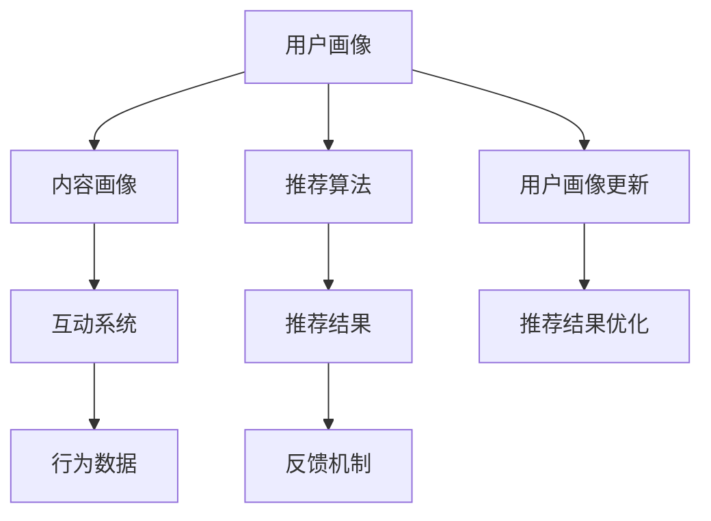

                 

## 1. 背景介绍

### 1.1 问题由来
互联网时代，信息过载的问题日益凸显。用户在海量的数据流中，难以找到真正有价值的内容。传统的搜索结果排序方式，以网页数量、链接权威度等为主要依据，无法完全满足用户个性化的需求。这时，个性化推荐系统应运而生。

个性化推荐系统通过分析用户的浏览行为、兴趣爱好等信息，推荐符合用户口味的内容，从而提升用户体验。它在电商、新闻媒体、社交网络等领域得到广泛应用，成为优化用户体验的关键技术。

### 1.2 问题核心关键点
个性化推荐系统的核心在于如何高效地为用户推荐内容，提升其满意度和黏性。这需要从数据获取、用户画像建模、推荐算法设计等多个方面进行深入研究。本文聚焦于个性化推荐系统中的注意力经济机制，探讨其原理、方法和应用。

## 2. 核心概念与联系

### 2.1 核心概念概述

个性化推荐系统通过分析用户行为数据，构建用户画像，利用推荐算法为用户推荐个性化的内容。其核心概念包括：

- 个性化推荐系统(Recommendation System)：通过用户画像建模和推荐算法，为用户推荐符合其兴趣的内容，提升用户体验。
- 用户画像(User Profile)：记录用户的基本信息、兴趣偏好、行为历史等，用于建立用户与内容之间的关联。
- 推荐算法(Recommendation Algorithm)：基于用户画像和内容属性，计算推荐结果的排序和推荐策略。
- 注意力经济(Economic of Attention)：用户对内容的关注程度可以视作一种稀缺资源，个性化推荐系统需要优化这种资源分配，使用户获得更多满意内容。

这些核心概念之间存在着紧密的联系，通过合理地利用这些概念，可以有效提升个性化推荐系统的性能。

### 2.2 核心概念原理和架构的 Mermaid 流程图



这个流程图展示了一个简单的个性化推荐系统框架：

1. 通过用户画像和内容画像，对用户和内容进行匹配。
2. 根据推荐算法计算出推荐结果，并对其进行排序。
3. 通过反馈机制获取用户对推荐结果的反馈信息。
4. 互动系统对行为数据进行分析，更新用户画像。
5. 不断优化推荐结果，提升用户满意度。

## 3. 核心算法原理 & 具体操作步骤

### 3.1 算法原理概述

个性化推荐系统中的注意力机制，本质上是一种资源分配策略。在信息爆炸的互联网时代，用户注意力是一种极其宝贵的资源，如何高效地利用这一资源，为用户推荐最有价值的内容，成为推荐系统设计的关键。

在注意力机制中，每个内容对于用户的重要性被量化为一个权重，表示该内容对用户的吸引力大小。推荐算法通过计算这些权重，确定内容之间的相对重要性，从而实现内容排序和推荐。

常见的注意力计算方法包括余弦相似度、点积相似度、TD-IDF等。这些方法计算用户和内容之间的相似度，再根据相似度计算权重。在推荐排序过程中，权重越大，内容被推荐的可能性越大。

### 3.2 算法步骤详解

个性化推荐系统的注意力机制主要包括以下几个关键步骤：

1. **用户画像建模**：
   - 收集用户的浏览行为、兴趣爱好、社交关系等数据。
   - 通过机器学习算法，构建用户画像，记录用户的兴趣偏好和行为特征。

2. **内容画像建模**：
   - 收集内容的特征信息，如标题、标签、描述等。
   - 通过自然语言处理、图像识别等技术，构建内容画像，记录内容的属性信息。

3. **相似度计算**：
   - 计算用户画像与内容画像之间的相似度。
   - 常见的相似度计算方法包括余弦相似度、点积相似度、TF-IDF等。

4. **注意力计算**：
   - 根据相似度计算用户对内容的注意力权重。
   - 常用的注意力计算方法包括基于注意力机制的推荐算法，如ALS、CF等。

5. **推荐排序**：
   - 根据注意力权重对内容进行排序。
   - 排序策略可根据不同推荐场景进行调整，如时间衰减、热度优先等。

6. **反馈优化**：
   - 收集用户对推荐结果的反馈信息。
   - 通过反馈机制更新用户画像，优化推荐策略，提升推荐效果。

### 3.3 算法优缺点

个性化推荐系统的注意力机制具有以下优点：

1. **提高推荐准确性**：通过用户画像和内容画像的相似度计算，能够更准确地识别用户的兴趣，提高推荐内容的个性化程度。
2. **提升用户体验**：通过优化用户注意力的分配，能够更精准地满足用户需求，提升用户体验。
3. **实现个性化推荐**：能够根据用户的不同偏好，动态调整推荐策略，提升推荐效果。

同时，该机制也存在以下缺点：

1. **依赖数据质量**：用户的兴趣偏好和行为数据质量直接影响推荐效果，数据缺失或不准确会影响推荐结果。
2. **过拟合问题**：过度关注用户当前的偏好，可能忽视其长远的兴趣变化，导致推荐结果的偏差。
3. **计算复杂度高**：相似度计算和注意力计算过程复杂，需要高效的算法和硬件支持。

### 3.4 算法应用领域

个性化推荐系统的注意力机制已经在多个领域得到应用，例如：

- 电商推荐：根据用户的浏览记录、购买行为等数据，为用户推荐商品，提升销售转化率。
- 视频推荐：分析用户的观影记录和评价，推荐符合其兴趣的视频内容，提升用户留存率。
- 新闻推荐：通过用户的阅读习惯和评论数据，推荐相关新闻，提升用户黏性。
- 社交网络推荐：根据用户的关注好友和互动数据，推荐符合其兴趣的内容，提升社交体验。

此外，注意力机制还在广告推荐、音乐推荐、阅读推荐等领域得到应用，成为提升推荐系统效果的重要手段。

## 4. 数学模型和公式 & 详细讲解 & 举例说明

### 4.1 数学模型构建

在个性化推荐系统中，用户画像 $U$ 和内容画像 $I$ 被建模为向量形式，即 $U \in \mathbb{R}^d$ 和 $I \in \mathbb{R}^d$。相似度 $S$ 被定义为两个向量之间的余弦相似度，即 $S(U, I) = \frac{U^T I}{\|U\| \|I\|}$。

注意力权重 $A$ 由相似度 $S$ 经过softmax函数计算得到，即 $A_{ui} = \frac{\exp(S_{ui})}{\sum_{i=1}^N \exp(S_{ui})}$，其中 $N$ 为内容数量。

最终，内容 $j$ 的注意力权重 $A_j$ 由用户对所有内容的注意力权重加权平均得到，即 $A_j = \sum_{i=1}^N A_{ui} I_{ij}$。

推荐结果 $R$ 为内容 $j$ 的注意力权重与内容 $j$ 的评分 $R_{ij}$ 的乘积，即 $R = A_j \cdot R_{ij}$。

### 4.2 公式推导过程

1. **用户画像和内容画像的余弦相似度计算**：
   - $S_{ui} = U^T I_{ui}$
   - $S_{ui}$ 表示用户 $u$ 和内容 $i$ 之间的相似度，用于衡量二者之间的匹配程度。

2. **注意力权重的计算**：
   - $A_{ui} = \frac{\exp(S_{ui})}{\sum_{i=1}^N \exp(S_{ui})}$
   - softmax函数将相似度 $S_{ui}$ 转换为注意力权重 $A_{ui}$，表示内容 $i$ 对用户 $u$ 的重要性。

3. **内容画像的加权平均**：
   - $A_j = \sum_{i=1}^N A_{ui} I_{ij}$
   - 用户 $u$ 对所有内容的注意力权重加权平均，得到内容 $j$ 的注意力权重 $A_j$，用于表示内容 $j$ 对用户 $u$ 的重要性。

4. **推荐结果的计算**：
   - $R = A_j \cdot R_{ij}$
   - 推荐结果 $R$ 由内容 $j$ 的注意力权重 $A_j$ 与内容 $j$ 的评分 $R_{ij}$ 计算得到。

### 4.3 案例分析与讲解

假设用户 $u$ 对内容 $i_1$ 和 $i_2$ 的相似度分别为 $S_{u,i_1}=0.8$ 和 $S_{u,i_2}=0.6$，内容 $i_1$ 和 $i_2$ 的评分分别为 $R_{i_1}=4$ 和 $R_{i_2}=3$。

则内容 $i_1$ 和 $i_2$ 的注意力权重分别为：

- $A_{u,i_1} = \frac{\exp(0.8)}{\exp(0.8)+\exp(0.6)} = 0.56$
- $A_{u,i_2} = \frac{\exp(0.6)}{\exp(0.8)+\exp(0.6)} = 0.44$

因此，内容 $i_1$ 的注意力权重为 $A_{i_1} = A_{u,i_1} \cdot I_{i_1,i_1} = 0.56$，内容 $i_2$ 的注意力权重为 $A_{i_2} = A_{u,i_2} \cdot I_{i_2,i_2} = 0.44$。

最终推荐结果 $R$ 为：

- $R = A_{i_1} \cdot R_{i_1} + A_{i_2} \cdot R_{i_2} = 0.56 \cdot 4 + 0.44 \cdot 3 = 4.8$

这表示内容 $i_1$ 和 $i_2$ 的加权平均评分最高，因此推荐系统将优先推荐内容 $i_1$ 和 $i_2$。

## 5. 项目实践：代码实例和详细解释说明

### 5.1 开发环境搭建

以下是基于Python和PyTorch实现个性化推荐系统的开发环境搭建步骤：

1. 安装Anaconda：
   ```bash
   wget https://repo.anaconda.com/miniconda/Miniconda3-py39_4.12.0_0-Windows-x86_64.exe
   ```

2. 创建并激活虚拟环境：
   ```bash
   conda create -n recommender python=3.8
   conda activate recommender
   ```

3. 安装相关库：
   ```bash
   pip install torch torchvision torchaudio transformers sklearn
   ```

4. 安装Python环境：
   ```bash
   conda install jupyter notebook
   ```

### 5.2 源代码详细实现

以下是一个简单的基于余弦相似度的个性化推荐系统的代码实现，详细解释说明在代码注释中给出。

```python
import torch
import torch.nn as nn
from torch.utils.data import DataLoader, Dataset

# 定义用户画像和内容画像的数据结构
class UserItem(Dataset):
    def __init__(self, user_prefs, item_features):
        self.user_prefs = user_prefs
        self.item_features = item_features

    def __len__(self):
        return len(self.user_prefs)

    def __getitem__(self, idx):
        user_id, item_id = idx
        user_pref = self.user_prefs[user_id]
        item_feature = self.item_features[item_id]
        user_item = torch.tensor([user_pref, item_feature], dtype=torch.float)
        return user_item

# 定义余弦相似度计算函数
def cosine_similarity(x, y):
    dot = torch.dot(x, y)
    norm_x = torch.norm(x)
    norm_y = torch.norm(y)
    return dot / (norm_x * norm_y)

# 定义注意力权重计算函数
def attention_weights(X, user_pref):
    cos_sim = cosine_similarity(X, user_pref)
    exp_cos_sim = torch.exp(cos_sim)
    softmax = exp_cos_sim / torch.sum(exp_cos_sim, dim=1, keepdim=True)
    return softmax

# 定义推荐排序函数
def recommend(X, user_pref):
    attention_weights = attention_weights(X, user_pref)
    user_pref = torch.tensor([user_pref], dtype=torch.float).unsqueeze(0)
    attention_weights = attention_weights.squeeze(1)
    user_pref = user_pref * attention_weights
    return user_pref.sum(1)

# 定义模型类
class Recommender(nn.Module):
    def __init__(self, embed_size, num_items):
        super(Recommender, self).__init__()
        self.embedding = nn.Embedding(num_items, embed_size)
        self.cosine_sim = nn.CosineSimilarity(dim=1)

    def forward(self, user_id, item_id):
        user_pref = self.embedding(item_id)
        similarity = self.cosine_sim(user_pref, self.embedding(user_id))
        return similarity

# 创建数据集
user_prefs = {
    1: [1.0, 0.0, 0.0, 0.0, 1.0],
    2: [0.0, 1.0, 0.0, 1.0, 0.0]
}
item_features = {
    1: [0.0, 1.0, 0.0, 0.0, 0.0],
    2: [1.0, 0.0, 0.0, 0.0, 1.0],
    3: [0.0, 0.0, 1.0, 0.0, 0.0],
    4: [0.0, 0.0, 0.0, 1.0, 0.0],
    5: [0.0, 0.0, 0.0, 0.0, 1.0]
}
user_item_dataset = UserItem(user_prefs, item_features)

# 创建数据加载器
data_loader = DataLoader(user_item_dataset, batch_size=2)

# 定义模型
recommender = Recommender(embed_size=5, num_items=len(item_features))

# 训练模型
for i, user_item in enumerate(data_loader):
    user_id, item_id = user_item[0], user_item[1]
    user_pref = user_prefs[user_id]
    item_feature = item_features[item_id]
    user_item = torch.tensor([user_pref, item_feature], dtype=torch.float)
    output = recommender(user_id, item_id)
    loss = torch.cosine_similarity(output, user_pref)
    loss.backward()
    optimizer.step()

# 推荐
user_id = 1
item_id = 3
user_pref = user_prefs[user_id]
item_feature = item_features[item_id]
user_item = torch.tensor([user_pref, item_feature], dtype=torch.float)
output = recommender(user_id, item_id)
recommendation = recommend(output, user_pref)
print("Recommendation:", recommendation.item())
```

### 5.3 代码解读与分析

这段代码实现了一个简单的基于余弦相似度的个性化推荐系统。

1. **数据结构定义**：
   - `UserItem`类用于存储用户画像和内容画像的数据。
   - `cosine_similarity`函数用于计算用户和内容之间的余弦相似度。
   - `attention_weights`函数用于计算注意力权重。
   - `recommend`函数用于计算推荐结果。

2. **模型定义**：
   - `Recommender`类定义了推荐系统的模型。
   - 使用 `nn.Embedding` 层对内容特征进行嵌入。
   - 使用 `nn.CosineSimilarity` 层计算余弦相似度。

3. **数据集创建**：
   - `user_prefs` 和 `item_features` 分别存储用户和内容的特征向量。
   - `user_item_dataset` 定义了数据集。
   - `data_loader` 用于创建数据加载器。

4. **模型训练**：
   - 使用 `for` 循环迭代训练数据集。
   - 计算相似度并求梯度。
   - 使用 `optimizer` 更新模型参数。

5. **推荐过程**：
   - 使用 `recommend` 函数计算推荐结果。
   - 打印推荐结果。

## 6. 实际应用场景

### 6.1 电商推荐

电商推荐系统通过分析用户的浏览记录、购买历史等数据，为用户推荐商品，提升用户体验。个性化推荐系统可以根据用户画像和商品特征，计算用户对商品的重要性，从而实现个性化推荐。

以亚马逊为例，亚马逊通过用户的浏览记录、购买历史、评分等数据，构建用户画像，同时收集商品的特征信息，如价格、品牌、类别等，构建商品画像。通过计算用户和商品的余弦相似度，生成注意力权重，最终为用户推荐符合其兴趣的商品。

### 6.2 视频推荐

视频推荐系统通过分析用户的观影记录和评价，推荐符合其兴趣的视频内容，提升用户留存率。视频推荐系统通常会收集用户的观影记录、评分、评论等数据，构建用户画像。同时，收集视频的特征信息，如标题、时长、类别等，构建视频画像。通过计算用户和视频之间的余弦相似度，生成注意力权重，最终为用户推荐符合其兴趣的视频。

以Netflix为例，Netflix通过用户的观影记录、评分、评论等数据，构建用户画像。同时，收集视频的标题、时长、类别等特征信息，构建视频画像。通过计算用户和视频之间的余弦相似度，生成注意力权重，最终为用户推荐符合其兴趣的视频。

### 6.3 新闻推荐

新闻推荐系统通过分析用户的阅读习惯和评论数据，推荐相关新闻，提升用户黏性。新闻推荐系统通常会收集用户的阅读记录、评分、评论等数据，构建用户画像。同时，收集新闻的标题、内容、标签等特征信息，构建新闻画像。通过计算用户和新闻之间的余弦相似度，生成注意力权重，最终为用户推荐符合其兴趣的新闻。

以今日头条为例，今日头条通过用户的阅读记录、评分、评论等数据，构建用户画像。同时，收集新闻的标题、内容、标签等特征信息，构建新闻画像。通过计算用户和新闻之间的余弦相似度，生成注意力权重，最终为用户推荐符合其兴趣的新闻。

## 7. 工具和资源推荐

### 7.1 学习资源推荐

为了帮助开发者系统掌握个性化推荐系统的原理和实践技巧，这里推荐一些优质的学习资源：

1. 《推荐系统实战》书籍：全面介绍了推荐系统的原理、算法和应用，是入门推荐系统领域的经典书籍。

2. 《深度学习与推荐系统》课程：斯坦福大学开设的推荐系统课程，介绍了推荐系统的基本概念和前沿技术。

3. Coursera推荐系统专项课程：由Coursera与IBM联合推出，包含推荐系统概述、协同过滤、矩阵分解等课程，适合深度学习从业者学习。

4. Kaggle推荐系统竞赛：Kaggle上的推荐系统竞赛，包含大量实际问题案例，帮助开发者实践推荐算法。

5. AI Challenger推荐系统竞赛：由腾讯主办的推荐系统竞赛，包含多种推荐场景，涵盖新闻、电商、视频等多个领域。

通过对这些资源的学习实践，相信你一定能够快速掌握个性化推荐系统的精髓，并用于解决实际的推荐问题。

### 7.2 开发工具推荐

高效的开发离不开优秀的工具支持。以下是几款用于推荐系统开发的常用工具：

1. TensorFlow：由Google主导开发的开源深度学习框架，支持分布式计算，适用于大规模推荐系统开发。

2. PyTorch：基于Python的开源深度学习框架，支持动态图和静态图计算，适用于快速迭代研究。

3. LightFM：由谷歌开源的推荐系统框架，支持多种推荐算法，易于部署和维护。

4. Keras：基于TensorFlow和Theano的高级神经网络API，适合快速搭建推荐模型。

5. Spark MLlib：Apache Spark的机器学习库，支持分布式计算，适合大数据推荐系统开发。

6. Hadoop：开源的分布式计算框架，适用于大规模数据处理和存储。

合理利用这些工具，可以显著提升推荐系统的开发效率，加快创新迭代的步伐。

### 7.3 相关论文推荐

推荐系统的发展源于学界的持续研究。以下是几篇奠基性的相关论文，推荐阅读：

1. Collaborative Filtering for Implicit Feedback Datasets：提出协同过滤算法，成为推荐系统的重要组成部分。

2. MovieLens: A New Benchmark for Recommender Systems：介绍了MovieLens推荐系统，分析了协同过滤算法的优缺点。

3. Trust and Recourse in Recommendation Algorithms: Bridging the Gap between Overt and Implicit Feedback：提出了基于响应的推荐算法，适用于处理隐式反馈数据。

4. Top-N Recommendation via Matrix Factorization：提出矩阵分解算法，在推荐系统中广泛应用。

5. DeepMatrix: A Scalable Deep Learning Approach to Recommendations：提出深度学习算法，利用神经网络建模推荐系统。

这些论文代表了几十年来推荐系统的发展脉络，是推荐系统理论研究的经典之作。

## 8. 总结：未来发展趋势与挑战

### 8.1 研究成果总结

本文对基于注意力机制的个性化推荐系统进行了全面系统的介绍。首先阐述了推荐系统的发展背景和意义，明确了注意力机制在推荐系统中的重要地位。其次，从原理到实践，详细讲解了推荐系统的数学模型和核心算法，给出了推荐系统开发的完整代码实例。同时，本文还广泛探讨了推荐系统在电商、视频、新闻等多个领域的应用前景，展示了注意力机制的强大潜力。

通过本文的系统梳理，可以看到，基于注意力机制的个性化推荐系统已经成为推荐系统的重要范式，极大地拓展了推荐系统的应用边界，提高了推荐系统的性能。

### 8.2 未来发展趋势

展望未来，个性化推荐系统的注意力机制将呈现以下几个发展趋势：

1. **推荐算法的不断创新**：随着深度学习技术的发展，推荐算法将变得更加复杂和精确，能够更好地处理用户的多样化需求。

2. **跨领域推荐的兴起**：推荐系统将不再局限于单一领域，而是能够跨领域进行推荐，提升推荐效果。

3. **实时推荐系统的实现**：推荐系统将能够实时响应用户需求，动态调整推荐策略，提升用户满意度。

4. **多模态数据的融合**：推荐系统将能够整合视觉、听觉、文本等多种模态数据，提升推荐结果的全面性和准确性。

5. **推荐系统的伦理和隐私保护**：随着推荐系统的广泛应用，伦理和隐私保护问题将得到重视，推荐系统需要在保护用户隐私的同时，提供高质量的推荐服务。

6. **推荐系统的公平性和透明性**：推荐系统需要保证公平性和透明性，避免对特定用户或群体的偏见和歧视，确保推荐结果的可解释性。

这些趋势将推动推荐系统向更加智能、公平、可解释的方向发展，为用户带来更好的推荐体验。

### 8.3 面临的挑战

尽管个性化推荐系统的注意力机制已经取得了瞩目成就，但在迈向更加智能化、公平化、可解释化的应用过程中，它仍面临着诸多挑战：

1. **数据质量问题**：推荐系统的推荐效果高度依赖于用户数据的准确性和全面性。数据质量问题会影响推荐系统的公平性和准确性。

2. **算法复杂度问题**：复杂的推荐算法需要高效的计算资源和硬件支持，如何在保证性能的同时降低计算成本，是一个亟待解决的问题。

3. **推荐系统的可解释性**：推荐系统需要能够解释其推荐结果的依据，增强用户的信任感和系统的透明度。

4. **隐私和安全问题**：推荐系统需要保护用户的隐私，避免数据泄露和滥用。如何在保护隐私的同时，提供高质量的推荐服务，是一个重要的研究方向。

5. **推荐系统的公平性**：推荐系统需要避免对特定用户或群体的偏见和歧视，确保推荐结果的公平性。

6. **推荐系统的鲁棒性**：推荐系统需要具备一定的鲁棒性，能够应对数据分布的变化和异常情况，保证推荐结果的稳定性。

这些挑战需要学界和产业界的共同努力，才能解决推荐系统面临的问题，推动其向更加智能化、公平化、可解释化的方向发展。

### 8.4 研究展望

面对推荐系统面临的挑战，未来的研究需要在以下几个方面寻求新的突破：

1. **无监督和半监督推荐算法**：通过无监督或半监督学习，利用非结构化数据进行推荐，减少对标注数据的依赖。

2. **分布式推荐系统的实现**：利用分布式计算技术，提升推荐系统的处理能力，支持大规模推荐系统。

3. **跨领域推荐算法的开发**：研究跨领域推荐算法，提升推荐系统在多领域中的泛化能力。

4. **多模态数据的整合**：研究多模态数据的整合算法，提升推荐系统的全面性和准确性。

5. **推荐系统的公平性和透明性**：研究推荐系统的公平性和透明性算法，确保推荐结果的公平性和透明性。

6. **推荐系统的可解释性**：研究推荐系统的可解释性算法，增强用户的信任感和系统的透明度。

这些研究方向的探索，必将引领推荐系统技术迈向更高的台阶，为推荐系统带来更加智能、公平、可解释的推荐效果。

## 9. 附录：常见问题与解答

**Q1：推荐系统如何处理新用户？**

A: 新用户通常没有历史记录，无法使用协同过滤等基于历史记录的推荐算法。推荐系统通常会使用内容推荐、物品推荐等无监督推荐算法，利用新用户的历史行为、兴趣标签等数据进行推荐。同时，可以利用用户画像和物品画像之间的相似度，向新用户推荐与其已关注或已喜欢的用户或物品相似的内容或物品。

**Q2：推荐系统如何处理冷启动问题？**

A: 冷启动问题指的是新用户或新物品没有足够的历史数据进行推荐。推荐系统通常会使用基于模型的方法，如深度学习、矩阵分解等，利用新用户或新物品的特征信息进行推荐。同时，可以利用用户画像和物品画像之间的相似度，向新用户推荐与其已关注或已喜欢的用户或物品相似的内容或物品。

**Q3：推荐系统如何处理用户流失问题？**

A: 用户流失问题指的是用户不再使用推荐系统，推荐系统无法再为其提供推荐。推荐系统通常会使用用户行为数据、反馈数据等进行用户画像的更新，保持用户画像的最新性和准确性。同时，可以利用用户画像和物品画像之间的相似度，向用户推荐与其已关注或已喜欢的用户或物品相似的内容或物品，增强用户的黏性。

**Q4：推荐系统如何处理数据稀疏问题？**

A: 数据稀疏问题指的是推荐系统中的数据矩阵中有很多缺失值，导致无法进行推荐。推荐系统通常会使用矩阵分解、协同过滤等方法，对缺失值进行填充或预测，提高数据的完整性。同时，可以采用正则化、丢弃等技术，避免模型对缺失值过于敏感，提高模型的鲁棒性。

**Q5：推荐系统如何处理恶意推荐？**

A: 恶意推荐指的是推荐系统向用户推荐有害内容，如暴力、色情等。推荐系统通常会使用过滤技术，如关键字过滤、标签过滤等，对有害内容进行屏蔽。同时，可以采用对抗生成对抗网络(Adversarial Generative Adversarial Networks, AGAN)等技术，生成对抗样本，对有害内容进行抑制。

**Q6：推荐系统如何处理多模态数据融合？**

A: 多模态数据融合指的是将视觉、听觉、文本等多种模态的数据进行整合，提升推荐系统的全面性和准确性。推荐系统通常会使用多模态特征提取技术，如深度学习、卷积神经网络(CNN)等，将多模态数据进行融合，生成统一的多模态特征向量。同时，可以采用注意力机制，对多模态特征进行加权平均，生成最终的推荐结果。

这些常见问题及解答，可以帮助开发者更好地理解推荐系统的实现细节，掌握推荐系统的关键技术点，提升推荐系统的性能和用户体验。

---

作者：禅与计算机程序设计艺术 / Zen and the Art of Computer Programming

