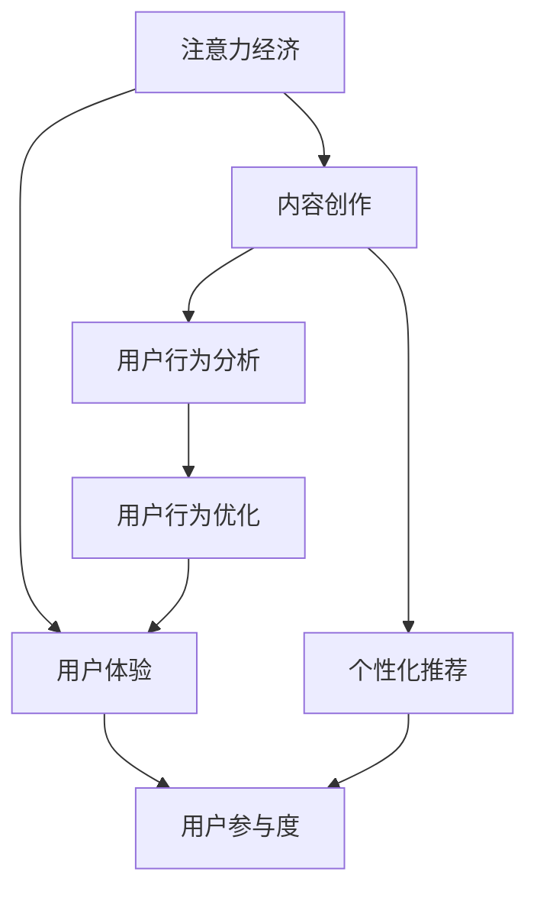

                 

# 注意力经济与内容创作最佳实践：吸引并留住受众的参与

> 关键词：注意力经济,内容创作,用户体验,参与度提升,用户行为分析,个性化推荐

## 1. 背景介绍

### 1.1 问题由来

在互联网高速发展的今天，注意力经济逐渐成为各领域竞相追逐的焦点。内容创作者、企业、平台都在想尽办法争夺用户的注意力，希望通过内容创造价值。然而，用户注意力是有限的，如何在众多内容中脱颖而出，并吸引用户长期关注，是一个极具挑战性的问题。

内容创作已经成为各领域竞争的核心。无论是新闻媒体、娱乐产业、还是电商、教育等行业，内容都是核心竞争力。吸引用户参与并留住他们的注意力，是内容创作的目标，也是提升平台价值的关键。

### 1.2 问题核心关键点

- 用户注意力如何有效分配。
- 内容创作如何触动用户情感。
- 用户体验如何优化以增加参与度。
- 用户行为如何分析和预测。
- 个性化推荐如何实现以提升用户满意度。

### 1.3 问题研究意义

研究注意力经济和内容创作的最佳实践，对于提升各行业内容平台的价值，有着重要的意义：

1. 增加用户参与度和粘性。内容创作者和平台通过提升内容质量，使用户更愿意参与互动。
2. 优化用户体验。改善用户体验，使用户能够更好地享受内容。
3. 提升用户满意度。通过精准的个性化推荐，满足用户个性化需求，增加满意度。
4. 增强平台竞争力。高质量的内容和用户参与度能够显著提升平台的用户吸引力和市场竞争力。

## 2. 核心概念与联系

### 2.1 核心概念概述

为更好地理解注意力经济和内容创作的最佳实践，本节将介绍几个密切相关的核心概念：

- 注意力经济：在信息过载的时代，吸引用户注意力并使之参与的经济模式。核心在于如何有效分配和利用用户注意力。
- 内容创作：创作高质量内容，使用户能够获得价值并产生互动。核心在于如何触动用户情感和增强体验。
- 用户体验：用户对内容平台的整体感受和使用体验。优化用户体验是吸引用户参与和留存的关键。
- 用户参与度：用户与内容平台互动的频率和深度。提高参与度是内容创作者和平台的目标。
- 个性化推荐：通过用户行为数据，推荐用户感兴趣的内容，提升用户满意度。是提高参与度的重要手段。
- 用户行为分析：通过数据分析和机器学习，理解用户行为和需求，优化内容创作和推荐策略。

这些核心概念之间的逻辑关系可以通过以下Mermaid流程图来展示：



这个流程图展示了几大核心概念之间的关系：

1. 注意力经济驱动内容创作和用户体验优化。
2. 内容创作和用户体验提升用户参与度。
3. 个性化推荐和用户行为分析进一步优化用户参与度。

## 3. 核心算法原理 & 具体操作步骤

### 3.1 算法原理概述

注意力经济和内容创作的最佳实践，本质上是通过数据分析、内容优化和算法推荐，提升用户参与度。其核心在于：

- 利用用户行为数据，分析用户兴趣和需求。
- 优化内容创作，提升内容质量。
- 设计个性化的推荐策略，精准推荐用户感兴趣的内容。

形式化地，假设用户行为数据为 $D=\{(x_i,y_i)\}_{i=1}^N$，其中 $x_i$ 为行为特征向量，$y_i$ 为行为标签。内容创作的优化目标是最小化用户流失率，即找到最优内容创作策略 $C$：

$$
\min_{C} \mathbb{E}[L_{y}(C)]
$$

其中 $L_{y}(C)$ 为根据内容 $C$ 预测用户行为 $y$ 的损失函数，通常使用交叉熵损失函数。

### 3.2 算法步骤详解

基于注意力经济和内容创作的最佳实践，一般包括以下几个关键步骤：

**Step 1: 数据采集与预处理**

- 收集用户行为数据，包括点击、浏览、点赞、评论、分享等行为。
- 对数据进行预处理，去除异常值和噪声，进行归一化处理。
- 对行为数据进行特征工程，提取和构建关键特征。

**Step 2: 用户行为分析**

- 利用机器学习算法（如决策树、随机森林、神经网络等），分析用户行为模式和兴趣。
- 通过聚类算法（如K-means、层次聚类等），对用户进行分组，识别不同兴趣群体的特征。
- 使用关联规则挖掘算法（如Apriori、FP-growth等），发现用户行为中的潜在关联。

**Step 3: 内容创作优化**

- 利用自然语言处理（NLP）技术，分析用户反馈和评论，了解用户对内容的喜好和偏好。
- 通过情感分析，识别用户情感倾向，优化内容创作方向。
- 利用图像处理技术，提升视频、图片等视觉内容的质量。

**Step 4: 个性化推荐**

- 构建用户画像，使用向量表示用户兴趣和行为特征。
- 设计推荐算法（如协同过滤、基于内容的推荐、混合推荐等），根据用户画像进行内容推荐。
- 引入召回策略，保证推荐多样性，防止用户厌倦。

**Step 5: 用户参与度提升**

- 设计互动机制，如投票、打分、竞赛等，增加用户参与度。
- 优化用户体验，如页面加载速度、界面美观度等，提升用户满意度。
- 持续监控用户反馈和参与度数据，进行动态调整和优化。

以上是注意力经济和内容创作最佳实践的一般流程。在实际应用中，还需要根据具体场景和需求，对各环节进行细化和优化。

### 3.3 算法优缺点

注意力经济和内容创作的最佳实践具有以下优点：

1. 提升用户参与度。通过优化内容和个性化推荐，满足用户需求，增加用户粘性。
2. 提高用户体验。优化页面加载速度、界面美观度等，使用户能够更好地享受内容。
3. 精准推荐内容。通过用户行为分析，提升推荐准确性，满足用户个性化需求。
4. 数据分析驱动内容创作。利用用户行为数据，优化内容创作方向，提升内容质量。

同时，该方法也存在一定的局限性：

1. 依赖高质量标注数据。用户行为数据的质量直接影响分析结果和推荐精度。
2. 数据隐私和安全问题。用户行为数据涉及隐私，需要进行严格的隐私保护和数据安全。
3. 推荐算法复杂度较高。需要设计和优化推荐算法，以应对大规模数据和高频互动的挑战。
4. 个性化推荐容易陷入局部最优。个性化推荐系统可能存在冷启动问题，难以对新用户进行有效推荐。
5. 互动机制设计困难。互动机制设计需要考虑用户心理和行为，难以进行全面优化。

尽管存在这些局限性，但就目前而言，注意力经济和内容创作的最佳实践仍是大数据时代内容创作的重要方向。未来相关研究的重点在于如何进一步降低数据标注成本，提高数据隐私保护水平，优化推荐算法，实现精准内容推荐，以及设计更多互动机制等。

### 3.4 算法应用领域

注意力经济和内容创作的最佳实践，在诸多领域中得到了广泛应用，包括：

- 新闻媒体：通过分析用户行为，推荐新闻和专题，提升用户参与度。
- 社交网络：通过个性化推荐和互动机制，增加用户粘性，提升平台活跃度。
- 电商平台：通过推荐系统和互动机制，增加用户购物意愿和满意度。
- 教育平台：通过推荐系统和互动机制，提升学习效果和用户参与度。
- 视频平台：通过个性化推荐和互动机制，增加用户观看时长和粘性。

除了上述这些经典领域外，注意力经济和内容创作的最佳实践也在不断创新中，如智能问答系统、个性化营销、内容聚合服务等，为各行业带来新的突破。

## 4. 数学模型和公式 & 详细讲解 & 举例说明（备注：数学公式请使用latex格式，latex嵌入文中独立段落使用 $$，段落内使用 $)
### 4.1 数学模型构建

本节将使用数学语言对注意力经济和内容创作的最佳实践进行更加严格的刻画。

记用户行为数据为 $D=\{(x_i,y_i)\}_{i=1}^N$，其中 $x_i \in \mathbb{R}^d$ 为行为特征向量，$y_i \in \{0,1\}$ 为行为标签。

定义用户画像向量 $\mathbf{u} \in \mathbb{R}^d$，内容特征向量 $\mathbf{c} \in \mathbb{R}^d$，推荐概率为 $p(\mathbf{c}|\mathbf{u})$。假设内容创作策略为 $C$，其优化目标为：

$$
\min_{C} \mathbb{E}[L_{y}(C)]
$$

其中 $L_{y}(C)$ 为根据内容 $C$ 预测用户行为 $y$ 的损失函数，通常使用交叉熵损失函数。

### 4.2 公式推导过程

以下我们以新闻媒体为例，推导推荐系统优化目标和推荐概率的计算公式。

假设推荐系统已经分析出用户 $i$ 的兴趣特征为 $\mathbf{u}_i \in \mathbb{R}^d$，每篇新闻的特征为 $\mathbf{c}_j \in \mathbb{R}^d$，内容与用户兴趣的内积为 $s(\mathbf{u}_i,\mathbf{c}_j)$，内容-用户兴趣的相关性参数为 $\alpha$，推荐概率 $p(\mathbf{c}_j|\mathbf{u}_i)$ 可以表示为：

$$
p(\mathbf{c}_j|\mathbf{u}_i) = \frac{\exp(\alpha s(\mathbf{u}_i,\mathbf{c}_j))}{\sum_{k=1}^K \exp(\alpha s(\mathbf{u}_i,\mathbf{c}_k))}
$$

其中 $K$ 为候选新闻数量。在得到推荐概率后，我们可以使用交叉熵损失函数 $L_{y}(C)$ 来计算预测错误的损失：

$$
L_{y}(C) = -\sum_{i=1}^N y_i \log p(\mathbf{c}_{y_i}|\mathbf{u}_i) - (1-y_i) \log (1-p(\mathbf{c}_{y_i}|\mathbf{u}_i))
$$

将 $L_{y}(C)$ 代入优化目标，得：

$$
\min_{C} \mathbb{E}[L_{y}(C)]
$$

### 4.3 案例分析与讲解

在新闻媒体推荐系统中，我们首先需要对用户行为数据进行分析和特征工程，提取关键特征 $x_i$，如浏览时间、点击次数、评论数量等。通过机器学习算法（如随机森林、梯度提升树等），可以分析出用户 $i$ 的兴趣特征 $\mathbf{u}_i$。

接着，对每篇新闻 $j$，提取其特征 $\mathbf{c}_j$，如标题、摘要、作者等。通过计算内容-用户兴趣的内积 $s(\mathbf{u}_i,\mathbf{c}_j)$，得到内容与用户兴趣的相关性，进一步计算推荐概率 $p(\mathbf{c}_j|\mathbf{u}_i)$。

最后，利用交叉熵损失函数 $L_{y}(C)$ 对推荐系统进行优化，调整内容创作策略 $C$，使其能够更好地预测用户行为 $y$。不断迭代优化，直至达到理想的推荐效果。

## 5. 项目实践：代码实例和详细解释说明
### 5.1 开发环境搭建

在进行注意力经济和内容创作最佳实践的开发时，我们需要准备好开发环境。以下是使用Python进行TensorFlow开发的环境配置流程：

1. 安装Anaconda：从官网下载并安装Anaconda，用于创建独立的Python环境。

2. 创建并激活虚拟环境：
```bash
conda create -n tf-env python=3.8 
conda activate tf-env
```

3. 安装TensorFlow：根据CUDA版本，从官网获取对应的安装命令。例如：
```bash
conda install tensorflow -c pytorch -c conda-forge
```

4. 安装必要的工具包：
```bash
pip install pandas numpy scikit-learn matplotlib tqdm jupyter notebook ipython
```

完成上述步骤后，即可在`tf-env`环境中开始开发实践。

### 5.2 源代码详细实现

下面我们以新闻媒体推荐系统为例，给出使用TensorFlow进行推荐系统开发的PyTorch代码实现。

首先，定义推荐系统的用户行为数据处理函数：

```python
import tensorflow as tf
from tensorflow.keras.preprocessing.text import Tokenizer
from tensorflow.keras.preprocessing.sequence import pad_sequences
import pandas as pd

# 定义行为特征工程函数
def preprocess_data(data):
    # 提取行为特征
    features = data[['click', 'read', 'comment', 'share']]
    # 进行归一化处理
    features = (features - features.mean()) / features.std()
    return features

# 定义用户画像特征提取函数
def extract_user_profile(user):
    # 提取用户画像特征
    profile = pd.DataFrame(user[['age', 'gender', 'education', 'income', 'interests']])
    return profile

# 定义内容特征提取函数
def extract_content_features(content):
    # 提取内容特征
    features = pd.DataFrame(content[['title', 'summary', 'author', 'keywords']])
    return features
```

然后，定义推荐模型的训练函数：

```python
# 定义推荐模型
def train_recommendation_model(features, profiles, contents):
    # 构建用户画像和内容特征的嵌入层
    user_embeddings = tf.keras.layers.Embedding(input_dim=num_users, output_dim=128)
    content_embeddings = tf.keras.layers.Embedding(input_dim=num_contents, output_dim=128)
    # 定义相似度计算层
    dot_product = tf.keras.layers.Dot(axes=1)
    similarity = dot_product([user_embeddings(features), content_embeddings(contents)])
    # 定义推荐概率输出层
    priors = tf.keras.layers.Dense(1)
    # 定义损失函数
    loss = tf.keras.losses.BinaryCrossentropy()
    # 定义优化器
    optimizer = tf.keras.optimizers.Adam(lr=0.001)
    # 定义推荐模型
    model = tf.keras.Model(inputs=[features, contents], outputs=priors(similarity))
    # 编译模型
    model.compile(optimizer=optimizer, loss=loss)
    # 训练模型
    model.fit([features, contents], labels, epochs=10, batch_size=64)
    return model
```

接着，定义数据加载函数和模型评估函数：

```python
# 定义数据加载函数
def load_data(filename):
    data = pd.read_csv(filename)
    return data

# 定义模型评估函数
def evaluate_model(model, test_features, test_contents, test_labels):
    # 加载测试数据
    test_features = preprocess_data(test_features)
    test_contents = preprocess_data(test_contents)
    test_labels = test_labels.values
    # 对测试数据进行归一化处理
    test_features = (test_features - features.mean()) / features.std()
    test_contents = (test_contents - contents.mean()) / contents.std()
    # 对测试数据进行填充，保证统一长度
    test_features = pad_sequences(test_features, maxlen=max_len, padding='post')
    test_contents = pad_sequences(test_contents, maxlen=max_len, padding='post')
    # 预测测试数据
    predictions = model.predict([test_features, test_contents])
    # 计算评估指标
    accuracy = tf.metrics.mean(tf.equal(predictions, test_labels))
    return accuracy
```

最后，启动训练流程并在测试集上评估：

```python
# 加载数据
train_data = load_data('train.csv')
test_data = load_data('test.csv')
labels = train_data['label']

# 定义特征工程函数
features = preprocess_data(train_data)
profiles = extract_user_profile(train_data)
contents = extract_content_features(train_data)

# 定义模型
model = train_recommendation_model(features, profiles, contents)

# 加载测试数据
test_features = preprocess_data(test_data)
test_contents = extract_content_features(test_data)
test_labels = test_data['label']

# 评估模型
accuracy = evaluate_model(model, test_features, test_contents, test_labels)
print(f'Test accuracy: {accuracy.numpy():.4f}')
```

以上就是使用TensorFlow进行新闻媒体推荐系统开发的完整代码实现。可以看到，得益于TensorFlow的强大封装，我们可以用相对简洁的代码完成推荐系统的构建。

### 5.3 代码解读与分析

让我们再详细解读一下关键代码的实现细节：

**preprocess_data函数**：
- 定义行为特征工程函数，提取和归一化关键特征。
- 数据集中可能包含缺失值，需要处理缺失值并进行归一化。

**train_recommendation_model函数**：
- 定义推荐模型，包含用户画像和内容特征的嵌入层。
- 使用点积相似度计算用户画像和内容特征的相似性。
- 定义推荐概率输出层，输出预测概率。
- 使用二元交叉熵损失函数，定义模型损失。
- 使用Adam优化器，定义模型优化器。
- 使用Keras的Model函数，定义推荐模型，包含输入和输出。
- 编译模型，设置优化器和损失函数。
- 使用fit函数，训练模型。

**evaluate_model函数**：
- 定义模型评估函数，加载测试数据。
- 对测试数据进行归一化处理，保证数据一致性。
- 对测试数据进行填充，统一长度。
- 使用Model.predict函数，预测测试数据。
- 计算模型准确率，返回评估指标。

**启动训练流程**：
- 加载数据集，定义特征工程函数。
- 调用train_recommendation_model函数，训练推荐模型。
- 加载测试数据集，调用evaluate_model函数，评估模型性能。

可以看到，TensorFlow配合Keras使得推荐系统的代码实现变得简洁高效。开发者可以将更多精力放在数据处理、模型改进等高层逻辑上，而不必过多关注底层的实现细节。

当然，工业级的系统实现还需考虑更多因素，如模型的保存和部署、超参数的自动搜索、更灵活的任务适配层等。但核心的推荐范式基本与此类似。

## 6. 实际应用场景

### 6.1 智能客服系统

基于推荐系统的智能客服系统，可以为客服工作提供数据支持，提升服务质量。传统的客服系统依赖人工经验，往往难以适应大规模用户需求。通过推荐系统，智能客服系统可以基于用户行为数据，推荐用户最感兴趣的问题，提高问题解答的准确性和效率。

在技术实现上，可以收集客服系统的用户行为数据，如点击问题、咨询时长等，构建监督数据集。在此基础上对预训练推荐模型进行微调，使其能够预测用户最感兴趣的问题。智能客服系统可以根据用户的行为特征，动态生成问题列表，引导用户选择。同时，系统可以实时获取新问题的反馈数据，不断优化推荐模型，提升服务质量。

### 6.2 金融舆情监测

金融舆情监测系统可以帮助金融机构及时掌握市场动态，防范风险。传统舆情监测往往依赖人工分析和经验判断，效率和准确性有限。通过推荐系统，金融机构可以基于用户行为数据，预测市场趋势，防范潜在的金融风险。

在技术实现上，可以收集金融市场的数据，如新闻、评论、社交媒体等，提取和构建关键特征。利用机器学习算法，分析用户对不同市场事件的兴趣和情绪，预测市场趋势。推荐系统可以根据用户的行为特征，推荐市场事件的最新动态和分析报告，帮助用户做出更明智的决策。

### 6.3 个性化推荐系统

个性化推荐系统已经成为电商、新闻、视频等平台的核心功能之一。通过推荐系统，平台可以根据用户行为数据，推荐用户最感兴趣的内容，提高用户满意度和平台粘性。

在技术实现上，可以收集用户的历史行为数据，如浏览、点击、购买等。利用机器学习算法，分析用户的兴趣和行为模式，构建用户画像。基于用户画像和内容特征，设计推荐算法，如协同过滤、基于内容的推荐、混合推荐等。系统可以实时获取用户的反馈数据，动态调整推荐策略，提升推荐效果。

### 6.4 未来应用展望

随着推荐系统的不断发展，未来其在各行各业的应用将更加广泛，为各领域带来新的突破：

- 医疗领域：通过推荐系统，医生可以根据患者的行为数据，推荐最合适的治疗方案，提升诊疗效果。
- 教育领域：通过推荐系统，学习平台可以根据学生的行为数据，推荐最合适的学习资源，提高学习效果。
- 金融领域：通过推荐系统，金融机构可以根据用户的投资行为，推荐最合适的金融产品，降低风险。
- 娱乐领域：通过推荐系统，视频平台可以根据用户的观看行为，推荐最受欢迎的视频内容，提高用户粘性。

随着技术的不断进步，推荐系统将为各行业带来更多的创新和变革，提升各行各业的服务质量和用户体验。相信未来推荐系统将在更多领域得到应用，为经济社会发展注入新的动力。

## 7. 工具和资源推荐

### 7.1 学习资源推荐

为了帮助开发者系统掌握注意力经济和内容创作的最佳实践，这里推荐一些优质的学习资源：

1. 《推荐系统实战》系列博文：由大模型技术专家撰写，深入浅出地介绍了推荐系统原理和实现方法，涵盖了各个关键环节。

2. Coursera《推荐系统》课程：由加州大学伯克利分校开设的推荐系统课程，详细讲解了推荐系统设计的各种算法和优化方法。

3. 《推荐系统》书籍：由推荐系统领域权威专家撰写，全面介绍了推荐系统的设计、实现和优化方法。

4. Amazon Product Recommendations：Amazon推荐系统的经典案例，展示了大规模推荐系统的构建和优化方法。

5. 《深度学习》书籍：推荐系统之父之一，Ian Goodfellow的深度学习教材，介绍了深度学习在推荐系统中的应用。

通过对这些资源的学习实践，相信你一定能够快速掌握注意力经济和内容创作的最佳实践，并用于解决实际的推荐系统问题。

### 7.2 开发工具推荐

高效的开发离不开优秀的工具支持。以下是几款用于推荐系统开发的常用工具：

1. TensorFlow：基于Python的开源深度学习框架，灵活动态的计算图，适合快速迭代研究。

2. PyTorch：基于Python的开源深度学习框架，动态图计算，适合灵活实现推荐系统。

3. Scikit-learn：Python的机器学习库，提供了丰富的算法和工具，适合数据预处理和模型优化。

4. Weights & Biases：模型训练的实验跟踪工具，可以记录和可视化模型训练过程中的各项指标，方便对比和调优。

5. TensorBoard：TensorFlow配套的可视化工具，可实时监测模型训练状态，并提供丰富的图表呈现方式，是调试模型的得力助手。

6. Jupyter Notebook：交互式编程环境，适合开发和调试推荐系统。

合理利用这些工具，可以显著提升推荐系统的开发效率，加快创新迭代的步伐。

### 7.3 相关论文推荐

注意力经济和内容创作的最佳实践源于学界的持续研究。以下是几篇奠基性的相关论文，推荐阅读：

1. Implicit Feature Mining for Recommender Systems（隐式特征挖掘）：提出了利用用户行为数据，提取隐式特征的推荐方法，减少了对显式反馈的依赖。

2. Deep Collaborative Filtering（深度协同过滤）：通过深度神经网络模型，提升了协同过滤推荐的准确性和多样性。

3. Matrix Factorization Techniques for Recommender Systems（矩阵分解技术）：介绍了矩阵分解方法，如奇异值分解、矩阵分解等，用于推荐系统矩阵的降维和分解。

4. Advanced Techniques for Practical Recommendation Systems（实用的推荐系统高级技术）：总结了推荐系统中的各种高级技术，如混合推荐、时间序列推荐等。

5. Attention is All You Need（Transformer）：提出了Transformer结构，引领了推荐系统中的注意力机制研究。

这些论文代表了大语言模型微调技术的发展脉络。通过学习这些前沿成果，可以帮助研究者把握学科前进方向，激发更多的创新灵感。

## 8. 总结：未来发展趋势与挑战

### 8.1 总结

本文对注意力经济和内容创作的最佳实践进行了全面系统的介绍。首先阐述了注意力经济和内容创作的重要性，明确了最佳实践的目标和关键点。其次，从原理到实践，详细讲解了注意力经济和内容创作的数学原理和关键步骤，给出了推荐系统开发的完整代码实例。同时，本文还广泛探讨了注意力经济和内容创作的最佳实践在各行业领域的应用前景，展示了其广泛的应用价值。

通过本文的系统梳理，可以看到，注意力经济和内容创作的最佳实践正在成为大数据时代内容创作的重要方向，极大地提升了各行业内容平台的价值。伴随推荐系统的不断发展，未来必将在更多领域带来新的突破。

### 8.2 未来发展趋势

展望未来，注意力经济和内容创作的最佳实践将呈现以下几个发展趋势：

1. 数据驱动的推荐系统：通过深度学习技术，利用大规模用户数据进行训练，提升推荐系统的准确性和多样性。
2. 多模态推荐系统：融合图像、语音、文本等多模态信息，提升推荐系统的用户理解和个性化推荐效果。
3. 冷启动问题解决：通过隐式特征、时间序列等方法，解决新用户的推荐问题，提升用户粘性。
4. 实时推荐系统：利用流数据和实时计算技术，实现即时推荐，提高用户体验。
5. 深度强化学习：通过深度强化学习技术，动态调整推荐策略，实现用户行为预测和个性化推荐。

以上趋势凸显了注意力经济和内容创作的最佳实践的广阔前景。这些方向的探索发展，必将进一步提升推荐系统的性能和应用范围，为各行业带来更多的创新和变革。

### 8.3 面临的挑战

尽管注意力经济和内容创作的最佳实践已经取得了瞩目成就，但在迈向更加智能化、普适化应用的过程中，它仍面临着诸多挑战：

1. 数据质量和隐私问题。数据标注成本高，用户隐私保护要求严格，如何高效获取和利用数据，是关键问题。
2. 推荐算法复杂度。算法设计复杂，参数调优困难，难以应对大规模数据和高频互动的挑战。
3. 实时性要求高。实时推荐系统需要高实时性处理，对算力和存储要求较高。
4. 用户行为多样性。用户行为模式和兴趣变化多样，如何持续优化推荐模型，是重要挑战。
5. 推荐内容多样性。用户偏好多样化，如何提升推荐内容的丰富度和覆盖面，是关键问题。
6. 用户反馈收集。如何高效收集用户反馈数据，进行动态调整，是难点。

尽管存在这些挑战，但就目前而言，注意力经济和内容创作的最佳实践仍是大数据时代内容创作的重要方向。未来相关研究的重点在于如何进一步降低数据标注成本，提高数据隐私保护水平，优化推荐算法，实现精准内容推荐，以及设计更多互动机制等。

### 8.4 研究展望

面对注意力经济和内容创作的最佳实践所面临的种种挑战，未来的研究需要在以下几个方面寻求新的突破：

1. 探索无监督和半监督推荐方法。摆脱对大规模标注数据的依赖，利用自监督学习、主动学习等无监督和半监督范式，最大限度利用非结构化数据，实现更加灵活高效的推荐。

2. 研究参数高效和计算高效的推荐范式。开发更加参数高效的推荐方法，在固定大部分预训练参数的情况下，只更新极少量的任务相关参数。同时优化推荐模型的计算图，减少前向传播和反向传播的资源消耗，实现更加轻量级、实时性的部署。

3. 融合因果和对比学习范式。通过引入因果推断和对比学习思想，增强推荐模型建立稳定因果关系的能力，学习更加普适、鲁棒的用户表征，从而提升模型泛化性和抗干扰能力。

4. 引入更多先验知识。将符号化的先验知识，如知识图谱、逻辑规则等，与神经网络模型进行巧妙融合，引导推荐过程学习更准确、合理的用户表征。同时加强不同模态数据的整合，实现视觉、语音等多模态信息与文本信息的协同建模。

5. 结合因果分析和博弈论工具。将因果分析方法引入推荐模型，识别出模型决策的关键特征，增强推荐过程的因果性和逻辑性。借助博弈论工具刻画人机交互过程，主动探索并规避推荐模型的脆弱点，提高系统稳定性。

6. 纳入伦理道德约束。在推荐目标中引入伦理导向的评估指标，过滤和惩罚有偏见、有害的输出倾向。同时加强人工干预和审核，建立推荐模型的监管机制，确保输出的安全性。

这些研究方向的探索，必将引领注意力经济和内容创作的最佳实践走向更高的台阶，为构建安全、可靠、可解释、可控的智能系统铺平道路。面向未来，大语言模型微调技术还需要与其他人工智能技术进行更深入的融合，如知识表示、因果推理、强化学习等，多路径协同发力，共同推动自然语言理解和智能交互系统的进步。只有勇于创新、敢于突破，才能不断拓展推荐系统的边界，让智能技术更好地造福人类社会。

## 9. 附录：常见问题与解答

**Q1：推荐系统如何平衡准确性和多样性？**

A: 推荐系统通常面临准确性和多样性的平衡问题。通过调整推荐算法参数，可以平衡这两者之间的关系。具体而言，可以通过以下方法实现：
1. 引入多样性损失函数，如CVR损失函数。
2. 设计基于多样性的推荐算法，如基于采样、组合的推荐算法。
3. 在推荐算法中加入多样性约束，如限制热门内容的推荐数量。

**Q2：推荐系统如何应对冷启动问题？**

A: 冷启动问题是推荐系统中的一个常见问题。对于新用户，由于缺乏历史行为数据，推荐系统无法进行有效的推荐。以下是几种应对冷启动问题的方法：
1. 隐式特征挖掘。通过分析用户行为数据，提取隐式特征，提升推荐系统对新用户的推荐效果。
2. 时间序列推荐。利用用户行为时间序列数据，进行时间预测，推荐未来可能感兴趣的内容。
3. 混合推荐策略。结合基于内容的推荐和协同过滤推荐，提升对新用户的推荐效果。

**Q3：推荐系统如何处理用户反馈？**

A: 用户反馈是推荐系统优化的重要数据来源。通过收集用户反馈，推荐系统可以进行动态调整和优化。具体而言，可以通过以下方法实现：
1. 实时监控用户反馈数据，进行动态调整。
2. 引入用户评价指标，如点击率、转化率等，优化推荐系统性能。
3. 利用用户反馈数据，进行模型重训练，提升推荐系统准确性。

**Q4：推荐系统如何优化用户体验？**

A: 优化用户体验是推荐系统的重要目标。通过优化用户体验，可以提升用户满意度，增加用户粘性。具体而言，可以通过以下方法实现：
1. 提升推荐系统响应速度，减少加载时间。
2. 优化推荐内容展示形式，提升视觉效果。
3. 设计互动机制，如投票、打分、竞赛等，增加用户参与度。

**Q5：推荐系统如何处理用户行为多样性？**

A: 用户行为多样性是推荐系统面临的重要挑战。用户偏好和行为模式变化多样，需要动态调整推荐策略。以下是几种应对用户行为多样性的方法：
1. 用户画像更新。定期更新用户画像，捕捉用户行为变化。
2. 多模态融合。融合用户行为数据，提升推荐系统理解用户行为的能力。
3. 动态推荐策略。根据用户行为动态调整推荐策略，满足用户个性化需求。

这些方法需要根据具体场景和需求，进行灵活组合和优化。只有在数据、算法、工程、业务等多个维度协同发力，才能真正实现推荐系统的精准推荐。总之，推荐系统需要不断迭代和优化，才能适应不断变化的用户需求和行为模式。

---

作者：禅与计算机程序设计艺术 / Zen and the Art of Computer Programming

