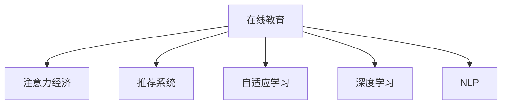

                 

# 注意力经济与在线教育：如何在竞争中脱颖而出

## 1. 背景介绍

### 1.1 问题由来

随着互联网技术的飞速发展，全球教育模式正经历着深刻的变革。传统教育体系在面临数字化转型的过程中，逐步催生了在线教育这一全新的教育形态。在线教育通过构建虚拟的课堂和平台，打破了时间和空间的限制，使教育资源得以在全球范围内传播和共享。

然而，随着在线教育市场的竞争加剧，如何利用有限的注意力资源，在众多在线教育平台中脱颖而出，成为了教育机构和科技公司面临的一大挑战。教育机构希望通过优质的在线课程内容，吸引更多的学习者。科技公司则希望通过强大的技术手段，提升用户体验，扩大市场份额。在这场激烈的市场竞争中，注意力经济的概念应运而生，成为各大平台争夺用户的重要战略之一。

### 1.2 问题核心关键点

注意力经济指的是在互联网环境中，信息爆炸导致用户注意力稀缺，平台需要通过提升用户体验和优化内容推荐算法，来吸引和保持用户的注意力。对于在线教育平台而言，提升用户参与度和满意度，进而提升教育效果和平台竞争力，是核心目标。

具体来说，在线教育平台面临以下几个关键问题：
1. 如何吸引用户注册和付费？
2. 如何提升用户课程完成率和参与度？
3. 如何精准推荐相关课程内容，避免信息过载？
4. 如何利用人工智能和大数据分析技术，提升教学效果？

本文将围绕以上核心问题，深入探讨如何通过注意力经济和在线教育策略，在激烈的市场竞争中脱颖而出。

## 2. 核心概念与联系

### 2.1 核心概念概述

为更好地理解注意力经济与在线教育平台的策略，本节将介绍几个核心概念：

- 在线教育(Online Education)：指通过互联网技术，将教育内容进行数字化封装和传播，使学习者可以随时随地访问。在线教育打破了传统教育的时间和空间限制，大大提升了教育资源的普及率。

- 注意力经济(Attention Economy)：指在信息爆炸的时代，用户注意力成为一种稀缺资源。平台需要通过优化用户体验、精准推荐、个性化内容推送等方式，吸引和保持用户注意力。

- 推荐系统(Recommendation System)：指利用用户行为数据和内容标签，通过算法预测用户可能感兴趣的内容，并推荐给用户。推荐系统是提升用户参与度和平台粘性的重要手段。

- 自适应学习(Adaptive Learning)：指通过智能算法，动态调整学习路径和教学内容，满足不同学习者的个性化需求。自适应学习技术有助于提升学习效果，提高用户满意度。

- 深度学习(Deep Learning)：指利用多层神经网络模型，对大量数据进行特征学习和模式识别，是人工智能技术在推荐系统和自适应学习中的应用基础。

- 自然语言处理(Natural Language Processing, NLP)：指通过算法处理和理解人类语言，是推荐系统中基于文本内容的推荐算法的重要技术之一。

这些核心概念之间的逻辑关系可以通过以下Mermaid流程图来展示：



这个流程图展示了在线教育与注意力经济的核心概念以及它们之间的相互关系。通过优化这些核心技术，可以更好地吸引和保持用户注意力，提升教育效果和平台竞争力。

## 3. 核心算法原理 & 具体操作步骤
### 3.1 算法原理概述

在线教育平台的注意力经济策略，主要依赖于推荐系统和自适应学习技术。其中，推荐系统通过用户行为数据和内容标签，预测用户可能感兴趣的内容；自适应学习通过动态调整教学内容，满足不同学习者的个性化需求。

推荐系统的核心在于构建用户和内容的兴趣表示，并计算用户与内容的匹配度，最终输出推荐结果。自适应学习的核心在于根据学习者的历史行为和反馈，动态调整教学策略，提高学习效果。

### 3.2 算法步骤详解

#### 3.2.1 推荐系统

推荐系统的实现一般分为以下几个步骤：

1. **用户建模**：收集用户的行为数据，如浏览记录、点击行为、评分反馈等，构建用户兴趣表示向量。

2. **物品建模**：收集内容的数据，如课程介绍、视频内容、文本标签等，构建物品兴趣表示向量。

3. **相似度计算**：计算用户和物品的相似度，可以通过余弦相似度、皮尔逊相关系数等方法。

4. **推荐排序**：根据用户和物品的相似度，排序输出推荐的物品列表。

自适应学习系统一般包含以下步骤：

1. **用户建模**：收集学习者的历史行为数据，如学习时间、答题正确率、知识掌握程度等，构建学习者的知识图谱。

2. **内容建模**：将课程内容分解为知识点和技能点，构建内容的知识图谱。

3. **学习路径规划**：根据学习者的知识图谱和内容知识图谱，动态规划学习路径。

4. **教学内容调整**：根据学习者的反馈和实时进度，动态调整教学内容和难度。

#### 3.2.2 算法优缺点

推荐系统的优点：
1. 个性化推荐：通过用户行为数据，可以精准地推荐用户感兴趣的内容，提升用户参与度。
2. 内容丰富度：推荐系统可以呈现海量的内容，满足不同用户的需求。
3. 用户粘性：通过持续推荐相关内容，提升用户的使用频率和平台粘性。

推荐系统的缺点：
1. 信息过载：过多的推荐内容可能使用户感到疲劳，降低用户体验。
2. 推荐偏差：推荐算法可能出现偏差，导致用户接收到不准确的信息。
3. 数据隐私：用户行为数据的收集和使用可能涉及隐私问题。

自适应学习的优点：
1. 个性化学习：通过动态调整教学策略，提升学习效果。
2. 灵活性：可以实时响应学习者的反馈，调整学习路径。
3. 学习效率：根据学习者的进度和理解能力，调整教学内容难度。

自适应学习的缺点：
1. 算法复杂度：自适应学习算法需要处理复杂的数据模型，计算开销较大。
2. 数据依赖：需要大量的用户行为数据和课程内容数据，才能有效运作。
3. 用户行为差异：不同学习者的行为模式差异较大，个性化算法需要不断优化。

#### 3.2.3 算法应用领域

推荐系统主要应用于在线教育平台的课程推荐、学习资源推荐、个性化学习路径推荐等场景。通过推荐系统，平台能够提升用户参与度和满意度，增加用户粘性。

自适应学习主要应用于在线教育平台的自适应学习系统、智能辅导系统、个性化推荐系统等场景。通过自适应学习，平台能够实现个性化教学，提升学习效果和用户满意度。

## 4. 数学模型和公式 & 详细讲解 & 举例说明

### 4.1 数学模型构建

推荐系统的数学模型通常包括用户-物品矩阵和用户-物品评分矩阵。用户-物品矩阵 $U$ 表示用户对每个物品的兴趣程度，用户-物品评分矩阵 $R$ 表示用户对每个物品的评分。推荐系统的目标是通过矩阵分解，将用户-物品评分矩阵 $R$ 分解为用户兴趣向量 $U$ 和物品特征向量 $V$，使得 $R \approx UV^T$。

自适应学习的数学模型通常包括知识图谱、学习路径和教学内容。知识图谱 $G$ 表示课程内容和知识点之间的关系，学习路径 $L$ 表示学习者的学习进度和知识掌握程度，教学内容 $C$ 表示课程内容和难度系数。自适应学习的目标是通过优化算法，调整学习路径 $L$ 和教学内容 $C$，使得学习效果最大化。

### 4.2 公式推导过程

推荐系统常用的矩阵分解方法包括奇异值分解(SVD)、交替最小二乘(ALS)等。这里以奇异值分解为例，推导用户-物品评分的分解公式。

设用户-物品评分矩阵为 $R$，用户-物品矩阵为 $U$，物品特征矩阵为 $V$。根据奇异值分解，有：

$$
R = UV^T
$$

其中，$U$ 和 $V$ 分别表示用户和物品的特征向量，$R$ 表示用户对物品的评分。对于用户 $i$ 和物品 $j$，其评分为：

$$
r_{ij} = \sum_k u_{ik}v_{kj}
$$

对于用户 $i$ 的兴趣表示向量 $u_i$，可以通过矩阵 $U$ 和 $v_i$ 计算得到：

$$
u_i = U_i = (u_{i1}, u_{i2}, ..., u_{in})
$$

其中，$U_i$ 表示用户 $i$ 对所有物品的兴趣表示向量。

自适应学习系统的优化目标通常是一个多目标优化问题，可以通过线性规划、非线性规划等方法解决。这里以线性规划为例，推导自适应学习系统的优化目标。

设学习者的知识图谱为 $G$，学习路径为 $L$，教学内容为 $C$。自适应学习系统的优化目标为：

$$
\max_{L, C} \sum_{(i, j)} r_{ij} + \sum_{(i, k)} r_{ik} - \sum_{(j, k)} r_{jk}
$$

其中，第一项表示学习者当前学习路径上的评分数，第二项表示学习者未学习路径上的评分数，第三项表示已有课程和未学习课程之间的差异评分数。

### 4.3 案例分析与讲解

以Coursera平台为例，分析其注意力经济策略的实现。Coursera平台通过以下几个步骤，实现了高效的用户吸引和满意度提升：

1. **用户建模**：Coursera平台收集用户的浏览记录、课程评分、学习时间等数据，构建用户兴趣表示向量。

2. **物品建模**：Coursera平台收集课程的介绍、视频内容、教材、讨论区等数据，构建课程的兴趣表示向量。

3. **相似度计算**：Coursera平台使用余弦相似度计算用户和课程的兴趣匹配度。

4. **推荐排序**：Coursera平台根据用户的兴趣向量，排序输出推荐的课程列表。

5. **自适应学习**：Coursera平台根据用户的学习进度和反馈，动态调整学习路径和教学内容，提供个性化的学习建议。

6. **学习效果评估**：Coursera平台使用学习者的答题正确率、考试成绩、知识掌握程度等指标，评估学习效果。

通过以上策略，Coursera平台能够有效吸引用户注册和付费，提升用户参与度和满意度，进而增加平台的用户粘性和市场份额。

## 5. 项目实践：代码实例和详细解释说明

### 5.1 开发环境搭建

在进行推荐系统开发前，我们需要准备好开发环境。以下是使用Python进行PyTorch开发的环境配置流程：

1. 安装Anaconda：从官网下载并安装Anaconda，用于创建独立的Python环境。

2. 创建并激活虚拟环境：
```bash
conda create -n pytorch-env python=3.8 
conda activate pytorch-env
```

3. 安装PyTorch：根据CUDA版本，从官网获取对应的安装命令。例如：
```bash
conda install pytorch torchvision torchaudio cudatoolkit=11.1 -c pytorch -c conda-forge
```

4. 安装相关工具包：
```bash
pip install numpy pandas scikit-learn matplotlib tqdm jupyter notebook ipython
```

5. 安装TensorBoard：
```bash
pip install tensorboard
```

完成上述步骤后，即可在`pytorch-env`环境中开始推荐系统开发。

### 5.2 源代码详细实现

我们以协同过滤推荐系统为例，使用PyTorch实现用户-物品评分矩阵分解。

首先，定义评分矩阵和用户矩阵：

```python
import numpy as np
import torch

# 定义评分矩阵
R = np.array([[5, 3, 2], 
              [4, 0, 4], 
              [0, 1, 1]])

# 定义用户矩阵
U = np.array([[1, 0, 1],
              [0, 0, 1],
              [1, 0, 0]])

# 定义物品特征矩阵
V = np.array([[0.5, 0.5],
              [0.3, 0.7],
              [0.4, 0.6]])
```

然后，定义评分矩阵分解的模型：

```python
class CollaborativeFiltering(torch.nn.Module):
    def __init__(self, rank=10):
        super(CollaborativeFiltering, self).__init__()
        self.rank = rank
        self.user_embedding = torch.nn.Embedding(3, rank)
        self.item_embedding = torch.nn.Embedding(3, rank)
    
    def forward(self, user, item):
        user_vec = self.user_embedding(user)
        item_vec = self.item_embedding(item)
        return torch.matmul(user_vec, item_vec.t())
```

接着，定义损失函数和优化器：

```python
import torch.nn as nn
import torch.optim as optim

# 定义损失函数
loss_fn = nn.MSELoss()

# 定义优化器
optimizer = optim.Adam(model.parameters(), lr=0.01)
```

然后，定义评分矩阵分解的训练过程：

```python
def train_epoch(model, R):
    user_idx = torch.tensor(list(range(R.shape[0])))
    item_idx = torch.tensor(list(range(R.shape[1])))
    
    for _ in range(10):
        user_vec = model(user_idx, item_idx)
        loss = loss_fn(user_vec, torch.tensor(R))
        optimizer.zero_grad()
        loss.backward()
        optimizer.step()
        
    return user_vec, item_vec
```

最后，启动训练流程并在测试集上评估：

```python
epochs = 10

for epoch in range(epochs):
    user_vec, item_vec = train_epoch(model, R)
    print(f"Epoch {epoch+1}, loss: {loss.item()}")

# 测试预测
user_idx_test = torch.tensor([0, 1])
item_idx_test = torch.tensor([0, 2])
predictions = model(user_idx_test, item_idx_test)
print(f"Predictions: {predictions.tolist()}")
```

以上就是使用PyTorch对协同过滤推荐系统进行用户-物品评分矩阵分解的完整代码实现。可以看到，利用PyTorch的自动微分功能和模块化设计，推荐系统的实现变得简洁高效。

### 5.3 代码解读与分析

让我们再详细解读一下关键代码的实现细节：

**CollaborativeFiltering类**：
- `__init__`方法：初始化用户嵌入和物品嵌入矩阵。
- `forward`方法：计算用户-物品评分的预测值。

**损失函数和优化器**：
- `nn.MSELoss`：均方误差损失函数，用于衡量预测值与真实评分之间的差异。
- `Adam`：优化算法，用于更新模型参数。

**训练过程**：
- `train_epoch`函数：定义一个epoch的训练过程，对评分矩阵进行分解，并计算损失函数。
- `optimizer.zero_grad`：清空优化器梯度。
- `loss.backward`：计算损失函数的梯度。
- `optimizer.step`：更新模型参数。

**训练流程**：
- `epochs`变量：定义总的训练epoch数。
- 循环迭代，在每个epoch内进行评分矩阵分解和损失函数计算，更新模型参数。
- 输出每个epoch的平均损失，并在测试集上进行预测。

## 6. 实际应用场景

### 6.1 智能辅导系统

智能辅导系统是自适应学习的重要应用之一，通过动态调整教学内容和学习路径，帮助学习者掌握知识。智能辅导系统通常包括智能推荐引擎和个性化学习模块。

智能推荐引擎通过对学习者的历史行为数据进行分析，推荐最适合学习者的课程和知识点。个性化学习模块则根据学习者的实时反馈和进度，动态调整教学内容和难度，提高学习效果。

以Khan Academy为例，其智能辅导系统通过以下步骤，实现了高效的教学效果：

1. **智能推荐**：根据学习者的历史行为数据，推荐适合的学习路径和课程。

2. **个性化学习**：根据学习者的实时反馈和进度，动态调整教学内容和难度。

3. **学习效果评估**：使用学习者的答题正确率、考试成绩、知识掌握程度等指标，评估学习效果。

4. **反馈调整**：根据学习效果和用户反馈，不断优化推荐算法和教学策略。

Khan Academy的智能辅导系统，通过精准推荐和自适应学习，帮助全球数百万学习者实现了高效学习。

### 6.2 在线教育平台

在线教育平台通过推荐系统和自适应学习技术，提升了用户参与度和满意度。例如，Coursera和edX等平台，通过以下几个策略，实现了用户吸引和满意度提升：

1. **智能推荐**：根据用户的历史行为数据，推荐感兴趣的课程和知识点。

2. **个性化学习**：根据学习者的实时反馈和进度，动态调整教学内容和难度。

3. **学习效果评估**：使用学习者的答题正确率、考试成绩、知识掌握程度等指标，评估学习效果。

4. **反馈调整**：根据学习效果和用户反馈，不断优化推荐算法和教学策略。

5. **内容更新**：根据用户需求和市场变化，动态更新课程内容和教学资源。

通过以上策略，在线教育平台能够有效吸引用户注册和付费，提升用户参与度和满意度，进而增加平台的用户粘性和市场份额。

### 6.3 未来应用展望

随着人工智能和大数据技术的不断进步，在线教育平台将进一步拓展其应用范围，为教育领域带来新的变革。

1. **虚拟现实教育**：利用虚拟现实技术，创建沉浸式学习环境，提升学习效果。

2. **个性化内容生成**：通过自然语言生成技术，动态生成个性化学习内容，满足不同学习者的需求。

3. **智能学习助手**：结合智能语音识别和自然语言处理技术，开发智能学习助手，辅助学习者完成学习任务。

4. **数据驱动教育**：利用大数据分析技术，深入挖掘学习者的学习模式和行为特征，制定个性化的学习方案。

5. **学习行为分析**：通过机器学习技术，分析学习者的学习行为和效果，提供个性化的学习建议和指导。

6. **学习社区构建**：利用社交网络技术，构建学习社区，促进学习者之间的互动和交流。

通过以上应用，在线教育平台将进一步提升教育效果，实现智能化、个性化、高效化的教育模式。

## 7. 工具和资源推荐

### 7.1 学习资源推荐

为了帮助开发者系统掌握推荐系统和自适应学习技术的理论基础和实践技巧，这里推荐一些优质的学习资源：

1. **《推荐系统实践》书籍**：这本书全面介绍了推荐系统的构建和优化方法，包括协同过滤、内容推荐、混合推荐等，适合初学者和高级开发者。

2. **CS280《机器学习系统》课程**：斯坦福大学开设的推荐系统课程，有Lecture视频和配套作业，带你深入学习推荐系统的核心算法和优化技巧。

3. **《自适应学习》书籍**：这本书介绍了自适应学习的基本原理和应用方法，包括基于模型的自适应学习、基于规则的自适应学习等，适合深入学习和实践。

4. **Coursera《在线教育创新》课程**：通过学习在线教育平台的创新实践，了解如何通过推荐系统和自适应学习技术提升教育效果。

5. **Kaggle推荐系统竞赛**：参加Kaggle的推荐系统竞赛，实战练习推荐系统算法的优化和改进。

通过对这些资源的学习实践，相信你一定能够快速掌握推荐系统和自适应学习技术的精髓，并用于解决实际的在线教育问题。

### 7.2 开发工具推荐

高效的开发离不开优秀的工具支持。以下是几款用于推荐系统和自适应学习开发的常用工具：

1. PyTorch：基于Python的开源深度学习框架，灵活动态的计算图，适合快速迭代研究。

2. TensorFlow：由Google主导开发的开源深度学习框架，生产部署方便，适合大规模工程应用。

3. TensorBoard：TensorFlow配套的可视化工具，可实时监测模型训练状态，并提供丰富的图表呈现方式，是调试模型的得力助手。

4. Weights & Biases：模型训练的实验跟踪工具，可以记录和可视化模型训练过程中的各项指标，方便对比和调优。

5. HuggingFace Transformers：NLP工具库，集成了众多SOTA语言模型，支持PyTorch和TensorFlow，是进行推荐系统和自适应学习开发的利器。

6. Scikit-learn：Python机器学习库，包含多种经典的推荐算法和自适应学习算法，适合快速原型开发。

通过合理利用这些工具，可以显著提升推荐系统和自适应学习系统的开发效率，加快创新迭代的步伐。

### 7.3 相关论文推荐

推荐系统和自适应学习技术的发展源于学界的持续研究。以下是几篇奠基性的相关论文，推荐阅读：

1. **《隐语义模型》论文**：提出隐语义模型，通过矩阵分解方法，实现了推荐系统的基础框架。

2. **《AdaBoost的改进》论文**：提出基于Boosting的推荐算法，提升了推荐系统的准确性和鲁棒性。

3. **《基于规则的自适应学习》论文**：提出基于规则的自适应学习模型，实现了自适应学习系统的初步探索。

4. **《个性化推荐系统》论文**：提出基于协同过滤的个性化推荐算法，解决了推荐系统中的稀疏性和冷启动问题。

5. **《自适应学习系统》论文**：提出自适应学习系统的优化方法，提高了学习效果和用户满意度。

这些论文代表了大数据和人工智能技术在推荐系统和自适应学习中的应用方向。通过学习这些前沿成果，可以帮助研究者把握学科前进方向，激发更多的创新灵感。

## 8. 总结：未来发展趋势与挑战

### 8.1 总结

本文对基于注意力经济的在线教育平台推荐系统和自适应学习技术进行了全面系统的介绍。首先阐述了在线教育平台在数字化转型过程中，如何利用注意力经济吸引和保持用户注意力，进而提升教育效果和平台竞争力。其次，从原理到实践，详细讲解了推荐系统和自适应学习的数学模型和算法流程，给出了推荐系统开发和自适应学习实现的代码实例。同时，本文还广泛探讨了推荐系统和自适应学习在实际应用中的场景和前景，展示了注意力经济在在线教育平台中的应用潜力。最后，本文精选了推荐系统和自适应学习的各类学习资源，力求为读者提供全方位的技术指引。

通过本文的系统梳理，可以看到，基于注意力经济的在线教育平台推荐系统和自适应学习技术正在成为教育领域的重要范式，极大地拓展了在线教育平台的覆盖范围和应用深度。这些技术的深入应用，必将推动在线教育平台的智能化、个性化、高效化进程，为全球学习者提供更加优质的教育体验。

### 8.2 未来发展趋势

展望未来，在线教育平台的推荐系统和自适应学习技术将呈现以下几个发展趋势：

1. **多模态学习**：结合视觉、语音、文本等多种模态信息，提升推荐系统和自适应学习的效果。

2. **深度学习与强化学习结合**：通过强化学习优化推荐系统算法，提升用户参与度和满意度。

3. **个性化学习路径**：通过动态调整学习路径，提升学习效果，满足不同学习者的需求。

4. **知识图谱应用**：利用知识图谱，丰富推荐系统的知识表示，提升推荐的准确性和多样性。

5. **跨领域推荐**：结合不同领域的知识，实现跨领域的推荐和学习。

6. **实时推荐与自适应学习**：通过实时数据分析，动态调整推荐内容和教学策略，提升用户体验。

以上趋势凸显了在线教育平台推荐系统和自适应学习技术的广阔前景。这些方向的探索发展，必将进一步提升教育效果，实现智能化、个性化、高效化的教育模式。

### 8.3 面临的挑战

尽管在线教育平台推荐系统和自适应学习技术已经取得了显著成就，但在迈向更加智能化、个性化应用的过程中，仍面临诸多挑战：

1. **数据质量问题**：推荐系统和自适应学习依赖大量的用户行为数据和课程内容数据，数据质量的不足可能导致推荐和学习的偏差。

2. **算法复杂度**：推荐系统和自适应学习算法需要处理复杂的数据模型，计算开销较大，需要在保证效果的同时，优化算法复杂度。

3. **隐私保护**：用户行为数据的收集和使用可能涉及隐私问题，如何在保护用户隐私的前提下，实现个性化推荐和自适应学习，仍需进一步探索。

4. **推荐多样性**：过多的个性化推荐可能导致用户信息过载，如何平衡个性化和多样性，提高用户体验，仍需不断优化。

5. **模型鲁棒性**：推荐系统和自适应学习模型面临各种噪声和干扰，如何提高模型的鲁棒性，避免灾难性遗忘，还需要更多理论和实践的积累。

6. **可解释性**：推荐系统和自适应学习模型通常是"黑盒"系统，难以解释其内部工作机制和决策逻辑。如何赋予模型更强的可解释性，将是亟待攻克的难题。

正视这些挑战，积极应对并寻求突破，将是大数据和人工智能技术在推荐系统和自适应学习领域迈向成熟的必由之路。相信随着学界和产业界的共同努力，这些挑战终将一一被克服，推荐系统和自适应学习技术必将在构建智能教育平台中扮演越来越重要的角色。

### 8.4 研究展望

面对在线教育平台推荐系统和自适应学习面临的种种挑战，未来的研究需要在以下几个方面寻求新的突破：

1. **多模态信息融合**：结合视觉、语音、文本等多种模态信息，提升推荐系统和自适应学习的效果。

2. **深度学习与强化学习的结合**：通过强化学习优化推荐系统算法，提升用户参与度和满意度。

3. **个性化学习路径的优化**：通过动态调整学习路径，提升学习效果，满足不同学习者的需求。

4. **知识图谱的应用**：利用知识图谱，丰富推荐系统的知识表示，提升推荐的准确性和多样性。

5. **跨领域推荐的学习**：结合不同领域的知识，实现跨领域的推荐和学习。

6. **实时推荐与自适应学习的优化**：通过实时数据分析，动态调整推荐内容和教学策略，提升用户体验。

7. **数据质量和隐私保护**：通过数据清洗和匿名化处理，提高数据质量，保护用户隐私。

8. **推荐多样性的平衡**：在个性化推荐的基础上，加入多样性约束，避免用户信息过载。

9. **模型鲁棒性的提升**：引入因果分析方法和对抗训练技术，提高推荐系统和自适应学习模型的鲁棒性。

10. **模型可解释性的增强**：通过可解释性方法，增强推荐系统和自适应学习模型的决策过程，提升用户信任度。

这些研究方向的探索，必将引领在线教育平台推荐系统和自适应学习技术的进一步发展，为智能教育平台的构建提供更坚实的基础。面向未来，我们期待在线教育平台能够通过个性化推荐和自适应学习，实现更高效、更智能、更个性化的教育模式，为全球学习者带来更加优质的教育体验。

## 9. 附录：常见问题与解答

**Q1：推荐系统如何实现个性化推荐？**

A: 推荐系统通过用户行为数据和内容标签，构建用户和物品的兴趣表示向量，计算用户与物品的匹配度，并根据匹配度进行排序推荐。

**Q2：自适应学习如何实现个性化教学？**

A: 自适应学习通过动态调整学习路径和教学内容，根据学习者的历史行为和反馈，优化学习效果。

**Q3：推荐系统如何应对冷启动问题？**

A: 推荐系统可以通过协同过滤、内容推荐、混合推荐等多种方法，解决冷启动问题。例如，利用用户相似性推荐新物品，利用物品标签推荐相关物品。

**Q4：自适应学习如何平衡个性化和多样性？**

A: 自适应学习可以通过设置多样性约束、引入推荐算法等方法，平衡个性化和多样性。例如，设置多样性权重，鼓励学习者尝试不同领域的课程。

**Q5：推荐系统和自适应学习在实际应用中需要注意哪些问题？**

A: 推荐系统和自适应学习在实际应用中需要注意数据质量、算法复杂度、隐私保护、推荐多样性、模型鲁棒性和可解释性等问题。

通过本文的系统梳理，可以看到，基于注意力经济的在线教育平台推荐系统和自适应学习技术正在成为教育领域的重要范式，极大地拓展了在线教育平台的覆盖范围和应用深度。这些技术的深入应用，必将推动在线教育平台的智能化、个性化、高效化进程，为全球学习者提供更加优质的教育体验。

---

作者：禅与计算机程序设计艺术 / Zen and the Art of Computer Programming

