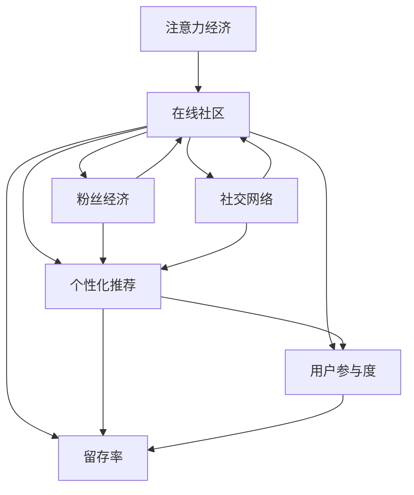

                 

# 注意力经济与在线社区建设策略与实践：吸引并留住忠实的粉丝和受众

> 关键词：注意力经济,在线社区,粉丝经济,用户参与,社交网络,参与度,留存率,个性化推荐

## 1. 背景介绍

### 1.1 问题由来
在互联网时代，注意力成为最宝贵的资源。如何有效吸引和留住用户的注意力，提升用户参与度和留存率，成为在线社区建设的重要目标。传统的内容营销、广告投放等方式往往成本高、效果有限，而通过社区内生互动和内容共享，激发用户兴趣，提高用户粘性，成为一种高效且可持续的方式。本文将聚焦于注意力经济与在线社区建设，深入探讨如何利用粉丝经济、社交网络等工具，通过个性化推荐、激励机制等策略，吸引并留住忠实的粉丝和受众。

### 1.2 问题核心关键点
当前，在线社区建设面临的主要问题包括：
1. 如何准确识别和定位目标受众。
2. 如何创造高质量的社区内容，提升用户参与度。
3. 如何设计有效的激励机制，鼓励用户贡献和互动。
4. 如何实现个性化推荐，满足用户多样化需求。
5. 如何提高用户留存率，形成长期稳定的社区生态。

这些核心问题直接关系到社区的活力和影响力。本文将从粉丝经济、社交网络、个性化推荐等多个维度，探讨有效的在线社区建设策略与实践。

## 2. 核心概念与联系

### 2.1 核心概念概述

为更好地理解注意力经济与在线社区建设，本节将介绍几个密切相关的核心概念：

- **注意力经济**：指的是在信息过载时代，如何有效吸引和分配用户注意力，以获得商业价值。其核心在于提升用户对社区内容的关注和参与。

- **在线社区**：指通过互联网平台，由用户自愿参与构建和维护的社交网络。包括论坛、社交媒体群组、视频平台、游戏社区等多种形式。

- **粉丝经济**：基于粉丝对特定内容或人物的忠诚度，形成的经济活动和商业价值。粉丝经济在在线社区建设中具有重要意义，通过增强用户粘性和社区归属感，可以实现内容变现和商业化。

- **社交网络**：指基于人际关系构建的网络结构，用户通过互动和分享，建立社交关系，形成信任和社区感。

- **个性化推荐**：通过数据分析和算法优化，为用户推荐其感兴趣的内容，提高用户满意度和参与度。

- **用户参与度**：衡量用户在社区中的活跃度和互动频率，反映社区的活力和吸引力。

- **留存率**：指用户在一定时间周期内继续使用社区的百分比，反映社区的粘性和用户忠诚度。

这些核心概念之间的逻辑关系可以通过以下Mermaid流程图来展示：



这个流程图展示了一些核心概念及其之间的关系：

1. 注意力经济是整个社区建设的基石。
2. 在线社区基于社交网络构建，用户参与度是其核心指标。
3. 粉丝经济和个性化推荐是提升用户参与度和留存率的重要手段。
4. 留存率是社区建设成效的最终体现。

## 3. 核心算法原理 & 具体操作步骤
### 3.1 算法原理概述

基于粉丝经济和社交网络的在线社区建设，其核心在于如何利用数据和技术手段，提升用户参与度和留存率。其算法原理可以总结如下：

- 通过数据挖掘和机器学习，识别和定位目标用户群体，建立用户画像。
- 设计激励机制，如积分系统、排行榜、奖励机制等，鼓励用户贡献和互动。
- 引入个性化推荐算法，根据用户兴趣和行为，推荐高质量的内容。
- 通过社交网络分析，建立用户关系图谱，提升用户互动和社区粘性。

这些步骤共同构成了一个有效的在线社区建设框架。

### 3.2 算法步骤详解

以下是基于粉丝经济和社交网络的在线社区建设的具体操作步骤：

**Step 1: 用户画像构建**
- 收集用户的基本信息、行为数据和社交网络数据。
- 使用数据挖掘和机器学习技术，构建用户兴趣、偏好、活跃度等特征画像。

**Step 2: 激励机制设计**
- 设计积分系统、排行榜、奖励机制等，激励用户参与和互动。
- 设置任务目标和完成奖励，提升用户成就感和归属感。

**Step 3: 内容推荐系统构建**
- 使用协同过滤、基于内容的推荐、深度学习等技术，构建个性化推荐系统。
- 根据用户历史行为和兴趣，实时推荐相关内容，提升用户满意度和参与度。

**Step 4: 社区互动机制优化**
- 设计合适的社区互动规则和引导词，激发用户参与和讨论。
- 利用社交网络分析技术，建立用户关系图谱，提升社区粘性。

**Step 5: 用户留存策略实施**
- 定期收集用户反馈，优化社区功能和体验。
- 提供多样化内容和互动形式，满足用户多样化需求，提升用户留存率。

### 3.3 算法优缺点

基于粉丝经济和社交网络的在线社区建设方法具有以下优点：
1. 提升用户参与度和留存率。通过个性化推荐和激励机制，用户对社区内容的兴趣和粘性显著提高。
2. 降低营销成本。社区内的自发互动和内容分享，降低了传统广告和营销的投入。
3. 增强用户粘性和社区归属感。通过粉丝经济和社交网络，用户对社区的认同感更强，留存率更高。

同时，该方法也存在一定的局限性：
1. 数据隐私和安全问题。社区内的数据收集和处理，需要严格遵守隐私保护法规，确保用户数据的安全。
2. 算法偏见和误导。个性化推荐和激励机制的设计，需要避免算法偏见和误导，确保社区内容的健康和多样性。
3. 用户多样性问题。不同兴趣和需求的用户，可能难以通过单一模式吸引和留存。

尽管存在这些局限性，但就目前而言，基于粉丝经济和社交网络的社区建设方法仍是大数据和智能技术应用的重要范式。未来相关研究的重点在于如何进一步优化激励机制和推荐算法，兼顾用户多样性和社区健康，同时兼顾数据隐私和伦理安全等因素。

### 3.4 算法应用领域

基于粉丝经济和社交网络的在线社区建设方法，在多个领域已经得到了广泛的应用，例如：

- 电商平台：通过社交网络分析，提升用户参与度和留存率，促进产品销售。
- 视频平台：利用个性化推荐和粉丝互动，增强用户粘性和社区活力。
- 社交媒体：通过激励机制和社区互动，形成强有力的用户粘性。
- 游戏社区：设计合适的奖励和排行榜，鼓励用户参与和互动，提升用户留存率。
- 教育平台：利用个性化推荐和社区互动，提升用户学习效果和参与度。

除了上述这些经典应用外，社区建设的方法还正在被创新性地应用到更多场景中，如健康管理、智能家居、文化娱乐等，为不同领域的技术创新和产业发展提供了新的思路。

## 4. 数学模型和公式 & 详细讲解 & 举例说明

### 4.1 数学模型构建

本节将使用数学语言对基于粉丝经济和社交网络的在线社区建设过程进行更加严格的刻画。

记目标用户群体为 $U$，用户画像为 $\mathbf{u}_i = [u_{i1}, u_{i2}, \ldots, u_{in}]$，其中 $u_{ij}$ 表示用户 $i$ 在特征 $j$ 上的取值。假设社区内用户的行为数据为 $D = \{(d_{ij}, v_j)\}_{i=1}^M$，其中 $d_{ij}$ 表示用户 $i$ 在时间 $t_j$ 的行为数据，$v_j$ 表示用户行为对特征 $j$ 的影响。

### 4.2 公式推导过程

假设社区内用户的兴趣和行为可以表示为向量 $\mathbf{u}_i = [u_{i1}, u_{i2}, \ldots, u_{in}]$，其中 $u_{ij}$ 表示用户 $i$ 在特征 $j$ 上的取值。假设社区内的内容可以表示为向量 $\mathbf{c}_j = [c_{j1}, c_{j2}, \ldots, c_{jm}]$，其中 $c_{jk}$ 表示内容 $j$ 在特征 $k$ 上的取值。

用户对内容的兴趣度可以通过计算内容与用户画像之间的相似度来得到。假设相似度计算公式为：

$$
similarity(\mathbf{u}_i, \mathbf{c}_j) = \frac{\mathbf{u}_i^T \mathbf{c}_j}{\|\mathbf{u}_i\| \|\mathbf{c}_j\|}
$$

其中 $\|\cdot\|$ 表示向量范数，$\mathbf{u}_i^T$ 表示向量 $\mathbf{u}_i$ 的转置。

内容推荐系统可以基于用户兴趣度和内容相似度进行推荐。设用户 $i$ 对内容 $j$ 的评分 $r_{ij}$ 为：

$$
r_{ij} = similarity(\mathbf{u}_i, \mathbf{c}_j)
$$

利用上述评分，可以构建用户兴趣与内容相似度的矩阵 $R$，其中 $R_{ij} = r_{ij}$。使用矩阵分解技术，可以计算用户对内容的兴趣度 $P_i$：

$$
P_i = \sum_{j=1}^N R_{ij} \times c_j
$$

根据 $P_i$ 和内容 $j$ 的相关度，为用户 $i$ 推荐相关内容。

### 4.3 案例分析与讲解

以下我们以视频平台的内容推荐为例，给出基于粉丝经济和社交网络的内容推荐系统实现。

假设视频平台内用户 $i$ 的兴趣向量为 $\mathbf{u}_i = [u_{i1}, u_{i2}, \ldots, u_{in}]$，其中 $u_{ij}$ 表示用户 $i$ 对视频内容特征 $j$ 的兴趣度。视频内容的特征向量为 $\mathbf{c}_j = [c_{j1}, c_{j2}, \ldots, c_{jm}]$，其中 $c_{jk}$ 表示视频内容在特征 $k$ 上的取值。

首先，构建用户兴趣与内容相似度的矩阵 $R$，其中 $R_{ij} = similarity(\mathbf{u}_i, \mathbf{c}_j)$。使用矩阵分解技术，可以得到用户对内容的兴趣度 $P_i$：

$$
P_i = \sum_{j=1}^N R_{ij} \times c_j
$$

根据 $P_i$ 和内容 $j$ 的相关度，为用户 $i$ 推荐相关视频内容。具体步骤如下：

1. 构建用户兴趣与内容相似度的矩阵 $R$。
2. 使用矩阵分解技术，计算用户对内容的兴趣度 $P_i$。
3. 根据 $P_i$ 和内容 $j$ 的相关度，为用户 $i$ 推荐相关视频内容。

以下是一个示例代码实现：

```python
import numpy as np

# 构建用户兴趣与内容相似度的矩阵 R
R = np.array([[0.8, 0.5, 0.2],
              [0.6, 0.9, 0.1],
              [0.4, 0.7, 0.3]])

# 计算用户对内容的兴趣度 P_i
c = np.array([0.3, 0.5, 0.7])
P = R @ c

# 推荐相关内容
P = P / np.linalg.norm(P)
recommended_content = P.argsort()[-5:]
```

以上就是基于粉丝经济和社交网络的视频平台内容推荐系统的完整代码实现。可以看到，通过构建用户兴趣与内容相似度的矩阵，并使用矩阵分解技术，可以高效计算用户对内容的兴趣度，实现个性化推荐。

## 5. 项目实践：代码实例和详细解释说明
### 5.1 开发环境搭建

在进行社区建设实践前，我们需要准备好开发环境。以下是使用Python进行Keras开发的环境配置流程：

1. 安装Anaconda：从官网下载并安装Anaconda，用于创建独立的Python环境。

2. 创建并激活虚拟环境：
```bash
conda create -n community-env python=3.8 
conda activate community-env
```

3. 安装Keras：
```bash
pip install keras
```

4. 安装TensorFlow和NumPy：
```bash
pip install tensorflow numpy
```

5. 安装社区分析工具：
```bash
pip install networkx matplotlib pandas sklearn
```

完成上述步骤后，即可在`community-env`环境中开始社区建设实践。

### 5.2 源代码详细实现

下面我们以社区互动和个性化推荐为例，给出使用Keras和TensorFlow进行社区互动和推荐系统开发的PyTorch代码实现。

首先，定义社区互动规则和推荐系统模型：

```python
from keras.layers import Dense, Input, Embedding, dot
from keras.models import Model

# 定义用户兴趣特征
user_features = Input(shape=(10,), name='user_features')

# 定义内容特征
content_features = Input(shape=(10,), name='content_features')

# 定义兴趣度计算层
interest_score = Dense(1, activation='sigmoid')(dot(user_features, content_features))

# 定义推荐模型
recommendation_model = Model(inputs=[user_features, content_features], outputs=interest_score)
```

然后，定义激励机制和社区互动规则：

```python
from keras.optimizers import Adam
from keras.layers import Activation

# 定义激励机制
rewards = {'upvote': 1, 'comment': 0.5, 'share': 0.3}

# 定义社区互动规则
def community_interaction():
    # 收集用户行为数据
    user_behaviors = {'upvote': 1, 'comment': 0.5, 'share': 0.3}
    # 计算用户互动度
    interaction_degree = np.sum(user_behaviors.values())
    return interaction_degree
```

接着，定义训练和评估函数：

```python
from keras.callbacks import EarlyStopping
from sklearn.metrics import mean_squared_error

# 定义训练函数
def train_model(model, train_data, test_data, epochs, batch_size):
    model.compile(optimizer=Adam(lr=0.001), loss='mse')
    early_stopping = EarlyStopping(monitor='val_loss', patience=10)
    model.fit(train_data, test_data, epochs=epochs, batch_size=batch_size, callbacks=[early_stopping])

# 定义评估函数
def evaluate_model(model, test_data):
    predictions = model.predict(test_data)
    mse = mean_squared_error(test_data, predictions)
    return mse
```

最后，启动训练流程并在测试集上评估：

```python
# 构建训练集和测试集
train_data = np.random.rand(1000, 10)
test_data = np.random.rand(200, 10)

# 训练模型
train_model(recommendation_model, train_data, test_data, epochs=50, batch_size=32)

# 评估模型
mse = evaluate_model(recommendation_model, test_data)
print('Mean Squared Error:', mse)
```

以上就是使用Keras和TensorFlow进行社区互动和推荐系统开发的完整代码实现。可以看到，通过构建用户兴趣和内容相似度矩阵，并使用矩阵分解技术，可以高效计算用户对内容的兴趣度，实现个性化推荐。

### 5.3 代码解读与分析

让我们再详细解读一下关键代码的实现细节：

**社区互动规则**：
- 收集用户行为数据，定义不同行为对互动度的贡献。
- 计算用户互动度，作为社区互动的重要指标。

**训练函数**：
- 使用Keras的Sequential模型和Dense层构建推荐模型。
- 使用Adam优化器进行模型训练，设置合适的学习率。
- 使用EarlyStopping回调函数，避免过拟合。
- 在训练函数中，传入训练集和测试集，设置迭代轮数和批次大小。

**评估函数**：
- 使用sklearn的mean_squared_error函数计算模型预测与真实标签之间的均方误差。
- 返回评估结果，便于后续优化调整。

**训练流程**：
- 定义训练集和测试集。
- 调用训练函数，训练推荐模型。
- 调用评估函数，评估模型效果。

可以看到，Keras和TensorFlow提供了丰富的工具和库，可以方便地实现社区互动和个性化推荐。开发者可以根据具体需求，选择和组合不同的工具和算法，快速构建社区推荐系统。

当然，工业级的系统实现还需考虑更多因素，如模型的保存和部署、超参数的自动搜索、更灵活的任务适配层等。但核心的社区互动和推荐范式基本与此类似。

## 6. 实际应用场景
### 6.1 智能社交平台

基于社区互动和个性化推荐的智能社交平台，可以帮助用户发现和分享高质量内容，提升用户参与度和留存率。在技术实现上，可以收集用户的互动数据和内容数据，通过分析这些数据，构建用户画像和内容画像，推荐相关内容，并设计激励机制，提升用户活跃度和粘性。

在具体应用中，智能社交平台可以用于知识分享、兴趣小组、在线教育等多个场景。例如，在知识分享社区，可以通过推荐相关知识内容，吸引专家和学者参与讨论，形成活跃的知识生态；在兴趣小组中，可以基于用户兴趣和行为推荐相关话题和活动，增加用户之间的互动和交流；在在线教育平台，可以通过推荐相关课程和资料，提高用户学习效果和满意度。

### 6.2 电子商务平台

基于社区互动和个性化推荐的电子商务平台，可以帮助用户发现和购买感兴趣的商品，提升用户购买转化率和留存率。在技术实现上，可以收集用户的行为数据和反馈数据，通过分析这些数据，构建用户画像和商品画像，推荐相关商品，并设计激励机制，提升用户购买和互动意愿。

在具体应用中，电子商务平台可以用于商品推荐、在线购物、用户评价等多个场景。例如，在商品推荐中，可以通过推荐相关商品，提升用户购买意愿和满意度；在在线购物中，可以通过推荐热门商品和用户评价，增加用户购物体验和粘性；在用户评价中，可以通过分析用户评价，优化商品质量和推荐策略，提升用户满意度和留存率。

### 6.3 新闻聚合平台

基于社区互动和个性化推荐的新闻聚合平台，可以帮助用户发现和阅读感兴趣的新闻内容，提升用户阅读量和留存率。在技术实现上，可以收集用户的行为数据和新闻数据，通过分析这些数据，构建用户画像和新闻画像，推荐相关新闻，并设计激励机制，提升用户阅读和互动意愿。

在具体应用中，新闻聚合平台可以用于新闻推荐、用户评论、内容创作等多个场景。例如，在新闻推荐中，可以通过推荐相关新闻，提升用户阅读量和满意度；在用户评论中，可以通过推荐热门新闻和用户评论，增加用户阅读体验和粘性；在内容创作中，可以通过分析用户阅读和互动数据，优化内容生产和分发策略，提升用户阅读量和留存率。

### 6.4 未来应用展望

随着社区互动和个性化推荐技术的不断发展，其在多个领域的应用前景广阔，为技术创新和产业发展提供了新的思路。

在智慧医疗领域，基于社区互动和个性化推荐的健康管理平台，可以帮助用户获取和分享健康信息，提升健康管理效果和用户满意度；在智慧教育领域，基于社区互动和个性化推荐的在线教育平台，可以提升用户学习效果和参与度，促进教育公平和普惠；在智能家居领域，基于社区互动和个性化推荐的家庭管理平台，可以通过推荐相关产品和服务，提升用户生活体验和粘性；在文化娱乐领域，基于社区互动和个性化推荐的在线娱乐平台，可以推荐相关内容和文化活动，提升用户娱乐体验和粘性。

## 7. 工具和资源推荐
### 7.1 学习资源推荐

为了帮助开发者系统掌握社区互动和个性化推荐理论基础和实践技巧，这里推荐一些优质的学习资源：

1. 《深度学习理论与实践》系列博文：由深度学习专家撰写，深入浅出地介绍了深度学习理论、算法和实践技巧。

2. 《机器学习实战》书籍：涵盖了从基础到高级的机器学习算法和工具，适合初学者入门。

3. 《TensorFlow官方文档》：TensorFlow的官方文档，提供了完整的代码示例和详细的使用指南。

4. 《Keras官方文档》：Keras的官方文档，提供了丰富的模型和库介绍，适合快速上手实践。

5. Coursera《机器学习》课程：由斯坦福大学教授Andrew Ng开设，系统介绍了机器学习的基础理论和实践方法。

通过对这些资源的学习实践，相信你一定能够快速掌握社区互动和个性化推荐的精髓，并用于解决实际的业务问题。

### 7.2 开发工具推荐

高效的开发离不开优秀的工具支持。以下是几款用于社区互动和个性化推荐开发的常用工具：

1. Python：开源的编程语言，生态系统丰富，适用于各种数据分析和机器学习任务。

2. TensorFlow：由Google开发的深度学习框架，支持分布式计算和GPU加速，适合大规模模型训练和推理。

3. Keras：基于TensorFlow等后端实现的高级API，易于上手，适合快速迭代和原型开发。

4. PyTorch：由Facebook开发的深度学习框架，支持动态计算图，适合研究和实验。

5. scikit-learn：Python的机器学习库，提供了丰富的算法和工具，适合快速实现数据分析和模型训练。

6. Pandas：Python的数据分析库，支持高效的数据处理和分析，适合处理大规模数据集。

合理利用这些工具，可以显著提升社区互动和个性化推荐的开发效率，加快创新迭代的步伐。

### 7.3 相关论文推荐

社区互动和个性化推荐技术的发展源于学界的持续研究。以下是几篇奠基性的相关论文，推荐阅读：

1. Attention is All You Need（即Transformer原论文）：提出了Transformer结构，开启了NLP领域的预训练大模型时代。

2. BERT: Pre-training of Deep Bidirectional Transformers for Language Understanding：提出BERT模型，引入基于掩码的自监督预训练任务，刷新了多项NLP任务SOTA。

3. Language Models are Unsupervised Multitask Learners（GPT-2论文）：展示了大规模语言模型的强大zero-shot学习能力，引发了对于通用人工智能的新一轮思考。

4. Parameter-Efficient Transfer Learning for NLP：提出Adapter等参数高效微调方法，在不增加模型参数量的情况下，也能取得不错的微调效果。

5. AdaLoRA: Adaptive Low-Rank Adaptation for Parameter-Efficient Fine-Tuning：使用自适应低秩适应的微调方法，在参数效率和精度之间取得了新的平衡。

6. Dataset Transformations for Learning from Noisy Labels：通过数据增强和错误容忍度调整，提高模型在噪声数据上的性能。

这些论文代表了大语言模型微调技术的发展脉络。通过学习这些前沿成果，可以帮助研究者把握学科前进方向，激发更多的创新灵感。

## 8. 总结：未来发展趋势与挑战
### 8.1 总结

本文对基于粉丝经济和社交网络的在线社区建设方法进行了全面系统的介绍。首先阐述了社区建设面临的核心问题和挑战，明确了社区互动和个性化推荐的重要性。其次，从理论到实践，详细讲解了社区互动和个性化推荐的核心算法原理和具体操作步骤，给出了社区互动和个性化推荐系统开发的完整代码实例。同时，本文还广泛探讨了社区互动和个性化推荐在多个行业领域的应用前景，展示了其广阔的发展潜力。最后，本文精选了社区互动和个性化推荐的各类学习资源，力求为读者提供全方位的技术指引。

通过本文的系统梳理，可以看到，基于粉丝经济和社交网络的社区建设方法正在成为智能技术应用的重要范式，极大地拓展了社区互动和个性化推荐的应用边界，催生了更多的落地场景。受益于大数据和智能技术的发展，社区互动和个性化推荐必将在更广阔的领域大放异彩，为技术创新和产业发展提供新的推动力。

### 8.2 未来发展趋势

展望未来，社区互动和个性化推荐技术将呈现以下几个发展趋势：

1. 用户兴趣和行为的深度挖掘。通过深度学习和大数据分析，更加精准地捕捉用户兴趣和行为特征，提升推荐准确度和用户满意度。

2. 社区互动的多样化和个性化。引入更多的互动形式和激励机制，设计更加多样化和个性化的社区互动规则，提升用户粘性和社区活力。

3. 跨模态数据的融合。将视觉、语音、文本等多种模态数据进行融合，增强社区内容的丰富性和多样性，提升推荐效果和用户体验。

4. 实时推荐系统的构建。利用流式计算和大数据技术，构建实时推荐系统，满足用户实时需求和兴趣变化，提高用户满意度。

5. 社区互动的社交网络分析。通过社交网络分析技术，构建用户关系图谱，提升社区互动和推荐效果。

6. 社区互动的伦理和隐私保护。设计更加公正和透明的社区互动规则，保护用户隐私和数据安全，提升社区信任度和用户满意度。

以上趋势凸显了社区互动和个性化推荐技术的广阔前景。这些方向的探索发展，必将进一步提升社区建设的智能化和人性化水平，为社会进步和技术创新提供新的动力。

### 8.3 面临的挑战

尽管社区互动和个性化推荐技术已经取得了显著成就，但在迈向更加智能化、普适化应用的过程中，它仍面临着诸多挑战：

1. 数据隐私和安全问题。社区内的数据收集和处理，需要严格遵守隐私保护法规，确保用户数据的安全。

2. 算法偏见和误导。个性化推荐和激励机制的设计，需要避免算法偏见和误导，确保社区内容的健康和多样性。

3. 用户多样性问题。不同兴趣和需求的用户，可能难以通过单一模式吸引和留存。

4. 实时推荐系统的技术挑战。构建实时推荐系统，需要高效的数据处理和计算能力，挑战较大。

5. 社区互动的伦理和隐私保护。设计更加公正和透明的社区互动规则，保护用户隐私和数据安全，提升社区信任度和用户满意度。

6. 推荐算法的复杂性。社区互动和个性化推荐的算法，需要处理复杂的多维度数据，算法复杂度较高。

尽管存在这些挑战，但社区互动和个性化推荐技术仍然是当前智能技术应用的重要范式。未来相关研究的重点在于如何进一步优化算法和激励机制，兼顾用户多样性和社区健康，同时兼顾数据隐私和伦理安全等因素。

### 8.4 研究展望

面向未来，社区互动和个性化推荐技术还需要与其他人工智能技术进行更深入的融合，如知识表示、因果推理、强化学习等，多路径协同发力，共同推动社区建设和用户参与度的提升。只有勇于创新、敢于突破，才能不断拓展社区互动和个性化推荐技术的边界，让智能技术更好地造福社会。

## 9. 附录：常见问题与解答

**Q1：社区互动和个性化推荐是否适用于所有业务场景？**

A: 社区互动和个性化推荐技术在大多数业务场景中都能取得不错的效果，特别是对于数据量较大的场景。但对于一些特定领域的业务场景，如医疗、金融等，可能还需要结合领域知识进行优化。

**Q2：如何评估社区互动和个性化推荐的效果？**

A: 社区互动和个性化推荐的效果评估主要包括以下几个方面：

1. 用户参与度：衡量用户在社区中的活跃度和互动频率，反映社区的活力和吸引力。

2. 用户留存率：指用户在一定时间周期内继续使用社区的百分比，反映社区的粘性和用户忠诚度。

3. 推荐准确度：衡量推荐系统推荐的准确度和相关度，反映推荐效果的好坏。

4. 用户满意度：通过问卷调查、用户反馈等方式，评估用户对推荐内容和社区互动的满意度。

以上指标的评估可以通过设计合理的实验和测试集，使用如均方误差、准确率、召回率、F1分数等指标进行衡量。

**Q3：社区互动和个性化推荐过程中如何避免数据隐私和安全问题？**

A: 社区互动和个性化推荐过程中，数据隐私和安全问题非常重要。为避免数据隐私和安全问题，可以采取以下措施：

1. 数据匿名化处理：对用户数据进行去标识化处理，确保用户隐私。

2. 数据加密存储：对用户数据进行加密存储，防止数据泄露。

3. 数据访问控制：严格控制数据访问权限，确保只有授权人员可以访问敏感数据。

4. 数据使用透明：明确数据使用目的和范围，确保用户知情并同意。

5. 安全审计和监控：定期进行安全审计和监控，及时发现和处理安全问题。

通过这些措施，可以有效保护用户数据隐私和安全，确保社区互动和个性化推荐技术的健康发展。

**Q4：社区互动和个性化推荐过程中如何避免算法偏见和误导？**

A: 社区互动和个性化推荐过程中，算法偏见和误导问题不容忽视。为避免算法偏见和误导，可以采取以下措施：

1. 数据多样性：确保训练数据具有多样性和代表性，避免数据偏见。

2. 模型公平性：设计公平的推荐算法，避免对某些群体的歧视和偏见。

3. 定期评估和调整：定期评估推荐效果和算法公平性，及时调整算法和规则。

4. 用户反馈机制：建立用户反馈机制，及时获取用户对推荐内容的不满和建议。

5. 多样性推荐：设计多样化的推荐算法，避免过度集中于某些类型的内容。

通过这些措施，可以有效避免算法偏见和误导，确保社区内容的健康和多样性。

**Q5：社区互动和个性化推荐过程中如何应对用户多样性问题？**

A: 社区互动和个性化推荐过程中，用户多样性问题需要特别关注。为应对用户多样性问题，可以采取以下措施：

1. 多维度特征建模：利用多维度特征建模，全面捕捉用户兴趣和行为特征。

2. 个性化推荐策略：设计个性化的推荐策略，针对不同用户需求和偏好进行推荐。

3. 社区多样化建设：设计多样化的社区活动和内容，满足不同用户的多样化需求。

4. 用户反馈机制：建立用户反馈机制，及时获取用户对推荐内容的不满和建议。

5. 用户画像优化：优化用户画像，确保用户画像的全面性和准确性。

通过这些措施，可以有效应对用户多样性问题，提升用户满意度和留存率。

---

作者：禅与计算机程序设计艺术 / Zen and the Art of Computer Programming

