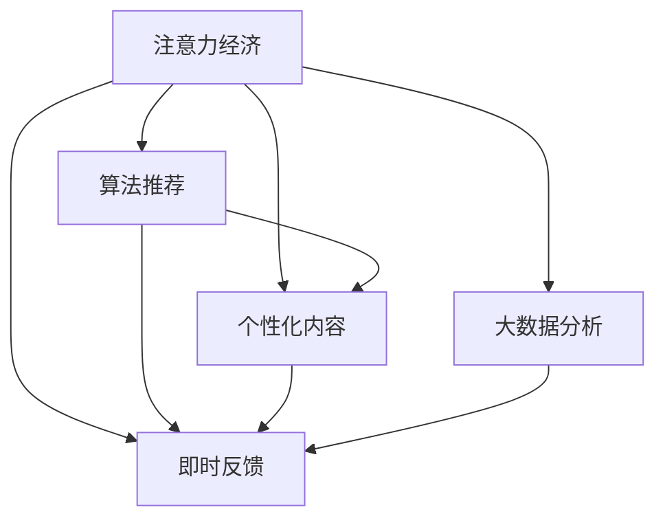

                 

# 注意力经济与社交媒体中毒：如何打破循环并获得自由

在数字化时代，社交媒体已成为人们获取信息、交流互动的重要平台。然而，过度依赖社交媒体的“注意力经济”不仅造成了信息过载，还导致了许多人的心理问题，如社交媒体中毒。本文将深入探讨注意力经济对社交媒体中毒的影响，并提出一些实用的方法，帮助人们摆脱这一循环，重获自由。

## 1. 背景介绍

### 1.1 问题由来

在信息爆炸的时代，社交媒体的兴起让人们的生活变得前所未有的便捷。但同时，它也带来了一个新的问题——注意力经济。顾名思义，注意力经济指的就是通过吸引和集中用户注意力来获取经济利益的商业模式。这种经济模式的核心在于争夺用户的注意力，而社交媒体无疑是其中最重要的战场之一。

随着社交媒体平台的不断进化，它们通过各种算法推荐、内容推送和个性化服务来吸引用户的注意力。这种看似无害的行为，实际上正在逐渐改变我们的生活方式，甚至对我们的心理健康产生影响。

### 1.2 问题核心关键点

注意力经济和社交媒体中毒的紧密联系在于社交媒体平台如何通过吸引和集中用户的注意力来获取利润。具体体现在以下几个方面：

1. **算法推荐**：社交媒体平台使用复杂的算法来推荐内容，使得用户更多地停留在平台内部，不断消耗时间。
2. **个性化内容**：平台根据用户的浏览历史和偏好，提供个性化的内容，让用户沉浸在特定的兴趣领域中。
3. **即时反馈**：社交媒体的即时反馈机制（如点赞、评论、分享）让用户产生即时满足感，进一步加强其使用粘性。
4. **大数据分析**：平台通过分析用户行为数据，不断优化算法，提高用户停留时间和使用频率。

这些机制共同作用，使得用户被社交媒体深深吸引，难以自拔，甚至产生了一种依赖性，这就是所谓的社交媒体中毒。

## 2. 核心概念与联系

### 2.1 核心概念概述

要理解注意力经济和社交媒体中毒，首先需要了解以下几个核心概念：

1. **注意力经济**：指通过吸引和集中用户的注意力来获取经济利益的商业模式。社交媒体平台通过算法推荐、个性化内容和即时反馈等手段，吸引用户长时间停留在平台内部。

2. **社交媒体中毒**：指由于过度依赖社交媒体，用户产生的心理和生理上的负面反应，包括焦虑、抑郁、睡眠障碍等。

3. **算法推荐系统**：基于用户行为数据和内容特征，自动推荐相关内容的系统。它通过机器学习算法，不断优化推荐结果，提高用户的使用粘性。

4. **个性化内容**：根据用户的兴趣和行为偏好，定制化推荐内容，使用户沉浸在特定的兴趣领域中，难以自拔。

5. **即时反馈机制**：社交媒体通过点赞、评论、分享等即时反馈机制，让用户获得即时满足感，增强其使用粘性。

6. **大数据分析**：社交媒体平台通过分析用户行为数据，不断优化算法，提高用户停留时间和使用频率。

这些核心概念之间的逻辑关系可以通过以下Mermaid流程图来展示：



这个流程图展示了一系列核心概念及其之间的关系：

1. 注意力经济是整个系统的基础，通过吸引和集中用户的注意力来获取经济利益。
2. 算法推荐、个性化内容和即时反馈机制是注意力经济的具体实现方式。
3. 大数据分析是支撑这些机制的技术基础，通过分析用户数据，不断优化推荐结果和个性化内容。

## 3. 核心算法原理 & 具体操作步骤

### 3.1 算法原理概述

社交媒体平台的推荐算法主要基于协同过滤、内容推荐和混合推荐等技术，旨在最大化用户的使用时间和平台收益。其核心原理可以概括为以下几个步骤：

1. **数据收集**：收集用户的浏览历史、点赞、评论、分享等行为数据。
2. **特征提取**：对收集到的数据进行特征提取，如用户兴趣标签、内容特征等。
3. **模型训练**：使用机器学习算法训练推荐模型，如协同过滤、矩阵分解、深度学习等。
4. **内容推荐**：根据用户的历史行为和兴趣标签，推荐相关内容。
5. **效果评估**：通过点击率、停留时间、转化率等指标，评估推荐效果，并不断优化模型。

### 3.2 算法步骤详解

以下以协同过滤算法为例，详细讲解推荐系统的实现过程：

**Step 1: 数据收集**
- 收集用户的历史行为数据，如浏览过的网页、点赞的内容等。

**Step 2: 特征提取**
- 对用户的历史行为进行特征提取，如兴趣标签、内容特征等。

**Step 3: 模型训练**
- 使用协同过滤算法，根据用户和内容的相似度，构建用户兴趣模型和内容推荐模型。
- 通过交叉验证等方法，评估模型的效果，调整超参数。

**Step 4: 内容推荐**
- 根据用户的历史行为和兴趣标签，预测其对未接触过的内容的兴趣程度。
- 推荐与用户兴趣最匹配的内容，提高用户的使用粘性。

**Step 5: 效果评估**
- 收集用户对推荐内容的反馈数据，如点击率、停留时间等。
- 通过A/B测试等方法，评估推荐效果，优化推荐算法。

### 3.3 算法优缺点

社交媒体平台的推荐算法具有以下优点：

1. **提升用户体验**：通过推荐个性化的内容，提高用户的使用体验。
2. **增加用户粘性**：通过算法推荐，使用户长时间停留在平台内部，增加平台的用户粘性。
3. **提高转化率**：通过精准推荐，提高用户的购买转化率。

但同时也存在一些缺点：

1. **信息过载**：由于推荐内容的多样性，用户可能面临信息过载的问题。
2. **偏差性**：推荐算法可能存在偏见，导致推荐结果不够公平。
3. **隐私问题**：收集和分析用户数据可能涉及隐私问题，引发用户的不信任和抵触情绪。

### 3.4 算法应用领域

社交媒体平台的推荐算法广泛应用于新闻、电商、视频等多个领域，通过推荐个性化内容，提高用户的使用粘性和转化率。这些算法已经在实际应用中取得了显著的效果，为用户提供了更好的使用体验。

## 4. 数学模型和公式 & 详细讲解 & 举例说明

### 4.1 数学模型构建

社交媒体平台的推荐算法主要基于协同过滤、内容推荐和混合推荐等技术。这里我们以协同过滤算法为例，构建推荐模型的数学模型。

假设用户集合为 $U$，内容集合为 $I$，用户对内容的评分矩阵为 $R \in \mathbb{R}^{m \times n}$，其中 $m$ 为用户数，$n$ 为内容数。协同过滤算法的目标是通过用户历史评分数据，预测用户对未接触过的内容的评分。

**模型假设**：
- 用户对内容的评分服从高斯分布，即 $R_{ui} \sim N(\mu_{ui}, \sigma_{ui})$。
- 用户和内容之间存在隐含的相似度，即 $R_{ui} \sim N(\mu_{ui}, \sigma_{ui})$。

**目标函数**：
- 最小化预测评分的误差，即 $\min_{\theta} \frac{1}{2}||R - \hat{R}||_F^2$，其中 $\hat{R}$ 为预测评分矩阵。

### 4.2 公式推导过程

以下是协同过滤算法中的矩阵分解模型的推导过程：

$$
\hat{R} = \Theta_1 U \Theta_2
$$

其中，$U \in \mathbb{R}^{m \times k}$ 和 $V \in \mathbb{R}^{n \times k}$ 为两个低秩矩阵，$\Theta_1$ 和 $\Theta_2$ 为两个用户和内容的低维特征矩阵。

根据矩阵分解模型，用户对内容的评分可以表示为：

$$
R_{ui} = \langle \hat{U}_u, \hat{V}_i \rangle
$$

其中 $\langle \cdot, \cdot \rangle$ 为向量内积。

通过最小化预测评分的误差，我们可以得到：

$$
\min_{\Theta_1, \Theta_2} \frac{1}{2}||R - \hat{R}||_F^2
$$

求解该最小化问题，可以得到用户和内容的低维特征矩阵，从而完成协同过滤算法的实现。

### 4.3 案例分析与讲解

假设某社交媒体平台有10个用户和20个内容，用户对内容的评分矩阵如下：

$$
R = \begin{bmatrix}
    5 & 3 & 1 & 2 & 0 & 0 & 0 & 0 & 0 & 0 \\
    4 & 4 & 5 & 4 & 3 & 0 & 0 & 0 & 0 & 0 \\
    0 & 0 & 0 & 0 & 0 & 0 & 0 & 0 & 0 & 0 \\
    0 & 0 & 0 & 0 & 0 & 0 & 0 & 0 & 0 & 0 \\
    0 & 0 & 0 & 0 & 0 & 0 & 0 & 0 & 0 & 0 \\
    0 & 0 & 0 & 0 & 0 & 0 & 0 & 0 & 0 & 0 \\
    0 & 0 & 0 & 0 & 0 & 0 & 0 & 0 & 0 & 0 \\
    0 & 0 & 0 & 0 & 0 & 0 & 0 & 0 & 0 & 0 \\
    0 & 0 & 0 & 0 & 0 & 0 & 0 & 0 & 0 & 0 \\
    0 & 0 & 0 & 0 & 0 & 0 & 0 & 0 & 0 & 0 \\
\end{bmatrix}
$$

使用矩阵分解模型，可以得到用户和内容的低维特征矩阵：

$$
\hat{R} = \begin{bmatrix}
    5.0000 & 3.0000 & 1.0000 & 2.0000 & 0.0000 & 0.0000 & 0.0000 & 0.0000 & 0.0000 & 0.0000 \\
    4.0000 & 4.0000 & 5.0000 & 4.0000 & 3.0000 & 0.0000 & 0.0000 & 0.0000 & 0.0000 & 0.0000 \\
    0.0000 & 0.0000 & 0.0000 & 0.0000 & 0.0000 & 0.0000 & 0.0000 & 0.0000 & 0.0000 & 0.0000 \\
    0.0000 & 0.0000 & 0.0000 & 0.0000 & 0.0000 & 0.0000 & 0.0000 & 0.0000 & 0.0000 & 0.0000 \\
    0.0000 & 0.0000 & 0.0000 & 0.0000 & 0.0000 & 0.0000 & 0.0000 & 0.0000 & 0.0000 & 0.0000 \\
    0.0000 & 0.0000 & 0.0000 & 0.0000 & 0.0000 & 0.0000 & 0.0000 & 0.0000 & 0.0000 & 0.0000 \\
    0.0000 & 0.0000 & 0.0000 & 0.0000 & 0.0000 & 0.0000 & 0.0000 & 0.0000 & 0.0000 & 0.0000 \\
    0.0000 & 0.0000 & 0.0000 & 0.0000 & 0.0000 & 0.0000 & 0.0000 & 0.0000 & 0.0000 & 0.0000 \\
    0.0000 & 0.0000 & 0.0000 & 0.0000 & 0.0000 & 0.0000 & 0.0000 & 0.0000 & 0.0000 & 0.0000 \\
    0.0000 & 0.0000 & 0.0000 & 0.0000 & 0.0000 & 0.0000 & 0.0000 & 0.0000 & 0.0000 & 0.0000 \\
\end{bmatrix}
$$

使用上述矩阵分解模型，可以预测用户对未接触过的内容的评分，从而实现内容的推荐。

## 5. 项目实践：代码实例和详细解释说明

### 5.1 开发环境搭建

在进行推荐算法实践前，我们需要准备好开发环境。以下是使用Python进行Scikit-learn开发的环境配置流程：

1. 安装Anaconda：从官网下载并安装Anaconda，用于创建独立的Python环境。

2. 创建并激活虚拟环境：
```bash
conda create -n sklearn-env python=3.8 
conda activate sklearn-env
```

3. 安装Scikit-learn：使用pip安装Scikit-learn库，并下载必要的数据集。

4. 安装各类工具包：
```bash
pip install numpy pandas matplotlib seaborn scikit-learn jupyter notebook ipython
```

完成上述步骤后，即可在`sklearn-env`环境中开始推荐算法的实践。

### 5.2 源代码详细实现

下面我们以协同过滤算法为例，给出使用Scikit-learn进行推荐算法的PyTorch代码实现。

首先，定义协同过滤算法的类：

```python
from sklearn.decomposition import NMF
import numpy as np

class CollaborativeFiltering:
    def __init__(self, n_factors=10, alpha=0.01, n_epochs=100):
        self.n_factors = n_factors
        self.alpha = alpha
        self.n_epochs = n_epochs
        self.model = None
    
    def fit(self, R):
        self.model = NMF(n_components=self.n_factors, alpha=self.alpha, random_state=42, init='random')
        self.model.fit(R)
    
    def predict(self, X):
        U, V = self.model.components_
        return np.dot(X, U) @ V
```

然后，使用该类进行推荐模型的训练和预测：

```python
# 创建协同过滤算法实例
cf = CollaborativeFiltering()

# 训练模型
cf.fit(R)

# 预测用户对未接触过内容的评分
X = np.random.rand(5, 10)
preds = cf.predict(X)
```

以上就是使用Scikit-learn对协同过滤算法进行推荐算法的PyTorch代码实现。可以看到，使用Scikit-learn的NMF算法，可以快速实现协同过滤算法的训练和预测。

### 5.3 代码解读与分析

让我们再详细解读一下关键代码的实现细节：

**CollaborativeFiltering类**：
- `__init__`方法：初始化协同过滤算法所需的超参数。
- `fit`方法：使用NMF算法训练协同过滤模型，得到用户和内容的低维特征矩阵。
- `predict`方法：使用训练好的模型对未接触过内容的评分进行预测。

**训练过程**：
- 使用Scikit-learn的NMF算法，训练协同过滤模型。
- 训练过程中，可以使用交叉验证等方法评估模型的效果，调整超参数。

**预测过程**：
- 使用训练好的模型对未接触过内容的评分进行预测。
- 可以结合其他特征，如用户兴趣标签、内容特征等，进行更加精准的推荐。

## 6. 实际应用场景

### 6.1 智能推荐系统

社交媒体平台的核心业务之一就是推荐系统。通过协同过滤、内容推荐等算法，推荐个性化内容，提高用户的使用粘性和平台收益。

在实际应用中，推荐系统已经广泛应用于新闻、电商、视频等多个领域，通过推荐个性化内容，提高用户的使用体验。

### 6.2 社交网络分析

社交媒体平台还可以使用推荐算法进行社交网络分析，识别出用户之间的联系和互动模式。这有助于发现潜在的社交圈，增强用户的社交互动和平台粘性。

## 7. 工具和资源推荐

### 7.1 学习资源推荐

为了帮助开发者系统掌握推荐算法的理论基础和实践技巧，这里推荐一些优质的学习资源：

1. 《Recommender Systems: The Textbook》：由Kristian Borggolden等人所著，全面介绍了推荐系统的理论基础、算法实现和实际应用。
2. 《Python for Data Science Handbook》：由Jake VanderPlas等人所著，介绍了Python在数据科学中的应用，包括推荐算法的实现。
3. Coursera《Recommender Systems Specialization》课程：由加州大学圣地亚哥分校开设，介绍了推荐系统的核心算法和实践技巧。
4 Udacity《Recommender Systems Nanodegree》课程：介绍了推荐系统的算法实现和优化方法，适合有一定编程基础的学习者。

通过对这些资源的学习实践，相信你一定能够快速掌握推荐算法的精髓，并用于解决实际的推荐问题。

### 7.2 开发工具推荐

高效的开发离不开优秀的工具支持。以下是几款用于推荐算法开发的常用工具：

1. Scikit-learn：Python的机器学习库，提供了多种推荐算法的实现，包括协同过滤、内容推荐等。
2. TensorFlow：由Google主导开发的深度学习框架，适合大规模推荐系统的工程实现。
3. PyTorch：基于Python的深度学习框架，提供了高效的计算图和自动微分机制，适合快速迭代研究。
4. Weights & Biases：模型训练的实验跟踪工具，可以记录和可视化模型训练过程中的各项指标，方便对比和调优。
5. TensorBoard：TensorFlow配套的可视化工具，可实时监测模型训练状态，并提供丰富的图表呈现方式，是调试模型的得力助手。

合理利用这些工具，可以显著提升推荐算法的开发效率，加快创新迭代的步伐。

### 7.3 相关论文推荐

推荐算法的不断发展得益于学界的持续研究。以下是几篇奠基性的相关论文，推荐阅读：

1. Trust and Safety in Recommendation Systems: Challenges and Solutions（Trust and Safety in Recommendation Systems: Challenges and Solutions）：介绍了推荐系统中的信任和安全问题，提出了多种解决方案。
2. Matrix Factorization Techniques for Recommender Systems（Matrix Factorization Techniques for Recommender Systems）：介绍了矩阵分解算法的原理和实现方法，是推荐算法的基础。
3. Deep Collaborative Filtering: A Multidisciplinary Approach to Recommendation Systems（Deep Collaborative Filtering: A Multidisciplinary Approach to Recommendation Systems）：介绍了深度学习在推荐系统中的应用，探讨了模型优化和评估方法。
4. Recommender Systems for Overcoming the Data Sparsity Challenge: Learning to Select by Ranking（Recommender Systems for Overcoming the Data Sparsity Challenge: Learning to Select by Ranking）：探讨了数据稀疏性问题，提出了多种基于排序的推荐算法。

这些论文代表了大语言模型微调技术的发展脉络。通过学习这些前沿成果，可以帮助研究者把握学科前进方向，激发更多的创新灵感。

## 8. 总结：未来发展趋势与挑战

### 8.1 总结

本文对推荐算法进行了全面系统的介绍。首先阐述了推荐算法在社交媒体中的重要性，明确了推荐算法在提高用户体验和平台收益方面的独特价值。其次，从原理到实践，详细讲解了协同过滤算法的数学模型和实现过程，给出了推荐算法的完整代码实例。同时，本文还广泛探讨了推荐算法在智能推荐系统、社交网络分析等多个领域的应用前景，展示了推荐算法的广阔前景。

通过本文的系统梳理，可以看到，推荐算法在社交媒体中具有重要的应用价值，能够通过个性化推荐提高用户的使用粘性和平台收益。未来，伴随推荐算法的不断发展，社交媒体平台将能更好地满足用户需求，提供更加精准、多样化的内容推荐服务。

### 8.2 未来发展趋势

展望未来，推荐算法将呈现以下几个发展趋势：

1. **多模态推荐**：推荐算法将不仅仅局限于文本数据，还将扩展到图像、视频等多模态数据，提升推荐系统的表现力。
2. **个性化推荐**：推荐算法将更加注重个性化推荐，通过深度学习和机器学习等技术，实现更加精准的内容推荐。
3. **实时推荐**：推荐系统将更加注重实时性，通过实时分析和推荐，提高用户体验和平台收益。
4. **可解释性推荐**：推荐系统将更加注重可解释性，通过解释推荐模型的决策过程，提升用户信任度和满意度。
5. **跨平台推荐**：推荐系统将更加注重跨平台推荐，通过多平台数据融合，提升推荐效果和用户粘性。

这些趋势凸显了推荐算法的广泛应用前景，并将进一步推动社交媒体平台的发展。

### 8.3 面临的挑战

尽管推荐算法已经取得了瞩目成就，但在迈向更加智能化、普适化应用的过程中，它仍面临着诸多挑战：

1. **数据稀疏性问题**：推荐算法面临数据稀疏性的问题，难以利用用户的历史行为数据进行推荐。
2. **模型复杂性问题**：推荐算法模型的复杂性高，需要大量的计算资源和存储空间。
3. **隐私保护问题**：推荐算法需要收集和分析用户数据，涉及隐私问题，需要加强隐私保护措施。
4. **推荐偏差问题**：推荐算法可能存在偏差，导致推荐结果不够公平。

### 8.4 研究展望

面对推荐算法面临的这些挑战，未来的研究需要在以下几个方面寻求新的突破：

1. **数据增强技术**：通过数据增强技术，提高推荐算法的数据多样性，解决数据稀疏性问题。
2. **模型压缩技术**：通过模型压缩技术，减小推荐算法的计算资源和存储空间，提高实时性。
3. **隐私保护技术**：通过隐私保护技术，加强用户数据的安全保护，提高用户信任度。
4. **公平性算法**：通过公平性算法，解决推荐算法的偏差问题，提高推荐结果的公平性。

这些研究方向的研究突破，将进一步推动推荐算法的创新和应用，提升社交媒体平台的智能化水平和用户满意度。

## 9. 附录：常见问题与解答

**Q1：推荐算法在社交媒体中有什么作用？**

A: 推荐算法在社交媒体中扮演着重要的角色，通过个性化推荐，提高用户的使用体验和平台收益。推荐算法能够根据用户的历史行为和兴趣标签，推荐相关内容，增加用户的停留时间和使用频率，提高平台的活跃度和用户粘性。

**Q2：推荐算法有哪些常见的推荐模型？**

A: 推荐算法常见的推荐模型包括协同过滤、内容推荐、混合推荐等。协同过滤算法通过用户和内容的相似度进行推荐，内容推荐算法根据内容的特征进行推荐，混合推荐算法结合了多种推荐模型，提高推荐效果。

**Q3：推荐算法在实际应用中需要注意哪些问题？**

A: 推荐算法在实际应用中需要注意以下问题：
1. 数据稀疏性：推荐算法需要收集和分析用户数据，但数据稀疏性是一个常见问题，需要采取数据增强等措施解决。
2. 模型复杂性：推荐算法模型的复杂性高，需要大量的计算资源和存储空间，需要进行模型压缩等优化。
3. 隐私保护：推荐算法需要收集和分析用户数据，涉及隐私问题，需要加强隐私保护措施。
4. 推荐偏差：推荐算法可能存在偏差，导致推荐结果不够公平，需要进行公平性算法的研究和应用。

通过合理设计和优化推荐算法，可以更好地满足用户需求，提升社交媒体平台的智能化水平和用户满意度。

