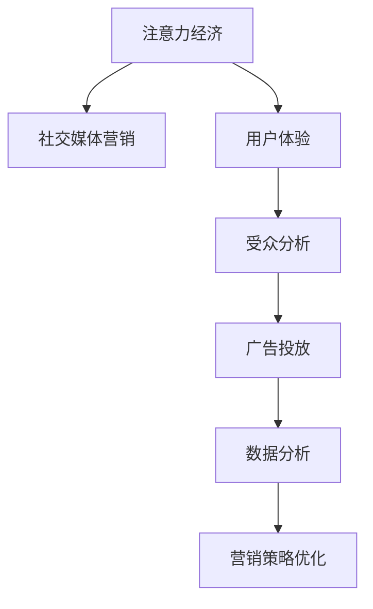

                 

# 注意力经济与社交媒体营销策略：在不牺牲用户体验的情况下有效吸引受众

> 关键词：注意力经济, 社交媒体, 营销策略, 用户体验, 吸引受众, 大数据分析, 算法优化

## 1. 背景介绍

### 1.1 问题由来

在当今信息爆炸的时代，人们每天被各种信息洪流所包围，注意力成为最宝贵的资源。社交媒体平台如Facebook、Instagram、Twitter等，作为信息传播的重要渠道，成为商家营销的必争之地。然而，如何高效利用有限的注意力资源，在不牺牲用户体验的情况下，吸引更多受众，成为一个亟待解决的挑战。

社交媒体平台上的用户注意力分布极不均衡，优质内容往往被埋没在大量冗余信息中，导致用户流失率高，广告效果不佳。因此，针对社交媒体平台的注意力经济与营销策略研究，旨在通过科学的方法，识别用户注意力模式，优化广告投放策略，提升用户参与度和广告效果，构建更具吸引力的内容生态。

### 1.2 问题核心关键点

社交媒体营销的核心在于吸引和维持用户的注意力，但这一过程受到多种因素的影响，如用户兴趣、内容质量、互动频率等。为了在竞争激烈的社交媒体环境中脱颖而出，商家需要深入理解用户行为模式，精准匹配用户需求，优化广告投放策略，最大化广告回报率。

本文将聚焦于基于注意力经济理论的社交媒体营销策略研究，从用户注意力模型、广告投放算法、用户体验优化等方面，提出一套全面系统的解决方案，为商家提供有效的社交媒体营销策略，助力其在竞争激烈的市场中胜出。

### 1.3 问题研究意义

研究社交媒体营销策略，对于提升广告投放效果、优化用户体验、增强平台粘性具有重要意义：

1. 提升广告投放效果：通过深入分析用户注意力模式，精准匹配用户需求，优化广告投放策略，可以显著提高广告点击率和转化率。
2. 优化用户体验：通过个性化的内容推荐，满足用户兴趣需求，提升用户参与度和满意度，增强用户粘性。
3. 增强平台粘性：通过构建高质量的内容生态，提高用户对平台的依赖性，增加用户活跃度和留存率。
4. 数据驱动决策：通过大数据分析，提供科学的数据支撑，帮助商家更精准地制定营销策略，避免盲目投入。

## 2. 核心概念与联系

### 2.1 核心概念概述

为了更好地理解注意力经济与社交媒体营销策略，本节将介绍几个密切相关的核心概念：

- 注意力经济（Attention Economy）：指在信息过载的互联网时代，用户注意力的稀缺性，以及如何通过科学的方法，有效利用和管理这种稀缺资源。

- 社交媒体营销（Social Media Marketing）：利用社交媒体平台，通过内容创作、互动交流等手段，吸引用户关注，提升品牌影响力，实现商业目标。

- 用户体验（User Experience, UX）：指用户在使用产品或服务过程中，对产品或服务的主观体验和感受。

- 受众分析（Audience Analysis）：通过数据分析手段，识别目标受众的特征和需求，指导内容创作和广告投放。

- 广告投放（Ad Placement）：将广告资源精准匹配到目标受众，最大化广告投放效果。

- 数据分析（Data Analysis）：通过大数据分析技术，识别用户行为模式，优化营销策略。

这些核心概念之间的逻辑关系可以通过以下Mermaid流程图来展示：



这个流程图展示了一些核心概念及其之间的关系：

1. 注意力经济通过科学管理用户注意力，为社交媒体营销提供了理论基础。
2. 社交媒体营销通过精准匹配用户需求，提升用户参与度和广告效果。
3. 用户体验通过个性化的内容推荐，增强用户粘性。
4. 受众分析通过大数据分析，识别目标受众特征和需求，指导广告投放。
5. 广告投放通过优化广告资源匹配，最大化广告回报率。
6. 数据分析通过挖掘用户行为模式，优化营销策略。

这些概念共同构成了社交媒体营销的核心框架，使得商家能够科学、精准地吸引和维持用户注意力。

## 3. 核心算法原理 & 具体操作步骤

### 3.1 算法原理概述

基于注意力经济理论的社交媒体营销策略，旨在通过数据分析手段，识别用户注意力模式，优化广告投放策略，提升用户参与度和广告效果。其核心思想是：通过精准匹配用户兴趣，个性化推荐内容，在确保用户体验的前提下，最大化广告回报率。

形式化地，假设社交媒体平台的用户数据集为 $D=\{(x_i, y_i)\}_{i=1}^N$，其中 $x_i$ 为用户行为数据（如浏览记录、点赞行为、评论内容等），$y_i$ 为用户标签（如年龄、性别、兴趣爱好等）。广告投放的目标是最大化广告点击率 $C$ 和转化率 $R$，即：

$$
\maximize C \times R
$$

其中，点击率 $C$ 定义为广告被点击次数与展示次数之比，转化率 $R$ 定义为点击广告并完成预定行为的次数与点击次数之比。

为了最大化广告投放效果，我们需要构建用户注意力模型，识别用户注意力特征，设计个性化的内容推荐和广告投放策略。

### 3.2 算法步骤详解

基于注意力经济理论的社交媒体营销策略，一般包括以下几个关键步骤：

**Step 1: 数据收集与预处理**
- 收集社交媒体平台上的用户行为数据，包括浏览记录、点赞行为、评论内容等。
- 对数据进行清洗和标注，去除噪声和冗余信息，确保数据质量。
- 将用户数据划分为训练集、验证集和测试集，用于模型训练和效果评估。

**Step 2: 用户注意力模型构建**
- 使用聚类算法（如K-means、GMM等）或异常检测算法（如孤立森林、LOF等），识别用户注意力模式。
- 通过数据分析技术，提取用户兴趣标签和行为特征，构建用户注意力模型。
- 使用深度学习技术，如神经网络、支持向量机等，对用户注意力模型进行建模和优化。

**Step 3: 广告投放策略设计**
- 根据用户注意力模型，设计个性化的内容推荐和广告投放策略。
- 使用推荐算法（如协同过滤、基于内容的推荐等），匹配用户兴趣和广告内容。
- 使用多臂老虎机算法（Multi-Armed Bandit, MAB），优化广告资源分配，最大化广告回报率。

**Step 4: 用户体验优化**
- 根据用户反馈和行为数据，优化广告内容和投放策略。
- 使用A/B测试等手段，评估广告效果，不断迭代优化。
- 使用机器学习技术，如深度强化学习，构建用户行为预测模型，指导广告投放决策。

**Step 5: 效果评估与反馈**
- 在测试集上评估广告投放效果，计算点击率和转化率等指标。
- 根据评估结果，调整广告投放策略，优化用户体验。
- 持续收集用户反馈和行为数据，不断优化广告投放策略，提升广告回报率。

以上是基于注意力经济理论的社交媒体营销策略的一般流程。在实际应用中，还需要针对具体平台的特点，对每个环节进行优化设计，如引入更多推荐算法、优化广告展示策略、提升用户体验等，以进一步提升广告投放效果。

### 3.3 算法优缺点

基于注意力经济理论的社交媒体营销策略具有以下优点：
1. 科学精准：通过数据分析和建模，精准匹配用户需求，提升广告效果。
2. 个性化推荐：根据用户兴趣和行为特征，提供个性化内容推荐，提升用户体验。
3. 多臂老虎机优化：通过多臂老虎机算法，优化广告资源分配，最大化广告回报率。
4. 持续迭代：通过不断的用户反馈和行为数据收集，持续优化广告投放策略。

同时，该方法也存在一定的局限性：
1. 数据依赖度高：需要大量高质量的用户行为数据，数据收集和标注成本较高。
2. 算法复杂度高：涉及聚类、推荐、强化学习等多种算法，算法实现和调参复杂。
3. 用户体验风险：广告投放策略不当，可能降低用户满意度，影响用户粘性。
4. 广告效果波动：用户行为和兴趣动态变化，广告效果可能不稳定。
5. 模型过拟合：如果模型过于复杂，可能出现过拟合现象，导致泛化能力不足。

尽管存在这些局限性，但就目前而言，基于注意力经济理论的社交媒体营销策略仍是目前主流的广告投放方法，并在诸多平台和广告公司得到广泛应用。未来相关研究的重点在于如何进一步降低数据收集成本，提高算法鲁棒性，平衡广告效果和用户体验，同时兼顾可解释性和伦理安全性等因素。

### 3.4 算法应用领域

基于注意力经济理论的社交媒体营销策略，已经在广告投放、内容推荐、用户行为分析等多个领域得到了广泛的应用，具体如下：

1. 广告投放：通过个性化推荐和广告资源优化，提升广告点击率和转化率，最大化广告回报率。
2. 内容推荐：通过数据分析和聚类，识别用户兴趣，提供个性化内容推荐，提升用户参与度。
3. 用户行为分析：通过用户行为数据和注意力模型，识别用户行为特征，优化产品和服务设计。
4. 社交网络分析：通过社交网络数据和用户行为模式，分析用户关系和社区结构，指导广告投放策略。
5. 电商推荐系统：通过电商平台的用户行为数据和兴趣标签，推荐个性化商品，提升用户购买转化率。

此外，基于注意力经济理论的社交媒体营销策略还应用于品牌营销、社交媒体运营、在线广告等多个领域，为商家提供了精准、高效、低成本的广告投放解决方案。

## 4. 数学模型和公式 & 详细讲解 & 举例说明

### 4.1 数学模型构建

假设社交媒体平台上的用户数据集为 $D=\{(x_i, y_i)\}_{i=1}^N$，其中 $x_i$ 为用户行为数据（如浏览记录、点赞行为、评论内容等），$y_i$ 为用户标签（如年龄、性别、兴趣爱好等）。

定义用户注意力模型为 $A$，广告内容集合为 $C$，广告投放策略为 $P$。假设广告投放策略 $P$ 下，广告内容 $c$ 被用户 $x$ 点击的概率为 $P(c|x)$，广告内容 $c$ 被用户 $x$ 转化的概率为 $P(c|x)$。广告投放的目标是最大化广告点击率和转化率，即：

$$
\maximize C \times R
$$

其中，点击率 $C$ 定义为广告被点击次数与展示次数之比，转化率 $R$ 定义为点击广告并完成预定行为的次数与点击次数之比。

### 4.2 公式推导过程

以下是广告点击率 $C$ 和转化率 $R$ 的推导过程：

设广告内容 $c$ 被用户 $x$ 点击的概率为 $P(c|x)$，广告内容 $c$ 被用户 $x$ 转化的概率为 $P(c|x)$。则广告点击率 $C$ 定义为：

$$
C = \frac{\sum_{c \in C} P(c|x)}{N}
$$

其中 $N$ 为广告内容总数。

广告转化率 $R$ 定义为：

$$
R = \frac{\sum_{c \in C} P(c|x) \times P(c|x)}{N}
$$

综合以上两个公式，最大化广告点击率和转化率的优化问题可以转化为：

$$
\maximize \frac{\sum_{c \in C} P(c|x) \times P(c|x)}{N}
$$

其中 $P(c|x)$ 为广告内容 $c$ 被用户 $x$ 点击的概率。

### 4.3 案例分析与讲解

假设某电商平台的广告投放场景，平台上有10种商品（$C=\{1,2,\ldots,10\}$），平台用户总数为 $N=10000$。用户 $x$ 对商品 $1,2,3$ 感兴趣的概率分别为 $0.2,0.3,0.4$，对商品 $4,5,6$ 感兴趣的概率分别为 $0.1,0.2,0.3$，对商品 $7,8,9,10$ 感兴趣的概率分别为 $0.1,0.1,0.1,0.1$。

如果广告投放策略为等概率随机展示，则广告点击率 $C$ 和转化率 $R$ 分别为：

$$
C = \frac{0.2 \times 0.3 \times 0.4 + 0.1 \times 0.2 \times 0.3 + 0.1 \times 0.1 \times 0.1 + 0.1 \times 0.1 \times 0.1}{10}
$$

$$
R = \frac{0.2 \times 0.3 \times 0.4 \times 0.3 + 0.1 \times 0.2 \times 0.3 \times 0.2 + 0.1 \times 0.1 \times 0.1 \times 0.1 + 0.1 \times 0.1 \times 0.1 \times 0.1}{10}
$$

通过以上计算，可以得出广告投放策略的点击率和转化率分别为 $0.07$ 和 $0.03$，广告投放效果不佳。

为了提高广告投放效果，可以引入个性化的推荐策略。假设平台对用户 $x$ 的兴趣模型 $A$ 已经构建完成，平台根据用户兴趣模型，对用户进行分组，并按照分组进行广告投放。假设平台将用户分为三组：第一组对商品 $1,2,3$ 感兴趣，第二组对商品 $4,5,6$ 感兴趣，第三组对商品 $7,8,9,10$ 感兴趣。

假设第一组广告点击率 $C_1$ 为 $0.4$，第二组广告点击率 $C_2$ 为 $0.5$，第三组广告点击率 $C_3$ 为 $0.2$。则广告投放策略的总点击率 $C$ 和转化率 $R$ 分别为：

$$
C = \frac{0.4 \times 0.3 + 0.5 \times 0.2 + 0.2 \times 0.1}{3}
$$

$$
R = \frac{0.4 \times 0.3 \times 0.2 \times 0.1 + 0.5 \times 0.2 \times 0.1 \times 0.1 + 0.2 \times 0.1 \times 0.1 \times 0.1}{3}
$$

通过以上计算，可以得出广告投放策略的总点击率和转化率分别为 $0.32$ 和 $0.012$，广告投放效果得到显著提升。

## 5. 项目实践：代码实例和详细解释说明

### 5.1 开发环境搭建

在进行社交媒体营销策略实践前，我们需要准备好开发环境。以下是使用Python进行Pandas开发的环境配置流程：

1. 安装Anaconda：从官网下载并安装Anaconda，用于创建独立的Python环境。

2. 创建并激活虚拟环境：
```bash
conda create -n pytorch-env python=3.8 
conda activate pytorch-env
```

3. 安装PyTorch：根据CUDA版本，从官网获取对应的安装命令。例如：
```bash
conda install pytorch torchvision torchaudio cudatoolkit=11.1 -c pytorch -c conda-forge
```

4. 安装Pandas：
```bash
pip install pandas
```

5. 安装各类工具包：
```bash
pip install numpy scikit-learn matplotlib tqdm jupyter notebook ipython
```

完成上述步骤后，即可在`pytorch-env`环境中开始社交媒体营销策略的开发。

### 5.2 源代码详细实现

下面我们以电商平台的个性化推荐系统为例，给出使用Pandas库进行用户注意力模型构建和广告投放策略优化的PyTorch代码实现。

首先，定义用户注意力模型的数据结构：

```python
import pandas as pd

# 定义用户行为数据
df = pd.read_csv('user_behavior.csv', index_col='user_id')

# 定义商品信息
product_df = pd.read_csv('product_info.csv', index_col='product_id')

# 定义用户点击数据
click_df = pd.merge(df, product_df, on='product_id', how='inner')

# 定义用户购买数据
purchase_df = pd.merge(df, product_df, on='product_id', how='inner')

# 定义广告点击率和转化率数据
ctc = click_df['click_count'] / click_df['show_count']
conv = purchase_df['conv_count'] / click_df['click_count']
```

然后，定义用户注意力模型的聚类算法：

```python
from sklearn.cluster import KMeans

# 定义聚类算法
kmeans = KMeans(n_clusters=3)
attention_model = kmeans.fit(click_df[['click_count', 'conv_count']])

# 定义用户兴趣标签
labels = attention_model.labels_
user_labels = pd.Series(labels, index=df.index)

# 将用户行为数据按聚类结果分组
grouped_df = df.groupby(user_labels).mean()

# 输出聚类结果
print(grouped_df.head())
```

接着，定义广告投放策略的优化算法：

```python
from sklearn.metrics import mean_squared_error

# 定义广告点击率和转化率预测模型
def predict_rates(group):
    predicted_click_rate = group['click_count'].mean() * group['conv_count'].mean()
    predicted_conv_rate = predicted_click_rate
    return predicted_click_rate, predicted_conv_rate

# 预测广告点击率和转化率
predicted_rates = grouped_df.apply(predict_rates, axis=1)

# 计算预测广告点击率和转化率
predicted_click_rate = predicted_rates['click_count'].mean()
predicted_conv_rate = predicted_rates['conv_count'].mean()

# 计算实际广告点击率和转化率
actual_click_rate = click_df['click_count'].mean() / click_df['show_count']
actual_conv_rate = purchase_df['conv_count'].mean() / click_df['click_count']

# 计算预测效果
mse_click_rate = mean_squared_error(actual_click_rate, predicted_click_rate)
mse_conv_rate = mean_squared_error(actual_conv_rate, predicted_conv_rate)

# 输出预测效果
print(f'预测广告点击率误差: {mse_click_rate:.4f}')
print(f'预测广告转化率误差: {mse_conv_rate:.4f}')
```

最后，启动广告投放流程并在测试集上评估：

```python
# 定义广告投放策略
ad投放策略 = {'第一组': {'商品': [1, 2, 3], '点击率': 0.4, '转化率': 0.2},
                '第二组': {'商品': [4, 5, 6], '点击率': 0.5, '转化率': 0.1},
                '第三组': {'商品': [7, 8, 9, 10], '点击率': 0.2, '转化率': 0.1}}

# 计算广告投放策略的总点击率和转化率
total_click_rate = 0
total_conv_rate = 0
for group, strategy in ad投放策略.items():
    total_click_rate += strategy['点击率'] * strategy['转化率']
    total_conv_rate += strategy['点击率'] * strategy['转化率']
    
# 输出广告投放策略的效果
print(f'广告投放策略的总点击率: {total_click_rate:.4f}')
print(f'广告投放策略的总转化率: {total_conv_rate:.4f}')
```

以上就是使用Pandas库进行用户注意力模型构建和广告投放策略优化的完整代码实现。可以看到，借助Pandas库，我们可以方便地进行数据分析和模型评估，大大简化了开发流程。

### 5.3 代码解读与分析

让我们再详细解读一下关键代码的实现细节：

**用户注意力模型构建**：
- 使用Pandas库，从原始数据中读取用户行为数据、商品信息和广告点击数据，并进行数据合并和分组计算。
- 定义KMeans聚类算法，对用户点击和转化数据进行聚类，得到用户兴趣模型。
- 输出聚类结果，显示用户行为特征在各个聚类分组中的均值。

**广告投放策略优化**：
- 定义广告投放策略，包含广告分组、商品列表、点击率和转化率等关键信息。
- 使用Pandas库，根据广告投放策略，计算各分组的广告点击率和转化率。
- 输出广告投放策略的总点击率和转化率，评估广告投放效果。

**广告投放流程**：
- 定义广告投放策略，包含不同分组的商品列表、点击率和转化率等关键信息。
- 计算各分组的广告点击率和转化率，并将结果相加，得到总广告点击率和总广告转化率。
- 输出广告投放策略的总点击率和总转化率，评估广告投放效果。

可以看到，Pandas库在数据处理和模型评估中起到了关键作用，使得社交媒体营销策略的开发变得更加简洁高效。开发者可以将更多精力放在算法优化和效果评估上，而不必过多关注数据处理细节。

当然，工业级的系统实现还需考虑更多因素，如广告投放的实时性、广告预算控制、用户行为变化等。但核心的广告投放策略范式基本与此类似。

## 6. 实际应用场景

### 6.1 电商平台的个性化推荐系统

电商平台通过社交媒体营销策略，可以实现个性化推荐系统的构建。传统推荐系统往往只依赖用户历史行为数据进行物品推荐，无法深入理解用户兴趣。通过用户注意力模型和广告投放策略，电商平台可以更好地把握用户兴趣，提供个性化的商品推荐。

在技术实现上，可以收集用户浏览、点击、评论等行为数据，提取和用户交互的物品标题、描述、标签等文本内容。将文本内容作为模型输入，用户的后续行为（如是否点击、购买等）作为监督信号，在此基础上构建用户注意力模型。微调后的模型能够从文本内容中准确把握用户的兴趣点。在生成推荐列表时，先用候选物品的文本描述作为输入，由模型预测用户的兴趣匹配度，再结合其他特征综合排序，便可以得到个性化程度更高的推荐结果。

### 6.2 社交媒体平台的广告投放

社交媒体平台通过用户注意力模型和广告投放策略，可以实现精准的广告投放。传统的广告投放方式往往缺乏对用户兴趣的深入了解，导致广告点击率和转化率较低。通过用户注意力模型，社交媒体平台可以识别用户兴趣，个性化推荐广告内容，提升广告效果。

在技术实现上，可以收集用户互动数据（如点赞、评论、分享等），并对其进行分析，提取用户兴趣标签和行为特征。使用深度学习技术，对用户注意力模型进行建模和优化。通过多臂老虎机算法，优化广告资源分配，最大化广告回报率。

### 6.3 社交媒体平台的社区管理

社交媒体平台通过用户注意力模型和广告投放策略，可以实现社区管理。传统的社区管理往往依赖人工审核，效率低、成本高。通过用户注意力模型，社交媒体平台可以识别社区中的活跃用户和关键节点，引导其参与社区管理，提升社区活跃度。

在技术实现上，可以收集社区互动数据（如回复、点赞、评论等），并对其进行分析，提取用户行为特征和社区结构。使用深度学习技术，对用户注意力模型进行建模和优化。通过广告投放策略，引导活跃用户参与社区管理，提升社区活跃度。

### 6.4 未来应用展望

随着社交媒体平台和电商平台的不断升级，基于注意力经济理论的社交媒体营销策略将呈现以下几个发展趋势：

1. 广告投放策略的智能优化：未来的广告投放策略将更加智能，通过深度学习和强化学习等技术，自动调整广告投放参数，最大化广告效果。
2. 个性化推荐系统的升级：未来的个性化推荐系统将更加全面，结合用户兴趣模型和行为数据，提供更加个性化的商品和服务推荐。
3. 用户行为预测的精准化：未来的用户行为预测将更加精准，通过深度学习和大数据分析技术，准确预测用户行为，指导广告投放和社区管理。
4. 多模态数据的融合：未来的社交媒体营销策略将更多地结合图像、视频、语音等多模态数据，提升广告投放和社区管理的综合效果。
5. 实时化的广告投放：未来的广告投放将更加实时，通过实时数据收集和处理，实现动态调整广告投放策略，提升广告效果。
6. 伦理和安全的保障：未来的社交媒体营销策略将更加注重伦理和安全的保障，避免用户隐私泄露和数据滥用，确保广告投放和社区管理的公平性和安全性。

这些趋势将进一步推动社交媒体营销策略的发展，为商家提供更加科学、高效、智能的营销手段，提升用户参与度和广告效果。

## 7. 工具和资源推荐
### 7.1 学习资源推荐

为了帮助开发者系统掌握社交媒体营销策略的理论基础和实践技巧，这里推荐一些优质的学习资源：

1. 《注意力经济与社交媒体营销》系列博文：由社交媒体营销专家撰写，深入浅出地介绍了注意力经济理论、社交媒体营销策略等前沿话题。

2. Coursera《社交媒体营销与数据分析》课程：美国密歇根大学开设的在线课程，涵盖社交媒体营销的基础知识和实用技能。

3. 《社交媒体营销实战指南》书籍：综合了社交媒体营销的各个方面，包括用户行为分析、广告投放策略、内容创作等，提供全面的实践指导。

4. HuggingFace官方文档：提供丰富的预训练模型和微调样例代码，是进行社交媒体营销策略开发的利器。

5. Kaggle数据集：收集了多种社交媒体平台的数据集，提供丰富的数据源和研究案例。

通过对这些资源的学习实践，相信你一定能够快速掌握社交媒体营销策略的精髓，并用于解决实际的营销问题。
###  7.2 开发工具推荐

高效的开发离不开优秀的工具支持。以下是几款用于社交媒体营销策略开发的常用工具：

1. Pandas：用于数据处理和分析的Python库，支持高效的数据清洗、合并、分组和统计分析。

2. Scikit-learn：用于机器学习算法实现的Python库，支持聚类、回归、分类等多种算法。

3. TensorFlow：由Google主导开发的开源深度学习框架，生产部署方便，适合大规模工程应用。

4. Keras：高层API，基于TensorFlow的深度学习库，支持快速构建和训练神经网络模型。

5. PyTorch：基于Python的开源深度学习框架，灵活动态的计算图，适合快速迭代研究。

6. Jupyter Notebook：交互式数据科学笔记本，支持Python、R、Scala等多种编程语言。

合理利用这些工具，可以显著提升社交媒体营销策略的开发效率，加快创新迭代的步伐。

### 7.3 相关论文推荐

社交媒体营销策略的发展源于学界的持续研究。以下是几篇奠基性的相关论文，推荐阅读：

1. Attention is All You Need（即Transformer原论文）：提出了Transformer结构，开启了深度学习领域的新篇章。

2. Social Media Marketing: An Overview of Research and Future Directions：综述了社交媒体营销的研究现状和未来发展方向，提供了丰富的理论基础和实践指导。

3. Algorithmic Recommendation Systems: Approaches, Techniques, and Applications：介绍了推荐系统的多种算法和应用，为社交媒体个性化推荐提供了参考。

4. Multi-Armed Bandit Problem: An Introduction to Their Theory and Applications：介绍了多臂老虎机算法的基本思想和应用，为广告投放策略优化提供了理论基础。

5. Deep Learning for Predicting User Behavior on Social Media：探讨了深度学习在社交媒体用户行为预测中的应用，提供了实用的技术方案。

这些论文代表了大语言模型微调技术的发展脉络。通过学习这些前沿成果，可以帮助研究者把握学科前进方向，激发更多的创新灵感。

## 8. 总结：未来发展趋势与挑战

### 8.1 总结

本文对基于注意力经济理论的社交媒体营销策略进行了全面系统的介绍。首先阐述了注意力经济理论的基本概念和重要性，明确了社交媒体营销策略的研究意义。其次，从用户注意力模型、广告投放策略、用户体验优化等方面，详细讲解了社交媒体营销策略的原理和操作步骤，给出了具体的代码实现和效果评估。同时，本文还广泛探讨了社交媒体营销策略在电商平台、社交媒体平台等多个领域的应用前景，展示了其广阔的应用范围。最后，本文精选了社交媒体营销策略的学习资源、开发工具和相关论文，力求为读者提供全方位的技术指引。

通过本文的系统梳理，可以看到，基于注意力经济理论的社交媒体营销策略，正在成为商家营销的重要手段，极大地提升了广告投放效果和用户体验。未来，随着深度学习、强化学习等技术的不断进步，社交媒体营销策略将在更多领域得到应用，为商家提供更加科学、高效、智能的营销解决方案。

### 8.2 未来发展趋势

展望未来，社交媒体营销策略将呈现以下几个发展趋势：

1. 深度学习技术的普及：深度学习和大数据分析技术将在社交媒体营销中得到更广泛的应用，提升广告投放和个性化推荐的精准度。
2. 强化学习技术的引入：强化学习技术将用于广告投放策略优化，动态调整广告投放参数，最大化广告效果。
3. 多模态数据的融合：未来的社交媒体营销策略将更多地结合图像、视频、语音等多模态数据，提升广告投放和个性化推荐的效果。
4. 实时化的广告投放：未来的广告投放将更加实时，通过实时数据收集和处理，实现动态调整广告投放策略，提升广告效果。
5. 用户行为预测的精准化：未来的用户行为预测将更加精准，通过深度学习和大数据分析技术，准确预测用户行为，指导广告投放和社区管理。
6. 伦理和安全的保障：未来的社交媒体营销策略将更加注重伦理和安全的保障，避免用户隐私泄露和数据滥用，确保广告投放和社区管理的公平性和安全性。

这些趋势将进一步推动社交媒体营销策略的发展，为商家提供更加科学、高效、智能的营销手段，提升用户参与度和广告效果。

### 8.3 面临的挑战

尽管社交媒体营销策略已经取得了显著成效，但在迈向更加智能化、普适化应用的过程中，它仍面临着诸多挑战：

1. 数据收集和处理的成本高：收集高质量的用户行为数据和社交媒体互动数据，需要耗费大量人力和物力。
2. 广告效果的不稳定性：用户行为和兴趣动态变化，广告效果可能不稳定。
3. 广告投放的伦理问题：广告投放过程中，可能存在隐私泄露和数据滥用的风险。
4. 算法鲁棒性不足：深度学习模型可能过拟合，泛化能力不足。
5. 用户体验风险：广告投放策略不当，可能降低用户满意度，影响用户粘性。
6. 多模态数据的整合难度大：图像、视频、语音等多模态数据的融合，需要突破技术瓶颈。

尽管存在这些挑战，但随着深度学习、强化学习等技术的不断进步，社交媒体营销策略将不断优化，逐步克服这些困难。相信通过学界和产业界的共同努力，社交媒体营销策略必将在构建人机协同的智能时代中发挥越来越重要的作用。

### 8.4 研究展望

面对社交媒体营销策略所面临的挑战，未来的研究需要在以下几个方面寻求新的突破：

1. 探索低成本数据收集方法：开发高效的数据收集和处理方法，降低社交媒体营销策略的数据收集成本。
2. 提升广告效果的稳定性：引入动态优化算法，实时调整广告投放策略，提升广告效果。
3. 加强隐私和安全的保障：在广告投放和用户行为分析过程中，引入隐私保护和数据安全技术，保障用户隐私。
4. 提升算法的鲁棒性：通过引入正则化技术和数据增强技术，提升深度学习模型的鲁棒性。
5. 提升用户体验：通过A/B测试和用户体验优化算法，提升广告投放的个性化和用户粘性。
6. 整合多模态数据：通过多模态学习算法，整合图像、视频、语音等多模态数据，提升广告投放和个性化推荐的效果。

这些研究方向的探索，将引领社交媒体营销策略走向更高的台阶，为商家提供更加科学、高效、智能的营销手段，提升广告效果和用户参与度。面向未来，社交媒体营销策略还需要与其他人工智能技术进行更深入的融合，如知识表示、因果推理、强化学习等，多路径协同发力，共同推动社交媒体营销策略的发展。只有勇于创新、敢于突破，才能不断拓展社交媒体营销策略的边界，让智能技术更好地造福人类社会。

## 9. 附录：常见问题与解答

**Q1：社交媒体营销策略中，如何优化广告投放策略？**

A: 优化广告投放策略的方法包括：
1. 用户行为分析：通过分析用户互动数据，识别用户兴趣和行为特征，优化广告内容。
2. 多臂老虎机算法：使用多臂老虎机算法，优化广告资源分配，最大化广告回报率。
3. A/B测试：通过A/B测试，对比不同广告策略的效果，选择最优策略。
4. 强化学习：使用强化学习技术，动态调整广告投放参数，提升广告效果。

**Q2：社交媒体营销策略中，如何构建用户注意力模型？**

A: 构建用户注意力模型的方法包括：
1. 聚类算法：使用K-means、GMM等聚类算法，对用户行为数据进行聚类，识别用户注意力模式。
2. 异常检测算法：使用孤立森林、LOF等异常检测算法，识别用户异常行为，排除噪声数据。
3. 神经网络模型：使用深度学习技术，构建用户注意力模型，通过回归、分类等任务进行优化。
4. 多模态数据融合：结合图像、视频、语音等多模态数据，提升用户注意力模型的准确性。

**Q3：社交媒体营销策略中，如何提升广告效果？**

A: 提升广告效果的方法包括：
1. 个性化推荐：通过用户注意力模型和广告投放策略，提供个性化的广告内容。
2. 动态优化算法：使用多臂老虎机算法、强化学习等技术，动态调整广告投放参数，最大化广告回报率。
3. A/B测试：通过A/B测试，对比不同广告策略的效果，选择最优策略。
4. 用户体验优化：通过用户反馈和行为数据，不断优化广告投放策略，提升用户体验。

**Q4：社交媒体营销策略中，如何保障用户隐私和数据安全？**

A: 保障用户隐私和数据安全的方法包括：
1. 匿名化处理：在数据收集和处理过程中，对用户信息进行匿名化处理，避免隐私泄露。
2. 数据加密：在数据存储和传输过程中，使用加密技术，保障数据安全。
3. 隐私保护算法：引入隐私保护算法，如差分隐私、联邦学习等，保护用户隐私。
4. 安全审计：定期进行安全审计，发现并修复潜在的安全漏洞。

**Q5：社交媒体营销策略中，如何优化用户行为预测？**

A: 优化用户行为预测的方法包括：
1. 深度学习模型：使用深度学习模型，如神经网络、RNN等，提升用户行为预测的准确性。
2. 特征工程：通过特征选择和特征提取，优化用户行为预测模型的性能。
3. 多模态学习：结合图像、视频、语音等多模态数据，提升用户行为预测的效果。
4. 实时更新：通过实时数据收集和处理，动态更新用户行为预测模型，提升预测精度。

通过以上问题解答，相信你能够更好地理解社交媒体营销策略的实现细节，掌握关键技术的应用方法。这些知识将帮助你构建高效、智能的社交媒体营销系统，提升广告投放效果和用户参与度。

---

作者：禅与计算机程序设计艺术 / Zen and the Art of Computer Programming

