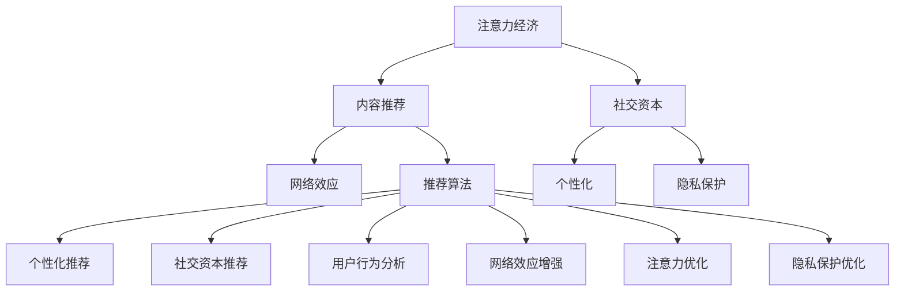

                 

# 注意力经济与社交资本的积累

> 关键词：注意力经济, 社交资本, 网络效应, 内容推荐, 个性化, 隐私保护, 数据驱动, 用户行为, 数字经济, 推荐系统, 社会网络

## 1. 背景介绍

### 1.1 问题由来
当前，全球数字经济的快速发展已对传统的商业模式和经济系统造成了深刻的影响。特别是伴随着大数据和人工智能技术的突飞猛进，新兴的互联网平台，如社交媒体、电商平台、视频网站等，正通过算法驱动的推荐系统，重塑人们的信息获取方式和消费习惯。这种基于算法的推荐系统在带来个性化服务的同时，也引发了一系列复杂的社会经济问题，包括注意力经济、社交资本积累、用户隐私保护等。

### 1.2 问题核心关键点
注意力经济和社交资本的积累，是当今数字经济时代的两个核心问题。在注意力经济中，用户对内容的注意力已成为企业竞争的宝贵资源，推荐系统通过精准推送内容，试图最大化地吸引和保持用户的注意力。而社交资本的积累，则是指用户通过互动与社交网络建立的关系网，这些关系网能够为用户带来潜在的商业机会和价值。

然而，这两大问题并非独立存在，而是相辅相成的。推荐系统通过优化用户对内容的注意力分配，进而帮助用户构建和扩大其社交资本网络。但与此同时，推荐系统的算法设计、数据使用等行为，也对用户的注意力和社交资本产生深远的影响。因此，理解并解决这些问题，是构建健康、可持续的数字生态系统的关键。

### 1.3 问题研究意义
研究注意力经济和社交资本的积累，不仅具有理论价值，更是实践中的迫切需求。对于企业和开发者而言，了解算法如何影响用户的注意力和社交资本，有助于设计更加人性化和智能化的推荐系统，提升用户体验。对于政策制定者和监管机构而言，掌握注意力经济和社交资本的运作规律，能够为其制定相应的法律法规和监管政策提供科学依据。

此外，通过揭示算法和数据驱动的经济活动对社会的影响，可以为公平、透明的数字生态系统构建提供思路，促进技术更好地服务于社会。在当今信息爆炸的时代，理解注意力经济和社交资本的积累，将有助于构建更公平、开放、可持续的数字社会。

## 2. 核心概念与联系

### 2.1 核心概念概述

本节将介绍几个核心概念，它们在注意力经济和社交资本的积累中扮演着重要角色：

- **注意力经济 (Attention Economy)**：指在数字经济时代，通过吸引和保持用户的注意力来实现商业价值的经济模式。推荐系统作为注意力经济的重要工具，通过算法优化用户对内容的关注度，提升用户体验和平台价值。

- **社交资本 (Social Capital)**：指通过社会网络和关系网络为用户带来的经济价值和商业机会。推荐系统在社交资本的积累中起着重要的中介作用，通过精准的内容推荐，帮助用户扩大社交网络和关系网络，增加社交资本价值。

- **网络效应 (Network Effect)**：指产品或服务随用户数量的增加而提升价值的现象。在推荐系统中，用户数量越多，推荐算法越能精准推送个性化内容，从而形成正向反馈，进一步吸引更多用户。

- **内容推荐 (Content Recommendation)**：通过算法识别和匹配用户兴趣，为用户提供个性化的内容推荐，是注意力经济和社交资本积累的核心技术手段。

- **个性化 (Personalization)**：根据用户的偏好、行为等数据，定制个性化的内容和推荐，提高用户满意度和黏性。

- **隐私保护 (Privacy Protection)**：在推荐系统中，用户行为和偏好数据的安全保护至关重要。必须遵守数据保护法律法规，确保用户隐私不被侵犯。

这些概念之间通过推荐系统的设计和使用形成紧密联系。推荐系统通过精准推荐个性化内容，吸引用户注意力，促进社交资本的积累。但同时，推荐系统的算法和数据处理行为，也对用户的注意力和社交资本产生深远影响。

### 2.2 核心概念原理和架构的 Mermaid 流程图



这个流程图展示了注意力经济、社交资本、网络效应、内容推荐、个性化、隐私保护等概念之间复杂的相互作用关系。推荐系统通过算法优化用户对内容的关注度（B），进而促进社交资本的积累（C），增强网络效应（D）。同时，个性化（E）和隐私保护（F）也与推荐系统的设计和使用密切相关。

## 3. 核心算法原理 & 具体操作步骤
### 3.1 算法原理概述

推荐系统的核心算法原理主要是基于协同过滤和基于内容的推荐方法。协同过滤通过分析用户行为数据，发现用户之间的相似性，进而推荐可能受用户欢迎的内容。基于内容的推荐方法则侧重于分析内容的特征，通过匹配用户偏好与内容特征进行推荐。

注意力经济和社交资本的积累，在推荐系统中主要通过以下步骤实现：

1. **用户行为数据收集**：通过用户在平台上的浏览、点击、购买等行为数据，构建用户画像。
2. **内容特征提取**：提取内容的特征，如关键词、类别、标签等，构建内容特征向量。
3. **用户兴趣匹配**：通过相似度计算，匹配用户画像与内容特征，找到最符合用户兴趣的内容。
4. **推荐排序**：对匹配结果进行排序，推荐最符合用户兴趣的内容，提升用户满意度。
5. **社交网络分析**：分析用户间的关系网络，识别关键意见领袖和社区结构，帮助用户扩大社交资本网络。

### 3.2 算法步骤详解

**Step 1: 用户行为数据收集**

推荐系统首先通过日志、点击流等手段收集用户的行为数据。这些数据通常包括：

- 浏览记录：记录用户访问过的页面或内容。
- 点击记录：记录用户点击过的链接或按钮。
- 购买记录：记录用户购买过的商品或服务。
- 评分记录：记录用户对内容的评分或反馈。

收集到的数据需经过清洗和预处理，去除噪音和异常值，构建用户行为矩阵。例如，使用用户-物品矩阵（User-Item Matrix）来表示用户对不同物品的偏好程度。

**Step 2: 内容特征提取**

推荐系统需要分析内容的特征，构建内容特征向量。通常，内容特征包括：

- 关键词：通过文本分析技术，提取内容的关键词。
- 类别：通过标签和分类器，对内容进行分类。
- 标签：通过标签标注，对内容进行标记。
- 用户反馈：通过评分和评论，了解用户对内容的满意度。

通过上述方法，可以得到内容特征向量，例如使用TF-IDF算法对文本内容进行向量化。

**Step 3: 用户兴趣匹配**

推荐系统通过相似度计算，匹配用户画像与内容特征。常用的相似度计算方法包括：

- 余弦相似度：计算用户行为向量与内容特征向量之间的余弦值。
- 皮尔逊相关系数：计算用户行为序列与内容特征序列之间的相关性。
- Jaccard相似度：计算用户行为集合与内容特征集合之间的交集与并集的比率。

通过这些相似度计算，可以找出与用户兴趣最匹配的内容。

**Step 4: 推荐排序**

推荐系统根据匹配结果，对内容进行排序，推荐最符合用户兴趣的内容。常用的排序方法包括：

- 基于用户画像的排序：通过计算用户画像与内容特征的相似度，排序推荐内容。
- 基于内容的排序：通过计算内容特征之间的相似度，排序推荐内容。
- 混合排序：结合用户画像和内容特征，进行加权排序。

推荐排序的目的是提高用户满意度，提升用户黏性。

**Step 5: 社交网络分析**

推荐系统通过分析用户间的关系网络，识别关键意见领袖和社区结构。常用的社交网络分析方法包括：

- 社交网络图：通过用户-用户关系矩阵，构建社交网络图。
- 社区发现算法：通过聚类算法，识别用户社区结构。
- 关键意见领袖识别：通过影响力分析，识别关键意见领袖。

社交网络分析有助于用户扩大社交资本网络，增强用户影响力。

### 3.3 算法优缺点

基于协同过滤和基于内容的推荐算法，有以下优缺点：

**优点：**
- **精准度**：能够精准匹配用户兴趣和内容特征，提高推荐效果。
- **可扩展性**：算法适用于大规模数据集，能够处理数亿级用户和内容。
- **灵活性**：可以结合多种数据源，构建更全面、个性化的推荐系统。

**缺点：**
- **冷启动问题**：新用户或新物品缺少行为数据，难以进行推荐。
- **数据稀疏性**：用户-物品矩阵可能存在大量缺失值，影响推荐效果。
- **隐私问题**：收集用户行为数据可能涉及隐私问题，需遵守数据保护法律法规。

### 3.4 算法应用领域

基于推荐算法原理，注意力经济和社交资本的积累在多个领域得到广泛应用，例如：

- **电商平台**：通过推荐系统，提升用户购物体验，增加用户粘性和销售额。
- **社交媒体**：通过个性化的内容推荐，提升用户参与度和社区活跃度。
- **视频平台**：通过推荐算法，提升用户观看时长和内容覆盖率。
- **新闻平台**：通过个性化推荐，提升用户阅读量和平台流量。

这些平台通过精准的推荐算法，最大化地利用用户注意力，积累社交资本，增强用户忠诚度和平台价值。

## 4. 数学模型和公式 & 详细讲解 & 举例说明

### 4.1 数学模型构建

本节将使用数学语言对推荐系统的主要模型进行更加严格的刻画。

设推荐系统中有$N$个用户，$M$个物品，用户行为矩阵为$U \in \mathbb{R}^{N \times M}$，用户行为矩阵中的每个元素$U_{i,j}$表示用户$i$对物品$j$的偏好程度。

设物品特征矩阵为$I \in \mathbb{R}^{M \times D}$，其中$D$为物品特征维度。每个物品$i$的特征向量为$I_{i,:} \in \mathbb{R}^D$。

推荐系统通过用户行为数据和物品特征数据，构建用户兴趣向量$U^*$和物品特征向量$I^*$，最终生成推荐结果$\hat{U} \in \mathbb{R}^{N \times M}$。

### 4.2 公式推导过程

**协同过滤推荐公式**：

协同过滤推荐公式基于用户-物品矩阵$U$，通过计算用户$i$和物品$j$的相似度$S_{i,j}$进行推荐。

$$
S_{i,j} = \frac{U_{i,:} \cdot I_{j,:}}{\sqrt{U_{i,:} \cdot U_{i,:} + \epsilon} \cdot \sqrt{I_{j,:} \cdot I_{j,:} + \epsilon}}
$$

其中$\epsilon$为归一化因子，避免分母为0。

**基于内容的推荐公式**：

基于内容的推荐公式基于物品特征矩阵$I$，通过计算用户兴趣向量$U^*$和物品特征向量$I^*$之间的余弦相似度$S_{i,j}$进行推荐。

$$
S_{i,j} = \frac{U_{i,:}^* \cdot I_{j,:}}{\|U_{i,:}^*\| \cdot \|I_{j,:}\|}
$$

### 4.3 案例分析与讲解

以电商平台的个性化推荐为例，推荐系统通过收集用户的历史购买记录和浏览记录，构建用户兴趣向量$U^*$。同时，收集商品的图片、描述、标签等信息，构建商品特征向量$I^*$。通过计算用户兴趣向量$U^*$和商品特征向量$I^*$之间的余弦相似度$S_{i,j}$，推荐与用户兴趣最匹配的商品。

具体实现时，可以使用矩阵分解算法（如SVD）对用户行为矩阵和物品特征矩阵进行分解，得到用户兴趣向量$U^*$和物品特征向量$I^*$。然后计算用户兴趣向量$U^*$和物品特征向量$I^*$之间的余弦相似度$S_{i,j}$，排序推荐结果$\hat{U}$。

## 5. 项目实践：代码实例和详细解释说明

### 5.1 开发环境搭建

在进行推荐系统开发前，我们需要准备好开发环境。以下是使用Python进行PyTorch开发的环境配置流程：

1. 安装Anaconda：从官网下载并安装Anaconda，用于创建独立的Python环境。

2. 创建并激活虚拟环境：
```bash
conda create -n recsys-env python=3.8 
conda activate recsys-env
```

3. 安装PyTorch：根据CUDA版本，从官网获取对应的安装命令。例如：
```bash
conda install pytorch torchvision torchaudio cudatoolkit=11.1 -c pytorch -c conda-forge
```

4. 安装Scikit-learn：
```bash
pip install scikit-learn
```

5. 安装NumPy、Pandas：
```bash
pip install numpy pandas
```

6. 安装PyTorch推荐库：
```bash
pip install torchrec
```

完成上述步骤后，即可在`recsys-env`环境中开始推荐系统开发。

### 5.2 源代码详细实现

这里我们以协同过滤推荐算法为例，给出使用PyTorch推荐库的代码实现。

```python
import torch
import torchrec

# 创建用户-物品矩阵
U = torch.tensor([[2, 0, 0, 1],
                 [0, 3, 0, 0],
                 [0, 0, 4, 0],
                 [1, 0, 0, 5]])

# 创建物品特征矩阵
I = torch.tensor([[0.8, 0.1, 0.2],
                 [0.2, 0.8, 0.1],
                 [0.1, 0.2, 0.8],
                 [0.5, 0.5, 0]])

# 构建协同过滤推荐模型
model = torchrec.models.BPR(BatchSize=2)

# 设置用户行为矩阵和物品特征矩阵
model.update_user_item(U, I)

# 进行推荐
predictions = model.predict_top_k(2)
print(predictions)
```

### 5.3 代码解读与分析

这里我们详细解读一下关键代码的实现细节：

**创建用户-物品矩阵和物品特征矩阵**：
- 使用`torch.tensor`创建用户-物品矩阵$U$和物品特征矩阵$I$，作为推荐算法的输入。

**构建协同过滤推荐模型**：
- 使用`torchrec.models.BPR`创建基于BPR的协同过滤推荐模型，其中`BatchSize`参数表示每个批次的大小。

**设置用户行为矩阵和物品特征矩阵**：
- 使用`model.update_user_item`方法，将用户行为矩阵$U$和物品特征矩阵$I$设置为推荐模型的输入。

**进行推荐**：
- 使用`model.predict_top_k`方法，对每个用户进行前$k$个推荐，输出推荐结果。

通过上述代码，可以简单地实现基于协同过滤的推荐系统。更复杂的推荐系统需要结合用户画像、内容特征、用户行为等多元数据源，进行更精细化的推荐。

## 6. 实际应用场景

### 6.1 电商推荐系统

电商推荐系统是注意力经济和社交资本积累的典型应用场景。通过收集用户的购买、浏览、评价等行为数据，构建用户画像，推荐系统可以精准推送商品，提升用户体验和销售额。同时，推荐系统通过分析用户间的互动关系，识别关键意见领袖，帮助用户扩大社交网络，增加社交资本价值。

### 6.2 社交媒体推荐系统

社交媒体推荐系统通过个性化推荐内容，提升用户参与度和社区活跃度。推荐系统根据用户的历史行为、好友关系等数据，推荐用户感兴趣的内容和用户，帮助用户扩大社交网络，增加社交资本价值。同时，社交媒体推荐系统需要考虑隐私保护，遵守数据保护法律法规。

### 6.3 视频平台推荐系统

视频平台推荐系统通过个性化推荐视频内容，提升用户观看时长和平台流量。推荐系统分析用户的历史观看记录、点击行为等数据，推荐用户感兴趣的视频内容。同时，通过分析用户间的关系网络，识别关键意见领袖，帮助用户扩大社交网络，增加社交资本价值。

### 6.4 新闻平台推荐系统

新闻平台推荐系统通过个性化推荐新闻内容，提升用户阅读量和平台流量。推荐系统根据用户的历史阅读记录、评论反馈等数据，推荐用户感兴趣的新闻内容。同时，通过分析用户间的关系网络，识别关键意见领袖，帮助用户扩大社交网络，增加社交资本价值。

## 7. 工具和资源推荐

### 7.1 学习资源推荐

为了帮助开发者系统掌握推荐系统的理论基础和实践技巧，这里推荐一些优质的学习资源：

1. 《推荐系统实战》系列博文：由大模型技术专家撰写，深入浅出地介绍了推荐系统的原理、算法和实现。

2. CS229《机器学习》课程：斯坦福大学开设的机器学习明星课程，有Lecture视频和配套作业，带你入门推荐系统。

3. 《推荐系统》书籍：知名推荐系统专家所著，全面介绍了推荐系统的各种算法和应用场景。

4. PyTorch官方文档：推荐系统的经典实现，提供了丰富的推荐算法和样例代码，是上手实践的必备资料。

5. KDD CUP：推荐系统领域重要的国际竞赛，展示了最新的推荐算法和应用实践，是学习和评估推荐系统的优秀平台。

通过对这些资源的学习实践，相信你一定能够快速掌握推荐系统的精髓，并用于解决实际的推荐问题。

### 7.2 开发工具推荐

高效的开发离不开优秀的工具支持。以下是几款用于推荐系统开发的常用工具：

1. PyTorch：基于Python的开源深度学习框架，灵活的计算图，适合快速迭代研究。推荐系统通常使用PyTorch进行实现。

2. TensorFlow：由Google主导开发的开源深度学习框架，生产部署方便，适合大规模工程应用。推荐系统在TensorFlow上也有广泛的实现。

3. PyTorch Recommendations：基于PyTorch开发的推荐系统库，集成了多种推荐算法，易于使用和调试。

4. TensorBoard：TensorFlow配套的可视化工具，可实时监测推荐系统训练状态，提供丰富的图表呈现方式，是调试推荐系统的得力助手。

5. Scikit-learn：机器学习库，提供了多种推荐算法和数据处理工具，适合数据预处理和模型评估。

合理利用这些工具，可以显著提升推荐系统开发效率，加快创新迭代的步伐。

### 7.3 相关论文推荐

推荐系统的发展源于学界的持续研究。以下是几篇奠基性的相关论文，推荐阅读：

1. BPR: Bayesian Personalized Ranking from Log-by-Log Data：提出基于贝叶斯个性化排名的推荐算法，奠定了协同过滤推荐算法的基础。

2. Factorization Machines for Recommender Systems：提出基于矩阵分解的推荐算法，提升了推荐精度和效率。

3. Matrix Factorization Techniques for Recommender Systems：总结了矩阵分解算法在推荐系统中的应用，提供了多种推荐算法和实现。

4. Attention is All You Need：提出基于自注意力机制的Transformer模型，改变了推荐系统的设计和实现方式。

5. AutoRec: Fast All-At-Once Matrix Factorization for Recommendations：提出基于矩阵分解的自适应算法，提升了推荐系统的计算效率和精度。

这些论文代表了大模型微调技术的发展脉络。通过学习这些前沿成果，可以帮助研究者把握学科前进方向，激发更多的创新灵感。

## 8. 总结：未来发展趋势与挑战

### 8.1 总结

本文对基于协同过滤和内容推荐的推荐系统进行了全面系统的介绍。首先阐述了注意力经济和社交资本的积累在推荐系统中的应用背景和研究意义，明确了推荐系统对用户注意力和社交资本的影响。其次，从原理到实践，详细讲解了推荐系统的数学模型和算法步骤，给出了推荐系统开发的完整代码实例。同时，本文还广泛探讨了推荐系统在电商、社交、视频、新闻等多个领域的应用前景，展示了推荐系统的巨大潜力。

通过本文的系统梳理，可以看到，推荐系统通过精准匹配用户兴趣和内容特征，最大化利用用户注意力，积累社交资本，增强用户忠诚度和平台价值。推荐系统作为一种强大的工具，能够在数字经济时代发挥巨大的作用，带来广泛的商业价值。

### 8.2 未来发展趋势

展望未来，推荐系统的发展将呈现以下几个趋势：

1. **深度学习模型的应用**：随着深度学习技术的成熟，推荐系统将越来越多地采用深度神经网络模型，提升推荐效果和效率。

2. **多模态数据融合**：推荐系统将不仅仅处理文本数据，还将融合图像、视频、语音等多模态数据，提升推荐系统的全面性和智能性。

3. **实时推荐**：推荐系统将实现实时推荐，根据用户实时行为数据进行动态调整，提升推荐的时效性和个性化。

4. **跨领域推荐**：推荐系统将跨领域推荐，结合不同领域的用户需求和数据特点，进行更加精准的推荐。

5. **个性化推荐算法**：推荐系统将结合多维数据源，进行更加精细化的推荐，提升推荐系统的个性化和准确性。

6. **隐私保护和公平性**：推荐系统将更加注重隐私保护和公平性，遵守数据保护法律法规，确保用户隐私和算法公平。

以上趋势凸显了推荐系统的广阔前景。这些方向的探索发展，必将进一步提升推荐系统的性能和应用范围，为数字经济带来新的机遇。

### 8.3 面临的挑战

尽管推荐系统已经取得了瞩目成就，但在迈向更加智能化、普适化应用的过程中，它仍面临着诸多挑战：

1. **冷启动问题**：新用户或新物品缺少行为数据，难以进行推荐。

2. **数据稀疏性**：用户行为矩阵可能存在大量缺失值，影响推荐效果。

3. **隐私问题**：收集用户行为数据可能涉及隐私问题，需遵守数据保护法律法规。

4. **计算复杂度**：大规模推荐系统需要处理海量数据，计算复杂度高，硬件资源需求大。

5. **公平性和可解释性**：推荐系统可能产生算法偏见，需确保算法公平性和可解释性。

6. **对抗攻击**：推荐系统可能受到对抗攻击，需提高系统鲁棒性和安全性。

这些挑战需要研究者不断探索和解决，才能构建更加健康、可持续的数字生态系统。

### 8.4 研究展望

面对推荐系统面临的挑战，未来的研究需要在以下几个方面寻求新的突破：

1. **冷启动问题**：研究如何利用用户画像、社交网络等数据，解决新用户或新物品的推荐问题。

2. **数据稀疏性**：研究如何通过插值、补全等技术，处理缺失值，提升推荐系统的完整性和准确性。

3. **隐私保护**：研究如何在推荐系统中保护用户隐私，遵守数据保护法律法规，确保用户数据安全。

4. **计算效率**：研究如何优化推荐系统的计算图和算法，提高推荐系统的计算效率和响应速度。

5. **公平性和可解释性**：研究如何提高推荐系统的公平性和可解释性，确保推荐结果公正透明。

6. **对抗攻击**：研究如何设计鲁棒的推荐系统，提高系统的安全性和鲁棒性，抵御对抗攻击。

这些研究方向的探索，必将引领推荐系统迈向更高的台阶，为构建更加健康、公平、透明的数字生态系统铺平道路。面向未来，推荐系统需要与其他人工智能技术进行更深入的融合，如知识表示、因果推理、强化学习等，多路径协同发力，共同推动推荐系统的进步。

## 9. 附录：常见问题与解答

**Q1：推荐系统如何处理冷启动问题？**

A: 推荐系统可以通过多种方式处理冷启动问题：

1. 利用用户画像：通过收集用户的基本信息、兴趣爱好等，构建用户画像，解决新用户的推荐问题。

2. 利用社交网络：通过分析用户间的关系网络，识别用户的社交圈，推荐与用户兴趣相符的内容。

3. 利用物品特征：通过收集物品的详细描述、类别等信息，构建物品特征向量，解决新物品的推荐问题。

4. 利用混合推荐：结合协同过滤和基于内容的推荐方法，提升推荐效果。

5. 利用推荐算法：采用深度学习算法，如自适应矩阵分解、深度神经网络等，解决冷启动问题。

这些方法通过利用用户画像、社交网络、物品特征等多元数据源，提升推荐系统的冷启动能力。

**Q2：推荐系统如何保护用户隐私？**

A: 推荐系统在数据处理和推荐过程中，需注意以下几个方面来保护用户隐私：

1. 数据匿名化：在处理用户数据时，应进行数据匿名化处理，避免泄露用户身份信息。

2. 数据去重：处理数据时，应去重和合并用户行为数据，避免数据泄露。

3. 数据加密：使用数据加密技术，确保数据在传输和存储过程中的安全性。

4. 隐私协议：制定和遵守隐私保护协议，确保用户数据的合法使用。

5. 隐私审计：定期进行隐私审计，检查隐私保护措施的实施情况。

6. 透明度：提供透明的隐私政策，告知用户数据的使用方式和范围。

这些措施通过数据匿名化、去重、加密等技术手段，确保用户隐私得到有效保护，遵守法律法规。

**Q3：推荐系统如何进行实时推荐？**

A: 推荐系统进行实时推荐，可以通过以下几种方式：

1. 缓存策略：在推荐系统中使用缓存策略，减少计算量，提高推荐速度。

2. 增量式推荐：使用增量式算法，实时更新推荐模型，根据用户实时行为进行动态调整。

3. 流式处理：使用流式处理技术，实时处理用户行为数据，生成推荐结果。

4. 分布式计算：使用分布式计算技术，提升推荐系统的计算效率和响应速度。

5. 在线学习：使用在线学习算法，实时更新推荐模型，提高推荐系统的实时性。

这些方法通过缓存、增量式推荐、流式处理等技术手段，提升推荐系统的实时性和动态性。

通过本文的系统梳理，可以看到，推荐系统通过精准匹配用户兴趣和内容特征，最大化利用用户注意力，积累社交资本，增强用户忠诚度和平台价值。推荐系统作为一种强大的工具，能够在数字经济时代发挥巨大的作用，带来广泛的商业价值。未来，随着技术的不断进步，推荐系统将进一步提升精准度和个性化，为数字经济带来新的机遇。

