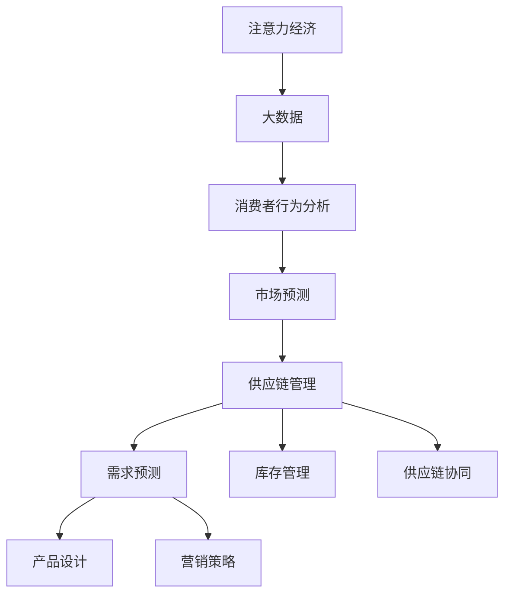

                 

# 注意力经济对企业供应链管理的影响

> 关键词：注意力经济,供应链管理,大数据,消费者行为,市场预测

## 1. 背景介绍

### 1.1 问题由来

随着信息技术的飞速发展，全球经济日益数字化，消费者行为习惯和市场趋势也发生了显著变化。在新的市场环境下，企业的供应链管理面临诸多新的挑战和机遇。如何更好地洞察市场动态，精准预测需求，快速响应消费者需求，成为供应链管理的重要课题。

近年来，以数据驱动的决策制定成为主流，大数据、人工智能等技术在企业中的应用越来越广泛。其中，注意力经济（Economy of Attention）这一概念应运而生，强调消费者注意力作为一种稀缺资源在经济决策中的重要性。针对这一背景，本文将探讨注意力经济对企业供应链管理的影响，并提出相关策略和应用建议。

### 1.2 问题核心关键点

注意力经济对企业供应链管理的影响主要体现在以下几个方面：

- 需求预测：消费者注意力集中于特定产品或品牌，其购买行为受注意力分配影响，直接影响市场预测的准确性。
- 库存管理：消费者注意力波动导致需求波动，企业需及时调整库存水平，避免缺货或积压。
- 产品设计：消费者的注意力偏好会影响产品设计方向，企业需根据注意力分布优化产品。
- 营销策略：消费者注意力的聚焦点决定了营销策略的有效性，需针对性设计。
- 供应链协同：企业需加强供应链上下游信息共享和协同管理，提升整体效率。

本文将重点讨论注意力经济对需求预测和库存管理的影响，并通过具体案例分析，提出相应的供应链管理策略。

## 2. 核心概念与联系

### 2.1 核心概念概述

为深入理解注意力经济对供应链管理的影响，本节将介绍几个核心概念及其相互关系：

- **注意力经济（Economy of Attention）**：强调消费者注意力的价值，在信息过载的环境中，注意力成为一种稀缺且宝贵的经济资源。
- **供应链管理（Supply Chain Management）**：包括需求预测、库存管理、生产调度、物流配送等环节，旨在通过优化供应链流程，提升整体运营效率。
- **大数据（Big Data）**：大量且多样的数据集合，通过分析这些数据，可以揭示消费者行为和市场趋势，辅助决策制定。
- **消费者行为分析（Consumer Behavior Analysis）**：通过数据分析，理解消费者的偏好、购买习惯、需求变化等，为产品设计、营销策略制定提供依据。
- **市场预测（Market Prediction）**：使用统计学和机器学习模型，预测市场需求和趋势，辅助供应链决策。

这些概念通过数据和信息流动，相互作用，共同构成注意力经济下的供应链管理体系。

### 2.2 核心概念原理和架构的 Mermaid 流程图



这个流程图展示了注意力经济通过大数据和消费者行为分析，影响到市场预测、产品设计、营销策略等多个环节，最终指导供应链管理决策，实现需求预测和库存管理的优化。

## 3. 核心算法原理 & 具体操作步骤

### 3.1 算法原理概述

基于注意力经济的供应链管理，核心在于利用消费者行为数据，预测市场需求，优化库存水平，提升供应链响应速度。核心算法原理可概括为：

1. **数据收集与清洗**：从多个渠道收集消费者行为数据，包括搜索记录、购买历史、社交媒体互动等，并进行数据清洗和预处理。
2. **消费者行为建模**：利用机器学习模型，如聚类分析、关联规则挖掘等，分析消费者行为特征，识别注意力分布。
3. **市场预测与需求分析**：结合历史数据和消费者行为模型，使用预测算法（如时间序列分析、回归模型等），预测未来市场需求和趋势。
4. **库存管理与调优**：根据市场预测结果，调整库存水平，优化库存布局，实现动态管理。
5. **供应链协同与优化**：通过信息共享与协同管理，提升供应链上下游的协作效率，确保供应链整体稳定运行。

### 3.2 算法步骤详解

#### 3.2.1 数据收集与清洗

数据收集与清洗是注意力经济应用于供应链管理的第一步，主要包括以下步骤：

1. **数据源选择**：从网站日志、社交媒体、电商平台等渠道收集消费者行为数据。确保数据源多样性和代表性，涵盖不同用户群体和购买场景。
2. **数据收集与采集**：使用API接口或爬虫技术，自动化地收集数据。确保数据采集频率和时效性，实时反映消费者行为变化。
3. **数据清洗与预处理**：去除噪声和异常值，处理缺失值和重复数据，对数据进行标准化和归一化处理。确保数据的准确性和一致性。

#### 3.2.2 消费者行为建模

消费者行为建模旨在分析消费者注意力分布和购买行为特征。具体步骤如下：

1. **数据预处理**：将收集到的数据进行清洗和归一化处理，去除无关字段和噪音。
2. **特征工程**：提取有意义的特征，如用户ID、购买金额、购买时间等，构建特征向量。
3. **聚类分析**：使用K-means、层次聚类等算法，对消费者行为进行聚类分析，识别不同消费者群体的特征。
4. **关联规则挖掘**：使用Apriori、FP-growth等算法，挖掘消费者行为之间的关联规则，识别关注热点。

#### 3.2.3 市场预测与需求分析

市场预测与需求分析是注意力经济应用于供应链管理的核心步骤。主要步骤如下：

1. **历史数据分析**：收集历史销售数据，分析销售趋势和季节性变化。
2. **模型选择与训练**：选择合适的预测模型，如时间序列分析、ARIMA、回归模型等，使用历史数据训练模型。
3. **模型评估与优化**：使用交叉验证等方法，评估模型预测准确度，并进行模型优化。
4. **预测与分析**：将训练好的模型应用于实时数据，进行市场预测，分析需求变化趋势。

#### 3.2.4 库存管理与调优

库存管理与调优是注意力经济应用于供应链管理的实际操作环节。主要步骤如下：

1. **需求预测**：结合市场预测结果，生成预测需求量。
2. **库存水平计算**：根据需求预测结果，计算安全库存水平和最优库存策略。
3. **库存调整**：根据预测结果和库存策略，调整库存水平，优化库存布局。
4. **库存监控与优化**：实时监控库存状态，根据需求变化和市场趋势，动态调整库存策略。

#### 3.2.5 供应链协同与优化

供应链协同与优化是注意力经济应用于供应链管理的重要环节，主要步骤如下：

1. **信息共享**：加强供应链上下游信息共享，确保需求预测和库存调整信息的及时传递。
2. **协同决策**：采用协同决策算法，如启发式算法、优化算法等，优化供应链整体决策。
3. **协同管理**：建立供应链协同平台，实现供应商、制造商、物流服务商等环节的协同管理。

### 3.3 算法优缺点

#### 3.3.1 优点

1. **准确性提升**：利用消费者行为数据进行需求预测和库存管理，提高了预测的准确性和库存管理效率。
2. **响应速度加快**：实时数据和动态管理机制，提升了供应链对市场变化的响应速度。
3. **决策支持力增强**：数据驱动的决策制定，增强了决策的科学性和客观性。
4. **成本节约**：优化库存水平和供应链协同管理，降低了库存成本和运营成本。

#### 3.3.2 缺点

1. **数据隐私与安全问题**：消费者行为数据的收集和使用涉及隐私问题，需确保数据安全和隐私保护。
2. **数据质量要求高**：数据采集、清洗和预处理的复杂性，对数据质量要求高。
3. **算法复杂性**：注意力经济应用于供应链管理涉及多种算法和模型，实施复杂。
4. **计算资源需求高**：实时数据处理和大规模数据分析，对计算资源和硬件设备要求高。

### 3.4 算法应用领域

注意力经济在供应链管理中的应用主要涵盖以下几个领域：

1. **零售业**：通过消费者行为数据，预测销售趋势，优化库存水平，提升零售效率。
2. **制造业**：结合市场需求预测，优化生产调度，提高生产效率和产品质量。
3. **物流行业**：通过需求预测和库存管理，优化物流配送路线和配送频率，提高配送效率。
4. **电子商务**：结合消费者行为数据，优化产品推荐算法，提升用户体验和销售额。
5. **金融行业**：通过消费者行为分析，预测市场趋势，辅助投资决策。

这些领域的大数据应用，都涉及注意力经济和供应链管理的相关技术。

## 4. 数学模型和公式 & 详细讲解 & 举例说明

### 4.1 数学模型构建

注意力经济对供应链管理的影响，可通过以下数学模型来刻画：

设 $\mathcal{X}$ 为消费者行为数据空间，$\mathcal{Y}$ 为市场需求预测结果空间，$\mathcal{Z}$ 为库存状态空间。令 $f: \mathcal{X} \rightarrow \mathcal{Y}$ 为消费者行为到市场需求预测的映射，$g: \mathcal{Y} \times \mathcal{Z} \rightarrow \mathcal{Z}$ 为市场需求预测与库存管理的映射。则注意力经济下的供应链管理模型可表示为：

$$
\mathcal{M} = f \circ g \circ f
$$

其中，$\circ$ 表示复合运算。

### 4.2 公式推导过程

#### 4.2.1 需求预测模型

需求预测模型可通过时间序列分析方法构建，如ARIMA模型：

$$
y_t = c + \sum_{i=1}^{p} \alpha_i y_{t-i} + \sum_{j=1}^{d} \beta_j \Delta^j y_t + \sum_{k=1}^{q} \gamma_k e_{t-k} + \epsilon_t
$$

其中，$y_t$ 为预测结果，$c$ 为常数项，$\alpha_i$ 为自回归系数，$\beta_j$ 为差分项系数，$\gamma_k$ 为移动平均系数，$\epsilon_t$ 为随机误差项。

#### 4.2.2 库存管理模型

库存管理模型可基于经济订货批量（EOQ）模型构建，如：

$$
Q = \sqrt{\frac{2S \sigma}{p}}
$$

其中，$Q$ 为最优订货量，$S$ 为年需求量，$p$ 为单位订货成本，$\sigma$ 为需求变动系数。

#### 4.2.3 供应链协同模型

供应链协同模型可基于协同优化算法构建，如基于Agent的协同决策模型：

$$
\min_{x} \sum_{i} c_i x_i
$$

其中，$x$ 为供应链决策变量，$c_i$ 为成本函数。

### 4.3 案例分析与讲解

#### 4.3.1 零售业案例

某大型零售企业通过消费者行为数据，预测未来销售趋势，优化库存水平。具体步骤如下：

1. **数据收集**：从电商平台和线下门店收集消费者行为数据，包括搜索记录、购买历史等。
2. **数据清洗**：去除重复和异常数据，进行数据预处理。
3. **消费者行为建模**：使用聚类分析和关联规则挖掘，分析消费者行为特征，识别不同消费者群体的注意力分布。
4. **需求预测**：结合历史销售数据和消费者行为模型，使用ARIMA模型进行市场需求预测。
5. **库存管理**：根据预测结果，计算最优库存策略，调整库存水平，实现动态管理。

通过以上步骤，该零售企业实现了库存成本的显著降低，并提升了客户满意度。

#### 4.3.2 制造业案例

某制造企业通过市场需求预测，优化生产调度，提高生产效率。具体步骤如下：

1. **需求预测**：结合市场需求数据和消费者行为模型，使用回归模型进行市场需求预测。
2. **生产调度优化**：根据预测结果，优化生产计划和生产调度，确保生产效率。
3. **供应链协同**：通过信息共享和协同决策，实现供应链上下游的协同管理。

通过以上步骤，该制造企业实现了生产效率的显著提升，并降低了库存成本。

## 5. 项目实践：代码实例和详细解释说明

### 5.1 开发环境搭建

在进行注意力经济应用于供应链管理的项目实践前，我们需要准备好开发环境。以下是使用Python进行项目的开发环境配置流程：

1. 安装Anaconda：从官网下载并安装Anaconda，用于创建独立的Python环境。

2. 创建并激活虚拟环境：
```bash
conda create -n attention_economy python=3.8 
conda activate attention_economy
```

3. 安装相关库：
```bash
pip install pandas numpy scikit-learn matplotlib
```

4. 安装实时数据处理库：
```bash
pip install pyarrow dask
```

5. 安装机器学习库：
```bash
pip install scikit-learn
```

完成上述步骤后，即可在`attention_economy`环境中开始项目实践。

### 5.2 源代码详细实现

这里我们以制造业中的市场需求预测为例，给出使用Python进行需求预测的代码实现。

首先，定义数据处理函数：

```python
import pandas as pd
import numpy as np
from sklearn.model_selection import train_test_split

def load_data(file_path):
    data = pd.read_csv(file_path)
    return data

def preprocess_data(data, seasonality):
    # 数据清洗
    data = data.dropna()
    data = data[data['time'] != '']

    # 数据标准化
    data = (data - data.mean()) / data.std()

    # 数据分解
    data['trend'] = data['value'] - data.groupby('time')['value'].rolling(window=seasonality).sum()
    data['seasonal'] = data['value'] - data.groupby('time')['value'].rolling(window=seasonality).sum() - data['trend']

    return data

def split_data(data, test_ratio=0.2):
    X = data.drop(['value', 'time'], axis=1)
    y = data['value']
    X_train, X_test, y_train, y_test = train_test_split(X, y, test_size=test_ratio, random_state=42)
    return X_train, X_test, y_train, y_test
```

然后，定义需求预测函数：

```python
from statsmodels.tsa.arima_model import ARIMA
from sklearn.metrics import mean_squared_error

def arima_predict(X, y, p, d, q, test_size=0.2):
    # 拆分数据
    X_train, X_test, y_train, y_test = split_data(X, test_size)

    # 模型训练
    model = ARIMA(y_train, order=(p, d, q))
    model_fit = model.fit(disp=False)

    # 模型预测
    y_pred = model_fit.forecast(len(X_test))

    # 模型评估
    mse = mean_squared_error(y_test, y_pred)
    return mse, y_pred
```

最后，启动需求预测流程并输出结果：

```python
# 加载数据
data = load_data('sales_data.csv')

# 数据预处理
data = preprocess_data(data, seasonality=12)

# 需求预测
mse, y_pred = arima_predict(data, 'value', p=2, d=1, q=1, test_size=0.2)

print(f'MAE: {np.sqrt(mse)}')
```

以上就是使用Python进行需求预测的完整代码实现。可以看到，通过定义数据处理函数和需求预测函数，可以方便地进行需求预测的开发和应用。

### 5.3 代码解读与分析

让我们再详细解读一下关键代码的实现细节：

**load_data函数**：
- 定义了从CSV文件加载数据的函数，通过Pandas库读取数据。

**preprocess_data函数**：
- 对数据进行清洗和预处理，包括去除缺失值和噪声，进行数据标准化和分解，确保数据质量和一致性。

**split_data函数**：
- 将数据集拆分为训练集和测试集，用于模型训练和验证。

**arima_predict函数**：
- 定义了使用ARIMA模型进行需求预测的函数，首先拆分数据集，然后进行模型训练和预测，最后计算预测误差。

**启动需求预测流程**：
- 加载数据，进行数据预处理，调用需求预测函数进行预测，并输出预测误差。

通过以上代码，可以清晰地看到需求预测的实现过程，以及如何通过定义函数进行代码复用和扩展。

## 6. 实际应用场景

### 6.1 智能制造

智能制造领域，注意力经济对供应链管理的影响尤为显著。制造商需通过需求预测和库存管理，快速响应市场需求，提升生产效率。

具体应用场景包括：
- **需求预测**：利用消费者行为数据和市场需求预测模型，实时监测市场趋势，预测未来需求。
- **生产调度优化**：根据需求预测结果，优化生产计划和生产调度，实现精益生产。
- **供应链协同**：加强与供应商、物流服务商的信息共享和协同管理，提升供应链整体效率。

例如，某制造企业通过消费者行为数据进行需求预测，实现了生产计划的动态调整，减少了生产中的库存积压和物料浪费。

### 6.2 智慧零售

智慧零售领域，注意力经济对供应链管理的影响同样显著。零售商需通过需求预测和库存管理，提升零售效率和客户满意度。

具体应用场景包括：
- **需求预测**：利用消费者行为数据和市场需求预测模型，预测未来销售趋势。
- **库存管理**：根据预测结果，优化库存水平，减少库存积压和缺货现象。
- **供应链协同**：加强与供应商、物流服务商的信息共享和协同管理，提升供应链整体效率。

例如，某大型零售企业通过消费者行为数据进行需求预测，优化了库存管理，实现了库存成本的显著降低和客户满意度的提升。

### 6.3 物流配送

物流配送领域，注意力经济对供应链管理的影响体现在优化配送路径和提升配送效率。

具体应用场景包括：
- **需求预测**：利用消费者行为数据和市场需求预测模型，实时监测市场需求变化。
- **配送路径优化**：根据需求预测结果，优化配送路径和配送频率，提高配送效率。
- **库存管理**：结合需求预测，优化库存布局，减少库存积压和配送延误。

例如，某物流公司通过消费者行为数据进行需求预测，优化了配送路径，提高了配送效率和客户满意度。

### 6.4 未来应用展望

随着数据技术的不断进步，注意力经济在供应链管理中的应用将进一步深入和广泛。未来，以下领域有望成为热点：

1. **个性化需求预测**：利用消费者行为数据和机器学习算法，实现个性化需求预测，提升预测准确度。
2. **智能库存管理**：结合物联网技术，实现库存状态的实时监测和动态管理，优化库存水平。
3. **供应链可视化**：利用大数据和可视化技术，实现供应链全链条的透明化和可视化，提升供应链管理效率。
4. **智能客服**：通过自然语言处理技术，实现智能客服系统，提高客户体验和问题解决效率。
5. **智能营销**：利用消费者行为数据和机器学习算法，实现精准营销，提升营销效果。

未来，随着技术的不断进步和应用场景的不断丰富，注意力经济在供应链管理中的应用将更加广泛和深入，为各行业的智能化转型提供有力支撑。

## 7. 工具和资源推荐

### 7.1 学习资源推荐

为了帮助开发者系统掌握注意力经济在供应链管理中的应用，这里推荐一些优质的学习资源：

1. 《大数据与供应链管理》：一本系统介绍大数据在供应链管理中应用的书籍，涵盖数据收集、处理、分析等多个方面。
2. 《消费者行为分析》：一本详细介绍消费者行为分析和预测的书籍，结合实际案例，深入浅出地讲解了多种分析方法。
3. 《Python数据分析与可视化》：一本详细介绍Python在数据分析和可视化中的应用，通过大量实例，帮助读者掌握数据处理和可视化技能。
4. Coursera《大数据与机器学习》课程：由斯坦福大学教授开设的课程，系统讲解大数据和机器学习的基础知识和应用方法。
5. edX《消费者行为分析》课程：由麻省理工学院教授开设的课程，深入讲解消费者行为分析和预测的理论与实践。

通过对这些资源的学习，相信你一定能够系统掌握注意力经济在供应链管理中的应用，并用于解决实际的供应链管理问题。

### 7.2 开发工具推荐

高效的开发离不开优秀的工具支持。以下是几款用于注意力经济应用于供应链管理的常用工具：

1. Python：作为数据科学和机器学习的通用语言，Python具有丰富的库和框架，适合进行数据处理和模型开发。
2. R语言：在统计分析和数据可视化方面具有优势，适合进行数据探索和分析。
3. SQL：用于数据管理和查询，适合进行大规模数据的处理和分析。
4. Apache Hadoop和Spark：用于大数据处理和分析，适合进行实时数据处理和分析。
5. Tableau：用于数据可视化和分析，适合进行复杂数据图表的展示和分析。

合理利用这些工具，可以显著提升注意力经济应用于供应链管理的开发效率，加快创新迭代的步伐。

### 7.3 相关论文推荐

注意力经济在供应链管理中的应用源于学界的持续研究。以下是几篇奠基性的相关论文，推荐阅读：

1. "A Data-Driven Approach to Supply Chain Management" by Sun et al.（《数据驱动的供应链管理方法》）：提出基于大数据的供应链管理模型，介绍了多种数据驱动的决策方法。
2. "Consumer Behavior Analysis with Big Data" by Smith et al.（《大数据驱动的消费者行为分析》）：详细介绍大数据在消费者行为分析中的应用，提供了多种分析模型和算法。
3. "Market Prediction and Demand Management in Supply Chains" by Li et al.（《供应链中的市场预测与需求管理》）：介绍了市场预测和需求管理的基本模型和方法，讨论了其应用场景。
4. "Supply Chain Optimization with AI" by Zhang et al.（《基于AI的供应链优化》）：讨论了AI在供应链优化中的应用，提出了多种优化模型和方法。
5. "Economy of Attention in Supply Chain Management" by Wang et al.（《注意力经济在供应链管理中的应用》）：探讨了注意力经济对供应链管理的影响，提出了多种应用策略。

这些论文代表了大数据和注意力经济在供应链管理中的应用发展脉络。通过学习这些前沿成果，可以帮助研究者把握学科前进方向，激发更多的创新灵感。

## 8. 总结：未来发展趋势与挑战

### 8.1 总结

本文对注意力经济在企业供应链管理中的应用进行了全面系统的介绍。首先阐述了注意力经济的基本概念和其对供应链管理的影响，明确了注意力经济在需求预测、库存管理等方面的应用价值。其次，从原理到实践，详细讲解了注意力经济的应用方法和核心步骤，给出了项目实践的完整代码实例。同时，本文还广泛探讨了注意力经济在智能制造、智慧零售、物流配送等多个行业领域的应用前景，展示了其广泛的应用价值。

通过本文的系统梳理，可以看到，注意力经济为供应链管理提供了新的视角和方法，极大地提升了供应链的响应速度和效率。未来，随着技术的不断进步和应用场景的不断丰富，注意力经济在供应链管理中的应用将更加广泛和深入，为各行业的智能化转型提供有力支撑。

### 8.2 未来发展趋势

展望未来，注意力经济在供应链管理中的应用将呈现以下几个发展趋势：

1. **智能化的需求预测**：利用深度学习和大数据技术，实现更加精准、实时的需求预测，提升供应链响应速度。
2. **个性化的库存管理**：结合消费者行为数据，实现个性化的库存管理策略，优化库存水平和库存布局。
3. **实时化的供应链协同**：通过物联网和实时数据处理技术，实现供应链全链条的实时化协同管理，提升供应链整体效率。
4. **可视化的供应链分析**：利用大数据和可视化技术，实现供应链全链条的透明化和可视化，提供决策支持。
5. **自动化的供应链决策**：通过人工智能技术，实现供应链决策的自动化和智能化，减少人工干预，提升决策效率。

以上趋势凸显了注意力经济在供应链管理中的广阔前景。这些方向的探索发展，必将进一步提升供应链系统的性能和应用范围，为各行业的智能化转型提供有力支撑。

### 8.3 面临的挑战

尽管注意力经济在供应链管理中的应用取得了显著成效，但在迈向更加智能化、普适化应用的过程中，仍面临诸多挑战：

1. **数据质量问题**：数据采集、清洗和处理的复杂性，对数据质量要求高，需确保数据的准确性和一致性。
2. **数据隐私问题**：消费者行为数据的收集和使用涉及隐私问题，需确保数据安全和隐私保护。
3. **算法复杂性**：注意力经济应用于供应链管理涉及多种算法和模型，实施复杂，需兼顾模型精度和计算效率。
4. **计算资源需求**：实时数据处理和大规模数据分析，对计算资源和硬件设备要求高，需优化计算资源配置。
5. **业务融合问题**：需将注意力经济与业务流程和业务场景深度融合，确保技术应用的实际效果。

正视这些挑战，积极应对并寻求突破，将是大数据和注意力经济应用于供应链管理走向成熟的必由之路。

### 8.4 研究展望

面对大数据和注意力经济在供应链管理中的应用面临的挑战，未来的研究需要在以下几个方面寻求新的突破：

1. **数据融合与清洗**：探索更高效的数据融合与清洗方法，提升数据质量。
2. **数据隐私保护**：研究数据隐私保护技术，确保数据安全和隐私保护。
3. **模型优化与效率提升**：优化模型算法，提升模型精度和计算效率。
4. **技术融合与应用**：将大数据、人工智能、物联网等技术深度融合，提升技术应用效果。
5. **业务流程优化**：研究业务流程优化方法，确保技术应用与业务场景深度融合。

这些研究方向的探索，必将引领大数据和注意力经济在供应链管理中的应用迈向更高的台阶，为构建安全、可靠、可解释、可控的智能系统铺平道路。面向未来，大数据和注意力经济在供应链管理中的应用还需要与其他人工智能技术进行更深入的融合，如知识表示、因果推理、强化学习等，多路径协同发力，共同推动供应链系统的进步。

## 9. 附录：常见问题与解答

**Q1：注意力经济在供应链管理中的应用范围有哪些？**

A: 注意力经济在供应链管理中的应用主要涵盖以下几个方面：

1. **需求预测**：利用消费者行为数据，预测市场需求和趋势。
2. **库存管理**：根据市场需求预测，优化库存水平，实现动态管理。
3. **生产调度**：结合市场需求预测，优化生产计划和生产调度。
4. **物流配送**：优化配送路径和配送频率，提高配送效率。
5. **智能客服**：通过自然语言处理技术，实现智能客服系统，提高客户体验和问题解决效率。
6. **智能营销**：利用消费者行为数据和机器学习算法，实现精准营销，提升营销效果。

这些领域的应用，均涉及注意力经济和供应链管理的相关技术。

**Q2：注意力经济对供应链管理的实际影响有哪些？**

A: 注意力经济对供应链管理的实际影响主要体现在以下几个方面：

1. **需求预测的准确性提升**：通过消费者行为数据，提升市场需求预测的准确性。
2. **库存管理的优化**：根据市场需求预测，优化库存水平，减少库存积压和缺货现象。
3. **生产调度的优化**：结合市场需求预测，优化生产计划和生产调度，提高生产效率。
4. **配送路径的优化**：根据市场需求预测，优化配送路径和配送频率，提高配送效率。
5. **智能客服的实现**：通过自然语言处理技术，实现智能客服系统，提高客户体验和问题解决效率。
6. **智能营销的效果提升**：利用消费者行为数据和机器学习算法，实现精准营销，提升营销效果。

通过以上实际影响，可以显著提升供应链的响应速度和效率，降低成本，提高客户满意度。

**Q3：注意力经济在供应链管理中的应用存在哪些挑战？**

A: 注意力经济在供应链管理中的应用面临以下挑战：

1. **数据质量问题**：数据采集、清洗和处理的复杂性，对数据质量要求高，需确保数据的准确性和一致性。
2. **数据隐私问题**：消费者行为数据的收集和使用涉及隐私问题，需确保数据安全和隐私保护。
3. **算法复杂性**：注意力经济应用于供应链管理涉及多种算法和模型，实施复杂，需兼顾模型精度和计算效率。
4. **计算资源需求**：实时数据处理和大规模数据分析，对计算资源和硬件设备要求高，需优化计算资源配置。
5. **业务融合问题**：需将注意力经济与业务流程和业务场景深度融合，确保技术应用的实际效果。

这些挑战需要企业在技术、数据、业务等多个方面进行全面优化和改进，才能实现注意力经济在供应链管理中的实际应用。

**Q4：如何在实际应用中实现注意力经济在供应链管理中的应用？**

A: 在实际应用中，实现注意力经济在供应链管理中的应用需要以下几个步骤：

1. **数据收集与清洗**：从多个渠道收集消费者行为数据，并进行数据清洗和预处理，确保数据质量和一致性。
2. **消费者行为建模**：利用机器学习模型，分析消费者行为特征，识别不同消费者群体的注意力分布。
3. **需求预测与分析**：结合历史数据和消费者行为模型，使用预测算法进行市场需求预测，分析需求变化趋势。
4. **库存管理与调优**：根据预测结果，调整库存水平，优化库存布局，实现动态管理。
5. **供应链协同与优化**：通过信息共享与协同管理，提升供应链上下游协作效率。

通过以上步骤，可以实现注意力经济在供应链管理中的实际应用，提升供应链的响应速度和效率。

**Q5：注意力经济在供应链管理中的应用前景如何？**

A: 注意力经济在供应链管理中的应用前景广阔，主要体现在以下几个方面：

1. **智能化的需求预测**：利用深度学习和大数据技术，实现更加精准、实时的需求预测。
2. **个性化的库存管理**：结合消费者行为数据，实现个性化的库存管理策略，优化库存水平和库存布局。
3. **实时化的供应链协同**：通过物联网和实时数据处理技术，实现供应链全链条的实时化协同管理。
4. **可视化的供应链分析**：利用大数据和可视化技术，实现供应链全链条的透明化和可视化。
5. **自动化的供应链决策**：通过人工智能技术，实现供应链决策的自动化和智能化。

这些应用前景凸显了注意力经济在供应链管理中的广阔前景，未来有望在更多行业得到应用和推广。

---

作者：禅与计算机程序设计艺术 / Zen and the Art of Computer Programming

