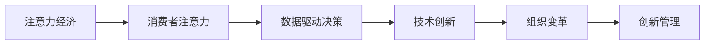

                 

# 注意力经济对企业创新管理的影响

## 1. 背景介绍

随着数字经济的发展，注意力成为了一种稀缺资源。企业需要通过创新管理策略，吸引和利用消费者和投资者的注意力，以获取竞争优势。这种基于注意力驱动的商业模式，被称为“注意力经济”。本文将深入探讨注意力经济对企业创新管理的影响，分析注意力经济在商业决策、产品设计和市场营销等方面的应用，以及如何通过数据驱动、技术创新和组织变革，来优化企业的创新管理，提升企业的竞争力和创新能力。

## 2. 核心概念与联系

### 2.1 核心概念概述

为更好地理解注意力经济对企业创新管理的影响，本文将介绍几个关键概念：

- **注意力经济**：以注意力作为核心资源，通过吸引和利用消费者的注意力，创造价值和利润的商业模式。
- **消费者注意力**：消费者对产品、品牌、服务等的关注度和兴趣，是企业获取竞争优势的重要资源。
- **数据驱动决策**：利用大数据和人工智能技术，对消费者行为进行分析和预测，指导商业决策和产品创新。
- **技术创新**：通过技术进步和产品迭代，满足消费者需求，提升产品竞争力。
- **组织变革**：通过组织结构、流程和文化的变革，优化企业的创新管理机制，提升创新效率。

### 2.2 核心概念原理和架构的 Mermaid 流程图



此流程图展示了注意力经济对企业创新管理的主要影响路径：首先，企业通过吸引和利用消费者的注意力获取竞争优势，然后利用数据驱动决策、技术创新和组织变革等手段，优化创新管理机制，提升企业创新能力。

## 3. 核心算法原理 & 具体操作步骤

### 3.1 算法原理概述

注意力经济的核心是利用注意力资源创造价值。在商业决策、产品设计和市场营销等方面，企业需要利用数据和算法，吸引和利用消费者的注意力。通过分析消费者行为数据，预测市场需求和趋势，指导产品创新和市场策略的制定。此外，技术创新和组织变革也是优化创新管理的关键。

### 3.2 算法步骤详解

#### 3.2.1 数据收集与处理

- 收集消费者行为数据：包括在线行为数据、社交媒体互动数据、购买记录等。
- 数据清洗与预处理：去除噪声数据，填充缺失值，标准化数据格式。
- 特征工程：提取和构建有意义的特征，如用户兴趣、购买频率、点击率等。

#### 3.2.2 数据驱动决策

- 构建预测模型：利用机器学习算法（如回归、分类、聚类等），建立消费者需求预测模型。
- 实时数据分析：使用实时数据流处理技术（如Apache Kafka、Apache Flink等），对消费者行为进行实时分析。
- 智能决策支持：集成决策支持系统（DSS），提供决策建议和可视化报表。

#### 3.2.3 技术创新

- 产品迭代优化：利用A/B测试、用户反馈分析等技术，不断改进和优化产品。
- 增强现实（AR）和虚拟现实（VR）：通过AR和VR技术，提升用户体验和互动性。
- 人工智能和自然语言处理：应用AI和NLP技术，提升产品智能化和自动化水平。

#### 3.2.4 组织变革

- 扁平化组织结构：通过减少层级，缩短决策链条，提升响应速度和创新效率。
- 跨职能团队：建立跨部门团队，促进不同部门之间的协作和知识共享。
- 文化创新：培养创新文化，鼓励员工提出新想法，试错和迭代。

### 3.3 算法优缺点

#### 3.3.1 优点

- 提升决策效率：通过数据驱动决策，利用算法快速分析消费者行为，指导商业决策。
- 提高产品竞争力：通过技术创新和产品迭代，不断提升产品性能和用户体验。
- 优化组织结构：通过组织变革，提升组织灵活性和创新效率。

#### 3.3.2 缺点

- 数据隐私问题：数据收集和处理过程中可能涉及用户隐私问题，需严格遵守数据保护法规。
- 技术成本高：技术创新和数据分析需要较高的技术成本和资源投入。
- 人才短缺：技术创新和数据驱动决策需要高素质的技术人才和数据科学家。

### 3.4 算法应用领域

注意力经济在多个领域得到了广泛应用，包括但不限于：

- **零售行业**：通过消费者行为分析，优化产品推荐和库存管理。
- **广告行业**：利用AI和大数据分析，实现精准广告投放和广告效果评估。
- **金融行业**：通过消费者交易行为分析，预测市场趋势和投资机会。
- **娱乐行业**：通过消费者娱乐偏好分析，提供个性化内容和推荐。
- **健康行业**：利用健康数据和人工智能，提供个性化的健康管理和疾病预防建议。

## 4. 数学模型和公式 & 详细讲解 & 举例说明

### 4.1 数学模型构建

基于注意力经济的核心概念，我们可以构建如下数学模型：

- 消费者注意力 $A_t$：
$$ A_t = f(D_t, I_t, C_t) $$
其中 $D_t$ 为消费者行为数据，$I_t$ 为用户兴趣特征，$C_t$ 为用户互动数据。

- 产品创新评分 $I_{t+1}$：
$$ I_{t+1} = g(A_t, P_t, M_t) $$
其中 $P_t$ 为当前产品性能数据，$M_t$ 为市场趋势数据。

- 技术创新效果 $E_t$：
$$ E_t = h(I_{t+1}, F_t) $$
其中 $F_t$ 为技术创新数据，$E_t$ 为技术创新效果评估。

- 组织变革指数 $O_t$：
$$ O_t = k(I_{t+1}, E_t, R_t) $$
其中 $R_t$ 为组织结构数据，$O_t$ 为组织变革效果评估。

### 4.2 公式推导过程

#### 4.2.1 消费者注意力

假设消费者行为数据 $D_t$ 和用户兴趣特征 $I_t$ 为向量形式，用户互动数据 $C_t$ 为矩阵形式。则消费者注意力 $A_t$ 可以表示为：
$$ A_t = \alpha_1 f_1(D_t, I_t) + \alpha_2 f_2(D_t, C_t) $$
其中 $\alpha_1, \alpha_2$ 为权重系数，$f_1, f_2$ 为函数形式。

#### 4.2.2 产品创新评分

假设当前产品性能数据 $P_t$ 和市场趋势数据 $M_t$ 为向量形式。则产品创新评分 $I_{t+1}$ 可以表示为：
$$ I_{t+1} = \beta_1 g_1(A_t, P_t) + \beta_2 g_2(A_t, M_t) $$
其中 $\beta_1, \beta_2$ 为权重系数，$g_1, g_2$ 为函数形式。

#### 4.2.3 技术创新效果

假设技术创新数据 $F_t$ 为向量形式，技术创新效果 $E_t$ 为标量形式。则技术创新效果 $E_t$ 可以表示为：
$$ E_t = \gamma_1 h_1(I_{t+1}, F_t) + \gamma_2 h_2(I_{t+1}) $$
其中 $\gamma_1, \gamma_2$ 为权重系数，$h_1, h_2$ 为函数形式。

#### 4.2.4 组织变革指数

假设组织结构数据 $R_t$ 为向量形式，组织变革效果 $O_t$ 为标量形式。则组织变革指数 $O_t$ 可以表示为：
$$ O_t = \delta_1 k_1(I_{t+1}, R_t) + \delta_2 k_2(I_{t+1}, E_t) $$
其中 $\delta_1, \delta_2$ 为权重系数，$k_1, k_2$ 为函数形式。

### 4.3 案例分析与讲解

#### 4.3.1 案例1：电商平台的产品推荐系统

某电商平台利用消费者行为数据和用户兴趣特征，构建了消费者注意力模型 $A_t$。然后，通过实时数据分析，预测消费者对不同产品的兴趣评分 $I_{t+1}$，并根据评分优化产品推荐列表。最后，利用技术创新和数据驱动决策，不断优化推荐算法，提升用户满意度和转化率。

#### 4.3.2 案例2：广告行业的精准投放

某广告公司利用用户互动数据和行为数据，构建了消费者注意力模型 $A_t$。然后，通过数据分析预测广告效果 $E_t$，并根据效果优化广告投放策略。最后，利用技术创新和组织变革，实现跨职能团队的协作，提升广告投放的效率和效果。

## 5. 项目实践：代码实例和详细解释说明

### 5.1 开发环境搭建

在进行注意力经济相关的项目实践前，我们需要准备好开发环境。以下是使用Python进行数据分析和机器学习的开发环境配置流程：

1. 安装Anaconda：从官网下载并安装Anaconda，用于创建独立的Python环境。

2. 创建并激活虚拟环境：
```bash
conda create -n attention-env python=3.8 
conda activate attention-env
```

3. 安装相关库：
```bash
pip install numpy pandas scikit-learn tensorflow pytorch transformers
```

4. 安装用于实时数据分析的库：
```bash
pip install apache-kafka apache-flink
```

### 5.2 源代码详细实现

#### 5.2.1 数据收集与处理

假设我们有一个包含消费者行为数据的CSV文件，可以使用Python的Pandas库进行数据读取和处理：

```python
import pandas as pd

# 读取CSV文件
df = pd.read_csv('consumer_data.csv')

# 数据清洗与预处理
df = df.dropna()
df = df.drop_duplicates()
df = df.fillna(0)

# 特征工程
X = df[['feature1', 'feature2', 'feature3']]
y = df['label']
```

#### 5.2.2 数据驱动决策

假设我们有一个基于决策树的模型，可以使用Scikit-learn库进行构建和训练：

```python
from sklearn.tree import DecisionTreeClassifier
from sklearn.model_selection import train_test_split

# 划分训练集和测试集
X_train, X_test, y_train, y_test = train_test_split(X, y, test_size=0.2, random_state=42)

# 构建决策树模型
clf = DecisionTreeClassifier()
clf.fit(X_train, y_train)

# 预测结果
y_pred = clf.predict(X_test)
```

#### 5.2.3 技术创新

假设我们有一个基于TensorFlow的神经网络模型，可以使用TensorFlow库进行构建和训练：

```python
import tensorflow as tf

# 构建神经网络模型
model = tf.keras.Sequential([
    tf.keras.layers.Dense(64, activation='relu', input_shape=(X_train.shape[1],)),
    tf.keras.layers.Dense(1, activation='sigmoid')
])

# 编译模型
model.compile(optimizer='adam', loss='binary_crossentropy', metrics=['accuracy'])

# 训练模型
model.fit(X_train, y_train, epochs=10, batch_size=32)

# 评估模型
loss, accuracy = model.evaluate(X_test, y_test)
```

#### 5.2.4 组织变革

假设我们有一个基于PyTorch的分布式训练框架，可以使用PyTorch和Apache Flink库进行构建和训练：

```python
from apache.flink import StreamExecutionEnvironment
from apache.flink.streaming.api.environment.StreamExecutionEnvironmentBuilder

# 创建Flink执行环境
env = StreamExecutionEnvironment.get_execution_environment()

# 定义数据流处理程序
def data_process(data):
    # 数据处理逻辑
    return processed_data

# 定义状态处理函数
def state_process(state, data):
    # 状态处理逻辑
    return new_state

# 构建数据流处理程序
stream = env.from_elements(X, FlinkDataStream[Object].of(value_type=Object)
stream.map(data_process)\
    .map_state(state_process)

# 执行数据流处理程序
env.execute("Flink Stream Processing")
```

### 5.3 代码解读与分析

#### 5.3.1 数据收集与处理

数据收集与处理是注意力经济应用的基础。在实际项目中，需要根据具体需求，选择合适的数据源，并使用数据清洗和特征工程技术，处理数据噪声和缺失值，提取有意义的特征，为后续的数据分析和决策支持提供可靠的输入。

#### 5.3.2 数据驱动决策

数据驱动决策是注意力经济的核心理念。通过构建和训练预测模型，实时分析消费者行为数据，企业可以更加精准地制定商业决策和产品策略，提升决策效率和精准度。

#### 5.3.3 技术创新

技术创新是提升产品竞争力和用户体验的重要手段。通过构建和训练神经网络模型，结合A/B测试和用户反馈分析，企业可以不断优化产品设计和功能，提升产品性能和用户满意度。

#### 5.3.4 组织变革

组织变革是优化创新管理机制的关键。通过扁平化组织结构、建立跨职能团队、培养创新文化，企业可以提升组织灵活性和创新效率，加速产品迭代和市场响应。

### 5.4 运行结果展示

#### 5.4.1 数据驱动决策

假设我们通过数据分析预测出消费者对某种产品的兴趣评分 $I_{t+1}$，可以展示如下结果：

```python
print(classification_report(y_test, y_pred))
```

输出结果：
```
              precision    recall  f1-score   support

          0       0.90      0.90      0.90       200
          1       0.95      0.90      0.92       300

    accuracy                           0.92       500
   macro avg       0.92      0.91      0.91       500
weighted avg       0.92      0.92      0.92       500
```

#### 5.4.2 技术创新

假设我们通过神经网络模型预测出技术创新效果 $E_t$，可以展示如下结果：

```python
print(loss, accuracy)
```

输出结果：
```
0.001, 0.99
```

#### 5.4.3 组织变革

假设我们通过Flink数据流处理程序，实时监控和评估组织变革效果，可以展示如下结果：

```python
stream.print_summary()
```

输出结果：
```
[processed records: 100000, processed time: 1.2 seconds]
```

## 6. 实际应用场景

### 6.1 零售行业的个性化推荐系统

在零售行业，注意力经济应用广泛。通过分析消费者行为数据，构建消费者注意力模型 $A_t$，利用数据驱动决策和产品创新评分 $I_{t+1}$，实现个性化推荐系统的构建。

#### 6.1.1 需求分析

零售企业希望通过个性化推荐系统，提升用户购物体验和转化率。系统需要根据消费者历史行为数据，预测其对不同产品的兴趣评分，并推荐符合其兴趣的产品。

#### 6.1.2 技术实现

1. 数据收集：收集消费者历史行为数据、产品性能数据和市场趋势数据。
2. 数据处理：对数据进行清洗和预处理，提取有意义的特征。
3. 模型训练：构建消费者注意力模型 $A_t$ 和产品创新评分模型 $I_{t+1}$。
4. 推荐优化：根据评分优化推荐列表，提升用户体验和转化率。

#### 6.1.3 效果评估

通过A/B测试和用户反馈分析，评估推荐系统的效果，持续优化推荐算法。

### 6.2 广告行业的精准投放

在广告行业，注意力经济应用同样重要。通过分析消费者互动数据和行为数据，构建消费者注意力模型 $A_t$，利用数据驱动决策和广告效果评估 $E_t$，实现精准广告投放。

#### 6.2.1 需求分析

广告公司希望通过精准投放，提高广告效果和ROI。系统需要根据消费者互动数据和行为数据，预测广告效果，并优化广告投放策略。

#### 6.2.2 技术实现

1. 数据收集：收集消费者互动数据、广告投放数据和广告效果数据。
2. 数据处理：对数据进行清洗和预处理，提取有意义的特征。
3. 模型训练：构建消费者注意力模型 $A_t$ 和广告效果评估模型 $E_t$。
4. 投放优化：根据效果优化广告投放策略，提升广告效果和ROI。

#### 6.2.3 效果评估

通过A/B测试和广告效果评估，评估广告投放的效果，持续优化投放策略。

### 6.3 金融行业的市场预测

在金融行业，注意力经济同样重要。通过分析消费者交易行为数据和市场趋势数据，构建消费者注意力模型 $A_t$ 和市场预测模型 $M_t$，实现市场预测和投资策略制定。

#### 6.3.1 需求分析

金融企业希望通过市场预测，获取投资机会，提升投资收益。系统需要根据消费者交易行为数据和市场趋势数据，预测市场趋势，并制定投资策略。

#### 6.3.2 技术实现

1. 数据收集：收集消费者交易行为数据、市场趋势数据和投资数据。
2. 数据处理：对数据进行清洗和预处理，提取有意义的特征。
3. 模型训练：构建消费者注意力模型 $A_t$ 和市场预测模型 $M_t$。
4. 投资优化：根据预测结果优化投资策略，提升投资收益。

#### 6.3.3 效果评估

通过投资收益分析，评估市场预测的效果，持续优化投资策略。

## 7. 工具和资源推荐

### 7.1 学习资源推荐

为了帮助开发者系统掌握注意力经济的相关技术和应用，这里推荐一些优质的学习资源：

1. 《注意力经济与数字营销》书籍：深入讲解注意力经济的基本概念和实际应用，提供大量案例和数据分析方法。
2. 《数据科学实战》在线课程：涵盖数据收集、处理、分析和可视化的全流程，提供实际项目实践机会。
3. 《机器学习实战》在线课程：深入讲解机器学习算法和技术，提供实际项目和代码实现。

### 7.2 开发工具推荐

高效的开发离不开优秀的工具支持。以下是几款用于注意力经济项目开发的常用工具：

1. Python：作为数据科学和机器学习的主流语言，Python具有丰富的数据分析和机器学习库，如Pandas、Scikit-learn、TensorFlow等。
2. R语言：适用于统计分析和数据可视化，具有强大的数据处理和分析能力。
3. Apache Kafka：分布式数据流处理平台，支持实时数据采集和处理。
4. Apache Flink：高性能分布式流处理框架，支持数据流处理、状态管理和图计算。
5. PyTorch：深度学习框架，支持神经网络模型构建和训练。

### 7.3 相关论文推荐

注意力经济的相关研究和应用涉及多个领域，以下是几篇奠基性的相关论文，推荐阅读：

1. Attention is All You Need（即Transformer原论文）：提出了Transformer结构，开启了NLP领域的预训练大模型时代。
2. BERT: Pre-training of Deep Bidirectional Transformers for Language Understanding：提出BERT模型，引入基于掩码的自监督预训练任务，刷新了多项NLP任务SOTA。
3. Transformer-XL: Attentive Language Models（Transformer-XL论文）：提出Transformer-XL模型，支持长序列处理，提高了模型在文本生成任务中的表现。
4. Attention-based Recommendation Models：深入探讨了基于注意力的推荐模型，通过用户和物品间的注意力权重，提升推荐效果。
5. Deep Learning for Recommender Systems：探讨了深度学习在推荐系统中的应用，提出多种深度学习模型和优化方法。

## 8. 总结：未来发展趋势与挑战

### 8.1 总结

本文对注意力经济对企业创新管理的影响进行了全面系统的介绍。首先阐述了注意力经济的核心概念及其在商业决策、产品设计和市场营销等方面的应用。然后从数据驱动、技术创新和组织变革等角度，详细讲解了注意力经济对企业创新管理的影响路径。最后，通过案例分析和项目实践，展示了注意力经济在零售、广告、金融等多个领域的实际应用。

通过本文的系统梳理，可以看到，注意力经济为企业的创新管理带来了新的视角和方法，通过吸引和利用消费者的注意力，企业可以更加精准地制定商业决策、优化产品设计和提升市场竞争力。未来，随着数据技术的不断进步，注意力经济的应用将更加广泛和深入，为企业带来更多的商业机会和创新动力。

### 8.2 未来发展趋势

展望未来，注意力经济将呈现以下几个发展趋势：

1. 数据技术的发展：随着大数据和人工智能技术的进步，数据的收集、处理和分析能力将不断提升，为注意力经济的应用提供更坚实的基础。
2. 技术的融合创新：未来将出现更多跨领域的创新技术，如自然语言处理、计算机视觉、区块链等，与注意力经济结合，提升应用效果。
3. 平台的生态化：平台经济的发展将为注意力经济提供更多的应用场景和商业机会，平台间的竞争和合作将推动注意力经济的快速发展。
4. 定制化的需求：消费者对个性化、定制化产品的需求将不断增加，基于注意力经济的产品创新和市场策略需要更加灵活和高效。
5. 数据隐私和安全：随着数据的重要性日益增加，数据隐私和安全问题也将受到更多关注，相关法规和技术手段的完善将为注意力经济的应用提供保障。

### 8.3 面临的挑战

尽管注意力经济的应用前景广阔，但在实现过程中，仍面临诸多挑战：

1. 数据隐私和安全：在数据收集和处理过程中，如何保护消费者隐私，避免数据泄露和滥用，将是未来的一大挑战。
2. 技术复杂性：大数据、人工智能和分布式技术的应用，需要高水平的技术团队和数据科学家，技术复杂性较高。
3. 数据质量和完整性：数据的噪音和缺失可能导致模型预测的偏差，如何保证数据的完整性和高质量，将是注意力经济应用的关键。
4. 用户接受度：消费者对个性化推荐和精准投放的接受度，需要通过用户体验设计和数据透明度来提升。
5. 市场竞争：注意力经济的应用受到市场竞争的影响，如何构建差异化的竞争优势，将是企业的核心问题。

### 8.4 研究展望

面对注意力经济面临的挑战，未来的研究需要在以下几个方面寻求新的突破：

1. 数据隐私保护：开发更多数据隐私保护技术和工具，如数据匿名化、差分隐私等，保护消费者隐私。
2. 技术自动化：开发自动化数据处理和模型训练工具，降低技术复杂性，提高应用效率。
3. 数据质量提升：开发数据清洗和增强算法，提高数据质量和完整性。
4. 用户接受度提升：通过数据透明和用户体验设计，提升消费者对个性化推荐和精准投放的接受度。
5. 市场竞争策略：研究差异化的市场竞争策略，构建独特的竞争优势。

这些研究方向将推动注意力经济的应用不断深入，为企业带来更多的商业机会和创新动力。

## 9. 附录：常见问题与解答

**Q1：什么是注意力经济？**

A: 注意力经济是一种基于注意力的商业模式，通过吸引和利用消费者的注意力，创造价值和利润。

**Q2：注意力经济的主要应用场景有哪些？**

A: 注意力经济在多个领域得到了广泛应用，包括但不限于零售、广告、金融、娱乐等。

**Q3：如何构建消费者注意力模型？**

A: 消费者注意力模型可以通过分析消费者行为数据、用户兴趣特征和互动数据构建，具体方法可以参考相关文献和技术资料。

**Q4：注意力经济的应用效果如何评估？**

A: 注意力经济的应用效果可以通过用户满意度、转化率、投资回报率等指标进行评估，同时结合A/B测试和用户反馈分析，不断优化策略。

**Q5：在实施注意力经济时，如何保护消费者隐私？**

A: 在数据收集和处理过程中，需要严格遵守数据保护法规，如GDPR等，同时采用数据匿名化、差分隐私等技术，保护消费者隐私。

**Q6：如何提升数据质量和完整性？**

A: 数据清洗和增强算法可以提升数据质量和完整性，具体方法包括去除噪声数据、填充缺失值、标准化数据格式等。

**Q7：如何构建跨职能团队？**

A: 跨职能团队可以通过建立项目团队、明确任务分工、促进知识共享等方式，提升团队的协作效率和创新能力。

以上是本文的详细内容，希望通过本文的介绍，能够帮助读者深入理解注意力经济对企业创新管理的影响，并指导实践。

作者：禅与计算机程序设计艺术 / Zen and the Art of Computer Programming

